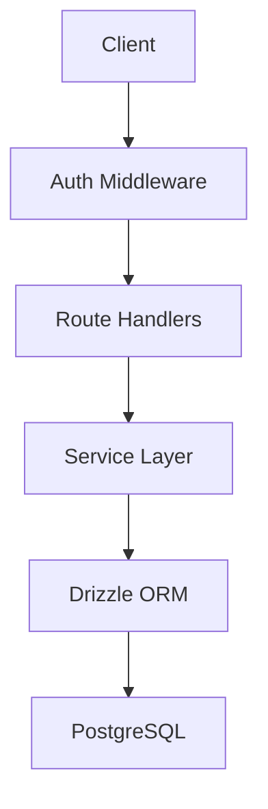
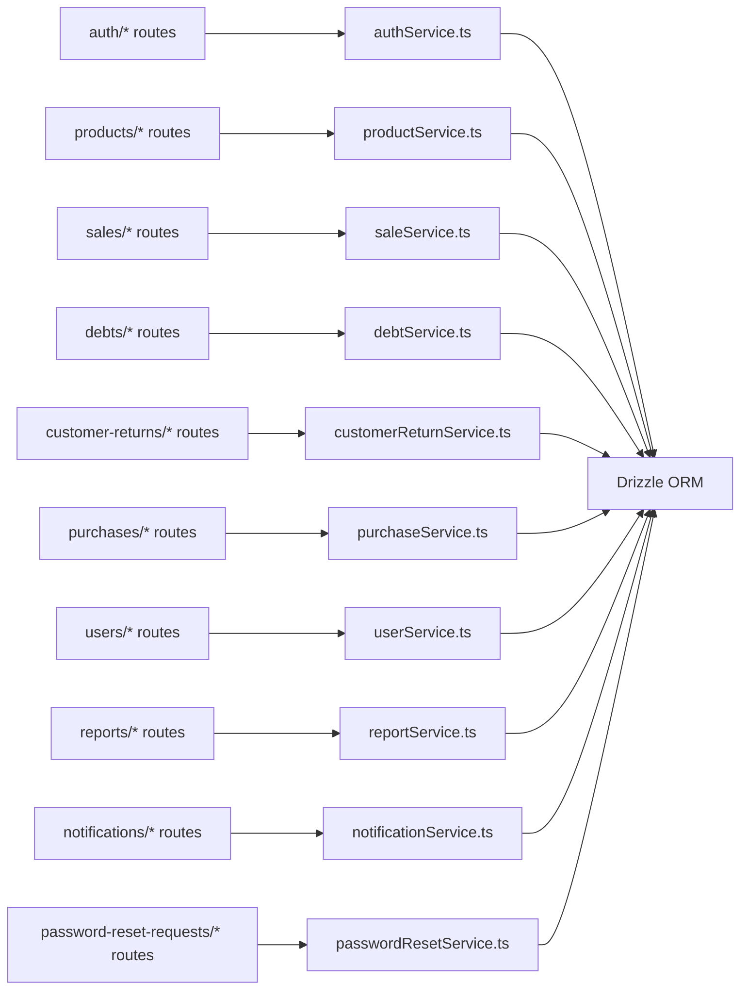

# API Reference

<cite>
**Referenced Files in This Document**
- [auth-login-route.ts](file://src/app/api/auth/login/route.ts)
- [auth-register-route.ts](file://src/app/api/auth/register/route.ts)
- [auth-logout-route.ts](file://src/app/api/auth/logout/route.ts)
- [auth-refresh-route.ts](file://src/app/api/auth/refresh/route.ts)
- [auth-me-route.ts](file://src/app/api/auth/me/route.ts)
- [auth-forgot-password-route.ts](file://src/app/api/auth/forgot-password/route.ts)
- [auth-change-password-route.ts](file://src/app/api/auth/change-password/route.ts)
- [products-route.ts](file://src/app/api/products/route.ts)
- [products-id-route.ts](file://src/app/api/products/[productId]/route.ts)
- [products-id-audit-logs-route.ts](file://src/app/api/products/[productId]/audit-logs/route.ts)
- [products-variants-route.ts](file://src/app/api/products/variants/route.ts)
- [products-variants-id-route.ts](file://src/app/api/products/variants/[variantId]/route.ts)
- [products-audit-logs-route.ts](file://src/app/api/products/audit-logs/route.ts)
- [sales-route.ts](file://src/app/api/sales/route.ts)
- [sales-id-route.ts](file://src/app/api/sales/[salesId]/route.ts)
- [sales-id-status-route.ts](file://src/app/api/sales/[salesId]/status/route.ts)
- [debts-route.ts](file://src/app/api/debts/route.ts)
- [debts-id-payment-route.ts](file://src/app/api/debts/[id]/payment/route.ts)
- [customer-returns-route.ts](file://src/app/api/customer-returns/route.ts)
- [customer-returns-id-route.ts](file://src/app/api/customer-returns/[customerReturnId]/route.ts)
- [purchases-route.ts](file://src/app/api/purchases/route.ts)
- [purchases-id-route.ts](file://src/app/api/purchases/[purchaseId]/route.ts)
- [users-route.ts](file://src/app/api/users/[id]/route.ts)
- [users-id-relations-route.ts](file://src/app/api/users/[id]/relations/route.ts)
- [categories-route.ts](file://src/app/api/categories/route.ts)
- [categories-id-route.ts](file://src/app/api/categories/[categoryId]/route.ts)
- [categories-id-relations-route.ts](file://src/app/api/categories/[categoryId]/relations/route.ts)
- [units-route.ts](file://src/app/api/units/route.ts)
- [units-id-route.ts](file://src/app/api/units/[unitId]/route.ts)
- [units-id-relations-route.ts](file://src/app/api/units/[unitId]/relations/route.ts)
- [master-customers-route.ts](file://src/app/api/master/customers/route.ts)
- [master-customers-id-route.ts](file://src/app/api/master/customers/[customerId]/route.ts)
- [master-customers-id-relations-route.ts](file://src/app/api/master/customers/[customerId]/relations/route.ts)
- [master-suppliers-route.ts](file://src/app/api/master/suppliers/route.ts)
- [master-suppliers-id-route.ts](file://src/app/api/master/suppliers/[supplierId]/route.ts)
- [master-suppliers-id-relations-route.ts](file://src/app/api/master/suppliers/[supplierId]/relations/route.ts)
- [reports-route.ts](file://src/app/api/reports/route.ts)
- [dashboard-route.ts](file://src/app/api/dashboard/route.ts)
- [stock-adjustments-route.ts](file://src/app/api/stock-adjustments/route.ts)
- [stock-mutations-route.ts](file://src/app/api/stock-mutations/route.ts)
- [operational-costs-route.ts](file://src/app/api/operational-costs/route.ts)
- [operational-costs-id-route.ts](file://src/app/api/operational-costs/[id]/route.ts)
- [tax-configs-route.ts](file://src/app/api/tax-configs/route.ts)
- [tax-configs-id-route.ts](file://src/app/api/tax-configs/[id]/route.ts)
- [notifications-route.ts](file://src/app/api/notifications/route.ts)
- [notifications-id-read-route.ts](file://src/app/api/notifications/[id]/read/route.ts)
- [notifications-clear-route.ts](file://src/app/api/notifications/clear/route.ts)
- [password-reset-requests-route.ts](file://src/app/api/password-reset-requests/route.ts)
- [password-reset-requests-id-resolve-route.ts](file://src/app/api/password-reset-requests/[id]/resolve/route.ts)
- [settings-route.ts](file://src/app/api/settings/route.ts)
- [upload-images-route.ts](file://src/app/api/upload/images/route.ts)
- [pakasir-simulate-route.ts](file://src/app/api/pakasir-simulate/route.ts)
- [pakasir-verify-route.ts](file://src/app/api/pakasir-verify/route.ts)
- [pakasir-cancel-route.ts](file://src/app/api/pakasir-cancel/route.ts)
- [pakasir-webhook-route.ts](file://src/app/api/pakasir-webhook/route.ts)
- [auth-service.ts](file://src/services/authService.ts)
- [product-service.ts](file://src/services/productService.ts)
- [sale-service.ts](file://src/services/saleService.ts)
- [purchase-service.ts](file://src/services/purchaseService.ts)
- [customer-return-service.ts](file://src/services/customerReturnService.ts)
- [debt-service.ts](file://src/services/debtService.ts)
- [user-service.ts](file://src/services/userService.ts)
- [category-service.ts](file://src/services/categoryService.ts)
- [unit-service.ts](file://src/services/unitService.ts)
- [customer-service.ts](file://src/services/customerService.ts)
- [supplier-service.ts](file://src/services/supplierService.ts)
- [report-service.ts](file://src/services/reportService.ts)
- [notification-service.ts](file://src/services/notificationService.ts)
- [password-reset-service.ts](file://src/services/passwordResetService.ts)
- [api-utils.ts](file://src/lib/api-utils.ts)
- [auth-lib.ts](file://src/lib/auth.ts)
- [axios-instance.ts](file://src/lib/axios.ts)
- [drizzle-schema.ts](file://src/drizzle/schema.ts)
- [drizzle-relations.ts](file://src/drizzle/relations.ts)
- [drizzle-meta-0004-product-audit-logs-sql.ts](file://src/drizzle/meta/0004_product_audit_logs.sql)
</cite>

## Table of Contents
1. [Introduction](#introduction)
2. [Project Structure](#project-structure)
3. [Core Components](#core-components)
4. [Architecture Overview](#architecture-overview)
5. [Detailed Component Analysis](#detailed-component-analysis)
6. [Dependency Analysis](#dependency-analysis)
7. [Performance Considerations](#performance-considerations)
8. [Troubleshooting Guide](#troubleshooting-guide)
9. [Conclusion](#conclusion)

## Introduction
This document provides comprehensive API documentation for the POS application’s RESTful endpoints. It covers authentication, product management, sales processing, purchases, customers, reporting, users, and auxiliary modules. For each endpoint, we specify HTTP methods, URL patterns, request/response schemas, authentication requirements, and error handling. Practical examples, parameter descriptions, and common use cases are included to aid integration.

## Project Structure
The API follows Next.js App Router conventions with route handlers under src/app/api. Each module exposes CRUD and specialized endpoints grouped by domain (authentication, products, sales, purchases, customers, users, reports, etc.). Services encapsulate business logic and data access, while Drizzle ORM manages database schemas and relations.

```mermaid
graph TB
subgraph "API Routes"
AUTH["Authentication<br/>login, register, logout, refresh, me,<br/>forgot-password, change-password"]
PRODUCTS["Products<br/>CRUD, variants, audit-logs"]
SALES["Sales<br/>CRUD, status updates"]
PURCHASES["Purchases<br/>CRUD"]
CUSTOMERS["Customers<br/>CRUD, relations"]
SUPPLIERS["Suppliers<br/>CRUD, relations"]
USERS["Users<br/>CRUD, relations"]
REPORTS["Reports"]
DASHBOARD["Dashboard"]
STOCK["Stock Adjustments & Mutations"]
COSTS["Operational Costs & Tax Configs"]
NOTIFICATIONS["Notifications"]
RESET["Password Reset Requests"]
SETTINGS["Settings"]
UPLOAD["Upload Images"]
PAKASIR["Pakasir QRIS"]
end
subgraph "Services"
S_AUTH["authService.ts"]
S_PRODUCTS["productService.ts"]
S_SALES["saleService.ts"]
S_PURCHASES["purchaseService.ts"]
S_CUSTOMERS["customerService.ts"]
S_SUPPLIERS["supplierService.ts"]
S_USERS["userService.ts"]
S_REPORTS["reportService.ts"]
S_NOTIF["notificationService.ts"]
S_RESET["passwordResetService.ts"]
end
AUTH --> S_AUTH
PRODUCTS --> S_PRODUCTS
SALES --> S_SALES
PURCHASES --> S_PURCHASES
CUSTOMERS --> S_CUSTOMERS
SUPPLIERS --> S_SUPPLIERS
USERS --> S_USERS
REPORTS --> S_REPORTS
NOTIFICATIONS --> S_NOTIF
RESET --> S_RESET
```

**Diagram sources**
- [auth-login-route.ts](file://src/app/api/auth/login/route.ts)
- [products-route.ts](file://src/app/api/products/route.ts)
- [sales-route.ts](file://src/app/api/sales/route.ts)
- [purchases-route.ts](file://src/app/api/purchases/route.ts)
- [master-customers-route.ts](file://src/app/api/master/customers/route.ts)
- [master-suppliers-route.ts](file://src/app/api/master/suppliers/route.ts)
- [users-route.ts](file://src/app/api/users/[id]/route.ts)
- [reports-route.ts](file://src/app/api/reports/route.ts)
- [notifications-route.ts](file://src/app/api/notifications/route.ts)
- [password-reset-requests-route.ts](file://src/app/api/password-reset-requests/route.ts)
- [auth-service.ts](file://src/services/authService.ts)
- [product-service.ts](file://src/services/productService.ts)
- [sale-service.ts](file://src/services/saleService.ts)
- [purchase-service.ts](file://src/services/purchaseService.ts)
- [customer-service.ts](file://src/services/customerService.ts)
- [supplier-service.ts](file://src/services/supplierService.ts)
- [user-service.ts](file://src/services/userService.ts)
- [report-service.ts](file://src/services/reportService.ts)
- [notification-service.ts](file://src/services/notificationService.ts)
- [password-reset-service.ts](file://src/services/passwordResetService.ts)

**Section sources**
- [auth-login-route.ts](file://src/app/api/auth/login/route.ts)
- [auth-register-route.ts](file://src/app/api/auth/register/route.ts)
- [auth-logout-route.ts](file://src/app/api/auth/logout/route.ts)
- [auth-refresh-route.ts](file://src/app/api/auth/refresh/route.ts)
- [auth-me-route.ts](file://src/app/api/auth/me/route.ts)
- [auth-forgot-password-route.ts](file://src/app/api/auth/forgot-password/route.ts)
- [auth-change-password-route.ts](file://src/app/api/auth/change-password/route.ts)
- [products-route.ts](file://src/app/api/products/route.ts)
- [products-id-route.ts](file://src/app/api/products/[productId]/route.ts)
- [products-id-audit-logs-route.ts](file://src/app/api/products/[productId]/audit-logs/route.ts)
- [products-variants-route.ts](file://src/app/api/products/variants/route.ts)
- [products-variants-id-route.ts](file://src/app/api/products/variants/[variantId]/route.ts)
- [products-audit-logs-route.ts](file://src/app/api/products/audit-logs/route.ts)
- [sales-route.ts](file://src/app/api/sales/route.ts)
- [sales-id-route.ts](file://src/app/api/sales/[salesId]/route.ts)
- [sales-id-status-route.ts](file://src/app/api/sales/[salesId]/status/route.ts)
- [debts-route.ts](file://src/app/api/debts/route.ts)
- [debts-id-payment-route.ts](file://src/app/api/debts/[id]/payment/route.ts)
- [customer-returns-route.ts](file://src/app/api/customer-returns/route.ts)
- [customer-returns-id-route.ts](file://src/app/api/customer-returns/[customerReturnId]/route.ts)
- [purchases-route.ts](file://src/app/api/purchases/route.ts)
- [purchases-id-route.ts](file://src/app/api/purchases/[purchaseId]/route.ts)
- [users-route.ts](file://src/app/api/users/[id]/route.ts)
- [users-id-relations-route.ts](file://src/app/api/users/[id]/relations/route.ts)
- [categories-route.ts](file://src/app/api/categories/route.ts)
- [categories-id-route.ts](file://src/app/api/categories/[categoryId]/route.ts)
- [categories-id-relations-route.ts](file://src/app/api/categories/[categoryId]/relations/route.ts)
- [units-route.ts](file://src/app/api/units/route.ts)
- [units-id-route.ts](file://src/app/api/units/[unitId]/route.ts)
- [units-id-relations-route.ts](file://src/app/api/units/[unitId]/relations/route.ts)
- [master-customers-route.ts](file://src/app/api/master/customers/route.ts)
- [master-customers-id-route.ts](file://src/app/api/master/customers/[customerId]/route.ts)
- [master-customers-id-relations-route.ts](file://src/app/api/master/customers/[customerId]/relations/route.ts)
- [master-suppliers-route.ts](file://src/app/api/master/suppliers/route.ts)
- [master-suppliers-id-route.ts](file://src/app/api/master/suppliers/[supplierId]/route.ts)
- [master-suppliers-id-relations-route.ts](file://src/app/api/master/suppliers/[supplierId]/relations/route.ts)
- [reports-route.ts](file://src/app/api/reports/route.ts)
- [dashboard-route.ts](file://src/app/api/dashboard/route.ts)
- [stock-adjustments-route.ts](file://src/app/api/stock-adjustments/route.ts)
- [stock-mutations-route.ts](file://src/app/api/stock-mutations/route.ts)
- [operational-costs-route.ts](file://src/app/api/operational-costs/route.ts)
- [operational-costs-id-route.ts](file://src/app/api/operational-costs/[id]/route.ts)
- [tax-configs-route.ts](file://src/app/api/tax-configs/route.ts)
- [tax-configs-id-route.ts](file://src/app/api/tax-configs/[id]/route.ts)
- [notifications-route.ts](file://src/app/api/notifications/route.ts)
- [notifications-id-read-route.ts](file://src/app/api/notifications/[id]/read/route.ts)
- [notifications-clear-route.ts](file://src/app/api/notifications/clear/route.ts)
- [password-reset-requests-route.ts](file://src/app/api/password-reset-requests/route.ts)
- [password-reset-requests-id-resolve-route.ts](file://src/app/api/password-reset-requests/[id]/resolve/route.ts)
- [settings-route.ts](file://src/app/api/settings/route.ts)
- [upload-images-route.ts](file://src/app/api/upload/images/route.ts)
- [pakasir-simulate-route.ts](file://src/app/api/pakasir-simulate/route.ts)
- [pakasir-verify-route.ts](file://src/app/api/pakasir-verify/route.ts)
- [pakasir-cancel-route.ts](file://src/app/api/pakasir-cancel/route.ts)
- [pakasir-webhook-route.ts](file://src/app/api/pakasir-webhook/route.ts)

## Core Components
- Authentication: JWT-based session management via login, register, logout, refresh, me, forgot-password, change-password.
- Product Management: CRUD for products and variants, audit logging, and global audit log aggregation.
- Sales Processing: Cash and QRIS payment flows, debt management, return handling, and sale status updates.
- Purchases: Supplier integration and purchase order lifecycle.
- Customer Management: Customer profiles and return handling.
- Reporting: Financial and inventory analytics.
- Users: Role-based access control and user administration.
- Notifications: Notification read/unread and clearing.
- Operational Cost & Tax: Operational costs and tax configurations.
- Stock: Stock adjustments and mutations.
- Settings & Uploads: Store settings and image uploads.
- QRIS (Pakasir): Payment simulation, verification, cancellation, and webhook handling.

**Section sources**
- [auth-service.ts](file://src/services/authService.ts)
- [product-service.ts](file://src/services/productService.ts)
- [sale-service.ts](file://src/services/saleService.ts)
- [purchase-service.ts](file://src/services/purchaseService.ts)
- [customer-return-service.ts](file://src/services/customerReturnService.ts)
- [debt-service.ts](file://src/services/debtService.ts)
- [user-service.ts](file://src/services/userService.ts)
- [report-service.ts](file://src/services/reportService.ts)
- [notification-service.ts](file://src/services/notificationService.ts)
- [password-reset-service.ts](file://src/services/passwordResetService.ts)

## Architecture Overview
The API is organized around domain-driven routes with service-layer orchestration. Authentication middleware enforces bearer tokens for protected routes. Services encapsulate business rules and coordinate with Drizzle ORM for persistence.

**Diagram sources**
- [auth-lib.ts](file://src/lib/auth.ts)
- [axios-instance.ts](file://src/lib/axios.ts)
- [drizzle-schema.ts](file://src/drizzle/schema.ts)
- [drizzle-relations.ts](file://src/drizzle/relations.ts)

## Detailed Component Analysis

### Authentication Endpoints
- Base Path: /api/auth
- Authentication: None for login/register/forgot-password; JWT required for protected endpoints.

Endpoints:
- POST /api/auth/login
  - Purpose: Authenticate user and issue JWT.
  - Request: Credentials object.
  - Response: Access token, refresh token, user profile.
  - Errors: Invalid credentials, locked/disabled accounts.
  - Example: See [auth-login-route.ts](file://src/app/api/auth/login/route.ts).

- POST /api/auth/register
  - Purpose: Register new user.
  - Request: Registration payload (username, email, password, roles).
  - Response: Created user object.
  - Errors: Duplicate email/username, validation errors.
  - Example: See [auth-register-route.ts](file://src/app/api/auth/register/route.ts).

- POST /api/auth/logout
  - Purpose: Invalidate current session.
  - Request: None.
  - Response: Success confirmation.
  - Errors: Not authenticated.
  - Example: See [auth-logout-route.ts](file://src/app/api/auth/logout/route.ts).

- POST /api/auth/refresh
  - Purpose: Refresh access token using refresh token.
  - Request: Refresh token.
  - Response: New access token.
  - Errors: Expired or invalid refresh token.
  - Example: See [auth-refresh-route.ts](file://src/app/api/auth/refresh/route.ts).

- GET /api/auth/me
  - Purpose: Fetch current user profile.
  - Request: Authorization header (JWT).
  - Response: User object.
  - Errors: Unauthorized.
  - Example: See [auth-me-route.ts](file://src/app/api/auth/me/route.ts).

- POST /api/auth/forgot-password
  - Purpose: Initiate password reset.
  - Request: Email.
  - Response: Confirmation.
  - Errors: User not found.
  - Example: See [auth-forgot-password-route.ts](file://src/app/api/auth/forgot-password/route.ts).

- POST /api/auth/change-password
  - Purpose: Change password with current password verification.
  - Request: Current password, new password.
  - Response: Success confirmation.
  - Errors: Incorrect current password.
  - Example: See [auth-change-password-route.ts](file://src/app/api/auth/change-password/route.ts).

Security Notes:
- Tokens are managed server-side; clients should store refresh tokens securely and send access tokens in Authorization: Bearer <token>.
- Password reset requests are tracked and resolved via dedicated endpoints.

**Section sources**
- [auth-login-route.ts](file://src/app/api/auth/login/route.ts)
- [auth-register-route.ts](file://src/app/api/auth/register/route.ts)
- [auth-logout-route.ts](file://src/app/api/auth/logout/route.ts)
- [auth-refresh-route.ts](file://src/app/api/auth/refresh/route.ts)
- [auth-me-route.ts](file://src/app/api/auth/me/route.ts)
- [auth-forgot-password-route.ts](file://src/app/api/auth/forgot-password/route.ts)
- [auth-change-password-route.ts](file://src/app/api/auth/change-password/route.ts)
- [auth-service.ts](file://src/services/authService.ts)
- [auth-lib.ts](file://src/lib/auth.ts)

### Product Management Endpoints
- Base Path: /api/products

Endpoints:
- GET /api/products
  - Purpose: List products with filters and pagination.
  - Query: Filters, sorting, limit, offset.
  - Response: Product list with metadata.
  - Errors: Invalid filters.
  - Example: See [products-route.ts](file://src/app/api/products/route.ts).

- POST /api/products
  - Purpose: Create a new product.
  - Request: Product data (basic info, variants).
  - Response: Created product.
  - Errors: Validation failures, duplicate SKU.
  - Example: See [products-route.ts](file://src/app/api/products/route.ts).

- GET /api/products/[productId]
  - Purpose: Retrieve a product by ID.
  - Response: Product with relations.
  - Errors: Not found.
  - Example: See [products-id-route.ts](file://src/app/api/products/[productId]/route.ts).

- PUT /api/products/[productId]
  - Purpose: Update product.
  - Request: Updated fields.
  - Response: Updated product.
  - Errors: Not found, validation.
  - Example: See [products-id-route.ts](file://src/app/api/products/[productId]/route.ts).

- DELETE /api/products/[productId]
  - Purpose: Delete product.
  - Response: Deletion confirmation.
  - Errors: Not found, relations exist.
  - Example: See [products-id-route.ts](file://src/app/api/products/[productId]/route.ts).

- GET /api/products/[productId]/audit-logs
  - Purpose: View audit logs for a product.
  - Response: Audit log entries.
  - Errors: Not found.
  - Example: See [products-id-audit-logs-route.ts](file://src/app/api/products/[productId]/audit-logs/route.ts).

- GET /api/products/audit-logs
  - Purpose: Global product audit logs.
  - Response: Paginated audit log entries.
  - Example: See [products-audit-logs-route.ts](file://src/app/api/products/audit-logs/route.ts).

- GET /api/products/variants
  - Purpose: List variants with filters.
  - Response: Variant list.
  - Example: See [products-variants-route.ts](file://src/app/api/products/variants/route.ts).

- GET /api/products/variants/[variantId]
  - Purpose: Get variant by ID.
  - Response: Variant.
  - Errors: Not found.
  - Example: See [products-variants-id-route.ts](file://src/app/api/products/variants/[variantId]/route.ts).

- PUT /api/products/variants/[variantId]
  - Purpose: Update variant.
  - Request: Updated fields.
  - Response: Updated variant.
  - Errors: Not found, validation.
  - Example: See [products-variants-id-route.ts](file://src/app/api/products/variants/[variantId]/route.ts).

- DELETE /api/products/variants/[variantId]
  - Purpose: Delete variant.
  - Response: Deletion confirmation.
  - Errors: Not found.
  - Example: See [products-variants-id-route.ts](file://src/app/api/products/variants/[variantId]/route.ts).

Audit Logging:
- Product changes are recorded with timestamps, actor, and diffs.
- Schema: see [drizzle-meta-0004-product-audit-logs-sql.ts](file://src/drizzle/meta/0004_product_audit_logs.sql).

**Section sources**
- [products-route.ts](file://src/app/api/products/route.ts)
- [products-id-route.ts](file://src/app/api/products/[productId]/route.ts)
- [products-id-audit-logs-route.ts](file://src/app/api/products/[productId]/audit-logs/route.ts)
- [products-variants-route.ts](file://src/app/api/products/variants/route.ts)
- [products-variants-id-route.ts](file://src/app/api/products/variants/[variantId]/route.ts)
- [products-audit-logs-route.ts](file://src/app/api/products/audit-logs/route.ts)
- [drizzle-meta-0004-product-audit-logs-sql.ts](file://src/drizzle/meta/0004_product_audit_logs.sql)

### Sales Processing Endpoints
- Base Path: /api/sales

Endpoints:
- GET /api/sales
  - Purpose: List sales with filters.
  - Response: Sales list.
  - Example: See [sales-route.ts](file://src/app/api/sales/route.ts).

- POST /api/sales
  - Purpose: Create a new sale (cash or QRIS).
  - Request: Sale items, customer (optional), payment method, amount fields.
  - Response: Created sale with receipt number/status.
  - Errors: Insufficient stock, invalid items.
  - Example: See [sales-route.ts](file://src/app/api/sales/route.ts).

- GET /api/sales/[salesId]
  - Purpose: Retrieve sale details.
  - Response: Sale with items and status.
  - Errors: Not found.
  - Example: See [sales-id-route.ts](file://src/app/api/sales/[salesId]/route.ts).

- PUT /api/sales/[salesId]/status
  - Purpose: Update sale status (e.g., cancel).
  - Request: Status value.
  - Response: Updated sale.
  - Errors: Invalid status transition.
  - Example: See [sales-id-status-route.ts](file://src/app/api/sales/[salesId]/status/route.ts).

Debt Management:
- Debts are linked to sales; payments update debt balances.
- Endpoints:
  - GET /api/debts
  - POST /api/debts
  - GET /api/debts/[id]/payment
  - POST /api/debts/[id]/payment
  - See [debts-route.ts](file://src/app/api/debts/route.ts) and [debts-id-payment-route.ts](file://src/app/api/debts/[id]/payment/route.ts).

Customer Returns:
- Returns against sales and customers.
- Endpoints:
  - GET/POST /api/customer-returns
  - GET/PUT/DELETE /api/customer-returns/[customerReturnId]
  - See [customer-returns-route.ts](file://src/app/api/customer-returns/route.ts) and [customer-returns-id-route.ts](file://src/app/api/customer-returns/[customerReturnId]/route.ts).

QRIS Payments:
- Simulation, verification, cancellation, and webhook handling.
- Endpoints:
  - POST /api/pakasir-simulate
  - POST /api/pakasir-verify
  - POST /api/pakasir-cancel
  - POST /api/pakasir-webhook
  - See [pakasir-simulate-route.ts](file://src/app/api/pakasir-simulate/route.ts), [pakasir-verify-route.ts](file://src/app/api/pakasir-verify/route.ts), [pakasir-cancel-route.ts](file://src/app/api/pakasir-cancel/route.ts), [pakasir-webhook-route.ts](file://src/app/api/pakasir-webhook/route.ts).

**Section sources**
- [sales-route.ts](file://src/app/api/sales/route.ts)
- [sales-id-route.ts](file://src/app/api/sales/[salesId]/route.ts)
- [sales-id-status-route.ts](file://src/app/api/sales/[salesId]/status/route.ts)
- [debts-route.ts](file://src/app/api/debts/route.ts)
- [debts-id-payment-route.ts](file://src/app/api/debts/[id]/payment/route.ts)
- [customer-returns-route.ts](file://src/app/api/customer-returns/route.ts)
- [customer-returns-id-route.ts](file://src/app/api/customer-returns/[customerReturnId]/route.ts)
- [pakasir-simulate-route.ts](file://src/app/api/pakasir-simulate/route.ts)
- [pakasir-verify-route.ts](file://src/app/api/pakasir-verify/route.ts)
- [pakasir-cancel-route.ts](file://src/app/api/pakasir-cancel/route.ts)
- [pakasir-webhook-route.ts](file://src/app/api/pakasir-webhook/route.ts)
- [sale-service.ts](file://src/services/saleService.ts)
- [debt-service.ts](file://src/services/debtService.ts)
- [customer-return-service.ts](file://src/services/customerReturnService.ts)

### Purchase Management Endpoints
- Base Path: /api/purchases

Endpoints:
- GET /api/purchases
  - Purpose: List purchases with filters.
  - Response: Purchases list.
  - Example: See [purchases-route.ts](file://src/app/api/purchases/route.ts).

- POST /api/purchases
  - Purpose: Create purchase order.
  - Request: Supplier, items, quantities, prices.
  - Response: Created purchase.
  - Errors: Supplier not found, invalid items.
  - Example: See [purchases-route.ts](file://src/app/api/purchases/route.ts).

- GET /api/purchases/[purchaseId]
  - Purpose: Retrieve purchase details.
  - Response: Purchase with items.
  - Errors: Not found.
  - Example: See [purchases-id-route.ts](file://src/app/api/purchases/[purchaseId]/route.ts).

Supplier Master Data:
- Suppliers CRUD and relations.
- Endpoints:
  - GET/POST /api/master/suppliers
  - GET/PUT/DELETE /api/master/suppliers/[supplierId]
  - GET /api/master/suppliers/[supplierId]/relations
  - See [master-suppliers-route.ts](file://src/app/api/master/suppliers/route.ts), [master-suppliers-id-route.ts](file://src/app/api/master/suppliers/[supplierId]/route.ts), [master-suppliers-id-relations-route.ts](file://src/app/api/master/suppliers/[supplierId]/relations/route.ts).

**Section sources**
- [purchases-route.ts](file://src/app/api/purchases/route.ts)
- [purchases-id-route.ts](file://src/app/api/purchases/[purchaseId]/route.ts)
- [master-suppliers-route.ts](file://src/app/api/master/suppliers/route.ts)
- [master-suppliers-id-route.ts](file://src/app/api/master/suppliers/[supplierId]/route.ts)
- [master-suppliers-id-relations-route.ts](file://src/app/api/master/suppliers/[supplierId]/relations/route.ts)
- [purchase-service.ts](file://src/services/purchaseService.ts)
- [supplier-service.ts](file://src/services/supplierService.ts)

### Customer Management Endpoints
- Base Path: /api/master/customers

Endpoints:
- GET /api/master/customers
  - Purpose: List customers.
  - Response: Customers list.
  - Example: See [master-customers-route.ts](file://src/app/api/master/customers/route.ts).

- POST /api/master/customers
  - Purpose: Create customer.
  - Request: Customer data.
  - Response: Created customer.
  - Example: See [master-customers-route.ts](file://src/app/api/master/customers/route.ts).

- GET /api/master/customers/[customerId]
  - Purpose: Retrieve customer.
  - Response: Customer.
  - Errors: Not found.
  - Example: See [master-customers-id-route.ts](file://src/app/api/master/customers/[customerId]/route.ts).

- PUT /api/master/customers/[customerId]
  - Purpose: Update customer.
  - Request: Updated fields.
  - Response: Updated customer.
  - Errors: Not found.
  - Example: See [master-customers-id-route.ts](file://src/app/api/master/customers/[customerId]/route.ts).

- DELETE /api/master/customers/[customerId]
  - Purpose: Delete customer.
  - Response: Deletion confirmation.
  - Errors: Not found.
  - Example: See [master-customers-id-route.ts](file://src/app/api/master/customers/[customerId]/route.ts).

- GET /api/master/customers/[customerId]/relations
  - Purpose: View related records (debts, returns).
  - Response: Relations summary.
  - Example: See [master-customers-id-relations-route.ts](file://src/app/api/master/customers/[customerId]/relations/route.ts).

Returns:
- Customer returns handled via dedicated endpoint; see [customer-returns-route.ts](file://src/app/api/customer-returns/route.ts).

**Section sources**
- [master-customers-route.ts](file://src/app/api/master/customers/route.ts)
- [master-customers-id-route.ts](file://src/app/api/master/customers/[customerId]/route.ts)
- [master-customers-id-relations-route.ts](file://src/app/api/master/customers/[customerId]/relations/route.ts)
- [customer-returns-route.ts](file://src/app/api/customer-returns/route.ts)
- [customer-returns-id-route.ts](file://src/app/api/customer-returns/[customerReturnId]/route.ts)
- [customer-service.ts](file://src/services/customerService.ts)
- [customer-return-service.ts](file://src/services/customerReturnService.ts)

### Reporting Endpoints
- Base Path: /api/reports
- GET /api/reports
  - Purpose: Financial and inventory analytics.
  - Query: Date range, store, category filters.
  - Response: Aggregated metrics (sales, costs, profits, stock).
  - Example: See [reports-route.ts](file://src/app/api/reports/route.ts).

- GET /api/dashboard
  - Purpose: Dashboard summaries.
  - Response: KPIs and charts data.
  - Example: See [dashboard-route.ts](file://src/app/api/dashboard/route.ts).

**Section sources**
- [reports-route.ts](file://src/app/api/reports/route.ts)
- [dashboard-route.ts](file://src/app/api/dashboard/route.ts)
- [report-service.ts](file://src/services/reportService.ts)

### User Management Endpoints
- Base Path: /api/users
- GET /api/users
  - Purpose: List users with role filtering.
  - Response: Users list.
  - Example: See [users-route.ts](file://src/app/api/users/[id]/route.ts).

- GET /api/users/[id]
  - Purpose: Retrieve user.
  - Response: User.
  - Errors: Not found.
  - Example: See [users-route.ts](file://src/app/api/users/[id]/route.ts).

- PUT /api/users/[id]
  - Purpose: Update user (roles, profile).
  - Request: Updated fields.
  - Response: Updated user.
  - Errors: Not found.
  - Example: See [users-route.ts](file://src/app/api/users/[id]/route.ts).

- DELETE /api/users/[id]
  - Purpose: Delete user.
  - Response: Deletion confirmation.
  - Errors: Not found.
  - Example: See [users-route.ts](file://src/app/api/users/[id]/route.ts).

- GET /api/users/[id]/relations
  - Purpose: View user-related activity.
  - Response: Relations summary.
  - Example: See [users-id-relations-route.ts](file://src/app/api/users/[id]/relations/route.ts).

Role-Based Access Control:
- Users can be assigned roles; protected endpoints enforce role checks.
- Use cases: restrict access to sensitive operations (user creation, reports).

**Section sources**
- [users-route.ts](file://src/app/api/users/[id]/route.ts)
- [users-id-relations-route.ts](file://src/app/api/users/[id]/relations/route.ts)
- [user-service.ts](file://src/services/userService.ts)

### Categories, Units, and Master Data
- Categories
  - GET/POST /api/categories
  - GET/PUT/DELETE /api/categories/[categoryId]
  - GET /api/categories/[categoryId]/relations
  - See [categories-route.ts](file://src/app/api/categories/route.ts), [categories-id-route.ts](file://src/app/api/categories/[categoryId]/route.ts), [categories-id-relations-route.ts](file://src/app/api/categories/[categoryId]/relations/route.ts).

- Units
  - GET/POST /api/units
  - GET/PUT/DELETE /api/units/[unitId]
  - GET /api/units/[unitId]/relations
  - See [units-route.ts](file://src/app/api/units/route.ts), [units-id-route.ts](file://src/app/api/units/[unitId]/route.ts), [units-id-relations-route.ts](file://src/app/api/units/[unitId]/relations/route.ts).

**Section sources**
- [categories-route.ts](file://src/app/api/categories/route.ts)
- [categories-id-route.ts](file://src/app/api/categories/[categoryId]/route.ts)
- [categories-id-relations-route.ts](file://src/app/api/categories/[categoryId]/relations/route.ts)
- [units-route.ts](file://src/app/api/units/route.ts)
- [units-id-route.ts](file://src/app/api/units/[unitId]/route.ts)
- [units-id-relations-route.ts](file://src/app/api/units/[unitId]/relations/route.ts)
- [category-service.ts](file://src/services/categoryService.ts)
- [unit-service.ts](file://src/services/unitService.ts)

### Notifications, Password Reset, Settings, Uploads
- Notifications
  - GET /api/notifications
  - GET /api/notifications/[id]/read
  - POST /api/notifications/clear
  - See [notifications-route.ts](file://src/app/api/notifications/route.ts), [notifications-id-read-route.ts](file://src/app/api/notifications/[id]/read/route.ts), [notifications-clear-route.ts](file://src/app/api/notifications/clear/route.ts).

- Password Reset Requests
  - GET /api/password-reset-requests
  - POST /api/password-reset-requests/[id]/resolve
  - See [password-reset-requests-route.ts](file://src/app/api/password-reset-requests/route.ts), [password-reset-requests-id-resolve-route.ts](file://src/app/api/password-reset-requests/[id]/resolve/route.ts).

- Settings
  - GET /api/settings
  - See [settings-route.ts](file://src/app/api/settings/route.ts).

- Upload Images
  - POST /api/upload/images
  - See [upload-images-route.ts](file://src/app/api/upload/images/route.ts).

**Section sources**
- [notifications-route.ts](file://src/app/api/notifications/route.ts)
- [notifications-id-read-route.ts](file://src/app/api/notifications/[id]/read/route.ts)
- [notifications-clear-route.ts](file://src/app/api/notifications/clear/route.ts)
- [password-reset-requests-route.ts](file://src/app/api/password-reset-requests/route.ts)
- [password-reset-requests-id-resolve-route.ts](file://src/app/api/password-reset-requests/[id]/resolve/route.ts)
- [settings-route.ts](file://src/app/api/settings/route.ts)
- [upload-images-route.ts](file://src/app/api/upload/images/route.ts)
- [notification-service.ts](file://src/services/notificationService.ts)
- [password-reset-service.ts](file://src/services/passwordResetService.ts)

### Operational Costs, Taxes, Stock, and Analytics
- Operational Costs
  - GET /api/operational-costs
  - GET /api/operational-costs/[id]
  - See [operational-costs-route.ts](file://src/app/api/operational-costs/route.ts), [operational-costs-id-route.ts](file://src/app/api/operational-costs/[id]/route.ts).

- Tax Configs
  - GET /api/tax-configs
  - GET /api/tax-configs/[id]
  - See [tax-configs-route.ts](file://src/app/api/tax-configs/route.ts), [tax-configs-id-route.ts](file://src/app/api/tax-configs/[id]/route.ts).

- Stock Adjustments
  - GET /api/stock-adjustments
  - See [stock-adjustments-route.ts](file://src/app/api/stock-adjustments/route.ts).

- Stock Mutations
  - GET /api/stock-mutations
  - See [stock-mutations-route.ts](file://src/app/api/stock-mutations/route.ts).

- Cost Analytics
  - GET /api/cost-analytics
  - See [cost-analytics-route.ts](file://src/app/api/cost-analytics/route.ts).

**Section sources**
- [operational-costs-route.ts](file://src/app/api/operational-costs/route.ts)
- [operational-costs-id-route.ts](file://src/app/api/operational-costs/[id]/route.ts)
- [tax-configs-route.ts](file://src/app/api/tax-configs/route.ts)
- [tax-configs-id-route.ts](file://src/app/api/tax-configs/[id]/route.ts)
- [stock-adjustments-route.ts](file://src/app/api/stock-adjustments/route.ts)
- [stock-mutations-route.ts](file://src/app/api/stock-mutations/route.ts)
- [cost-analytics-route.ts](file://src/app/api/cost-analytics/route.ts)

## Dependency Analysis
- Route Handlers depend on Services for business logic.
- Services depend on Drizzle ORM for data access.
- Authentication relies on JWT utilities and Axios instance for internal calls.
- Notifications and password reset integrate with external systems via services.

**Diagram sources**
- [auth-login-route.ts](file://src/app/api/auth/login/route.ts)
- [products-route.ts](file://src/app/api/products/route.ts)
- [sales-route.ts](file://src/app/api/sales/route.ts)
- [debts-route.ts](file://src/app/api/debts/route.ts)
- [customer-returns-route.ts](file://src/app/api/customer-returns/route.ts)
- [purchases-route.ts](file://src/app/api/purchases/route.ts)
- [users-route.ts](file://src/app/api/users/[id]/route.ts)
- [reports-route.ts](file://src/app/api/reports/route.ts)
- [notifications-route.ts](file://src/app/api/notifications/route.ts)
- [password-reset-requests-route.ts](file://src/app/api/password-reset-requests/route.ts)
- [auth-service.ts](file://src/services/authService.ts)
- [product-service.ts](file://src/services/productService.ts)
- [sale-service.ts](file://src/services/saleService.ts)
- [debt-service.ts](file://src/services/debtService.ts)
- [customer-return-service.ts](file://src/services/customerReturnService.ts)
- [purchase-service.ts](file://src/services/purchaseService.ts)
- [user-service.ts](file://src/services/userService.ts)
- [report-service.ts](file://src/services/reportService.ts)
- [notification-service.ts](file://src/services/notificationService.ts)
- [password-reset-service.ts](file://src/services/passwordResetService.ts)
- [drizzle-schema.ts](file://src/drizzle/schema.ts)
- [drizzle-relations.ts](file://src/drizzle/relations.ts)

**Section sources**
- [drizzle-schema.ts](file://src/drizzle/schema.ts)
- [drizzle-relations.ts](file://src/drizzle/relations.ts)
- [api-utils.ts](file://src/lib/api-utils.ts)
- [auth-lib.ts](file://src/lib/auth.ts)
- [axios-instance.ts](file://src/lib/axios.ts)

## Performance Considerations
- Pagination: Use limit/offset or cursor-based pagination for large lists (products, sales, purchases, audit logs).
- Filtering: Apply indexed filters on frequently queried fields (created_at, status, customer_id).
- Caching: Cache static master data (categories, units) and aggregate reports where appropriate.
- Batch Operations: Prefer batch endpoints for bulk updates (e.g., stock adjustments).
- Token Lifespan: Balance access token expiry and refresh token rotation for UX and security.

## Troubleshooting Guide
Common Issues and Resolutions:
- Authentication Failures
  - Symptom: 401 Unauthorized on protected endpoints.
  - Resolution: Ensure Authorization header contains a valid Bearer token; refresh if expired.
  - References: [auth-refresh-route.ts](file://src/app/api/auth/refresh/route.ts), [auth-lib.ts](file://src/lib/auth.ts).

- Validation Errors
  - Symptom: 400 Bad Request with field-specific messages.
  - Resolution: Verify request payload against entity schemas; check unique constraints (email, SKU).
  - References: [products-route.ts](file://src/app/api/products/route.ts), [users-route.ts](file://src/app/api/users/[id]/route.ts).

- Not Found
  - Symptom: 404 Resource not found.
  - Resolution: Confirm resource IDs and nested relations exist.
  - References: [sales-id-route.ts](file://src/app/api/sales/[salesId]/route.ts), [purchases-id-route.ts](file://src/app/api/purchases/[purchaseId]/route.ts).

- Business Rule Violations
  - Symptom: 409 Conflict or custom error messages.
  - Resolution: Check stock availability, debt balances, and audit log constraints.
  - References: [sale-service.ts](file://src/services/saleService.ts), [debt-service.ts](file://src/services/debtService.ts).

- QRIS Payment Issues
  - Symptom: Payment verification failure or webhook mismatch.
  - Resolution: Validate signatures, amounts, and statuses; retry simulate/verify flows.
  - References: [pakasir-verify-route.ts](file://src/app/api/pakasir-verify/route.ts), [pakasir-webhook-route.ts](file://src/app/api/pakasir-webhook/route.ts).

**Section sources**
- [auth-refresh-route.ts](file://src/app/api/auth/refresh/route.ts)
- [auth-lib.ts](file://src/lib/auth.ts)
- [products-route.ts](file://src/app/api/products/route.ts)
- [users-route.ts](file://src/app/api/users/[id]/route.ts)
- [sales-id-route.ts](file://src/app/api/sales/[salesId]/route.ts)
- [purchases-id-route.ts](file://src/app/api/purchases/[purchaseId]/route.ts)
- [sale-service.ts](file://src/services/saleService.ts)
- [debt-service.ts](file://src/services/debtService.ts)
- [pakasir-verify-route.ts](file://src/app/api/pakasir-verify/route.ts)
- [pakasir-webhook-route.ts](file://src/app/api/pakasir-webhook/route.ts)

## Conclusion
This API reference documents the POS application’s REST endpoints comprehensively, including authentication, product and variant management, sales and debt handling, purchases, customers, reporting, users, and auxiliary modules. Adhering to the documented schemas, authentication requirements, and error handling ensures robust integrations. For production deployments, pair these endpoints with proper input validation, rate limiting, and monitoring.