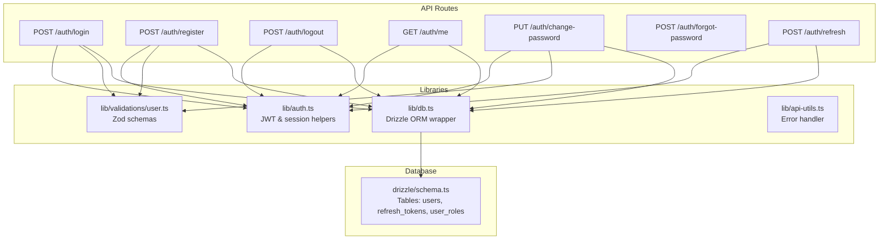
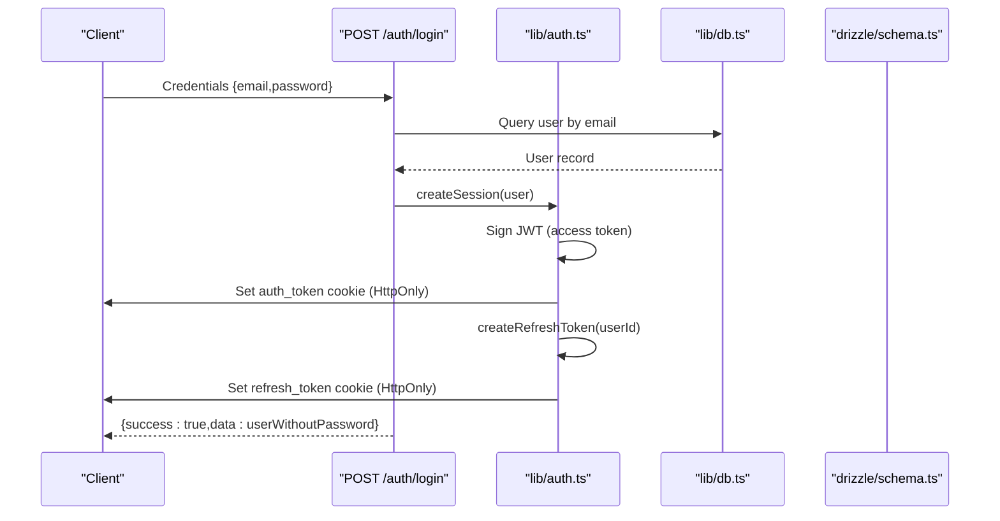
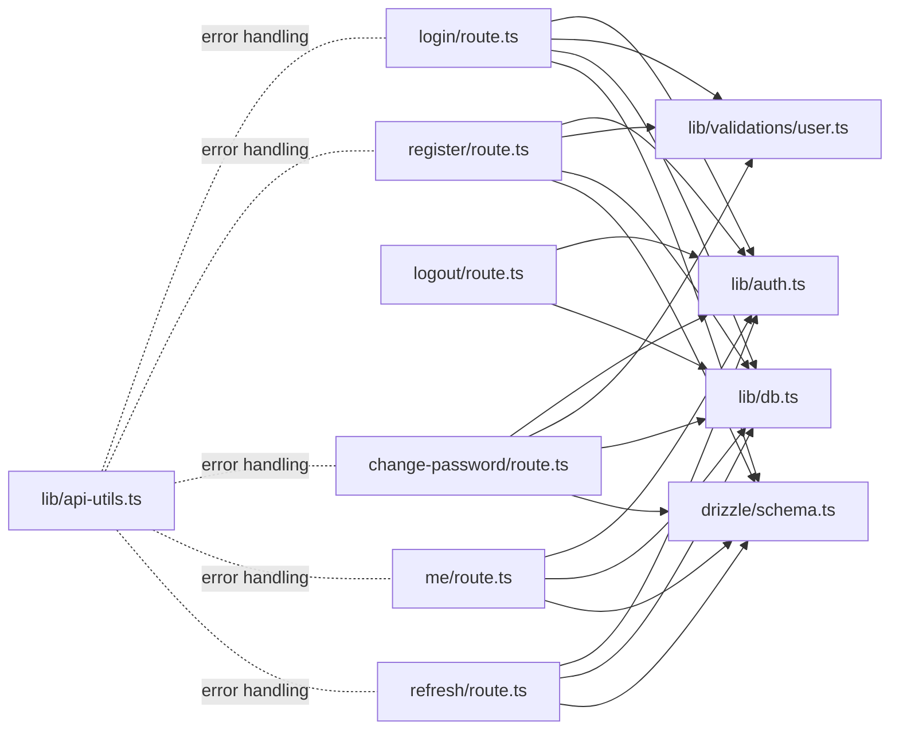

# Authentication Endpoints

<cite>
**Referenced Files in This Document**
- [login/route.ts](file://src/app/api/auth/login/route.ts)
- [register/route.ts](file://src/app/api/auth/register/route.ts)
- [logout/route.ts](file://src/app/api/auth/logout/route.ts)
- [me/route.ts](file://src/app/api/auth/me/route.ts)
- [change-password/route.ts](file://src/app/api/auth/change-password/route.ts)
- [forgot-password/route.ts](file://src/app/api/auth/forgot-password/route.ts)
- [refresh/route.ts](file://src/app/api/auth/refresh/route.ts)
- [auth.ts](file://src/lib/auth.ts)
- [user.ts](file://src/lib/validations/user.ts)
- [schema.ts](file://src/drizzle/schema.ts)
- [api-utils.ts](file://src/lib/api-utils.ts)
- [db.ts](file://src/lib/db.ts)
- [authService.ts](file://src/services/authService.ts)
</cite>

## Table of Contents
1. [Introduction](#introduction)
2. [Project Structure](#project-structure)
3. [Core Components](#core-components)
4. [Architecture Overview](#architecture-overview)
5. [Detailed Component Analysis](#detailed-component-analysis)
6. [Dependency Analysis](#dependency-analysis)
7. [Performance Considerations](#performance-considerations)
8. [Troubleshooting Guide](#troubleshooting-guide)
9. [Conclusion](#conclusion)

## Introduction
This document provides comprehensive API documentation for the authentication endpoints in the POS application. It covers login, registration, logout, profile retrieval, password change, forgot password, and refresh token functionality. For each endpoint, you will find HTTP methods, URL patterns, request/response schemas, authentication requirements, error handling, practical examples, parameter descriptions, JWT token structure, and security considerations.

## Project Structure
The authentication endpoints are implemented as Next.js App Router API routes under `src/app/api/auth/`. Supporting libraries include JWT utilities, validation schemas, database access, and API error handling.

**Diagram sources**
- [login/route.ts:1-61](file://src/app/api/auth/login/route.ts#L1-L61)
- [register/route.ts:1-101](file://src/app/api/auth/register/route.ts#L1-L101)
- [logout/route.ts:1-19](file://src/app/api/auth/logout/route.ts#L1-L19)
- [me/route.ts:1-44](file://src/app/api/auth/me/route.ts#L1-L44)
- [change-password/route.ts:1-74](file://src/app/api/auth/change-password/route.ts#L1-L74)
- [forgot-password/route.ts:1-21](file://src/app/api/auth/forgot-password/route.ts#L1-L21)
- [refresh/route.ts:1-62](file://src/app/api/auth/refresh/route.ts#L1-L62)
- [auth.ts:1-125](file://src/lib/auth.ts#L1-L125)
- [user.ts:1-75](file://src/lib/validations/user.ts#L1-L75)
- [db.ts:1-49](file://src/lib/db.ts#L1-L49)
- [schema.ts:220-285](file://src/drizzle/schema.ts#L220-L285)

**Section sources**
- [login/route.ts:1-61](file://src/app/api/auth/login/route.ts#L1-L61)
- [register/route.ts:1-101](file://src/app/api/auth/register/route.ts#L1-L101)
- [logout/route.ts:1-19](file://src/app/api/auth/logout/route.ts#L1-L19)
- [me/route.ts:1-44](file://src/app/api/auth/me/route.ts#L1-L44)
- [change-password/route.ts:1-74](file://src/app/api/auth/change-password/route.ts#L1-L74)
- [forgot-password/route.ts:1-21](file://src/app/api/auth/forgot-password/route.ts#L1-L21)
- [refresh/route.ts:1-62](file://src/app/api/auth/refresh/route.ts#L1-L62)
- [auth.ts:1-125](file://src/lib/auth.ts#L1-L125)
- [user.ts:1-75](file://src/lib/validations/user.ts#L1-L75)
- [schema.ts:220-285](file://src/drizzle/schema.ts#L220-L285)
- [db.ts:1-49](file://src/lib/db.ts#L1-L49)

## Core Components
- JWT and session management: creation, verification, deletion, and refresh token lifecycle.
- Request validation: Zod schemas for login, registration, and password change.
- Database access: Drizzle ORM with PostgreSQL tables for users, roles, and refresh tokens.
- Error handling: Centralized API error handling with status-specific responses.

**Section sources**
- [auth.ts:1-125](file://src/lib/auth.ts#L1-L125)
- [user.ts:1-75](file://src/lib/validations/user.ts#L1-L75)
- [schema.ts:220-285](file://src/drizzle/schema.ts#L220-L285)
- [api-utils.ts:1-56](file://src/lib/api-utils.ts#L1-L56)

## Architecture Overview
The authentication flow uses short-lived access tokens stored in an HttpOnly cookie and long-lived refresh tokens stored in a separate HttpOnly cookie. Access tokens are validated on protected routes, while refresh tokens are used to obtain new access tokens.

**Diagram sources**
- [login/route.ts:9-52](file://src/app/api/auth/login/route.ts#L9-L52)
- [auth.ts:18-44](file://src/lib/auth.ts#L18-L44)
- [auth.ts:77-94](file://src/lib/auth.ts#L77-L94)
- [db.ts:1-49](file://src/lib/db.ts#L1-L49)
- [schema.ts:220-285](file://src/drizzle/schema.ts#L220-L285)

## Detailed Component Analysis

### Login Endpoint
- Method: POST
- URL: `/auth/login`
- Purpose: Authenticate user with email/password and issue access and refresh tokens.
- Request Body:
  - email: string (required, valid email)
  - password: string (required, non-empty)
- Response:
  - success: boolean
  - data: user object without password
- Authentication Requirements: None (initial authentication)
- Error Responses:
  - 400: Missing credentials or validation failure
  - 401: Invalid credentials
  - 500: Internal server error
- Security Considerations:
  - Password comparison uses bcrypt.
  - Access token expires in 30 minutes.
  - Both tokens are HttpOnly cookies with SameSite strict and secure flags.

**Section sources**
- [login/route.ts:9-60](file://src/app/api/auth/login/route.ts#L9-L60)
- [user.ts:38-41](file://src/lib/validations/user.ts#L38-L41)
- [auth.ts:18-44](file://src/lib/auth.ts#L18-L44)
- [auth.ts:77-94](file://src/lib/auth.ts#L77-L94)

### Registration Endpoint
- Method: POST
- URL: `/auth/register`
- Purpose: Create a new user account with validation and role assignment.
- Request Body:
  - email: string (required, valid email)
  - name: string (required, non-empty)
  - password: string (required, minimum 6 chars, must contain uppercase, lowercase, and digit)
  - role: enum ["admin toko", "admin sistem"] (optional, defaults to "admin toko")
- Response:
  - success: boolean
  - data: user object without password
- Authentication Requirements: None (public endpoint)
- Error Responses:
  - 400: Validation failed or missing password
  - 409: Email already registered
  - 500: Registration failed
- Security Considerations:
  - Password hashed with bcrypt.
  - Transaction ensures atomic creation of user and roles.
  - Automatically logs in the newly registered user.

**Section sources**
- [register/route.ts:10-100](file://src/app/api/auth/register/route.ts#L10-L100)
- [user.ts:7-19](file://src/lib/validations/user.ts#L7-L19)
- [schema.ts:275-285](file://src/drizzle/schema.ts#L275-L285)

### Logout Endpoint
- Method: POST
- URL: `/auth/logout`
- Purpose: Invalidate current session and clean up refresh token.
- Request Body: None
- Response:
  - success: boolean
  - message: string
- Authentication Requirements: None (can be called without active session)
- Error Responses:
  - 500: Logout failed
- Security Considerations:
  - Deletes both auth_token and refresh_token cookies.
  - Removes refresh token from database.

**Section sources**
- [logout/route.ts:4-18](file://src/app/api/auth/logout/route.ts#L4-L18)
- [auth.ts:66-75](file://src/lib/auth.ts#L66-L75)
- [schema.ts:264-273](file://src/drizzle/schema.ts#L264-L273)

### Profile Endpoint
- Method: GET
- URL: `/auth/me`
- Purpose: Retrieve authenticated user information.
- Request Body: None
- Response:
  - success: boolean
  - data: user object without password
- Authentication Requirements: Requires valid access token (auth_token cookie)
- Error Responses:
  - 401: Not authenticated
  - 404: User not found
  - 500: Internal server error
- Security Considerations:
  - Verifies access token before fetching user data.

**Section sources**
- [me/route.ts:8-43](file://src/app/api/auth/me/route.ts#L8-L43)
- [auth.ts:47-59](file://src/lib/auth.ts#L47-L59)
- [schema.ts:220-249](file://src/drizzle/schema.ts#L220-L249)

### Password Change Endpoint
- Method: PUT
- URL: `/auth/change-password`
- Purpose: Change user password with current password verification.
- Request Body:
  - currentPassword: string (required, non-empty)
  - newPassword: string (required, minimum 6 chars, must contain uppercase, lowercase, and digit)
  - confirmPassword: string (required, must match newPassword)
- Response:
  - success: boolean
  - message: string
- Authentication Requirements: Requires valid access token (auth_token cookie)
- Error Responses:
  - 400: Validation failed or current password invalid
  - 401: Unauthorized
  - 404: User not found
  - 500: Internal server error
- Security Considerations:
  - Compares current password using bcrypt.
  - Hashes new password before updating.

**Section sources**
- [change-password/route.ts:10-73](file://src/app/api/auth/change-password/route.ts#L10-L73)
- [user.ts:43-58](file://src/lib/validations/user.ts#L43-L58)
- [auth.ts:47-59](file://src/lib/auth.ts#L47-L59)

### Forgot Password Endpoint
- Method: POST
- URL: `/auth/forgot-password`
- Purpose: Request password reset (currently disabled).
- Request Body:
  - email: string (required, valid email)
- Response:
  - success: boolean
  - error: string (disabled message)
- Authentication Requirements: None
- Error Responses:
  - 403: Feature disabled
- Security Considerations:
  - Endpoint returns a disabled message; no reset token generation or email delivery is implemented.

**Section sources**
- [forgot-password/route.ts:11-20](file://src/app/api/auth/forgot-password/route.ts#L11-L20)
- [user.ts:7-19](file://src/lib/validations/user.ts#L7-L19)

### Refresh Token Endpoint
- Method: POST
- URL: `/auth/refresh`
- Purpose: Obtain a new access token using a valid refresh token.
- Request Body: None
- Response:
  - success: boolean
- Authentication Requirements: Requires valid refresh_token cookie
- Error Responses:
  - 401: Refresh token invalid/expired or user not found
  - 500: Refresh failed
- Security Considerations:
  - Validates refresh token against database.
  - Optionally rotates refresh token by deleting the old one and issuing a new one.
  - Creates new access token with 30-minute expiration.

**Section sources**
- [refresh/route.ts:11-61](file://src/app/api/auth/refresh/route.ts#L11-L61)
- [auth.ts:96-109](file://src/lib/auth.ts#L96-L109)
- [auth.ts:18-44](file://src/lib/auth.ts#L18-L44)
- [schema.ts:264-273](file://src/drizzle/schema.ts#L264-L273)

## Dependency Analysis
The authentication endpoints depend on shared libraries for JWT/session management, validation, database access, and error handling.

**Diagram sources**
- [login/route.ts:1-61](file://src/app/api/auth/login/route.ts#L1-L61)
- [register/route.ts:1-101](file://src/app/api/auth/register/route.ts#L1-L101)
- [logout/route.ts:1-19](file://src/app/api/auth/logout/route.ts#L1-L19)
- [me/route.ts:1-44](file://src/app/api/auth/me/route.ts#L1-L44)
- [change-password/route.ts:1-74](file://src/app/api/auth/change-password/route.ts#L1-L74)
- [refresh/route.ts:1-62](file://src/app/api/auth/refresh/route.ts#L1-L62)
- [auth.ts:1-125](file://src/lib/auth.ts#L1-L125)
- [user.ts:1-75](file://src/lib/validations/user.ts#L1-L75)
- [db.ts:1-49](file://src/lib/db.ts#L1-L49)
- [api-utils.ts:1-56](file://src/lib/api-utils.ts#L1-L56)
- [schema.ts:220-285](file://src/drizzle/schema.ts#L220-L285)

**Section sources**
- [login/route.ts:1-61](file://src/app/api/auth/login/route.ts#L1-L61)
- [register/route.ts:1-101](file://src/app/api/auth/register/route.ts#L1-L101)
- [logout/route.ts:1-19](file://src/app/api/auth/logout/route.ts#L1-L19)
- [me/route.ts:1-44](file://src/app/api/auth/me/route.ts#L1-L44)
- [change-password/route.ts:1-74](file://src/app/api/auth/change-password/route.ts#L1-L74)
- [refresh/route.ts:1-62](file://src/app/api/auth/refresh/route.ts#L1-L62)
- [auth.ts:1-125](file://src/lib/auth.ts#L1-L125)
- [user.ts:1-75](file://src/lib/validations/user.ts#L1-L75)
- [db.ts:1-49](file://src/lib/db.ts#L1-L49)
- [api-utils.ts:1-56](file://src/lib/api-utils.ts#L1-L56)
- [schema.ts:220-285](file://src/drizzle/schema.ts#L220-L285)

## Performance Considerations
- Token Expiration: Access tokens expire in 30 minutes; refresh tokens expire in 7 days. This reduces long-lived credential exposure.
- Cookie Security: HttpOnly, SameSite strict, and secure flags protect against XSS and CSRF.
- Database Transactions: Registration uses transactions to ensure atomicity of user and role creation.
- Validation: Zod schemas prevent malformed requests and reduce unnecessary database queries.
- Error Handling: Centralized error handling minimizes repeated error logic across endpoints.

[No sources needed since this section provides general guidance]

## Troubleshooting Guide
Common issues and resolutions:
- Authentication failures:
  - Ensure the client sends the auth_token cookie for protected endpoints.
  - Verify the JWT_SECRET environment variable is configured.
- Refresh token invalid/expired:
  - Call the refresh endpoint to obtain a new access token.
  - If refresh fails, log out and log in again.
- Validation errors:
  - Check request body against Zod schemas for required fields and formats.
- Database connectivity:
  - Confirm DATABASE_URL/HYPERDRIVE connection string is correct.
- Forgot password disabled:
  - The endpoint currently returns a disabled message; contact administrator for assistance.

**Section sources**
- [auth.ts:47-59](file://src/lib/auth.ts#L47-L59)
- [auth.ts:96-109](file://src/lib/auth.ts#L96-L109)
- [api-utils.ts:3-55](file://src/lib/api-utils.ts#L3-L55)
- [db.ts:13-23](file://src/lib/db.ts#L13-L23)

## Conclusion
The authentication system provides robust, secure endpoints for user management with clear separation of concerns. Access tokens enable protected resource access, while refresh tokens manage session longevity. Validation and error handling ensure predictable behavior across endpoints. The current implementation disables the forgot password feature, which can be enabled by extending the endpoint to generate reset tokens and deliver emails.