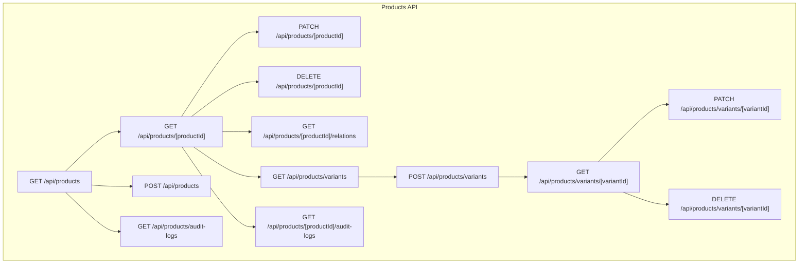
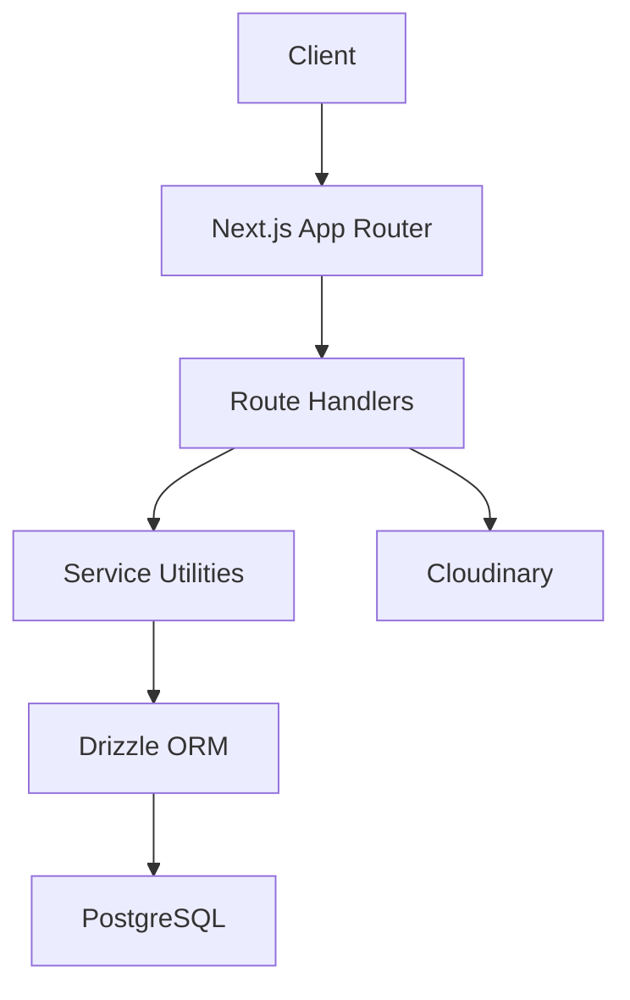
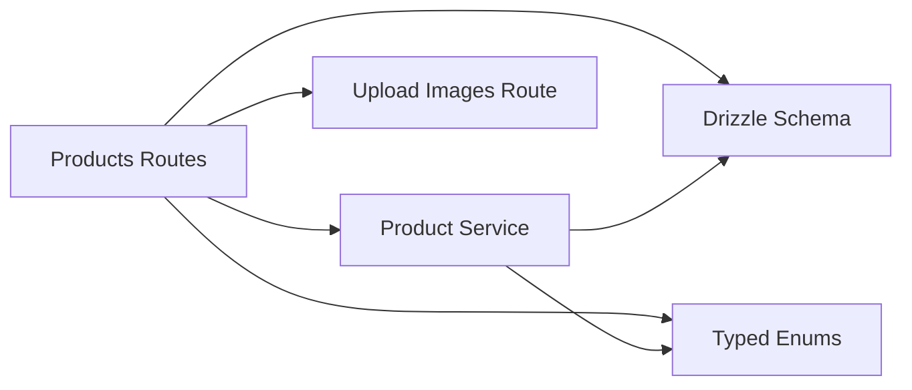

# Product Management API

<cite>
**Referenced Files in This Document**
- [route.ts](file://src/app/api/products/route.ts)
- [route.ts](file://src/app/api/products/[productId]/route.ts)
- [route.ts](file://src/app/api/products/[productId]/relations/route.ts)
- [route.ts](file://src/app/api/products/variants/route.ts)
- [route.ts](file://src/app/api/products/variants/[variantId]/route.ts)
- [route.ts](file://src/app/api/products/audit-logs/route.ts)
- [route.ts](file://src/app/api/products/[productId]/audit-logs/route.ts)
- [productService.ts](file://src/services/productService.ts)
- [schema.ts](file://src/drizzle/schema.ts)
- [type.ts](file://src/drizzle/type.ts)
- [product-utils.ts](file://src/lib/product-utils.ts)
- [route.ts](file://src/app/api/upload/images/route.ts)
</cite>

## Table of Contents
1. [Introduction](#introduction)
2. [Project Structure](#project-structure)
3. [Core Components](#core-components)
4. [Architecture Overview](#architecture-overview)
5. [Detailed Component Analysis](#detailed-component-analysis)
6. [Dependency Analysis](#dependency-analysis)
7. [Performance Considerations](#performance-considerations)
8. [Troubleshooting Guide](#troubleshooting-guide)
9. [Conclusion](#conclusion)

## Introduction
This document provides comprehensive API documentation for product management endpoints in the POS application. It covers product listing with filtering, sorting, and pagination; individual product retrieval with relations and variants; product creation with validation and image upload handling; product update with partial updates and audit trail generation; product deletion with relation checking and cascade handling; product audit log endpoints; variant management endpoints; and barcode scanning integration with bulk operations. Each endpoint specifies HTTP methods, URL patterns, request/response schemas, validation rules, and error handling, along with practical examples and product data models.

## Project Structure
The product management API is organized under the Next.js App Router at `src/app/api/products`. The routes are structured as follows:
- Product collection: `GET /api/products`, `POST /api/products`
- Individual product: `GET /api/products/[productId]`, `PATCH /api/products/[productId]`, `DELETE /api/products/[productId]`
- Relations: `GET /api/products/[productId]/relations`
- Variants: `GET /api/products/variants`, `POST /api/products/variants`, `GET /api/products/variants/[variantId]`, `PATCH /api/products/variants/[variantId]`, `DELETE /api/products/variants/[variantId]`
- Audit logs: `GET /api/products/audit-logs`, `GET /api/products/[productId]/audit-logs`

**Diagram sources**
- [route.ts](file://src/app/api/products/route.ts)
- [route.ts](file://src/app/api/products/[productId]/route.ts)
- [route.ts](file://src/app/api/products/[productId]/relations/route.ts)
- [route.ts](file://src/app/api/products/variants/route.ts)
- [route.ts](file://src/app/api/products/variants/[variantId]/route.ts)
- [route.ts](file://src/app/api/products/audit-logs/route.ts)
- [route.ts](file://src/app/api/products/[productId]/audit-logs/route.ts)

**Section sources**
- [route.ts](file://src/app/api/products/route.ts)
- [route.ts](file://src/app/api/products/[productId]/route.ts)
- [route.ts](file://src/app/api/products/[productId]/relations/route.ts)
- [route.ts](file://src/app/api/products/variants/route.ts)
- [route.ts](file://src/app/api/products/variants/[variantId]/route.ts)
- [route.ts](file://src/app/api/products/audit-logs/route.ts)
- [route.ts](file://src/app/api/products/[productId]/audit-logs/route.ts)

## Core Components
- Product entity and relations are defined in the database schema and typed enums.
- Validation and business logic are handled in service utilities and API route handlers.
- Image upload is supported via a dedicated upload endpoint integrated during product creation.
- Audit logging is currently disabled but present in code comments for restoration.

Key data models:
- Product: includes identifiers, metadata, pricing, inventory, and associations.
- Variant: represents product variations with SKU, pricing, stock, and attributes.
- Audit Log: records changes with action, field changes, and timestamps.

**Section sources**
- [schema.ts](file://src/drizzle/schema.ts)
- [type.ts](file://src/drizzle/type.ts)
- [product-utils.ts](file://src/lib/product-utils.ts)

## Architecture Overview
The product API follows a layered architecture:
- Presentation layer: Next.js App Router routes.
- Application layer: Route handlers implement CRUD operations, validation, and authorization checks.
- Domain layer: Service utilities encapsulate business logic.
- Infrastructure layer: Drizzle ORM connects to PostgreSQL; Cloudinary integration for images.

**Diagram sources**
- [route.ts](file://src/app/api/products/[productId]/route.ts)
- [schema.ts](file://src/drizzle/schema.ts)
- [product-utils.ts](file://src/lib/product-utils.ts)

## Detailed Component Analysis

### Product Listing Endpoint
- Method: GET
- URL: `/api/products`
- Purpose: Retrieve paginated product list with optional filters and sorting.
- Query parameters:
  - `page`: Page number (default depends on pagination parser).
  - `limit`: Items per page.
  - `search`: Text search across product fields.
  - `categoryId`: Filter by category ID.
  - `unitId`: Filter by unit ID.
  - `sort`: Sort field (e.g., name, createdAt).
  - `order`: Sort direction (asc/desc).
- Response: List of products with pagination metadata.
- Validation: Pagination parameters validated; filters sanitized.
- Error handling: Unauthorized and forbidden responses; database errors mapped via error handler.

Practical example:
- Request: `GET /api/products?page=1&limit=20&search=laptop&sort=name&order=asc`
- Response: `{ success: true, data: [...], meta: { total, page, limit } }`

**Section sources**
- [route.ts](file://src/app/api/products/route.ts)

### Product Creation Endpoint
- Method: POST
- URL: `/api/products`
- Purpose: Create a new product with validation and optional image upload.
- Request body:
  - Basic info: name, sku, categoryId, unitId, description.
  - Pricing: purchasePrice, sellingPrice.
  - Inventory: initialStock, reorderPoint.
  - Image: optional imageId or upload payload.
- Validation rules:
  - Required fields: name, categoryId, unitId.
  - Numeric constraints: prices non-negative, stock/reorder numeric.
  - Unique constraints: sku uniqueness enforced at database level.
  - Image upload: supported via upload endpoint; productId updated after creation.
- Image upload handling:
  - Use `/api/upload/images` to upload; receive imageId.
  - Attach imageId to product creation payload.
- Response: Created product object.
- Error handling: Unauthorized, validation failures, database constraint violations, upload errors.

Practical example:
- Request: `POST /api/products` with JSON payload including name, sku, categoryId, unitId, purchasePrice, sellingPrice, initialStock, imageId.
- Response: `{ success: true, data: { id, ... } }`

**Section sources**
- [route.ts](file://src/app/api/products/route.ts)
- [route.ts](file://src/app/api/upload/images/route.ts)

### Individual Product Retrieval
- Method: GET
- URL: `/api/products/[productId]`
- Purpose: Fetch a single product by ID.
- Path parameters:
  - productId: numeric identifier.
- Response: Product object with relations embedded.
- Error handling: Not found, unauthorized, server errors.

Practical example:
- Request: `GET /api/products/123`
- Response: `{ success: true, data: { ... } }`

**Section sources**
- [route.ts](file://src/app/api/products/[productId]/route.ts)

### Product Update Endpoint
- Method: PATCH
- URL: `/api/products/[productId]`
- Purpose: Partially update product fields with audit trail generation.
- Path parameters:
  - productId: numeric identifier.
- Request body: Partial product fields (e.g., name, sku, purchasePrice, sellingPrice, initialStock, reorderPoint, categoryId, unitId, description).
- Validation rules:
  - Field-specific constraints (e.g., non-negative prices).
  - Unique constraints preserved (e.g., sku).
- Audit trail generation:
  - Current implementation does not generate audit logs; see audit log endpoints below for planned feature.
- Response: Updated product object.
- Error handling: Unauthorized, validation failures, not found, database errors.

Practical example:
- Request: `PATCH /api/products/123` with `{ name: "Updated Name", sellingPrice: 120000 }`
- Response: `{ success: true, data: { ... } }`

**Section sources**
- [route.ts](file://src/app/api/products/[productId]/route.ts)

### Product Deletion Endpoint
- Method: DELETE
- URL: `/api/products/[productId]`
- Purpose: Delete a product after verifying admin system role and ensuring no dependent records exist.
- Path parameters:
  - productId: numeric identifier.
- Authorization: Requires admin system role.
- Relation checking and cascade handling:
  - Current implementation deletes the product directly; relation checks and cascading are not implemented in code.
- Response: Deletion confirmation message.
- Error handling: Unauthorized, forbidden, not found, database errors.

Practical example:
- Request: `DELETE /api/products/123`
- Response: `{ success: true, message: "Produk berhasil dihapus" }`

**Section sources**
- [route.ts](file://src/app/api/products/[productId]/route.ts)

### Product Relations Endpoint
- Method: GET
- URL: `/api/products/[productId]/relations`
- Purpose: Retrieve related entities for a product (e.g., variants, category, unit).
- Path parameters:
  - productId: numeric identifier.
- Response: Object containing related entities (e.g., variants array, category, unit).
- Error handling: Unauthorized, not found, server errors.

Practical example:
- Request: `GET /api/products/123/relations`
- Response: `{ success: true, data: { variants: [...], category: {...}, unit: {...} } }`

**Section sources**
- [route.ts](file://src/app/api/products/[productId]/relations/route.ts)

### Product Audit Logs Endpoint
- Method: GET
- URL: `/api/products/audit-logs`
- Purpose: Retrieve global product audit logs with filtering and pagination.
- Query parameters:
  - `page`, `limit`: Pagination.
  - `search`: Search term across relevant fields.
  - `action`: Filter by action type.
  - `dateFrom`, `dateTo`: Date range.
- Response: List of audit log entries with metadata.
- Status: Feature is currently disabled in code (commented out).

Practical example:
- Request: `GET /api/products/audit-logs?page=1&limit=50&action=UPDATE`
- Response: `{ success: true, data: [...], meta: {...} }`

**Section sources**
- [route.ts](file://src/app/api/products/audit-logs/route.ts)

### Product Audit Logs by Product Endpoint
- Method: GET
- URL: `/api/products/[productId]/audit-logs`
- Purpose: Retrieve audit logs for a specific product.
- Path parameters:
  - productId: numeric identifier.
- Query parameters:
  - `page`, `limit`: Pagination.
- Response: List of audit log entries for the product with metadata.
- Status: Feature is currently disabled in code (commented out).

Practical example:
- Request: `GET /api/products/123/audit-logs?page=1&limit=20`
- Response: `{ success: true, data: [...], meta: {...} }`

**Section sources**
- [route.ts](file://src/app/api/products/[productId]/audit-logs/route.ts)

### Variant Management Endpoints
- List variants:
  - Method: GET
  - URL: `/api/products/variants`
  - Purpose: Retrieve paginated variants with optional filters.
  - Query parameters: `page`, `limit`, `search`, `productId`.
  - Response: Variants list with metadata.
- Create variant:
  - Method: POST
  - URL: `/api/products/variants`
  - Purpose: Create a new variant.
  - Request body: variant fields (e.g., productId, name, sku, purchasePrice, sellingPrice, stock).
  - Response: Created variant object.
- Get variant:
  - Method: GET
  - URL: `/api/products/variants/[variantId]`
  - Purpose: Fetch a single variant by ID.
  - Path parameters: variantId.
  - Response: Variant object.
- Update variant:
  - Method: PATCH
  - URL: `/api/products/variants/[variantId]`
  - Purpose: Partially update variant fields.
  - Path parameters: variantId.
  - Request body: Partial variant fields.
  - Response: Updated variant object.
- Delete variant:
  - Method: DELETE
  - URL: `/api/products/variants/[variantId]`
  - Purpose: Delete a variant.
  - Path parameters: variantId.
  - Response: Deletion confirmation.
- Error handling: Unauthorized, validation failures, not found, database errors.

Practical example (create variant):
- Request: `POST /api/products/variants` with `{ productId: 123, name: "Variant A", sku: "VA-001", stock: 100 }`
- Response: `{ success: true, data: { id, ... } }`

**Section sources**
- [route.ts](file://src/app/api/products/variants/route.ts)
- [route.ts](file://src/app/api/products/variants/[variantId]/route.ts)

### Barcode Scanning Integration and Bulk Operations
- Barcode scanning:
  - The frontend integrates a camera-based barcode scanner component for real-time scanning.
  - On successful scan, the application triggers product search or stock adjustment workflows.
- Bulk operations:
  - The product list UI supports bulk actions (e.g., stock adjustments) via selection and batch processing.
  - Backend routes for bulk operations are not exposed in the current API surface; implement as needed.

Practical example:
- Scan barcode to search product: Frontend emits scanned value; backend search route handles lookup.

**Section sources**
- [route.ts](file://src/app/api/products/route.ts)

## Dependency Analysis
The product API relies on:
- Drizzle ORM schema for database operations.
- Typed enums for product actions and statuses.
- Service utilities for validation and business logic.
- Upload service for image handling.

**Diagram sources**
- [route.ts](file://src/app/api/products/[productId]/route.ts)
- [schema.ts](file://src/drizzle/schema.ts)
- [type.ts](file://src/drizzle/type.ts)
- [productService.ts](file://src/services/productService.ts)
- [route.ts](file://src/app/api/upload/images/route.ts)

**Section sources**
- [schema.ts](file://src/drizzle/schema.ts)
- [type.ts](file://src/drizzle/type.ts)
- [productService.ts](file://src/services/productService.ts)

## Performance Considerations
- Pagination: Always apply pagination to avoid large result sets.
- Filtering: Use indexed columns (categoryId, unitId) for efficient queries.
- Sorting: Limit sort fields to frequently accessed columns.
- Image handling: Store thumbnails and optimize image sizes to reduce bandwidth.
- Caching: Consider caching product lists with appropriate invalidation on updates.

## Troubleshooting Guide
Common issues and resolutions:
- Unauthorized access: Ensure proper session verification and role checks.
- Validation errors: Review request payload against validation rules.
- Not found errors: Verify resource IDs and existence.
- Database constraint violations: Check unique constraints (e.g., sku) and referential integrity.
- Upload failures: Confirm image upload endpoint availability and file types.

**Section sources**
- [route.ts](file://src/app/api/products/[productId]/route.ts)
- [route.ts](file://src/app/api/products/route.ts)

## Conclusion
The product management API provides a robust foundation for product lifecycle operations, including listing, creation, retrieval, updates, deletion, relations, and variants. While audit logging is currently disabled, the codebase is structured to support its restoration. Image upload integration and barcode scanning capabilities enhance usability. Future enhancements should focus on implementing relation checks for deletion, enabling audit trails, and exposing bulk operation endpoints.