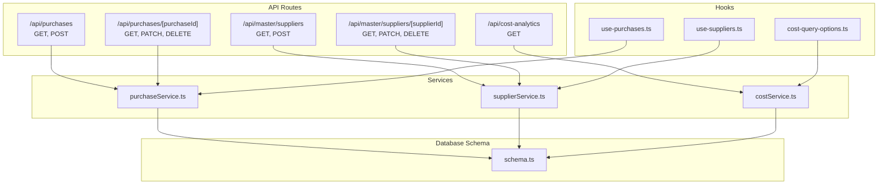
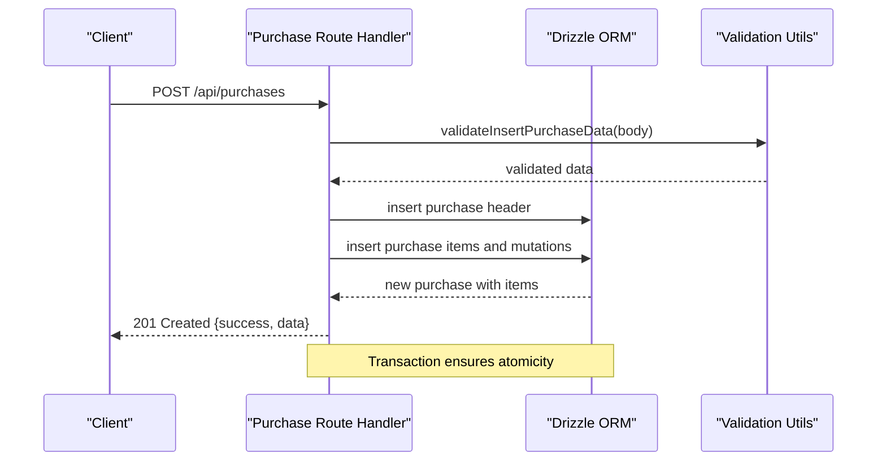
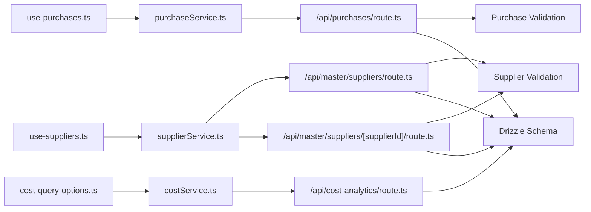

# Purchase Management API

<cite>
**Referenced Files in This Document**
- [route.ts](file://src/app/api/purchases/route.ts)
- [route.ts](file://src/app/api/master/suppliers/route.ts)
- [route.ts](file://src/app/api/master/suppliers/[supplierId]/route.ts)
- [route.ts](file://src/app/api/cost-analytics/route.ts)
- [purchaseService.ts](file://src/services/purchaseService.ts)
- [supplierService.ts](file://src/services/supplierService.ts)
- [purchase-type.ts](file://src/app/dashboard/purchases/_types/purchase-type.ts)
- [supplier.ts](file://src/app/dashboard/purchases/_types/supplier.ts)
- [purchase-query-options.ts](file://src/hooks/purchases/purchase-query-options.ts)
- [use-purchases.ts](file://src/hooks/purchases/use-purchases.ts)
- [use-suppliers.ts](file://src/hooks/master/use-suppliers.ts)
- [cost-query-options.ts](file://src/hooks/cost/cost-query-options.ts)
- [costService.ts](file://src/services/costService.ts)
- [schema.ts](file://src/drizzle/schema.ts)
- [api-utils.ts](file://src/lib/api-utils.ts)
- [query-helper.ts](file://src/lib/query-helper.ts)
- [purchase.test.ts](file://src/__tests__/validations/purchase.test.ts)
</cite>

## Table of Contents
1. [Introduction](#introduction)
2. [Project Structure](#project-structure)
3. [Core Components](#core-components)
4. [Architecture Overview](#architecture-overview)
5. [Detailed Component Analysis](#detailed-component-analysis)
6. [Dependency Analysis](#dependency-analysis)
7. [Performance Considerations](#performance-considerations)
8. [Troubleshooting Guide](#troubleshooting-guide)
9. [Conclusion](#conclusion)

## Introduction
This document provides comprehensive API documentation for the purchase management module in the POS application. It covers purchase order creation with supplier integration and product validation, purchase listing with filtering, individual purchase retrieval, purchase status updates, supplier management endpoints, supplier relations and purchase history tracking, cost analytics endpoints, and purchase receipt generation workflows. Each endpoint specifies HTTP methods, URL patterns, request/response schemas, validation rules, and error handling mechanisms. Practical examples and data model references are included to guide implementation and integration.

## Project Structure
The purchase management API is organized under the Next.js App Router at `/src/app/api`. Key modules include:
- Purchase endpoints: `/api/purchases` (collection) and `/api/purchases/[purchaseId]` (individual)
- Supplier endpoints: `/api/master/suppliers` (collection) and `/api/master/suppliers/[supplierId]` (CRUD)
- Cost analytics: `/api/cost-analytics`
- Supporting services and hooks: `/src/services`, `/src/hooks`
- Validation and database schema: `/src/lib/validations`, `/src/drizzle/schema.ts`

**Diagram sources**
- [route.ts:1-213](file://src/app/api/purchases/route.ts#L1-L213)
- [route.ts:1-45](file://src/app/api/master/suppliers/route.ts#L1-L45)
- [route.ts:1-151](file://src/app/api/master/suppliers/[supplierId]/route.ts#L1-L151)
- [route.ts:74-85](file://src/app/api/cost-analytics/route.ts#L74-L85)
- [purchaseService.ts:43-60](file://src/services/purchaseService.ts#L43-L60)
- [supplierService.ts](file://src/services/supplierService.ts)
- [costService.ts:190-195](file://src/services/costService.ts#L190-L195)
- [schema.ts](file://src/drizzle/schema.ts)

**Section sources**
- [route.ts:1-213](file://src/app/api/purchases/route.ts#L1-L213)
- [route.ts:1-45](file://src/app/api/master/suppliers/route.ts#L1-L45)
- [route.ts:1-151](file://src/app/api/master/suppliers/[supplierId]/route.ts#L1-L151)
- [route.ts:74-85](file://src/app/api/cost-analytics/route.ts#L74-L85)

## Core Components
- Purchase collection endpoint: Handles listing purchases with search, pagination, ordering, and filtering; supports creation of purchase orders with supplier integration and product validation.
- Individual purchase endpoint: Retrieves purchase details with items and supplier information; supports updates and deletion.
- Supplier collection endpoint: Provides supplier listing with trash support, search, and ordering; integrates with purchase history.
- Supplier detail endpoint: Manages supplier CRUD operations including soft delete and restore.
- Cost analytics endpoint: Aggregates operational and tax cost analytics for reporting.
- Services and hooks: Encapsulate API interactions and React Query caching for efficient client-side data management.

**Section sources**
- [route.ts:22-183](file://src/app/api/purchases/route.ts#L22-L183)
- [route.ts:185-213](file://src/app/api/purchases/route.ts#L185-L213)
- [route.ts:14-45](file://src/app/api/master/suppliers/route.ts#L14-L45)
- [route.ts:8-151](file://src/app/api/master/suppliers/[supplierId]/route.ts#L8-L151)
- [route.ts:74-85](file://src/app/api/cost-analytics/route.ts#L74-L85)
- [purchaseService.ts:43-60](file://src/services/purchaseService.ts#L43-L60)
- [supplierService.ts](file://src/services/supplierService.ts)
- [use-purchases.ts:1-77](file://src/hooks/purchases/use-purchases.ts#L1-L77)
- [use-suppliers.ts:1-60](file://src/hooks/master/use-suppliers.ts#L1-L60)

## Architecture Overview
The purchase management API follows a layered architecture:
- Route handlers process HTTP requests, apply pagination and filters, and orchestrate database operations.
- Validation utilities enforce business rules for purchase creation and supplier updates.
- Services encapsulate API calls and integrate with Drizzle ORM for database operations.
- Hooks manage client-side caching and invalidation for real-time UI updates.

**Diagram sources**
- [route.ts:185-213](file://src/app/api/purchases/route.ts#L185-L213)
- [api-utils.ts](file://src/lib/api-utils.ts)
- [schema.ts](file://src/drizzle/schema.ts)

## Detailed Component Analysis

### Purchase Collection Endpoints
- Method: GET
- URL: `/api/purchases`
- Purpose: List purchase orders with search, pagination, ordering, and filtering by supplier or order number.
- Query Parameters:
  - `page`: Page number (default depends on pagination parsing)
  - `limit`: Items per page
  - `search`: Search term applied to order number and supplier name
  - `orderBy`: Column to sort by (mapped to orderNumber)
  - `order`: Sort direction (asc/desc)
- Response Schema:
  - `data`: Array of purchase orders with metadata
  - `meta`: Pagination metadata (total, page, limit)
  - `analytics`: Summary metrics including total purchases, monthly totals, new transactions, active suppliers, and today's items quantity
- Validation Rules:
  - Search term triggers combined ILIKE match against orderNumber and supplier name via EXISTS subquery.
  - Date range constants define previous month and today for analytics computation.
- Error Handling:
  - Catches exceptions and returns standardized error responses via centralized handler.

- Method: POST
- URL: `/api/purchases`
- Purpose: Create a new purchase order with items and related stock mutations.
- Request Body Schema:
  - `supplierId`: Integer (foreign key to suppliers)
  - `userId`: Integer (operator identifier)
  - `items`: Array of purchase items with `variantId`, `quantity`, and pricing fields
- Validation Rules:
  - Validates payload using purchase validation utilities.
  - Ensures unique variant IDs within items to prevent duplicates.
  - Inserts temporary order header, computes totals, and inserts items and stock mutations atomically.
- Response Schema:
  - `success`: Boolean flag
  - `data`: New purchase order with populated items and computed totals
- Error Handling:
  - Throws descriptive errors for duplicate variants and handles database transaction failures.

**Section sources**
- [route.ts:22-183](file://src/app/api/purchases/route.ts#L22-L183)
- [route.ts:185-213](file://src/app/api/purchases/route.ts#L185-L213)
- [api-utils.ts](file://src/lib/api-utils.ts)
- [query-helper.ts](file://src/lib/query-helper.ts)
- [purchase.test.ts](file://src/__tests__/validations/purchase.test.ts)

### Individual Purchase Endpoint
- Method: GET
- URL: `/api/purchases/[purchaseId]`
- Purpose: Retrieve a single purchase order with associated items and supplier details.
- Path Parameters:
  - `purchaseId`: Integer purchase identifier
- Response Schema:
  - `success`: Boolean flag
  - `data`: Purchase order object including items and supplier information
- Error Handling:
  - Returns 400 for invalid ID format and 404 when purchase is not found; otherwise returns 500 on internal errors.

- Method: PATCH
- URL: `/api/purchases/[purchaseId]`
- Purpose: Update purchase details (e.g., status, quantities).
- Path Parameters:
  - `purchaseId`: Integer purchase identifier
- Request Body Schema:
  - Fields depend on allowed updates (e.g., status, quantities); validated by purchase update utilities.
- Response Schema:
  - `success`: Boolean flag
  - `data`: Updated purchase order
- Error Handling:
  - Returns 400 for validation failures and 404 if purchase does not exist; otherwise 500 on failure.

- Method: DELETE
- URL: `/api/purchases/[purchaseId]`
- Purpose: Remove a purchase order (soft delete semantics handled by upstream logic).
- Path Parameters:
  - `purchaseId`: Integer purchase identifier
- Response Schema:
  - `success`: Boolean flag
  - `message`: Deletion outcome message
- Error Handling:
  - Returns 404 if purchase is not found; otherwise 500 on failure.

**Section sources**
- [route.ts:1-213](file://src/app/api/purchases/route.ts#L1-L213)

### Supplier Management Endpoints
- Method: GET
- URL: `/api/master/suppliers`
- Purpose: List suppliers with trash support, search, and ordering.
- Query Parameters:
  - `trash`: Boolean to include deleted suppliers
  - `search`: Text search on supplier name
  - `orderBy`: Sorting column (mapped to name)
  - `order`: Sort direction
  - `page`, `limit`: Pagination
- Response Schema:
  - `data`: Array of suppliers
  - `meta`: Pagination metadata
- Error Handling:
  - Uses centralized error handling for database and validation errors.

- Method: POST
- URL: `/api/master/suppliers`
- Purpose: Create a new supplier.
- Request Body Schema:
  - Fields validated by supplier validation utilities (e.g., name, contact info).
- Response Schema:
  - `success`: Boolean flag
  - `data`: Created supplier
- Error Handling:
  - Returns 400 for validation errors; otherwise 500 on failure.

- Method: GET
- URL: `/api/master/suppliers/[supplierId]`
- Purpose: Retrieve supplier details.
- Path Parameters:
  - `supplierId`: Integer supplier identifier
- Response Schema:
  - `success`: Boolean flag
  - `data`: Supplier object
- Error Handling:
  - Returns 400 for invalid ID and 404 if not found; otherwise 500 on failure.

- Method: PATCH
- URL: `/api/master/suppliers/[supplierId]`
- Purpose: Update supplier details or soft delete/restore.
- Path Parameters:
  - `supplierId`: Integer supplier identifier
- Request Body Schema:
  - Fields validated by supplier update utilities; supports restoration by passing appropriate payload.
- Response Schema:
  - `success`: Boolean flag
  - `data`: Updated or restored supplier
- Error Handling:
  - Returns 400 for validation failures; 404 if supplier not found; otherwise 500 on failure.

- Method: DELETE
- URL: `/api/master/suppliers/[supplierId]`
- Purpose: Soft delete a supplier.
- Path Parameters:
  - `supplierId`: Integer supplier identifier
- Response Schema:
  - `success`: Boolean flag
  - `message`: Deletion outcome message
- Error Handling:
  - Returns 404 if supplier not found; otherwise 500 on failure.

**Section sources**
- [route.ts:14-45](file://src/app/api/master/suppliers/route.ts#L14-L45)
- [route.ts:8-151](file://src/app/api/master/suppliers/[supplierId]/route.ts#L8-L151)

### Cost Analytics Endpoints
- Method: GET
- URL: `/api/cost-analytics`
- Purpose: Aggregate operational and tax cost analytics for reporting.
- Query Parameters:
  - None (returns current snapshot)
- Response Schema:
  - `generatedAt`: Timestamp of analytics generation
  - `asOfDate`: Reference date (YYYY-MM-DD)
  - `operational`: Counts and estimates for active/inactive costs, expiring soon, and top categories
  - `tax`: Counts and distributions for active taxes and applicability
- Processing Logic:
  - Computes monthly estimates based on cost periods
  - Determines effectiveness using lexicographic date comparison
  - Identifies expiring costs within 30 days
- Error Handling:
  - Centralized error handling wraps analytics computation.

**Section sources**
- [route.ts:74-85](file://src/app/api/cost-analytics/route.ts#L74-L85)
- [costService.ts:67-88](file://src/services/costService.ts#L67-L88)

### Purchase Receipt Generation and Supplier Communication
- Receipt Generation:
  - The purchase list page includes a purchase receipt component that renders printable receipts for selected purchases. This UI component coordinates with purchase data to produce formatted output suitable for printing or PDF generation.
- Supplier Communication:
  - Supplier endpoints enable CRUD operations that can be integrated with external communication systems (e.g., email/SMS) triggered by purchase events. While direct communication endpoints are not present in the API, supplier records maintain contact information used by higher-level workflows.

**Section sources**
- [route.ts:22-183](file://src/app/api/purchases/route.ts#L22-L183)

## Dependency Analysis
The purchase and supplier modules share common utilities and database schema definitions. Services and hooks provide decoupled client integration points.

**Diagram sources**
- [route.ts:1-213](file://src/app/api/purchases/route.ts#L1-L213)
- [route.ts:1-45](file://src/app/api/master/suppliers/route.ts#L1-L45)
- [route.ts:1-151](file://src/app/api/master/suppliers/[supplierId]/route.ts#L1-L151)
- [route.ts:74-85](file://src/app/api/cost-analytics/route.ts#L74-L85)
- [purchaseService.ts:43-60](file://src/services/purchaseService.ts#L43-L60)
- [supplierService.ts](file://src/services/supplierService.ts)
- [costService.ts:190-195](file://src/services/costService.ts#L190-L195)
- [use-purchases.ts:1-77](file://src/hooks/purchases/use-purchases.ts#L1-L77)
- [use-suppliers.ts:1-60](file://src/hooks/master/use-suppliers.ts#L1-L60)
- [cost-query-options.ts:62-73](file://src/hooks/cost/cost-query-options.ts#L62-L73)

**Section sources**
- [schema.ts](file://src/drizzle/schema.ts)
- [api-utils.ts](file://src/lib/api-utils.ts)
- [query-helper.ts](file://src/lib/query-helper.ts)

## Performance Considerations
- Pagination and Filtering: Use `page` and `limit` parameters to control result sets; combine with `search` for efficient filtering.
- Indexing: Ensure database indexes exist on frequently filtered columns (e.g., orderNumber, supplierId, createdAt).
- Transactions: Purchase creation uses database transactions to maintain consistency; avoid long-running transactions by limiting batch sizes.
- Caching: Client-side caching via React Query hooks reduces redundant network calls and improves UI responsiveness.

## Troubleshooting Guide
Common issues and resolutions:
- Validation Failures:
  - Purchase creation fails if items contain duplicate variant IDs. Ensure each variant appears only once per purchase.
  - Supplier updates fail if validation rules are not met. Review field constraints and required values.
- Resource Not Found:
  - Individual endpoints return 404 if identifiers are invalid or resources do not exist. Verify IDs and existence before invoking endpoints.
- Internal Errors:
  - Centralized error handling returns 500 for unhandled exceptions. Check server logs and ensure database connectivity and schema integrity.

**Section sources**
- [route.ts:185-213](file://src/app/api/purchases/route.ts#L185-L213)
- [route.ts:106-143](file://src/app/api/master/suppliers/[supplierId]/route.ts#L106-L143)
- [api-utils.ts](file://src/lib/api-utils.ts)

## Conclusion
The purchase management API provides robust endpoints for purchase lifecycle management, supplier administration, and cost analytics. By leveraging validation utilities, database transactions, and client-side caching, the system ensures reliable data operations and responsive user experiences. Integrating supplier communication and receipt generation completes the end-to-end purchase workflow.