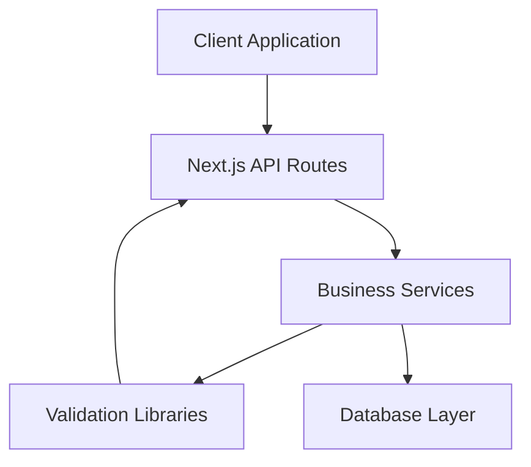
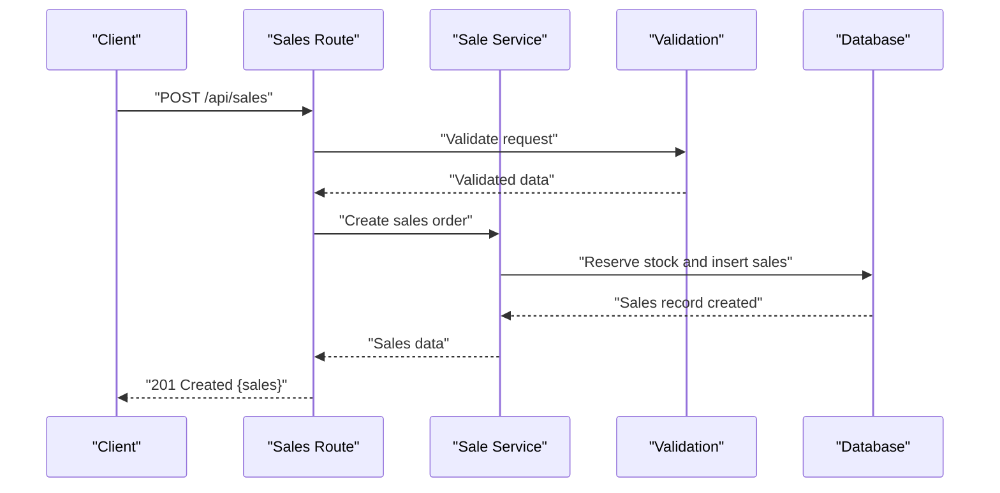
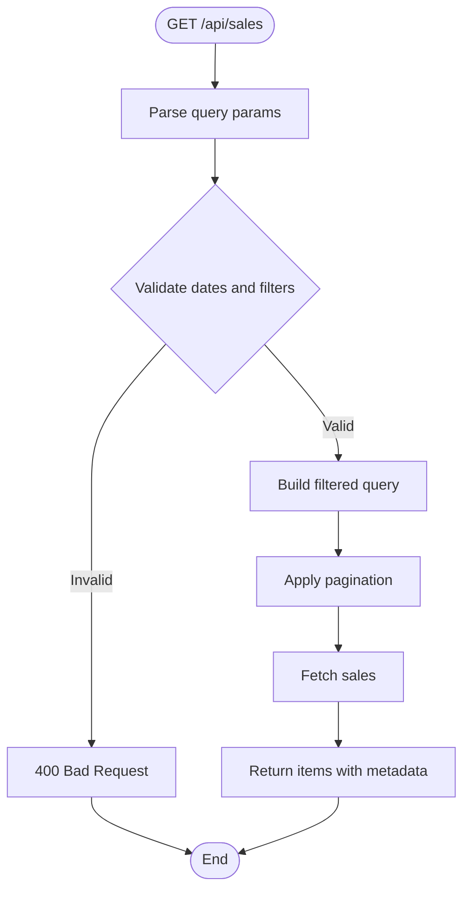
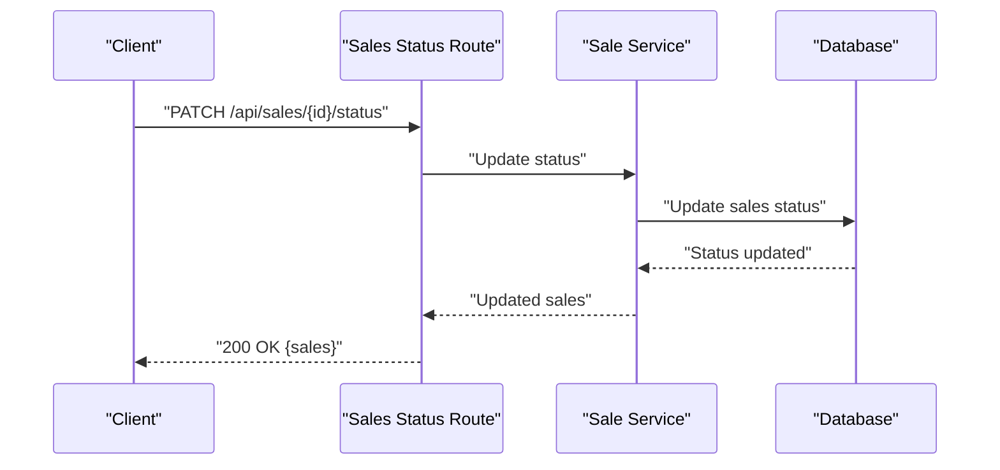
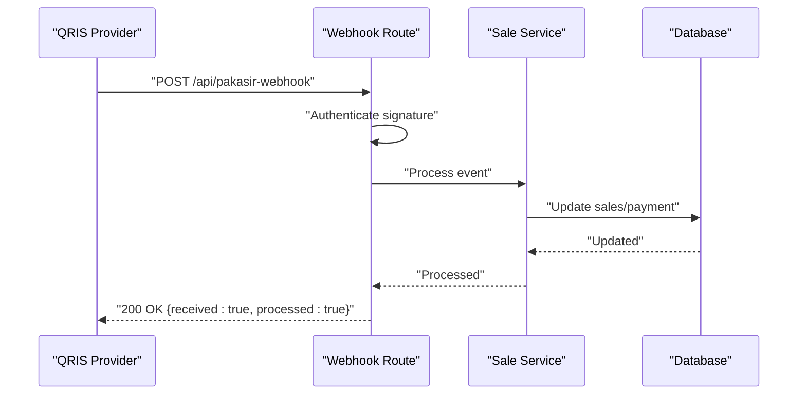
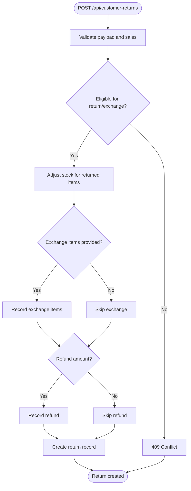
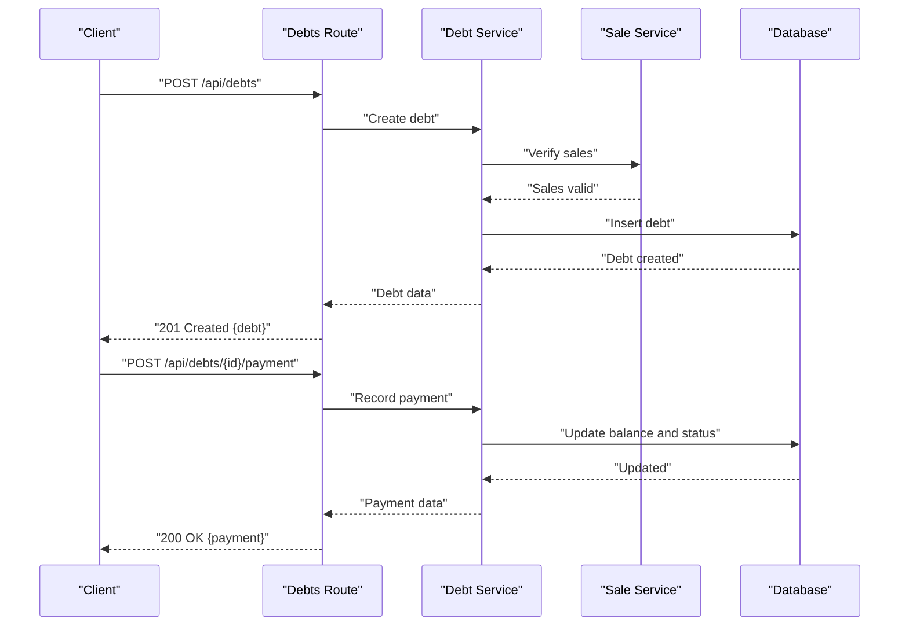
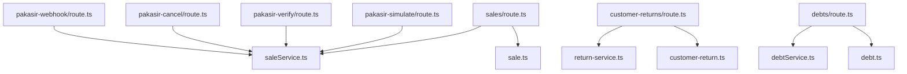

# Sales Processing API

<cite>
**Referenced Files in This Document**
- [sales/route.ts](file://src/app/api/sales/route.ts)
- [sales/[salesId]/route.ts](file://src/app/api/sales/[salesId]/route.ts)
- [sales/[salesId]/status/route.ts](file://src/app/api/sales/[salesId]/status/route.ts)
- [customer-returns/route.ts](file://src/app/api/customer-returns/route.ts)
- [customer-returns/[customerReturnId]/route.ts](file://src/app/api/customer-returns/[customerReturnId]/route.ts)
- [debts/route.ts](file://src/app/api/debts/route.ts)
- [debts/[id]/payment/route.ts](file://src/app/api/debts/[id]/payment/route.ts)
- [pakasir-simulate/route.ts](file://src/app/api/pakasir-simulate/route.ts)
- [pakasir-verify/route.ts](file://src/app/api/pakasir-verify/route.ts)
- [pakasir-cancel/route.ts](file://src/app/api/pakasir-cancel/route.ts)
- [pakasir-webhook/route.ts](file://src/app/api/pakasir-webhook/route.ts)
- [saleService.ts](file://src/services/saleService.ts)
- [debtService.ts](file://src/services/debtService.ts)
- [return-service.ts](file://src/app/api/customer-returns/_lib/return-service.ts)
- [sale-type.ts](file://src/app/dashboard/sales/_types/sale-type.ts)
- [sale.ts](file://src/lib/validations/sale.ts)
- [customer-return.ts](file://src/lib/validations/customer-return.ts)
- [debt.ts](file://src/lib/validations/debt.ts)
- [stock-adjustments/route.ts](file://src/app/api/stock-adjustments/route.ts)
- [stock-mutations/route.ts](file://src/app/api/stock-mutations/route.ts)
- [sale-query-options.ts](file://src/hooks/sales/sale-query-options.ts)
- [use-sale.ts](file://src/hooks/sales/use-sale.ts)
- [customer-return-query-options.ts](file://src/hooks/customer-returns/customer-return-query-options.ts)
- [use-customer-return.ts](file://src/hooks/customer-returns/use-customer-return.ts)
- [debt-query-options.ts](file://src/hooks/debt/debt-query-options.ts)
- [use-debts.ts](file://src/hooks/debt/use-debts.ts)
- [use-print-receipt.ts](file://src/app/dashboard/sales/_hooks/use-print-receipt.ts)
- [pakasir.ts](file://src/lib/pakasir.ts)
</cite>

## Table of Contents
1. [Introduction](#introduction)
2. [Project Structure](#project-structure)
3. [Core Components](#core-components)
4. [Architecture Overview](#architecture-overview)
5. [Detailed Component Analysis](#detailed-component-analysis)
6. [Dependency Analysis](#dependency-analysis)
7. [Performance Considerations](#performance-considerations)
8. [Troubleshooting Guide](#troubleshooting-guide)
9. [Conclusion](#conclusion)
10. [Appendices](#appendices)

## Introduction
This document provides comprehensive API documentation for sales processing endpoints in the POS application. It covers sales order creation with product validation and stock checking, sales retrieval with filtering, sales status updates for cash, QRIS, and debt transactions, QRIS payment simulation and verification, webhook handling, return processing for customer returns and exchanges, debt management for tracking customer obligations and payments, sales receipt generation and printing, and stock adjustment integration during sales processing. Each endpoint specifies HTTP methods, URL patterns, request/response schemas, payment processing workflows, and error handling. Practical examples, QRIS payment flow, and sales data models are included for clarity.

## Project Structure
The sales processing API is organized under the Next.js App Router at src/app/api, with supporting services and validation libraries in src/services and src/lib. Frontend dashboards and hooks integrate with these APIs for UI interactions.

```mermaid
graph TB
subgraph "API Routes"
SALES_CREATE["POST /api/sales"]
SALES_GET["GET /api/sales"]
SALES_UPDATE_STATUS["PATCH /api/sales/[salesId]/status"]
SALES_GET_BY_ID["GET /api/sales/[salesId]"]
RETURNS_CREATE["POST /api/customer-returns"]
RETURNS_GET_BY_ID["GET /api/customer-returns/[customerReturnId]"]
DEBTS_CREATE["POST /api/debts"]
DEBT_PAYMENT["POST /api/debts/[id]/payment"]
QRIS_SIM["POST /api/pakasir-simulate"]
QRIS_VER["POST /api/pakasir-verify"]
QRIS_CANCEL["POST /api/pakasir-cancel"]
QRIS_WEBHOOK["POST /api/pakasir-webhook"]
STOCK_ADJ["POST /api/stock-adjustments"]
STOCK_MUT["GET /api/stock-mutations"]
end
subgraph "Services"
SALE_SERVICE["saleService.ts"]
DEBT_SERVICE["debtService.ts"]
RETURN_SERVICE["return-service.ts"]
end
subgraph "Validation & Types"
VALID_SALE["sale.ts"]
VALID_RETURNS["customer-return.ts"]
VALID_DEBT["debt.ts"]
SALE_TYPE["sale-type.ts"]
end
SALES_CREATE --> SALE_SERVICE
SALES_GET --> SALE_SERVICE
SALES_UPDATE_STATUS --> SALE_SERVICE
SALES_GET_BY_ID --> SALE_SERVICE
RETURNS_CREATE --> RETURN_SERVICE
RETURNS_GET_BY_ID --> RETURN_SERVICE
DEBTS_CREATE --> DEBT_SERVICE
DEBT_PAYMENT --> DEBT_SERVICE
QRIS_SIM --> SALE_SERVICE
QRIS_VER --> SALE_SERVICE
QRIS_CANCEL --> SALE_SERVICE
QRIS_WEBHOOK --> SALE_SERVICE
STOCK_ADJ --> SALE_SERVICE
STOCK_MUT --> SALE_SERVICE
VALID_SALE --> SALES_CREATE
VALID_RETURNS --> RETURNS_CREATE
VALID_DEBT --> DEBTS_CREATE
SALE_TYPE --> SALES_GET
```

**Diagram sources**
- [sales/route.ts:1-200](file://src/app/api/sales/route.ts#L1-L200)
- [customer-returns/route.ts:1-200](file://src/app/api/customer-returns/route.ts#L1-L200)
- [debts/route.ts:1-200](file://src/app/api/debts/route.ts#L1-L200)
- [pakasir-simulate/route.ts:1-200](file://src/app/api/pakasir-simulate/route.ts#L1-L200)
- [pakasir-verify/route.ts:1-200](file://src/app/api/pakasir-verify/route.ts#L1-L200)
- [pakasir-cancel/route.ts:1-200](file://src/app/api/pakasir-cancel/route.ts#L1-L200)
- [pakasir-webhook/route.ts:1-200](file://src/app/api/pakasir-webhook/route.ts#L1-L200)
- [saleService.ts:1-500](file://src/services/saleService.ts#L1-L500)
- [debtService.ts:1-500](file://src/services/debtService.ts#L1-L500)
- [return-service.ts:1-500](file://src/app/api/customer-returns/_lib/return-service.ts#L1-L500)
- [sale.ts:1-300](file://src/lib/validations/sale.ts#L1-L300)
- [customer-return.ts:1-300](file://src/lib/validations/customer-return.ts#L1-L300)
- [debt.ts:1-300](file://src/lib/validations/debt.ts#L1-L300)
- [sale-type.ts:1-200](file://src/app/dashboard/sales/_types/sale-type.ts#L1-L200)

**Section sources**
- [sales/route.ts:1-200](file://src/app/api/sales/route.ts#L1-L200)
- [customer-returns/route.ts:1-200](file://src/app/api/customer-returns/route.ts#L1-L200)
- [debts/route.ts:1-200](file://src/app/api/debts/route.ts#L1-L200)
- [pakasir-simulate/route.ts:1-200](file://src/app/api/pakasir-simulate/route.ts#L1-L200)
- [pakasir-verify/route.ts:1-200](file://src/app/api/pakasir-verify/route.ts#L1-L200)
- [pakasir-cancel/route.ts:1-200](file://src/app/api/pakasir-cancel/route.ts#L1-L200)
- [pakasir-webhook/route.ts:1-200](file://src/app/api/pakasir-webhook/route.ts#L1-L200)

## Core Components
- Sales API module: Handles sales order creation, retrieval, and status updates, including QRIS and debt integrations.
- Returns API module: Manages customer returns and exchanges with validation and stock adjustments.
- Debts API module: Tracks customer obligations and payments for debt transactions.
- QRIS Payment module: Provides simulation, verification, cancellation, and webhook handling for QRIS payments.
- Stock Adjustment and Mutation APIs: Integrates stock adjustments and queries during sales processing.
- Services and Validation: Centralized business logic and validation schemas for robust request handling.

**Section sources**
- [saleService.ts:1-500](file://src/services/saleService.ts#L1-L500)
- [debtService.ts:1-500](file://src/services/debtService.ts#L1-L500)
- [return-service.ts:1-500](file://src/app/api/customer-returns/_lib/return-service.ts#L1-L500)
- [sale.ts:1-300](file://src/lib/validations/sale.ts#L1-L300)
- [customer-return.ts:1-300](file://src/lib/validations/customer-return.ts#L1-L300)
- [debt.ts:1-300](file://src/lib/validations/debt.ts#L1-L300)

## Architecture Overview
The sales processing API follows a layered architecture:
- API routes define HTTP endpoints and orchestrate request handling.
- Services encapsulate business logic for sales, returns, debts, and QRIS operations.
- Validation libraries enforce request schemas and constraints.
- Hooks and frontend components consume these APIs for UI interactions.

[No sources needed since this diagram shows conceptual architecture, not actual code structure]

## Detailed Component Analysis

### Sales Order Creation
- Method: POST
- URL: /api/sales
- Purpose: Create a new sales order with validated products and stock checks.
- Request Schema:
  - customer_id: string
  - items: array of product variants with quantity
  - payment_type: enum (cash, qris, debt)
  - total_amount: number
  - discount?: number
  - tax?: number
  - notes?: string
- Response Schema:
  - id: string
  - customer_id: string
  - items: array of sales items with product details
  - payment_type: string
  - total_amount: number
  - discount?: number
  - tax?: number
  - status: string
  - created_at: timestamp
  - updated_at: timestamp
- Processing Workflow:
  1. Validate request payload against the sales schema.
  2. For each item, check product availability and stock levels.
  3. Reserve stock for the order.
  4. Create sales record with initial status (e.g., pending).
  5. If payment_type is cash or debt, finalize immediately; if qris, initiate QRIS flow.
  6. Return created sales record.
- Error Handling:
  - Invalid payload: 400 Bad Request
  - Insufficient stock: 409 Conflict
  - Product not found: 404 Not Found
  - Internal errors: 500 Internal Server Error

**Diagram sources**
- [sales/route.ts:1-200](file://src/app/api/sales/route.ts#L1-L200)
- [saleService.ts:1-500](file://src/services/saleService.ts#L1-L500)
- [sale.ts:1-300](file://src/lib/validations/sale.ts#L1-L300)

**Section sources**
- [sales/route.ts:1-200](file://src/app/api/sales/route.ts#L1-L200)
- [sale.ts:1-300](file://src/lib/validations/sale.ts#L1-L300)
- [saleService.ts:1-500](file://src/services/saleService.ts#L1-L500)

### Sales Retrieval with Filtering
- Methods: GET
- URL: /api/sales
- Query Parameters:
  - date_from: string (ISO 8601 date)
  - date_to: string (ISO 8601 date)
  - status: enum (pending, paid, canceled)
  - customer_id: string
  - page: number
  - limit: number
- Response Schema:
  - items: array of sales records
  - total: number
  - page: number
  - pages: number
- Processing Workflow:
  1. Parse and validate query parameters.
  2. Apply filters to database query.
  3. Paginate results.
  4. Return list with metadata.
- Error Handling:
  - Invalid date format: 400 Bad Request
  - Internal errors: 500 Internal Server Error

**Diagram sources**
- [sales/route.ts:1-200](file://src/app/api/sales/route.ts#L1-L200)
- [sale-query-options.ts:1-200](file://src/hooks/sales/sale-query-options.ts#L1-L200)
- [use-sale.ts:1-200](file://src/hooks/sales/use-sale.ts#L1-L200)

**Section sources**
- [sales/route.ts:1-200](file://src/app/api/sales/route.ts#L1-L200)
- [sale-query-options.ts:1-200](file://src/hooks/sales/sale-query-options.ts#L1-L200)
- [use-sale.ts:1-200](file://src/hooks/sales/use-sale.ts#L1-L200)

### Sales Status Updates
- Methods: PATCH
- URL: /api/sales/[salesId]/status
- Path Parameter:
  - salesId: string
- Request Body:
  - status: enum (pending, paid, canceled)
- Response Schema:
  - id: string
  - status: string
  - updated_at: timestamp
- Processing Workflow:
  1. Validate sales ID and status value.
  2. Update sales record status.
  3. Trigger stock adjustments if applicable (e.g., cancel).
  4. Return updated sales record.
- Error Handling:
  - Sales not found: 404 Not Found
  - Invalid status: 400 Bad Request
  - Internal errors: 500 Internal Server Error

**Diagram sources**
- [sales/[salesId]/status/route.ts](file://src/app/api/sales/[salesId]/status/route.ts#L1-L200)
- [saleService.ts:1-500](file://src/services/saleService.ts#L1-L500)

**Section sources**
- [sales/[salesId]/status/route.ts](file://src/app/api/sales/[salesId]/status/route.ts#L1-L200)
- [saleService.ts:1-500](file://src/services/saleService.ts#L1-L500)

### Sales Details Retrieval
- Methods: GET
- URL: /api/sales/[salesId]
- Path Parameter:
  - salesId: string
- Response Schema:
  - Same as creation response with full details.
- Processing Workflow:
  1. Validate sales ID.
  2. Retrieve sales record with related items and customer info.
  3. Return complete sales data.
- Error Handling:
  - Sales not found: 404 Not Found
  - Internal errors: 500 Internal Server Error

**Section sources**
- [sales/[salesId]/route.ts](file://src/app/api/sales/[salesId]/route.ts#L1-L200)
- [saleService.ts:1-500](file://src/services/saleService.ts#L1-L500)

### QRIS Payment Simulation
- Methods: POST
- URL: /api/pakasir-simulate
- Purpose: Simulate a QRIS payment initiation.
- Request Schema:
  - amount: number
  - customer_id?: string
  - notes?: string
- Response Schema:
  - reference_id: string
  - qr_text: string
  - expires_at: timestamp
- Processing Workflow:
  1. Validate request payload.
  2. Call external QRIS provider simulation endpoint.
  3. Store simulation record with status pending.
  4. Return QRIS details.
- Error Handling:
  - Invalid payload: 400 Bad Request
  - Provider errors: 502 Bad Gateway
  - Internal errors: 500 Internal Server Error

**Section sources**
- [pakasir-simulate/route.ts:1-200](file://src/app/api/pakasir-simulate/route.ts#L1-L200)
- [pakasir.ts:1-200](file://src/lib/pakasir.ts#L1-L200)

### QRIS Payment Verification
- Methods: POST
- URL: /api/pakasir-verify
- Purpose: Verify QRIS payment status using reference_id.
- Request Schema:
  - reference_id: string
- Response Schema:
  - reference_id: string
  - status: enum (pending, success, failed)
  - amount: number
  - verified_at: timestamp
- Processing Workflow:
  1. Validate reference_id.
  2. Poll external QRIS provider for status.
  3. Update local record and link to sales if successful.
  4. Return verification result.
- Error Handling:
  - Invalid reference: 400 Bad Request
  - Not found: 404 Not Found
  - Internal errors: 500 Internal Server Error

**Section sources**
- [pakasir-verify/route.ts:1-200](file://src/app/api/pakasir-verify/route.ts#L1-L200)
- [pakasir.ts:1-200](file://src/lib/pakasir.ts#L1-L200)

### QRIS Payment Cancellation
- Methods: POST
- URL: /api/pakasir-cancel
- Purpose: Cancel a pending QRIS payment.
- Request Schema:
  - reference_id: string
- Response Schema:
  - reference_id: string
  - canceled: boolean
  - canceled_at: timestamp
- Processing Workflow:
  1. Validate reference_id.
  2. Call external QRIS provider to cancel.
  3. Update local record status to canceled.
  4. Release reserved stock if applicable.
  4. Return cancellation result.
- Error Handling:
  - Invalid reference: 400 Bad Request
  - Not found: 404 Not Found
  - Internal errors: 500 Internal Server Error

**Section sources**
- [pakasir-cancel/route.ts:1-200](file://src/app/api/pakasir-cancel/route.ts#L1-L200)
- [pakasir.ts:1-200](file://src/lib/pakasir.ts#L1-L200)

### QRIS Webhook Handling
- Methods: POST
- URL: /api/pakasir-webhook
- Purpose: Receive asynchronous notifications from QRIS provider.
- Request Schema:
  - event: string
  - data: object (provider-specific)
- Response Schema:
  - received: boolean
  - processed: boolean
- Processing Workflow:
  1. Authenticate webhook signature.
  2. Parse event and data.
  3. Update sales/payment status accordingly.
  4. Trigger stock adjustments and receipts.
  5. Return acknowledgment.
- Error Handling:
  - Invalid signature: 401 Unauthorized
  - Unsupported event: 400 Bad Request
  - Internal errors: 500 Internal Server Error

**Diagram sources**
- [pakasir-webhook/route.ts:1-200](file://src/app/api/pakasir-webhook/route.ts#L1-L200)
- [saleService.ts:1-500](file://src/services/saleService.ts#L1-L500)

**Section sources**
- [pakasir-webhook/route.ts:1-200](file://src/app/api/pakasir-webhook/route.ts#L1-L200)
- [saleService.ts:1-500](file://src/services/saleService.ts#L1-L500)

### Customer Returns and Exchanges
- Methods: POST (create), GET (retrieve by ID)
- URLs:
  - POST /api/customer-returns
  - GET /api/customer-returns/[customerReturnId]
- Request Schema (create):
  - customer_id: string
  - sales_id: string
  - items: array of returned product variants with quantity and reason
  - exchange_items?: array of exchanged product variants
  - refund_amount?: number
  - notes?: string
- Response Schema (create):
  - id: string
  - customer_id: string
  - sales_id: string
  - items: array of return items
  - exchange_items?: array of exchange items
  - refund_amount?: number
  - status: string
  - created_at: timestamp
- Processing Workflow:
  1. Validate return payload and associated sales.
  2. Check product eligibility for return/exchange.
  3. Adjust stock for returned items.
  4. Record exchange items and refund amount if applicable.
  5. Return created return record.
- Error Handling:
  - Invalid payload: 400 Bad Request
  - Sales mismatch: 409 Conflict
  - Internal errors: 500 Internal Server Error

**Diagram sources**
- [customer-returns/route.ts:1-200](file://src/app/api/customer-returns/route.ts#L1-L200)
- [return-service.ts:1-500](file://src/app/api/customer-returns/_lib/return-service.ts#L1-L500)
- [customer-return.ts:1-300](file://src/lib/validations/customer-return.ts#L1-L300)

**Section sources**
- [customer-returns/route.ts:1-200](file://src/app/api/customer-returns/route.ts#L1-L200)
- [customer-returns/[customerReturnId]/route.ts](file://src/app/api/customer-returns/[customerReturnId]/route.ts#L1-L200)
- [return-service.ts:1-500](file://src/app/api/customer-returns/_lib/return-service.ts#L1-L500)
- [customer-return.ts:1-300](file://src/lib/validations/customer-return.ts#L1-L300)

### Debt Management
- Methods: POST (create), GET (list), POST (payment)
- URLs:
  - POST /api/debts
  - POST /api/debts/[id]/payment
- Request Schema (create):
  - customer_id: string
  - sales_id: string
  - amount: number
  - due_date: string (ISO 8601 date)
  - notes?: string
- Response Schema (create):
  - id: string
  - customer_id: string
  - sales_id: string
  - amount: number
  - remaining_balance: number
  - due_date: timestamp
  - status: string
  - created_at: timestamp
- Request Schema (payment):
  - amount: number
  - payment_date?: string (ISO 8601)
- Response Schema (payment):
  - id: string
  - amount: number
  - payment_date: timestamp
  - balance_after: number
- Processing Workflow:
  1. Validate debt creation payload and associated sales.
  2. Create debt record with initial status (e.g., unpaid).
  3. On payment, update remaining balance and status.
  4. Link payments to the debt record.
- Error Handling:
  - Invalid payload: 400 Bad Request
  - Overpayment: 409 Conflict
  - Internal errors: 500 Internal Server Error

**Diagram sources**
- [debts/route.ts:1-200](file://src/app/api/debts/route.ts#L1-L200)
- [debts/[id]/payment/route.ts](file://src/app/api/debts/[id]/payment/route.ts#L1-L200)
- [debtService.ts:1-500](file://src/services/debtService.ts#L1-L500)
- [saleService.ts:1-500](file://src/services/saleService.ts#L1-L500)

**Section sources**
- [debts/route.ts:1-200](file://src/app/api/debts/route.ts#L1-L200)
- [debts/[id]/payment/route.ts](file://src/app/api/debts/[id]/payment/route.ts#L1-L200)
- [debtService.ts:1-500](file://src/services/debtService.ts#L1-L500)
- [debt.ts:1-300](file://src/lib/validations/debt.ts#L1-L300)

### Sales Receipt Generation and Printing
- Methods: GET (receipt data), POST (print trigger)
- URLs:
  - GET /api/sales/[salesId]/receipt (conceptual, requires backend implementation)
  - POST /api/sales/[salesId]/print (conceptual, requires backend implementation)
- Response Schema (receipt data):
  - sales_id: string
  - customer_name: string
  - items: array of purchased items
  - subtotal: number
  - discount: number
  - tax: number
  - total: number
  - payment_method: string
  - payment_amount: number
  - change?: number
  - issued_at: timestamp
- Processing Workflow:
  1. Retrieve sales details and items.
  2. Compute totals and payment breakdown.
  3. Return receipt data for client-side rendering/printing.
- Error Handling:
  - Sales not found: 404 Not Found
  - Internal errors: 500 Internal Server Error

**Section sources**
- [use-print-receipt.ts:1-200](file://src/app/dashboard/sales/_hooks/use-print-receipt.ts#L1-L200)
- [sale-type.ts:1-200](file://src/app/dashboard/sales/_types/sale-type.ts#L1-L200)

### Stock Adjustment Integration During Sales
- Methods: POST (adjust stock), GET (mutations)
- URLs:
  - POST /api/stock-adjustments
  - GET /api/stock-mutations
- Request Schema (adjust stock):
  - product_variant_id: string
  - quantity: number
  - reason: string
  - notes?: string
- Response Schema (adjust stock):
  - id: string
  - product_variant_id: string
  - quantity: number
  - reason: string
  - approved: boolean
  - created_at: timestamp
- Processing Workflow:
  1. Validate adjustment request.
  2. Update inventory quantities.
  3. Record mutation history.
  4. Return adjustment record.
- Error Handling:
  - Invalid payload: 400 Bad Request
  - Insufficient stock for negative adjustment: 409 Conflict
  - Internal errors: 500 Internal Server Error

**Section sources**
- [stock-adjustments/route.ts:1-200](file://src/app/api/stock-adjustments/route.ts#L1-L200)
- [stock-mutations/route.ts:1-200](file://src/app/api/stock-mutations/route.ts#L1-L200)
- [saleService.ts:1-500](file://src/services/saleService.ts#L1-L500)

## Dependency Analysis
The sales processing API depends on validation libraries, services, and database operations. The following diagram shows key dependencies among modules.

**Diagram sources**
- [sales/route.ts:1-200](file://src/app/api/sales/route.ts#L1-L200)
- [customer-returns/route.ts:1-200](file://src/app/api/customer-returns/route.ts#L1-L200)
- [debts/route.ts:1-200](file://src/app/api/debts/route.ts#L1-L200)
- [pakasir-simulate/route.ts:1-200](file://src/app/api/pakasir-simulate/route.ts#L1-L200)
- [pakasir-verify/route.ts:1-200](file://src/app/api/pakasir-verify/route.ts#L1-L200)
- [pakasir-cancel/route.ts:1-200](file://src/app/api/pakasir-cancel/route.ts#L1-L200)
- [pakasir-webhook/route.ts:1-200](file://src/app/api/pakasir-webhook/route.ts#L1-L200)
- [saleService.ts:1-500](file://src/services/saleService.ts#L1-L500)
- [debtService.ts:1-500](file://src/services/debtService.ts#L1-L500)
- [return-service.ts:1-500](file://src/app/api/customer-returns/_lib/return-service.ts#L1-L500)
- [sale.ts:1-300](file://src/lib/validations/sale.ts#L1-L300)
- [customer-return.ts:1-300](file://src/lib/validations/customer-return.ts#L1-L300)
- [debt.ts:1-300](file://src/lib/validations/debt.ts#L1-L300)

**Section sources**
- [saleService.ts:1-500](file://src/services/saleService.ts#L1-L500)
- [debtService.ts:1-500](file://src/services/debtService.ts#L1-L500)
- [return-service.ts:1-500](file://src/app/api/customer-returns/_lib/return-service.ts#L1-L500)
- [sale.ts:1-300](file://src/lib/validations/sale.ts#L1-L300)
- [customer-return.ts:1-300](file://src/lib/validations/customer-return.ts#L1-L300)
- [debt.ts:1-300](file://src/lib/validations/debt.ts#L1-L300)

## Performance Considerations
- Use pagination for sales retrieval to avoid large payloads.
- Batch stock adjustments to minimize database writes.
- Cache frequently accessed product and customer data.
- Asynchronous QRIS webhooks prevent blocking requests.
- Index database queries on date ranges, status, and customer_id for efficient filtering.

[No sources needed since this section provides general guidance]

## Troubleshooting Guide
Common issues and resolutions:
- Sales creation fails with insufficient stock:
  - Verify product variant stock levels before creating orders.
  - Use stock adjustment endpoints to reconcile inventory.
- QRIS verification returns pending:
  - Poll the verify endpoint periodically until success or failure.
  - Check webhook logs for asynchronous updates.
- Return processing conflicts:
  - Ensure the associated sales exists and matches the return items.
  - Validate exchange items against product catalog.
- Debt payment overpayment:
  - Limit payment amounts to remaining balance.
  - Use debt listing endpoints to check current status.

**Section sources**
- [sale.ts:1-300](file://src/lib/validations/sale.ts#L1-L300)
- [customer-return.ts:1-300](file://src/lib/validations/customer-return.ts#L1-L300)
- [debt.ts:1-300](file://src/lib/validations/debt.ts#L1-L300)
- [pakasir.ts:1-200](file://src/lib/pakasir.ts#L1-L200)

## Conclusion
The sales processing API provides a comprehensive set of endpoints for managing sales orders, returns, debts, and QRIS payments, integrated with stock adjustments and retrieval capabilities. By following the documented schemas, workflows, and error handling guidelines, developers can implement reliable and scalable sales processing features.

[No sources needed since this section summarizes without analyzing specific files]

## Appendices
- Practical Examples:
  - Create a cash sale with two product variants and a discount.
  - Filter sales by date range and status.
  - Initiate QRIS simulation, verify status, and handle webhook events.
  - Process a customer return with exchange items and refund calculation.
  - Create a debt for a customer and record partial payments over time.
- QRIS Payment Flow:
  1. Client sends simulate request to obtain reference_id and QR details.
  2. Client displays QR to customer for payment.
  3. Periodically verify payment status using reference_id.
  4. Upon success, link payment to sales and adjust stock.
  5. Handle webhook notifications for asynchronous updates.

[No sources needed since this section provides general guidance]