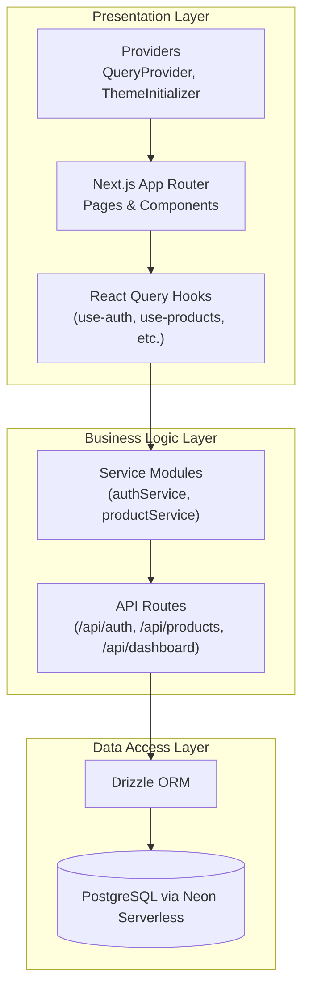
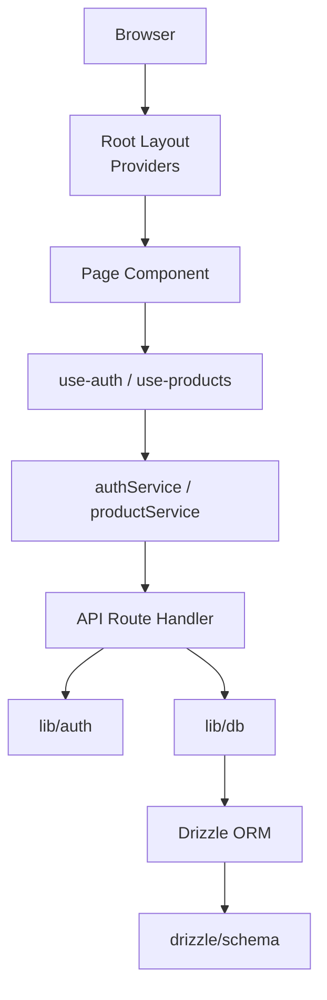
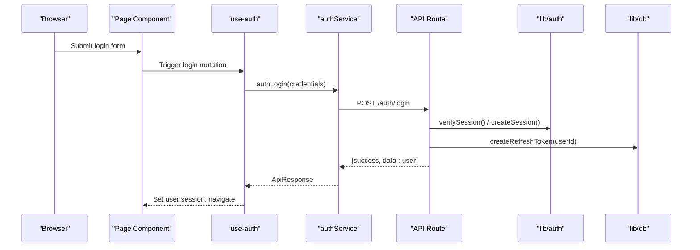
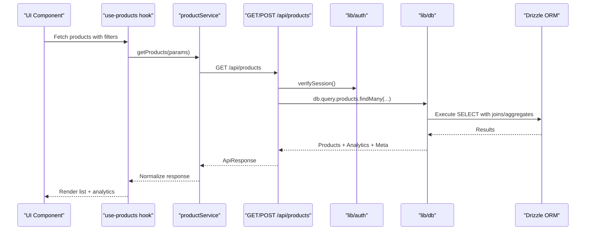
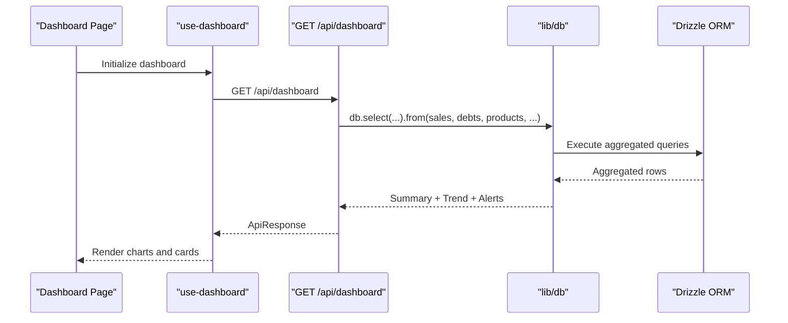
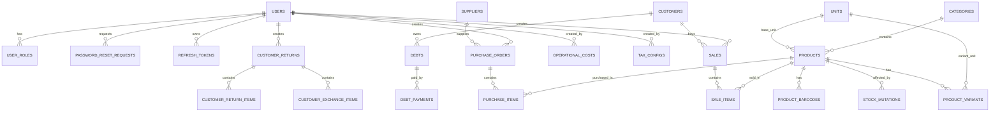
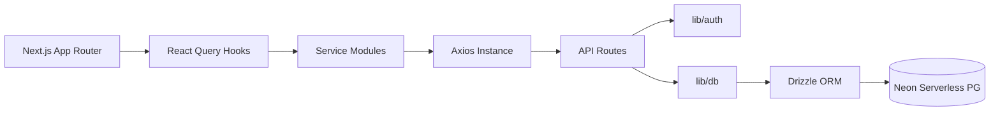

# Architecture Overview

<cite>
**Referenced Files in This Document**
- [README.md](file://README.md)
- [package.json](file://package.json)
- [src/app/layout.tsx](file://src/app/layout.tsx)
- [src/components/providers/QueryProvider.tsx](file://src/components/providers/QueryProvider.tsx)
- [src/lib/react-query.ts](file://src/lib/react-query.ts)
- [src/lib/axios.ts](file://src/lib/axios.ts)
- [src/lib/auth.ts](file://src/lib/auth.ts)
- [src/lib/db.ts](file://src/lib/db.ts)
- [src/lib/api-utils.ts](file://src/lib/api-utils.ts)
- [src/services/authService.ts](file://src/services/authService.ts)
- [src/services/productService.ts](file://src/services/productService.ts)
- [src/hooks/use-auth.ts](file://src/hooks/use-auth.ts)
- [src/app/api/auth/login/route.ts](file://src/app/api/auth/login/route.ts)
- [src/app/api/auth/me/route.ts](file://src/app/api/auth/me/route.ts)
- [src/app/api/products/route.ts](file://src/app/api/products/route.ts)
- [src/app/api/dashboard/route.ts](file://src/app/api/dashboard/route.ts)
- [src/drizzle/schema.ts](file://src/drizzle/schema.ts)
</cite>

## Table of Contents
1. [Introduction](#introduction)
2. [Project Structure](#project-structure)
3. [Core Components](#core-components)
4. [Architecture Overview](#architecture-overview)
5. [Detailed Component Analysis](#detailed-component-analysis)
6. [Dependency Analysis](#dependency-analysis)
7. [Performance Considerations](#performance-considerations)
8. [Troubleshooting Guide](#troubleshooting-guide)
9. [Conclusion](#conclusion)
10. [Appendices](#appendices)

## Introduction
This document describes the architecture of the Point of Sale (POS) application using a layered architecture pattern. The system separates concerns into:
- Presentation Layer: Next.js App Router pages and components
- Business Logic Layer: Services and API routes
- Data Access Layer: Drizzle ORM with PostgreSQL via Neon Serverless

Cross-cutting concerns include JWT-based authentication, React Query for client-side state management, TypeScript for type safety, and robust error handling/logging. The system integrates with external services such as Cloudflare Workers (via vinext), Neon Postgres, and optional QRIS/Pakasir payment webhook integration.

## Project Structure
The repository follows a feature-centric structure under src/, with:
- app/: Next.js App Router pages and API routes
- components/: UI primitives and providers
- hooks/: TanStack React Query hooks for data fetching
- services/: Client-facing service modules that encapsulate API calls
- lib/: Shared utilities for auth, DB connections, HTTP client, and helpers
- drizzle/: Database schema and migrations

**Diagram sources**
- [src/app/layout.tsx:1-42](file://src/app/layout.tsx#L1-L42)
- [src/components/providers/QueryProvider.tsx:1-31](file://src/components/providers/QueryProvider.tsx#L1-L31)
- [src/lib/react-query.ts:1-47](file://src/lib/react-query.ts#L1-L47)
- [src/services/authService.ts:1-63](file://src/services/authService.ts#L1-L63)
- [src/services/productService.ts:1-197](file://src/services/productService.ts#L1-L197)
- [src/app/api/auth/login/route.ts:1-61](file://src/app/api/auth/login/route.ts#L1-L61)
- [src/app/api/products/route.ts:1-242](file://src/app/api/products/route.ts#L1-L242)
- [src/app/api/dashboard/route.ts:1-228](file://src/app/api/dashboard/route.ts#L1-L228)
- [src/lib/db.ts:1-49](file://src/lib/db.ts#L1-L49)
- [src/drizzle/schema.ts:1-890](file://src/drizzle/schema.ts#L1-L890)

**Section sources**
- [package.json:1-104](file://package.json#L1-L104)
- [src/app/layout.tsx:1-42](file://src/app/layout.tsx#L1-L42)

## Core Components
- Authentication and Session Management
  - JWT creation and verification with secure cookie storage
  - Refresh token persistence and validation
  - Middleware/session extraction for protected API routes
- Data Access
  - Drizzle ORM configured with a connection pool to Neon Serverless
  - Schema-driven models for all domain entities
- HTTP Client and Error Handling
  - Axios instance with automatic 401 refresh flow
  - Centralized API error handler mapping DB/Zod errors to user-friendly messages
- State Management
  - React Query client with default caching, retries, and global error toast
  - Hook-driven invalidation of related business data after mutations

**Section sources**
- [src/lib/auth.ts:1-125](file://src/lib/auth.ts#L1-L125)
- [src/lib/db.ts:1-49](file://src/lib/db.ts#L1-L49)
- [src/lib/axios.ts:1-40](file://src/lib/axios.ts#L1-L40)
- [src/lib/api-utils.ts:1-56](file://src/lib/api-utils.ts#L1-L56)
- [src/lib/react-query.ts:1-47](file://src/lib/react-query.ts#L1-L47)

## Architecture Overview
The system enforces a strict layered architecture:
- Presentation Layer
  - Next.js App Router pages render UI and orchestrate React Query hooks
  - Providers wrap the app with QueryClient, theme initialization, and progress indicators
- Business Logic Layer
  - API routes implement CRUD and domain operations
  - Services encapsulate HTTP calls and normalize responses
- Data Access Layer
  - Drizzle ORM abstracts database operations with typed schemas
  - Transactions ensure atomicity for complex operations

**Diagram sources**
- [src/app/layout.tsx:1-42](file://src/app/layout.tsx#L1-L42)
- [src/hooks/use-auth.ts:1-34](file://src/hooks/use-auth.ts#L1-L34)
- [src/services/authService.ts:1-63](file://src/services/authService.ts#L1-L63)
- [src/services/productService.ts:1-197](file://src/services/productService.ts#L1-L197)
- [src/app/api/auth/login/route.ts:1-61](file://src/app/api/auth/login/route.ts#L1-L61)
- [src/app/api/products/route.ts:1-242](file://src/app/api/products/route.ts#L1-L242)
- [src/lib/auth.ts:1-125](file://src/lib/auth.ts#L1-L125)
- [src/lib/db.ts:1-49](file://src/lib/db.ts#L1-L49)
- [src/drizzle/schema.ts:1-890](file://src/drizzle/schema.ts#L1-L890)

## Detailed Component Analysis

### Authentication Flow
The authentication flow uses JWT cookies and refresh tokens:
- Login validates credentials, creates session cookies, and issues refresh token
- Protected API routes verify JWT; unauthorized requests trigger refresh flow
- Axios interceptor attempts refresh on 401 and retries original request

**Diagram sources**
- [src/app/api/auth/login/route.ts:1-61](file://src/app/api/auth/login/route.ts#L1-L61)
- [src/lib/auth.ts:17-94](file://src/lib/auth.ts#L17-L94)
- [src/services/authService.ts:28-34](file://src/services/authService.ts#L28-L34)
- [src/hooks/use-auth.ts:16-22](file://src/hooks/use-auth.ts#L16-L22)

**Section sources**
- [src/app/api/auth/login/route.ts:1-61](file://src/app/api/auth/login/route.ts#L1-L61)
- [src/app/api/auth/me/route.ts:1-44](file://src/app/api/auth/me/route.ts#L1-L44)
- [src/lib/auth.ts:1-125](file://src/lib/auth.ts#L1-L125)
- [src/services/authService.ts:1-63](file://src/services/authService.ts#L1-L63)
- [src/hooks/use-auth.ts:1-34](file://src/hooks/use-auth.ts#L1-L34)

### Product Management API
The Products API demonstrates layered responsibilities:
- Presentation: Next.js App Router route handler
- Business Logic: Validation, role checks, transactional writes
- Data Access: Drizzle ORM with joins and aggregations

**Diagram sources**
- [src/app/api/products/route.ts:25-144](file://src/app/api/products/route.ts#L25-L144)
- [src/app/api/products/route.ts:146-242](file://src/app/api/products/route.ts#L146-L242)
- [src/lib/auth.ts:47-59](file://src/lib/auth.ts#L47-L59)
- [src/lib/db.ts:25-48](file://src/lib/db.ts#L25-L48)
- [src/services/productService.ts:89-100](file://src/services/productService.ts#L89-L100)

**Section sources**
- [src/app/api/products/route.ts:1-242](file://src/app/api/products/route.ts#L1-L242)
- [src/services/productService.ts:1-197](file://src/services/productService.ts#L1-L197)
- [src/lib/auth.ts:1-125](file://src/lib/auth.ts#L1-L125)
- [src/lib/db.ts:1-49](file://src/lib/db.ts#L1-L49)

### Dashboard Analytics
The Dashboard API aggregates sales, profit, transactions, and alerts using complex SQL with window functions and joins.

**Diagram sources**
- [src/app/api/dashboard/route.ts:21-227](file://src/app/api/dashboard/route.ts#L21-L227)
- [src/lib/db.ts:25-48](file://src/lib/db.ts#L25-L48)

**Section sources**
- [src/app/api/dashboard/route.ts:1-228](file://src/app/api/dashboard/route.ts#L1-L228)

### Data Model Overview
The schema defines core entities and enums for inventory, sales, purchases, and financial configurations.

**Diagram sources**
- [src/drizzle/schema.ts:220-890](file://src/drizzle/schema.ts#L220-L890)

**Section sources**
- [src/drizzle/schema.ts:1-890](file://src/drizzle/schema.ts#L1-L890)

## Dependency Analysis
The system’s dependencies emphasize:
- Next.js App Router for routing and SSR/SSG
- Drizzle ORM for type-safe database operations
- React Query for caching, invalidation, and optimistic updates
- Axios for centralized HTTP client with interceptors
- TypeScript for compile-time safety
- Neon Serverless for Postgres connectivity
- JWT for session management

**Diagram sources**
- [package.json:17-76](file://package.json#L17-L76)
- [src/app/layout.tsx:1-42](file://src/app/layout.tsx#L1-L42)
- [src/lib/axios.ts:1-40](file://src/lib/axios.ts#L1-L40)
- [src/lib/db.ts:1-49](file://src/lib/db.ts#L1-L49)
- [src/lib/auth.ts:1-125](file://src/lib/auth.ts#L1-L125)

**Section sources**
- [package.json:1-104](file://package.json#L1-L104)

## Performance Considerations
- Caching and Invalidation
  - React Query default staleTime and garbage collection reduce redundant network calls
  - Centralized invalidation helper invalidates related business data after mutations
- Database Efficiency
  - Drizzle ORM generates efficient SQL with joins and aggregations
  - Full-text search indexes on generated vectors accelerate product/customer searches
- Network Resilience
  - Axios interceptor retries on 401 using refresh flow
  - Controlled retry policy for 4xx vs 5xx responses
- Deployment
  - Cloudflare Workers via vinext for edge deployment
  - Neon Serverless for scalable Postgres connectivity

**Section sources**
- [src/lib/react-query.ts:5-30](file://src/lib/react-query.ts#L5-L30)
- [src/lib/query-utils.ts:10-25](file://src/lib/query-utils.ts#L10-L25)
- [src/lib/axios.ts:10-39](file://src/lib/axios.ts#L10-L39)
- [src/drizzle/schema.ts:234-248](file://src/drizzle/schema.ts#L234-L248)
- [package.json:5-16](file://package.json#L5-L16)

## Troubleshooting Guide
- Authentication Failures
  - Verify JWT secret environment variable and cookie settings
  - Ensure refresh token exists and not expired
- Database Errors
  - Unique constraint violations mapped to user-friendly messages
  - Zod validation errors return structured details
- Network Issues
  - Inspect Axios interceptor behavior for 401 handling
  - Confirm base URL and CORS configuration
- Logging
  - Centralized error handler logs stack traces in development
  - API routes catch exceptions and return standardized responses

**Section sources**
- [src/lib/auth.ts:5-94](file://src/lib/auth.ts#L5-L94)
- [src/lib/api-utils.ts:3-55](file://src/lib/api-utils.ts#L3-L55)
- [src/lib/axios.ts:10-39](file://src/lib/axios.ts#L10-L39)
- [src/app/api/auth/login/route.ts:53-60](file://src/app/api/auth/login/route.ts#L53-L60)

## Conclusion
The POS application employs a clean layered architecture with clear separation of concerns. Next.js App Router manages the presentation layer, services encapsulate business logic, and Drizzle ORM provides type-safe data access. JWT-based authentication, React Query state management, and robust error handling deliver a reliable and maintainable system. The schema supports complex financial and inventory workflows, while deployment targets leverage modern edge and serverless technologies.

## Appendices
- Technology Stack Highlights
  - Frontend: Next.js 16, React 19, TypeScript
  - State: TanStack React Query
  - HTTP: Axios with interceptors
  - ORM: Drizzle ORM with Neon Serverless Postgres
  - Auth: JWT cookies and refresh tokens
  - Build/Deploy: Cloudflare Workers via vinext

**Section sources**
- [package.json:17-76](file://package.json#L17-L76)
- [README.md:1-60](file://README.md#L1-L60)