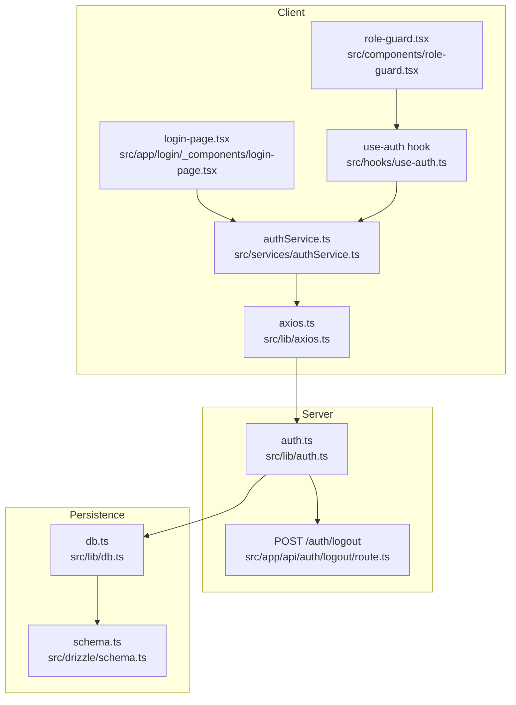
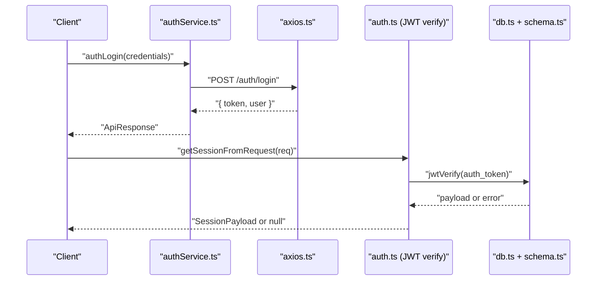
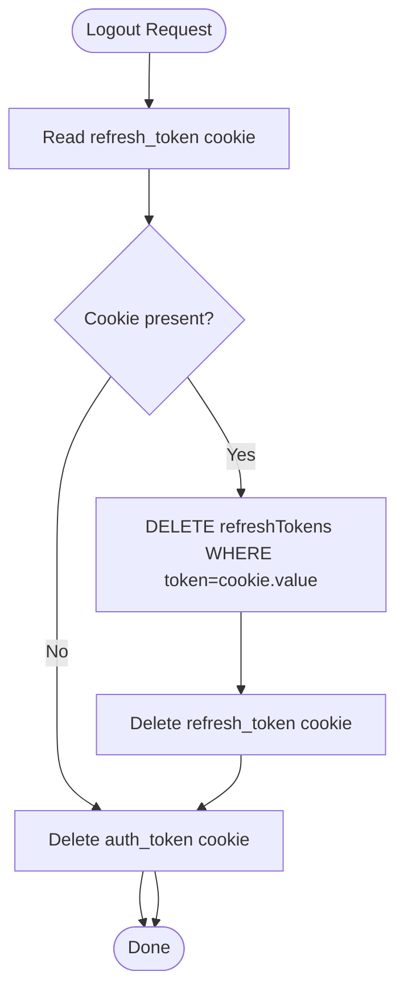
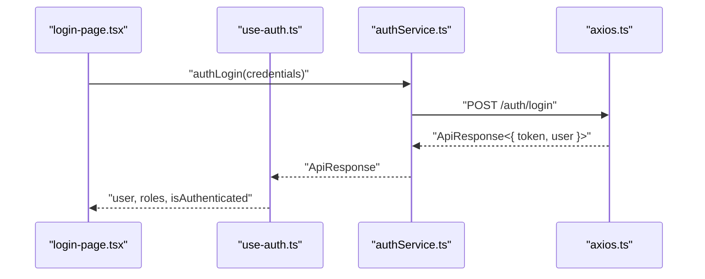
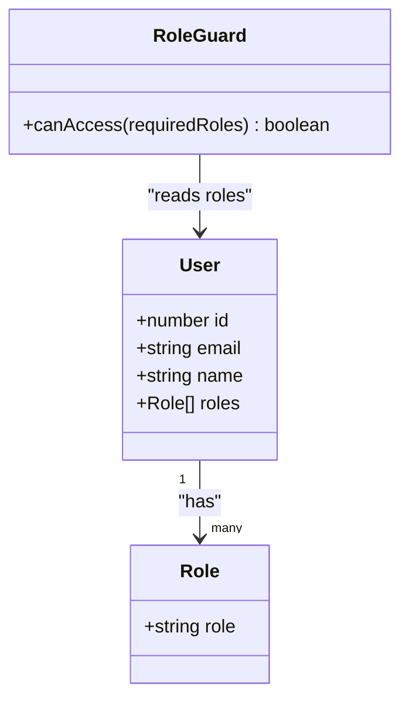
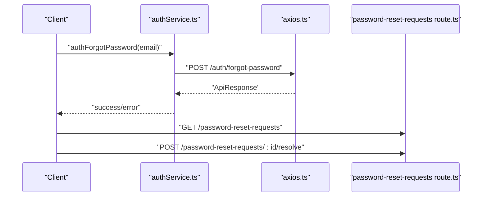
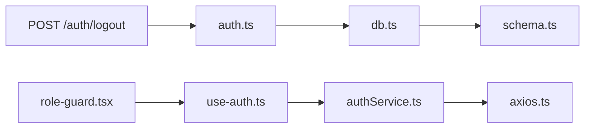

# Authentication & Authorization

<cite>
**Referenced Files in This Document**
- [authService.ts](file://src/services/authService.ts)
- [use-auth.ts](file://src/hooks/use-auth.ts)
- [auth.ts](file://src/lib/auth.ts)
- [route.ts](file://src/app/api/auth/logout/route.ts)
- [kebutuhan-fungsional.md](file://docs/kebutuhan-fungsional.md)
- [axios.ts](file://src/lib/axios.ts)
- [schema.ts](file://src/drizzle/schema.ts)
- [db.ts](file://src/lib/db.ts)
- [role-guard.tsx](file://src/components/role-guard.tsx)
- [login-page.tsx](file://src/app/login/_components/login-page.tsx)
- [passwordResetService.ts](file://src/services/passwordResetService.ts)
- [password-reset-requests route.ts](file://src/app/api/password-reset-requests/route.ts)
</cite>

## Table of Contents
1. [Introduction](#introduction)
2. [Project Structure](#project-structure)
3. [Core Components](#core-components)
4. [Architecture Overview](#architecture-overview)
5. [Detailed Component Analysis](#detailed-component-analysis)
6. [Dependency Analysis](#dependency-analysis)
7. [Performance Considerations](#performance-considerations)
8. [Security Considerations](#security-considerations)
9. [Troubleshooting Guide](#troubleshooting-guide)
10. [Conclusion](#conclusion)

## Introduction
This document explains the POS application’s authentication and authorization system. It covers JWT-based authentication, session lifecycle, role-based access control (RBAC), route protection, password reset, and security practices. The system integrates client-side hooks and services with server-side APIs and database-backed refresh tokens.

## Project Structure
The authentication system spans client services, React hooks, server routes, shared auth utilities, and database schema for refresh tokens.

**Diagram sources**
- [use-auth.ts:1-33](file://src/hooks/use-auth.ts#L1-L33)
- [authService.ts:1-62](file://src/services/authService.ts#L1-L62)
- [axios.ts](file://src/lib/axios.ts)
- [login-page.tsx](file://src/app/login/_components/login-page.tsx)
- [role-guard.tsx](file://src/components/role-guard.tsx)
- [auth.ts:50-124](file://src/lib/auth.ts#L50-L124)
- [route.ts:1-18](file://src/app/api/auth/logout/route.ts#L1-L18)
- [schema.ts](file://src/drizzle/schema.ts)
- [db.ts](file://src/lib/db.ts)

**Section sources**
- [authService.ts:1-62](file://src/services/authService.ts#L1-L62)
- [use-auth.ts:1-33](file://src/hooks/use-auth.ts#L1-L33)
- [auth.ts:50-124](file://src/lib/auth.ts#L50-L124)
- [route.ts:1-18](file://src/app/api/auth/logout/route.ts#L1-L18)
- [schema.ts](file://src/drizzle/schema.ts)
- [db.ts](file://src/lib/db.ts)
- [role-guard.tsx](file://src/components/role-guard.tsx)
- [login-page.tsx](file://src/app/login/_components/login-page.tsx)

## Core Components
- Client service layer encapsulates API calls for login, registration, profile retrieval, logout, and password reset initiation.
- React hook centralizes authentication state, caching, and navigation on logout.
- Shared auth utilities manage JWT verification, refresh token creation and validation, and session deletion.
- Server route handles logout by clearing tokens and refresh token records.
- RBAC model defines two roles: “admin toko” and “admin sistem,” enforced via UI guards and backend policies.

**Section sources**
- [authService.ts:28-62](file://src/services/authService.ts#L28-L62)
- [use-auth.ts:5-33](file://src/hooks/use-auth.ts#L5-L33)
- [auth.ts:50-124](file://src/lib/auth.ts#L50-L124)
- [route.ts:4-17](file://src/app/api/auth/logout/route.ts#L4-L17)
- [kebutuhan-fungsional.md:1-14](file://docs/kebutuhan-fungsional.md#L1-L14)

## Architecture Overview
The system uses HTTP-only, same-site refresh tokens stored in the database and short-lived JWT access tokens stored in cookies. The client interacts with REST endpoints via a typed service layer backed by an Axios instance. Middleware verifies access tokens for protected routes.

**Diagram sources**
- [authService.ts:28-40](file://src/services/authService.ts#L28-L40)
- [auth.ts:111-124](file://src/lib/auth.ts#L111-L124)
- [axios.ts](file://src/lib/axios.ts)
- [db.ts](file://src/lib/db.ts)
- [schema.ts](file://src/drizzle/schema.ts)

## Detailed Component Analysis

### JWT and Session Management
- Access tokens are validated server-side using a shared secret key and HS256 algorithm.
- Refresh tokens are long-lived, stored in the database, and returned as an HTTP-only cookie with strict SameSite and secure flags.
- Session deletion clears both access and refresh tokens from cookies and removes the refresh record from the database.

**Diagram sources**
- [auth.ts:65-94](file://src/lib/auth.ts#L65-L94)
- [route.ts:4-17](file://src/app/api/auth/logout/route.ts#L4-L17)

**Section sources**
- [auth.ts:50-124](file://src/lib/auth.ts#L50-L124)
- [route.ts:1-18](file://src/app/api/auth/logout/route.ts#L1-L18)
- [schema.ts](file://src/drizzle/schema.ts)
- [db.ts](file://src/lib/db.ts)

### Client-Side Authentication Flow
- The service layer exposes typed functions for login, profile fetch, registration, logout, and password reset initiation.
- The React hook manages authentication state, caches the user profile, and navigates after logout.

**Diagram sources**
- [login-page.tsx](file://src/app/login/_components/login-page.tsx)
- [use-auth.ts:9-14](file://src/hooks/use-auth.ts#L9-L14)
- [authService.ts:28-40](file://src/services/authService.ts#L28-L40)
- [axios.ts](file://src/lib/axios.ts)

**Section sources**
- [authService.ts:28-62](file://src/services/authService.ts#L28-L62)
- [use-auth.ts:1-33](file://src/hooks/use-auth.ts#L1-L33)
- [axios.ts](file://src/lib/axios.ts)

### Role-Based Access Control (RBAC)
- Roles are modeled as an array of role identifiers on the user object.
- The RBAC model defines two primary roles: “admin toko” and “admin sistem.”
- A role guard component restricts UI elements and pages based on the current user’s roles.

**Diagram sources**
- [authService.ts:6-19](file://src/services/authService.ts#L6-L19)
- [role-guard.tsx](file://src/components/role-guard.tsx)

**Section sources**
- [authService.ts:6-19](file://src/services/authService.ts#L6-L19)
- [kebutuhan-fungsional.md:1-14](file://docs/kebutuhan-fungsional.md#L1-L14)
- [role-guard.tsx](file://src/components/role-guard.tsx)

### Password Reset Workflow
- Initiation: The client calls the forgot password endpoint to request a reset.
- Backend: A dedicated API route handles requests and triggers email delivery (integration point).
- Resolution: An administrative route updates the reset request status and applies the password change.

**Diagram sources**
- [authService.ts:56-62](file://src/services/authService.ts#L56-L62)
- [axios.ts](file://src/lib/axios.ts)
- [password-reset-requests route.ts](file://src/app/api/password-reset-requests/route.ts)

**Section sources**
- [authService.ts:56-62](file://src/services/authService.ts#L56-L62)
- [passwordResetService.ts](file://src/services/passwordResetService.ts)
- [password-reset-requests route.ts](file://src/app/api/password-reset-requests/route.ts)

## Dependency Analysis
- Client services depend on Axios for HTTP transport.
- Auth utilities depend on the database client and Drizzle schema for refresh token persistence.
- Logout route depends on auth utilities to clear sessions.
- UI guards depend on the authentication hook for role checks.

**Diagram sources**
- [authService.ts:1-62](file://src/services/authService.ts#L1-L62)
- [axios.ts](file://src/lib/axios.ts)
- [use-auth.ts:1-33](file://src/hooks/use-auth.ts#L1-L33)
- [auth.ts:50-124](file://src/lib/auth.ts#L50-L124)
- [db.ts](file://src/lib/db.ts)
- [schema.ts](file://src/drizzle/schema.ts)
- [route.ts:1-18](file://src/app/api/auth/logout/route.ts#L1-L18)
- [role-guard.tsx](file://src/components/role-guard.tsx)

**Section sources**
- [authService.ts:1-62](file://src/services/authService.ts#L1-L62)
- [use-auth.ts:1-33](file://src/hooks/use-auth.ts#L1-L33)
- [auth.ts:50-124](file://src/lib/auth.ts#L50-L124)
- [route.ts:1-18](file://src/app/api/auth/logout/route.ts#L1-L18)
- [schema.ts](file://src/drizzle/schema.ts)
- [db.ts](file://src/lib/db.ts)
- [role-guard.tsx](file://src/components/role-guard.tsx)

## Performance Considerations
- Token verification is lightweight; cache user profile with a reasonable stale time to reduce network calls.
- Avoid frequent refresh token rotations; maintain a single refresh token per session.
- Use optimistic UI updates during logout and invalidate queries afterward to prevent stale data.

## Security Considerations
- Tokens are stored in cookies with secure, HTTP-only, and SameSite strict attributes to mitigate XSS and CSRF risks.
- Refresh tokens are persisted in the database and deleted on logout to enforce revocation.
- Access tokens are verified server-side using a shared secret key with HS256.
- Rate-limit sensitive endpoints (login, password reset) at the gateway or middleware level to prevent abuse.
- Enforce CSRF protection by validating referer/source origin for state-changing requests.
- Rotate secrets regularly and monitor for anomalies in token issuance and usage.

## Troubleshooting Guide
- Authentication state not updating:
  - Verify the profile query is not cached with infinite retries; confirm staleTime and query keys align with the hook.
- Logout does not clear session:
  - Ensure the server route executes session deletion and that cookies are set with correct domain/path/sameSite.
- Refresh token invalid:
  - Confirm the refresh token exists in the database and is not expired; check cookie presence and server-side verification.
- Role-based UI not rendering:
  - Confirm the user roles are returned by the profile endpoint and mapped correctly in the hook.

**Section sources**
- [use-auth.ts:9-14](file://src/hooks/use-auth.ts#L9-L14)
- [auth.ts:65-94](file://src/lib/auth.ts#L65-L94)
- [route.ts:4-17](file://src/app/api/auth/logout/route.ts#L4-L17)

## Conclusion
The POS application implements a robust, layered authentication and authorization system centered on JWT access tokens, HTTP-only refresh tokens, and RBAC. The client services and hooks provide a clean API surface, while server utilities and database-backed refresh tokens ensure secure session lifecycle management. Extending the system involves adding new endpoints, integrating email services for password resets, and enforcing role checks via the existing role guard.