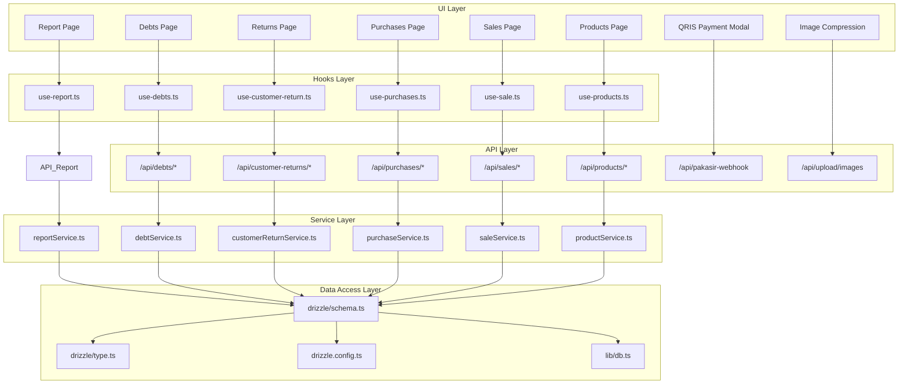
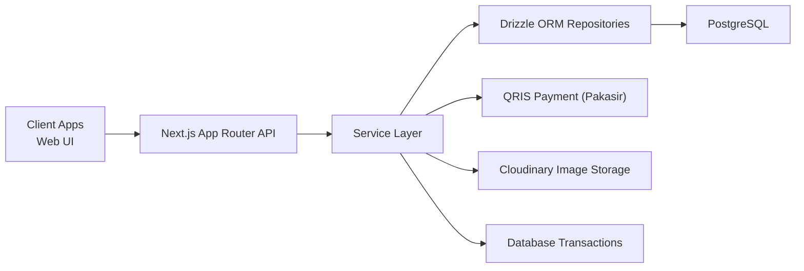
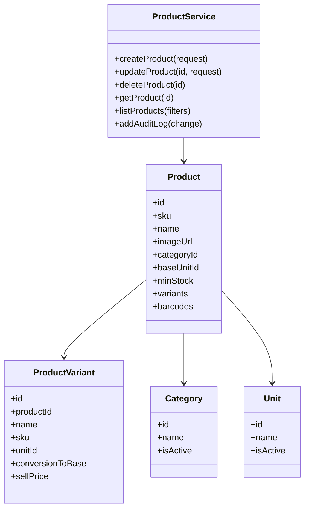
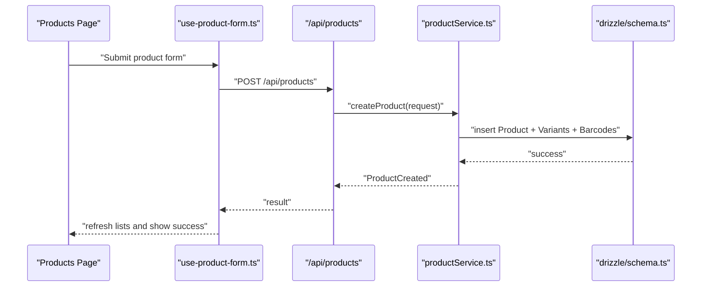
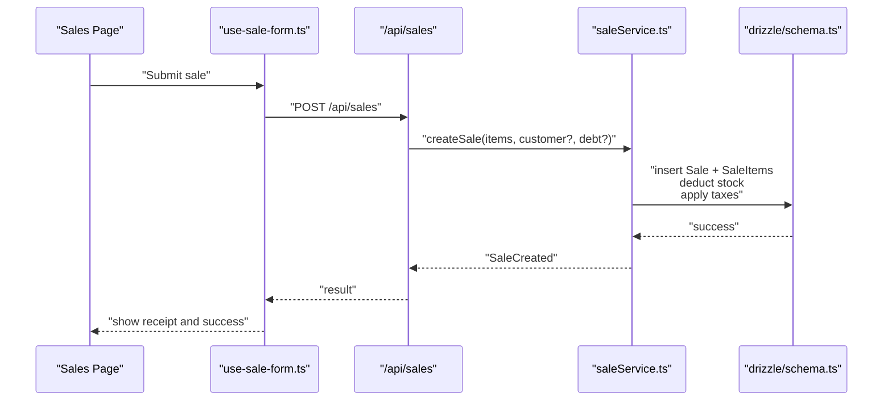
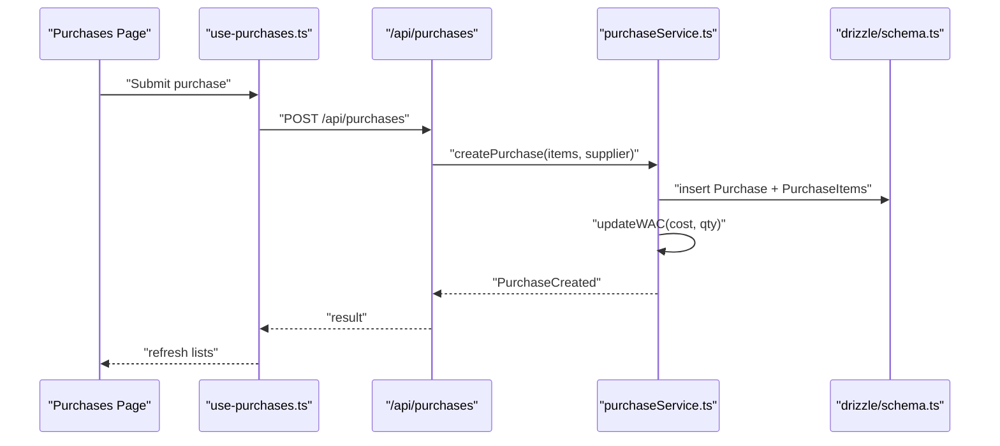
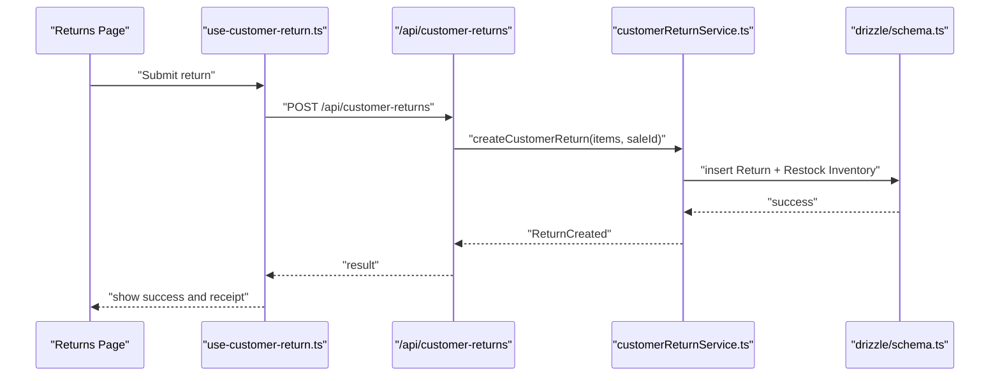
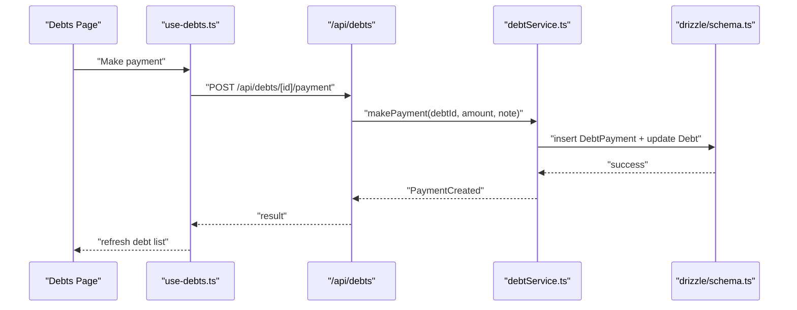
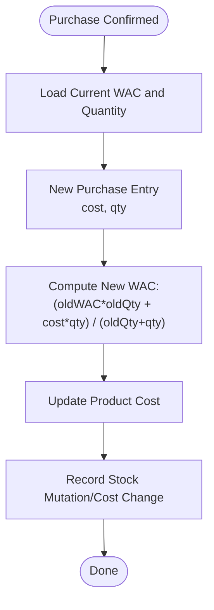
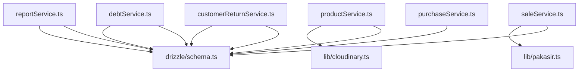

# Business Logic Modules

<cite>
**Referenced Files in This Document**
- [README.md](file://README.md)
- [CALCULATIONS.md](file://CALCULATIONS.md)
- [plan.md](file://plan.md)
- [drizzle.config.ts](file://drizzle.config.ts)
- [src/drizzle/schema.ts](file://src/drizzle/schema.ts)
- [src/drizzle/type.ts](file://src/drizzle/type.ts)
- [src/lib/db.ts](file://src/lib/db.ts)
- [src/lib/cloudinary.ts](file://src/lib/cloudinary.ts)
- [src/lib/pakasir.ts](file://src/lib/pakasir.ts)
- [src/lib/business-terms.ts](file://src/lib/business-terms.ts)
- [src/lib/query-utils.ts](file://src/lib/query-utils.ts)
- [src/services/productService.ts](file://src/services/productService.ts)
- [src/services/purchaseService.ts](file://src/services/purchaseService.ts)
- [src/services/saleService.ts](file://src/services/saleService.ts)
- [src/services/customerReturnService.ts](file://src/services/customerReturnService.ts)
- [src/services/debtService.ts](file://src/services/debtService.ts)
- [src/services/reportService.ts](file://src/services/reportService.ts)
- [src/app/api/products/_lib/audit.ts](file://src/app/api/products/_lib/audit.ts)
- [src/app/api/customer-returns/_lib/return-service.ts](file://src/app/api/customer-returns/_lib/return-service.ts)
- [src/app/api/debts/_lib/debt-service.ts](file://src/app/api/debts/_lib/debt-service.ts)
- [src/app/api/purchases/[purchaseId]/route.ts](file://src/app/api/purchases/[purchaseId]/route.ts)
- [src/app/api/sales/[salesId]/status/route.ts](file://src/app/api/sales/[salesId]/status/route.ts)
- [src/app/api/pakasir-webhook/route.ts](file://src/app/api/pakasir-webhook/route.ts)
- [src/app/api/upload/images/route.ts](file://src/app/api/upload/images/route.ts)
- [src/hooks/products/use-product-form.ts](file://src/hooks/products/use-product-form.ts)
- [src/hooks/sales/use-sale-form.ts](file://src/hooks/sales/use-sale-form.ts)
- [src/hooks/debt/use-debts.ts](file://src/hooks/debt/use-debts.ts)
- [src/hooks/master/use-customers.ts](file://src/hooks/master/use-customers.ts)
- [src/hooks/products/use-products.ts](file://src/hooks/products/use-products.ts)
- [src/hooks/purchases/use-purchases.ts](file://src/hooks/purchases/use-purchases.ts)
- [src/hooks/sales/use-sale.ts](file://src/hooks/sales/use-sale.ts)
- [src/hooks/report/use-report.ts](file://src/hooks/report/use-report.ts)
- [src/components/qris-payment-modal.tsx](file://src/components/qris-payment-modal.tsx)
- [src/components/compress-image.tsx](file://src/components/compress-image.tsx)
- [docs/uml-class-product-management.puml](file://docs/uml-class-product-management.puml)
- [docs/uml-class-module-f-debt-payment.puml](file://docs/uml-class-module-f-debt-payment.puml)
- [docs/uml-activity-product.puml](file://docs/uml-activity-product.puml)
- [docs/uml-activity-purchase.puml](file://docs/uml-activity-purchase.puml)
- [docs/uml-activity-sales.puml](file://docs/uml-activity-sales.puml)
- [docs/uml-activity-return.puml](file://docs/uml-activity-return.puml)
- [docs/uml-activity-debt.puml](file://docs/uml-activity-debt.puml)
- [docs/uml-sequence-product.puml](file://docs/uml-sequence-product.puml)
- [docs/uml-sequence-purchase.puml](file://docs/uml-sequence-purchase.puml)
- [docs/uml-sequence-sales.puml](file://docs/uml-sequence-sales.puml)
- [docs/uml-sequence-return.puml](file://docs/uml-sequence-return.puml)
- [docs/uml-sequence-debt.puml](file://docs/uml-sequence-debt.puml)
</cite>

## Table of Contents
1. [Introduction](#introduction)
2. [Project Structure](#project-structure)
3. [Core Components](#core-components)
4. [Architecture Overview](#architecture-overview)
5. [Detailed Component Analysis](#detailed-component-analysis)
6. [Dependency Analysis](#dependency-analysis)
7. [Performance Considerations](#performance-considerations)
8. [Troubleshooting Guide](#troubleshooting-guide)
9. [Conclusion](#conclusion)
10. [Appendices](#appendices)

## Introduction
This document explains the business logic modules of the Point-of-Sale (POS) application with a focus on service-layer architecture and separation of concerns. It covers:
- Clear separation between data access, business rule implementation, and external integrations
- Core business modules: product management, sales processing, purchase management, customer handling, and reporting
- Weighted Average Cost (WAC) calculation algorithm and real-time cost updates
- Transaction workflows: purchase orders, sales, returns, and debt management
- Error handling, validation, and business rule enforcement
- Integration patterns with QRIS payment and Cloudinary image storage
- Performance optimization, caching strategies, and data consistency guarantees

## Project Structure
The application follows a layered architecture:
- Data Access Layer: Drizzle ORM schema and typed entities
- Service Layer: Business logic implemented in dedicated service modules
- API Layer: Next.js App Router API handlers orchestrate requests and delegate to services
- Hooks Layer: TanStack Query-driven data fetching and cache invalidation
- UI Layer: React components and modals integrate with services via hooks

**Diagram sources**
- [src/services/productService.ts](file://src/services/productService.ts)
- [src/services/saleService.ts](file://src/services/saleService.ts)
- [src/services/purchaseService.ts](file://src/services/purchaseService.ts)
- [src/services/customerReturnService.ts](file://src/services/customerReturnService.ts)
- [src/services/debtService.ts](file://src/services/debtService.ts)
- [src/services/reportService.ts](file://src/services/reportService.ts)
- [src/drizzle/schema.ts](file://src/drizzle/schema.ts)
- [src/drizzle/type.ts](file://src/drizzle/type.ts)
- [drizzle.config.ts](file://drizzle.config.ts)
- [src/lib/db.ts](file://src/lib/db.ts)
- [src/hooks/products/use-products.ts](file://src/hooks/products/use-products.ts)
- [src/hooks/sales/use-sale.ts](file://src/hooks/sales/use-sale.ts)
- [src/hooks/purchases/use-purchases.ts](file://src/hooks/purchases/use-purchases.ts)
- [src/hooks/debt/use-debts.ts](file://src/hooks/debt/use-debts.ts)
- [src/hooks/report/use-report.ts](file://src/hooks/report/use-report.ts)

**Section sources**
- [README.md](file://README.md)
- [drizzle.config.ts](file://drizzle.config.ts)
- [src/drizzle/schema.ts](file://src/drizzle/schema.ts)
- [src/drizzle/type.ts](file://src/drizzle/type.ts)
- [src/lib/db.ts](file://src/lib/db.ts)

## Core Components
This section outlines the primary business modules and their responsibilities.

- Product Management
  - Responsibilities: CRUD operations, variant management, barcode associations, stock visibility, audit logging, and image upload via Cloudinary
  - Key APIs: /api/products, /api/products/[productId], /api/products/[productId]/audit-logs
  - Services: productService.ts orchestrates product lifecycle and audit logs
  - Hooks: use-products.ts, use-product-form.ts
  - Validation: product-related validations in hooks and server-side routes
  - Image Upload: Cloudinary integration via /api/upload/images and compression component

- Sales Processing
  - Responsibilities: sale creation, cart assembly, inventory deduction, taxes, totals, receipt generation, return linkage, and debt settlement
  - Key APIs: /api/sales, /api/sales/[salesId], /api/sales/[salesId]/status
  - Services: saleService.ts handles transaction logic and status transitions
  - Hooks: use-sale.ts, use-sale-form.ts
  - Returns: linked to sales via customer returns module

- Purchase Management
  - Responsibilities: purchase order creation, supplier linkage, cost accounting, stock adjustments, and WAC updates
  - Key APIs: /api/purchases, /api/purchases/[purchaseId]
  - Services: purchaseService.ts manages purchase lifecycle and cost updates
  - Hooks: use-purchases.ts

- Customer Handling
  - Responsibilities: customer CRUD, debt tracking, return records, and related queries
  - Key APIs: /api/master/customers, /api/master/customers/[customerId]/relations
  - Hooks: use-customers.ts

- Reporting
  - Responsibilities: financial summaries, sales analytics, purchase analytics, and operational cost aggregation
  - Services: reportService.ts consolidates KPIs and charts
  - Hooks: use-report.ts

- Debt Management
  - Responsibilities: debt creation, partial/full payments, payment history, and status updates
  - Key APIs: /api/debts, /api/debts/[id]/payment
  - Services: debtService.ts orchestrates payment logic and status transitions
  - Hooks: use-debts.ts

- Returns
  - Responsibilities: customer return creation, inventory restocking, refund computation, and exchange handling
  - Key APIs: /api/customer-returns, /api/customer-returns/[customerReturnId]
  - Services: customerReturnService.ts coordinates return logic
  - Hooks: use-customer-return.ts

**Section sources**
- [src/services/productService.ts](file://src/services/productService.ts)
- [src/services/saleService.ts](file://src/services/saleService.ts)
- [src/services/purchaseService.ts](file://src/services/purchaseService.ts)
- [src/services/customerReturnService.ts](file://src/services/customerReturnService.ts)
- [src/services/debtService.ts](file://src/services/debtService.ts)
- [src/services/reportService.ts](file://src/services/reportService.ts)
- [src/hooks/products/use-products.ts](file://src/hooks/products/use-products.ts)
- [src/hooks/sales/use-sale.ts](file://src/hooks/sales/use-sale.ts)
- [src/hooks/purchases/use-purchases.ts](file://src/hooks/purchases/use-purchases.ts)
- [src/hooks/debt/use-debts.ts](file://src/hooks/debt/use-debts.ts)
- [src/hooks/report/use-report.ts](file://src/hooks/report/use-report.ts)
- [src/hooks/master/use-customers.ts](file://src/hooks/master/use-customers.ts)

## Architecture Overview
The service layer enforces business rules and encapsulates domain logic while delegating persistence to Drizzle ORM. External integrations are isolated behind service boundaries.

**Diagram sources**
- [src/services/productService.ts](file://src/services/productService.ts)
- [src/services/saleService.ts](file://src/services/saleService.ts)
- [src/services/purchaseService.ts](file://src/services/purchaseService.ts)
- [src/services/customerReturnService.ts](file://src/services/customerReturnService.ts)
- [src/services/debtService.ts](file://src/services/debtService.ts)
- [src/services/reportService.ts](file://src/services/reportService.ts)
- [src/lib/db.ts](file://src/lib/db.ts)
- [src/lib/pakasir.ts](file://src/lib/pakasir.ts)
- [src/lib/cloudinary.ts](file://src/lib/cloudinary.ts)

## Detailed Component Analysis

### Product Management Module
Responsibilities:
- Create/update/delete products with variants and barcodes
- Maintain base unit conversions and pricing
- Enforce minimum stock thresholds and stock visibility
- Audit product changes and expose audit logs
- Upload and manage product images via Cloudinary

Implementation highlights:
- Service orchestrates product creation, updates, and soft deletion (per current schema)
- Audit logging is integrated into product lifecycle
- Image compression and upload handled via UI component and API endpoint

**Diagram sources**
- [docs/uml-class-product-management.puml](file://docs/uml-class-product-management.puml)
- [src/services/productService.ts](file://src/services/productService.ts)

**Diagram sources**
- [src/hooks/products/use-product-form.ts](file://src/hooks/products/use-product-form.ts)
- [src/app/api/products/route.ts](file://src/app/api/products/route.ts)
- [src/services/productService.ts](file://src/services/productService.ts)
- [src/drizzle/schema.ts](file://src/drizzle/schema.ts)

**Section sources**
- [src/services/productService.ts](file://src/services/productService.ts)
- [src/app/api/products/_lib/audit.ts](file://src/app/api/products/_lib/audit.ts)
- [src/app/api/upload/images/route.ts](file://src/app/api/upload/images/route.ts)
- [src/components/compress-image.tsx](file://src/components/compress-image.tsx)
- [docs/uml-class-product-management.puml](file://docs/uml-class-product-management.puml)
- [docs/uml-activity-product.puml](file://docs/uml-activity-product.puml)
- [docs/uml-sequence-product.puml](file://docs/uml-sequence-product.puml)

### Sales Processing Module
Responsibilities:
- Build sales transactions from cart items
- Deduct inventory quantities and compute totals
- Apply taxes and discounts
- Link returns and settle debts
- Generate receipts and update statuses

**Diagram sources**
- [src/hooks/sales/use-sale-form.ts](file://src/hooks/sales/use-sale-form.ts)
- [src/app/api/sales/route.ts](file://src/app/api/sales/route.ts)
- [src/services/saleService.ts](file://src/services/saleService.ts)
- [src/drizzle/schema.ts](file://src/drizzle/schema.ts)

**Section sources**
- [src/services/saleService.ts](file://src/services/saleService.ts)
- [src/app/api/sales/[salesId]/status/route.ts](file://src/app/api/sales/[salesId]/status/route.ts)
- [docs/uml-activity-sales.puml](file://docs/uml-activity-sales.puml)
- [docs/uml-sequence-sales.puml](file://docs/uml-sequence-sales.puml)

### Purchase Management Module
Responsibilities:
- Manage purchase orders and supplier relations
- Record purchase items and costs
- Update product cost via WAC upon purchase confirmation
- Trigger stock adjustments and mutations

**Diagram sources**
- [src/hooks/purchases/use-purchases.ts](file://src/hooks/purchases/use-purchases.ts)
- [src/app/api/purchases/route.ts](file://src/app/api/purchases/route.ts)
- [src/services/purchaseService.ts](file://src/services/purchaseService.ts)
- [src/drizzle/schema.ts](file://src/drizzle/schema.ts)

**Section sources**
- [src/services/purchaseService.ts](file://src/services/purchaseService.ts)
- [src/app/api/purchases/[purchaseId]/route.ts](file://src/app/api/purchases/[purchaseId]/route.ts)
- [docs/uml-activity-purchase.puml](file://docs/uml-activity-purchase.puml)
- [docs/uml-sequence-purchase.puml](file://docs/uml-sequence-purchase.puml)

### Customer Returns Module
Responsibilities:
- Process customer returns with inventory restock
- Compute refunds and exchanges
- Link returns to original sales
- Maintain return audit trail

**Diagram sources**
- [src/app/api/customer-returns/_lib/return-service.ts](file://src/app/api/customer-returns/_lib/return-service.ts)
- [src/services/customerReturnService.ts](file://src/services/customerReturnService.ts)
- [src/drizzle/schema.ts](file://src/drizzle/schema.ts)

**Section sources**
- [src/services/customerReturnService.ts](file://src/services/customerReturnService.ts)
- [src/app/api/customer-returns/_lib/return-service.ts](file://src/app/api/customer-returns/_lib/return-service.ts)
- [docs/uml-activity-return.puml](file://docs/uml-activity-return.puml)
- [docs/uml-sequence-return.puml](file://docs/uml-sequence-return.puml)

### Debt Management Module
Responsibilities:
- Track customer liabilities and partial payments
- Generate payment receipts and update status
- Deactivate paid debts and maintain payment history

**Diagram sources**
- [src/app/api/debts/_lib/debt-service.ts](file://src/app/api/debts/_lib/debt-service.ts)
- [src/services/debtService.ts](file://src/services/debtService.ts)
- [src/drizzle/schema.ts](file://src/drizzle/schema.ts)

**Section sources**
- [src/services/debtService.ts](file://src/services/debtService.ts)
- [src/app/api/debts/_lib/debt-service.ts](file://src/app/api/debts/_lib/debt-service.ts)
- [docs/uml-class-module-f-debt-payment.puml](file://docs/uml-class-module-f-debt-payment.puml)
- [docs/uml-activity-debt.puml](file://docs/uml-activity-debt.puml)
- [docs/uml-sequence-debt.puml](file://docs/uml-sequence-debt.puml)

### Reporting Module
Responsibilities:
- Aggregate sales, purchase, and operational cost data
- Provide financial summaries and charts
- Support filtering and time-range selection

**Section sources**
- [src/services/reportService.ts](file://src/services/reportService.ts)
- [src/hooks/report/use-report.ts](file://src/hooks/report/use-report.ts)

### Weighted Average Cost (WAC) Calculation and Real-Time Updates
WAC is computed when purchase confirmations are processed. The algorithm updates the average cost of a product based on new purchase quantity and price, ensuring real-time cost reflection in inventory valuation and COGS calculations.

**Diagram sources**
- [src/services/purchaseService.ts](file://src/services/purchaseService.ts)
- [CALCULATIONS.md](file://CALCULATIONS.md)

**Section sources**
- [src/services/purchaseService.ts](file://src/services/purchaseService.ts)
- [CALCULATIONS.md](file://CALCULATIONS.md)

### External Integrations
- QRIS Payment (Pakasir)
  - Webhook endpoint receives payment events and updates transaction status
  - UI modal integrates QRIS payment flow
  - Service logic validates webhook signatures and updates related sale records

- Cloudinary Image Storage
  - Image compression component prepares optimized assets
  - Upload API endpoint stores images and returns secure URLs
  - Product service uses returned URLs for product images

**Section sources**
- [src/app/api/pakasir-webhook/route.ts](file://src/app/api/pakasir-webhook/route.ts)
- [src/components/qris-payment-modal.tsx](file://src/components/qris-payment-modal.tsx)
- [src/lib/pakasir.ts](file://src/lib/pakasir.ts)
- [src/lib/cloudinary.ts](file://src/lib/cloudinary.ts)
- [src/app/api/upload/images/route.ts](file://src/app/api/upload/images/route.ts)
- [src/components/compress-image.tsx](file://src/components/compress-image.tsx)

## Dependency Analysis
The service layer depends on Drizzle ORM for persistence and exposes clean business interfaces to API routes and UI hooks. External services are accessed through dedicated libraries and endpoints.

**Diagram sources**
- [src/services/productService.ts](file://src/services/productService.ts)
- [src/services/saleService.ts](file://src/services/saleService.ts)
- [src/services/purchaseService.ts](file://src/services/purchaseService.ts)
- [src/services/customerReturnService.ts](file://src/services/customerReturnService.ts)
- [src/services/debtService.ts](file://src/services/debtService.ts)
- [src/services/reportService.ts](file://src/services/reportService.ts)
- [src/lib/pakasir.ts](file://src/lib/pakasir.ts)
- [src/lib/cloudinary.ts](file://src/lib/cloudinary.ts)
- [src/drizzle/schema.ts](file://src/drizzle/schema.ts)

**Section sources**
- [src/services/productService.ts](file://src/services/productService.ts)
- [src/services/saleService.ts](file://src/services/saleService.ts)
- [src/services/purchaseService.ts](file://src/services/purchaseService.ts)
- [src/services/customerReturnService.ts](file://src/services/customerReturnService.ts)
- [src/services/debtService.ts](file://src/services/debtService.ts)
- [src/services/reportService.ts](file://src/services/reportService.ts)
- [src/lib/pakasir.ts](file://src/lib/pakasir.ts)
- [src/lib/cloudinary.ts](file://src/lib/cloudinary.ts)
- [src/drizzle/schema.ts](file://src/drizzle/schema.ts)

## Performance Considerations
- Caching and Invalidation
  - Centralized invalidation utility invalidates business-related queries after mutations
  - Invalidate product, dashboard, report, debt, customer, sale, purchase, and notification caches

- Batch Operations
  - Prefer batch inserts/updates for purchase items and product variants to reduce round-trips

- Indexing and Queries
  - Ensure database indexes on foreign keys, timestamps, and frequently filtered fields
  - Use selective projections and joins to minimize payload sizes

- Image Optimization
  - Compress images before upload to reduce bandwidth and storage overhead

- Asynchronous Work
  - Offload heavy computations (e.g., analytics) to background jobs or scheduled tasks

**Section sources**
- [src/lib/query-utils.ts](file://src/lib/query-utils.ts)
- [src/components/compress-image.tsx](file://src/components/compress-image.tsx)

## Troubleshooting Guide
Common issues and resolutions:
- Transaction Rollback on Constraint Violations
  - Ensure purchase items and sale items match existing product variants and units
  - Validate customer existence for sales and returns

- WAC Discrepancies
  - Verify purchase confirmations trigger WAC updates
  - Reconcile stock mutations and cost changes after bulk operations

- QRIS Webhook Failures
  - Confirm webhook signature verification and retry logic
  - Check sale status transitions after successful payment events

- Image Upload Errors
  - Validate Cloudinary credentials and upload preset
  - Ensure compressed images meet size and format requirements

- Cache Stale Data
  - Trigger centralized invalidation after mutations
  - Confirm query keys align with invalidation targets

**Section sources**
- [src/lib/query-utils.ts](file://src/lib/query-utils.ts)
- [src/lib/pakasir.ts](file://src/lib/pakasir.ts)
- [src/lib/cloudinary.ts](file://src/lib/cloudinary.ts)
- [src/services/purchaseService.ts](file://src/services/purchaseService.ts)

## Conclusion
The POS application’s business logic is organized around a clean service layer that encapsulates domain rules, integrates with Drizzle ORM for persistence, and interacts with external systems for payments and media. The modules for product, sales, purchases, returns, debts, and reporting are cohesive and support robust workflows, validation, and real-time cost updates. Adhering to the outlined patterns ensures maintainability, scalability, and data consistency.

## Appendices
- Business Terms and Constraints
  - Refer to business terms for standardized definitions and constraints used across modules

- Trash and Hard Delete Plan
  - Removal of soft delete and introduction of hard delete with relation checks to prevent accidental data loss

**Section sources**
- [src/lib/business-terms.ts](file://src/lib/business-terms.ts)
- [plan.md](file://plan.md)