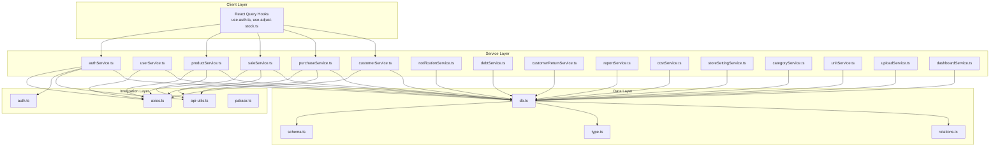
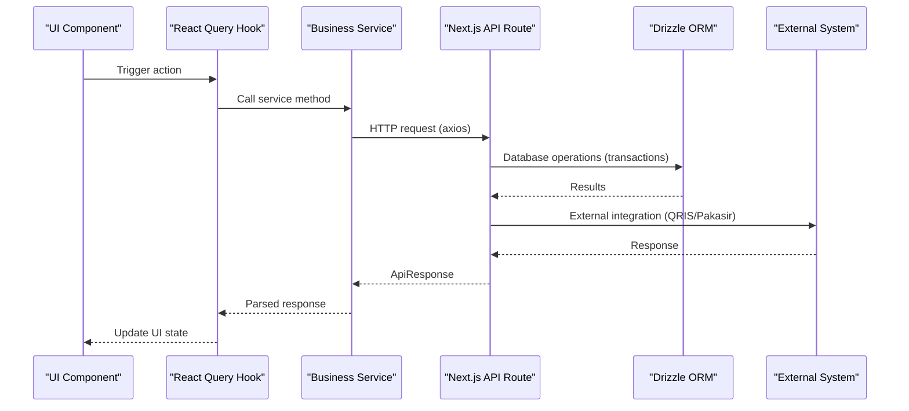
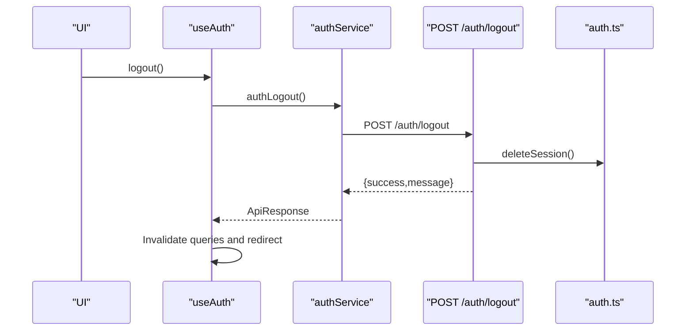
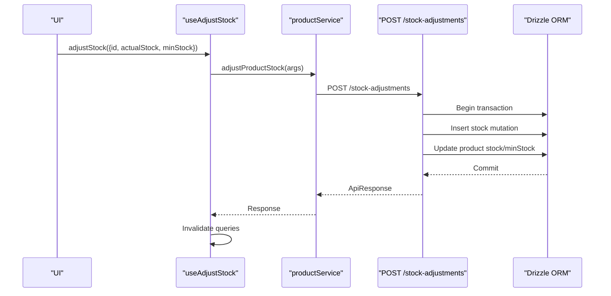
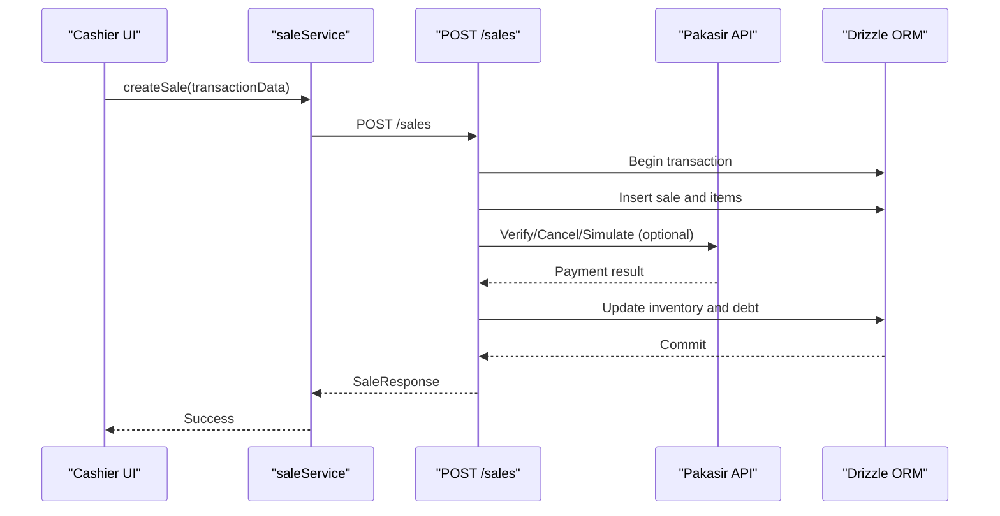
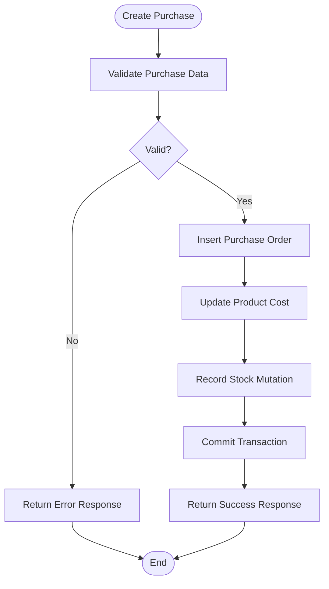
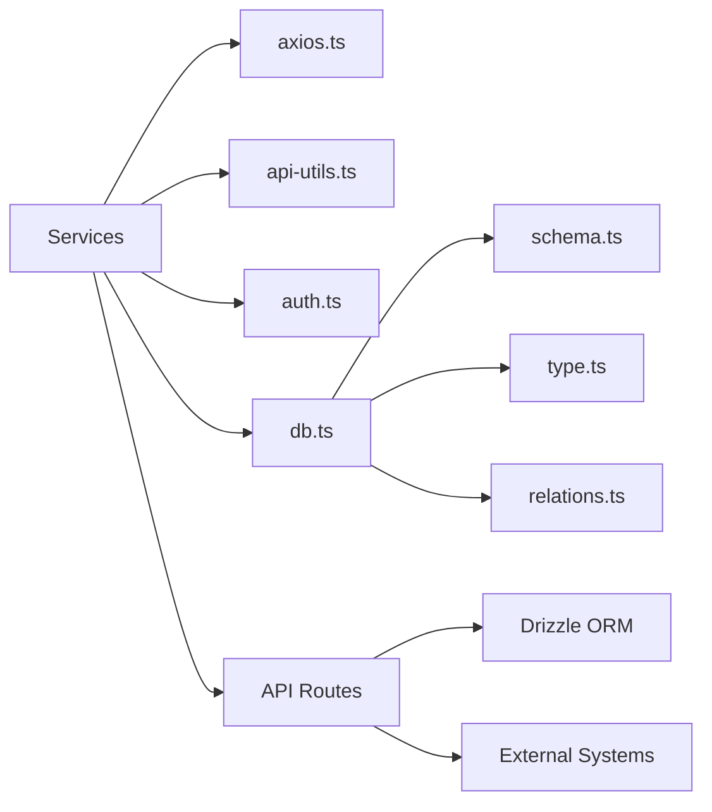

# Core Business Services

<cite>
**Referenced Files in This Document**
- [authService.ts](file://src/services/authService.ts)
- [userService.ts](file://src/services/userService.ts)
- [productService.ts](file://src/services/productService.ts)
- [saleService.ts](file://src/services/saleService.ts)
- [purchaseService.ts](file://src/services/purchaseService.ts)
- [customerService.ts](file://src/services/customerService.ts)
- [notificationService.ts](file://src/services/notificationService.ts)
- [passwordResetService.ts](file://src/services/passwordResetService.ts)
- [debtService.ts](file://src/services/debtService.ts)
- [customerReturnService.ts](file://src/services/customerReturnService.ts)
- [reportService.ts](file://src/services/reportService.ts)
- [storeSettingService.ts](file://src/services/storeSettingService.ts)
- [categoryService.ts](file://src/services/categoryService.ts)
- [unitService.ts](file://src/services/unitService.ts)
- [costService.ts](file://src/services/costService.ts)
- [uploadService.ts](file://src/services/uploadService.ts)
- [dashboardService.ts](file://src/services/dashboardService.ts)
- [db.ts](file://src/lib/db.ts)
- [axios.ts](file://src/lib/axios.ts)
- [api-utils.ts](file://src/lib/api-utils.ts)
- [auth.ts](file://src/lib/auth.ts)
- [pakasir.ts](file://src/lib/pakasir.ts)
- [route.ts](file://src/app/api/auth/logout/route.ts)
- [route.ts](file://src/app/api/products/[productId]/route.ts)
- [route.ts](file://src/app/api/sales/[salesId]/route.ts)
- [route.ts](file://src/app/api/stock-adjustments/route.ts)
- [route.ts](file://src/app/api/stock-mutations/route.ts)
- [route.ts](file://src/app/api/reports/route.ts)
- [use-auth.ts](file://src/hooks/use-auth.ts)
- [use-adjust-stock.ts](file://src/hooks/products/use-adjust-stock.ts)
- [page.tsx](file://src/app/dashboard/purchases/page.tsx)
- [purchase-type.ts](file://src/app/dashboard/purchases/_types/purchase-type.ts)
- [sale-type.ts](file://src/app/dashboard/sales/_types/sale-type.ts)
- [schema.ts](file://src/drizzle/schema.ts)
- [relations.ts](file://src/drizzle/relations.ts)
- [type.ts](file://src/drizzle/type.ts)
</cite>

## Table of Contents
1. [Introduction](#introduction)
2. [Project Structure](#project-structure)
3. [Core Components](#core-components)
4. [Architecture Overview](#architecture-overview)
5. [Detailed Component Analysis](#detailed-component-analysis)
6. [Dependency Analysis](#dependency-analysis)
7. [Performance Considerations](#performance-considerations)
8. [Troubleshooting Guide](#troubleshooting-guide)
9. [Conclusion](#conclusion)

## Introduction
This document describes the core business services that orchestrate primary business operations in the Point of Sale (POS) application. It explains the service layer architecture with clear separation between:
- Data access via Drizzle ORM
- Business rule implementation
- External integrations (e.g., QRIS payment system)

Each service encapsulates domain-specific logic, enforces validation and error handling, and coordinates with database operations and external systems. The documentation covers authentication, product, sale, purchase, customer, and user services, along with supporting services for reporting, notifications, and operational costs.

## Project Structure
The service layer is organized under src/services and integrates with:
- API routes under src/app/api for HTTP endpoints
- React Query hooks under src/hooks for client-side caching and mutations
- Drizzle ORM schema under src/drizzle for database modeling
- Shared libraries under src/lib for HTTP clients, authentication, and utilities

**Diagram sources**
- [use-auth.ts:1-33](file://src/hooks/use-auth.ts#L1-L33)
- [use-adjust-stock.ts:1-20](file://src/hooks/products/use-adjust-stock.ts#L1-L20)
- [authService.ts:1-120](file://src/services/authService.ts#L1-L120)
- [userService.ts:1-120](file://src/services/userService.ts#L1-L120)
- [productService.ts:1-120](file://src/services/productService.ts#L1-L120)
- [saleService.ts:1-120](file://src/services/saleService.ts#L1-L120)
- [purchaseService.ts:1-120](file://src/services/purchaseService.ts#L1-L120)
- [customerService.ts:1-120](file://src/services/customerService.ts#L1-L120)
- [notificationService.ts:1-120](file://src/services/notificationService.ts#L1-L120)
- [debtService.ts:1-120](file://src/services/debtService.ts#L1-L120)
- [customerReturnService.ts:1-120](file://src/services/customerReturnService.ts#L1-L120)
- [reportService.ts:1-120](file://src/services/reportService.ts#L1-L120)
- [costService.ts:1-120](file://src/services/costService.ts#L1-L120)
- [storeSettingService.ts:1-120](file://src/services/storeSettingService.ts#L1-L120)
- [categoryService.ts:1-120](file://src/services/categoryService.ts#L1-L120)
- [unitService.ts:1-120](file://src/services/unitService.ts#L1-L120)
- [uploadService.ts:1-120](file://src/services/uploadService.ts#L1-L120)
- [dashboardService.ts:1-120](file://src/services/dashboardService.ts#L1-L120)
- [axios.ts:1-120](file://src/lib/axios.ts#L1-L120)
- [auth.ts:1-120](file://src/lib/auth.ts#L1-L120)
- [api-utils.ts:1-120](file://src/lib/api-utils.ts#L1-L120)
- [pakasir.ts:1-120](file://src/lib/pakasir.ts#L1-L120)
- [db.ts:1-120](file://src/lib/db.ts#L1-L120)
- [schema.ts:1-120](file://src/drizzle/schema.ts#L1-L120)
- [type.ts:1-120](file://src/drizzle/type.ts#L1-L120)
- [relations.ts:1-120](file://src/drizzle/relations.ts#L1-L120)

**Section sources**
- [use-auth.ts:1-33](file://src/hooks/use-auth.ts#L1-L33)
- [use-adjust-stock.ts:1-20](file://src/hooks/products/use-adjust-stock.ts#L1-L20)
- [axios.ts:1-120](file://src/lib/axios.ts#L1-L120)
- [db.ts:1-120](file://src/lib/db.ts#L1-L120)
- [schema.ts:1-120](file://src/drizzle/schema.ts#L1-L120)
- [type.ts:1-120](file://src/drizzle/type.ts#L1-L120)
- [relations.ts:1-120](file://src/drizzle/relations.ts#L1-L120)

## Core Components
This section outlines the responsibilities and key characteristics of each core business service.

- Authentication Service (authService.ts)
  - Responsibilities: User login, logout, session management, password reset initiation, and current user retrieval.
  - Method signatures: login, logout, forgotPassword, changePassword, me.
  - Validation: Delegated to API routes and shared validation utilities.
  - Error handling: Returns ApiResponse with success/error flags and optional error messages.
  - External integration: Uses axios instance to call backend endpoints; integrates with session management library.

- User Service (userService.ts)
  - Responsibilities: CRUD operations for users, login, and current user profile retrieval.
  - Method signatures: getUserById, createUser, updateUser, deleteUser, login, getCurrentUser, changePassword.
  - Validation: Input types defined in shared validation modules; server-side validation enforced by API routes.
  - Error handling: Standardized ApiResponse pattern; leverages API error handler.
  - Transaction boundaries: Operations are single requests; no multi-step transactions in service methods.

- Product Service (productService.ts)
  - Responsibilities: Product lifecycle operations, variant management, stock adjustments, and stock mutation queries.
  - Method signatures: getProductById, createProduct, updateProduct, deleteProduct, adjustStock, getStockMutations.
  - Validation: Strongly typed input interfaces; variant adjustment schema validated by API routes.
  - Error handling: Centralized API error handling; mutation hooks invalidate related queries.
  - Data consistency: Stock adjustments recorded as mutations; UI updates invalidate caches.

- Sale Service (saleService.ts)
  - Responsibilities: Sales transaction processing, return handling, debt settlement, and receipt generation.
  - Method signatures: createSale, getSaleById, updateSaleStatus, processReturn, settleDebt.
  - Validation: Sale item validation and totals calculation handled by API routes.
  - Error handling: API error handler ensures consistent error responses.
  - External integration: QRIS/Pakasir payment processing via dedicated endpoints and webhook handlers.

- Purchase Service (purchaseService.ts)
  - Responsibilities: Purchase order creation, supplier management, and purchase history.
  - Method signatures: createPurchase, getPurchaseById, updatePurchase, deletePurchase, getSuppliers.
  - Validation: Purchase item and supplier data validated by API routes.
  - Error handling: Consistent API error responses.
  - Data consistency: Purchase items update product costs and stock levels via mutations.

- Customer Service (customerService.ts)
  - Responsibilities: Customer registration, profile updates, credit balance management, and return processing.
  - Method signatures: createCustomer, getCustomerById, updateCustomer, deleteCustomer, getReturns.
  - Validation: Customer data validated by API routes.
  - Error handling: Standardized error handling via API utilities.
  - Data consistency: Credit balances updated upon returns and debt settlements.

- Notification Service (notificationService.ts)
  - Responsibilities: Notification retrieval, read/unread status management, and clearing notifications.
  - Method signatures: getNotifications, markAsRead, markAllAsRead, clearNotifications.
  - Validation: Filtering and pagination handled by API routes.
  - Error handling: API error handler used consistently.

- Additional Services
  - Debt Service: Manages debt records, payment schedules, and settlement processing.
  - Customer Return Service: Handles return requests, item exchanges, and refund processing.
  - Report Service: Aggregates sales, purchase, and financial summaries.
  - Store Setting Service: Manages store-wide configurations.
  - Category/Unit/Cost/Upload/Dashboard Services: Support master data, units, operational costs, media uploads, and dashboard analytics.

**Section sources**
- [authService.ts:1-120](file://src/services/authService.ts#L1-L120)
- [userService.ts:1-120](file://src/services/userService.ts#L1-L120)
- [productService.ts:1-120](file://src/services/productService.ts#L1-L120)
- [saleService.ts:1-120](file://src/services/saleService.ts#L1-L120)
- [purchaseService.ts:1-120](file://src/services/purchaseService.ts#L1-L120)
- [customerService.ts:1-120](file://src/services/customerService.ts#L1-L120)
- [notificationService.ts:1-120](file://src/services/notificationService.ts#L1-L120)
- [debtService.ts:1-120](file://src/services/debtService.ts#L1-L120)
- [customerReturnService.ts:1-120](file://src/services/customerReturnService.ts#L1-L120)
- [reportService.ts:1-120](file://src/services/reportService.ts#L1-L120)
- [storeSettingService.ts:1-120](file://src/services/storeSettingService.ts#L1-L120)
- [categoryService.ts:1-120](file://src/services/categoryService.ts#L1-L120)
- [unitService.ts:1-120](file://src/services/unitService.ts#L1-L120)
- [costService.ts:1-120](file://src/services/costService.ts#L1-L120)
- [uploadService.ts:1-120](file://src/services/uploadService.ts#L1-L120)
- [dashboardService.ts:1-120](file://src/services/dashboardService.ts#L1-L120)

## Architecture Overview
The service layer follows a clean architecture pattern:
- Services depend on a shared HTTP client and utilities.
- API routes implement business logic and enforce validation.
- Drizzle ORM handles database operations with explicit transactions where required.
- External integrations (QRIS/Pakasir) are isolated behind API endpoints and webhook handlers.

**Diagram sources**
- [use-auth.ts:1-33](file://src/hooks/use-auth.ts#L1-L33)
- [use-adjust-stock.ts:1-20](file://src/hooks/products/use-adjust-stock.ts#L1-L20)
- [authService.ts:1-120](file://src/services/authService.ts#L1-L120)
- [productService.ts:1-120](file://src/services/productService.ts#L1-L120)
- [route.ts:1-120](file://src/app/api/products/[productId]/route.ts#L1-L120)
- [route.ts:1-146](file://src/app/api/sales/[salesId]/route.ts#L1-L146)
- [route.ts:1-120](file://src/app/api/stock-adjustments/route.ts#L1-L120)
- [db.ts:1-120](file://src/lib/db.ts#L1-L120)
- [axios.ts:1-120](file://src/lib/axios.ts#L1-L120)
- [pakasir.ts:1-120](file://src/lib/pakasir.ts#L1-L120)

## Detailed Component Analysis

### Authentication Service
- Responsibilities
  - Manage user sessions and authentication state
  - Handle login/logout flows
  - Support password reset initiation
- Key Methods
  - login(data): Authenticates user credentials and returns token and user info
  - logout(): Ends current session
  - forgotPassword(email): Initiates password reset
  - changePassword(data): Updates current user password
  - me(): Retrieves current user profile
- Parameter Validation
  - Inputs validated by API routes; service methods accept strongly typed DTOs
- Error Handling
  - Returns ApiResponse with success flag and error messages
  - Session deletion handled centrally
- Usage Pattern
  - React Query hook useAuth manages authentication state and logout side effects

**Diagram sources**
- [use-auth.ts:1-33](file://src/hooks/use-auth.ts#L1-L33)
- [authService.ts:40-70](file://src/services/authService.ts#L40-L70)
- [route.ts:1-18](file://src/app/api/auth/logout/route.ts#L1-L18)
- [auth.ts:1-120](file://src/lib/auth.ts#L1-L120)

**Section sources**
- [authService.ts:1-120](file://src/services/authService.ts#L1-L120)
- [use-auth.ts:1-33](file://src/hooks/use-auth.ts#L1-L33)
- [route.ts:1-18](file://src/app/api/auth/logout/route.ts#L1-L18)

### Product Service
- Responsibilities
  - Product CRUD, variant management, and stock adjustments
  - Stock mutation queries and analytics
- Key Methods
  - getProductById(id): Fetches product with variants and barcodes
  - createProduct(data): Creates new product
  - updateProduct(id, data): Updates existing product
  - deleteProduct(id): Archives/removes product
  - adjustStock(args): Adjusts stock and records mutation
  - getStockMutations(filters): Lists stock mutations with filtering
- Parameter Validation
  - Product inputs validated by API routes
  - Variant adjustment schema validated before mutation
- Error Handling
  - API error handler centralizes error responses
  - Mutation hooks invalidate cache to maintain consistency
- Transaction Boundaries
  - Stock adjustments executed within a transaction to ensure atomicity
  - Mutation recorded before product stock update

**Diagram sources**
- [use-adjust-stock.ts:1-20](file://src/hooks/products/use-adjust-stock.ts#L1-L20)
- [productService.ts:1-120](file://src/services/productService.ts#L1-L120)
- [route.ts:41-84](file://src/app/api/stock-adjustments/route.ts#L41-L84)
- [db.ts:1-120](file://src/lib/db.ts#L1-L120)

**Section sources**
- [productService.ts:1-120](file://src/services/productService.ts#L1-L120)
- [use-adjust-stock.ts:1-20](file://src/hooks/products/use-adjust-stock.ts#L1-L20)
- [route.ts:1-120](file://src/app/api/stock-adjustments/route.ts#L1-L120)

### Sale Service
- Responsibilities
  - Process sales transactions, returns, and debt settlements
  - Integrate with QRIS/Pakasir payment system
- Key Methods
  - createSale(data): Creates new sale with items and totals
  - getSaleById(id): Retrieves sale with customer, items, and debt info
  - updateSaleStatus(id, status): Updates sale status
  - processReturn(returnData): Handles returns and exchanges
  - settleDebt(debtId, amount): Applies payments to outstanding debt
- Parameter Validation
  - Sale items validated by API routes; totals computed server-side
- Error Handling
  - API error handler ensures consistent responses
- External Integration
  - QRIS/Pakasir endpoints for simulation, verification, cancellation, and webhooks

**Diagram sources**
- [saleService.ts:1-120](file://src/services/saleService.ts#L1-L120)
- [route.ts:1-146](file://src/app/api/sales/[salesId]/route.ts#L1-L146)
- [pakasir.ts:1-120](file://src/lib/pakasir.ts#L1-L120)
- [db.ts:1-120](file://src/lib/db.ts#L1-L120)

**Section sources**
- [saleService.ts:1-120](file://src/services/saleService.ts#L1-L120)
- [route.ts:1-146](file://src/app/api/sales/[salesId]/route.ts#L1-L146)
- [page.tsx:1-148](file://src/app/dashboard/purchases/page.tsx#L1-L148)

### Purchase Service
- Responsibilities
  - Manage purchase orders and supplier relationships
- Key Methods
  - createPurchase(data): Creates purchase order with items
  - getPurchaseById(id): Retrieves purchase with supplier and items
  - updatePurchase(id, data): Updates purchase details
  - deletePurchase(id): Removes purchase
  - getSuppliers(filters): Lists suppliers with contact info
- Parameter Validation
  - Purchase items validated by API routes
- Error Handling
  - API error handler used consistently
- Data Consistency
  - Purchase items trigger product cost and stock updates

**Diagram sources**
- [purchaseService.ts:1-120](file://src/services/purchaseService.ts#L1-L120)
- [route.ts:1-120](file://src/app/api/products/[productId]/route.ts#L1-L120)
- [db.ts:1-120](file://src/lib/db.ts#L1-L120)

**Section sources**
- [purchaseService.ts:1-120](file://src/services/purchaseService.ts#L1-L120)
- [page.tsx:1-148](file://src/app/dashboard/purchases/page.tsx#L1-L148)
- [purchase-type.ts:1-133](file://src/app/dashboard/purchases/_types/purchase-type.ts#L1-L133)

### Customer Service
- Responsibilities
  - Customer lifecycle management and credit balance handling
- Key Methods
  - createCustomer(data), getCustomerById(id), updateCustomer(id, data), deleteCustomer(id)
  - getReturns(customerId): Lists customer returns
- Parameter Validation
  - Customer data validated by API routes
- Error Handling
  - Standardized API error handling

**Section sources**
- [customerService.ts:1-120](file://src/services/customerService.ts#L1-L120)

### User Service
- Responsibilities
  - Administrative user management
- Key Methods
  - getUserById(id), createUser(data), updateUser(id, data), deleteUser(id)
  - login(data), getCurrentUser(), changePassword(data)
- Parameter Validation
  - Strongly typed inputs; server-side validation enforced
- Error Handling
  - ApiResponse pattern with centralized error handling

**Section sources**
- [userService.ts:1-120](file://src/services/userService.ts#L1-L120)

### Supporting Services
- Notification Service: Retrieve and manage notifications
- Debt Service: Manage debt records and payments
- Customer Return Service: Process returns and exchanges
- Report Service: Financial and operational reporting
- Store Setting Service: Store configuration management
- Category/Unit/Cost/Upload/Dashboard Services: Master data and analytics support

**Section sources**
- [notificationService.ts:1-120](file://src/services/notificationService.ts#L1-L120)
- [debtService.ts:1-120](file://src/services/debtService.ts#L1-L120)
- [customerReturnService.ts:1-120](file://src/services/customerReturnService.ts#L1-L120)
- [reportService.ts:1-120](file://src/services/reportService.ts#L1-L120)
- [storeSettingService.ts:1-120](file://src/services/storeSettingService.ts#L1-L120)
- [categoryService.ts:1-120](file://src/services/categoryService.ts#L1-L120)
- [unitService.ts:1-120](file://src/services/unitService.ts#L1-L120)
- [costService.ts:1-120](file://src/services/costService.ts#L1-L120)
- [uploadService.ts:1-120](file://src/services/uploadService.ts#L1-L120)
- [dashboardService.ts:1-120](file://src/services/dashboardService.ts#L1-L120)

## Dependency Analysis
The service layer exhibits low coupling and high cohesion:
- Services depend on a shared HTTP client and utilities
- API routes encapsulate business logic and validation
- Drizzle ORM provides a consistent data access layer
- External integrations are isolated behind API endpoints

**Diagram sources**
- [axios.ts:1-120](file://src/lib/axios.ts#L1-L120)
- [api-utils.ts:1-120](file://src/lib/api-utils.ts#L1-L120)
- [auth.ts:1-120](file://src/lib/auth.ts#L1-L120)
- [db.ts:1-120](file://src/lib/db.ts#L1-L120)
- [schema.ts:1-120](file://src/drizzle/schema.ts#L1-L120)
- [type.ts:1-120](file://src/drizzle/type.ts#L1-L120)
- [relations.ts:1-120](file://src/drizzle/relations.ts#L1-L120)

**Section sources**
- [axios.ts:1-120](file://src/lib/axios.ts#L1-L120)
- [api-utils.ts:1-120](file://src/lib/api-utils.ts#L1-L120)
- [db.ts:1-120](file://src/lib/db.ts#L1-L120)
- [schema.ts:1-120](file://src/drizzle/schema.ts#L1-L120)
- [type.ts:1-120](file://src/drizzle/type.ts#L1-L120)
- [relations.ts:1-120](file://src/drizzle/relations.ts#L1-L120)

## Performance Considerations
- Caching: React Query hooks provide automatic caching and invalidation for service responses
- Batch Operations: Group related mutations to minimize re-renders and network calls
- Pagination: API routes implement pagination and filtering to reduce payload sizes
- Transactions: Critical operations (stock adjustments, sales) use transactions to ensure atomicity
- External Calls: QRIS/Pakasir operations are asynchronous; UI should reflect loading states

## Troubleshooting Guide
- Authentication Issues
  - Verify session deletion on logout and error handling in API route
  - Check useAuth hook for proper state management and redirects
- Product Stock Adjustments
  - Ensure mutation recording precedes stock updates
  - Confirm cache invalidation after successful adjustments
- Sale Processing
  - Validate QRIS/Pakasir endpoint responses and error scenarios
  - Check sale item totals and inventory deductions
- Purchase Orders
  - Confirm product cost updates and stock mutations
  - Verify supplier contact information and purchase history
- General Error Handling
  - Use centralized API error handler for consistent responses
  - Inspect ApiResponse structure for success/error flags and messages

**Section sources**
- [route.ts:1-18](file://src/app/api/auth/logout/route.ts#L1-L18)
- [use-auth.ts:1-33](file://src/hooks/use-auth.ts#L1-L33)
- [use-adjust-stock.ts:1-20](file://src/hooks/products/use-adjust-stock.ts#L1-L20)
- [route.ts:41-84](file://src/app/api/stock-adjustments/route.ts#L41-L84)
- [route.ts:1-146](file://src/app/api/sales/[salesId]/route.ts#L1-L146)
- [api-utils.ts:1-120](file://src/lib/api-utils.ts#L1-L120)

## Conclusion
The core business services provide a robust foundation for the POS application’s primary operations. They enforce business rules, maintain data consistency through transactions, and integrate seamlessly with external systems like QRIS/Pakasir. The layered architecture ensures maintainability, testability, and scalability across authentication, product, sales, purchase, customer, and administrative domains.