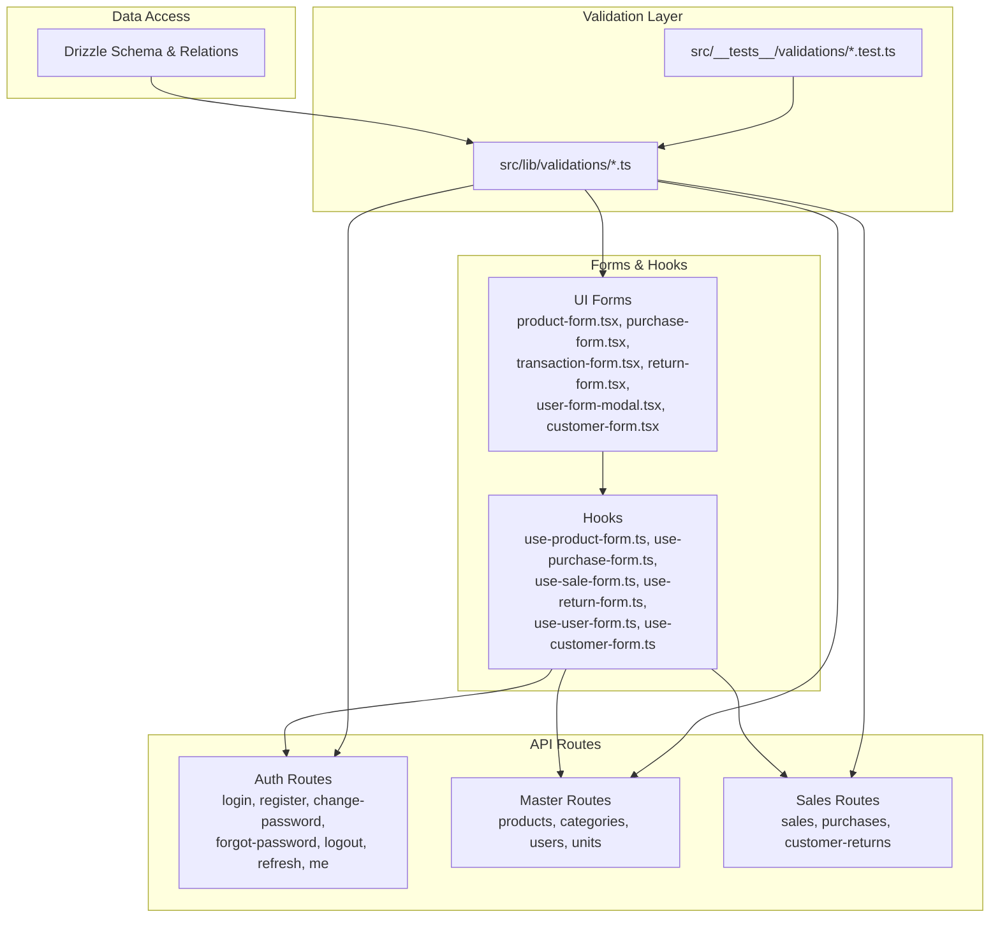
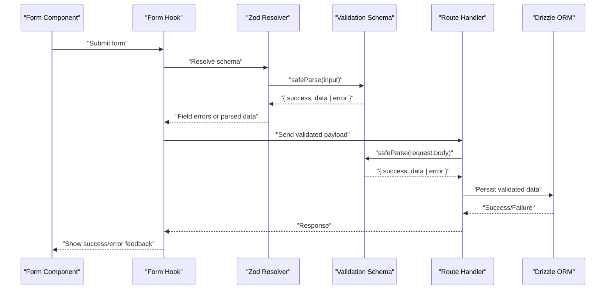
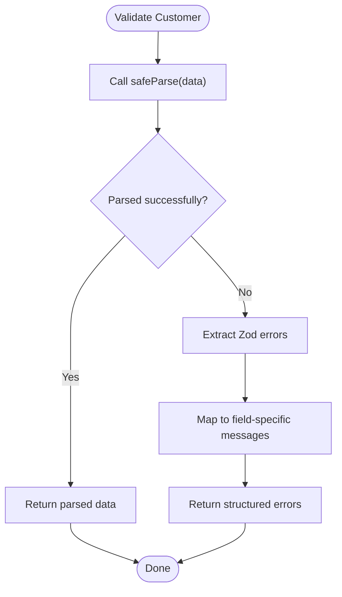
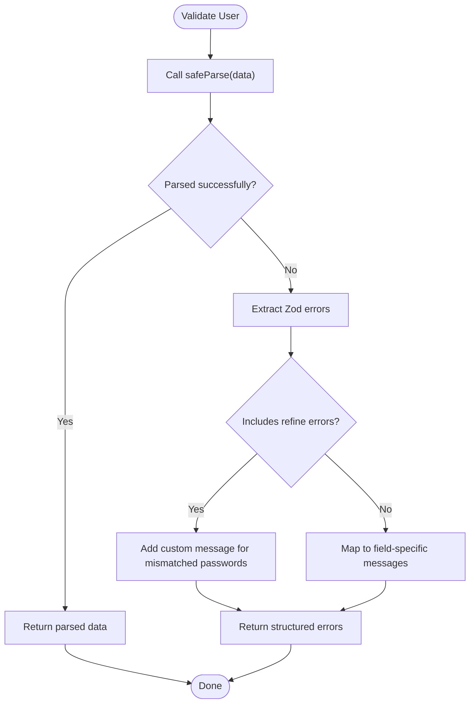
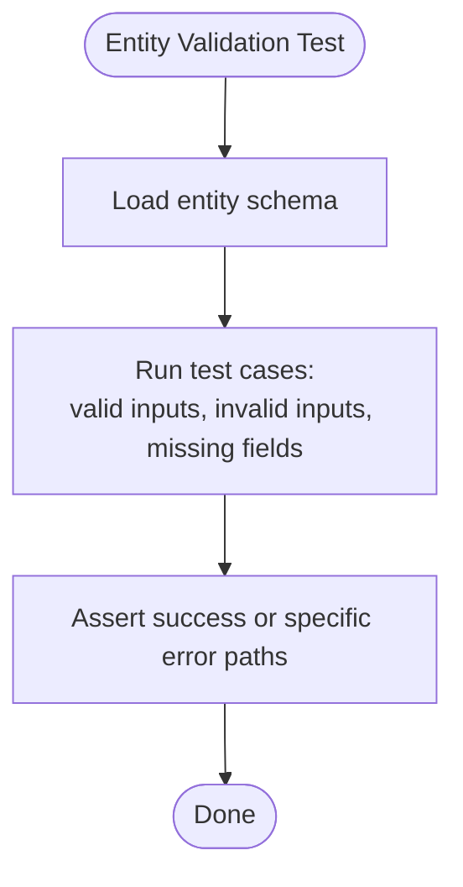
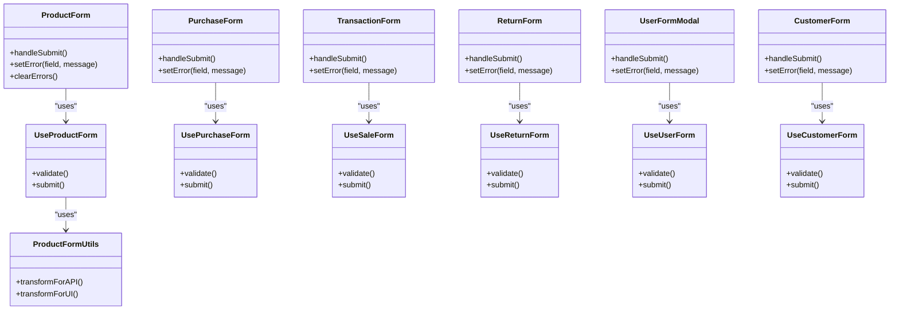
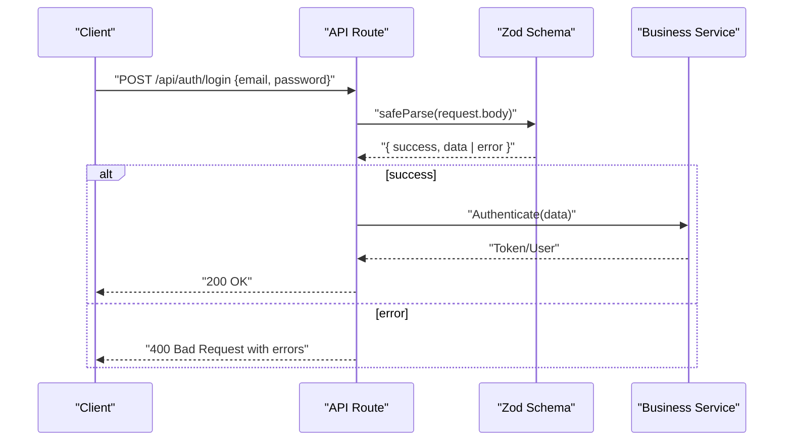
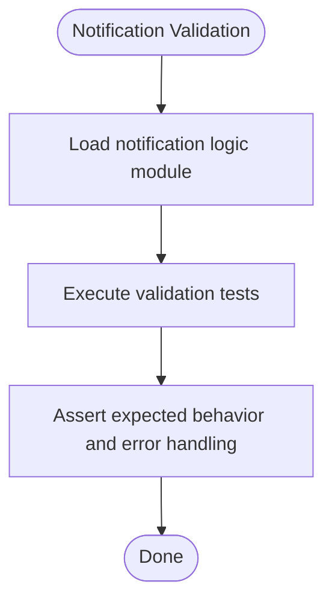
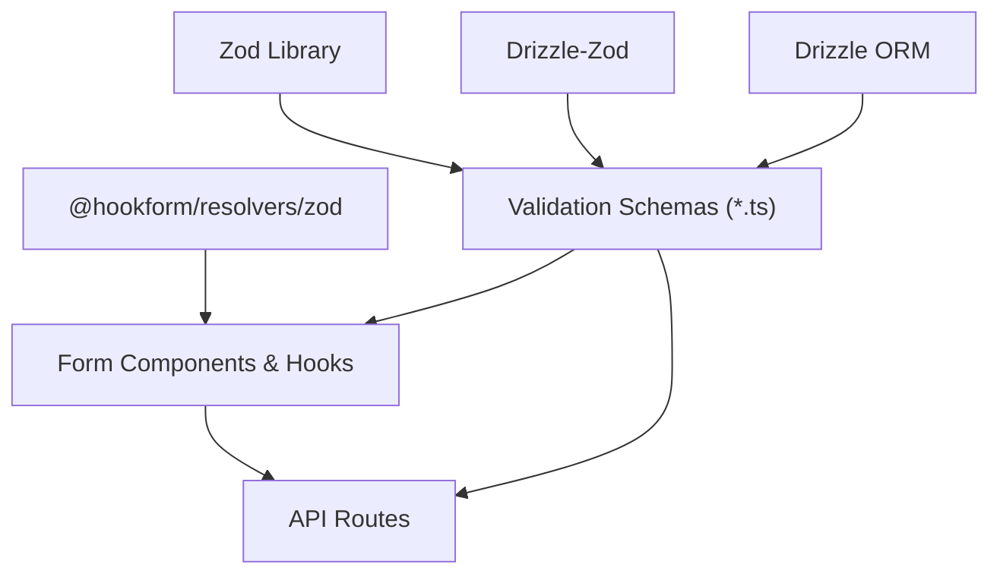

# Data Validation

<cite>
**Referenced Files in This Document**
- [customer.ts](file://src/lib/validations/customer.ts)
- [user.ts](file://src/lib/validations/user.ts)
- [product.test.ts](file://src/__tests__/validations/product.test.ts)
- [category.test.ts](file://src/__tests__/validations/category.test.ts)
- [purchase.test.ts](file://src/__tests__/validations/purchase.test.ts)
- [sale.test.ts](file://src/__tests__/validations/sale.test.ts)
- [unit.test.ts](file://src/__tests__/validations/unit.test.ts)
- [login-page.tsx](file://src/app/login/_components/login-page.tsx)
- [login.route.ts](file://src/app/api/auth/login/route.ts)
- [register.route.ts](file://src/app/api/auth/register/route.ts)
- [change-password.route.ts](file://src/app/api/auth/change-password/route.ts)
- [forgot-password.route.ts](file://src/app/api/auth/forgot-password/route.ts)
- [logout.route.ts](file://src/app/api/auth/logout/route.ts)
- [refresh.route.ts](file://src/app/api/auth/refresh/route.ts)
- [me.route.ts](file://src/app/api/auth/me/route.ts)
- [products.route.ts](file://src/app/api/products/route.ts)
- [categories.route.ts](file://src/app/api/categories/route.ts)
- [users.route.ts](file://src/app/api/users/[id]/route.ts)
- [purchases.route.ts](file://src/app/api/purchases/[purchaseId]/route.ts)
- [sales.route.ts](file://src/app/api/sales/[salesId]/route.ts)
- [units.route.ts](file://src/app/api/units/[unitId]/route.ts)
- [product-form.tsx](file://src/app/dashboard/products/_components/product-form/product-form.tsx)
- [product-form-modal.tsx](file://src/app/dashboard/products/_components/product-form/product-form-modal.tsx)
- [purchase-form.tsx](file://src/app/dashboard/purchases/_components/purchase-form.tsx)
- [transaction-form.tsx](file://src/app/dashboard/sales/_components/_forms/transaction-form.tsx)
- [return-form.tsx](file://src/app/dashboard/sales/_components/_forms/return-form.tsx)
- [user-form-modal.tsx](file://src/app/dashboard/users/_components/user-form-modal.tsx)
- [customer-form.tsx](file://src/app/dashboard/customers/_components/customer-form.tsx)
- [use-product-form.ts](file://src/app/dashboard/products/_hooks/use-product-form.ts)
- [use-purchase-form.ts](file://src/app/dashboard/purchases/_hooks/use-purchase-form.ts)
- [use-sale-form.ts](file://src/app/dashboard/sales/_hooks/use-sale-form.ts)
- [use-return-form.ts](file://src/app/dashboard/sales/_hooks/use-return-form.ts)
- [use-user-form.ts](file://src/app/dashboard/users/_hooks/use-user-form.ts)
- [use-customer-form.ts](file://src/app/dashboard/customers/_hooks/use-customer-form.ts)
- [product-form.utils.ts](file://src/app/dashboard/products/_utils/product-form.utils.ts)
- [notification-store.ts](file://src/app/api/notifications/_lib/notification-store.ts)
- [notification-state-db.ts](file://src/app/api/notifications/_lib/notification-state-db.ts)
- [notification-logic.ts](file://src/app/api/notifications/_lib/notification-logic.ts)
- [notification-logic.test.ts](file://src/__tests__/validations/notification-logic.test.ts)
- [schema.ts](file://src/drizzle/schema.ts)
- [relations.ts](file://src/drizzle/relations.ts)
- [zod.d.ts](file://node_modules/zod/index.d.ts)
- [zod-resolver.d.ts](file://node_modules/@hookform/resolvers/zod/src/zod.d.ts)
- [drizzle-zod.d.ts](file://node_modules/drizzle-zod/schema.d.ts)
</cite>

## Table of Contents
1. [Introduction](#introduction)
2. [Project Structure](#project-structure)
3. [Core Components](#core-components)
4. [Architecture Overview](#architecture-overview)
5. [Detailed Component Analysis](#detailed-component-analysis)
6. [Dependency Analysis](#dependency-analysis)
7. [Performance Considerations](#performance-considerations)
8. [Troubleshooting Guide](#troubleshooting-guide)
9. [Conclusion](#conclusion)
10. [Appendices](#appendices)

## Introduction
This document explains the data validation strategies and form validation implementations across the POS application. It covers validation schema patterns for business entities (products, categories, users, transactions), validation rules for business constraints and data types, integration between validation schemas and form handling components, error handling and user feedback mechanisms, validation lifecycle management, custom validation functions, async validation patterns, and performance optimization. The goal is to ensure validation consistency across UI components and API endpoints.

## Project Structure
Validation logic is primarily centralized under:
- Application-level validation schemas: src/lib/validations
- Unit tests for validation logic: src/__tests__/validations
- Form components and hooks: src/app/dashboard/*/components and hooks
- API routes: src/app/api/* endpoints
- Drizzle schema definitions: src/drizzle/schema.ts and relations.ts

**Diagram sources**
- [customer.ts:1-32](file://src/lib/validations/customer.ts#L1-L32)
- [user.ts:40-74](file://src/lib/validations/user.ts#L40-L74)
- [login-page.tsx](file://src/app/login/_components/login-page.tsx)
- [login.route.ts](file://src/app/api/auth/login/route.ts)
- [register.route.ts](file://src/app/api/auth/register/route.ts)
- [change-password.route.ts](file://src/app/api/auth/change-password/route.ts)
- [forgot-password.route.ts](file://src/app/api/auth/forgot-password/route.ts)
- [logout.route.ts](file://src/app/api/auth/logout/route.ts)
- [refresh.route.ts](file://src/app/api/auth/refresh/route.ts)
- [me.route.ts](file://src/app/api/auth/me/route.ts)
- [products.route.ts](file://src/app/api/products/route.ts)
- [categories.route.ts](file://src/app/api/categories/route.ts)
- [users.route.ts](file://src/app/api/users/[id]/route.ts)
- [purchases.route.ts](file://src/app/api/purchases/[purchaseId]/route.ts)
- [sales.route.ts](file://src/app/api/sales/[salesId]/route.ts)
- [units.route.ts](file://src/app/api/units/[unitId]/route.ts)
- [product-form.tsx](file://src/app/dashboard/products/_components/product-form/product-form.tsx)
- [purchase-form.tsx](file://src/app/dashboard/purchases/_components/purchase-form.tsx)
- [transaction-form.tsx](file://src/app/dashboard/sales/_components/_forms/transaction-form.tsx)
- [return-form.tsx](file://src/app/dashboard/sales/_components/_forms/return-form.tsx)
- [user-form-modal.tsx](file://src/app/dashboard/users/_components/user-form-modal.tsx)
- [customer-form.tsx](file://src/app/dashboard/customers/_components/customer-form.tsx)
- [use-product-form.ts](file://src/app/dashboard/products/_hooks/use-product-form.ts)
- [use-purchase-form.ts](file://src/app/dashboard/purchases/_hooks/use-purchase-form.ts)
- [use-sale-form.ts](file://src/app/dashboard/sales/_hooks/use-sale-form.ts)
- [use-return-form.ts](file://src/app/dashboard/sales/_hooks/use-return-form.ts)
- [use-user-form.ts](file://src/app/dashboard/users/_hooks/use-user-form.ts)
- [use-customer-form.ts](file://src/app/dashboard/customers/_hooks/use-customer-form.ts)
- [schema.ts](file://src/drizzle/schema.ts)
- [relations.ts](file://src/drizzle/relations.ts)

**Section sources**
- [customer.ts:1-32](file://src/lib/validations/customer.ts#L1-L32)
- [user.ts:40-74](file://src/lib/validations/user.ts#L40-L74)

## Core Components
This section outlines the primary validation schemas and their roles across business entities.

- Customer validation
  - Uses a generated insert schema from the Drizzle schema and extends it with explicit field rules.
  - Provides separate schemas for create and update operations.
  - Exposes typed validators for safe parsing.

- User validation
  - Defines schemas for registration, login, profile updates, and password changes.
  - Includes custom refinement for password confirmation equality.
  - Exposes typed validators for safe parsing.

- Product, Category, Purchase, Sale, Unit validation
  - Located in unit test files under src/__tests__/validations, indicating schema definitions and tests exist for these entities.
  - Schemas are designed to validate business constraints and data types consistently.

Key characteristics:
- Centralized schema definitions using Zod.
- Typed inference for TypeScript safety.
- Safe parsing with structured error handling via Zod’s safeParse pattern.
- Integration with Drizzle-generated schemas for database-backed entities.

**Section sources**
- [customer.ts:1-32](file://src/lib/validations/customer.ts#L1-L32)
- [user.ts:40-74](file://src/lib/validations/user.ts#L40-L74)
- [product.test.ts](file://src/__tests__/validations/product.test.ts)
- [category.test.ts](file://src/__tests__/validations/category.test.ts)
- [purchase.test.ts](file://src/__tests__/validations/purchase.test.ts)
- [sale.test.ts](file://src/__tests__/validations/sale.test.ts)
- [unit.test.ts](file://src/__tests__/validations/unit.test.ts)

## Architecture Overview
The validation architecture follows a layered approach:
- Data definition: Zod schemas define business rules and data types.
- Form integration: React Hook Form resolves Zod schemas to drive UI validation.
- API enforcement: Route handlers parse and validate incoming requests using the same Zod schemas.
- Persistence: Drizzle Zod integrates generated schemas for database operations.

**Diagram sources**
- [zod-resolver.d.ts](file://node_modules/@hookform/resolvers/zod/src/zod.d.ts)
- [zod.d.ts](file://node_modules/zod/index.d.ts)
- [customer.ts:26-32](file://src/lib/validations/customer.ts#L26-L32)
- [user.ts:68-74](file://src/lib/validations/user.ts#L68-L74)
- [login.route.ts](file://src/app/api/auth/login/route.ts)
- [products.route.ts](file://src/app/api/products/route.ts)
- [categories.route.ts](file://src/app/api/categories/route.ts)
- [users.route.ts](file://src/app/api/users/[id]/route.ts)
- [purchases.route.ts](file://src/app/api/purchases/[purchaseId]/route.ts)
- [sales.route.ts](file://src/app/api/sales/[salesId]/route.ts)
- [units.route.ts](file://src/app/api/units/[unitId]/route.ts)
- [schema.ts](file://src/drizzle/schema.ts)

## Detailed Component Analysis

### Customer Validation
- Schema generation: A Drizzle-generated insert schema is extended with explicit constraints for the name field.
- Update schema: Omits immutable fields and allows partial updates with refined rules.
- Typed validators: Exported functions wrap safeParse for type-safe validation outcomes.

**Diagram sources**
- [customer.ts:26-32](file://src/lib/validations/customer.ts#L26-L32)

**Section sources**
- [customer.ts:1-32](file://src/lib/validations/customer.ts#L1-L32)

### User Validation
- Registration and update schemas enforce presence and length constraints.
- Password change schema uses refine to compare new and confirm passwords.
- Strong typing ensures compile-time safety for form and API payloads.

**Diagram sources**
- [user.ts:43-58](file://src/lib/validations/user.ts#L43-L58)

**Section sources**
- [user.ts:40-74](file://src/lib/validations/user.ts#L40-L74)

### Product, Category, Purchase, Sale, Unit Validation
- These entities are validated through dedicated unit tests that assert schema correctness and business rules.
- Tests demonstrate schema composition, constraint checks, and error scenarios.

**Diagram sources**
- [product.test.ts](file://src/__tests__/validations/product.test.ts)
- [category.test.ts](file://src/__tests__/validations/category.test.ts)
- [purchase.test.ts](file://src/__tests__/validations/purchase.test.ts)
- [sale.test.ts](file://src/__tests__/validations/sale.test.ts)
- [unit.test.ts](file://src/__tests__/validations/unit.test.ts)

**Section sources**
- [product.test.ts](file://src/__tests__/validations/product.test.ts)
- [category.test.ts](file://src/__tests__/validations/category.test.ts)
- [purchase.test.ts](file://src/__tests__/validations/purchase.test.ts)
- [sale.test.ts](file://src/__tests__/validations/sale.test.ts)
- [unit.test.ts](file://src/__tests__/validations/unit.test.ts)

### Form Components and Hooks Integration
- Form components encapsulate controlled inputs and submit handlers.
- Hooks orchestrate form state, validation, and submission lifecycle.
- Utilities assist in transforming form data for persistence or API consumption.

Representative components and hooks:
- Product form and modal
- Purchase form
- Transaction and return forms
- User and customer forms
- Associated hooks for each form domain
- Utilities for product form transformations

**Diagram sources**
- [product-form.tsx](file://src/app/dashboard/products/_components/product-form/product-form.tsx)
- [product-form-modal.tsx](file://src/app/dashboard/products/_components/product-form/product-form-modal.tsx)
- [purchase-form.tsx](file://src/app/dashboard/purchases/_components/purchase-form.tsx)
- [transaction-form.tsx](file://src/app/dashboard/sales/_components/_forms/transaction-form.tsx)
- [return-form.tsx](file://src/app/dashboard/sales/_components/_forms/return-form.tsx)
- [user-form-modal.tsx](file://src/app/dashboard/users/_components/user-form-modal.tsx)
- [customer-form.tsx](file://src/app/dashboard/customers/_components/customer-form.tsx)
- [use-product-form.ts](file://src/app/dashboard/products/_hooks/use-product-form.ts)
- [use-purchase-form.ts](file://src/app/dashboard/purchases/_hooks/use-purchase-form.ts)
- [use-sale-form.ts](file://src/app/dashboard/sales/_hooks/use-sale-form.ts)
- [use-return-form.ts](file://src/app/dashboard/sales/_hooks/use-return-form.ts)
- [use-user-form.ts](file://src/app/dashboard/users/_hooks/use-user-form.ts)
- [use-customer-form.ts](file://src/app/dashboard/customers/_hooks/use-customer-form.ts)
- [product-form.utils.ts](file://src/app/dashboard/products/_utils/product-form.utils.ts)

**Section sources**
- [product-form.tsx](file://src/app/dashboard/products/_components/product-form/product-form.tsx)
- [product-form-modal.tsx](file://src/app/dashboard/products/_components/product-form/product-form-modal.tsx)
- [purchase-form.tsx](file://src/app/dashboard/purchases/_components/purchase-form.tsx)
- [transaction-form.tsx](file://src/app/dashboard/sales/_components/_forms/transaction-form.tsx)
- [return-form.tsx](file://src/app/dashboard/sales/_components/_forms/return-form.tsx)
- [user-form-modal.tsx](file://src/app/dashboard/users/_components/user-form-modal.tsx)
- [customer-form.tsx](file://src/app/dashboard/customers/_components/customer-form.tsx)
- [use-product-form.ts](file://src/app/dashboard/products/_hooks/use-product-form.ts)
- [use-purchase-form.ts](file://src/app/dashboard/purchases/_hooks/use-purchase-form.ts)
- [use-sale-form.ts](file://src/app/dashboard/sales/_hooks/use-sale-form.ts)
- [use-return-form.ts](file://src/app/dashboard/sales/_hooks/use-return-form.ts)
- [use-user-form.ts](file://src/app/dashboard/users/_hooks/use-user-form.ts)
- [use-customer-form.ts](file://src/app/dashboard/customers/_hooks/use-customer-form.ts)
- [product-form.utils.ts](file://src/app/dashboard/products/_utils/product-form.utils.ts)

### API Route Validation Integration
- Authentication routes validate payloads using user and customer schemas.
- Master data routes validate product, category, unit, and user update/create payloads.
- Sales and purchase routes validate transaction-related payloads.
- Route handlers rely on the same Zod schemas to ensure consistency between client and server.

**Diagram sources**
- [login.route.ts](file://src/app/api/auth/login/route.ts)
- [register.route.ts](file://src/app/api/auth/register/route.ts)
- [change-password.route.ts](file://src/app/api/auth/change-password/route.ts)
- [forgot-password.route.ts](file://src/app/api/auth/forgot-password/route.ts)
- [logout.route.ts](file://src/app/api/auth/logout/route.ts)
- [refresh.route.ts](file://src/app/api/auth/refresh/route.ts)
- [me.route.ts](file://src/app/api/auth/me/route.ts)
- [products.route.ts](file://src/app/api/products/route.ts)
- [categories.route.ts](file://src/app/api/categories/route.ts)
- [users.route.ts](file://src/app/api/users/[id]/route.ts)
- [purchases.route.ts](file://src/app/api/purchases/[purchaseId]/route.ts)
- [sales.route.ts](file://src/app/api/sales/[salesId]/route.ts)
- [units.route.ts](file://src/app/api/units/[unitId]/route.ts)
- [customer.ts:26-32](file://src/lib/validations/customer.ts#L26-L32)
- [user.ts:68-74](file://src/lib/validations/user.ts#L68-L74)

**Section sources**
- [login.route.ts](file://src/app/api/auth/login/route.ts)
- [register.route.ts](file://src/app/api/auth/register/route.ts)
- [change-password.route.ts](file://src/app/api/auth/change-password/route.ts)
- [forgot-password.route.ts](file://src/app/api/auth/forgot-password/route.ts)
- [logout.route.ts](file://src/app/api/auth/logout/route.ts)
- [refresh.route.ts](file://src/app/api/auth/refresh/route.ts)
- [me.route.ts](file://src/app/api/auth/me/route.ts)
- [products.route.ts](file://src/app/api/products/route.ts)
- [categories.route.ts](file://src/app/api/categories/route.ts)
- [users.route.ts](file://src/app/api/users/[id]/route.ts)
- [purchases.route.ts](file://src/app/api/purchases/[purchaseId]/route.ts)
- [sales.route.ts](file://src/app/api/sales/[salesId]/route.ts)
- [units.route.ts](file://src/app/api/units/[unitId]/route.ts)

### Notification Validation Logic
- Notification-related logic includes validation and state management.
- Tests validate notification logic behavior, ensuring robustness.

**Diagram sources**
- [notification-logic.ts](file://src/app/api/notifications/_lib/notification-logic.ts)
- [notification-state-db.ts](file://src/app/api/notifications/_lib/notification-state-db.ts)
- [notification-store.ts](file://src/app/api/notifications/_lib/notification-store.ts)
- [notification-logic.test.ts](file://src/__tests__/validations/notification-logic.test.ts)

**Section sources**
- [notification-logic.ts](file://src/app/api/notifications/_lib/notification-logic.ts)
- [notification-state-db.ts](file://src/app/api/notifications/_lib/notification-state-db.ts)
- [notification-store.ts](file://src/app/api/notifications/_lib/notification-store.ts)
- [notification-logic.test.ts](file://src/__tests__/validations/notification-logic.test.ts)

## Dependency Analysis
Validation schemas depend on:
- Zod for schema definition and parsing.
- Drizzle Zod for database-backed schema generation.
- React Hook Form resolver for UI integration.
- Route handlers for server-side enforcement.

**Diagram sources**
- [zod.d.ts](file://node_modules/zod/index.d.ts)
- [drizzle-zod.d.ts](file://node_modules/drizzle-zod/schema.d.ts)
- [zod-resolver.d.ts](file://node_modules/@hookform/resolvers/zod/src/zod.d.ts)
- [customer.ts:1-32](file://src/lib/validations/customer.ts#L1-L32)
- [user.ts:40-74](file://src/lib/validations/user.ts#L40-L74)
- [schema.ts](file://src/drizzle/schema.ts)

**Section sources**
- [zod.d.ts](file://node_modules/zod/index.d.ts)
- [drizzle-zod.d.ts](file://node_modules/drizzle-zod/schema.d.ts)
- [zod-resolver.d.ts](file://node_modules/@hookform/resolvers/zod/src/zod.d.ts)
- [customer.ts:1-32](file://src/lib/validations/customer.ts#L1-L32)
- [user.ts:40-74](file://src/lib/validations/user.ts#L40-L74)
- [schema.ts](file://src/drizzle/schema.ts)

## Performance Considerations
- Prefer coarse-grained validation on the server to avoid redundant client-side checks.
- Use Zod’s safeParse for non-blocking validation; avoid synchronous blocking operations in validation logic.
- Defer expensive checks (e.g., uniqueness) to database constraints or controlled async validation triggers.
- Keep schema definitions static and reusable to minimize re-instantiation overhead.
- Batch UI updates after validation to reduce re-renders.

## Troubleshooting Guide
Common issues and resolutions:
- Mismatched password confirmation: Ensure refine logic is applied in the password change schema and surfaced at the correct field.
- Missing required fields: Verify required constraints in the schema and ensure form controls are bound to the correct field names.
- Type errors after parsing: Confirm typed validators are used and that inferred types align with component props and API payloads.
- Async validation pitfalls: Use controlled async triggers (e.g., onBlur) and debounce to prevent excessive network calls.
- Error mapping: Map Zod errors to user-friendly messages while preserving field-level targeting for UI feedback.

**Section sources**
- [user.ts:43-58](file://src/lib/validations/user.ts#L43-L58)
- [customer.ts:26-32](file://src/lib/validations/customer.ts#L26-L32)

## Conclusion
The application employs a robust, layered validation strategy centered on Zod schemas, integrated with React Hook Form for UI validation and route handlers for server-side enforcement. Business entities are validated consistently across forms and APIs, with typed validators ensuring safety and clarity. Custom validation functions and async patterns are supported, and performance is optimized through careful schema design and controlled validation triggers.

## Appendices
- Drizzle schema and relations serve as the foundation for database-backed validation.
- Notification validation logic demonstrates additional validation patterns within the system.

**Section sources**
- [schema.ts](file://src/drizzle/schema.ts)
- [relations.ts](file://src/drizzle/relations.ts)
- [notification-logic.ts](file://src/app/api/notifications/_lib/notification-logic.ts)
- [notification-state-db.ts](file://src/app/api/notifications/_lib/notification-state-db.ts)
- [notification-store.ts](file://src/app/api/notifications/_lib/notification-store.ts)