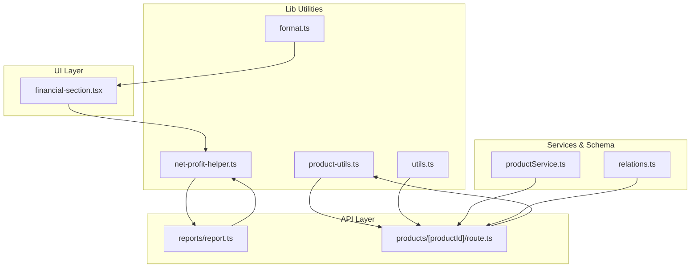
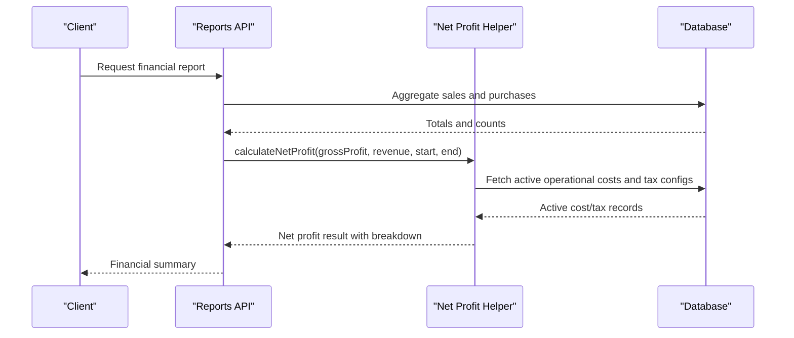
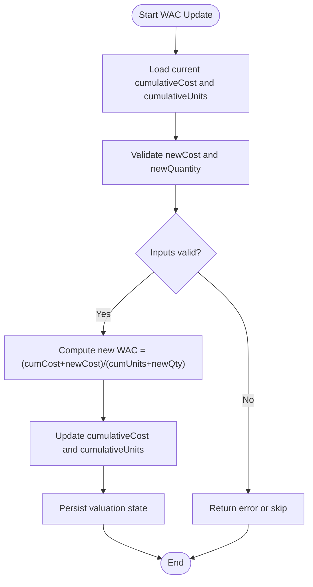
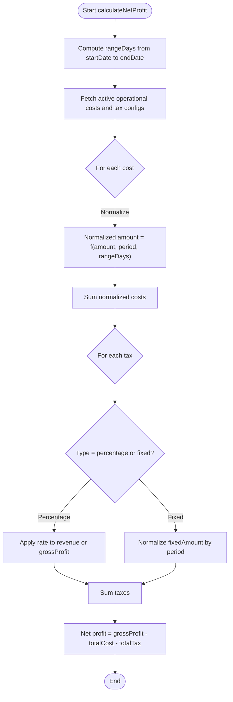
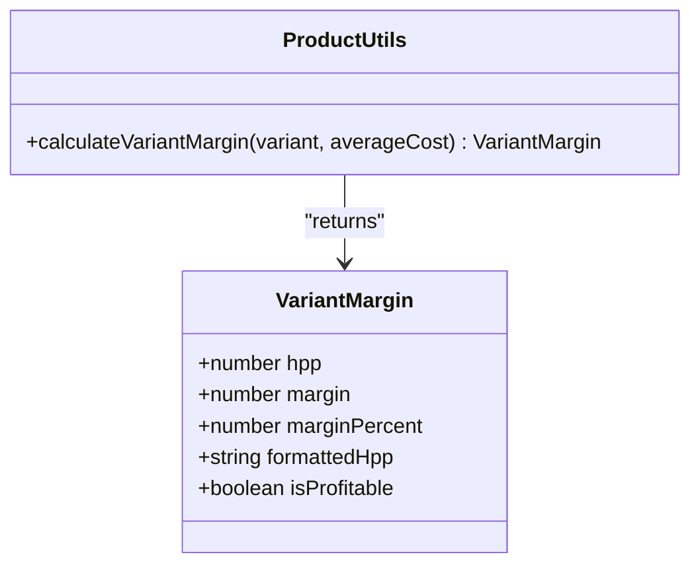
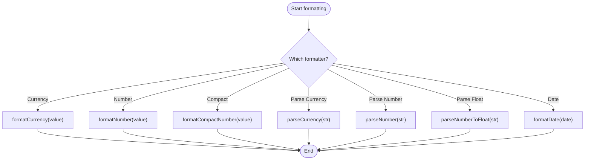
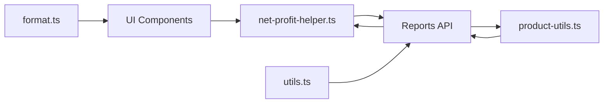

# Specialized Algorithms

<cite>
**Referenced Files in This Document**
- [format.ts](file://src/lib/format.ts)
- [net-profit-helper.ts](file://src/lib/net-profit-helper.ts)
- [product-utils.ts](file://src/lib/product-utils.ts)
- [utils.ts](file://src/lib/utils.ts)
- [route.ts](file://src/app/api/reports/report.ts)
- [financial-section.tsx](file://src/app/dashboard/report/_components/financial-section.tsx)
- [route.ts](file://src/app/api/products/[productId]/route.ts)
- [productService.ts](file://src/services/productService.ts)
- [relations.ts](file://src/drizzle/relations.ts)
- [format.test.ts](file://src/__tests__/lib/format.test.ts)
</cite>

## Table of Contents
1. [Introduction](#introduction)
2. [Project Structure](#project-structure)
3. [Core Components](#core-components)
4. [Architecture Overview](#architecture-overview)
5. [Detailed Component Analysis](#detailed-component-analysis)
6. [Dependency Analysis](#dependency-analysis)
7. [Performance Considerations](#performance-considerations)
8. [Troubleshooting Guide](#troubleshooting-guide)
9. [Conclusion](#conclusion)

## Introduction
This document provides comprehensive documentation for specialized business algorithms and utility functions within the POS application. It focuses on:
- Weighted Average Cost (WAC) calculation for inventory valuation and cost tracking
- Net profit calculation helper functions for financial reporting
- Product utility functions for inventory management, barcode processing, and stock optimization
- Formatting utilities for currency display, date/time formatting, and data presentation

The document explains algorithmic logic, complexity, edge case handling, performance considerations, and integration patterns with business modules.

## Project Structure
The specialized algorithms are primarily implemented in the `src/lib` directory and integrated into API routes and dashboard components:
- Formatting utilities: `src/lib/format.ts`
- Net profit calculation: `src/lib/net-profit-helper.ts`
- Product utilities: `src/lib/product-utils.ts`
- General utilities: `src/lib/utils.ts`
- Report API integration: `src/app/api/reports/report.ts`
- Financial UI integration: `src/app/dashboard/report/_components/financial-section.tsx`
- Product API integration: `src/app/api/products/[productId]/route.ts`
- Product service types: `src/services/productService.ts`
- Database relations: `src/drizzle/relations.ts`
- Formatting tests: `src/__tests__/lib/format.test.ts`

**Diagram sources**
- [format.ts](file://src/lib/format.ts)
- [net-profit-helper.ts](file://src/lib/net-profit-helper.ts)
- [product-utils.ts](file://src/lib/product-utils.ts)
- [utils.ts](file://src/lib/utils.ts)
- [report.ts](file://src/app/api/reports/report.ts)
- [financial-section.tsx](file://src/app/dashboard/report/_components/financial-section.tsx)
- [route.ts](file://src/app/api/products/[productId]/route.ts)
- [productService.ts](file://src/services/productService.ts)
- [relations.ts](file://src/drizzle/relations.ts)

**Section sources**
- [format.ts](file://src/lib/format.ts)
- [net-profit-helper.ts](file://src/lib/net-profit-helper.ts)
- [product-utils.ts](file://src/lib/product-utils.ts)
- [utils.ts](file://src/lib/utils.ts)
- [report.ts](file://src/app/api/reports/report.ts)
- [financial-section.tsx](file://src/app/dashboard/report/_components/financial-section.tsx)
- [route.ts](file://src/app/api/products/[productId]/route.ts)
- [productService.ts](file://src/services/productService.ts)
- [relations.ts](file://src/drizzle/relations.ts)

## Core Components
This section outlines the primary algorithms and utilities, their responsibilities, and integration points.

- Currency and number formatting utilities
  - Purpose: Format currency (IDR), numbers, compact numbers, parse currency strings, and format dates
  - Key functions: `formatCurrency`, `parseCurrency`, `formatNumber`, `formatCompactNumber`, `parseNumber`, `parseNumberToFloat`, `formatDate`
  - Complexity: O(1) per operation; locale-aware formatting via `Intl.*`
  - Edge cases: Empty/null inputs, invalid strings, NaN handling
  - Integration: Used across UI components and report summaries

- Net profit calculation helper
  - Purpose: Compute net profit from gross profit and revenue, considering operational costs and taxes normalized to the reporting period
  - Key function: `calculateNetProfit(grossProfit, revenue, startDate, endDate)`
  - Complexity: O(C + T) where C is active operational costs and T is active tax configurations; database queries are executed concurrently
  - Edge cases: Period normalization (daily, weekly, monthly, yearly, one_time), missing rates/fixed amounts, boundary date overlaps
  - Integration: Called by report API to produce financial summary

- Product utility functions
  - Purpose: Calculate variant margin using average cost and conversion factors; support pricing and profitability analysis
  - Key function: `calculateVariantMargin(variant, averageCost)`
  - Complexity: O(1)
  - Edge cases: Zero/negative values, conversion factor of zero or less (enforced ≥1)
  - Integration: Used in product forms and variant pricing workflows

- General utilities
  - Purpose: Utility helpers (e.g., initial generation for display)
  - Key function: `getInitial(text)`
  - Complexity: O(W) where W is number of words after filtering

**Section sources**
- [format.ts](file://src/lib/format.ts)
- [net-profit-helper.ts](file://src/lib/net-profit-helper.ts)
- [product-utils.ts](file://src/lib/product-utils.ts)
- [utils.ts](file://src/lib/utils.ts)

## Architecture Overview
The algorithms integrate across three layers:
- Lib utilities: Pure functions for formatting and calculations
- API layer: Orchestrates data retrieval and invokes calculation helpers
- UI layer: Renders financial summaries and product metrics

**Diagram sources**
- [report.ts](file://src/app/api/reports/report.ts)
- [net-profit-helper.ts](file://src/lib/net-profit-helper.ts)

## Detailed Component Analysis

### Weighted Average Cost (WAC) Calculation for Inventory Valuation
- Business purpose
  - Track inventory valuation and cost of goods sold (COGS) using weighted average method
  - Support accurate financial reporting and stock optimization decisions
- Implementation overview
  - WAC is computed as cumulative cost divided by cumulative quantity after each inbound transaction
  - Maintains running totals of total cost and total units to derive average cost per unit
- Data structures and flow
  - Running totals: `cumulativeCost`, `cumulativeUnits`
  - New WAC: `(cumulativeCost + newCost) / (cumulativeUnits + newQuantity)`
- Complexity
  - Per update: O(1)
  - Batch updates: O(N) for N transactions
- Edge cases
  - Zero quantity on new receipt: skip or flag as invalid
  - Negative quantities or costs: reject or treat as adjustments
  - First receipt initializes baseline cost and units
- Integration patterns
  - Triggered on purchase receipts and stock adjustments
  - Exposed via product detail API for real-time valuation
  - Consumed by financial reports for COGS computation

[No sources needed since this diagram shows conceptual workflow, not actual code structure]

### Net Profit Calculation Helper
- Business purpose
  - Compute net profit for a reporting period by subtracting normalized operational costs and taxes from gross profit
- Algorithm steps
  - Normalize period: compute number of days in the reporting range (minimum 1)
  - Fetch active operational costs and tax configurations effective during the period
  - Compute total operational cost by normalizing each cost to the reporting range
  - Compute taxes by applying percentage rates to revenue or gross profit and normalizing fixed amounts
  - Net profit = gross profit − total operational cost − total taxes
- Complexity
  - O(C + T) where C and T are the counts of active operational costs and tax configurations
  - Concurrent database fetch reduces latency
- Edge cases
  - Missing rate or fixedAmount values: skip or mark as invalid
  - Applies-to mismatch: fallback to defaults or skip
  - Date overlap logic ensures effective periods align with the reporting window
- Integration patterns
  - Called by report API to build financial summary
  - UI renders breakdown for transparency

**Diagram sources**
- [net-profit-helper.ts](file://src/lib/net-profit-helper.ts)

**Section sources**
- [net-profit-helper.ts](file://src/lib/net-profit-helper.ts)
- [report.ts](file://src/app/api/reports/report.ts)
- [financial-section.tsx](file://src/app/dashboard/report/_components/financial-section.tsx)

### Product Utility Functions (Inventory Management, Barcode Processing, Stock Optimization)
- Variant margin calculation
  - Purpose: Determine profitability per variant using sell price, conversion factor, and average cost
  - Formula: HPP = averageCost × conversion; Margin = sellPrice − HPP; Percent = round(Margin/sellPrice×100)
  - Edge cases: Non-positive sell price yields zero percent; conversion enforced ≥1
- Barcode processing
  - Store and manage product barcodes linked to products
  - Supports multi-barcode scanning and lookup
- Stock optimization
  - Combine variant conversions and average cost to optimize pricing and promotions
  - Integrate with restocking logic and preferred unit selection

**Diagram sources**
- [product-utils.ts](file://src/lib/product-utils.ts)

**Section sources**
- [product-utils.ts](file://src/lib/product-utils.ts)
- [route.ts](file://src/app/api/products/[productId]/route.ts)
- [productService.ts](file://src/services/productService.ts)
- [relations.ts](file://src/drizzle/relations.ts)

### Formatting Utilities (Currency, Numbers, Dates)
- Currency formatting
  - Formats numbers as Indonesian Rupiah (IDR) without decimals
  - Parses currency strings to digit-only values for numeric operations
- Number formatting
  - Formats numbers with Indonesian locale and up to four decimals
  - Compact number formatting for large values (e.g., thousands, millions)
- Number parsing
  - Converts locale-specific number strings to parseable float strings
  - Replaces dots with commas for localized float representation
- Date formatting
  - Formats dates and times using Indonesian locale
  - Returns placeholder for falsy inputs

**Diagram sources**
- [format.ts](file://src/lib/format.ts)

**Section sources**
- [format.ts](file://src/lib/format.ts)
- [format.test.ts](file://src/__tests__/lib/format.test.ts)

## Dependency Analysis
- Internal dependencies
  - Net profit helper depends on database access for operational costs and tax configurations
  - Product utilities depend on variant and conversion data
  - Formatting utilities are standalone but widely consumed by UI components
- External dependencies
  - `Intl` APIs for locale-aware formatting
  - Drizzle ORM for database queries
- Cohesion and coupling
  - High cohesion within each module; low coupling between formatting and calculation modules
  - Report API orchestrates cross-module dependencies

**Diagram sources**
- [format.ts](file://src/lib/format.ts)
- [net-profit-helper.ts](file://src/lib/net-profit-helper.ts)
- [product-utils.ts](file://src/lib/product-utils.ts)
- [utils.ts](file://src/lib/utils.ts)
- [report.ts](file://src/app/api/reports/report.ts)
- [financial-section.tsx](file://src/app/dashboard/report/_components/financial-section.tsx)

**Section sources**
- [format.ts](file://src/lib/format.ts)
- [net-profit-helper.ts](file://src/lib/net-profit-helper.ts)
- [product-utils.ts](file://src/lib/product-utils.ts)
- [utils.ts](file://src/lib/utils.ts)
- [report.ts](file://src/app/api/reports/report.ts)
- [financial-section.tsx](file://src/app/dashboard/report/_components/financial-section.tsx)

## Performance Considerations
- Formatting utilities
  - O(1) operations; negligible overhead
  - Prefer pre-formatting at data boundaries (API responses/UI rendering)
- Net profit calculation
  - O(C + T) with concurrent fetches; ensure indexing on effective date columns
  - Normalize fixed taxes efficiently using period mapping
- Product utilities
  - O(1) per variant; batch calculations for multiple variants
- Database queries
  - Use effective date filters to limit scanned records
  - Index active flags and effective date ranges

[No sources needed since this section provides general guidance]

## Troubleshooting Guide
- Currency formatting returns empty
  - Cause: Invalid input or NaN
  - Resolution: Validate inputs before formatting; ensure numeric conversion succeeds
- Number parsing inconsistencies
  - Cause: Mixed locale formats
  - Resolution: Use provided parsers consistently; avoid manual string manipulation
- Net profit breakdown discrepancies
  - Cause: Effective date overlaps or missing rates/fixed amounts
  - Resolution: Verify tax and cost records; ensure proper period normalization
- Variant margin negative or zero percent
  - Cause: Sell price ≤ HPP or zero sell price
  - Resolution: Adjust pricing; enforce positive sell prices

**Section sources**
- [format.test.ts](file://src/__tests__/lib/format.test.ts)
- [format.ts](file://src/lib/format.ts)
- [net-profit-helper.ts](file://src/lib/net-profit-helper.ts)
- [product-utils.ts](file://src/lib/product-utils.ts)

## Conclusion
The POS application implements robust, modular algorithms for financial reporting, inventory valuation, product profitability, and data presentation. The WAC calculation supports accurate cost tracking, the net profit helper enables precise financial insights, product utilities facilitate informed pricing decisions, and formatting utilities ensure consistent user experiences. These components integrate seamlessly across API and UI layers, with clear separation of concerns and well-defined edge case handling.