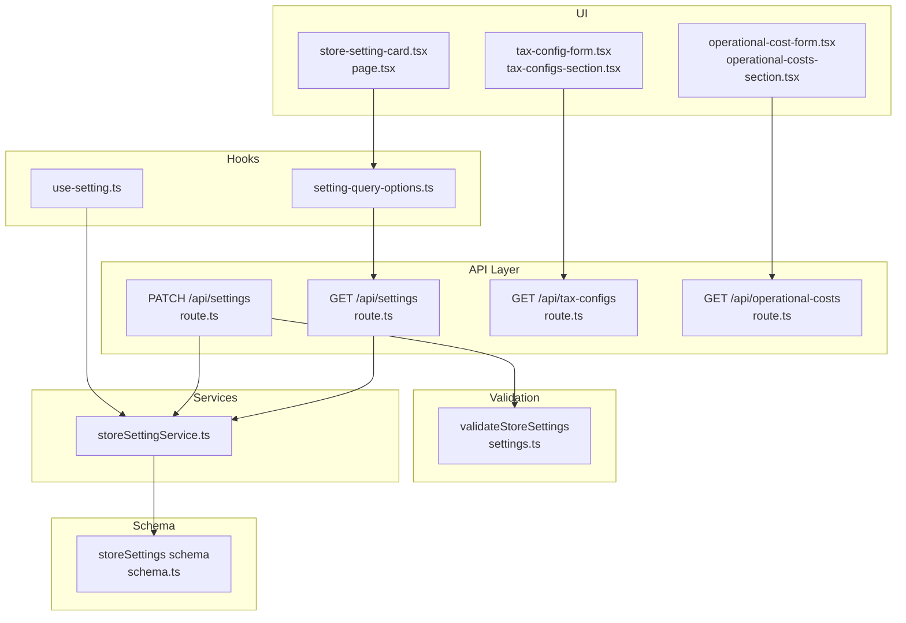
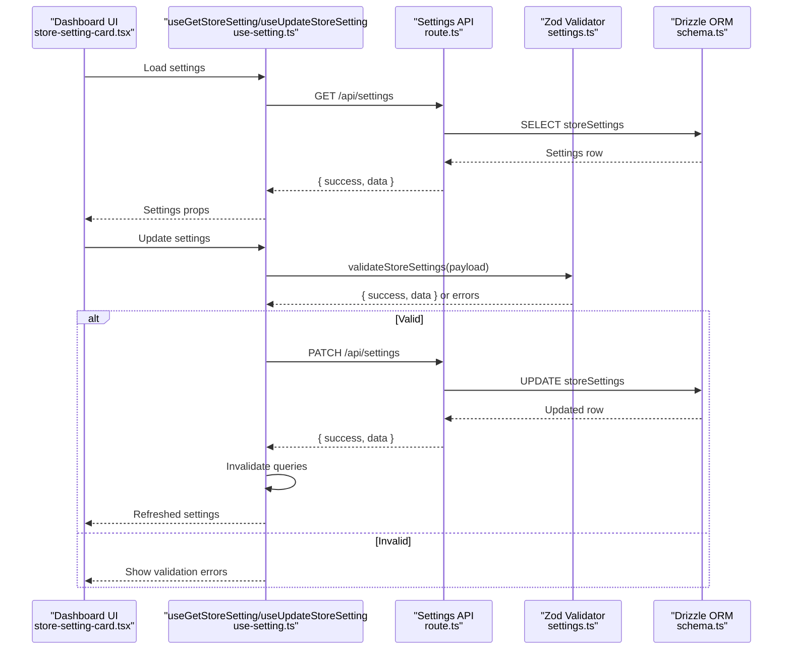
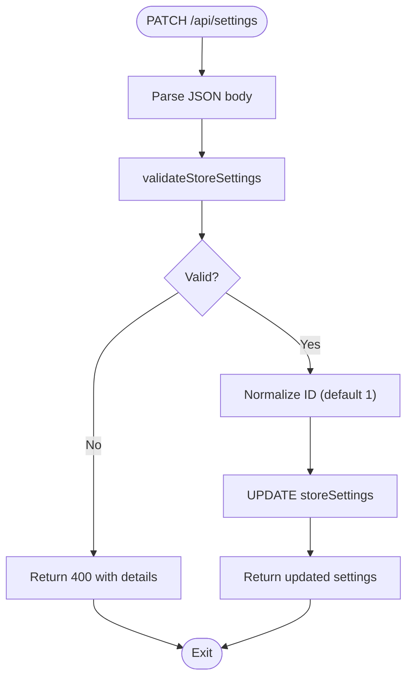
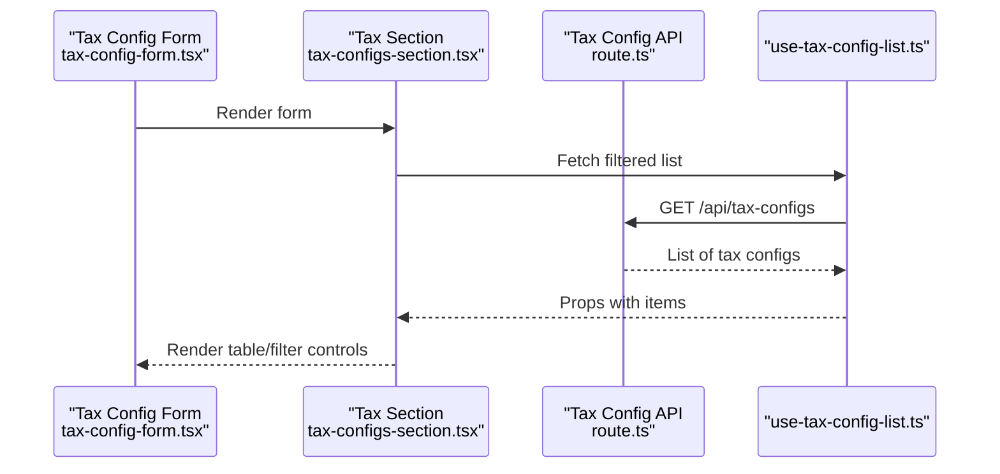
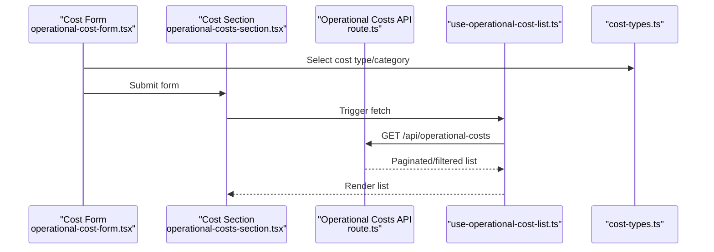
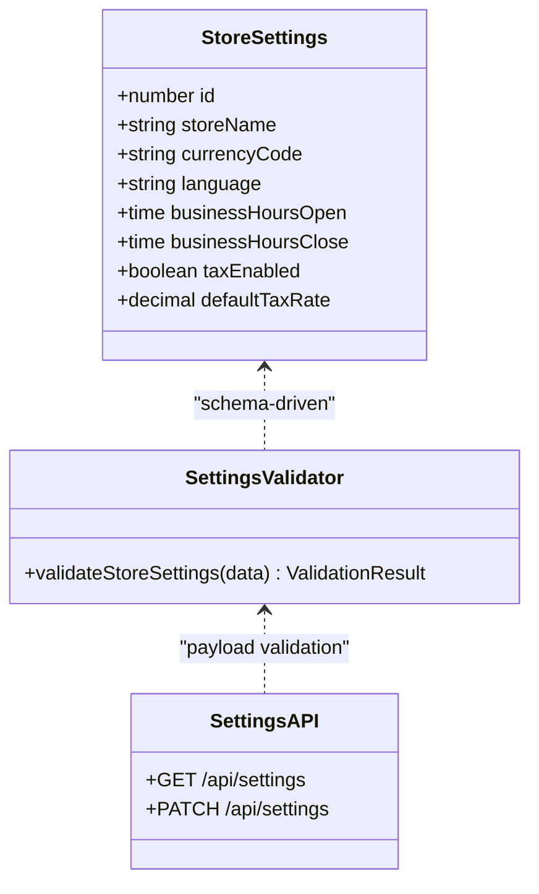
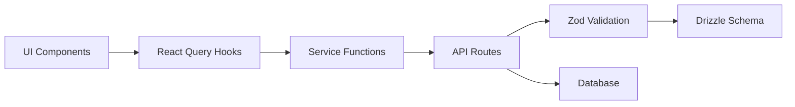

# Configuration & Settings

<cite>
**Referenced Files in This Document**
- [route.ts](file://src/app/api/settings/route.ts)
- [settings.ts](file://src/lib/validations/settings.ts)
- [setting-query-options.ts](file://src/hooks/store-setting/setting-query-options.ts)
- [use-setting.ts](file://src/hooks/store-setting/use-setting.ts)
- [storeSettingService.ts](file://src/services/storeSettingService.ts)
- [schema.ts](file://src/drizzle/schema.ts)
- [route.ts](file://src/app/api/tax-configs/route.ts)
- [tax-configs-section.tsx](file://src/app/dashboard/cost/_components/_forms/_sections/tax-configs-section.tsx)
- [tax-config-form.tsx](file://src/app/dashboard/cost/_components/_forms/tax-config-form.tsx)
- [use-tax-config-list.ts](file://src/app/dashboard/cost/_hooks/use-tax-config-list.ts)
- [route.ts](file://src/app/api/operational-costs/route.ts)
- [operational-costs-section.tsx](file://src/app/dashboard/cost/_components/_forms/_sections/operational-costs-section.tsx)
- [operational-cost-form.tsx](file://src/app/dashboard/cost/_components/_forms/operational-cost-form.tsx)
- [use-operational-cost-list.ts](file://src/app/dashboard/cost/_hooks/use-operational-cost-list.ts)
- [cost-types.ts](file://src/app/dashboard/cost/_types/cost-types.ts)
- [business-terms.ts](file://src/lib/business-terms.ts)
- [page.tsx](file://src/app/dashboard/setting/page.tsx)
- [store-setting-card.tsx](file://src/app/dashboard/setting/_components/store-setting-card.tsx)
- [account-setting-card.tsx](file://src/app/dashboard/setting/_components/account-setting-card.tsx)
- [route.ts](file://src/app/api/password-reset-requests/route.ts)
- [notification-store.ts](file://src/app/api/notifications/_lib/notification-store.ts)
- [notification-state-db.ts](file://src/app/api/notifications/_lib/notification-state-db.ts)
</cite>

## Table of Contents
1. [Introduction](#introduction)
2. [Project Structure](#project-structure)
3. [Core Components](#core-components)
4. [Architecture Overview](#architecture-overview)
5. [Detailed Component Analysis](#detailed-component-analysis)
6. [Dependency Analysis](#dependency-analysis)
7. [Performance Considerations](#performance-considerations)
8. [Troubleshooting Guide](#troubleshooting-guide)
9. [Conclusion](#conclusion)
10. [Appendices](#appendices)

## Introduction
This document explains the POS application’s configuration and settings management system. It covers:
- Store configuration options (business terms, operational settings, store preferences)
- Tax configuration management (rates, exemptions, calculation rules)
- Operational cost configuration (fixed and variable expenses)
- System-wide settings (business hours, currency, localization)
- Persistence and validation mechanisms
- Business terms and conditions for legal compliance
- Configuration inheritance, defaults, and migration during updates
- Common configuration scenarios and best practices for administrators

## Project Structure
The settings system spans API routes, database schema, validation utilities, React Query hooks, and UI components. Key areas:
- API endpoints for retrieving and updating settings
- Drizzle ORM schema defining persisted settings
- Zod-based validation for settings payloads
- React Query hooks for client-side caching and mutations
- Dashboard pages and forms for managing settings

**Diagram sources**
- [route.ts:1-54](file://src/app/api/settings/route.ts#L1-L54)
- [settings.ts:1-11](file://src/lib/validations/settings.ts#L1-L11)
- [storeSettingService.ts](file://src/services/storeSettingService.ts)
- [setting-query-options.ts:1-14](file://src/hooks/store-setting/setting-query-options.ts#L1-L14)
- [use-setting.ts:1-34](file://src/hooks/store-setting/use-setting.ts#L1-L34)
- [schema.ts](file://src/drizzle/schema.ts)
- [page.tsx](file://src/app/dashboard/setting/page.tsx)
- [store-setting-card.tsx](file://src/app/dashboard/setting/_components/store-setting-card.tsx)
- [tax-configs-section.tsx](file://src/app/dashboard/cost/_components/_forms/_sections/tax-configs-section.tsx)
- [tax-config-form.tsx](file://src/app/dashboard/cost/_components/_forms/tax-config-form.tsx)
- [operational-costs-section.tsx](file://src/app/dashboard/cost/_components/_forms/_sections/operational-costs-section.tsx)
- [operational-cost-form.tsx](file://src/app/dashboard/cost/_components/_forms/operational-cost-form.tsx)

**Section sources**
- [route.ts:1-54](file://src/app/api/settings/route.ts#L1-L54)
- [settings.ts:1-11](file://src/lib/validations/settings.ts#L1-L11)
- [setting-query-options.ts:1-14](file://src/hooks/store-setting/setting-query-options.ts#L1-L14)
- [use-setting.ts:1-34](file://src/hooks/store-setting/use-setting.ts#L1-L34)
- [schema.ts](file://src/drizzle/schema.ts)

## Core Components
- Settings API endpoint: Retrieves and updates the single store settings record.
- Validation: Zod schema derived from the database schema ensures safe parsing and type safety.
- Service layer: Encapsulates database operations for settings.
- Hooks: React Query integration for fetching, caching, and optimistic updates.
- UI: Dashboard cards and forms for editing settings and related configurations.

Key responsibilities:
- Persist and retrieve store configuration
- Enforce validation rules before updates
- Invalidate cache after successful updates
- Provide typed access to settings in components

**Section sources**
- [route.ts:1-54](file://src/app/api/settings/route.ts#L1-L54)
- [settings.ts:1-11](file://src/lib/validations/settings.ts#L1-L11)
- [use-setting.ts:1-34](file://src/hooks/store-setting/use-setting.ts#L1-L34)

## Architecture Overview
The settings subsystem follows a layered architecture:
- Presentation: Dashboard pages and forms
- Application: React Query hooks and service functions
- Domain: Validation logic and typed schemas
- Infrastructure: Database via Drizzle ORM

**Diagram sources**
- [route.ts:1-54](file://src/app/api/settings/route.ts#L1-L54)
- [settings.ts:1-11](file://src/lib/validations/settings.ts#L1-L11)
- [use-setting.ts:1-34](file://src/hooks/store-setting/use-setting.ts#L1-L34)
- [schema.ts](file://src/drizzle/schema.ts)
- [store-setting-card.tsx](file://src/app/dashboard/setting/_components/store-setting-card.tsx)

## Detailed Component Analysis

### Store Settings Management
- Endpoint: GET retrieves the current settings; PATCH updates them with validation.
- Validation: Uses a Zod schema inferred from the storeSettings table definition.
- Persistence: Single-row table pattern with enforced ID handling.
- Caching: React Query keys enable cache invalidation upon updates.

**Diagram sources**
- [route.ts:24-54](file://src/app/api/settings/route.ts#L24-L54)
- [settings.ts:9-11](file://src/lib/validations/settings.ts#L9-L11)

**Section sources**
- [route.ts:1-54](file://src/app/api/settings/route.ts#L1-L54)
- [settings.ts:1-11](file://src/lib/validations/settings.ts#L1-L11)
- [use-setting.ts:1-34](file://src/hooks/store-setting/use-setting.ts#L1-L34)
- [setting-query-options.ts:1-14](file://src/hooks/store-setting/setting-query-options.ts#L1-L14)

### Tax Configuration Management
Tax configuration supports rates, exemptions, and calculation rules. The system includes:
- API endpoints for listing and managing tax configurations
- UI sections and forms for editing tax settings
- Hooks for filtering and paginating tax configs

**Diagram sources**
- [tax-config-form.tsx](file://src/app/dashboard/cost/_components/_forms/tax-config-form.tsx)
- [tax-configs-section.tsx](file://src/app/dashboard/cost/_components/_forms/_sections/tax-configs-section.tsx)
- [route.ts](file://src/app/api/tax-configs/route.ts)
- [use-tax-config-list.ts](file://src/app/dashboard/cost/_hooks/use-tax-config-list.ts)

**Section sources**
- [route.ts](file://src/app/api/tax-configs/route.ts)
- [tax-configs-section.tsx](file://src/app/dashboard/cost/_components/_forms/_sections/tax-configs-section.tsx)
- [tax-config-form.tsx](file://src/app/dashboard/cost/_components/_forms/tax-config-form.tsx)
- [use-tax-config-list.ts](file://src/app/dashboard/cost/_hooks/use-tax-config-list.ts)

### Operational Cost Configuration
Operational costs track fixed and variable expenses. The system provides:
- API endpoints for listing and managing costs
- UI components for adding/editing cost entries
- Type definitions for cost categories and statuses

**Diagram sources**
- [operational-cost-form.tsx](file://src/app/dashboard/cost/_components/_forms/operational-cost-form.tsx)
- [operational-costs-section.tsx](file://src/app/dashboard/cost/_components/_forms/_sections/operational-costs-section.tsx)
- [route.ts](file://src/app/api/operational-costs/route.ts)
- [use-operational-cost-list.ts](file://src/app/dashboard/cost/_hooks/use-operational-cost-list.ts)
- [cost-types.ts](file://src/app/dashboard/cost/_types/cost-types.ts)

**Section sources**
- [route.ts](file://src/app/api/operational-costs/route.ts)
- [operational-costs-section.tsx](file://src/app/dashboard/cost/_components/_forms/_sections/operational-costs-section.tsx)
- [operational-cost-form.tsx](file://src/app/dashboard/cost/_components/_forms/operational-cost-form.tsx)
- [use-operational-cost-list.ts](file://src/app/dashboard/cost/_hooks/use-operational-cost-list.ts)
- [cost-types.ts](file://src/app/dashboard/cost/_types/cost-types.ts)

### System-Wide Settings (Business Hours, Currency, Localization)
System-wide settings are managed through the store settings entity. Typical fields include:
- Business hours (opening/closing times)
- Currency code and formatting preferences
- Localization options (language, date/time formats)
- Store branding and contact details

These are edited via the store settings UI card and persisted through the settings API.

**Section sources**
- [page.tsx](file://src/app/dashboard/setting/page.tsx)
- [store-setting-card.tsx](file://src/app/dashboard/setting/_components/store-setting-card.tsx)
- [route.ts:1-54](file://src/app/api/settings/route.ts#L1-L54)

### Business Terms and Conditions Management
Legal compliance is supported by dedicated business terms utilities. These provide:
- Storage and retrieval of terms and conditions
- Versioning and effective dates
- Display and acceptance workflows

Integration points:
- UI components render terms and capture user acceptance
- Backend APIs manage term records and verification

**Section sources**
- [business-terms.ts](file://src/lib/business-terms.ts)
- [page.tsx](file://src/app/dashboard/setting/page.tsx)

### Settings Persistence Mechanism and Validation Rules
- Persistence: Single-row settings table updated by ID; default ID used when absent.
- Validation: Zod schema generated from the database schema ensures strict typing and runtime checks.
- Error handling: API routes return structured errors; React Query handles client-side failures.

**Diagram sources**
- [schema.ts](file://src/drizzle/schema.ts)
- [settings.ts:1-11](file://src/lib/validations/settings.ts#L1-L11)
- [route.ts:1-54](file://src/app/api/settings/route.ts#L1-L54)

**Section sources**
- [route.ts:1-54](file://src/app/api/settings/route.ts#L1-L54)
- [settings.ts:1-11](file://src/lib/validations/settings.ts#L1-L11)
- [schema.ts](file://src/drizzle/schema.ts)

### Configuration Inheritance, Defaults, and Migration
- Inheritance: Settings are centralized in a single store settings record; child entities reference these global preferences.
- Defaults: API enforces ID normalization to a default value when missing; UI can prefill forms with sensible defaults.
- Migration: Drizzle migrations evolve the schema over time; settings remain intact when compatible column changes occur.

Best practices:
- Always validate before persisting
- Keep default values explicit in both UI and backend
- Test migrations against existing settings rows

**Section sources**
- [route.ts:40-47](file://src/app/api/settings/route.ts#L40-L47)
- [schema.ts](file://src/drizzle/schema.ts)

## Dependency Analysis
The settings system exhibits low coupling and high cohesion:
- API routes depend on validation and database services
- Hooks depend on services and query keys
- UI components depend on hooks and type-safe props
- Schema defines the contract for validation and persistence

**Diagram sources**
- [route.ts:1-54](file://src/app/api/settings/route.ts#L1-L54)
- [settings.ts:1-11](file://src/lib/validations/settings.ts#L1-L11)
- [use-setting.ts:1-34](file://src/hooks/store-setting/use-setting.ts#L1-L34)
- [storeSettingService.ts](file://src/services/storeSettingService.ts)
- [schema.ts](file://src/drizzle/schema.ts)

**Section sources**
- [route.ts:1-54](file://src/app/api/settings/route.ts#L1-L54)
- [settings.ts:1-11](file://src/lib/validations/settings.ts#L1-L11)
- [use-setting.ts:1-34](file://src/hooks/store-setting/use-setting.ts#L1-L34)
- [schema.ts](file://src/drizzle/schema.ts)

## Performance Considerations
- Prefer single-row settings to minimize joins and reduce query complexity.
- Use React Query caching to avoid redundant network requests.
- Batch updates where possible to limit invalidations.
- Validate early (client-side) to reduce server load and improve UX.

## Troubleshooting Guide
Common issues and resolutions:
- Validation errors on PATCH: Inspect returned details and align payload with the Zod schema.
- 404 on GET: Ensure the settings record exists; initialize defaults if needed.
- Cache not updating: Verify query invalidation occurs after successful mutation.
- Migration conflicts: Review schema diffs and test backward compatibility.

**Section sources**
- [route.ts:19-21](file://src/app/api/settings/route.ts#L19-L21)
- [route.ts:29-38](file://src/app/api/settings/route.ts#L29-L38)
- [use-setting.ts:22-25](file://src/hooks/store-setting/use-setting.ts#L22-L25)

## Conclusion
The settings system provides a robust, type-safe foundation for managing store configuration, taxes, operational costs, and system-wide preferences. Its design emphasizes validation, caching, and clear separation of concerns, enabling reliable administration and future extensibility.

## Appendices

### Common Configuration Scenarios and Best Practices
- Initialize store settings: On first run, create a default settings record with reasonable defaults for currency, language, and business hours.
- Enable tax globally: Toggle tax-enabled flag and set a default tax rate; configure exemptions per product or customer segment.
- Track operational costs: Define cost categories (fixed vs. variable); reconcile monthly to budgets.
- Legal compliance: Publish and require acceptance of terms and conditions; maintain version history.
- Administration best practices:
  - Back up settings before major updates
  - Use migrations to evolve settings schema safely
  - Monitor validation errors and adjust UI constraints accordingly
  - Keep business hours aligned with regional regulations

### Related Administrative Endpoints
- Password reset requests: Manage administrative workflows for credential recovery.
- Notifications: Centralized notification state management for system alerts and reminders.

**Section sources**
- [route.ts](file://src/app/api/password-reset-requests/route.ts)
- [notification-store.ts](file://src/app/api/notifications/_lib/notification-store.ts)
- [notification-state-db.ts](file://src/app/api/notifications/_lib/notification-state-db.ts)