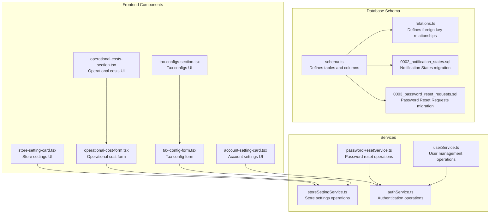
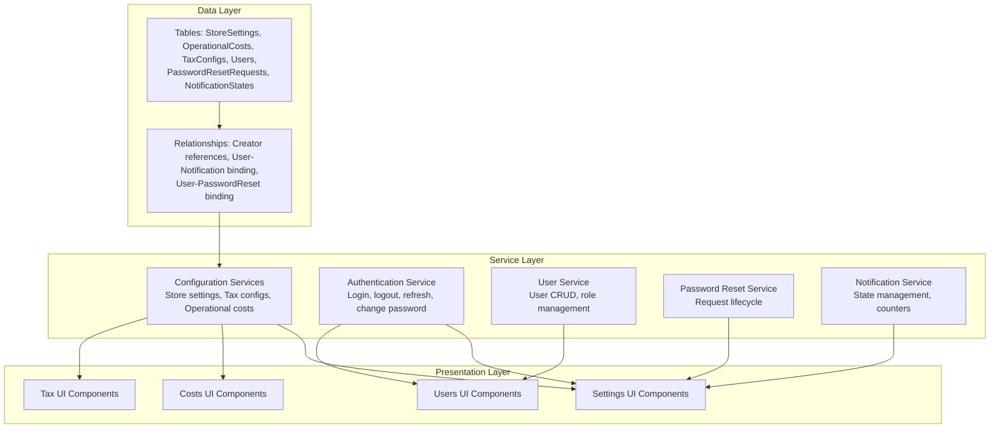
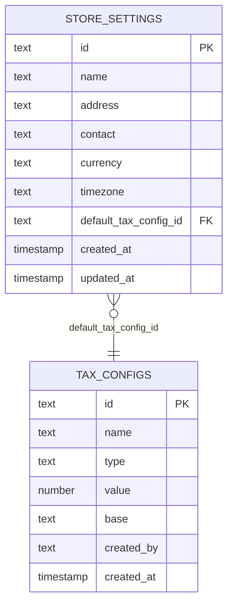
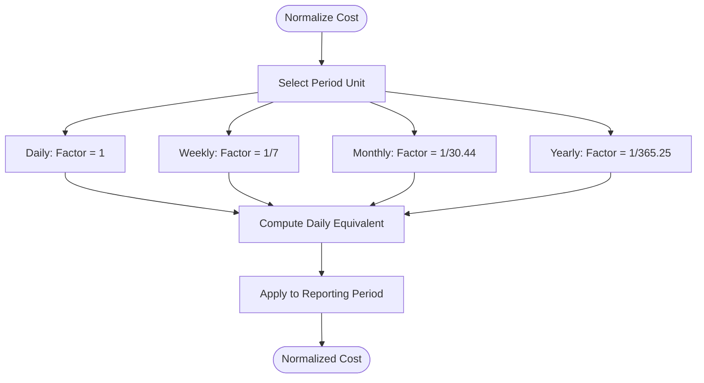
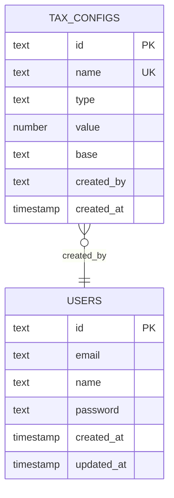
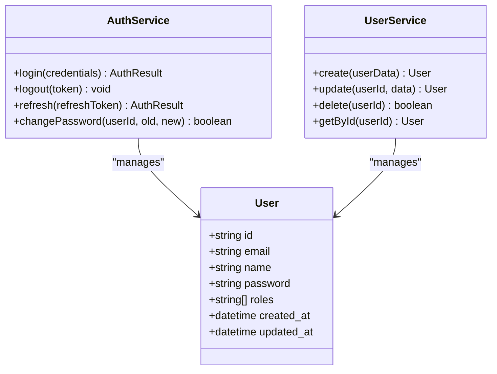
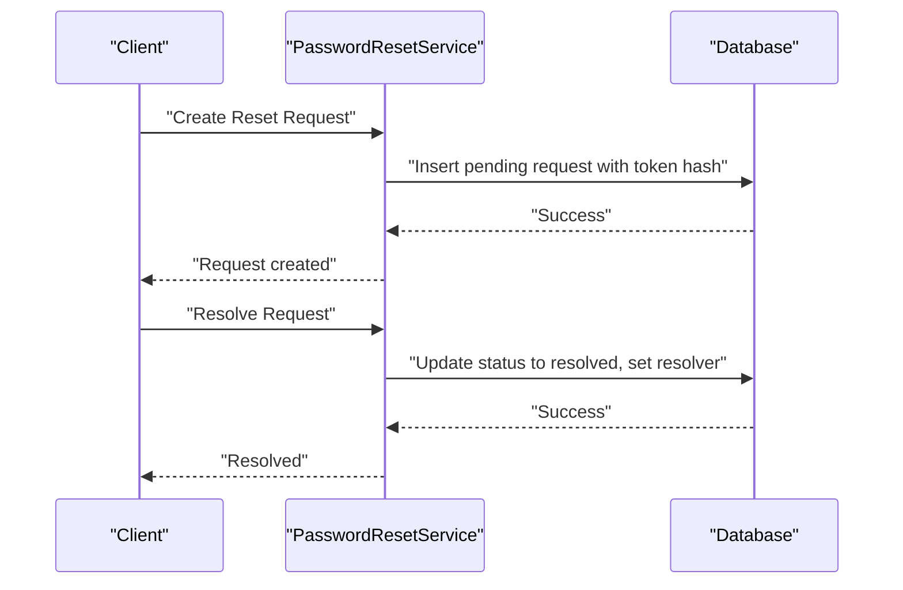
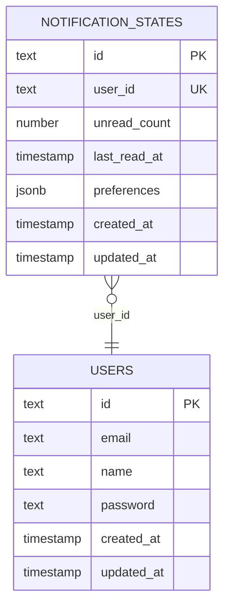
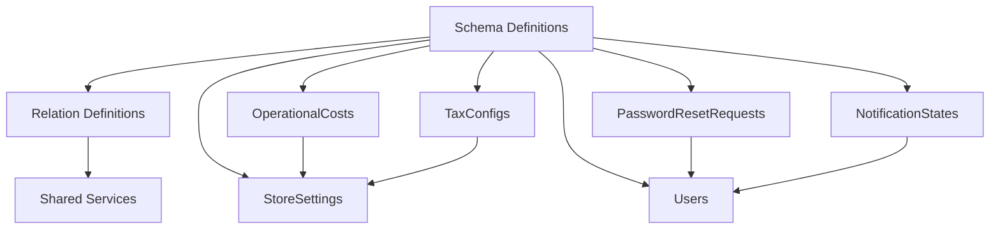

# Configuration Entities

<cite>
**Referenced Files in This Document**
- [schema.ts](file://src/drizzle/schema.ts)
- [relations.ts](file://src/drizzle/relations.ts)
- [0002_notification_states.sql](file://src/drizzle/0002_notification_states.sql)
- [0003_password_reset_requests.sql](file://src/drizzle/0003_password_reset_requests.sql)
- [store-setting-card.tsx](file://src/app/dashboard/setting/_components/store-setting-card.tsx)
- [account-setting-card.tsx](file://src/app/dashboard/setting/_components/account-setting-card.tsx)
- [operational-costs-section.tsx](file://src/app/dashboard/cost/_components/_sections/operational-costs-section.tsx)
- [tax-configs-section.tsx](file://src/app/dashboard/cost/_components/_sections/tax-configs-section.tsx)
- [operational-cost-form.tsx](file://src/app/dashboard/cost/_components/_forms/operational-cost-form.tsx)
- [tax-config-form.tsx](file://src/app/dashboard/cost/_components/_forms/tax-config-form.tsx)
- [use-operational-cost-list.ts](file://src/app/dashboard/cost/_hooks/use-operational-cost-list.ts)
- [use-tax-config-list.ts](file://src/app/dashboard/cost/_hooks/use-tax-config-list.ts)
- [cost-types.ts](file://src/app/dashboard/cost/_types/cost-types.ts)
- [notification-state-db.ts](file://src/app/api/notifications/_lib/notification-state-db.ts)
- [notification-store.ts](file://src/app/api/notifications/_lib/notification-store.ts)
- [notification-logic.ts](file://src/app/api/notifications/_lib/notification-logic.ts)
- [passwordResetService.ts](file://src/services/passwordResetService.ts)
- [storeSettingService.ts](file://src/services/storeSettingService.ts)
- [store-setting-card.tsx](file://src/app/dashboard/setting/_components/store-setting-card.tsx)
- [account-setting-card.tsx](file://src/app/dashboard/setting/_components/account-setting-card.tsx)
- [authService.ts](file://src/services/authService.ts)
- [userService.ts](file://src/services/userService.ts)
- [CALCULATIONS.md](file://CALCULATIONS.md)
- [NOTIFICATION_SCENARIOS.md](file://NOTIFICATION_SCENARIOS.md)
</cite>

## Table of Contents
1. [Introduction](#introduction)
2. [Project Structure](#project-structure)
3. [Core Components](#core-components)
4. [Architecture Overview](#architecture-overview)
5. [Detailed Component Analysis](#detailed-component-analysis)
6. [Dependency Analysis](#dependency-analysis)
7. [Performance Considerations](#performance-considerations)
8. [Troubleshooting Guide](#troubleshooting-guide)
9. [Conclusion](#conclusion)

## Introduction
This document provides comprehensive data model documentation for configuration and administrative entities in the POS application. It covers Store Settings, Operational Costs, Tax Configurations, User Roles, Password Reset Requests, and Refresh Tokens. It also details the operational cost table structure with period normalization calculations and category classifications, the tax configuration system supporting percentage-based and fixed taxes with different application bases, the user management system with role-based access control and authentication tokens, notification state management, and password reset workflow tables. Business constraints and validation rules are documented for each table.

## Project Structure
The configuration and administrative entities are primarily defined in the database schema and supported by frontend components and services. The schema defines core tables and relationships, while React components and TypeScript services implement CRUD operations, validation, and business logic.

**Diagram sources**
- [schema.ts](file://src/drizzle/schema.ts)
- [relations.ts](file://src/drizzle/relations.ts)
- [0002_notification_states.sql](file://src/drizzle/0002_notification_states.sql)
- [0003_password_reset_requests.sql](file://src/drizzle/0003_password_reset_requests.sql)
- [store-setting-card.tsx](file://src/app/dashboard/setting/_components/store-setting-card.tsx)
- [account-setting-card.tsx](file://src/app/dashboard/setting/_components/account-setting-card.tsx)
- [operational-costs-section.tsx](file://src/app/dashboard/cost/_components/_sections/operational-costs-section.tsx)
- [tax-configs-section.tsx](file://src/app/dashboard/cost/_components/_sections/tax-configs-section.tsx)
- [operational-cost-form.tsx](file://src/app/dashboard/cost/_components/_forms/operational-cost-form.tsx)
- [tax-config-form.tsx](file://src/app/dashboard/cost/_components/_forms/tax-config-form.tsx)
- [passwordResetService.ts](file://src/services/passwordResetService.ts)
- [storeSettingService.ts](file://src/services/storeSettingService.ts)
- [authService.ts](file://src/services/authService.ts)
- [userService.ts](file://src/services/userService.ts)

**Section sources**
- [schema.ts](file://src/drizzle/schema.ts)
- [relations.ts](file://src/drizzle/relations.ts)
- [0002_notification_states.sql](file://src/drizzle/0002_notification_states.sql)
- [0003_password_reset_requests.sql](file://src/drizzle/0003_password_reset_requests.sql)

## Core Components
This section documents the primary configuration and administrative entities, their attributes, relationships, and business constraints.

- Store Settings
  - Purpose: Centralized configuration for store-wide parameters.
  - Key Attributes: Store identifier, name, address, contact details, currency, timezone, tax settings defaults, and timestamps.
  - Business Constraints:
    - Store name and contact details are required.
    - Currency and timezone must be valid ISO codes or recognized values.
    - Defaults for tax configurations should reference existing tax configurations.
  - Related UI: Store settings card component for editing and viewing store configuration.

- Operational Costs
  - Purpose: Track recurring and one-time operational expenses with normalized periods.
  - Key Attributes: Cost identifier, title, amount, category, period normalization (daily/weekly/monthly/yearly), effective date range, creator reference, and timestamps.
  - Period Normalization Calculations:
    - Daily: Amount remains unchanged per day.
    - Weekly: Amount divided by 7.
    - Monthly: Amount divided by average days in the month (e.g., 30.44).
    - Yearly: Amount divided by 365.25 (accounting for leap years).
  - Category Classifications: Administrative, Marketing, Maintenance, Utilities, Supplies, Transportation, Insurance, and Others.
  - Business Constraints:
    - Amount must be non-negative.
    - Effective date range must be valid (start <= end).
    - Category must be one of predefined classifications.
    - Period normalization must be one of supported units.
  - Related UI: Operational costs section and form for creation/editing.

- Tax Configurations
  - Purpose: Define tax rules with support for percentage-based and fixed taxes applied to different bases.
  - Key Attributes: Tax configuration identifier, name, type (percentage/fixed), value, base (subtotal/discount/total), applicability rules, creator reference, and timestamps.
  - Application Bases:
    - Subtotal: Applied before discounts.
    - Discount: Applied after discount but before tax calculation.
    - Total: Applied after all discounts and adjustments.
  - Business Constraints:
    - Percentage type requires value between 0 and 100.
    - Fixed type requires non-negative value.
    - Base must be one of supported application bases.
    - Name uniqueness is enforced.
  - Related UI: Tax configurations section and form for creation/editing.

- User Roles and Authentication
  - Purpose: Manage user accounts, roles, and authentication lifecycle.
  - Key Attributes: User identifier, email, name, hashed password, role(s), timestamps.
  - Role-Based Access Control (RBAC):
    - Roles define permissions for accessing configuration entities and administrative functions.
    - Operations are restricted based on role hierarchy.
  - Authentication Tokens:
    - Login generates session tokens with expiration.
    - Refresh tokens enable secure token renewal.
    - Logout invalidates active sessions.
  - Business Constraints:
    - Email uniqueness is enforced.
    - Password hashing is mandatory.
    - Roles must be from approved set.

- Password Reset Requests
  - Purpose: Facilitate secure password resets via generated requests.
  - Key Attributes: Request identifier, user reference, token hash, status (pending/resolved/invalidated), resolution metadata (resolver, notes), timestamps.
  - Workflow:
    - Create request with unique token.
    - Send reset link to user.
    - Resolve request upon successful password change.
    - Invalidate on timeout or misuse.
  - Business Constraints:
    - Token uniqueness and expiry enforcement.
    - Status transitions are audited.
    - Resolver must be authorized.

- Notification State Management
  - Purpose: Track per-user notification preferences and read/unread states.
  - Key Attributes: State identifier, user reference, unread counts, last read timestamps, preferences, and timestamps.
  - Business Constraints:
    - One state per user.
    - Unread counts must be non-negative.
    - Preferences must conform to allowed options.

**Section sources**
- [schema.ts](file://src/drizzle/schema.ts)
- [relations.ts](file://src/drizzle/relations.ts)
- [0002_notification_states.sql](file://src/drizzle/0002_notification_states.sql)
- [0003_password_reset_requests.sql](file://src/drizzle/0003_password_reset_requests.sql)
- [CALCULATIONS.md](file://CALCULATIONS.md)
- [NOTIFICATION_SCENARIOS.md](file://NOTIFICATION_SCENARIOS.md)

## Architecture Overview
The configuration and administrative subsystem integrates database models, frontend components, and service layers. The schema defines entities and relationships, while services encapsulate business logic and validation. Frontend components provide user interfaces for managing these entities.

**Diagram sources**
- [schema.ts](file://src/drizzle/schema.ts)
- [relations.ts](file://src/drizzle/relations.ts)
- [storeSettingService.ts](file://src/services/storeSettingService.ts)
- [authService.ts](file://src/services/authService.ts)
- [userService.ts](file://src/services/userService.ts)
- [passwordResetService.ts](file://src/services/passwordResetService.ts)
- [store-setting-card.tsx](file://src/app/dashboard/setting/_components/store-setting-card.tsx)
- [operational-costs-section.tsx](file://src/app/dashboard/cost/_components/_sections/operational-costs-section.tsx)
- [tax-configs-section.tsx](file://src/app/dashboard/cost/_components/_sections/tax-configs-section.tsx)
- [account-setting-card.tsx](file://src/app/dashboard/setting/_components/account-setting-card.tsx)

## Detailed Component Analysis

### Store Settings Model
- Entity: StoreSettings
- Attributes:
  - Identifier, store name, address, contact, currency, timezone, default tax configuration reference, timestamps.
- Relationships:
  - References default tax configuration (optional).
- Validation Rules:
  - Store name required.
  - Contact details optional but validated if present.
  - Currency and timezone must be valid.
  - Default tax configuration must reference an existing tax configuration.

**Diagram sources**
- [schema.ts](file://src/drizzle/schema.ts)
- [relations.ts](file://src/drizzle/relations.ts)

**Section sources**
- [schema.ts](file://src/drizzle/schema.ts)
- [store-setting-card.tsx](file://src/app/dashboard/setting/_components/store-setting-card.tsx)
- [account-setting-card.tsx](file://src/app/dashboard/setting/_components/account-setting-card.tsx)

### Operational Costs Model
- Entity: OperationalCosts
- Attributes:
  - Identifier, title, amount, category, period normalization unit, effective start/end dates, creator reference, timestamps.
- Period Normalization:
  - Daily, Weekly, Monthly, Yearly with mathematical normalization factors.
- Categories:
  - Administrative, Marketing, Maintenance, Utilities, Supplies, Transportation, Insurance, Others.
- Validation Rules:
  - Amount >= 0.
  - Start date <= End date.
  - Category must be one of predefined values.
  - Period normalization must match supported units.

**Diagram sources**
- [CALCULATIONS.md](file://CALCULATIONS.md)
- [schema.ts](file://src/drizzle/schema.ts)

**Section sources**
- [schema.ts](file://src/drizzle/schema.ts)
- [operational-costs-section.tsx](file://src/app/dashboard/cost/_components/_sections/operational-costs-section.tsx)
- [operational-cost-form.tsx](file://src/app/dashboard/cost/_components/_forms/operational-cost-form.tsx)
- [use-operational-cost-list.ts](file://src/app/dashboard/cost/_hooks/use-operational-cost-list.ts)
- [cost-types.ts](file://src/app/dashboard/cost/_types/cost-types.ts)
- [CALCULATIONS.md](file://CALCULATIONS.md)

### Tax Configurations Model
- Entity: TaxConfigs
- Attributes:
  - Identifier, name, type (percentage/fixed), value, base (subtotal/discount/total), creator reference, timestamps.
- Application Bases:
  - Subtotal: Applied before discounts.
  - Discount: Applied after discount but before tax calculation.
  - Total: Applied after all discounts and adjustments.
- Validation Rules:
  - Percentage type: 0 <= value <= 100.
  - Fixed type: value >= 0.
  - Base must be one of supported values.
  - Name uniqueness enforced.

**Diagram sources**
- [schema.ts](file://src/drizzle/schema.ts)
- [relations.ts](file://src/drizzle/relations.ts)

**Section sources**
- [schema.ts](file://src/drizzle/schema.ts)
- [tax-configs-section.tsx](file://src/app/dashboard/cost/_components/_sections/tax-configs-section.tsx)
- [tax-config-form.tsx](file://src/app/dashboard/cost/_components/_forms/tax-config-form.tsx)
- [use-tax-config-list.ts](file://src/app/dashboard/cost/_hooks/use-tax-config-list.ts)

### User Roles and Authentication Model
- Entity: Users
- Attributes:
  - Identifier, email, name, hashed password, role(s), timestamps.
- RBAC:
  - Roles determine access to configuration entities.
  - Operations are constrained by role hierarchy.
- Authentication:
  - Login generates session tokens with expiration.
  - Refresh tokens enable secure renewal.
  - Logout invalidates sessions.
- Validation Rules:
  - Email uniqueness enforced.
  - Password hashing mandatory.
  - Roles must be from approved set.

**Diagram sources**
- [schema.ts](file://src/drizzle/schema.ts)
- [authService.ts](file://src/services/authService.ts)
- [userService.ts](file://src/services/userService.ts)

**Section sources**
- [schema.ts](file://src/drizzle/schema.ts)
- [authService.ts](file://src/services/authService.ts)
- [userService.ts](file://src/services/userService.ts)

### Password Reset Requests Model
- Entity: PasswordResetRequests
- Attributes:
  - Identifier, user reference, token hash, status (pending/resolved/invalidated), resolution metadata, timestamps.
- Lifecycle:
  - Create request with unique token.
  - Send reset link to user.
  - Resolve request upon successful password change.
  - Invalidate on timeout or misuse.
- Validation Rules:
  - Token uniqueness and expiry enforced.
  - Status transitions audited.
  - Resolver must be authorized.

**Diagram sources**
- [0003_password_reset_requests.sql](file://src/drizzle/0003_password_reset_requests.sql)
- [passwordResetService.ts](file://src/services/passwordResetService.ts)

**Section sources**
- [0003_password_reset_requests.sql](file://src/drizzle/0003_password_reset_requests.sql)
- [passwordResetService.ts](file://src/services/passwordResetService.ts)

### Notification State Management Model
- Entity: NotificationStates
- Attributes:
  - Identifier, user reference, unread counts, last read timestamps, preferences, timestamps.
- Constraints:
  - One state per user.
  - Unread counts non-negative.
  - Preferences conform to allowed options.
- Scenarios:
  - Initialization on user creation.
  - Increment on new notifications.
  - Reset on read actions.

**Diagram sources**
- [0002_notification_states.sql](file://src/drizzle/0002_notification_states.sql)
- [relations.ts](file://src/drizzle/relations.ts)

**Section sources**
- [0002_notification_states.sql](file://src/drizzle/0002_notification_states.sql)
- [notification-state-db.ts](file://src/app/api/notifications/_lib/notification-state-db.ts)
- [notification-store.ts](file://src/app/api/notifications/_lib/notification-store.ts)
- [notification-logic.ts](file://src/app/api/notifications/_lib/notification-logic.ts)
- [NOTIFICATION_SCENARIOS.md](file://NOTIFICATION_SCENARIOS.md)

## Dependency Analysis
The configuration entities depend on shared services and UI components. Operational costs and tax configurations rely on store settings defaults. Password reset requests depend on user identity and authentication services. Notification states depend on user identity.

**Diagram sources**
- [schema.ts](file://src/drizzle/schema.ts)
- [relations.ts](file://src/drizzle/relations.ts)
- [storeSettingService.ts](file://src/services/storeSettingService.ts)
- [passwordResetService.ts](file://src/services/passwordResetService.ts)

**Section sources**
- [schema.ts](file://src/drizzle/schema.ts)
- [relations.ts](file://src/drizzle/relations.ts)

## Performance Considerations
- Indexes: Ensure unique indexes on email (users), name (tax configs), and identifiers for efficient lookups.
- Aggregation: Normalize operational costs by period to reduce runtime computation overhead.
- Caching: Cache frequently accessed store settings and tax configurations.
- Pagination: Implement pagination for lists of operational costs and tax configurations.
- Concurrency: Use optimistic locking for store settings updates to prevent conflicts.

## Troubleshooting Guide
- Operational Costs
  - Symptom: Incorrect daily equivalent after normalization.
  - Resolution: Verify period normalization factor and date range validity.
  - Reference: [CALCULATIONS.md](file://CALCULATIONS.md)

- Tax Configurations
  - Symptom: Unexpected tax amounts.
  - Resolution: Confirm tax type and base alignment with business rules.
  - Reference: [tax-config-form.tsx](file://src/app/dashboard/cost/_components/_forms/tax-config-form.tsx)

- Password Reset Requests
  - Symptom: Request not resolving.
  - Resolution: Check token validity, status transitions, and resolver authorization.
  - Reference: [0003_password_reset_requests.sql](file://src/drizzle/0003_password_reset_requests.sql)

- Notification States
  - Symptom: Unread count not updating.
  - Resolution: Validate notification state initialization and read/update flows.
  - Reference: [0002_notification_states.sql](file://src/drizzle/0002_notification_states.sql)

**Section sources**
- [CALCULATIONS.md](file://CALCULATIONS.md)
- [tax-config-form.tsx](file://src/app/dashboard/cost/_components/_forms/tax-config-form.tsx)
- [0003_password_reset_requests.sql](file://src/drizzle/0003_password_reset_requests.sql)
- [0002_notification_states.sql](file://src/drizzle/0002_notification_states.sql)

## Conclusion
The configuration and administrative entities form the backbone of store-wide settings, cost management, tax policy, user administration, and communication state. The schema enforces business constraints, while services and UI components provide robust, maintainable functionality. Adhering to the documented validation rules and normalization practices ensures accurate reporting and reliable operations.