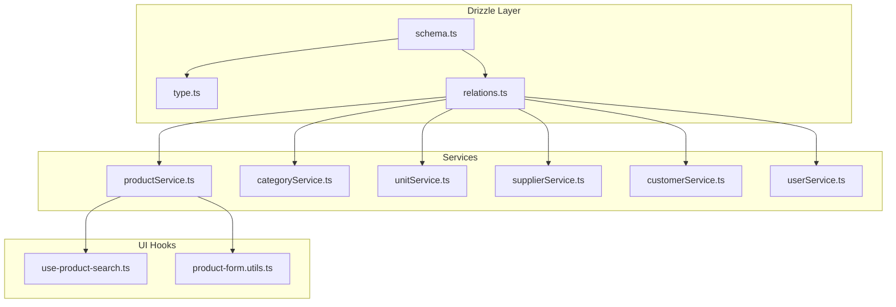
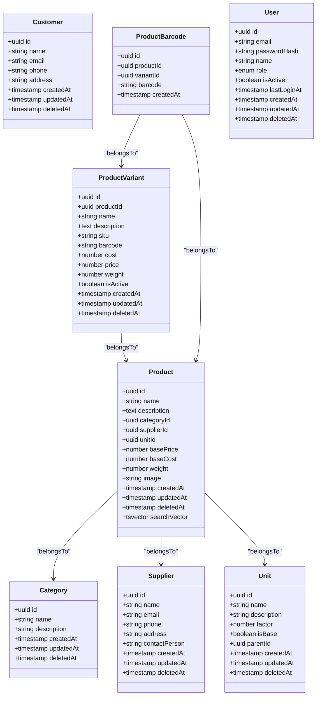
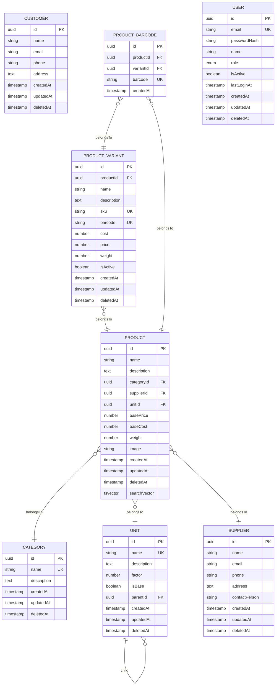
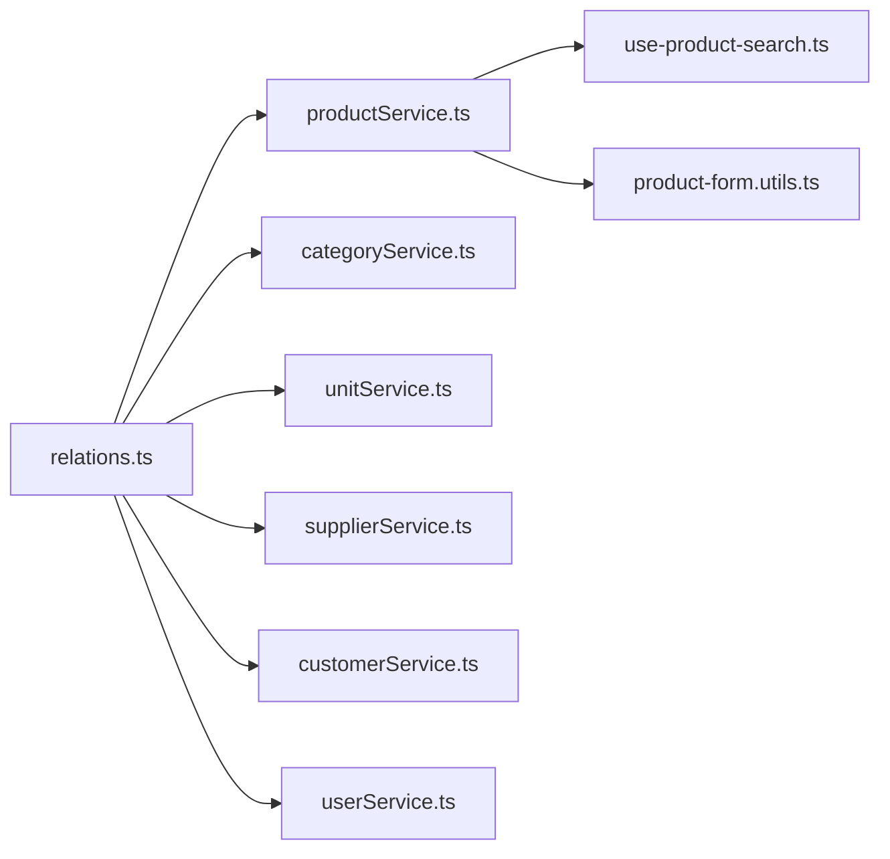

# Core Entities

<cite>
**Referenced Files in This Document**
- [schema.ts](file://src/drizzle/schema.ts)
- [type.ts](file://src/drizzle/type.ts)
- [relations.ts](file://src/drizzle/relations.ts)
- [product-service.ts](file://src/services/productService.ts)
- [category-service.ts](file://src/services/categoryService.ts)
- [unit-service.ts](file://src/services/unitService.ts)
- [supplier-service.ts](file://src/services/supplierService.ts)
- [customer-service.ts](file://src/services/customerService.ts)
- [user-service.ts](file://src/services/userService.ts)
- [product-form.utils.ts](file://src/app/dashboard/products/_utils/product-form.utils.ts)
- [use-product-search.ts](file://src/hooks/use-product-search.ts)
- [product-utils.ts](file://src/lib/product-utils.ts)
- [product-audit.test.ts](file://src/__tests__/lib/product-audit.test.ts)
- [product.test.ts](file://src/__tests__/validations/product.test.ts)
- [category.test.ts](file://src/__tests__/validations/category.test.ts)
- [unit.test.ts](file://src/__tests__/validations/unit.test.ts)
</cite>

## Table of Contents
1. [Introduction](#introduction)
2. [Project Structure](#project-structure)
3. [Core Components](#core-components)
4. [Architecture Overview](#architecture-overview)
5. [Detailed Component Analysis](#detailed-component-analysis)
6. [Dependency Analysis](#dependency-analysis)
7. [Performance Considerations](#performance-considerations)
8. [Troubleshooting Guide](#troubleshooting-guide)
9. [Conclusion](#conclusion)
10. [Appendices](#appendices)

## Introduction
This document provides comprehensive data model documentation for the core business entities in the POS application. It focuses on Products, Categories, Units, Suppliers, Customers, and Users, detailing their field definitions, data types, primary keys, foreign keys, constraints, and business logic. It also explains the product hierarchy (products, variants, and barcodes), unit conversion relationships, validation rules, defaults, and search vector implementation for full-text search and indexing strategies.

## Project Structure
The data model is defined in the Drizzle ORM layer and consumed by service and hook modules across the application. The schema defines tables and relationships; the type definitions capture TypeScript interfaces; and the relations module formalizes foreign key relationships. Services encapsulate CRUD and business logic for each entity, while UI hooks integrate search and form validation.

**Diagram sources**
- [schema.ts](file://src/drizzle/schema.ts)
- [type.ts](file://src/drizzle/type.ts)
- [relations.ts](file://src/drizzle/relations.ts)
- [product-service.ts](file://src/services/productService.ts)
- [category-service.ts](file://src/services/categoryService.ts)
- [unit-service.ts](file://src/services/unitService.ts)
- [supplier-service.ts](file://src/services/supplierService.ts)
- [customer-service.ts](file://src/services/customerService.ts)
- [user-service.ts](file://src/services/userService.ts)
- [use-product-search.ts](file://src/hooks/use-product-search.ts)
- [product-form.utils.ts](file://src/app/dashboard/products/_utils/product-form.utils.ts)

**Section sources**
- [schema.ts](file://src/drizzle/schema.ts)
- [type.ts](file://src/drizzle/type.ts)
- [relations.ts](file://src/drizzle/relations.ts)

## Core Components
This section documents the six core entities and their relationships, focusing on schema-level definitions and business constraints.

- Products
  - Purpose: Core inventory items and SKUs.
  - Key fields: id (primary key), name, description, categoryId (foreign key), supplierId (foreign key), unitId (foreign key), basePrice, baseCost, weight, image, createdAt, updatedAt, deletedAt, searchVector.
  - Constraints: Non-empty name; price and cost non-negative; weight non-negative; soft delete via deletedAt; searchVector for full-text search.
  - Business logic: Base unit pricing/cost; optional supplier association; category linkage; barcode uniqueness per product; variant availability depends on product status.

- Product Variants
  - Purpose: Specific configurations of a product (e.g., size, color).
  - Key fields: id (primary key), productId (foreign key), name, description, sku, barcode, cost, price, weight, isActive, createdAt, updatedAt, deletedAt.
  - Constraints: Unique SKU and barcode per product; non-negative price/cost/weight; soft delete; variant inherits product’s category and supplier indirectly through product.

- Product Barcodes
  - Purpose: Alternative identifiers for products and variants.
  - Key fields: id (primary key), productId (foreign key), variantId (foreign key), barcode (unique), createdAt.
  - Constraints: Barcode uniqueness; either productId or variantId must be set; mutual exclusion enforced by business logic.

- Categories
  - Purpose: Product classification.
  - Key fields: id (primary key), name, description, createdAt, updatedAt, deletedAt.
  - Constraints: Unique name; soft delete.

- Units
  - Purpose: Measurement units and conversion factors.
  - Key fields: id (primary key), name, description, factor (conversion multiplier), isBase (boolean), parentId (self-reference), createdAt, updatedAt, deletedAt.
  - Constraints: Factor non-negative; isBase implies no parent; parent chain forms unit hierarchy; soft delete.

- Suppliers
  - Purpose: Vendor information for procurement.
  - Key fields: id (primary key), name, email, phone, address, contactPerson, createdAt, updatedAt, deletedAt.
  - Constraints: Soft delete.

- Customers
  - Purpose: Sales and return records.
  - Key fields: id (primary key), name, email, phone, address, createdAt, updatedAt, deletedAt.
  - Constraints: Soft delete.

- Users
  - Purpose: Application access and permissions.
  - Key fields: id (primary key), email, passwordHash, name, role, isActive, lastLoginAt, createdAt, updatedAt, deletedAt.
  - Constraints: Unique email; role enumeration; soft delete.

**Section sources**
- [schema.ts](file://src/drizzle/schema.ts)
- [type.ts](file://src/drizzle/type.ts)

## Architecture Overview
The data model is centered around Drizzle schema definitions and enforced by relations. Services orchestrate business logic, validation, and search. UI hooks integrate search and form submission flows.

**Diagram sources**
- [schema.ts](file://src/drizzle/schema.ts)
- [type.ts](file://src/drizzle/type.ts)
- [relations.ts](file://src/drizzle/relations.ts)

## Detailed Component Analysis

### Products
- Field definitions and constraints
  - Name: required, non-empty string; used in search vector.
  - Description: optional text.
  - CategoryId: foreign key to Category; enforces category membership.
  - SupplierId: foreign key to Supplier; optional.
  - UnitId: foreign key to Unit; establishes base unit.
  - BasePrice/BaseCost: non-negative numbers; cost may be zero until purchase.
  - Weight: non-negative number; supports bulk pricing.
  - Image: optional string path.
  - SearchVector: tsvector for full-text search across name and description.
  - Soft delete: deletedAt timestamp indicates logical deletion.
- Business logic
  - Product variants inherit category and supplier indirectly via product.
  - Barcodes are unique per product; variants may have separate barcodes.
  - Price and cost are maintained at base unit level.
- Typical data entries
  - Example product: name “Organic Coffee”, category “Beverages”, supplier “FarmCo”, basePrice 12000, baseCost 8000, unit “bag”, weight 1.0.
- Full-text search and indexing
  - searchVector is generated from name and description; PostgreSQL GIN index recommended for tsvector.

**Section sources**
- [schema.ts](file://src/drizzle/schema.ts)
- [type.ts](file://src/drizzle/type.ts)
- [product-service.ts](file://src/services/productService.ts)
- [product-form.utils.ts](file://src/app/dashboard/products/_utils/product-form.utils.ts)
- [use-product-search.ts](file://src/hooks/use-product-search.ts)

### Product Variants
- Field definitions and constraints
  - Name: variant-specific name; may mirror product name.
  - Description: variant-specific notes.
  - Sku: unique SKU per product; variant-level SKU.
  - Barcode: unique barcode per product; variant-level barcode.
  - Cost/Price: variant-specific pricing; non-negative.
  - Weight: variant-specific weight.
  - IsActive: enables/disables variant visibility.
  - Soft delete: deletedAt timestamp.
- Business logic
  - Variant belongs to a single product; can be enabled/disabled independently.
  - Variant barcodes are distinct from product barcodes.
- Typical data entries
  - Example variant: productId linking to “Organic Coffee”, name “Decaf”, sku “OC-D”, barcode “VAR-DECAP”, price 12500, cost 8200, weight 1.0.

**Section sources**
- [schema.ts](file://src/drizzle/schema.ts)
- [type.ts](file://src/drizzle/type.ts)
- [product-service.ts](file://src/services/productService.ts)

### Product Barcodes
- Field definitions and constraints
  - productId or variantId must be set; mutual exclusion enforced by business logic.
  - Barcode: globally unique string within product context.
  - createdAt: timestamp of creation.
- Business logic
  - Barcodes support scanning and lookup; variants may have dedicated barcodes.
- Typical data entries
  - Example barcode: productId for “Organic Coffee”, barcode “OC-BAR-123”.
  - Example variant barcode: variantId for “Decaf”, barcode “OC-VAR-DECAP”.

**Section sources**
- [schema.ts](file://src/drizzle/schema.ts)
- [type.ts](file://src/drizzle/type.ts)
- [product-service.ts](file://src/services/productService.ts)

### Categories
- Field definitions and constraints
  - Name: unique, required string.
  - Description: optional text.
  - Soft delete: deletedAt timestamp.
- Business logic
  - Categories classify products; deletion cascades to products (soft delete) or restricts depending on policy.
- Typical data entries
  - Example category: name “Beverages”, description “Hot and cold drinks”.

**Section sources**
- [schema.ts](file://src/drizzle/schema.ts)
- [type.ts](file://src/drizzle/type.ts)
- [category-service.ts](file://src/services/categoryService.ts)

### Units
- Field definitions and constraints
  - Name: required, unique string.
  - Description: optional text.
  - Factor: conversion multiplier; non-negative.
  - IsBase: marks base unit; no parent allowed.
  - ParentId: self-referencing; forms hierarchy (e.g., kg -> hg -> g).
  - Soft delete: deletedAt timestamp.
- Business logic
  - Base unit has factor 1.0 and no parent.
  - Conversion factor determines derived unit scaling.
- Typical data entries
  - Example base unit: name “gram”, factor 1.0.
  - Example derived unit: name “kilogram”, factor 1000.0, parent “gram”.

**Section sources**
- [schema.ts](file://src/drizzle/schema.ts)
- [type.ts](file://src/drizzle/type.ts)
- [unit-service.ts](file://src/services/unitService.ts)

### Suppliers
- Field definitions and constraints
  - Name: required string.
  - Email/Phone: optional but useful for communication.
  - Address: optional text.
  - ContactPerson: optional string.
  - Soft delete: deletedAt timestamp.
- Business logic
  - Supplies products; optional association in product record.
- Typical data entries
  - Example supplier: name “FarmCo”, email “farm@co.com”, phone “+628123456789”, contact “John Doe”.

**Section sources**
- [schema.ts](file://src/drizzle/schema.ts)
- [type.ts](file://src/drizzle/type.ts)
- [supplier-service.ts](file://src/services/supplierService.ts)

### Customers
- Field definitions and constraints
  - Name: required string.
  - Email/Phone: optional identifiers.
  - Address: optional text.
  - Soft delete: deletedAt timestamp.
- Business logic
  - Used in sales and returns; supports loyalty and history tracking.
- Typical data entries
  - Example customer: name “Alice”, email “alice@example.com”.

**Section sources**
- [schema.ts](file://src/drizzle/schema.ts)
- [type.ts](file://src/drizzle/type.ts)
- [customer-service.ts](file://src/services/customerService.ts)

### Users
- Field definitions and constraints
  - Email: unique, required string.
  - PasswordHash: required hashed credential.
  - Name: required string.
  - Role: enumerated role (e.g., admin, cashier).
  - IsActive: boolean flag.
  - LastLoginAt: optional timestamp.
  - Soft delete: deletedAt timestamp.
- Business logic
  - Authentication and authorization; role-based access control.
- Typical data entries
  - Example user: email “admin@pos.local”, name “Admin”, role “admin”, isActive true.

**Section sources**
- [schema.ts](file://src/drizzle/schema.ts)
- [type.ts](file://src/drizzle/type.ts)
- [user-service.ts](file://src/services/userService.ts)

### Product Hierarchy and Relationships
- Product → Category: Many-to-one; product belongs to one category.
- Product → Supplier: Many-to-one; product optionally linked to supplier.
- Product → Unit: Many-to-one; product linked to base unit.
- Product → Variants: One-to-many; variants inherit product metadata.
- Product/Variants → Barcodes: One-to-many; unique per product/variant.
- Units: Self-referencing hierarchy via parentId; conversion via factor.

**Diagram sources**
- [schema.ts](file://src/drizzle/schema.ts)
- [type.ts](file://src/drizzle/type.ts)
- [relations.ts](file://src/drizzle/relations.ts)

### Validation Rules and Defaults
- Validation rules
  - Non-empty name for products, categories, units.
  - Non-negative price, cost, weight.
  - Unique constraints: category name, unit name, product barcode, variant barcode/SKU.
  - Soft delete timestamps for logical deletion.
- Defaults
  - Base unit factor 1.0; isBase true for base units.
  - Default isActive true for variants unless otherwise specified.
  - Timestamps default to current time on creation/update.

**Section sources**
- [product.test.ts](file://src/__tests__/validations/product.test.ts)
- [category.test.ts](file://src/__tests__/validations/category.test.ts)
- [unit.test.ts](file://src/__tests__/validations/unit.test.ts)
- [schema.ts](file://src/drizzle/schema.ts)

### Search Vector Implementation and Indexing Strategies
- Full-text search
  - Products include a tsvector searchVector built from name and description.
  - Recommended GIN index on searchVector for efficient text search.
- Indexing strategies
  - GIN index on tsvector searchVector.
  - Unique indexes on barcode (product and variant), SKU (variant), category name, unit name.
  - Partial indexes for active variants and non-deleted records to optimize queries.

**Section sources**
- [schema.ts](file://src/drizzle/schema.ts)
- [use-product-search.ts](file://src/hooks/use-product-search.ts)
- [product-utils.ts](file://src/lib/product-utils.ts)

## Dependency Analysis
The Drizzle relations module defines foreign key relationships among entities. Services depend on these relations to enforce referential integrity and business rules. UI hooks rely on services for search and form operations.

**Diagram sources**
- [relations.ts](file://src/drizzle/relations.ts)
- [product-service.ts](file://src/services/productService.ts)
- [category-service.ts](file://src/services/categoryService.ts)
- [unit-service.ts](file://src/services/unitService.ts)
- [supplier-service.ts](file://src/services/supplierService.ts)
- [customer-service.ts](file://src/services/customerService.ts)
- [user-service.ts](file://src/services/userService.ts)
- [use-product-search.ts](file://src/hooks/use-product-search.ts)
- [product-form.utils.ts](file://src/app/dashboard/products/_utils/product-form.utils.ts)

**Section sources**
- [relations.ts](file://src/drizzle/relations.ts)
- [product-service.ts](file://src/services/productService.ts)
- [category-service.ts](file://src/services/categoryService.ts)
- [unit-service.ts](file://src/services/unitService.ts)
- [supplier-service.ts](file://src/services/supplierService.ts)
- [customer-service.ts](file://src/services/customerService.ts)
- [user-service.ts](file://src/services/userService.ts)

## Performance Considerations
- Indexes
  - GIN index on product searchVector for full-text search.
  - Unique indexes on barcode, SKU, category name, unit name.
  - Partial indexes for active/inactive states and non-deleted rows.
- Queries
  - Prefer filtered queries with appropriate indexes.
  - Use joins carefully; limit select lists to required fields.
- Caching
  - Cache frequently accessed categories, units, and suppliers.
- Concurrency
  - Use transactions for barcode/SKU updates to prevent duplicates.

[No sources needed since this section provides general guidance]

## Troubleshooting Guide
- Duplicate barcode/SKU errors
  - Cause: Unique constraint violation during insert/update.
  - Resolution: Ensure barcode/SKU uniqueness per product/variant; validate before save.
- Negative price/cost/weight
  - Cause: Invalid input values.
  - Resolution: Enforce validation rules; reject negative values.
- Missing base unit
  - Cause: No base unit selected for product.
  - Resolution: Require isBase=true for exactly one unit; factor=1.0.
- Variant not visible
  - Cause: Variant marked inactive.
  - Resolution: Toggle isActive to true.
- Search not returning results
  - Cause: Missing GIN index on searchVector.
  - Resolution: Add GIN index on tsvector column.

**Section sources**
- [product.test.ts](file://src/__tests__/validations/product.test.ts)
- [category.test.ts](file://src/__tests__/validations/category.test.ts)
- [unit.test.ts](file://src/__tests__/validations/unit.test.ts)
- [product-audit.test.ts](file://src/__tests__/lib/product-audit.test.ts)

## Conclusion
The POS application’s data model centers on robust entity definitions with clear relationships, constraints, and business rules. Products, variants, and barcodes form a flexible hierarchy supporting diverse SKUs and identifiers. Categories, units, suppliers, customers, and users provide the foundational taxonomy and operational context. Full-text search via tsvector and strategic indexing enable efficient product discovery. Validation and defaults ensure data integrity, while services and hooks deliver cohesive UI experiences.

[No sources needed since this section summarizes without analyzing specific files]

## Appendices
- Audit logs
  - Product audit logs track changes to product metadata, enabling compliance and traceability.
- Form utilities
  - Product form utilities assist in preparing submissions and validating inputs before persistence.

**Section sources**
- [product-audit.test.ts](file://src/__tests__/lib/product-audit.test.ts)
- [product-form.utils.ts](file://src/app/dashboard/products/_utils/product-form.utils.ts)