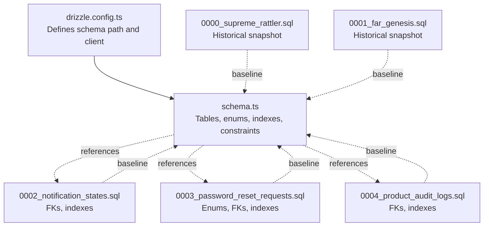
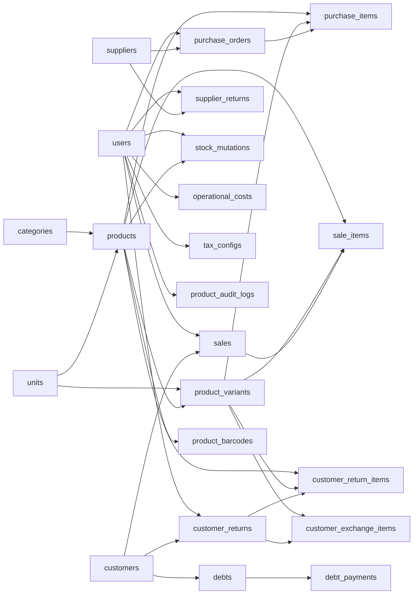

# Data Integrity & Constraints

<cite>
**Referenced Files in This Document**
- [schema.ts](file://src/drizzle/schema.ts)
- [0000_supreme_rattler.sql](file://src/drizzle/0000_supreme_rattler.sql)
- [0001_far_genesis.sql](file://src/drizzle/0001_far_genesis.sql)
- [0002_notification_states.sql](file://src/drizzle/0002_notification_states.sql)
- [0003_password_reset_requests.sql](file://src/drizzle/0003_password_reset_requests.sql)
- [0004_product_audit_logs.sql](file://src/drizzle/0004_product_audit_logs.sql)
- [drizzle.config.ts](file://drizzle.config.ts)
</cite>

## Table of Contents
1. [Introduction](#introduction)
2. [Project Structure](#project-structure)
3. [Core Components](#core-components)
4. [Architecture Overview](#architecture-overview)
5. [Detailed Component Analysis](#detailed-component-analysis)
6. [Dependency Analysis](#dependency-analysis)
7. [Performance Considerations](#performance-considerations)
8. [Troubleshooting Guide](#troubleshooting-guide)
9. [Conclusion](#conclusion)

## Introduction
This document explains the database constraints, indexes, and referential integrity rules implemented in the schema. It catalogs primary keys, foreign keys, unique constraints, and check constraints, and details cascade delete behaviors and ON UPDATE actions. It also documents the indexing strategy (including GIN indexes for full-text search) and enum types with their validation rules. Finally, it outlines audit trail mechanisms and soft delete patterns used across the schema.

## Project Structure
The schema is defined programmatically using Drizzle ORM with PostgreSQL-specific features. Migration snapshots capture historical schema states and indexes. The configuration file defines the database connection and schema location.

**Diagram sources**
- [drizzle.config.ts](file://drizzle.config.ts)
- [schema.ts](file://src/drizzle/schema.ts)
- [0000_supreme_rattler.sql](file://src/drizzle/0000_supreme_rattler.sql)
- [0001_far_genesis.sql](file://src/drizzle/0001_far_genesis.sql)
- [0002_notification_states.sql](file://src/drizzle/0002_notification_states.sql)
- [0003_password_reset_requests.sql](file://src/drizzle/0003_password_reset_requests.sql)
- [0004_product_audit_logs.sql](file://src/drizzle/0004_product_audit_logs.sql)

**Section sources**
- [drizzle.config.ts](file://drizzle.config.ts)
- [schema.ts](file://src/drizzle/schema.ts)
- [0000_supreme_rattler.sql](file://src/drizzle/0000_supreme_rattler.sql)
- [0001_far_genesis.sql](file://src/drizzle/0001_far_genesis.sql)
- [0002_notification_states.sql](file://src/drizzle/0002_notification_states.sql)
- [0003_password_reset_requests.sql](file://src/drizzle/0003_password_reset_requests.sql)
- [0004_product_audit_logs.sql](file://src/drizzle/0004_product_audit_logs.sql)

## Core Components
This section enumerates primary keys, foreign keys, unique constraints, and indexes across all tables. It also highlights generated columns and computed GIN indexes for full-text search.

- Users
  - Primary key: id
  - Unique constraints: email
  - Generated column: search_vector (GIN index)
  - Soft delete: deleted_at
  - Audit timestamps: created_at, updated_at (ON UPDATE sets current time)

- Password reset requests
  - Primary key: id
  - Foreign keys: user_id (ON DELETE cascade), resolved_by (no cascade)
  - Unique constraints: none
  - Indexes: status

- Refresh tokens
  - Primary key: id
  - Unique constraints: token
  - Foreign keys: user_id (ON DELETE cascade)

- User roles
  - Composite primary key: (user_id, role)
  - Foreign keys: user_id (ON DELETE cascade)

- Categories
  - Primary key: id
  - Soft delete: deleted_at
  - Audit timestamps: created_at, updated_at (ON UPDATE sets current time)

- Units
  - Primary key: id
  - Soft delete: deleted_at
  - Audit timestamps: created_at, updated_at (ON UPDATE sets current time)

- Suppliers
  - Primary key: id
  - Soft delete: deleted_at
  - Audit timestamps: created_at, updated_at (ON UPDATE sets current time)

- Customers
  - Primary key: id
  - Audit timestamps: created_at, updated_at (ON UPDATE sets current time)

- Products
  - Primary key: id
  - Foreign keys: category_id (ON DELETE cascade), base_unit_id (ON DELETE cascade)
  - Unique constraints: sku
  - Generated column: search_vector (GIN index)
  - Soft delete: deleted_at
  - Audit timestamps: created_at, updated_at (ON UPDATE sets current time)

- Product variants
  - Primary key: id
  - Foreign keys: product_id (ON DELETE cascade), unit_id (ON DELETE cascade)
  - Unique constraints: sku
  - Soft delete: deleted_at
  - Audit timestamps: created_at, updated_at (ON UPDATE sets current time)

- Product barcodes
  - Primary key: id
  - Foreign keys: product_id (ON DELETE cascade)
  - Unique constraints: barcode
  - Audit timestamps: created_at, updated_at (ON UPDATE sets current time)

- Purchase orders
  - Primary key: id
  - Foreign keys: supplier_id (ON DELETE cascade), user_id (ON DELETE cascade)
  - Unique constraints: order_number
  - Soft delete: deleted_at
  - Audit timestamps: created_at, updated_at (ON UPDATE sets current time)

- Purchase items
  - Primary key: id
  - Foreign keys: purchase_id (ON DELETE cascade), product_id (ON DELETE cascade), variant_id (ON DELETE cascade)
  - Audit timestamps: created_at, updated_at (ON UPDATE sets current time)

- Sales
  - Primary key: id
  - Foreign keys: customer_id (ON DELETE cascade), user_id (ON DELETE cascade)
  - Unique constraints: invoice_number
  - Audit timestamps: created_at, updated_at (ON UPDATE sets current time)

- Sale items
  - Primary key: id
  - Foreign keys: sale_id (ON DELETE cascade), product_id (ON DELETE cascade), variant_id (ON DELETE cascade)
  - Audit timestamps: created_at, updated_at (ON UPDATE sets current time)

- Debts
  - Primary key: id
  - Foreign keys: sale_id (ON DELETE cascade), customer_id (ON DELETE cascade)
  - Audit timestamps: created_at, updated_at (ON UPDATE sets current time)

- Debt payments
  - Primary key: id
  - Foreign keys: debt_id (ON DELETE cascade)
  - Audit timestamps: created_at, updated_at (ON UPDATE sets current time)

- Supplier returns
  - Primary key: id
  - Foreign keys: supplier_id (ON DELETE cascade), purchase_id (ON DELETE cascade), product_id (ON DELETE cascade), user_id (ON DELETE set null)
  - Generated column: search_vector (GIN index)
  - Audit timestamps: created_at, updated_at (ON UPDATE sets current time)

- Stock mutations
  - Primary key: id
  - Foreign keys: product_id (ON DELETE cascade), variant_id (ON DELETE cascade), user_id (ON DELETE cascade)
  - Audit timestamps: created_at, updated_at (ON UPDATE sets current time)

- Customer returns
  - Primary key: id
  - Foreign keys: sale_id (ON DELETE cascade), customer_id (ON DELETE cascade), user_id (ON DELETE cascade)
  - Unique constraints: return_number
  - Audit timestamps: created_at, updated_at (ON UPDATE sets current time)

- Customer return items
  - Primary key: id
  - Foreign keys: return_id (ON DELETE cascade), product_id (ON DELETE cascade), variant_id (ON DELETE cascade), user_id (ON DELETE cascade)
  - Audit timestamps: created_at, updated_at (ON UPDATE sets current time)

- Customer exchange items
  - Primary key: id
  - Foreign keys: return_id (ON DELETE cascade), product_id (ON DELETE cascade), variant_id (ON DELETE cascade)
  - Audit timestamps: created_at, updated_at (ON UPDATE sets current time)

- Notification states
  - Primary key: id
  - Foreign keys: user_id (ON DELETE cascade)
  - Unique constraints: (user_id, notification_id)
  - Indexes: user_id
  - Audit timestamps: created_at, updated_at (ON UPDATE sets current time)

- Operational costs
  - Primary key: id
  - Foreign keys: created_by (ON DELETE set null)
  - Audit timestamps: created_at, updated_at (ON UPDATE sets current time)

- Tax configs
  - Primary key: id
  - Foreign keys: created_by (ON DELETE set null)
  - Audit timestamps: created_at, updated_at (ON UPDATE sets current time)

- Customer balance mutations
  - Primary key: id
  - Audit timestamps: created_at

- Store settings
  - Primary key: id
  - Audit timestamps: updated_at (ON UPDATE sets current time)

- Product audit logs
  - Primary key: id
  - Foreign keys: product_id (ON DELETE set null), user_id (ON DELETE set null)
  - Indexes: product_id, user_id, created_at

**Section sources**
- [schema.ts](file://src/drizzle/schema.ts)
- [0002_notification_states.sql](file://src/drizzle/0002_notification_states.sql)
- [0003_password_reset_requests.sql](file://src/drizzle/0003_password_reset_requests.sql)
- [0004_product_audit_logs.sql](file://src/drizzle/0004_product_audit_logs.sql)

## Architecture Overview
The schema enforces referential integrity via foreign keys with explicit ON DELETE actions. Soft deletes are implemented by adding a deleted_at timestamp to several entities. Audit trails are captured through generated search vectors and dedicated audit log tables. Indexes are strategically placed to support common queries and full-text search.

```mermaid
graph TB
subgraph "Core Entities"
users["users"]
categories["categories"]
units["units"]
suppliers["suppliers"]
customers["customers"]
products["products"]
variants["product_variants"]
barcodes["product_barcodes"]
end
subgraph "Transactions"
purchases["purchase_orders"]
purchase_items["purchase_items"]
sales["sales"]
sale_items["sale_items"]
returns["customer_returns"]
return_items["customer_return_items"]
exchanges["customer_exchange_items"]
debts["debts"]
payments["debt_payments"]
supplier_returns["supplier_returns"]
mutations["stock_mutations"]
end
subgraph "System & Auditing"
tokens["refresh_tokens"]
resets["password_reset_requests"]
notifs["notification_states"]
audits["product_audit_logs"]
costs["operational_costs"]
taxes["tax_configs"]
balances["customer_balance_mutations"]
settings["store_settings"]
end
users --> tokens
users --> resets
users --> notifs
users --> purchases
users --> sales
users --> returns
users --> supplier_returns
users --> mutations
users --> costs
users --> taxes
users --> audits
categories --> products
units --> products
units --> variants
suppliers --> purchases
suppliers --> supplier_returns
customers --> sales
customers --> returns
customers --> debts
products --> variants
products --> barcodes
products --> purchase_items
products --> sale_items
products --> return_items
products --> mutations
variants --> purchase_items
variants --> sale_items
variants --> return_items
variants --> exchanges
purchases --> purchase_items
sales --> sale_items
returns --> return_items
returns --> exchanges
debts --> payments
```

**Diagram sources**
- [schema.ts](file://src/drizzle/schema.ts)
- [0002_notification_states.sql](file://src/drizzle/0002_notification_states.sql)
- [0003_password_reset_requests.sql](file://src/drizzle/0003_password_reset_requests.sql)
- [0004_product_audit_logs.sql](file://src/drizzle/0004_product_audit_logs.sql)

## Detailed Component Analysis

### Enum Types and Validation Rules
- stock_mutation_type: Values include purchase, purchase_cancel, sale, sale_cancel, return_restock, return_cancel, waste, supplier_return, adjustment, exchange, exchange_cancel.
- sale_status: Values include pending_payment, debt, completed, refunded, cancelled.
- payment_method: Values include cash, qris.
- debt_status: Values include unpaid, partial, paid, cancelled.
- compensation_type: Values include exchange, credit_note, refund.
- surplus_strategy_type: Values include cash, credit_balance.
- user_role: Values include admin toko, admin sistem.
- password_reset_status: Values include pending, completed, rejected.
- cost_period: Values include daily, weekly, monthly, yearly, one_time.
- cost_category: Values include utilities, salary, rent, logistics, marketing, maintenance, other.
- tax_applies_to: Values include revenue, gross_profit.
- tax_type: Values include percentage, fixed.

Validation rules:
- Enums are enforced at the database level via typed columns.
- Some columns define defaults (e.g., category default "other", period default "monthly").
- Certain combinations are validated by application/business logic (e.g., rate vs fixedAmount/type, appliesTo vs type).

**Section sources**
- [schema.ts](file://src/drizzle/schema.ts)

### Referential Integrity and Cascade Behaviors
- Cascade delete (ON DELETE cascade):
  - password_reset_requests.user_id
  - refresh_tokens.user_id
  - user_roles.user_id
  - products.category_id
  - products.base_unit_id
  - product_variants.product_id
  - product_variants.unit_id
  - product_barcodes.product_id
  - purchase_orders.supplier_id
  - purchase_orders.user_id
  - purchase_items.purchase_id
  - purchase_items.product_id
  - purchase_items.variant_id
  - sales.customer_id
  - sales.user_id
  - sale_items.sale_id
  - sale_items.product_id
  - sale_items.variant_id
  - customer_returns.sale_id
  - customer_returns.customer_id
  - customer_returns.user_id
  - customer_return_items.return_id
  - customer_return_items.product_id
  - customer_return_items.variant_id
  - customer_return_items.user_id
  - customer_exchange_items.return_id
  - customer_exchange_items.product_id
  - customer_exchange_items.variant_id
  - supplier_returns.supplier_id
  - supplier_returns.purchase_id
  - supplier_returns.product_id
  - supplier_returns.user_id
  - stock_mutations.product_id
  - stock_mutations.variant_id
  - stock_mutations.user_id
  - debts.sale_id
  - debts.customer_id
  - debt_payments.debt_id
  - notification_states.user_id
  - product_audit_logs.product_id
  - product_audit_logs.user_id

- Set null (ON DELETE set null):
  - operational_costs.created_by
  - tax_configs.created_by
  - product_audit_logs.product_id
  - product_audit_logs.user_id

- No cascade (ON DELETE no action/restrict):
  - password_reset_requests.resolved_by (referencing users.id)

These behaviors ensure data consistency across related entities and prevent orphaned records.

**Section sources**
- [schema.ts](file://src/drizzle/schema.ts)
- [0002_notification_states.sql](file://src/drizzle/0002_notification_states.sql)
- [0003_password_reset_requests.sql](file://src/drizzle/0003_password_reset_requests.sql)
- [0004_product_audit_logs.sql](file://src/drizzle/0004_product_audit_logs.sql)

### Indexing Strategy
- Unique indexes:
  - users.email
  - product_barcodes.barcode
  - product_variants.sku
  - products.sku
  - purchase_orders.order_number
  - customer_returns.return_number
  - refresh_tokens.token
- Composite unique index:
  - notification_states (user_id, notification_id)
- Full-text search GIN indexes:
  - users.search_vector
  - products.search_vector
  - supplier_returns.search_vector
- Additional indexes:
  - password_reset_requests.status
  - product_audit_logs product_id, user_id, created_at
  - notification_states user_id

These indexes optimize lookups, enforce uniqueness, and enable efficient full-text search.

**Section sources**
- [schema.ts](file://src/drizzle/schema.ts)
- [0002_notification_states.sql](file://src/drizzle/0002_notification_states.sql)
- [0003_password_reset_requests.sql](file://src/drizzle/0003_password_reset_requests.sql)
- [0004_product_audit_logs.sql](file://src/drizzle/0004_product_audit_logs.sql)

### Audit Trail and Soft Delete Patterns
- Soft deletes:
  - categories.deleted_at
  - units.deleted_at
  - suppliers.deleted_at
  - products.deleted_at
  - product_variants.deleted_at
  - purchase_orders.deleted_at
  - customer_returns.deleted_at
  - supplier_returns.deleted_at
  - stock_mutations.deleted_at
  - notification_states.deleted_at (present in schema but not used in current model)
- Audit timestamps:
  - Many tables include created_at and updated_at with ON UPDATE triggers to refresh timestamps.
- Audit logs:
  - product_audit_logs captures product lifecycle events with JSONB fields for changes and snapshots.
  - Columns include product_id, user_id, action, changes, snapshot, created_at.

Application logic should:
- Filter out rows where deleted_at is not null for active records.
- Use audit logs to track modifications and recover from accidental changes.

**Section sources**
- [schema.ts](file://src/drizzle/schema.ts)
- [0004_product_audit_logs.sql](file://src/drizzle/0004_product_audit_logs.sql)

### Constraint Violation Scenarios and Impact
- Unique constraint violations:
  - Attempting to insert duplicate emails, SKUs, barcodes, order numbers, or return numbers will fail. Application logic should surface user-friendly errors and prevent invalid submissions.
- Foreign key violations:
  - Inserting a record with a non-existent parent ID will fail. Cascading rules apply depending on the relationship. For example, deleting a user referenced by purchase_orders will cascade to child records.
- Enum validation failures:
  - Assigning an invalid enum value will raise a constraint error. Application should validate inputs against allowed values.
- Generated column constraints:
  - Full-text search vectors are generated; manual updates are unnecessary and discouraged.

Impact on application logic:
- Centralized error handling should catch constraint violations and map them to actionable messages.
- Business workflows should validate preconditions (e.g., sufficient stock, valid unit conversions) before persistence.

**Section sources**
- [schema.ts](file://src/drizzle/schema.ts)
- [0002_notification_states.sql](file://src/drizzle/0002_notification_states.sql)
- [0003_password_reset_requests.sql](file://src/drizzle/0003_password_reset_requests.sql)
- [0004_product_audit_logs.sql](file://src/drizzle/0004_product_audit_logs.sql)

## Dependency Analysis
This section maps foreign key dependencies and highlights potential cycles or tight couplings.

**Diagram sources**
- [schema.ts](file://src/drizzle/schema.ts)

**Section sources**
- [schema.ts](file://src/drizzle/schema.ts)

## Performance Considerations
- Prefer unique indexes for high-cardinality identifiers (e.g., email, SKU, barcode) to avoid expensive scans.
- GIN indexes on tsvector columns accelerate full-text search; ensure search queries leverage these indexes.
- Use composite indexes for frequent joint filters (e.g., notification_states user_id + notification_id).
- Minimize writes to updated_at fields by batching updates where possible.
- Monitor FK-heavy write paths (e.g., purchase_items, sale_items) and consider partitioning for very large datasets.

[No sources needed since this section provides general guidance]

## Troubleshooting Guide
Common issues and resolutions:
- Duplicate key errors on unique indexes:
  - Verify uniqueness constraints and normalize input (e.g., trim whitespace, lowercase email).
- Foreign key constraint failures:
  - Ensure parent records exist before creating children; review cascade rules to anticipate cascades.
- Enum mismatch:
  - Validate inputs against allowed values; update enum definitions carefully with migrations.
- Full-text search not returning expected results:
  - Confirm GIN indexes exist and search queries use the correct vector column and configuration.
- Audit logs missing:
  - Confirm audit triggers or application-side logging is enabled and executed.

**Section sources**
- [schema.ts](file://src/drizzle/schema.ts)
- [0002_notification_states.sql](file://src/drizzle/0002_notification_states.sql)
- [0003_password_reset_requests.sql](file://src/drizzle/0003_password_reset_requests.sql)
- [0004_product_audit_logs.sql](file://src/drizzle/0004_product_audit_logs.sql)

## Conclusion
The schema enforces strong referential integrity with explicit cascade behaviors, uses unique and composite indexes for performance and uniqueness guarantees, and leverages GIN indexes for efficient full-text search. Soft delete and audit patterns provide robust data lifecycle management and traceability. Adhering to these constraints and indexes ensures data consistency and enables scalable application logic.