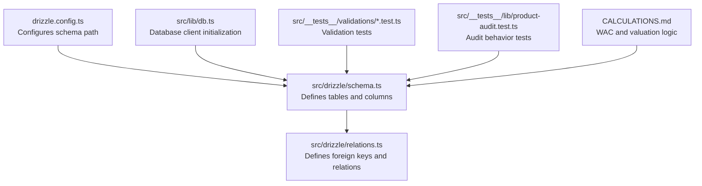
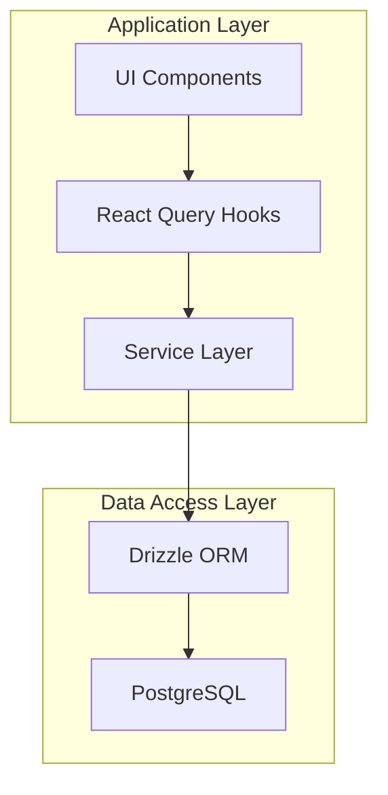
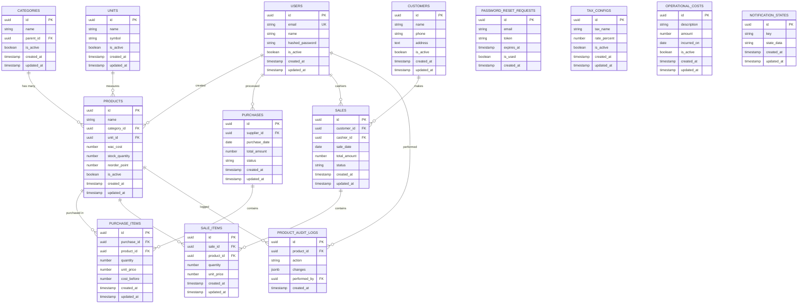
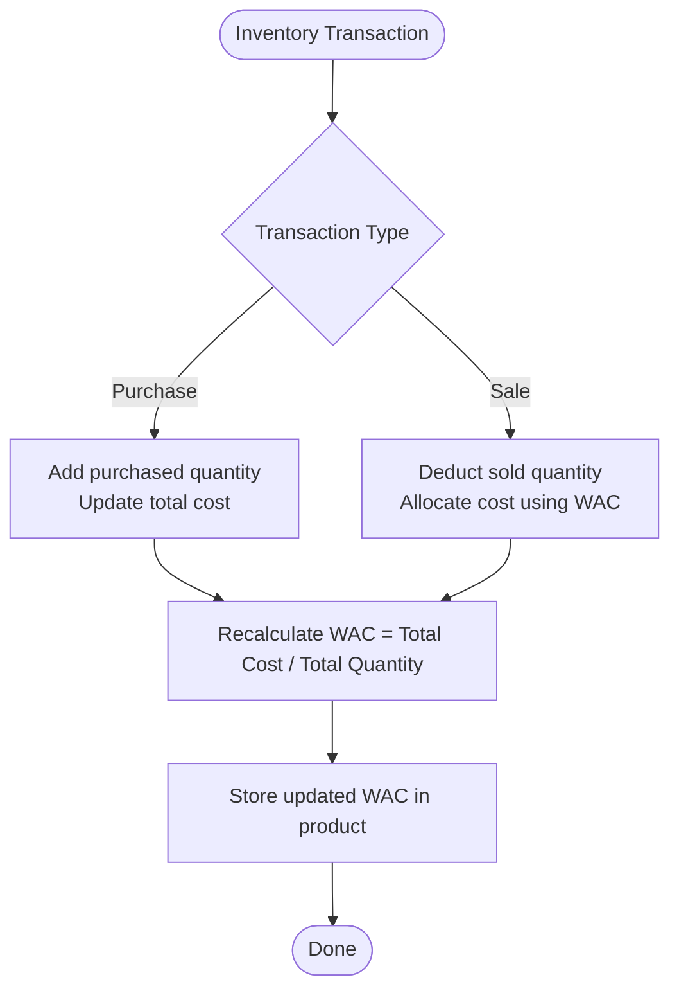
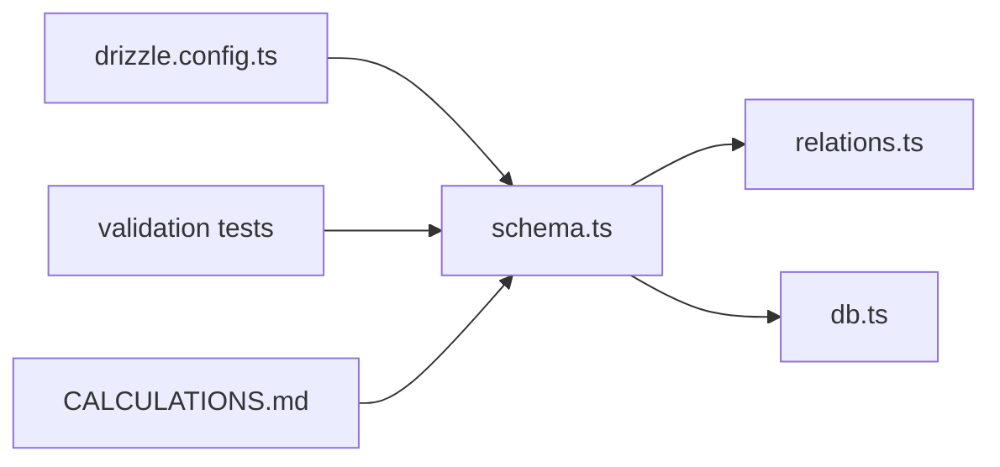

# Database Design

<cite>
**Referenced Files in This Document**
- [drizzle.config.ts](file://drizzle.config.ts)
- [schema.ts](file://src/drizzle/schema.ts)
- [relations.ts](file://src/drizzle/relations.ts)
- [db.ts](file://src/lib/db.ts)
- [CALCULATIONS.md](file://CALCULATIONS.md)
- [product-audit.test.ts](file://src/__tests__/lib/product-audit.test.ts)
- [product.test.ts](file://src/__tests__/validations/product.test.ts)
- [purchase.test.ts](file://src/__tests__/validations/purchase.test.ts)
- [sale.test.ts](file://src/__tests__/validations/sale.test.ts)
- [category.test.ts](file://src/__tests__/validations/category.test.ts)
- [unit.test.ts](file://src/__tests__/validations/unit.test.ts)
</cite>

## Table of Contents
1. [Introduction](#introduction)
2. [Project Structure](#project-structure)
3. [Core Components](#core-components)
4. [Architecture Overview](#architecture-overview)
5. [Detailed Component Analysis](#detailed-component-analysis)
6. [Dependency Analysis](#dependency-analysis)
7. [Performance Considerations](#performance-considerations)
8. [Troubleshooting Guide](#troubleshooting-guide)
9. [Conclusion](#conclusion)
10. [Appendices](#appendices)

## Introduction
This document describes the POS application database schema and related data model. It focuses on entities such as Products, Categories, Units, Purchases, Sales, Customers, Users, and supporting entities. It documents field definitions, data types, primary and foreign keys, indexes, constraints, Weighted Average Cost (WAC) computation methodology, and purchase_items structure including cost_before for undo/edit safety. It also covers validation rules, business rule enforcement, referential integrity, data access patterns, caching strategies, performance considerations, data lifecycle management, backup strategies, and migration procedures.

## Project Structure
The database schema is defined using Drizzle ORM and organized under the src/drizzle directory. The schema file defines tables and relationships, while migrations are managed via DrizzleKit. Tests validate domain-specific constraints and calculations.

**Diagram sources**
- [drizzle.config.ts:1-10](file://drizzle.config.ts#L1-L10)
- [schema.ts:1-200](file://src/drizzle/schema.ts#L1-L200)
- [relations.ts:1-100](file://src/drizzle/relations.ts#L1-L100)
- [db.ts:1-50](file://src/lib/db.ts#L1-L50)
- [CALCULATIONS.md:1-200](file://CALCULATIONS.md#L1-L200)

**Section sources**
- [drizzle.config.ts:1-10](file://drizzle.config.ts#L1-L10)
- [schema.ts:1-200](file://src/drizzle/schema.ts#L1-L200)
- [relations.ts:1-100](file://src/drizzle/relations.ts#L1-L100)
- [db.ts:1-50](file://src/lib/db.ts#L1-L50)

## Core Components
This section outlines the core entities and their roles in the POS system.

- Products: Inventory items with pricing, stock tracking, and valuation metadata.
- Categories: Hierarchical classification for products.
- Units: Measurement units for product quantities.
- Purchases: Purchase orders/invoices with line items.
- Sales: Sales transactions with line items and customer references.
- Customers: End-buyers tracked for sales and returns.
- Users: System users with roles and authentication linkage.
- Supporting entities: Audit logs, notifications, operational costs, tax configurations, and password reset requests.

Constraints and indexes are applied to enforce data integrity and optimize queries. Foreign keys maintain referential integrity across entities.

**Section sources**
- [schema.ts:1-200](file://src/drizzle/schema.ts#L1-L200)
- [relations.ts:1-100](file://src/drizzle/relations.ts#L1-L100)

## Architecture Overview
The database layer integrates with the application via Drizzle ORM. Migrations manage schema evolution, and tests validate business rules and calculations.

[No sources needed since this diagram shows conceptual workflow, not actual code structure]

## Detailed Component Analysis

### Entity Relationship Model
The following ER diagram maps major entities and their relationships as defined in the schema and relations files.

**Diagram sources**
- [schema.ts:1-200](file://src/drizzle/schema.ts#L1-L200)
- [relations.ts:1-100](file://src/drizzle/relations.ts#L1-L100)

### Product Valuation and WAC Calculation
Weighted Average Cost (WAC) is computed per product and stored as a denormalized field to simplify downstream calculations. The methodology and storage are documented in the calculations guide.

- WAC is recalculated after each purchase and sale affecting inventory.
- The product’s wac_cost reflects the average cost of goods available for sale.
- Purchase items record cost_before to preserve the unit cost at time of transaction for accurate undo/edit scenarios.

**Diagram sources**
- [CALCULATIONS.md:1-200](file://CALCULATIONS.md#L1-L200)
- [schema.ts:1-200](file://src/drizzle/schema.ts#L1-L200)

**Section sources**
- [CALCULATIONS.md:1-200](file://CALCULATIONS.md#L1-L200)
- [schema.ts:1-200](file://src/drizzle/schema.ts#L1-L200)

### Purchase Items Structure and Undo/Edit Safety
Purchase items capture per-line details and include cost_before to preserve the unit cost at the time of purchase. This enables accurate reversal or editing of purchase records without distorting historical valuation.

- Fields include identifiers, quantities, unit prices, and cost_before.
- cost_before ensures undo/edit correctness by retaining the original valuation.

**Section sources**
- [schema.ts:1-200](file://src/drizzle/schema.ts#L1-L200)

### Validation Rules and Business Constraints
Validation tests define business rules enforced at the application level. These tests reference schema constraints and calculation logic to ensure data integrity.

- Product validation tests check naming, category/unit references, reorder point, and stock quantity rules.
- Purchase validation tests ensure positive quantities, valid unit prices, and consistent totals.
- Sale validation tests verify non-negative quantities, sufficient stock, and proper customer references.
- Category and unit validation tests confirm uniqueness and active status constraints.

These rules complement database constraints to prevent invalid states.

**Section sources**
- [product.test.ts:1-100](file://src/__tests__/validations/product.test.ts#L1-L100)
- [purchase.test.ts:1-100](file://src/__tests__/validations/purchase.test.ts#L1-L100)
- [sale.test.ts:1-100](file://src/__tests__/validations/sale.test.ts#L1-L100)
- [category.test.ts:1-100](file://src/__tests__/validations/category.test.ts#L1-L100)
- [unit.test.ts:1-100](file://src/__tests__/validations/unit.test.ts#L1-L100)

### Audit Logs and Historical Tracking
Product audit logs track changes to product records, including who performed the action and what changed. This supports compliance, debugging, and reconciliation.

- Audit logs reference the product and the actor (user).
- Changes are recorded as JSONB for flexibility and queryability.

**Section sources**
- [schema.ts:1-200](file://src/drizzle/schema.ts#L1-L200)
- [product-audit.test.ts:1-100](file://src/__tests__/lib/product-audit.test.ts#L1-L100)

## Dependency Analysis
The schema depends on Drizzle ORM configuration and migration snapshots. Relations define foreign key constraints and cascading behaviors. Application services depend on the schema for data access.

**Diagram sources**
- [drizzle.config.ts:1-10](file://drizzle.config.ts#L1-L10)
- [schema.ts:1-200](file://src/drizzle/schema.ts#L1-L200)
- [relations.ts:1-100](file://src/drizzle/relations.ts#L1-L100)
- [db.ts:1-50](file://src/lib/db.ts#L1-L50)
- [CALCULATIONS.md:1-200](file://CALCULATIONS.md#L1-L200)

**Section sources**
- [drizzle.config.ts:1-10](file://drizzle.config.ts#L1-L10)
- [schema.ts:1-200](file://src/drizzle/schema.ts#L1-L200)
- [relations.ts:1-100](file://src/drizzle/relations.ts#L1-L100)
- [db.ts:1-50](file://src/lib/db.ts#L1-L50)

## Performance Considerations
- Indexes: Create indexes on frequently filtered or joined columns (e.g., product_id, purchase_id, sale_id, customer_id, supplier_id, cashier_id, category_id, unit_id).
- Partitioning: Consider partitioning large tables (e.g., sales and purchase items) by date for analytical queries.
- Materialized Views: Maintain materialized views for daily sales summaries and product stock levels to accelerate reporting.
- Caching: Cache slow-changing dimension tables (categories, units, tax configs) in Redis or application cache keyed by tenant/store.
- Batch Operations: Use batch inserts for purchase and sale items to reduce round trips.
- Connection Pooling: Configure connection pooling at the application level to handle concurrent queries efficiently.
- Query Patterns: Prefer selective projections and limit joins to essential relationships to minimize I/O.

[No sources needed since this section provides general guidance]

## Troubleshooting Guide
- Constraint Violations: Validate foreign key constraints and unique indexes before inserts/updates. Use explicit JOINs to surface missing references.
- WAC Discrepancies: Recompute WAC after bulk edits or corrections to reconcile discrepancies.
- Audit Trail Gaps: Verify audit triggers and ensure performed_by references a valid user.
- Test Coverage: Run validation tests to catch regressions in business rules.

**Section sources**
- [product.test.ts:1-100](file://src/__tests__/validations/product.test.ts#L1-L100)
- [purchase.test.ts:1-100](file://src/__tests__/validations/purchase.test.ts#L1-L100)
- [sale.test.ts:1-100](file://src/__tests__/validations/sale.test.ts#L1-L100)
- [CALCULATIONS.md:1-200](file://CALCULATIONS.md#L1-L200)

## Conclusion
The POS database schema leverages Drizzle ORM for strong typing and migrations. Entities are designed around core business flows—inventory, purchases, sales, and customers—with robust constraints and auditability. WAC is central to valuation and is preserved via cost_before in purchase items. Validation tests and constraints ensure data integrity, while performance strategies and caching support scalable operations.

[No sources needed since this section summarizes without analyzing specific files]

## Appendices

### Appendix A: Sample Data Examples
- Product: name, category_id, unit_id, wac_cost, stock_quantity, reorder_point
- Purchase: supplier_id, purchase_date, total_amount, status
- Purchase Item: purchase_id, product_id, quantity, unit_price, cost_before
- Sale: customer_id, cashier_id, sale_date, total_amount, status
- Sale Item: sale_id, product_id, quantity, unit_price
- Customer: name, phone, address
- User: email, name, hashed_password, is_active
- Tax Config: tax_name, rate_percent, is_active
- Operational Cost: description, amount, incurred_on, is_active
- Notification State: key, state_data

[No sources needed since this section provides general guidance]

### Appendix B: Migration Procedures
- Use DrizzleKit to generate and apply migrations.
- Review schema snapshots in the meta directory for rollback points.
- Back up the database before applying migrations in production.
- Test migrations on staging with a copy of production-like data.

**Section sources**
- [drizzle.config.ts:1-10](file://drizzle.config.ts#L1-L10)

### Appendix C: Backup Strategies
- Full backups: Daily full backups with point-in-time recovery enabled.
- Incremental backups: Hourly WAL archiving for granular recovery.
- Offsite storage: Encrypt and store backups offsite or in secure cloud storage.
- Test restores: Periodically test restore procedures to validate backup integrity.

[No sources needed since this section provides general guidance]