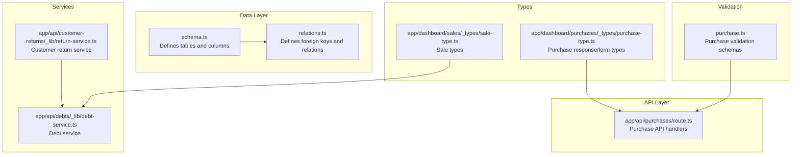
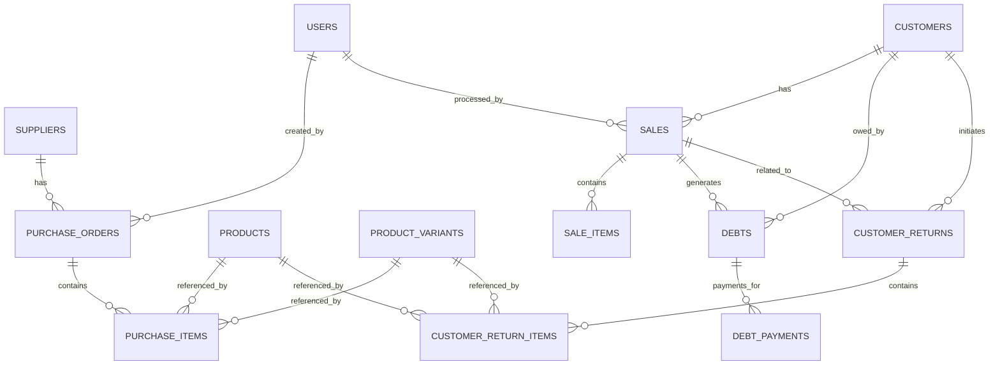
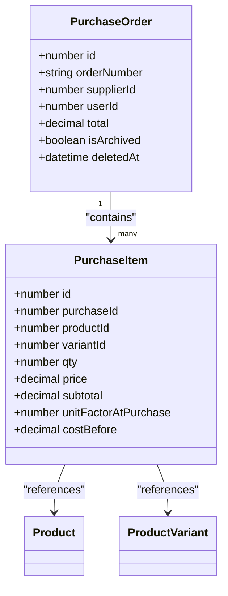
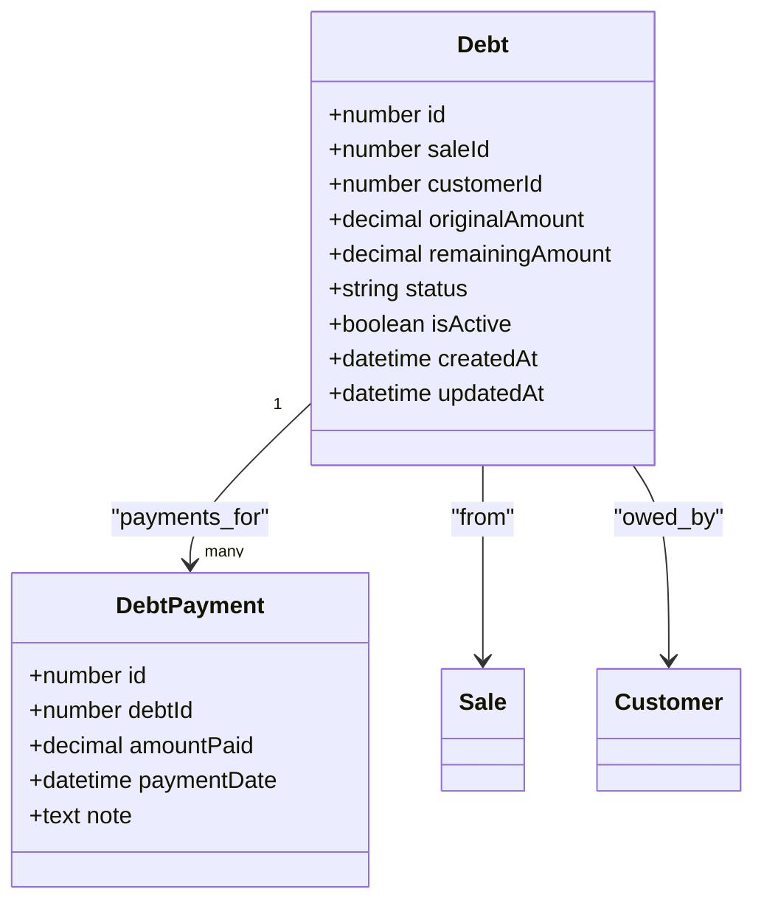
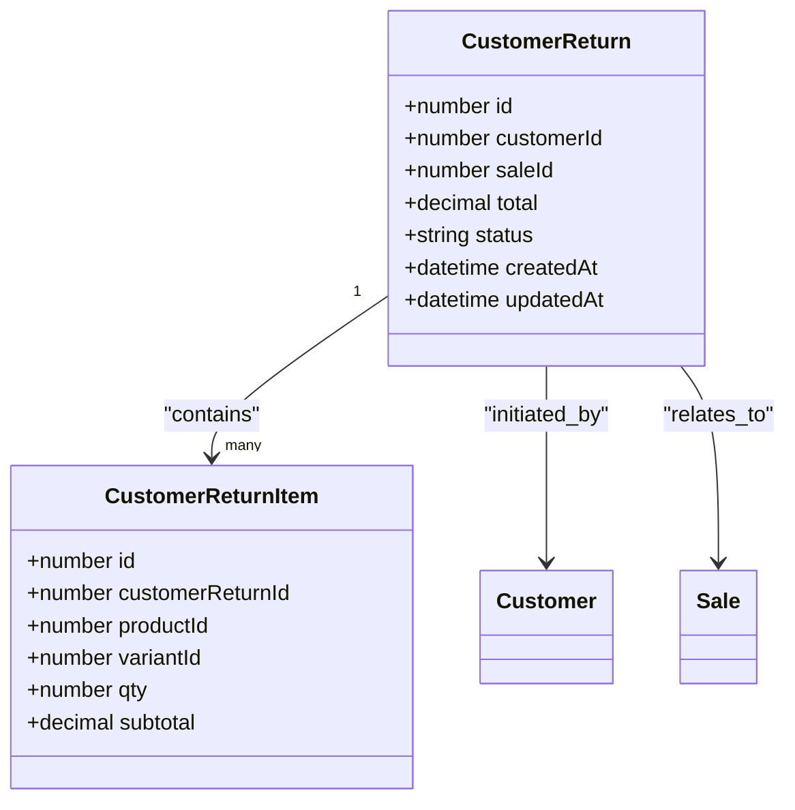
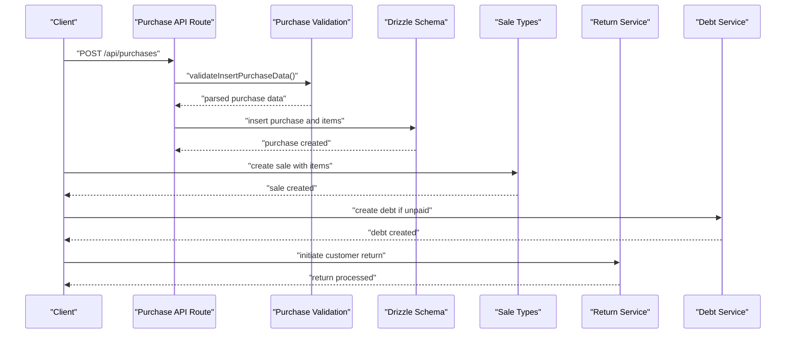
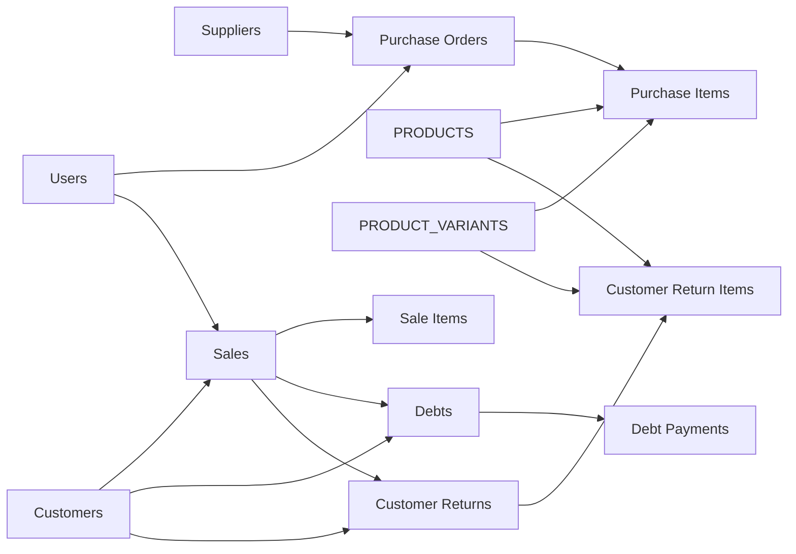

# Transaction Entities

<cite>
**Referenced Files in This Document**
- [schema.ts](file://src/drizzle/schema.ts)
- [relations.ts](file://src/drizzle/relations.ts)
- [purchase.ts](file://src/lib/validations/purchase.ts)
- [purchase-type.ts](file://src/app/dashboard/purchases/_types/purchase-type.ts)
- [route.ts](file://src/app/api/purchases/route.ts)
- [sale-type.ts](file://src/app/dashboard/sales/_types/sale-type.ts)
- [return-service.ts](file://src/app/api/customer-returns/_lib/return-service.ts)
- [debt-service.ts](file://src/app/api/debts/_lib/debt-service.ts)
- [system-flow-uml.md](file://docs/system-flow-uml.md)
- [uml-class-module-f-debt-payment.puml](file://docs/uml-class-module-f-debt-payment.puml)
</cite>

## Table of Contents
1. [Introduction](#introduction)
2. [Project Structure](#project-structure)
3. [Core Components](#core-components)
4. [Architecture Overview](#architecture-overview)
5. [Detailed Component Analysis](#detailed-component-analysis)
6. [Dependency Analysis](#dependency-analysis)
7. [Performance Considerations](#performance-considerations)
8. [Troubleshooting Guide](#troubleshooting-guide)
9. [Conclusion](#conclusion)

## Introduction
This document provides comprehensive data model documentation for transaction-related entities in the Point of Sale application. It covers the complete transaction lifecycle from purchase through sale to return, detailing header-detail relationships, cost tracking mechanisms, debt management, and customer return processes. The focus is on Purchase Orders and Purchase Items, Sales and Sale Items, Debts and Debt Payments, and Customer Returns and Customer Return Items.

## Project Structure
The transaction data model is defined in the Drizzle ORM schema and validated via server-side Zod schemas. API routes orchestrate CRUD operations, while frontend types and services support UI interactions and business logic.



**Diagram sources**
- [schema.ts](file://src/drizzle/schema.ts)
- [relations.ts](file://src/drizzle/relations.ts)
- [purchase.ts](file://src/lib/validations/purchase.ts)
- [route.ts](file://src/app/api/purchases/route.ts)
- [purchase-type.ts](file://src/app/dashboard/purchases/_types/purchase-type.ts)
- [sale-type.ts](file://src/app/dashboard/sales/_types/sale-type.ts)
- [return-service.ts](file://src/app/api/customer-returns/_lib/return-service.ts)
- [debt-service.ts](file://src/app/api/debts/_lib/debt-service.ts)

**Section sources**
- [schema.ts](file://src/drizzle/schema.ts)
- [relations.ts](file://src/drizzle/relations.ts)
- [purchase.ts](file://src/lib/validations/purchase.ts)
- [route.ts](file://src/app/api/purchases/route.ts)
- [purchase-type.ts](file://src/app/dashboard/purchases/_types/purchase-type.ts)
- [sale-type.ts](file://src/app/dashboard/sales/_types/sale-type.ts)
- [return-service.ts](file://src/app/api/customer-returns/_lib/return-service.ts)
- [debt-service.ts](file://src/app/api/debts/_lib/debt-service.ts)

## Core Components
This section documents the core transaction entities and their relationships.

- Purchase Orders (header)
  - Fields include identifiers, order metadata, totals, archival and deletion flags, and user association.
  - Relations: belongs to Supplier, belongs to User, contains many Purchase Items.
  - Validation ensures supplier and user presence and requires at least one item.

- Purchase Items (detail)
  - Fields include identifiers, purchase association, product and variant references, quantities, pricing, subtotals, unit conversion factors, and cost tracking for undo/edit scenarios.
  - Relations: many belong to one Purchase Order, references Product and Product Variant.

- Sales (header)
  - Fields include identifiers, invoice metadata, customer and user associations, totals, payment status, QRIS payment details, archival and deletion flags, and user association.
  - Relations: belongs to User, belongs to Customer, contains many Sale Items, optionally linked to Debt, contains many Customer Returns.

- Sale Items (detail)
  - Fields include identifiers, sale association, product and variant references, quantities, sale price, unit conversion factors, cost at sale for profit calculations, and subtotals.
  - Relations: many belong to one Sale, references Product and Product Variant.

- Debts
  - Fields include identifiers, sale and customer associations, original amount, remaining amount, status, activity flag, and timestamps.
  - Relations: links to one Sale and one Customer, contains many Debt Payments.

- Debt Payments
  - Fields include identifiers, debt association, paid amounts, payment dates, and optional notes.
  - Relations: many belong to one Debt.

- Customer Returns
  - Fields include identifiers, customer and sale associations, return metadata, totals, and relations to items.
  - Relations: belongs to Customer, belongs to Sale, contains many Customer Return Items.

- Customer Return Items
  - Fields include identifiers, return association, product and variant references, quantities, and subtotals.
  - Relations: many belong to one Customer Return, references Product and Product Variant.

**Section sources**
- [schema.ts](file://src/drizzle/schema.ts)
- [relations.ts](file://src/drizzle/relations.ts)
- [purchase.ts](file://src/lib/validations/purchase.ts)
- [system-flow-uml.md](file://docs/system-flow-uml.md)
- [uml-class-module-f-debt-payment.puml](file://docs/uml-class-module-f-debt-payment.puml)

## Architecture Overview
The transaction lifecycle spans three primary modules: Purchase, Sales/Debt, and Returns. The data model enforces referential integrity through relations and supports cost tracking and debt reconciliation.



**Diagram sources**
- [schema.ts](file://src/drizzle/schema.ts)
- [relations.ts](file://src/drizzle/relations.ts)
- [system-flow-uml.md](file://docs/system-flow-uml.md)

## Detailed Component Analysis

### Purchase Orders and Purchase Items
- Header-detail relationship
  - Purchase Orders are the parent entity containing aggregated totals and metadata.
  - Purchase Items represent line items with cost tracking fields for undo/edit functionality.
- Cost tracking
  - Purchase Items include a cost field designed to capture the unit cost before changes, enabling accurate adjustments and audits.
- Validation and API
  - Purchase creation validates supplier presence, user association, and requires at least one item.
  - API routes support search, pagination, and ordering for purchase records.



**Diagram sources**
- [schema.ts](file://src/drizzle/schema.ts)
- [relations.ts](file://src/drizzle/relations.ts)

**Section sources**
- [schema.ts](file://src/drizzle/schema.ts)
- [relations.ts](file://src/drizzle/relations.ts)
- [purchase.ts](file://src/lib/validations/purchase.ts)
- [route.ts](file://src/app/api/purchases/route.ts)
- [purchase-type.ts](file://src/app/dashboard/purchases/_types/purchase-type.ts)

### Sales and Sale Items
- Header-detail relationship
  - Sales capture transaction details including totals, payments, and status.
  - Sale Items record per-item pricing, quantities, and cost-at-sale for profit calculations.
- Profit calculation mechanism
  - Sale Items include a cost field at the time of sale, enabling profit computation against current selling prices.
- Debt linkage
  - Sales may generate Debts when payment is not fully settled, linking sales to debt records.

```mermaid
classDiagram
class Sale {
+number id
+string invoiceNumber
+number customerId
+number userId
+decimal totalPrice
+decimal totalPaid
+decimal totalReturn
+decimal totalBalanceUsed
+string status
+string paymentMethod
+string qrisPaymentNumber
+datetime qrisExpiredAt
+boolean isArchived
+datetime deletedAt
}
class SaleItem {
+number id
+number saleId
+number productId
+number variantId
+number qty
+decimal priceAtSale
+number unitFactorAtSale
+decimal costAtSale
+decimal subtotal
}
Sale "1" --> "many" SaleItem : "contains"
SaleItem --> Product : "references"
SaleItem --> ProductVariant : "references"
Sale ||--o| Debt : "may generate"
```

**Diagram sources**
- [schema.ts](file://src/drizzle/schema.ts)
- [relations.ts](file://src/drizzle/relations.ts)

**Section sources**
- [schema.ts](file://src/drizzle/schema.ts)
- [relations.ts](file://src/drizzle/relations.ts)
- [sale-type.ts](file://src/app/dashboard/sales/_types/sale-type.ts)

### Debts and Debt Payments
- Debt management
  - Debts track original and remaining amounts, status, and activity flags.
  - Debts are generated from Sales and link to Customers.
- Payment tracking
  - Debt Payments record individual payments against a Debt, updating the remaining balance accordingly.
- Status automation
  - Debt status reflects the outstanding balance, changing automatically as payments are applied.



**Diagram sources**
- [schema.ts](file://src/drizzle/schema.ts)
- [relations.ts](file://src/drizzle/relations.ts)
- [uml-class-module-f-debt-payment.puml](file://docs/uml-class-module-f-debt-payment.puml)

**Section sources**
- [schema.ts](file://src/drizzle/schema.ts)
- [relations.ts](file://src/drizzle/relations.ts)
- [debt-service.ts](file://src/app/api/debts/_lib/debt-service.ts)
- [system-flow-uml.md](file://docs/system-flow-uml.md)

### Customer Returns and Return Items
- Return process
  - Customer Returns link to Sales and Customers, capturing return metadata and totals.
  - Customer Return Items detail returned products, quantities, and subtotals.
- Compensation and exchange
  - The return service coordinates compensation types and exchange mechanisms, aligning with return items and inventory adjustments.



**Diagram sources**
- [schema.ts](file://src/drizzle/schema.ts)
- [relations.ts](file://src/drizzle/relations.ts)
- [return-service.ts](file://src/app/api/customer-returns/_lib/return-service.ts)

**Section sources**
- [schema.ts](file://src/drizzle/schema.ts)
- [relations.ts](file://src/drizzle/relations.ts)
- [return-service.ts](file://src/app/api/customer-returns/_lib/return-service.ts)

### Transaction Lifecycle Sequence
The end-to-end lifecycle from purchase to sale to return is orchestrated through API routes and services.



**Diagram sources**
- [route.ts](file://src/app/api/purchases/route.ts)
- [purchase.ts](file://src/lib/validations/purchase.ts)
- [schema.ts](file://src/drizzle/schema.ts)
- [sale-type.ts](file://src/app/dashboard/sales/_types/sale-type.ts)
- [return-service.ts](file://src/app/api/customer-returns/_lib/return-service.ts)
- [debt-service.ts](file://src/app/api/debts/_lib/debt-service.ts)

## Dependency Analysis
The transaction entities exhibit clear dependency chains enforced by relations and validated by schemas.



**Diagram sources**
- [relations.ts](file://src/drizzle/relations.ts)
- [schema.ts](file://src/drizzle/schema.ts)

**Section sources**
- [relations.ts](file://src/drizzle/relations.ts)
- [schema.ts](file://src/drizzle/schema.ts)

## Performance Considerations
- Indexing and queries
  - Use indexed fields for search and filtering on order numbers, invoice numbers, and timestamps.
  - Pagination and ordering reduce payload sizes for list views.
- Cost tracking
  - Store cost fields at both purchase and sale stages to avoid expensive joins for historical pricing.
- Debt updates
  - Batch payment updates and maintain denormalized remaining amounts to minimize recalculations.

## Troubleshooting Guide
- Purchase validation errors
  - Ensure supplier and user IDs are present and items array is not empty.
  - Verify quantities and prices meet minimum constraints.
- Debt reconciliation issues
  - Confirm that total payments equal or do not exceed the original amount.
  - Check status transitions when remaining amount reaches zero.
- Return processing
  - Validate return item quantities do not exceed sold quantities.
  - Align compensation types with business rules and inventory adjustments.

**Section sources**
- [purchase.ts](file://src/lib/validations/purchase.ts)
- [debt-service.ts](file://src/app/api/debts/_lib/debt-service.ts)
- [return-service.ts](file://src/app/api/customer-returns/_lib/return-service.ts)

## Conclusion
The transaction data model establishes robust header-detail relationships across purchases, sales, debts, and returns. Cost tracking fields enable accurate undo/edit capabilities and profit calculations, while debt management ensures transparent payment tracking. The customer return process integrates compensation and exchange mechanisms, completing the full transaction lifecycle from procurement to customer satisfaction.