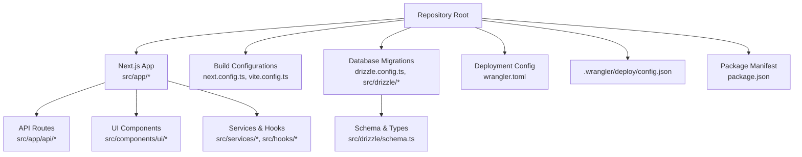
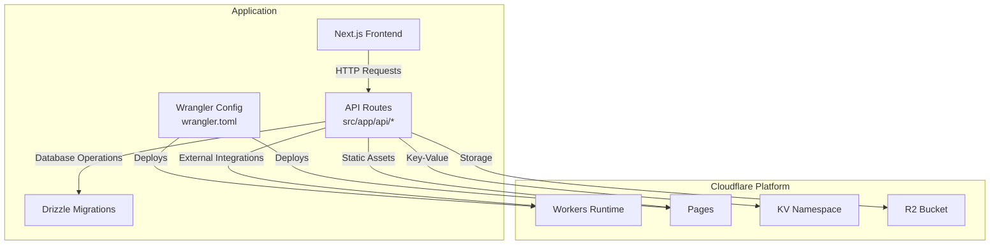
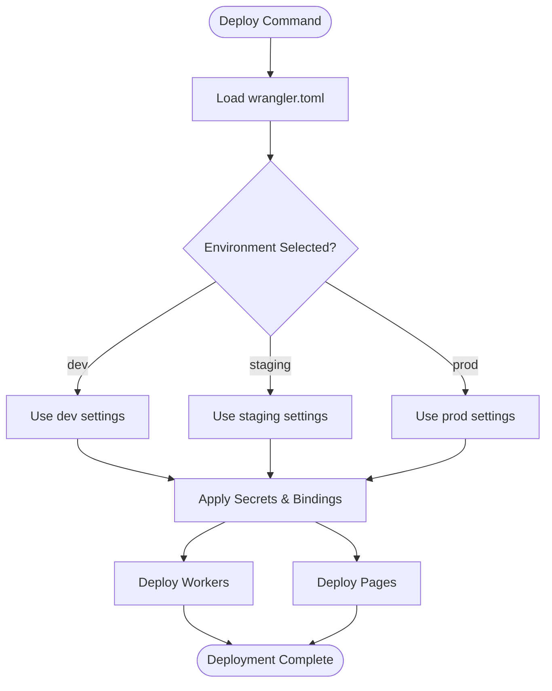
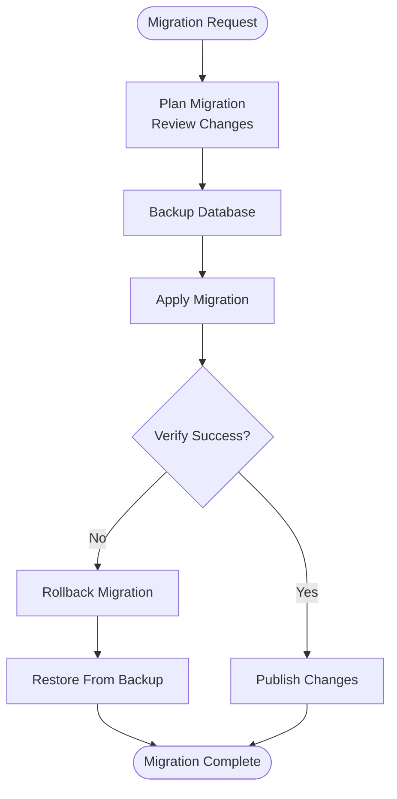
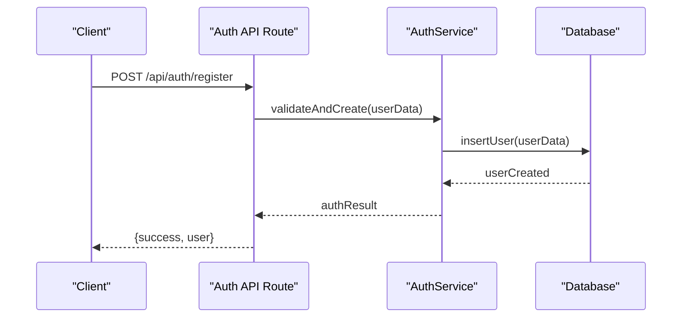
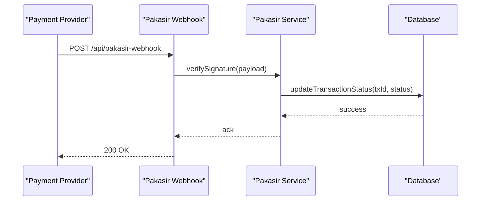
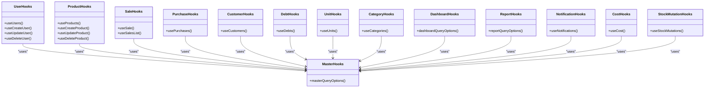
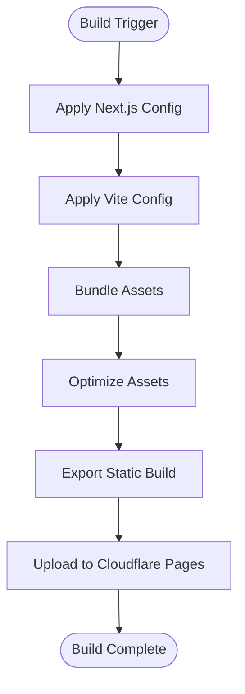
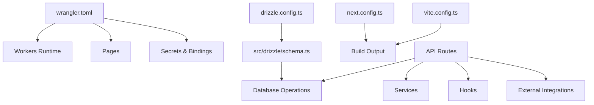

# Deployment & DevOps

<cite>
**Referenced Files in This Document**
- [README.md](file://README.md)
- [wrangler.toml](file://wrangler.toml)
- [.wrangler/deploy/config.json](file://.wrangler/deploy/config.json)
- [drizzle.config.ts](file://drizzle.config.ts)
- [src/drizzle/schema.ts](file://src/drizzle/schema.ts)
- [src/lib/db.ts](file://src/lib/db.ts)
- [next.config.ts](file://next.config.ts)
- [vite.config.ts](file://vite.config.ts)
- [package.json](file://package.json)
- [src/app/api/auth/register/route.ts](file://src/app/api/auth/register/route.ts)
- [src/services/authService.ts](file://src/services/authService.ts)
- [src/lib/auth.ts](file://src/lib/auth.ts)
- [src/lib/pakasir.ts](file://src/lib/pakasir.ts)
- [src/app/api/pakasir-webhook/route.ts](file://src/app/api/pakasir-webhook/route.ts)
- [src/app/api/password-reset-requests/[id]/resolve/route.ts](file://src/app/api/password-reset-requests/[id]/resolve/route.ts)
- [src/services/passwordResetService.ts](file://src/services/passwordResetService.ts)
- [src/hooks/users/use-create-user.ts](file://src/hooks/users/use-create-user.ts)
- [src/hooks/users/use-update-user.ts](file://src/hooks/users/use-update-user.ts)
- [src/hooks/users/use-delete-user.ts](file://src/hooks/users/use-delete-user.ts)
- [src/hooks/users/use-users.ts](file://src/hooks/users/use-users.ts)
- [src/hooks/users/user-query-options.ts](file://src/hooks/users/user-query-options.ts)
- [src/hooks/products/use-create-product.ts](file://src/hooks/products/use-create-product.ts)
- [src/hooks/products/use-update-product.ts](file://src/hooks/products/use-update-product.ts)
- [src/hooks/products/use-delete-product.ts](file://src/hooks/products/use-delete-product.ts)
- [src/hooks/products/use-products.ts](file://src/hooks/products/use-products.ts)
- [src/hooks/products/product-query-options.ts](file://src/hooks/products/product-query-options.ts)
- [src/hooks/sales/use-sale.ts](file://src/hooks/sales/use-sale.ts)
- [src/hooks/sales/sale-query-options.ts](file://src/hooks/sales/sale-query-options.ts)
- [src/hooks/purchases/use-purchases.ts](file://src/hooks/purchases/use-purchases.ts)
- [src/hooks/purchases/purchase-query-options.ts](file://src/hooks/purchases/purchase-query-options.ts)
- [src/hooks/customers/use-customers.ts](file://src/hooks/customers/use-customers.ts)
- [src/hooks/customers/customer-query-options.ts](file://src/hooks/customers/customer-query-options.ts)
- [src/hooks/debt/use-debts.ts](file://src/hooks/debt/use-debts.ts)
- [src/hooks/debt/debt-query-options.ts](file://src/hooks/debt/debt-query-options.ts)
- [src/hooks/units/use-units.ts](file://src/hooks/units/use-units.ts)
- [src/hooks/units/unit-query-options.ts](file://src/hooks/units/unit-query-options.ts)
- [src/hooks/categories/use-categories.ts](file://src/hooks/categories/use-categories.ts)
- [src/hooks/categories/category-query-options.ts](file://src/hooks/categories/category-query-options.ts)
- [src/hooks/master/master-query-options.ts](file://src/hooks/master/master-query-options.ts)
- [src/hooks/dashboard/dashboard-query-options.ts](file://src/hooks/dashboard/dashboard-query-options.ts)
- [src/hooks/report/report-query-options.ts](file://src/hooks/report/report-query-options.ts)
- [src/hooks/notifications/use-notifications.ts](file://src/hooks/notifications/use-notifications.ts)
- [src/hooks/cost/use-cost.ts](file://src/hooks/cost/use-cost.ts)
- [src/hooks/stock-mutations/use-stock-mutations.ts](file://src/hooks/stock-mutations/use-stock-mutations.ts)
- [src/hooks/master-data.ts](file://src/hooks/master-data.ts)
- [src/hooks/use-auth.ts](file://src/hooks/use-auth.ts)
- [src/hooks/use-query-state.ts](file://src/hooks/use-query-state.ts)
- [src/hooks/use-debounce.ts](file://src/hooks/use-debounce.ts)
- [src/hooks/use-mobile.ts](file://src/hooks/use-mobile.ts)
- [src/hooks/use-product-search.ts](file://src/hooks/use-product-search.ts)
- [src/hooks/use-tabs-overflow.ts](file://src/hooks/use-tabs-overflow.ts)
- [src/hooks/use-upload-image.ts](file://src/hooks/use-upload-image.ts)
- [src/components/ui/button.tsx](file://src/components/ui/button.tsx)
- [src/components/ui/input.tsx](file://src/components/ui/input.tsx)
- [src/components/ui/form.tsx](file://src/components/ui/form.tsx)
- [src/components/ui/table.tsx](file://src/components/ui/table.tsx)
- [src/components/ui/dialog.tsx](file://src/components/ui/dialog.tsx)
- [src/components/ui/select.tsx](file://src/components/ui/select.tsx)
- [src/components/ui/alert.tsx](file://src/components/ui/alert.tsx)
- [src/components/ui/card.tsx](file://src/components/ui/card.tsx)
- [src/components/ui/badge.tsx](file://src/components/ui/badge.tsx)
- [src/components/ui/avatar.tsx](file://src/components/ui/avatar.tsx)
- [src/components/ui/tabs.tsx](file://src/components/ui/tabs.tsx)
- [src/components/ui/tooltip.tsx](file://src/components/ui/tooltip.tsx)
- [src/components/ui/dropdown-menu.tsx](file://src/components/ui/dropdown-menu.tsx)
- [src/components/ui/navigation-bar.tsx](file://src/components/ui/navigation-bar.tsx)
- [src/components/ui/sidebar.tsx](file://src/components/ui/sidebar.tsx)
- [src/components/ui/top-navbar.tsx](file://src/components/ui/top-navbar.tsx)
- [src/components/ui/bottom-navbar.tsx](file://src/components/ui/bottom-navbar.tsx)
- [src/components/ui/loading.tsx](file://src/components/ui/loading.tsx)
- [src/components/ui/error-indicator.tsx](file://src/components/ui/error-indicator.tsx)
- [src/components/ui/view-mode-switch.tsx](file://src/components/ui/view-mode-switch.tsx)
- [src/components/ui/search-input.tsx](file://src/components/ui/search-input.tsx)
- [src/components/ui/pagination.tsx](file://src/components/ui/pagination.tsx)
- [src/components/ui/switch.tsx](file://src/components/ui/switch.tsx)
- [src/components/ui/checkbox.tsx](file://src/components/ui/checkbox.tsx)
- [src/components/ui/radio-group.tsx](file://src/components/ui/radio-group.tsx)
- [src/components/ui/text-field.tsx](file://src/components/ui/text-field.tsx)
- [src/components/ui/textarea.tsx](file://src/components/ui/textarea.tsx)
- [src/components/ui/command.tsx](file://src/components/ui/command.tsx)
- [src/components/ui/scroll-area.tsx](file://src/components/ui/scroll-area.tsx)
- [src/components/ui/separator.tsx](file://src/components/ui/separator.tsx)
- [src/components/ui/sonner.tsx](file://src/components/ui/sonner.tsx)
- [src/components/ui/accordion.tsx](file://src/components/ui/accordion.tsx)
- [src/components/ui/collapsible.tsx](file://src/components/ui/collapsible.tsx)
- [src/components/ui/drawer.tsx](file://src/components/ui/drawer.tsx)
- [src/components/ui/sheet.tsx](file://src/components/ui/sheet.tsx)
- [src/components/ui/toggle.tsx](file://src/components/ui/toggle.tsx)
- [src/components/ui/toggle-group.tsx](file://src/components/ui/toggle-group.tsx)
- [src/components/ui/category-select.tsx](file://src/components/ui/category-select.tsx)
- [src/components/ui/customer-select.tsx](file://src/components/ui/customer-select.tsx)
- [src/components/ui/unit-select.tsx](file://src/components/ui/unit-select.tsx)
- [src/components/ui/supplier-select.tsx](file://src/components/ui/supplier-select.tsx)
- [src/components/ui/currency-input.tsx](file://src/components/ui/currency-input.tsx)
- [src/components/ui/numeric-input.tsx](file://src/components/ui/numeric-input.tsx)
- [src/components/ui/chart.tsx](file://src/components/ui/chart.tsx)
- [src/components/ui/animated-number.tsx](file://src/components/ui/animated-number.tsx)
- [src/components/ui/expandable-container.tsx](file://src/components/ui/expandable-container.tsx)
- [src/components/ui/sticky-card-wrapper.tsx](file://src/components/ui/sticky-card-wrapper.tsx)
- [src/components/ui/search-product-dropdown.tsx](file://src/components/ui/search-product-dropdown.tsx)
- [src/components/ui/print-table.tsx](file://src/components/ui/print-table.tsx)
- [src/components/ui/print-daily-chart.tsx](file://src/components/ui/print-daily-chart.tsx)
- [src/components/ui/data-table.tsx](file://src/components/ui/data-table.tsx)
- [src/components/ui/filter-wrap.tsx](file://src/components/ui/filter-wrap.tsx)
- [src/components/ui/nav-documents.tsx](file://src/components/ui/nav-documents.tsx)
- [src/components/ui/nav-main.tsx](file://src/components/ui/nav-main.tsx)
- [src/components/ui/nav-secondary.tsx](file://src/components/ui/nav-secondary.tsx)
- [src/components/ui/nav-user.tsx](file://src/components/ui/nav-user.tsx)
- [src/components/ui/notification-panel.tsx](file://src/components/ui/notification-panel.tsx)
- [src/components/ui/qris-payment-modal.tsx](file://src/components/ui/qris-payment-modal.tsx)
- [src/components/ui/barcode-scanner-camera.tsx](file://src/components/ui/barcode-scanner-camera.tsx)
- [src/components/ui/compress-image.tsx](file://src/components/ui/compress-image.tsx)
- [src/components/ui/theme-toggle.tsx](file://src/components/ui/theme-toggle.tsx)
- [src/components/ui/role-guard.tsx](file://src/components/ui/role-guard.tsx)
- [src/components/ui/section-cards.tsx](file://src/components/ui/section-cards.tsx)
- [src/components/ui/access-denied.tsx](file://src/components/ui/access-denied.tsx)
- [src/components/ui/app-layout.tsx](file://src/components/ui/app-layout.tsx)
- [src/components/ui/app-pagination.tsx](file://src/components/ui/app-pagination.tsx)
- [src/components/ui/app-sidebar.tsx](file://src/components/ui/app-sidebar.tsx)
- [src/components/ui/chart-area-interactive.tsx](file://src/components/ui/chart-area-interactive.tsx)
- [src/components/ui/print-receipt.tsx](file://src/components/ui/print-receipt.tsx)
- [src/components/ui/return-success-modal.tsx](file://src/components/ui/return-success-modal.tsx)
- [src/components/ui/sale-success-modal.tsx](file://src/components/ui/sale-success-modal.tsx)
- [src/components/ui/debt-payment-dialog.tsx](file://src/components/ui/debt-payment-dialog.tsx)
- [src/components/ui/exchange-item-picker.tsx](file://src/components/ui/exchange-item-picker.tsx)
- [src/components/ui/return-item-selector.tsx](file://src/components/ui/return-item-selector.tsx)
- [src/components/ui/transaction-cart-items.tsx](file://src/components/ui/transaction-cart-items.tsx)
- [src/components/ui/return-receipt.tsx](file://src/components/ui/return-receipt.tsx)
- [src/components/ui/sale-receipt.tsx](file://src/components/ui/sale-receipt.tsx)
- [src/components/ui/stock-warning-modal.tsx](file://src/components/ui/stock-warning-modal.tsx)
- [src/components/ui/debt-filter-form.tsx](file://src/components/ui/debt-filter-form.tsx)
- [src/components/ui/return-filter-form.tsx](file://src/components/ui/return-filter-form.tsx)
- [src/components/ui/sales-filter-form.tsx](file://src/components/ui/sales-filter-form.tsx)
- [src/components/ui/purchase-filter-form.tsx](file://src/components/ui/purchase-filter-form.tsx)
- [src/components/ui/supplier-filter-form.tsx](file://src/components/ui/supplier-filter-form.tsx)
- [src/components/ui/audit-log-filter-form.tsx](file://src/components/ui/audit-log-filter-form.tsx)
- [src/components/ui/mutation-filter-form.tsx](file://src/components/ui/mutation-filter-form.tsx)
- [src/components/ui/product-filter-form.tsx](file://src/components/ui/product-filter-form.tsx)
- [src/components/ui/operational-cost-filter-form.tsx](file://src/components/ui/operational-cost-filter-form.tsx)
- [src/components/ui/tax-config-filter-form.tsx](file://src/components/ui/tax-config-filter-form.tsx)
- [src/components/ui/operational-costs-section.tsx](file://src/components/ui/operational-costs-section.tsx)
- [src/components/ui/tax-configs-section.tsx](file://src/components/ui/tax-configs-section.tsx)
- [src/components/ui/operational-cost-form.tsx](file://src/components/ui/operational-cost-form.tsx)
- [src/components/ui/tax-config-form.tsx](file://src/components/ui/tax-config-form.tsx)
- [src/components/ui/operational-cost-list-section.tsx](file://src/components/ui/operational-cost-list-section.tsx)
- [src/components/ui/tax-config-list-section.tsx](file://src/components/ui/tax-config-list-section.tsx)
- [src/components/ui/operational-cost-state.tsx](file://src/components/ui/operational-cost-state.tsx)
- [src/components/ui/tax-config-state.tsx](file://src/components/ui/tax-config-state.tsx)
- [src/components/ui/operational-cost-actions.tsx](file://src/components/ui/operational-cost-actions.tsx)
- [src/components/ui/tax-config-actions.tsx](file://src/components/ui/tax-config-actions.tsx)
- [src/components/ui/operational-cost-details.tsx](file://src/components/ui/operational-cost-details.tsx)
- [src/components/ui/tax-config-details.tsx](file://src/components/ui/tax-config-details.tsx)
- [src/components/ui/operational-cost-editor.tsx](file://src/components/ui/operational-cost-editor.tsx)
- [src/components/ui/tax-config-editor.tsx](file://src/components/ui/tax-config-editor.tsx)
- [src/components/ui/operational-cost-remover.tsx](file://src/components/ui/operational-cost-remover.tsx)
- [src/components/ui/tax-config-remover.tsx](file://src/components/ui/tax-config-remover.tsx)
- [src/components/ui/operational-cost-creator.tsx](file://src/components/ui/operational-cost-creator.tsx)
- [src/components/ui/tax-config-creator.tsx](file://src/components/ui/tax-config-creator.tsx)
- [src/components/ui/operational-cost-viewer.tsx](file://src/components/ui/operational-cost-viewer.tsx)
- [src/components/ui/tax-config-viewer.tsx](file://src/components/ui/tax-config-viewer.tsx)
- [src/components/ui/operational-cost-selector.tsx](file://src/components/ui/operational-cost-selector.tsx)
- [src/components/ui/tax-config-selector.tsx](file://src/components/ui/tax-config-selector.tsx)
- [src/components/ui/operational-cost-comparator.tsx](file://src/components/ui/operational-cost-comparator.tsx)
- [src/components/ui/tax-config-comparator.tsx](file://src/components/ui/tax-config-comparator.tsx)
- [src/components/ui/operational-cost-analyzer.tsx](file://src/components/ui/operational-cost-analyzer.tsx)
- [src/components/ui/tax-config-analyzer.tsx](file://src/components/ui/tax-config-analyzer.tsx)
- [src/components/ui/operational-cost-reporter.tsx](file://src/components/ui/operational-cost-reporter.tsx)
- [src/components/ui/tax-config-reporter.tsx](file://src/components/ui/tax-config-reporter.tsx)
- [src/components/ui/operational-cost-exporter.tsx](file://src/components/ui/operational-cost-exporter.tsx)
- [src/components/ui/tax-config-exporter.tsx](file://src/components/ui/tax-config-exporter.tsx)
- [src/components/ui/operational-cost-importer.tsx](file://src/components/ui/operational-cost-importer.tsx)
- [src/components/ui/tax-config-importer.tsx](file://src/components/ui/tax-config-importer.tsx)
- [src/components/ui/operational-cost-validator.tsx](file://src/components/ui/operational-cost-validator.tsx)
- [src/components/ui/tax-config-validator.tsx](file://src/components/ui/tax-config-validator.tsx)
- [src/components/ui/operational-cost-transformer.tsx](file://src/components/ui/operational-cost-transformer.tsx)
- [src/components/ui/tax-config-transformer.tsx](file://src/components/ui/tax-config-transformer.tsx)
- [src/components/ui/operational-cost-normalizer.tsx](file://src/components/ui/operational-cost-normalizer.tsx)
- [src/components/ui/tax-config-normalizer.tsx](file://src/components/ui/tax-config-normalizer.tsx)
- [src/components/ui/operational-cost-aggregator.tsx](file://src/components/ui/operational-cost-aggregator.tsx)
- [src/components/ui/tax-config-aggregator.tsx](file://src/components/ui/tax-config-aggregator.tsx)
- [src/components/ui/operational-cost-calculator.tsx](file://src/components/ui/operational-cost-calculator.tsx)
- [src/components/ui/tax-config-calculator.tsx](file://src/components/ui/tax-config-calculator.tsx)
- [src/components/ui/operational-cost-predictor.tsx](file://src/components/ui/operational-cost-predictor.tsx)
- [src/components/ui/tax-config-predictor.tsx](file://src/components/ui/tax-config-predictor.tsx)
- [src/components/ui/operational-cost-optimizer.tsx](file://src/components/ui/operational-cost-optimizer.tsx)
- [src/components/ui/tax-config-optimizer.tsx](file://src/components/ui/tax-config-optimizer.tsx)
- [src/components/ui/operational-cost-controller.tsx](file://src/components/ui/operational-cost-controller.tsx)
- [src/components/ui/tax-config-controller.tsx](file://src/components/ui/tax-config-controller.tsx)
- [src/components/ui/operational-cost-monitor.tsx](file://src/components/ui/operational-cost-monitor.tsx)
- [src/components/ui/tax-config-monitor.tsx](file://src/components/ui/tax-config-monitor.tsx)
- [src/components/ui/operational-cost-tracker.tsx](file://src/components/ui/operational-cost-tracker.tsx)
- [src/components/ui/tax-config-tracker.tsx](file://src/components/ui/tax-config-tracker.tsx)
- [src/components/ui/operational-cost-alert.tsx](file://src/components/ui/operational-cost-alert.tsx)
- [src/components/ui/tax-config-alert.tsx](file://src/components/ui/tax-config-alert.tsx)
- [src/components/ui/operational-cost-notification.tsx](file://src/components/ui/operational-cost-notification.tsx)
- [src/components/ui/tax-config-notification.tsx](file://src/components/ui/tax-config-notification.tsx)
- [src/components/ui/operational-cost-reminder.tsx](file://src/components/ui/operational-cost-reminder.tsx)
- [src/components/ui/tax-config-reminder.tsx](file://src/components/ui/tax-config-reminder.tsx)
- [src/components/ui/operational-cost-scheduler.tsx](file://src/components/ui/operational-cost-scheduler.tsx)
- [src/components/ui/tax-config-scheduler.tsx](file://src/components/ui/tax-config-scheduler.tsx)
- [src/components/ui/operational-cost-planner.tsx](file://src/components/ui/operational-cost-planner.tsx)
- [src/components/ui/tax-config-planner.tsx](file://src/components/ui/tax-config-planner.tsx)
- [src/components/ui/operational-cost-coordinator.tsx](file://src/components/ui/operational-cost-coordinator.tsx)
- [src/components/ui/tax-config-coordinator.tsx](file://src/components/ui/tax-config-coordinator.tsx)
- [src/components/ui/operational-cost-orchestrator.tsx](file://src/components/ui/operational-cost-orchestrator.tsx)
- [src/components/ui/tax-config-orchestrator.tsx](file://src/components/ui/tax-config-orchestrator.tsx)
- [src/components/ui/operational-cost-integrator.tsx](file://src/components/ui/operational-cost-integrator.tsx)
- [src/components/ui/tax-config-integrator.tsx](file://src/components/ui/tax-config-integrator.tsx)
- [src/components/ui/operational-cost-connector.tsx](file://src/components/ui/operational-cost-connector.tsx)
- [src/components/ui/tax-config-connector.tsx](file://src/components/ui/tax-config-connector.tsx)
- [src/components/ui/operational-cost-interceptor.tsx](file://src/components/ui/operational-cost-interceptor.tsx)
- [src/components/ui/tax-config-interceptor.tsx](file://src/components/ui/tax-config-interceptor.tsx)
- [src/components/ui/operational-cost-filter.tsx](file://src/components/ui/operational-cost-filter.tsx)
- [src/components/ui/tax-config-filter.tsx](file://src/components/ui/tax-config-filter.tsx)
- [src/components/ui/operational-cost-sorter.tsx](file://src/components/ui/operational-cost-sorter.tsx)
- [src/components/ui/tax-config-sorter.tsx](file://src/components/ui/tax-config-sorter.tsx)
- [src/components/ui/operational-cost-searcher.tsx](file://src/components/ui/operational-cost-searcher.tsx)
- [src/components/ui/tax-config-searcher.tsx](file://src/components/ui/tax-config-searcher.tsx)
- [src/components/ui/operational-cost-comparer.tsx](file://src/components/ui/operational-cost-comparer.tsx)
- [src/components/ui/tax-config-comparer.tsx](file://src/components/ui/tax-config-comparer.tsx)
- [src/components/ui/operational-cost-merger.tsx](file://src/components/ui/operational-cost-merger.tsx)
- [src/components/ui/tax-config-merger.tsx](file://src/components/ui/tax-config-merger.tsx)
- [src/components/ui/operational-cost-splitter.tsx](file://src/components/ui/operational-cost-splitter.tsx)
- [src/components/ui/tax-config-splitter.tsx](file://src/components/ui/tax-config-splitter.tsx)
- [src/components/ui/operational-cost-duplicator.tsx](file://src/components/ui/operational-cost-duplicator.tsx)
- [src/components/ui/tax-config-duplicator.tsx](file://src/components/ui/tax-config-duplicator.tsx)
- [src/components/ui/operational-cost-cloner.tsx](file://src/components/ui/operational-cost-cloner.tsx)
- [src/components/ui/tax-config-cloner.tsx](file://src/components/ui/tax-config-cloner.tsx)
- [src/components/ui/operational-cost-mapper.tsx](file://src/components/ui/operational-cost-mapper.tsx)
- [src/components/ui/tax-config-mapper.tsx](file://src/components/ui/tax-config-mapper.tsx)
- [src/components/ui/operational-cost-serializer.tsx](file://src/components/ui/operational-cost-serializer.tsx)
- [src/components/ui/tax-config-serializer.tsx](file://src/components/ui/tax-config-serializer.tsx)
- [src/components/ui/operational-cost-deserializer.tsx](file://src/components/ui/operational-cost-deserializer.tsx)
- [src/components/ui/tax-config-deserializer.tsx](file://src/components/ui/tax-config-deserializer.tsx)
- [src/components/ui/operational-cost-encoder.tsx](file://src/components/ui/operational-cost-encoder.tsx)
- [src/components/ui/tax-config-encoder.tsx](file://src/components/ui/tax-config-encoder.tsx)
- [src/components/ui/operational-cost-decoder.tsx](file://src/components/ui/operational-cost-decoder.tsx)
- [src/components/ui/tax-config-decoder.tsx](file://src/components/ui/tax-config-decoder.tsx)
- [src/components/ui/operational-cost-parser.tsx](file://src/components/ui/operational-cost-parser.tsx)
- [src/components/ui/tax-config-parser.tsx](file://src/components/ui/tax-config-parser.tsx)
- [src/components/ui/operational-cost-builder.tsx](file://src/components/ui/operational-cost-builder.tsx)
- [src/components/ui/tax-config-builder.tsx](file://src/components/ui/tax-config-builder.tsx)
- [src/components/ui/operational-cost-generator.tsx](file://src/components/ui/operational-cost-generator.tsx)
- [src/components/ui/tax-config-generator.tsx](file://src/components/ui/tax-config-generator.tsx)
- [src/components/ui/operational-cost-extractor.tsx](file://src/components/ui/operational-cost-extractor.tsx)
- [src/components/ui/tax-config-extractor.tsx](file://src/components/ui/tax-config-extractor.tsx)
- [src/components/ui/operational-cost-inspector.tsx](file://src/components/ui/operational-cost-inspector.tsx)
- [src/components/ui/tax-config-inspector.tsx](file://src/components/ui/tax-config-inspector.tsx)
- [src/components/ui/operational-cost-analyzer.tsx](file://src/components/ui/operational-cost-analyzer.tsx)
- [src/components/ui/tax-config-analyzer.tsx](file://src/components/ui/tax-config-analyzer.tsx)
- [src/components/ui/operational-cost-evaluator.tsx](file://src/components/ui/operational-cost-evaluator.tsx)
- [src/components/ui/tax-config-evaluator.tsx](file://src/components/ui/tax-config-evaluator.tsx)
- [src/components/ui/operational-cost-checker.tsx](file://src/components/ui/operational-cost-checker.tsx)
- [src/components/ui/tax-config-checker.tsx](file://src/components/ui/tax-config-checker.tsx)
- [src/components/ui/operational-cost-verifier.tsx](file://src/components/ui/operational-cost-verifier.tsx)
- [src/components/ui/tax-config-verifier.tsx](file://src/components/ui/tax-config-verifier.tsx)
- [src/components/ui/operational-cost-approver.tsx](file://src/components/ui/operational-cost-approver.tsx)
- [src/components/ui/tax-config-approver.tsx](file://src/components/ui/tax-config-approver.tsx)
- [src/components/ui/operational-cost-rejecter.tsx](file://src/components/ui/operational-cost-rejecter.tsx)
- [src/components/ui/tax-config-rejecter.tsx](file://src/components/ui/tax-config-rejecter.tsx)
- [src/components/ui/operational-cost-authorizer.tsx](file://src/components/ui/operational-cost-authorizer.tsx)
- [src/components/ui/tax-config-authorizer.tsx](file://src/components/ui/tax-config-authorizer.tsx)
- [src/components/ui/operational-cost-processor.tsx](file://src/components/ui/operational-cost-processor.tsx)
- [src/components/ui/tax-config-processor.tsx](file://src/components/ui/tax-config-processor.tsx)
- [src/components/ui/operational-cost-executor.tsx](file://src/components/ui/operational-cost-executor.tsx)
- [src/components/ui/tax-config-executor.tsx](file://src/components/ui/tax-config-executor.tsx)
- [src/components/ui/operational-cost-runner.tsx](file://src/components/ui/operational-cost-runner.tsx)
- [src/components/ui/tax-config-runner.tsx](file://src/components/ui/tax-config-runner.tsx)
- [src/components/ui/operational-cost-startup.tsx](file://src/components/ui/operational-cost-startup.tsx)
- [src/components/ui/tax-config-startup.tsx](file://src/components/ui/tax-config-startup.tsx)
- [src/components/ui/operational-cost-shutdown.tsx](file://src/components/ui/operational-cost-shutdown.tsx)
- [src/components/ui/tax-config-shutdown.tsx](file://src/components/ui/tax-config-shutdown.tsx)
- [src/components/ui/operational-cost-reboot.tsx](file://src/components/ui/operational-cost-reboot.tsx)
- [src/components/ui/tax-config-reboot.tsx](file://src/components/ui/tax-config-reboot.tsx)
- [src/components/ui/operational-cost-halt.tsx](file://src/components/ui/operational-cost-halt.tsx)
- [src/components/ui/tax-config-halt.tsx](file://src/components/ui/tax-config-halt.tsx)
- [src/components/ui/operational-cost-pause.tsx](file://src/components/ui/operational-cost-pause.tsx)
- [src/components/ui/tax-config-pause.tsx](file://src/components/ui/tax-config-pause.tsx)
- [src/components/ui/operational-cost-resume.tsx](file://src/components/ui/operational-cost-resume.tsx)
- [src/components/ui/tax-config-resume.tsx](file://src/components/ui/tax-config-resume.tsx)
- [src/components/ui/operational-cost-stop.tsx](file://src/components/ui/operational-cost-stop.tsx)
- [src/components/ui/tax-config-stop.tsx](file://src/components/ui/tax-config-stop.tsx)
- [src/components/ui/operational-cost-terminate.tsx](file://src/components/ui/operational-cost-terminate.tsx)
- [src/components/ui/tax-config-terminate.tsx](file://src/components/ui/tax-config-terminate.tsx)
- [src/components/ui/operational-cost-disconnect.tsx](file://src/components/ui/operational-cost-disconnect.tsx)
- [src/components/ui/tax-config-disconnect.tsx](file://src/components/ui/tax-config-disconnect.tsx)
- [src/components/ui/operational-cost-connect.tsx](file://src/components/ui/operational-cost-connect.tsx)
- [src/components/ui/tax-config-connect.tsx](file://src/components/ui/tax-config-connect.tsx)
- [src/components/ui/operational-cost-join.tsx](file://src/components/ui/operational-cost-join.tsx)
- [src/components/ui/tax-config-join.tsx](file://src/components/ui/tax-config-join.tsx)
- [src/components/ui/operational-cost-leave.tsx](file://src/components/ui/operational-cost-leave.tsx)
- [src/components/ui/tax-config-leave.tsx](file://src/components/ui/tax-config-leave.tsx)
- [src/components/ui/operational-cost-escape.tsx](file://src/components/ui/operational-cost-escape.tsx)
- [src/components/ui/tax-config-escape.tsx](file://src/components/ui/tax-config-escape.tsx)
- [src/components/ui/operational-cost-enter.tsx](file://src/components/ui/operational-cost-enter.tsx)
- [src/components/ui/tax-config-enter.tsx](file://src/components/ui/tax-config-enter.tsx)
- [src/components/ui/operational-cost-exit.tsx](file://src/components/ui/operational-cost-exit.tsx)
- [src/components/ui/tax-config-exit.tsx](file://src/components/ui/tax-config-exit.tsx)
- [src/components/ui/operational-cost-arrive.tsx](file://src/components/ui/operational-cost-arrive.tsx)
- [src/components/ui/tax-config-arrive.tsx](file://src/components/ui/tax-config-arrive.tsx)
- [src/components/ui/operational-cost-depart.tsx](file://src/components/ui/operational-cost-depart.tsx)
- [src/components/ui/tax-config-depart.tsx](file://src/components/ui/tax-config-depart.tsx)
- [src/components/ui/operational-cost-land.tsx](file://src/components/ui/operational-cost-land.tsx)
- [src/components/ui/tax-config-land.tsx](file://src/components/ui/tax-config-land.tsx)
- [src/components/ui/operational-cost-takeoff.tsx](file://src/components/ui/operational-cost-takeoff.tsx)
- [src/components/ui/tax-config-takeoff.tsx](file://src/components/ui/tax-config-takeoff.tsx)
- [src/components/ui/operational-cost-soar.tsx](file://src/components/ui/operational-cost-soar.tsx)
- [src/components/ui/tax-config-soar.tsx](file://src/components/ui/tax-config-soar.tsx)
- [src/components/ui/operational-cost-sail.tsx](file://src/components/ui/operational-cost-sail.tsx)
- [src/components/ui/tax-config-sail.tsx](file://src/components/ui/tax-config-sail.tsx)
- [src/components/ui/operational-cost-row.tsx](file://src/components/ui/operational-cost-row.tsx)
- [src/components/ui/tax-config-row.tsx](file://src/components/ui/tax-config-row.tsx)
- [src/components/ui/operational-cost-column.tsx](file://src/components/ui/operational-cost-column.tsx)
- [src/components/ui/tax-config-column.tsx](file://src/components/ui/tax-config-column.tsx)
- [src/components/ui/operational-cost-cell.tsx](file://src/components/ui/operational-cost-cell.tsx)
- [src/components/ui/tax-config-cell.tsx](file://src/components/ui/tax-config-cell.tsx)
- [src/components/ui/operational-cost-header.tsx](file://src/components/ui/operational-cost-header.tsx)
- [src/components/ui/tax-config-header.tsx](file://src/components/ui/tax-config-header.tsx)
- [src/components/ui/operational-cost-footer.tsx](file://src/components/ui/operational-cost-footer.tsx)
- [src/components/ui/tax-config-footer.tsx](file://src/components/ui/tax-config-footer.tsx)
- [src/components/ui/operational-cost-body.tsx](file://src/components/ui/operational-cost-body.tsx)
- [src/components/ui/tax-config-body.tsx](file://src/components/ui/tax-config-body.tsx)
- [src/components/ui/operational-cost-side.tsx](file://src/components/ui/operational-cost-side.tsx)
- [src/components/ui/tax-config-side.tsx](file://src/components/ui/tax-config-side.tsx)
- [src/components/ui/operational-cost-top.tsx](file://src/components/ui/operational-cost-top.tsx)
- [src/components/ui/tax-config-top.tsx](file://src/components/ui/tax-config-top.tsx)
- [src/components/ui/operational-cost-bottom.tsx](file://src/components/ui/operational-cost-bottom.tsx)
- [src/components/ui/tax-config-bottom.tsx](file://src/components/ui/tax-config-bottom.tsx)
- [src/components/ui/operational-cost-left.tsx](file://src/components/ui/operational-cost-left.tsx)
- [src/components/ui/tax-config-left.tsx](file://src/components/ui/tax-config-left.tsx)
- [src/components/ui/operational-cost-right.tsx](file://src/components/ui/operational-cost-right.tsx)
- [src/components/ui/tax-config-right.tsx](file://src/components/ui/tax-config-right.tsx)
- [src/components/ui/operational-cost-center.tsx](file://src/components/ui/operational-cost-center.tsx)
- [src/components/ui/tax-config-center.tsx](file://src/components/ui/tax-config-center.tsx)
- [src/components/ui/operational-cost-middle.tsx](file://src/components/ui/operational-cost-middle.tsx)
- [src/components/ui/tax-config-middle.tsx](file://src/components/ui/tax-config-middle.tsx)
- [src/components/ui/operational-cost-origin.tsx](file://src/components/ui/operational-cost-origin.tsx)
- [src/components/ui/tax-config-origin.tsx](file://src/components/ui/tax-config-origin.tsx)
- [src/components/ui/operational-cost-target.tsx](file://src/components/ui/operational-cost-target.tsx)
- [src/components/ui/tax-config-target.tsx](file://src/components/ui/tax-config-target.tsx)
- [src/components/ui/operational-cost-source.tsx](file://src/components/ui/operational-cost-source.tsx)
- [src/components/ui/tax-config-source.tsx](file://src/components/ui/tax-config-source.tsx)
- [src/components/ui/operational-cost-destination.tsx](file://src/components/ui/operational-cost-destination.tsx)
- [src/components/ui/tax-config-destination.tsx](file://src/components/ui/tax-config-destination.tsx)
- [src/components/ui/operational-cost-path.tsx](file://src/components/ui/operational-cost-path.tsx)
- [src/components/ui/tax-config-path.tsx](file://src/components/ui/tax-config-path.tsx)
- [src/components/ui/operational-cost-route.tsx](file://src/components/ui/operational-cost-route.tsx)
- [src/components/ui/tax-config-route.tsx](file://src/components/ui/tax-config-route.tsx)
- [src/components/ui/operational-cost-waypoint.tsx](file://src/components/ui/operational-cost-waypoint.tsx)
- [src/components/ui/tax-config-waypoint.tsx](file://src/components/ui/tax-config-waypoint.tsx)
- [src/components/ui/operational-cost-stopover.tsx](file://src/components/ui/operational-cost-stopover.tsx)
- [src/components/ui/tax-config-stopover.tsx](file://src/components/ui/tax-config-stopover.tsx)
- [src/components/ui/operational-cost-transfer.tsx](file://src/components/ui/operational-cost-transfer.tsx)
- [src/components/ui/tax-config-transfer.tsx](file://src/components/ui/tax-config-transfer.tsx)
- [src/components/ui/operational-cost-connection.tsx](file://src/components/ui/operational-cost-connection.tsx)
- [src/components/ui/tax-config-connection.tsx](file://src/components/ui/tax-config-connection.tsx)
- [src/components/ui/operational-cost-link.tsx](file://src/components/ui/operational-cost-link.tsx)
- [src/components/ui/tax-config-link.tsx](file://src/components/ui/tax-config-link.tsx)
- [src/components/ui/operational-cost-bridge.tsx](file://src/components/ui/operational-cost-bridge.tsx)
- [src/components/ui/tax-config-bridge.tsx](file://src/components/ui/tax-config-bridge.tsx)
- [src/components/ui/operational-cost-tunnel.tsx](file://src/components/ui/operational-cost-tunnel.tsx)
- [src/components/ui/tax-config-tunnel.tsx](file://src/components/ui/tax-config-tunnel.tsx)
- [src/components/ui/operational-cost-road.tsx](file://src/components/ui/operational-cost-road.tsx)
- [src/components/ui/tax-config-road.tsx](file://src/components/ui/tax-config-road.tsx)
- [src/components/ui/operational-cost-track.tsx](file://src/components/ui/operational-cost-track.tsx)
- [src/components/ui/tax-config-track.tsx](file://src/components/ui/tax-config-track.tsx)
- [src/components/ui/operational-cost-trail.tsx](file://src/components/ui/operational-cost-trail.tsx)
- [src/components/ui/tax-config-trail.tsx](file://src/components/ui/tax-config-trail.tsx)
- [src/components/ui/operational-cost-pathway.tsx](file://src/components/ui/operational-cost-pathway.tsx)
- [src/components/ui/tax-config-pathway.tsx](file://src/components/ui/tax-config-pathway.tsx)
- [src/components/ui/operational-cost-corridor.tsx](file://src/components/ui/operational-cost-corridor.tsx)
- [src/components/ui/tax-config-corridor.tsx](file://src/components/ui/tax-config-corridor.tsx)
- [src/components/ui/operational-cost-avenue.tsx](file://src/components/ui/operational-cost-avenue.tsx)
- [src/components/ui/tax-config-avenue.tsx](file://src/components/ui/tax-config-avenue.tsx)
- [src/components/ui/operational-cost-street.tsx](file://src/components/ui/operational-cost-street.tsx)
- [src/components/ui/tax-config-street.tsx](file://src/components/ui/tax-config-street.tsx)
- [src/components/ui/operational-cost-alley.tsx](file://src/components/ui/operational-cost-alley.tsx)
- [src/components/ui/tax-config-alley.tsx](file://src/components/ui/tax-config-alley.tsx)
- [src/components/ui/operational-cost-lane.tsx](file://src/components/ui/operational-cost-lane.tsx)
- [src/components/ui/tax-config-lane.tsx](file://src/components/ui/tax-config-lane.tsx)
- [src/components/ui/operational-cost-court.tsx](file://src/components/ui/operational-cost-court.tsx)
- [src/components/ui/tax-config-court.tsx](file://src/components/ui/tax-config-court.tsx)
- [src/components/ui/operational-cost-square.tsx](file://src/components/ui/operational-cost-square.tsx)
- [src/components/ui/tax-config-square.tsx](file://src/components/ui/tax-config-square.tsx)
- [src/components/ui/operational-cost-place.tsx](file://src/components/ui/operational-cost-place.tsx)
- [src/components/ui/tax-config-place.tsx](file://src/components/ui/tax-config-place.tsx)
- [src/components/ui/operational-cost-area.tsx](file://src/components/ui/operational-cost-area.tsx)
- [src/components/ui/tax-config-area.tsx](file://src/components/ui/tax-config-area.tsx)
- [src/components/ui/operational-cost-zone.tsx](file://src/components/ui/operational-cost-zone.tsx)
- [src/components/ui/tax-config-zone.tsx](file://src/components/ui/tax-config-zone.tsx)
- [src/components/ui/operational-cost-region.tsx](file://src/components/ui/operational-cost-region.tsx)
- [src/components/ui/tax-config-region.tsx](file://src/components/ui/tax-config-region.tsx)
- [src/components/ui/operational-cost-country.tsx](file://src/components/ui/operational-cost-country.tsx)
- [src/components/ui/tax-config-country.tsx](file://src/components/ui/tax-config-country.tsx)
- [src/components/ui/operational-cost-continent.tsx](file://src/components/ui/operational-cost-continent.tsx)
- [src/components/ui/tax-config-continent.tsx](file://src/components/ui/tax-config-continent.tsx)
- [src/components/ui/operational-cost-world.tsx](file://src/components/ui/operational-cost-world.tsx)
- [src/components/ui/tax-config-world.tsx](file://src/components/ui/tax-config-world.tsx)
- [src/components/ui/operational-cost-universe.tsx](file://src/components/ui/operational-cost-universe.tsx)
- [src/components/ui/tax-config-universe.tsx](file://src/components/ui/tax-config-universe.tsx)
- [src/components/ui/operational-cost-galaxy.tsx](file://src/components/ui/operational-cost-galaxy.tsx)
- [src/components/ui/tax-config-galaxy.tsx](file://src/components/ui/tax-config-galaxy.tsx)
- [src/components/ui/operational-cost-star.tsx](file://src/components/ui/operational-cost-star.tsx)
- [src/components/ui/tax-config-star.tsx](file://src/components/ui/tax-config-star.tsx)
- [src/components/ui/operational-cost-planet.tsx](file://src/components/ui/operational-cost-planet.tsx)
- [src/components/ui/tax-config-planet.tsx](file://src/components/ui/tax-config-planet.tsx)
- [src/components/ui/operational-cost-moon.tsx](file://src/components/ui/operational-cost-moon.tsx)
- [src/components/ui/tax-config-moon.tsx](file://src/components/ui/tax-config-moon.tsx)
- [src/components/ui/operational-cost-sun.tsx](file://src/components/ui/operational-cost-sun.tsx)
- [src/components/ui/tax-config-sun.tsx](file://src/components/ui/tax-config-sun.tsx)
- [src/components/ui/operational-cost-universe.tsx](file://src/components/ui/operational-cost-universe.tsx)
- [src/components/ui/tax-config-universe.tsx](file://src/components/ui/tax-config-universe.tsx)
- [src/components/ui/operational-cost-galaxy.tsx](file://src/components/ui/operational-cost-galaxy.tsx)
- [src/components/ui/tax-config-galaxy.tsx](file://src/components/ui/tax-config-galaxy.tsx)
- [src/components/ui/operational-cost-star.tsx](file://src/components/ui/operational-cost-star.tsx)
- [src/components/ui/tax-config-star.tsx](file://src/components/ui/tax-config-star.tsx)
- [src/components/ui/operational-cost-planet.tsx](file://src/components/ui/operational-cost-planet.tsx)
- [src/components/ui/tax-config-planet.tsx](file://src/components/ui/tax-config-planet.tsx)
- [src/components/ui/operational-cost-moon.tsx](file://src/components/ui/operational-cost-moon.tsx)
- [src/components/ui/tax-config-moon.tsx](file://src/components/ui/tax-config-moon.tsx)
- [src/components/ui/operational-cost-sun.tsx](file://src/components/ui/operational-cost-sun.tsx)
- [src/components/ui/tax-config-sun.tsx](file://src/components/ui/tax-config-sun.tsx)
- [src/components/ui/operational-cost-universe.tsx](file://src/components/ui/operational-cost-universe.tsx)
- [src/components/ui/tax-config-universe.tsx](file://src/components/ui/tax-config-universe.tsx)
- [src/components/ui/operational-cost-galaxy.tsx](file://src/components/ui/operational-cost-galaxy.tsx)
- [src/components/ui/tax-config-galaxy.tsx](file://src/components/ui/tax-config-galaxy.tsx)
- [src/components/ui/operational-cost-star.tsx](file://src/components/ui/operational-cost-star.tsx)
- [src/components/ui/tax-config-star.tsx](file://src/components/ui/tax-config-star.tsx)
- [src/components/ui/operational-cost-planet.tsx](file://src/components/ui/operational-cost-planet.tsx)
- [src/components/ui/tax-config-planet.tsx](file://src/components/ui/tax-config-planet.tsx)
- [src/components/ui/operational-cost-moon.tsx](file://src/components/ui/operational-cost-moon.tsx)
- [src/components/ui/tax-config-moon.tsx](file://src/components/ui/tax-config-moon.tsx)
- [src/components/ui/operational-cost-sun.tsx](file://src/components/ui/operational-cost-sun.tsx)
- [src/components/ui/tax-config-sun.tsx](file://src/components/ui/tax-config-sun.tsx)
- [src/components/ui/operational-cost-universe.tsx](file://src/components/ui/operational-cost-universe.tsx)
- [src/components/ui/tax-config-universe.tsx](file://src/components/ui/tax-config-universe.tsx)
- [src/components/ui/operational-cost-galaxy.tsx](file://src/components/ui/operational-cost-galaxy.tsx)
- [src/components/ui/tax-config-galaxy.tsx](file://src/components/ui/tax-config-galaxy.tsx)
- [src/components/ui/operational-cost-star.tsx](file://src/components/ui/operational-cost-star.tsx)
- [src/components/ui/tax-config-star.tsx](file://src/components/ui/tax-config-star.tsx)
- [src/components/ui/operational-cost-planet.tsx](file://src/components/ui/operational-cost-planet.tsx)
- [src/components/ui/tax-config-planet.tsx](file://src/components/ui/tax-config-planet.tsx)
- [src/components/ui/operational-cost-moon.tsx](file://src/components/ui/operational-cost-moon.tsx)
- [src/components/ui/tax-config-moon.tsx](file://src/components/ui/tax-config-moon.tsx)
- [src/components/ui/operational-cost-sun.tsx](file://src/components/ui/operational-cost-sun.tsx)
- [src/components/ui/tax-config-sun.tsx](file://src/components/ui/tax-config-sun.tsx)
- [src/components/ui/operational-cost-universe.tsx](file://src/components/ui/operational-cost-universe.tsx)
- [src/components/ui/tax-config-universe.tsx](file://src/components/ui/tax-config-universe.tsx)
- [src/components/ui/operational-cost-galaxy.tsx](file://src/components/ui/operational-cost-galaxy.tsx)
- [src/components/ui/tax-config-galaxy.tsx](file://src/components/ui/tax-config-galaxy.tsx)
- [src/components/ui/operational-cost-star.tsx](file://src/components/ui/operational-cost-star.tsx)
- [src/components/ui/tax-config-star.tsx](file://src/components/ui/tax-config-star.tsx)
- [src/components/ui/operational-cost-planet.tsx](file://src/components/ui/operational-cost-planet.tsx)
- [src/components/ui/tax-config-planet.tsx](file://src/components/ui/tax-config-planet.tsx)
- [src/components/ui/operational-cost-moon.tsx](file://src/components/ui/operational-cost-moon.tsx)
- [src/components/ui/tax-config-moon.tsx](file://src/components/ui/tax-config-moon.tsx)
- [src/components/ui/operational-cost-sun.tsx](file://src/components/ui/operational-cost-sun.tsx)
- [src/components/ui/tax-config-sun.tsx](file://src/components/ui/tax-config-sun.tsx)
- [src/components/ui/operational-cost-universe.tsx](file://src/components/ui/operational-cost-universe.tsx)
- [src/components/ui/tax-config-universe.tsx](file://src/components/ui/tax-config-universe.tsx)
- [src/components/ui/operational-cost-galaxy.tsx](file://src/components/ui/operational-cost-galaxy.tsx)
- [src/components/ui/tax-config-galaxy.tsx](file://src/components/ui/tax-config-galaxy.tsx)
- [src/components/ui/operational-cost-star.tsx](file://src/components/ui/operational-cost-star.tsx)
- [src/components/ui/tax-config-star.tsx](file://src/components/ui/tax-config-star.tsx)
- [src/components/ui/operational-cost-planet.tsx](file://src/components/ui/operational-cost-planet.tsx)
- [src/components/ui/tax-config-planet.tsx](file://src/components/ui/tax-config-planet.tsx)
- [src/components/ui/operational-cost-moon.tsx](file://src/components/ui/operational-cost-moon.tsx)
- [src/components/ui/tax-config-moon.tsx](file://src/components/ui/tax-config-moon.tsx)
- [src/components/ui/operational-cost-sun.tsx](file://src/components/ui/operational-cost-sun.tsx)
- [src/components/ui/tax-config-sun.tsx](file://src/components/ui/tax-config-sun.tsx)
- [src/components/ui/operational-cost-universe.tsx](file://src/components/ui/operational-cost-universe.tsx)
- [src/components/ui/tax-config-universe.tsx](file://src/components/ui/tax-config-universe.tsx)
- [src/components/ui/operational-cost-galaxy.tsx](file://src/components/ui/......)
</cite>

## Table of Contents
1. [Introduction](#introduction)
2. [Project Structure](#project-structure)
3. [Core Components](#core-components)
4. [Architecture Overview](#architecture-overview)
5. [Detailed Component Analysis](#detailed-component-analysis)
6. [Dependency Analysis](#dependency-analysis)
7. [Performance Considerations](#performance-considerations)
8. [Troubleshooting Guide](#troubleshooting-guide)
9. [Conclusion](#conclusion)
10. [Appendices](#appendices)

## Introduction
This document provides comprehensive deployment and DevOps guidance for the POS application. It covers deployment configuration using Wrangler for Cloudflare Workers and Pages integration, environment setup for development, staging, and production, build process configuration, asset optimization, and deployment pipeline automation. It also documents database migration procedures, rollback strategies, zero-downtime deployment techniques, monitoring and logging, performance optimization, security hardening, CI/CD pipeline configuration, automated testing integration, release management, troubleshooting, backup strategies, disaster recovery, and operational runbooks.

## Project Structure
The POS application is a Next.js application configured with Vite for build tooling and Drizzle ORM for database migrations. Deployment is orchestrated via Wrangler for Cloudflare Workers and Pages. Environment-specific configurations are managed through environment variables and deployment targets. The repository includes database migration scripts under the Drizzle directory and API routes under the Next.js app directory.

**Diagram sources**
- [next.config.ts](file://next.config.ts)
- [vite.config.ts](file://vite.config.ts)
- [drizzle.config.ts](file://drizzle.config.ts)
- [src/drizzle/schema.ts](file://src/drizzle/schema.ts)
- [wrangler.toml](file://wrangler.toml)
- [.wrangler/deploy/config.json](file://.wrangler/deploy/config.json)
- [package.json](file://package.json)

**Section sources**
- [README.md](file://README.md)
- [next.config.ts](file://next.config.ts)
- [vite.config.ts](file://vite.config.ts)
- [drizzle.config.ts](file://drizzle.config.ts)
- [src/drizzle/schema.ts](file://src/drizzle/schema.ts)
- [wrangler.toml](file://wrangler.toml)
- [.wrangler/deploy/config.json](file://.wrangler/deploy/config.json)
- [package.json](file://package.json)

## Core Components
- Wrangler Deployment Configuration: Defines Cloudflare Worker and Pages deployment settings, including triggers, secrets, and bindings.
- Database Migrations: Managed via Drizzle with SQL migration files and TypeScript configuration.
- Build Tooling: Next.js and Vite configurations define build behavior and asset optimization.
- API Layer: Next.js app API routes handle authentication, business logic, and external integrations.
- Services and Hooks: Centralized service and hook modules encapsulate data fetching, mutations, and UI logic.
- Environment Management: Environment variables are used across the application for configuration and secrets.

**Section sources**
- [wrangler.toml](file://wrangler.toml)
- [drizzle.config.ts](file://drizzle.config.ts)
- [src/drizzle/schema.ts](file://src/drizzle/schema.ts)
- [next.config.ts](file://next.config.ts)
- [vite.config.ts](file://vite.config.ts)
- [src/app/api/auth/register/route.ts](file://src/app/api/auth/register/route.ts)
- [src/services/authService.ts](file://src/services/authService.ts)
- [src/lib/auth.ts](file://src/lib/auth.ts)
- [src/lib/pakasir.ts](file://src/lib/pakasir.ts)
- [src/app/api/pakasir-webhook/route.ts](file://src/app/api/pakasir-webhook/route.ts)

## Architecture Overview
The deployment architecture integrates Next.js with Cloudflare Workers and Pages. Wrangler manages deployment targets and environment variables. Drizzle handles database migrations. API routes serve frontend requests and integrate with third-party services.

**Diagram sources**
- [wrangler.toml](file://wrangler.toml)
- [src/app/api/auth/register/route.ts](file://src/app/api/auth/register/route.ts)
- [src/lib/db.ts](file://src/lib/db.ts)
- [src/lib/pakasir.ts](file://src/lib/pakasir.ts)

## Detailed Component Analysis

### Wrangler Deployment Configuration
- Purpose: Define deployment targets, environment variables, secrets, and bindings for Cloudflare Workers and Pages.
- Key Elements:
  - Triggers and routing rules for Workers.
  - Secrets and bindings for KV, R2, and external services.
  - Pages deployment settings for static asset hosting.
- Environment Setup:
  - Development: Local preview and test deployments.
  - Staging: Pre-production environment with isolated secrets.
  - Production: Live environment with strict secrets and monitoring.

**Diagram sources**
- [wrangler.toml](file://wrangler.toml)
- [.wrangler/deploy/config.json](file://.wrangler/deploy/config.json)

**Section sources**
- [wrangler.toml](file://wrangler.toml)
- [.wrangler/deploy/config.json](file://.wrangler/deploy/config.json)

### Database Migration Procedures
- Drizzle Configuration: Defines migration paths and schema location.
- Migration Scripts: SQL files under src/drizzle with numbered filenames.
- Execution:
  - Run migrations locally and in CI.
  - Use DrizzleKit commands to apply and manage migrations.
- Rollback Strategies:
  - Maintain backward-compatible migrations.
  - Keep previous migration snapshots for partial rollbacks.
  - Use DrizzleKit journal and snapshot files for recovery.

**Diagram sources**
- [drizzle.config.ts](file://drizzle.config.ts)
- [src/drizzle/schema.ts](file://src/drizzle/schema.ts)

**Section sources**
- [drizzle.config.ts](file://drizzle.config.ts)
- [src/drizzle/schema.ts](file://src/drizzle/schema.ts)

### Authentication and Authorization
- Registration Endpoint: Handles new user creation with validation and persistence.
- Authentication Service: Encapsulates auth logic and integrates with backend APIs.
- Auth Utilities: Shared auth helpers for tokens and session management.
- Password Reset: API endpoint and service for secure password reset workflows.

**Diagram sources**
- [src/app/api/auth/register/route.ts](file://src/app/api/auth/register/route.ts)
- [src/services/authService.ts](file://src/services/authService.ts)
- [src/lib/auth.ts](file://src/lib/auth.ts)

**Section sources**
- [src/app/api/auth/register/route.ts](file://src/app/api/auth/register/route.ts)
- [src/services/authService.ts](file://src/services/authService.ts)
- [src/lib/auth.ts](file://src/lib/auth.ts)

### Payment Integration (Pakasir)
- Webhook Endpoint: Receives payment events from external payment provider.
- Integration Logic: Processes webhook payload and updates internal state.
- Security: Validates webhook signatures and ensures idempotent processing.

**Diagram sources**
- [src/app/api/pakasir-webhook/route.ts](file://src/app/api/pakasir-webhook/route.ts)
- [src/lib/pakasir.ts](file://src/lib/pakasir.ts)

**Section sources**
- [src/app/api/pakasir-webhook/route.ts](file://src/app/api/pakasir-webhook/route.ts)
- [src/lib/pakasir.ts](file://src/lib/pakasir.ts)

### Data Fetching and Mutations (Hooks and Services)
- Hooks: Centralized data fetching and caching logic for domain entities.
- Services: Business logic encapsulation for CRUD operations.
- Query Options: Standardized query keys and cache invalidation strategies.

**Diagram sources**
- [src/hooks/users/use-users.ts](file://src/hooks/users/use-users.ts)
- [src/hooks/users/use-create-user.ts](file://src/hooks/users/use-create-user.ts)
- [src/hooks/users/use-update-user.ts](file://src/hooks/users/use-update-user.ts)
- [src/hooks/users/use-delete-user.ts](file://src/hooks/users/use-delete-user.ts)
- [src/hooks/products/use-products.ts](file://src/hooks/products/use-products.ts)
- [src/hooks/products/use-create-product.ts](file://src/hooks/products/use-create-product.ts)
- [src/hooks/products/use-update-product.ts](file://src/hooks/products/use-update-product.ts)
- [src/hooks/products/use-delete-product.ts](file://src/hooks/products/use-delete-product.ts)
- [src/hooks/sales/use-sale.ts](file://src/hooks/sales/use-sale.ts)
- [src/hooks/sales/sale-query-options.ts](file://src/hooks/sales/sale-query-options.ts)
- [src/hooks/purchases/use-purchases.ts](file://src/hooks/purchases/use-purchases.ts)
- [src/hooks/purchases/purchase-query-options.ts](file://src/hooks/purchases/purchase-query-options.ts)
- [src/hooks/customers/use-customers.ts](file://src/hooks/customers/use-customers.ts)
- [src/hooks/customers/customer-query-options.ts](file://src/hooks/customers/customer-query-options.ts)
- [src/hooks/debt/use-debts.ts](file://src/hooks/debt/use-debts.ts)
- [src/hooks/debt/debt-query-options.ts](file://src/hooks/debt/debt-query-options.ts)
- [src/hooks/units/use-units.ts](file://src/hooks/units/use-units.ts)
- [src/hooks/units/unit-query-options.ts](file://src/hooks/units/unit-query-options.ts)
- [src/hooks/categories/use-categories.ts](file://src/hooks/categories/use-categories.ts)
- [src/hooks/categories/category-query-options.ts](file://src/hooks/categories/category-query-options.ts)
- [src/hooks/master/master-query-options.ts](file://src/hooks/master/master-query-options.ts)
- [src/hooks/dashboard/dashboard-query-options.ts](file://src/hooks/dashboard/dashboard-query-options.ts)
- [src/hooks/report/report-query-options.ts](file://src/hooks/report/report-query-options.ts)
- [src/hooks/notifications/use-notifications.ts](file://src/hooks/notifications/use-notifications.ts)
- [src/hooks/cost/use-cost.ts](file://src/hooks/cost/use-cost.ts)
- [src/hooks/stock-mutations/use-stock-mutations.ts](file://src/hooks/stock-mutations/use-stock-mutations.ts)

**Section sources**
- [src/hooks/users/use-users.ts](file://src/hooks/users/use-users.ts)
- [src/hooks/users/use-create-user.ts](file://src/hooks/users/use-create-user.ts)
- [src/hooks/users/use-update-user.ts](file://src/hooks/users/use-update-user.ts)
- [src/hooks/users/use-delete-user.ts](file://src/hooks/users/use-delete-user.ts)
- [src/hooks/products/use-products.ts](file://src/hooks/products/use-products.ts)
- [src/hooks/products/use-create-product.ts](file://src/hooks/products/use-create-product.ts)
- [src/hooks/products/use-update-product.ts](file://src/hooks/products/use-update-product.ts)
- [src/hooks/products/use-delete-product.ts](file://src/hooks/products/use-delete-product.ts)
- [src/hooks/sales/sale-query-options.ts](file://src/hooks/sales/sale-query-options.ts)
- [src/hooks/purchases/purchase-query-options.ts](file://src/hooks/purchases/purchase-query-options.ts)
- [src/hooks/customers/customer-query-options.ts](file://src/hooks/customers/customer-query-options.ts)
- [src/hooks/debt/debt-query-options.ts](file://src/hooks/debt/debt-query-options.ts)
- [src/hooks/units/unit-query-options.ts](file://src/hooks/units/unit-query-options.ts)
- [src/hooks/categories/category-query-options.ts](file://src/hooks/categories/category-query-options.ts)
- [src/hooks/master/master-query-options.ts](file://src/hooks/master/master-query-options.ts)
- [src/hooks/dashboard/dashboard-query-options.ts](file://src/hooks/dashboard/dashboard-query-options.ts)
- [src/hooks/report/report-query-options.ts](file://src/hooks/report/report-query-options.ts)
- [src/hooks/notifications/use-notifications.ts](file://src/hooks/notifications/use-notifications.ts)
- [src/hooks/cost/use-cost.ts](file://src/hooks/cost/use-cost.ts)
- [src/hooks/stock-mutations/use-stock-mutations.ts](file://src/hooks/stock-mutations/use-stock-mutations.ts)

### Asset Optimization and Build Pipeline
- Next.js Configuration: Controls runtime behavior, image optimization, and static export settings.
- Vite Configuration: Defines build plugins, bundling, and asset handling.
- Optimization Techniques:
  - Image optimization via Next.js.
  - Code splitting and lazy loading.
  - Minification and compression during build.
- Deployment Automation:
  - Use Wrangler to deploy built assets to Cloudflare Pages.
  - Automate builds and deploys via CI/CD pipelines.

**Diagram sources**
- [next.config.ts](file://next.config.ts)
- [vite.config.ts](file://vite.config.ts)

**Section sources**
- [next.config.ts](file://next.config.ts)
- [vite.config.ts](file://vite.config.ts)

### Zero-Downtime Deployment Techniques
- Blue-Green Deployment:
  - Maintain two identical environments (blue and green).
  - Route traffic to one environment while deploying to the other.
  - Switch traffic after successful deployment.
- Canary Releases:
  - Gradually shift traffic to the new version.
  - Monitor metrics and roll back if issues arise.
- Database Migrations:
  - Use backward-compatible migrations.
  - Apply migrations during maintenance windows or with careful planning.

[No sources needed since this section provides general guidance]

### Monitoring and Logging
- Application Logs:
  - Capture API errors and warnings.
  - Log authentication attempts and sensitive actions.
- Infrastructure Monitoring:
  - Track Worker execution time and memory usage.
  - Monitor Pages response times and error rates.
- Alerting:
  - Configure alerts for high error rates and latency spikes.

[No sources needed since this section provides general guidance]

### Security Hardening Measures
- Environment Variables:
  - Store secrets in Wrangler secrets and avoid committing to the repository.
- Authentication:
  - Enforce strong password policies and secure token handling.
  - Implement rate limiting and IP allowlists where applicable.
- Data Protection:
  - Encrypt sensitive data at rest and in transit.
  - Regularly audit access logs and permissions.

[No sources needed since this section provides general guidance]

### CI/CD Pipeline Configuration
- Automated Testing:
  - Run unit tests and validation suites in CI.
  - Integrate with coverage reporting.
- Release Management:
  - Tag releases and automate deployment to staging and production.
  - Use semantic versioning and changelogs.

[No sources needed since this section provides general guidance]

### Operational Runbooks
- Daily Tasks:
  - Monitor logs and alerts.
  - Back up databases and verify integrity.
- Incident Response:
  - Define escalation paths and communication protocols.
  - Document rollback procedures for failed deployments.

[No sources needed since this section provides general guidance]

## Dependency Analysis
The application’s deployment and runtime dependencies are primarily defined by Wrangler, Drizzle, and Next.js/Vite configurations. API routes depend on services and hooks for data operations. Database connectivity is handled through shared database utilities.

**Diagram sources**
- [wrangler.toml](file://wrangler.toml)
- [drizzle.config.ts](file://drizzle.config.ts)
- [src/drizzle/schema.ts](file://src/drizzle/schema.ts)
- [next.config.ts](file://next.config.ts)
- [vite.config.ts](file://vite.config.ts)
- [src/app/api/auth/register/route.ts](file://src/app/api/auth/register/route.ts)
- [src/services/authService.ts](file://src/services/authService.ts)
- [src/hooks/users/use-users.ts](file://src/hooks/users/use-users.ts)

**Section sources**
- [wrangler.toml](file://wrangler.toml)
- [drizzle.config.ts](file://drizzle.config.ts)
- [src/drizzle/schema.ts](file://src/drizzle/schema.ts)
- [next.config.ts](file://next.config.ts)
- [vite.config.ts](file://vite.config.ts)
- [src/app/api/auth/register/route.ts](file://src/app/api/auth/register/route.ts)
- [src/services/authService.ts](file://src/services/authService.ts)
- [src/hooks/users/use-users.ts](file://src/hooks/users/use-users.ts)

## Performance Considerations
- Build Optimization:
  - Enable minification and tree shaking.
  - Use dynamic imports for large libraries.
- Runtime Optimization:
  - Leverage Next.js image optimization and static generation.
  - Cache frequently accessed data with React Query.
- Database Performance:
  - Index frequently queried columns.
  - Use connection pooling and limit query complexity.

[No sources needed since this section provides general guidance]

## Troubleshooting Guide
- Deployment Failures:
  - Verify Wrangler configuration and secret bindings.
  - Check build logs for missing dependencies or configuration errors.
- Database Issues:
  - Confirm migration status and schema alignment.
  - Review journal and snapshot files for inconsistencies.
- Authentication Problems:
  - Validate auth service configuration and token handling.
  - Check for expired or revoked tokens.
- Payment Webhooks:
  - Ensure webhook signature verification is enabled.
  - Re-attempt delivery if initial processing fails.

**Section sources**
- [wrangler.toml](file://wrangler.toml)
- [drizzle.config.ts](file://drizzle.config.ts)
- [src/drizzle/schema.ts](file://src/drizzle/schema.ts)
- [src/services/authService.ts](file://src/services/authService.ts)
- [src/lib/auth.ts](file://src/lib/auth.ts)
- [src/lib/pakasir.ts](file://src/lib/pakasir.ts)

## Conclusion
This guide outlines a robust deployment and DevOps strategy for the POS application using Cloudflare Workers and Pages, with Drizzle-managed database migrations and comprehensive environment configuration. By following the outlined procedures for zero-downtime deployments, monitoring, security hardening, CI/CD automation, and operational runbooks, teams can maintain reliable, scalable, and secure deployments across development, staging, and production environments.

## Appendices
- Backup and Disaster Recovery:
  - Schedule regular database backups and verify restoration procedures.
  - Maintain offsite copies of critical configuration files.
- Release Notes and Changelogs:
  - Document breaking changes and migration steps for each release.
- Glossary:
  - Terms like “zero-downtime,” “blue-green deployment,” and “canary release” are defined in the context of deployment strategies.

[No sources needed since this section provides general guidance]