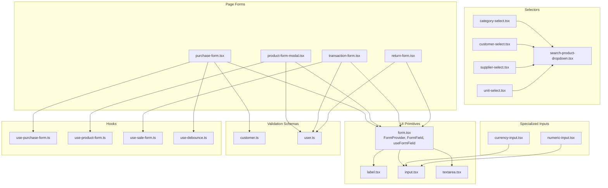
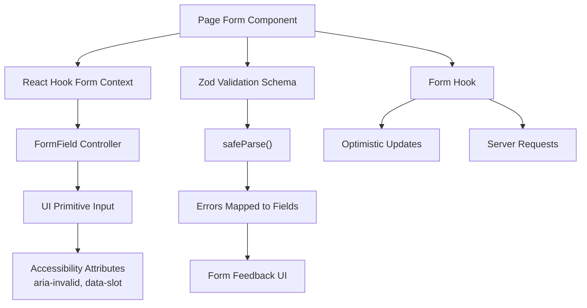
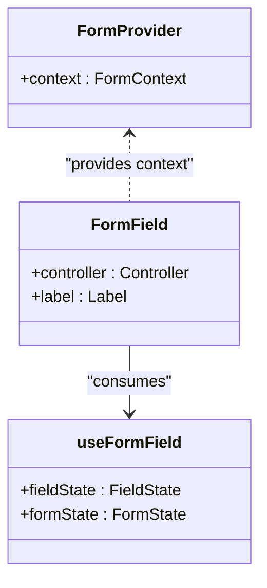
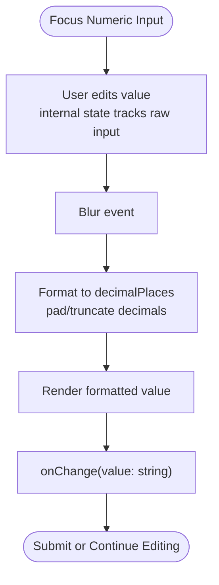
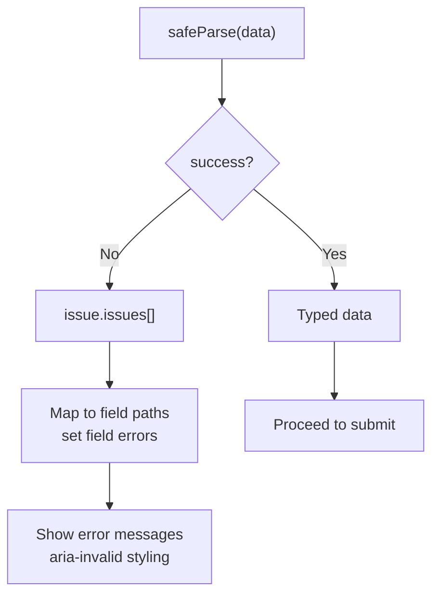
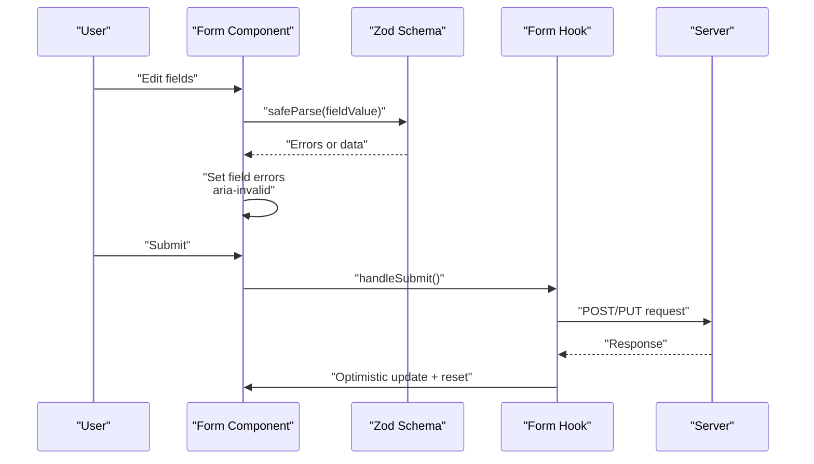
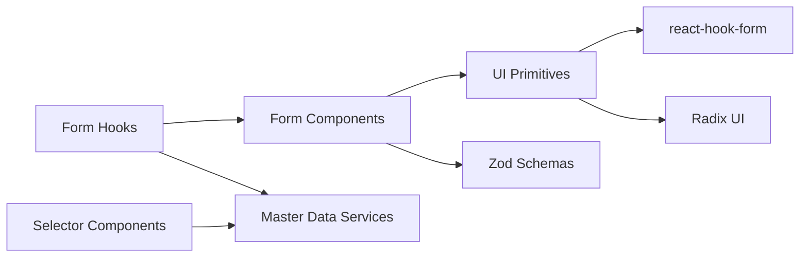

# Form Handling & Validation

<cite>
**Referenced Files in This Document**
- [form.tsx](file://src/components/ui/form.tsx)
- [label.tsx](file://src/components/ui/label.tsx)
- [input.tsx](file://src/components/ui/input.tsx)
- [textarea.tsx](file://src/components/ui/textarea.tsx)
- [currency-input.tsx](file://src/components/ui/currency-input.tsx)
- [numeric-input.tsx](file://src/components/ui/numeric-input.tsx)
- [category-select.tsx](file://src/components/ui/category-select.tsx)
- [customer-select.tsx](file://src/components/ui/customer-select.tsx)
- [supplier-select.tsx](file://src/components/ui/supplier-select.tsx)
- [unit-select.tsx](file://src/components/ui/unit-select.tsx)
- [search-product-dropdown.tsx](file://src/components/ui/search-product-dropdown.tsx)
- [customer.ts](file://src/lib/validations/customer.ts)
- [user.ts](file://src/lib/validations/user.ts)
- [purchase-form.tsx](file://src/app/dashboard/purchases/_components/purchase-form.tsx)
- [product-form-modal.tsx](file://src/app/dashboard/products/_components/product-form/product-form-modal.tsx)
- [transaction-form.tsx](file://src/app/dashboard/sales/_components/_forms/transaction-form.tsx)
- [return-form.tsx](file://src/app/dashboard/sales/_components/_forms/return-form.tsx)
- [use-purchase-form.ts](file://src/app/dashboard/purchases/_hooks/use-purchase-form.ts)
- [use-product-form.ts](file://src/app/dashboard/products/_hooks/use-product-form.ts)
- [use-sale-form.ts](file://src/app/dashboard/sales/_hooks/use-sale-form.ts)
- [use-debounce.ts](file://src/hooks/use-debounce.ts)
</cite>

## Table of Contents
1. [Introduction](#introduction)
2. [Project Structure](#project-structure)
3. [Core Components](#core-components)
4. [Architecture Overview](#architecture-overview)
5. [Detailed Component Analysis](#detailed-component-analysis)
6. [Dependency Analysis](#dependency-analysis)
7. [Performance Considerations](#performance-considerations)
8. [Troubleshooting Guide](#troubleshooting-guide)
9. [Conclusion](#conclusion)
10. [Appendices](#appendices)

## Introduction
This document explains the POS application’s form handling and validation system. It covers the custom form component architecture built on react-hook-form and Radix UI, Zod-based validation schemas, error handling patterns, and specialized input components for currency, numeric values, and entity selectors (products, customers, suppliers, categories). It also documents form submission workflows, validation strategies, real-time feedback mechanisms, conditional rendering, dynamic form generation, accessibility features, performance optimizations, and guidelines for extending the system.

## Project Structure
The form system is organized around:
- Reusable UI primitives for forms and inputs
- Zod validation schemas for domain entities
- Page-level forms and hooks orchestrating state and submission
- Specialized selector components for master data
- Debounce utilities for performance

**Diagram sources**
- [form.tsx:1-49](file://src/components/ui/form.tsx#L1-L49)
- [label.tsx:1-24](file://src/components/ui/label.tsx#L1-L24)
- [input.tsx:1-21](file://src/components/ui/input.tsx#L1-L21)
- [textarea.tsx:1-18](file://src/components/ui/textarea.tsx#L1-L18)
- [currency-input.tsx](file://src/components/ui/currency-input.tsx)
- [numeric-input.tsx:1-49](file://src/components/ui/numeric-input.tsx#L1-L49)
- [category-select.tsx](file://src/components/ui/category-select.tsx)
- [customer-select.tsx](file://src/components/ui/customer-select.tsx)
- [supplier-select.tsx](file://src/components/ui/supplier-select.tsx)
- [unit-select.tsx](file://src/components/ui/unit-select.tsx)
- [search-product-dropdown.tsx](file://src/components/ui/search-product-dropdown.tsx)
- [customer.ts:1-32](file://src/lib/validations/customer.ts#L1-L32)
- [user.ts:40-74](file://src/lib/validations/user.ts#L40-L74)
- [purchase-form.tsx:734-750](file://src/app/dashboard/purchases/_components/purchase-form.tsx#L734-L750)
- [product-form-modal.tsx](file://src/app/dashboard/products/_components/product-form/product-form-modal.tsx)
- [transaction-form.tsx](file://src/app/dashboard/sales/_components/_forms/transaction-form.tsx)
- [return-form.tsx](file://src/app/dashboard/sales/_components/_forms/return-form.tsx)
- [use-purchase-form.ts](file://src/app/dashboard/purchases/_hooks/use-purchase-form.ts)
- [use-product-form.ts](file://src/app/dashboard/products/_hooks/use-product-form.ts)
- [use-sale-form.ts](file://src/app/dashboard/sales/_hooks/use-sale-form.ts)
- [use-debounce.ts](file://src/hooks/use-debounce.ts)

**Section sources**
- [form.tsx:1-49](file://src/components/ui/form.tsx#L1-L49)
- [customer.ts:1-32](file://src/lib/validations/customer.ts#L1-L32)
- [user.ts:40-74](file://src/lib/validations/user.ts#L40-L74)
- [purchase-form.tsx:734-750](file://src/app/dashboard/purchases/_components/purchase-form.tsx#L734-L750)

## Core Components
- Form container and field wrapper: Provides a typed FormProvider and FormField controller for react-hook-form with Radix UI label integration.
- Primitive inputs: Styled base inputs with accessibility attributes and error state styling.
- Specialized inputs: Currency input for monetary amounts and numeric input for configurable decimals with locale-aware formatting.
- Selector components: Dropdown selectors for categories, customers, suppliers, units, and product search with async loading and filtering.
- Validation schemas: Zod schemas derived from database schemas and extended with application-specific rules.
- Form hooks: Orchestrate form state, submission, optimistic updates, and server-side validation integration.

Key implementation references:
- Form provider and field: [form.tsx:1-49](file://src/components/ui/form.tsx#L1-L49)
- Base input with aria-invalid: [input.tsx:1-21](file://src/components/ui/input.tsx#L1-L21)
- Textarea primitive: [textarea.tsx:1-18](file://src/components/ui/textarea.tsx#L1-L18)
- Currency input: [currency-input.tsx](file://src/components/ui/currency-input.tsx)
- Numeric input: [numeric-input.tsx:1-49](file://src/components/ui/numeric-input.tsx#L1-L49)
- Category selector: [category-select.tsx](file://src/components/ui/category-select.tsx)
- Customer selector: [customer-select.tsx](file://src/components/ui/customer-select.tsx)
- Supplier selector: [supplier-select.tsx](file://src/components/ui/supplier-select.tsx)
- Unit selector: [unit-select.tsx](file://src/components/ui/unit-select.tsx)
- Product search dropdown: [search-product-dropdown.tsx](file://src/components/ui/search-product-dropdown.tsx)
- Customer validation: [customer.ts:1-32](file://src/lib/validations/customer.ts#L1-L32)
- User validation: [user.ts:40-74](file://src/lib/validations/user.ts#L40-L74)

**Section sources**
- [form.tsx:1-49](file://src/components/ui/form.tsx#L1-L49)
- [input.tsx:1-21](file://src/components/ui/input.tsx#L1-L21)
- [textarea.tsx:1-18](file://src/components/ui/textarea.tsx#L1-L18)
- [currency-input.tsx](file://src/components/ui/currency-input.tsx)
- [numeric-input.tsx:1-49](file://src/components/ui/numeric-input.tsx#L1-L49)
- [category-select.tsx](file://src/components/ui/category-select.tsx)
- [customer-select.tsx](file://src/components/ui/customer-select.tsx)
- [supplier-select.tsx](file://src/components/ui/supplier-select.tsx)
- [unit-select.tsx](file://src/components/ui/unit-select.tsx)
- [search-product-dropdown.tsx](file://src/components/ui/search-product-dropdown.tsx)
- [customer.ts:1-32](file://src/lib/validations/customer.ts#L1-L32)
- [user.ts:40-74](file://src/lib/validations/user.ts#L40-L74)

## Architecture Overview
The form architecture follows a layered pattern:
- UI primitives encapsulate accessibility and styling.
- Form components wrap react-hook-form with typed field controls.
- Validation schemas define strict input contracts.
- Hooks manage side effects, optimistic updates, and server communication.
- Selectors integrate with master data services and caching.

**Diagram sources**
- [form.tsx:1-49](file://src/components/ui/form.tsx#L1-L49)
- [input.tsx:1-21](file://src/components/ui/input.tsx#L1-L21)
- [customer.ts:1-32](file://src/lib/validations/customer.ts#L1-L32)
- [user.ts:40-74](file://src/lib/validations/user.ts#L40-L74)
- [use-purchase-form.ts](file://src/app/dashboard/purchases/_hooks/use-purchase-form.ts)
- [use-product-form.ts](file://src/app/dashboard/products/_hooks/use-product-form.ts)
- [use-sale-form.ts](file://src/app/dashboard/sales/_hooks/use-sale-form.ts)

## Detailed Component Analysis

### Form Provider and Field Control
- Provides a typed FormProvider and a FormField wrapper that pairs react-hook-form with Radix UI labels.
- useFormField integrates with useFormState to derive error messages and touched state for per-field feedback.

Implementation highlights:
- FormProvider and FormField: [form.tsx:1-49](file://src/components/ui/form.tsx#L1-L49)
- Label primitive with data-slot: [label.tsx:1-24](file://src/components/ui/label.tsx#L1-L24)

**Diagram sources**
- [form.tsx:1-49](file://src/components/ui/form.tsx#L1-L49)
- [label.tsx:1-24](file://src/components/ui/label.tsx#L1-L24)

**Section sources**
- [form.tsx:1-49](file://src/components/ui/form.tsx#L1-L49)
- [label.tsx:1-24](file://src/components/ui/label.tsx#L1-L24)

### Primitive Inputs and Accessibility
- Base input and textarea expose aria-invalid for assistive technologies and apply focus-visible ring styles.
- data-slot attributes standardize styling and enable consistent theming.

References:
- Input with aria-invalid: [input.tsx:1-21](file://src/components/ui/input.tsx#L1-L21)
- Textarea primitive: [textarea.tsx:1-18](file://src/components/ui/textarea.tsx#L1-L18)

**Section sources**
- [input.tsx:1-21](file://src/components/ui/input.tsx#L1-L21)
- [textarea.tsx:1-18](file://src/components/ui/textarea.tsx#L1-L18)

### Specialized Inputs

#### Currency Input
- Designed for monetary amounts with locale-aware formatting and normalization.
- Integrates with base Input for consistent styling and accessibility.

Reference:
- Currency input component: [currency-input.tsx](file://src/components/ui/currency-input.tsx)

#### Numeric Input
- Accepts numeric values with configurable decimal places.
- Maintains separate internal state for editing vs formatted display.
- Handles focus transitions and formatting on blur.

Reference:
- Numeric input implementation: [numeric-input.tsx:1-49](file://src/components/ui/numeric-input.tsx#L1-L49)

**Diagram sources**
- [numeric-input.tsx:1-49](file://src/components/ui/numeric-input.tsx#L1-L49)

**Section sources**
- [currency-input.tsx](file://src/components/ui/currency-input.tsx)
- [numeric-input.tsx:1-49](file://src/components/ui/numeric-input.tsx#L1-L49)

### Dropdown Selectors for Entities
- Category, Customer, Supplier, Unit, and Product Search dropdowns encapsulate async fetching, filtering, and selection.
- Provide consistent UX with keyboard navigation, virtualization, and controlled value handling.

References:
- Category selector: [category-select.tsx](file://src/components/ui/category-select.tsx)
- Customer selector: [customer-select.tsx](file://src/components/ui/customer-select.tsx)
- Supplier selector: [supplier-select.tsx](file://src/components/ui/supplier-select.tsx)
- Unit selector: [unit-select.tsx](file://src/components/ui/unit-select.tsx)
- Product search dropdown: [search-product-dropdown.tsx](file://src/components/ui/search-product-dropdown.tsx)

**Section sources**
- [category-select.tsx](file://src/components/ui/category-select.tsx)
- [customer-select.tsx](file://src/components/ui/customer-select.tsx)
- [supplier-select.tsx](file://src/components/ui/supplier-select.tsx)
- [unit-select.tsx](file://src/components/ui/unit-select.tsx)
- [search-product-dropdown.tsx](file://src/components/ui/search-product-dropdown.tsx)

### Validation Schemas and Strategies
- Zod schemas derived from database schemas using drizzle-zod.
- Application-specific extensions add constraints like length limits and required fields.
- Refinement is used for cross-field validation (e.g., password confirmation).

References:
- Customer schema extension: [customer.ts:1-32](file://src/lib/validations/customer.ts#L1-L32)
- User validation schemas and refinements: [user.ts:40-74](file://src/lib/validations/user.ts#L40-L74)

**Diagram sources**
- [customer.ts:1-32](file://src/lib/validations/customer.ts#L1-L32)
- [user.ts:40-74](file://src/lib/validations/user.ts#L40-L74)

**Section sources**
- [customer.ts:1-32](file://src/lib/validations/customer.ts#L1-L32)
- [user.ts:40-74](file://src/lib/validations/user.ts#L40-L74)

### Form Submission Workflows
- Purchase form demonstrates numeric quantity handling and controlled field updates.
- Product form modal and Sales forms illustrate complex compositions with tabs, cart-like structures, and conditional fields.
- Hooks orchestrate optimistic updates and server requests.

References:
- Purchase form numeric field: [purchase-form.tsx:734-750](file://src/app/dashboard/purchases/_components/purchase-form.tsx#L734-L750)
- Product form modal: [product-form-modal.tsx](file://src/app/dashboard/products/_components/product-form/product-form-modal.tsx)
- Transaction form: [transaction-form.tsx](file://src/app/dashboard/sales/_components/_forms/transaction-form.tsx)
- Return form: [return-form.tsx](file://src/app/dashboard/sales/_components/_forms/return-form.tsx)
- Form hooks: [use-purchase-form.ts](file://src/app/dashboard/purchases/_hooks/use-purchase-form.ts), [use-product-form.ts](file://src/app/dashboard/products/_hooks/use-product-form.ts), [use-sale-form.ts](file://src/app/dashboard/sales/_hooks/use-sale-form.ts)

**Diagram sources**
- [purchase-form.tsx:734-750](file://src/app/dashboard/purchases/_components/purchase-form.tsx#L734-L750)
- [customer.ts:1-32](file://src/lib/validations/customer.ts#L1-L32)
- [user.ts:40-74](file://src/lib/validations/user.ts#L40-L74)
- [use-purchase-form.ts](file://src/app/dashboard/purchases/_hooks/use-purchase-form.ts)
- [use-product-form.ts](file://src/app/dashboard/products/_hooks/use-product-form.ts)
- [use-sale-form.ts](file://src/app/dashboard/sales/_hooks/use-sale-form.ts)

**Section sources**
- [purchase-form.tsx:734-750](file://src/app/dashboard/purchases/_components/purchase-form.tsx#L734-L750)
- [product-form-modal.tsx](file://src/app/dashboard/products/_components/product-form/product-form-modal.tsx)
- [transaction-form.tsx](file://src/app/dashboard/sales/_components/_forms/transaction-form.tsx)
- [return-form.tsx](file://src/app/dashboard/sales/_components/_forms/return-form.tsx)
- [use-purchase-form.ts](file://src/app/dashboard/purchases/_hooks/use-purchase-form.ts)
- [use-product-form.ts](file://src/app/dashboard/products/_hooks/use-product-form.ts)
- [use-sale-form.ts](file://src/app/dashboard/sales/_hooks/use-sale-form.ts)

### Conditional Field Rendering and Dynamic Generation
- Complex forms dynamically show/hide sections based on selections (e.g., variant tabs, return options).
- Product form modal composes multiple tabs and sections, enabling dynamic content generation.
- Transaction and return forms adjust fields depending on selected customer, payment method, or return items.

References:
- Product form modal composition: [product-form-modal.tsx](file://src/app/dashboard/products/_components/product-form/product-form-modal.tsx)
- Transaction form conditional logic: [transaction-form.tsx](file://src/app/dashboard/sales/_components/_forms/transaction-form.tsx)
- Return form conditional logic: [return-form.tsx](file://src/app/dashboard/sales/_components/_forms/return-form.tsx)

**Section sources**
- [product-form-modal.tsx](file://src/app/dashboard/products/_components/product-form/product-form-modal.tsx)
- [transaction-form.tsx](file://src/app/dashboard/sales/_components/_forms/transaction-form.tsx)
- [return-form.tsx](file://src/app/dashboard/sales/_components/_forms/return-form.tsx)

### Real-Time Feedback Mechanisms
- Field-level errors are surfaced immediately after validation.
- Base inputs reflect invalid state via aria-invalid and visual focus rings.
- Form hooks coordinate optimistic UI updates while awaiting server responses.

References:
- Input aria-invalid and focus styles: [input.tsx:1-21](file://src/components/ui/input.tsx#L1-L21)
- FormField and useFormField integration: [form.tsx:1-49](file://src/components/ui/form.tsx#L1-L49)

**Section sources**
- [input.tsx:1-21](file://src/components/ui/input.tsx#L1-L21)
- [form.tsx:1-49](file://src/components/ui/form.tsx#L1-L49)

### Accessibility Features
- data-slot attributes on inputs and labels standardize styling and improve theme compatibility.
- aria-invalid signals invalid states to assistive technologies.
- Keyboard navigation supported by underlying Radix UI components and native input behaviors.
- Screen reader-friendly labels paired with FormField wrappers.

References:
- Label primitive: [label.tsx:1-24](file://src/components/ui/label.tsx#L1-L24)
- Input primitive with aria-invalid: [input.tsx:1-21](file://src/components/ui/input.tsx#L1-L21)
- FormField controller: [form.tsx:1-49](file://src/components/ui/form.tsx#L1-L49)

**Section sources**
- [label.tsx:1-24](file://src/components/ui/label.tsx#L1-L24)
- [input.tsx:1-21](file://src/components/ui/input.tsx#L1-L21)
- [form.tsx:1-49](file://src/components/ui/form.tsx#L1-L49)

## Dependency Analysis
The form system exhibits low coupling and high cohesion:
- UI primitives depend on shared utilities and Radix UI.
- Form components depend on react-hook-form and Zod schemas.
- Selectors depend on master data hooks/services.
- Hooks encapsulate side effects and reduce component complexity.

**Diagram sources**
- [form.tsx:1-49](file://src/components/ui/form.tsx#L1-L49)
- [input.tsx:1-21](file://src/components/ui/input.tsx#L1-L21)
- [customer.ts:1-32](file://src/lib/validations/customer.ts#L1-L32)
- [use-purchase-form.ts](file://src/app/dashboard/purchases/_hooks/use-purchase-form.ts)

**Section sources**
- [form.tsx:1-49](file://src/components/ui/form.tsx#L1-L49)
- [input.tsx:1-21](file://src/components/ui/input.tsx#L1-L21)
- [customer.ts:1-32](file://src/lib/validations/customer.ts#L1-L32)
- [use-purchase-form.ts](file://src/app/dashboard/purchases/_hooks/use-purchase-form.ts)

## Performance Considerations
- Debounced validation: Use the debounce hook to avoid validating on every keystroke for expensive operations.
- Optimistic updates: Apply immediate UI changes upon user actions, then reconcile with server response.
- Virtualized lists: Use virtualization in selectors for large datasets.
- Controlled inputs: Keep internal state synchronized to prevent unnecessary re-renders.
- Memoization: Wrap heavy computations and selectors with memoization where appropriate.

References:
- Debounce hook: [use-debounce.ts](file://src/hooks/use-debounce.ts)

**Section sources**
- [use-debounce.ts](file://src/hooks/use-debounce.ts)

## Troubleshooting Guide
- Field errors not appearing:
  - Verify useFormField is used inside FormField and that schema paths match field names.
  - Check aria-invalid is applied on inputs.
- Cross-field validation failures:
  - Ensure refinement paths target the correct field names.
  - Confirm safeParse is called with the entire payload when needed.
- Numeric input formatting issues:
  - Validate decimalPlaces and locale formatting behavior.
  - Ensure onChange receives normalized string values.
- Selector not updating:
  - Confirm controlled value prop and onValueChange handler are both set.
  - Verify async data loading completes before selection.

**Section sources**
- [form.tsx:1-49](file://src/components/ui/form.tsx#L1-L49)
- [input.tsx:1-21](file://src/components/ui/input.tsx#L1-L21)
- [user.ts:40-74](file://src/lib/validations/user.ts#L40-L74)
- [numeric-input.tsx:1-49](file://src/components/ui/numeric-input.tsx#L1-L49)

## Conclusion
The POS application’s form system combines reusable UI primitives, robust Zod validation, and react-hook-form for a scalable, accessible, and performant solution. Specialized inputs and selectors streamline common workflows, while hooks orchestrate complex interactions. The architecture supports real-time feedback, conditional rendering, and optimistic updates, ensuring a responsive user experience.

## Appendices

### Guidelines for Creating New Form Components
- Use FormProvider and FormField to wrap inputs.
- Pair labels with FormField for proper semantics.
- Implement controlled inputs with explicit onChange handlers.
- Integrate Zod schemas for validation and map errors to fields.
- Add aria-invalid and focus-visible styles for accessibility.
- Prefer debounced validation for heavy operations.
- Use optimistic updates for immediate feedback during submissions.

References:
- Form primitives: [form.tsx:1-49](file://src/components/ui/form.tsx#L1-L49), [input.tsx:1-21](file://src/components/ui/input.tsx#L1-L21), [label.tsx:1-24](file://src/components/ui/label.tsx#L1-L24)
- Validation schemas: [customer.ts:1-32](file://src/lib/validations/customer.ts#L1-L32), [user.ts:40-74](file://src/lib/validations/user.ts#L40-L74)
- Debounce utility: [use-debounce.ts](file://src/hooks/use-debounce.ts)

**Section sources**
- [form.tsx:1-49](file://src/components/ui/form.tsx#L1-L49)
- [input.tsx:1-21](file://src/components/ui/input.tsx#L1-L21)
- [label.tsx:1-24](file://src/components/ui/label.tsx#L1-L24)
- [customer.ts:1-32](file://src/lib/validations/customer.ts#L1-L32)
- [user.ts:40-74](file://src/lib/validations/user.ts#L40-L74)
- [use-debounce.ts](file://src/hooks/use-debounce.ts)