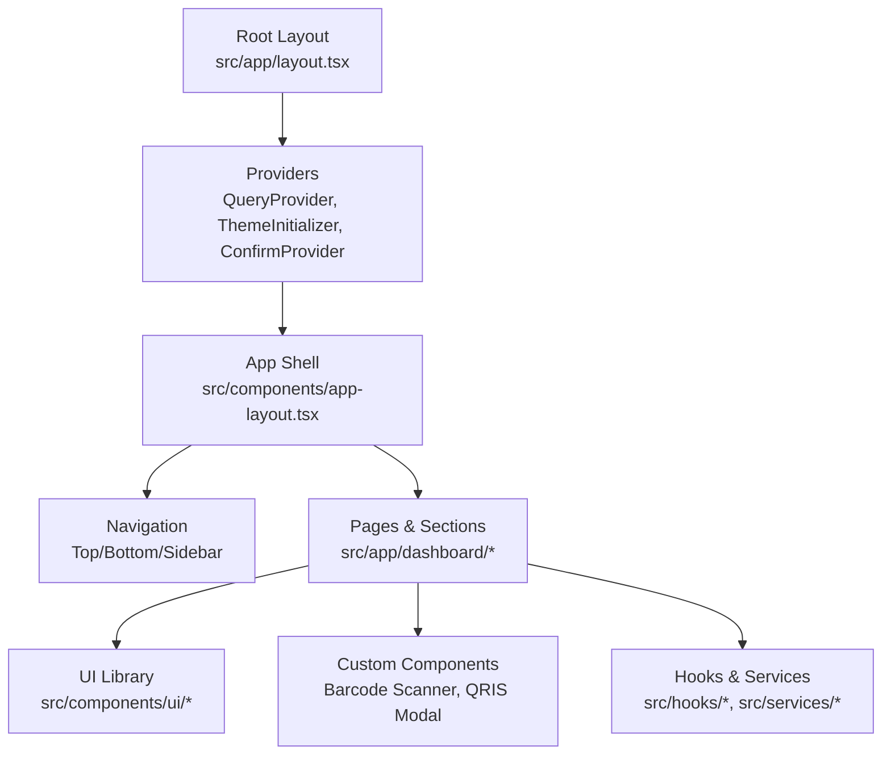
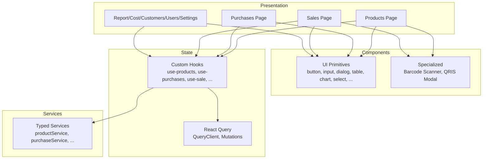
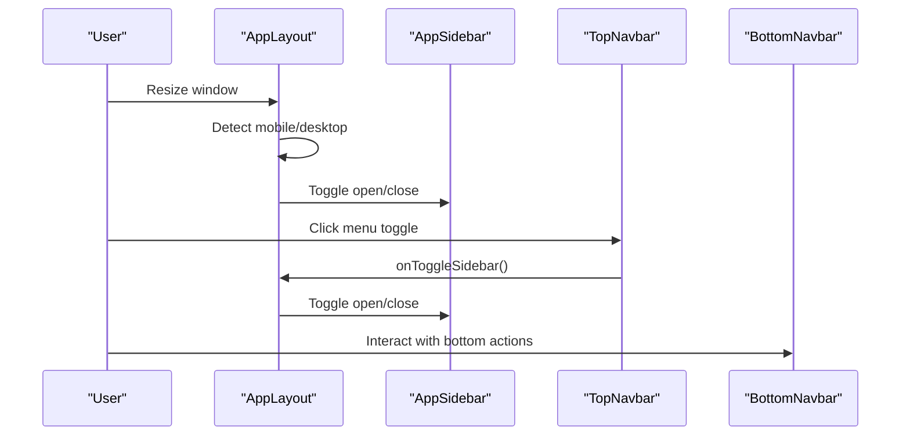
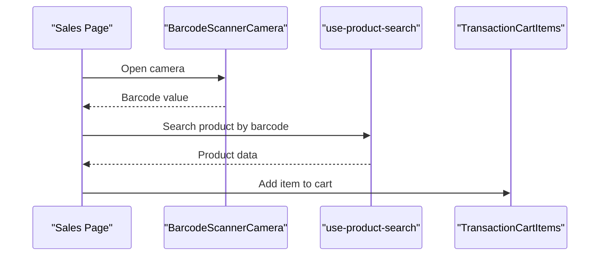
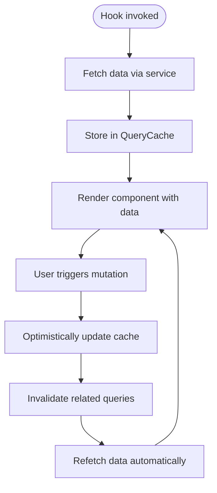
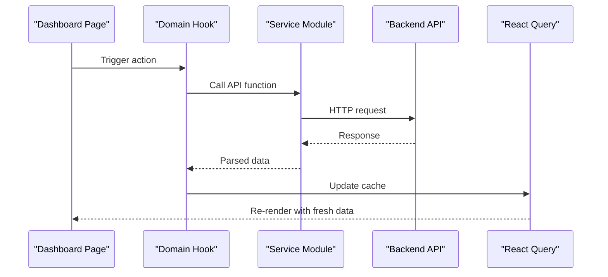
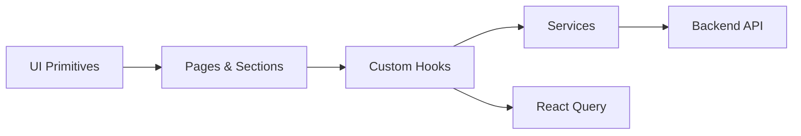

# Frontend Components

<cite>
**Referenced Files in This Document**
- [layout.tsx](file://src/app/layout.tsx)
- [app-layout.tsx](file://src/components/app-layout.tsx)
- [QueryProvider.tsx](file://src/components/providers/QueryProvider.tsx)
- [react-query.ts](file://src/lib/react-query.ts)
- [use-auth.ts](file://src/hooks/use-auth.ts)
- [use-mobile.ts](file://src/hooks/use-mobile.ts)
- [use-debounce.ts](file://src/hooks/use-debounce.ts)
- [use-query-state.ts](file://src/hooks/use-query-state.ts)
- [use-product-search.ts](file://src/hooks/use-product-search.ts)
- [use-tabs-overflow.ts](file://src/hooks/use-tabs-overflow.ts)
- [use-upload-image.ts](file://src/hooks/use-upload-image.ts)
- [ConfirmDialog.tsx](file://src/contexts/ConfirmDialog.tsx)
- [ProgressBar.tsx](file://src/components/providers/ProgressBar.tsx)
- [ThemeInitializer.tsx](file://src/components/providers/ThemeInitializer.tsx)
- [button.tsx](file://src/components/ui/button.tsx)
- [input.tsx](file://src/components/ui/input.tsx)
- [form.tsx](file://src/components/ui/form.tsx)
- [dialog.tsx](file://src/components/ui/dialog.tsx)
- [table.tsx](file://src/components/ui/table.tsx)
- [chart.tsx](file://src/components/ui/chart.tsx)
- [select.tsx](file://src/components/ui/select.tsx)
- [textarea.tsx](file://src/components/ui/textarea.tsx)
- [checkbox.tsx](file://src/components/ui/checkbox.tsx)
- [radio-group.tsx](file://src/components/ui/radio-group.tsx)
- [switch.tsx](file://src/components/ui/switch.tsx)
- [tooltip.tsx](file://src/components/ui/tooltip.tsx)
- [badge.tsx](file://src/components/ui/badge.tsx)
- [breadcrumb.tsx](file://src/components/ui/breadcrumb.tsx)
- [card.tsx](file://src/components/ui/card.tsx)
- [avatar.tsx](file://src/components/ui/avatar.tsx)
- [collapsible.tsx](file://src/components/ui/collapsible.tsx)
- [accordion.tsx](file://src/components/ui/accordion.tsx)
- [tabs.tsx](file://src/components/ui/tabs.tsx)
- [popover.tsx](file://src/components/ui/popover.tsx)
- [dropdown-menu.tsx](file://src/components/ui/dropdown-menu.tsx)
- [sheet.tsx](file://src/components/ui/sheet.tsx)
- [sidebar.tsx](file://src/components/ui/sidebar.tsx)
- [scroll-area.tsx](file://src/components/ui/scroll-area.tsx)
- [separator.tsx](file://src/components/ui/separator.tsx)
- [sonner.tsx](file://src/components/ui/sonner.tsx)
- [loading.tsx](file://src/components/ui/loading.tsx)
- [skeleton.tsx](file://src/components/ui/skeleton.tsx)
- [pagination.tsx](file://src/components/ui/pagination.tsx)
- [toggle.tsx](file://src/components/ui/toggle.tsx)
- [toggle-group.tsx](file://src/components/ui/toggle-group.tsx)
- [view-mode-switch.tsx](file://src/components/ui/view-mode-switch.tsx)
- [currency-input.tsx](file://src/components/ui/currency-input.tsx)
- [numeric-input.tsx](file://src/components/ui/numeric-input.tsx)
- [search-input.tsx](file://src/components/ui/search-input.tsx)
- [category-select.tsx](file://src/components/ui/category-select.tsx)
- [customer-select.tsx](file://src/components/ui/customer-select.tsx)
- [supplier-select.tsx](file://src/components/ui/supplier-select.tsx)
- [unit-select.tsx](file://src/components/ui/unit-select.tsx)
- [search-product-dropdown.tsx](file://src/components/ui/search-product-dropdown.tsx)
- [label.tsx](file://src/components/ui/label.tsx)
- [error-indicator.tsx](file://src/components/ui/error-indicator.tsx)
- [expandable-container.tsx](file://src/components/ui/expandable-container.tsx)
- [sticky-card-wrapper.tsx](file://src/components/ui/sticky-card-wrapper.tsx)
- [animated-number.tsx](file://src/components/ui/animated-number.tsx)
- [barcode-scanner-camera.tsx](file://src/components/barcode-scanner-camera.tsx)
- [qris-payment-modal.tsx](file://src/components/qris-payment-modal.tsx)
- [top-navbar.tsx](file://src/components/top-navbar.tsx)
- [bottom-navbar.tsx](file://src/components/bottom-navbar.tsx)
- [app-sidebar.tsx](file://src/components/app-sidebar.tsx)
- [nav-main.tsx](file://src/components/nav-main.tsx)
- [nav-secondary.tsx](file://src/components/nav-secondary.tsx)
- [nav-user.tsx](file://src/components/nav-user.tsx)
- [notification-panel.tsx](file://src/components/notification-panel.tsx)
- [relation-aware-delete-dialog.tsx](file://src/components/relation-aware-delete-dialog.tsx)
- [theme-toggle.tsx](file://src/components/theme-toggle.tsx)
- [access-denied.tsx](file://src/components/access-denied.tsx)
- [role-guard.tsx](file://src/components/role-guard.tsx)
- [section-cards.tsx](file://src/components/section-cards.tsx)
- [filter-wrap.tsx](file://src/components/filter-wrap.tsx)
- [data-table.tsx](file://src/components/data-table.tsx)
- [print-table.tsx](file://src/components/print-table.tsx)
- [print-daily-chart.tsx](file://src/components/print-daily-chart.tsx)
- [chart-area-interactive.tsx](file://src/components/chart-area-interactive.tsx)
- [compress-image.tsx](file://src/components/compress-image.tsx)
- [product-form-modal.tsx](file://src/app/dashboard/products/_components/product-form/product-form-modal.tsx)
- [product-list-section.tsx](file://src/app/dashboard/products/_components/sections/product-list-section.tsx)
- [stock-mutations-section.tsx](file://src/app/dashboard/products/_components/sections/stock-mutations-section.tsx)
- [audit-log-filter-form.tsx](file://src/app/dashboard/products/_components/ui/audit-log-filter-form.tsx)
- [mutation-filter-form.tsx](file://src/app/dashboard/products/_components/ui/mutation-filter-form.tsx)
- [product-filter-form.tsx](file://src/app/dashboard/products/_components/ui/product-filter-form.tsx)
- [product-card.tsx](file://src/app/dashboard/products/_components/product-card.tsx)
- [variant-card.tsx](file://src/app/dashboard/products/_components/variant-card.tsx)
- [common-variant-buttons.tsx](file://src/app/dashboard/products/_components/common-variant-buttons.tsx)
- [stock-adjustment-modal.tsx](file://src/app/dashboard/products/_components/stock-adjustment-modal.tsx)
- [stock-opname-print-table.tsx](file://src/app/dashboard/products/_components/stock-opname-print-table.tsx)
- [product-audit-log-tab.tsx](file://src/app/dashboard/products/_components/product-audit-log-tab.tsx)
- [product-audit-log-section.tsx](file://src/app/dashboard/products/_components/product-audit-log-section.tsx)
- [use-product-form.ts](file://src/app/dashboard/products/_hooks/use-product-form.ts)
- [use-product-image.ts](file://src/app/dashboard/products/_hooks/use-product-image.ts)
- [product-form.utils.ts](file://src/app/dashboard/products/_utils/product-form.utils.ts)
- [purchase-form.tsx](file://src/app/dashboard/purchases/_components/purchase-form.tsx)
- [purchase-list-section.tsx](file://src/app/dashboard/purchases/_components/purchase-list-section.tsx)
- [supplier-form-modal.tsx](file://src/app/dashboard/purchases/_components/supplier-form-modal.tsx)
- [supplier-list-section.tsx](file://src/app/dashboard/purchases/_components/supplier-list-section.tsx)
- [purchase-filter-form.tsx](file://src/app/dashboard/purchases/_components/_ui/purchase-filter-form.tsx)
- [supplier-filter-form.tsx](file://src/app/dashboard/purchases/_components/_ui/supplier-filter-form.tsx)
- [purchase-row.tsx](file://src/app/dashboard/purchases/_components/_ui/purchase-row.tsx)
- [purchase-receipt.tsx](file://src/app/dashboard/purchases/_components/_ui/purchase-receipt.tsx)
- [use-purchase-form.ts](file://src/app/dashboard/purchases/_hooks/use-purchase-form.ts)
- [use-purchase-list.ts](file://src/app/dashboard/purchases/_hooks/use-purchase-list.ts)
- [use-supplier-form.ts](file://src/app/dashboard/purchases/_hooks/use-supplier-form.ts)
- [use-supplier-list.ts](file://src/app/dashboard/purchases/_hooks/use-supplier-list.ts)
- [supplier.ts](file://src/app/dashboard/purchases/_types/supplier.ts)
- [purchase-type.ts](file://src/app/dashboard/purchases/_types/purchase-type.ts)
- [transaction-form.tsx](file://src/app/dashboard/sales/_components/_forms/transaction-form.tsx)
- [return-form.tsx](file://src/app/dashboard/sales/_components/_forms/return-form.tsx)
- [sales-list-section.tsx](file://src/app/dashboard/sales/_components/_sections/sales-list-section.tsx)
- [debt-list-section.tsx](file://src/app/dashboard/sales/_components/_sections/debt-list-section.tsx)
- [return-list-section.tsx](file://src/app/dashboard/sales/_components/_sections/return-list-section.tsx)
- [sales-filter-form.tsx](file://src/app/dashboard/sales/_components/_ui/sales-filter-form.tsx)
- [debt-filter-form.tsx](file://src/app/dashboard/sales/_components/_ui/debt-filter-form.tsx)
- [return-filter-form.tsx](file://src/app/dashboard/sales/_components/_ui/return-filter-form.tsx)
- [sale-receipt.tsx](file://src/app/dashboard/sales/_components/_ui/sale-receipt.tsx)
- [return-receipt.tsx](file://src/app/dashboard/sales/_components/_ui/return-receipt.tsx)
- [sale-success-modal.tsx](file://src/app/dashboard/sales/_components/_ui/sale-success-modal.tsx)
- [return-success-modal.tsx](file://src/app/dashboard/sales/_components/_ui/return-success-modal.tsx)
- [debt-payment-dialog.tsx](file://src/app/dashboard/sales/_components/debt-payment-dialog.tsx)
- [exchange-item-picker.tsx](file://src/app/dashboard/sales/_components/exchange-item-picker.tsx)
- [return-item-selector.tsx](file://src/app/dashboard/sales/_components/return-item-selector.tsx)
- [transaction-cart-items.tsx](file://src/app/dashboard/sales/_components/transaction-cart-items.tsx)
- [use-sale-form.ts](file://src/app/dashboard/sales/_hooks/use-sale-form.ts)
- [use-return-form.ts](file://src/app/dashboard/sales/_hooks/use-return-form.ts)
- [use-print-receipt.ts](file://src/app/dashboard/sales/_hooks/use-print-receipt.ts)
- [use-product-search.ts](file://src/app/dashboard/sales/_hooks/use-product-search.ts)
- [sale-type.ts](file://src/app/dashboard/sales/_types/sale-type.ts)
- [financial-section.tsx](file://src/app/dashboard/report/_components/financial-section.tsx)
- [overview-section.tsx](file://src/app/dashboard/report/_components/overview-section.tsx)
- [purchase-section.tsx](file://src/app/dashboard/report/_components/purchase-section.tsx)
- [report-pie-chart.tsx](file://src/app/dashboard/report/_components/report-pie-chart.tsx)
- [sales-section.tsx](file://src/app/dashboard/report/_components/sales-section.tsx)
- [operational-costs-section.tsx](file://src/app/dashboard/cost/_components/_sections/operational-costs-section.tsx)
- [tax-configs-section.tsx](file://src/app/dashboard/cost/_components/_sections/tax-configs-section.tsx)
- [operational-cost-form.tsx](file://src/app/dashboard/cost/_components/_forms/operational-cost-form.tsx)
- [tax-config-form.tsx](file://src/app/dashboard/cost/_components/_forms/tax-config-form.tsx)
- [operational-cost-filter-form.tsx](file://src/app/dashboard/cost/_components/_ui/operational-cost-filter-form.tsx)
- [tax-config-filter-form.tsx](file://src/app/dashboard/cost/_components/_ui/tax-config-filter-form.tsx)
- [use-operational-cost-list.ts](file://src/app/dashboard/cost/_hooks/use-operational-cost-list.ts)
- [use-tax-config-list.ts](file://src/app/dashboard/cost/_hooks/use-tax-config-list.ts)
- [cost-types.ts](file://src/app/dashboard/cost/_types/cost-types.ts)
- [customer-detail-section.tsx](file://src/app/dashboard/customers/_components/customer-detail-section.tsx)
- [customer-form.tsx](file://src/app/dashboard/customers/_components/customer-form.tsx)
- [customer-list-section.tsx](file://src/app/dashboard/customers/_components/customer-list-section.tsx)
- [account-setting-card.tsx](file://src/app/dashboard/setting/_components/account-setting-card.tsx)
- [store-setting-card.tsx](file://src/app/dashboard/setting/_components/store-setting-card.tsx)
- [user-filter-form.tsx](file://src/app/dashboard/users/_components/ui/user-filter-form.tsx)
- [password-reset-requests-section.tsx](file://src/app/dashboard/users/_components/password-reset-requests-section.tsx)
- [user-form-modal.tsx](file://src/app/dashboard/users/_components/user-form-modal.tsx)
- [user-list-section.tsx](file://src/app/dashboard/users/_components/user-list-section.tsx)
- [use-notifications.ts](file://src/hooks/notifications/use-notifications.ts)
- [notification-store.ts](file://src/app/api/notifications/_lib/notification-store.ts)
- [notification-logic.ts](file://src/app/api/notifications/_lib/notification-logic.ts)
- [notification-state-db.ts](file://src/app/api/notifications/_lib/notification-state-db.ts)
- [notification-logic.test.ts](file://src/__tests__/lib/notification-logic.test.ts)
- [notification-store.test.ts](file://src/__tests__/lib/notification-store.test.ts)
- [dashboard-query-options.ts](file://src/hooks/dashboard/dashboard-query-options.ts)
- [use-dashboard-summary.ts](file://src/hooks/dashboard/use-dashboard-summary.ts)
- [product-query-options.ts](file://src/hooks/products/product-query-options.ts)
- [use-products.ts](file://src/hooks/products/use-products.ts)
- [use-product.ts](file://src/hooks/products/use-product.ts)
- [use-create-product.ts](file://src/hooks/products/use-create-product.ts)
- [use-update-product.ts](file://src/hooks/products/use-update-product.ts)
- [use-delete-product.ts](file://src/hooks/products/use-delete-product.ts)
- [use-adjust-stock.ts](file://src/hooks/products/use-adjust-stock.ts)
- [use-create-stock-adjustment.ts](file://src/hooks/products/use-create-stock-adjustment.ts)
- [use-product-audit-logs.ts](file://src/hooks/products/use-product-audit-logs.ts)
- [purchase-query-options.ts](file://src/hooks/purchases/purchase-query-options.ts)
- [use-purchases.ts](file://src/hooks/purchases/use-purchases.ts)
- [sale-query-options.ts](file://src/hooks/sales/sale-query-options.ts)
- [use-sale.ts](file://src/hooks/sales/use-sale.ts)
- [debt-query-options.ts](file://src/hooks/debt/debt-query-options.ts)
- [use-debts.ts](file://src/hooks/debt/use-debts.ts)
- [master-query-options.ts](file://src/hooks/master/master-query-options.ts)
- [use-categories.ts](file://src/hooks/master/use-categories.ts)
- [use-customers.ts](file://src/hooks/master/use-customers.ts)
- [use-suppliers.ts](file://src/hooks/master/use-suppliers.ts)
- [use-units.ts](file://src/hooks/master/use-units.ts)
- [category-query-options.ts](file://src/hooks/categories/category-query-options.ts)
- [use-categories.ts](file://src/hooks/categories/use-categories.ts)
- [use-create-category.ts](file://src/hooks/categories/use-create-category.ts)
- [use-update-category.ts](file://src/hooks/categories/use-update-category.ts)
- [use-delete-category.ts](file://src/hooks/categories/use-delete-category.ts)
- [unit-query-options.ts](file://src/hooks/units/unit-query-options.ts)
- [use-units.ts](file://src/hooks/units/use-units.ts)
- [use-create-unit.ts](file://src/hooks/units/use-create-unit.ts)
- [use-update-unit.ts](file://src/hooks/units/use-update-unit.ts)
- [use-delete-unit.ts](file://src/hooks/units/use-delete-unit.ts)
- [cost-query-options.ts](file://src/hooks/cost/cost-query-options.ts)
- [use-cost.ts](file://src/hooks/cost/use-cost.ts)
- [report-query-options.ts](file://src/hooks/report/report-query-options.ts)
- [use-report.ts](file://src/hooks/report/use-report.ts)
- [user-query-options.ts](file://src/hooks/users/user-query-options.ts)
- [use-users.ts](file://src/hooks/users/use-users.ts)
- [use-create-user.ts](file://src/hooks/users/use-create-user.ts)
- [use-update-user.ts](file://src/hooks/users/use-update-user.ts)
- [use-delete-user.ts](file://src/hooks/users/use-delete-user.ts)
- [use-change-password.ts](file://src/hooks/users/use-change-password.ts)
- [password-reset-query-options.ts](file://src/hooks/users/password-reset-query-options.ts)
- [use-password-reset-requests.ts](file://src/hooks/users/use-password-reset-requests.ts)
- [use-resolve-password-reset.ts](file://src/hooks/users/use-resolve-password-reset.ts)
- [setting-query-options.ts](file://src/hooks/store-setting/setting-query-options.ts)
- [use-setting.ts](file://src/hooks/store-setting/use-setting.ts)
- [stock-mutation-query-options.ts](file://src/hooks/stock-mutations/stock-mutation-query-options.ts)
- [use-stock-mutations.ts](file://src/hooks/stock-mutations/use-stock-mutations.ts)
- [customer-return-query-options.ts](file://src/hooks/customer-returns/customer-return-query-options.ts)
- [use-customer-return.ts](file://src/hooks/customer-returns/use-customer-return.ts)
- [authService.ts](file://src/services/authService.ts)
- [productService.ts](file://src/services/productService.ts)
- [purchaseService.ts](file://src/services/purchaseService.ts)
- [saleService.ts](file://src/services/saleService.ts)
- [customerService.ts](file://src/services/customerService.ts)
- [supplierService.ts](file://src/services/supplierService.ts)
- [unitService.ts](file://src/services/unitService.ts)
- [categoryService.ts](file://src/services/categoryService.ts)
- [costService.ts](file://src/services/costService.ts)
- [reportService.ts](file://src/services/reportService.ts)
- [debtService.ts](file://src/services/debtService.ts)
- [notificationService.ts](file://src/services/notificationService.ts)
- [passwordResetService.ts](file://src/services/passwordResetService.ts)
</cite>

## Table of Contents
1. [Introduction](#introduction)
2. [Project Structure](#project-structure)
3. [Core Components](#core-components)
4. [Architecture Overview](#architecture-overview)
5. [Detailed Component Analysis](#detailed-component-analysis)
6. [Dependency Analysis](#dependency-analysis)
7. [Performance Considerations](#performance-considerations)
8. [Troubleshooting Guide](#troubleshooting-guide)
9. [Conclusion](#conclusion)
10. [Appendices](#appendices)

## Introduction
This document describes the frontend component architecture of the POS application. It covers the main app layout, navigation components, reusable UI primitives, specialized components (such as barcode scanner and QRIS payment modal), state management via React Query and custom hooks, form handling and validation strategies, responsive design and mobile-first approach, accessibility, performance, and integration patterns with the backend API. Practical usage patterns and composition guidelines are included to help developers build and maintain consistent, scalable UI.

## Project Structure
The frontend is structured around a Next.js app directory with a root application shell and modular pages under dedicated dashboards. Providers wrap the app to supply global state and theming. Reusable UI components live under a shared components library, while domain-specific pages and sections are organized by functional areas (products, purchases, sales, reports, costs, customers, users, settings).

**Diagram sources**
- [layout.tsx:17-41](file://src/app/layout.tsx#L17-L41)
- [app-layout.tsx:12-72](file://src/components/app-layout.tsx#L12-L72)
- [QueryProvider.tsx:7-29](file://src/components/providers/QueryProvider.tsx#L7-L29)

**Section sources**
- [layout.tsx:1-42](file://src/app/layout.tsx#L1-L42)
- [app-layout.tsx:1-128](file://src/components/app-layout.tsx#L1-L128)

## Core Components
- Application shell and navigation:
  - AppLayout orchestrates sidebar, top navbar, bottom navbar, and scrolling behavior.
  - Navigation components include top-navbar, bottom-navbar, and app-sidebar with main/secondary/user menus.
- Global providers:
  - QueryProvider initializes TanStack Query with a configured client and toast notifications.
  - ThemeInitializer sets up theme preferences.
  - ConfirmProvider wraps modals/dialogs with a confirm context.
  - ProgressBar indicates navigation progress.
- Responsive behavior:
  - Mobile detection and sidebar toggling.
  - Scroll-aware top navbar styling.

**Section sources**
- [app-layout.tsx:12-72](file://src/components/app-layout.tsx#L12-L72)
- [top-navbar.tsx](file://src/components/top-navbar.tsx)
- [bottom-navbar.tsx](file://src/components/bottom-navbar.tsx)
- [app-sidebar.tsx](file://src/components/app-sidebar.tsx)
- [nav-main.tsx](file://src/components/nav-main.tsx)
- [nav-secondary.tsx](file://src/components/nav-secondary.tsx)
- [nav-user.tsx](file://src/components/nav-user.tsx)
- [QueryProvider.tsx:7-29](file://src/components/providers/QueryProvider.tsx#L7-L29)
- [ThemeInitializer.tsx](file://src/components/providers/ThemeInitializer.tsx)
- [ConfirmDialog.tsx](file://src/contexts/ConfirmDialog.tsx)
- [ProgressBar.tsx](file://src/components/providers/ProgressBar.tsx)

## Architecture Overview
The architecture follows a layered pattern:
- Presentation layer: Pages and sections under src/app/dashboard/* define views and compose reusable UI components.
- Component layer: Shared UI primitives under src/components/ui/* encapsulate base elements.
- Domain layer: Custom components for specialized workflows (e.g., barcode scanner, QRIS payment).
- State layer: React Query manages server state, caching, and optimistic updates; custom hooks encapsulate domain logic.
- Service layer: Typed service modules under src/services/* abstract API calls.
- Hooks layer: Domain-specific hooks under src/hooks/* centralize data fetching and caching strategies.

**Diagram sources**
- [app-layout.tsx:12-72](file://src/components/app-layout.tsx#L12-L72)
- [QueryProvider.tsx:7-29](file://src/components/providers/QueryProvider.tsx#L7-L29)
- [react-query.ts:5-30](file://src/lib/react-query.ts#L5-L30)
- [productService.ts](file://src/services/productService.ts)
- [purchaseService.ts](file://src/services/purchaseService.ts)
- [saleService.ts](file://src/services/saleService.ts)

## Detailed Component Analysis

### App Layout and Navigation
- AppLayout coordinates responsive sidebar behavior, scroll effects, and integrates auth state.
- Top/Bottom/Sidebar navbars provide consistent navigation across devices.
- Mobile-first logic auto-opens sidebar on desktop and collapses on small screens.

**Diagram sources**
- [app-layout.tsx:18-45](file://src/components/app-layout.tsx#L18-L45)
- [app-sidebar.tsx](file://src/components/app-sidebar.tsx)
- [top-navbar.tsx](file://src/components/top-navbar.tsx)
- [bottom-navbar.tsx](file://src/components/bottom-navbar.tsx)

**Section sources**
- [app-layout.tsx:12-72](file://src/components/app-layout.tsx#L12-L72)
- [use-auth.ts](file://src/hooks/use-auth.ts)
- [use-mobile.ts](file://src/hooks/use-mobile.ts)

### UI Component Library
Reusable primitives are implemented as standalone components with consistent props and styling. Examples include:
- Form controls: input, textarea, select, checkbox, radio-group, switch, numeric-input, currency-input, search-input, category-select, customer-select, supplier-select, unit-select, search-product-dropdown.
- Feedback: alert, alert-dialog, sonner, loading, skeleton, error-indicator.
- Layout: card, badge, breadcrumb, avatar, separator, scroll-area, expandable-container, sticky-card-wrapper.
- Navigation: pagination, view-mode-switch, tabs, accordion, collapsible, popover, dropdown-menu, sidebar, sheet.
- Actions: button, dialog, tooltip, toggle, toggle-group.

Composition patterns:
- Form components wrap field-level controls and provide validation integration.
- Dialogs and sheets provide overlay containers for complex workflows.
- Tables and charts support filtering and pagination.

**Section sources**
- [button.tsx](file://src/components/ui/button.tsx)
- [input.tsx](file://src/components/ui/input.tsx)
- [form.tsx](file://src/components/ui/form.tsx)
- [dialog.tsx](file://src/components/ui/dialog.tsx)
- [table.tsx](file://src/components/ui/table.tsx)
- [chart.tsx](file://src/components/ui/chart.tsx)
- [select.tsx](file://src/components/ui/select.tsx)
- [textarea.tsx](file://src/components/ui/textarea.tsx)
- [checkbox.tsx](file://src/components/ui/checkbox.tsx)
- [radio-group.tsx](file://src/components/ui/radio-group.tsx)
- [switch.tsx](file://src/components/ui/switch.tsx)
- [tooltip.tsx](file://src/components/ui/tooltip.tsx)
- [badge.tsx](file://src/components/ui/badge.tsx)
- [breadcrumb.tsx](file://src/components/ui/breadcrumb.tsx)
- [card.tsx](file://src/components/ui/card.tsx)
- [avatar.tsx](file://src/components/ui/avatar.tsx)
- [collapsible.tsx](file://src/components/ui/collapsible.tsx)
- [accordion.tsx](file://src/components/ui/accordion.tsx)
- [tabs.tsx](file://src/components/ui/tabs.tsx)
- [popover.tsx](file://src/components/ui/popover.tsx)
- [dropdown-menu.tsx](file://src/components/ui/dropdown-menu.tsx)
- [sheet.tsx](file://src/components/ui/sheet.tsx)
- [sidebar.tsx](file://src/components/ui/sidebar.tsx)
- [scroll-area.tsx](file://src/components/ui/scroll-area.tsx)
- [separator.tsx](file://src/components/ui/separator.tsx)
- [sonner.tsx](file://src/components/ui/sonner.tsx)
- [loading.tsx](file://src/components/ui/loading.tsx)
- [skeleton.tsx](file://src/components/ui/skeleton.tsx)
- [pagination.tsx](file://src/components/ui/pagination.tsx)
- [toggle.tsx](file://src/components/ui/toggle.tsx)
- [toggle-group.tsx](file://src/components/ui/toggle-group.tsx)
- [view-mode-switch.tsx](file://src/components/ui/view-mode-switch.tsx)
- [currency-input.tsx](file://src/components/ui/currency-input.tsx)
- [numeric-input.tsx](file://src/components/ui/numeric-input.tsx)
- [search-input.tsx](file://src/components/ui/search-input.tsx)
- [category-select.tsx](file://src/components/ui/category-select.tsx)
- [customer-select.tsx](file://src/components/ui/customer-select.tsx)
- [supplier-select.tsx](file://src/components/ui/supplier-select.tsx)
- [unit-select.tsx](file://src/components/ui/unit-select.tsx)
- [search-product-dropdown.tsx](file://src/components/ui/search-product-dropdown.tsx)
- [label.tsx](file://src/components/ui/label.tsx)
- [error-indicator.tsx](file://src/components/ui/error-indicator.tsx)
- [expandable-container.tsx](file://src/components/ui/expandable-container.tsx)
- [sticky-card-wrapper.tsx](file://src/components/ui/sticky-card-wrapper.tsx)
- [animated-number.tsx](file://src/components/ui/animated-number.tsx)

### Specialized Components
- Barcode scanner camera:
  - Integrates camera capture for scanning product barcodes in sales transactions.
- QRIS payment modal:
  - Handles QRIS payment initiation and confirmation flows.

**Diagram sources**
- [barcode-scanner-camera.tsx](file://src/components/barcode-scanner-camera.tsx)
- [use-product-search.ts](file://src/app/dashboard/sales/_hooks/use-product-search.ts)
- [transaction-cart-items.tsx](file://src/app/dashboard/sales/_components/transaction-cart-items.tsx)

**Section sources**
- [barcode-scanner-camera.tsx](file://src/components/barcode-scanner-camera.tsx)
- [qris-payment-modal.tsx](file://src/components/qris-payment-modal.tsx)

### State Management with React Query and Custom Hooks
- Global configuration:
  - A centralized QueryClient is configured with defaults for staleTime, garbage collection, retries, and refetch policies.
- Provider:
  - QueryProvider wraps the app to inject the QueryClient and toast notifications.
- Custom hooks:
  - Domain-specific hooks encapsulate query keys, fetchers, and mutations (e.g., use-products, use-purchases, use-sale, use-debts, use-users).
  - Query options files define cache keys and parameters consistently across the app.
- Optimistic updates and invalidation:
  - Mutations trigger cache updates and selective invalidations to keep UI in sync with server state.

**Diagram sources**
- [react-query.ts:5-30](file://src/lib/react-query.ts#L5-L30)
- [QueryProvider.tsx:7-29](file://src/components/providers/QueryProvider.tsx#L7-L29)
- [use-products.ts](file://src/hooks/products/use-products.ts)
- [use-purchases.ts](file://src/hooks/purchases/use-purchases.ts)
- [use-sale.ts](file://src/hooks/sales/use-sale.ts)

**Section sources**
- [react-query.ts:1-47](file://src/lib/react-query.ts#L1-L47)
- [QueryProvider.tsx:1-31](file://src/components/providers/QueryProvider.tsx#L1-L31)

### Forms, Validation, and Zod Integration
- Form composition:
  - UI form components wrap field-level inputs and provide layout and spacing.
- Validation strategy:
  - Zod schemas define typed validation for forms. While explicit schema files are not present in the provided paths, the presence of validation tests and typed hooks indicates a Zod-based approach is used across the codebase.
- Hook-driven validation:
  - Custom hooks integrate with React Query to manage submission, errors, and optimistic updates.

Practical patterns:
- Define a Zod schema per domain form.
- Use a hook to manage form state and submit via a service function.
- Surface errors via the form component and toast notifications.

**Section sources**
- [form.tsx](file://src/components/ui/form.tsx)
- [input.tsx](file://src/components/ui/input.tsx)
- [use-product-form.ts](file://src/app/dashboard/products/_hooks/use-product-form.ts)
- [use-purchase-form.ts](file://src/app/dashboard/purchases/_hooks/use-purchase-form.ts)
- [use-sale-form.ts](file://src/app/dashboard/sales/_hooks/use-sale-form.ts)

### Responsive Design and Mobile-First Approach
- Breakpoints and layout:
  - Tailwind-based responsive classes adapt layouts for mobile and tablet.
- Behavior:
  - Sidebar auto-opens on desktop and collapses on mobile.
  - Scroll-aware top navbar adjusts styling for better UX.
- Hooks:
  - use-mobile detects viewport size and adapts UI accordingly.

**Section sources**
- [app-layout.tsx:18-45](file://src/components/app-layout.tsx#L18-L45)
- [use-mobile.ts](file://src/hooks/use-mobile.ts)

### Accessibility Compliance
- Semantic HTML and ARIA:
  - Buttons, dialogs, and overlays use accessible roles and labels.
- Focus management:
  - Dialogs and sheets manage focus trapping and keyboard navigation.
- Color contrast and themes:
  - Theme provider ensures readable color schemes across light/dark modes.

**Section sources**
- [button.tsx](file://src/components/ui/button.tsx)
- [dialog.tsx](file://src/components/ui/dialog.tsx)
- [ThemeInitializer.tsx](file://src/components/providers/ThemeInitializer.tsx)

### Performance Optimization
- React Query caching:
  - Stale and garbage collection times balance freshness and memory usage.
  - Retry logic avoids retrying client-side errors.
- Lazy loading and suspense:
  - Root layout uses Suspense for progressive hydration.
- Debouncing:
  - use-debounce reduces expensive re-fetches during typing or rapid input changes.
- Image compression:
  - compress-image optimizes uploads.

**Section sources**
- [react-query.ts:5-30](file://src/lib/react-query.ts#L5-L30)
- [layout.tsx:31-33](file://src/app/layout.tsx#L31-L33)
- [use-debounce.ts](file://src/hooks/use-debounce.ts)
- [compress-image.tsx](file://src/components/compress-image.tsx)

### Backend Integration Patterns
- Services:
  - Typed service modules encapsulate API endpoints and data transformations.
- Hooks:
  - Domain hooks orchestrate service calls, cache keys, and error handling.
- Notifications:
  - Notification store and logic coordinate local state and persistence.

**Diagram sources**
- [productService.ts](file://src/services/productService.ts)
- [purchaseService.ts](file://src/services/purchaseService.ts)
- [saleService.ts](file://src/services/saleService.ts)
- [use-products.ts](file://src/hooks/products/use-products.ts)
- [use-purchases.ts](file://src/hooks/purchases/use-purchases.ts)
- [use-sale.ts](file://src/hooks/sales/use-sale.ts)

**Section sources**
- [productService.ts](file://src/services/productService.ts)
- [purchaseService.ts](file://src/services/purchaseService.ts)
- [saleService.ts](file://src/services/saleService.ts)
- [notification-store.ts](file://src/app/api/notifications/_lib/notification-store.ts)
- [notification-logic.ts](file://src/app/api/notifications/_lib/notification-logic.ts)

### Component Composition Guidelines
- Prop interfaces:
  - Keep props minimal and typed; prefer partials for optional fields.
- Composition:
  - Compose UI primitives to build complex forms and lists.
  - Use sections to group related UI and logic.
- Customization:
  - Allow className overrides and variant props for visual customization.
- Accessibility:
  - Provide aria-labels and ensure keyboard navigability.

Examples of composition:
- Product form modal composes form fields and selects.
- Sales transaction form composes cart items, filters, and receipts.
- Purchase list section composes rows and receipts.

**Section sources**
- [product-form-modal.tsx](file://src/app/dashboard/products/_components/product-form/product-form-modal.tsx)
- [transaction-form.tsx](file://src/app/dashboard/sales/_components/_forms/transaction-form.tsx)
- [purchase-row.tsx](file://src/app/dashboard/purchases/_components/_ui/purchase-row.tsx)
- [sale-receipt.tsx](file://src/app/dashboard/sales/_components/_ui/sale-receipt.tsx)

### Practical Usage Patterns
- Fetching lists:
  - Use domain hooks to fetch paginated lists with filters.
- Creating/updating/deleting:
  - Use mutation hooks; invalidate related queries after success.
- Search and filters:
  - Combine use-query-state with debounced inputs to reduce network requests.
- Print receipts:
  - Use print helpers to render printable receipts from rendered components.

**Section sources**
- [use-products.ts](file://src/hooks/products/use-products.ts)
- [use-purchases.ts](file://src/hooks/purchases/use-purchases.ts)
- [use-sale-form.ts](file://src/app/dashboard/sales/_hooks/use-sale-form.ts)
- [use-print-receipt.ts](file://src/app/dashboard/sales/_hooks/use-print-receipt.ts)
- [use-query-state.ts](file://src/hooks/use-query-state.ts)

## Dependency Analysis
The component layer depends on the state and service layers. Hooks encapsulate data fetching and mutations, while services abstract API calls. UI components depend on shared primitives and are consumed by pages and sections.

**Diagram sources**
- [button.tsx](file://src/components/ui/button.tsx)
- [use-products.ts](file://src/hooks/products/use-products.ts)
- [productService.ts](file://src/services/productService.ts)
- [react-query.ts:5-30](file://src/lib/react-query.ts#L5-L30)

**Section sources**
- [button.tsx](file://src/components/ui/button.tsx)
- [use-products.ts](file://src/hooks/products/use-products.ts)
- [productService.ts](file://src/services/productService.ts)

## Performance Considerations
- Prefer server-side pagination and filtering to limit payload sizes.
- Use optimistic updates for immediate feedback, with rollback on error.
- Debounce search inputs and avoid unnecessary re-renders with memoization.
- Lazy-load heavy components and images.
- Monitor cache hit rates and adjust staleTime/gcTime as needed.

## Troubleshooting Guide
- Toast errors:
  - Global toasts surface mutation errors; inspect network tab for underlying causes.
- Hydration warnings:
  - Ensure theme initialization and progress bar are wrapped in Suspense.
- Confirm dialogs:
  - Verify ConfirmProvider is present at the root to prevent dialog-related errors.
- Query cache issues:
  - Use invalidation and refetch strategies to resolve stale data problems.

**Section sources**
- [QueryProvider.tsx:17-27](file://src/components/providers/QueryProvider.tsx#L17-L27)
- [layout.tsx:31-33](file://src/app/layout.tsx#L31-L33)
- [ConfirmDialog.tsx](file://src/contexts/ConfirmDialog.tsx)

## Conclusion
The POS frontend employs a clean separation of concerns with a strong emphasis on reusable UI primitives, robust state management via React Query, and domain-focused custom hooks. The mobile-first responsive design, accessibility-conscious components, and typed service integrations enable scalable development. Following the composition guidelines and patterns outlined here will help maintain consistency and performance across the application.

## Appendices
- Additional specialized components:
  - Notification panel, relation-aware delete dialog, theme toggle, role guard, access denied, section cards, filter wrapper, data table, print table, print daily chart, chart area interactive.
- Domain sections:
  - Products, purchases, sales, report, cost, customers, users, settings.

**Section sources**
- [notification-panel.tsx](file://src/components/notification-panel.tsx)
- [relation-aware-delete-dialog.tsx](file://src/components/relation-aware-delete-dialog.tsx)
- [theme-toggle.tsx](file://src/components/theme-toggle.tsx)
- [role-guard.tsx](file://src/components/role-guard.tsx)
- [access-denied.tsx](file://src/components/access-denied.tsx)
- [section-cards.tsx](file://src/components/section-cards.tsx)
- [filter-wrap.tsx](file://src/components/filter-wrap.tsx)
- [data-table.tsx](file://src/components/data-table.tsx)
- [print-table.tsx](file://src/components/print-table.tsx)
- [print-daily-chart.tsx](file://src/components/print-daily-chart.tsx)
- [chart-area-interactive.tsx](file://src/components/chart-area-interactive.tsx)