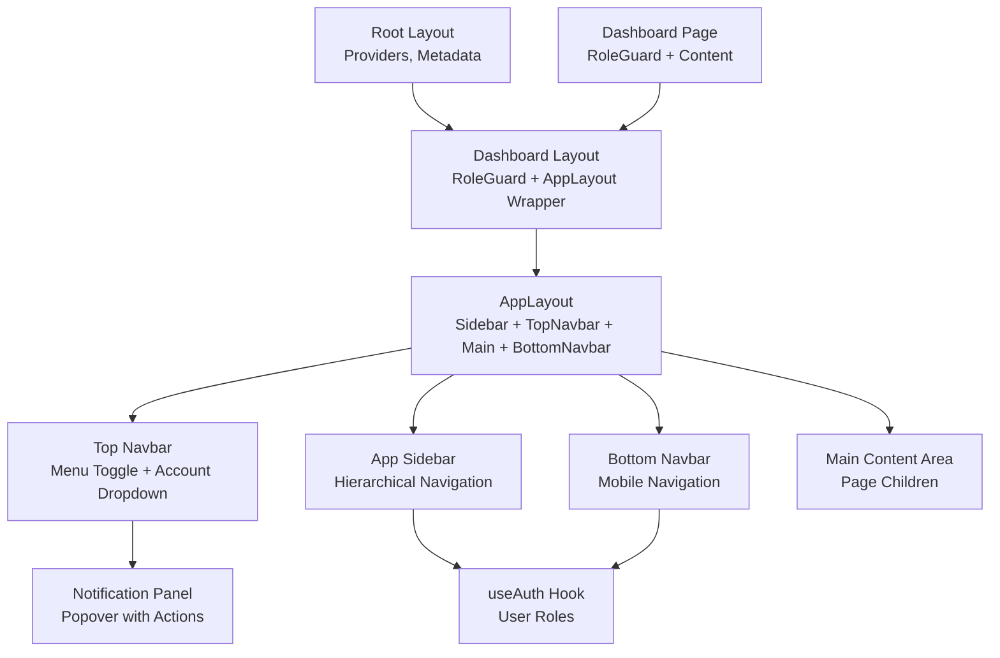
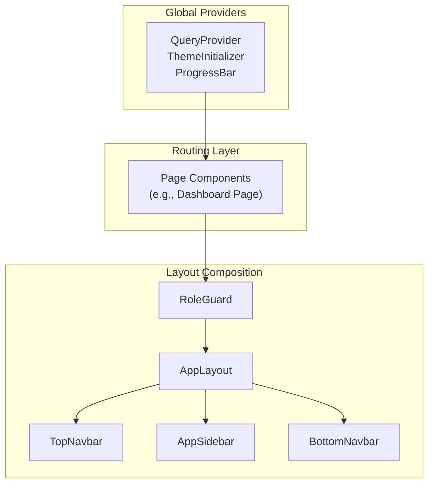
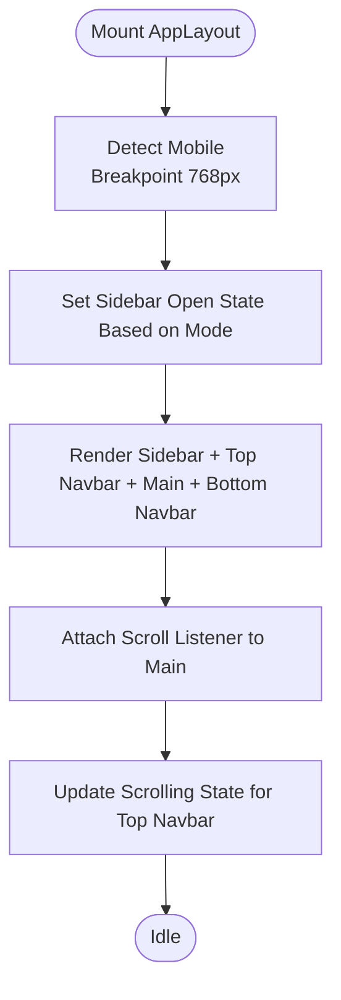
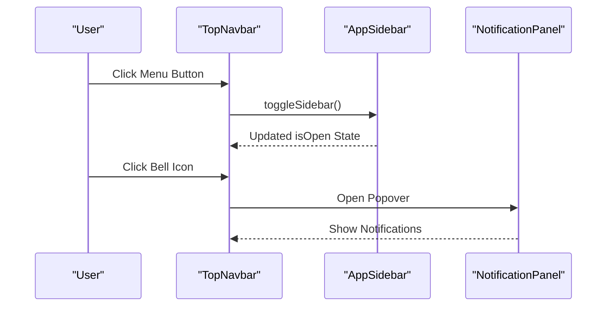
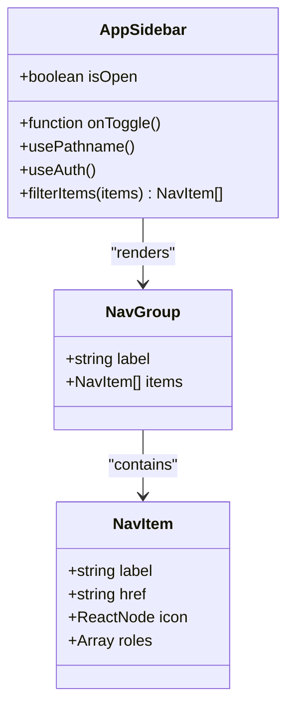
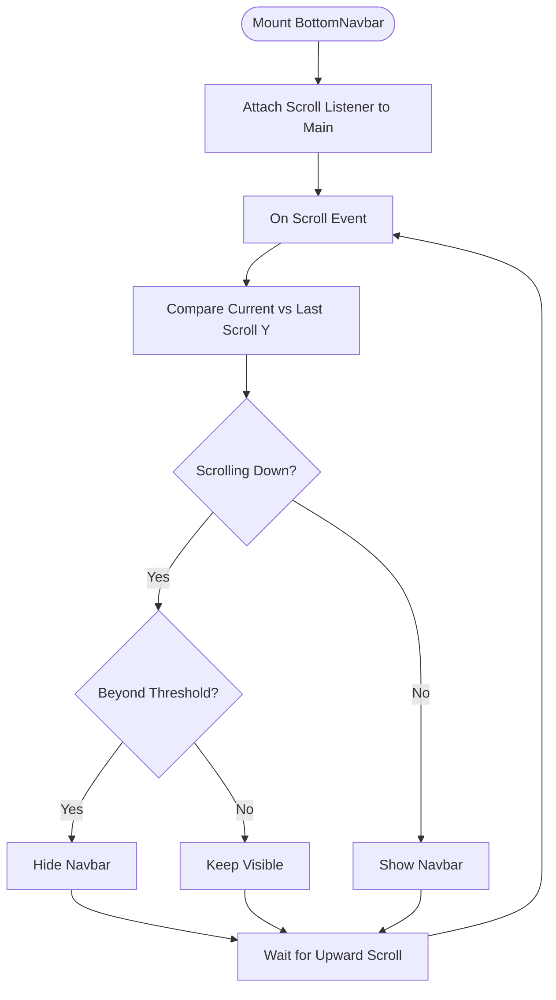
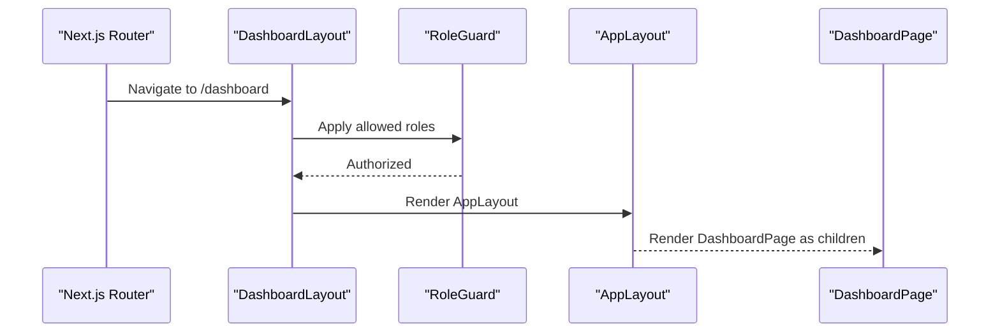
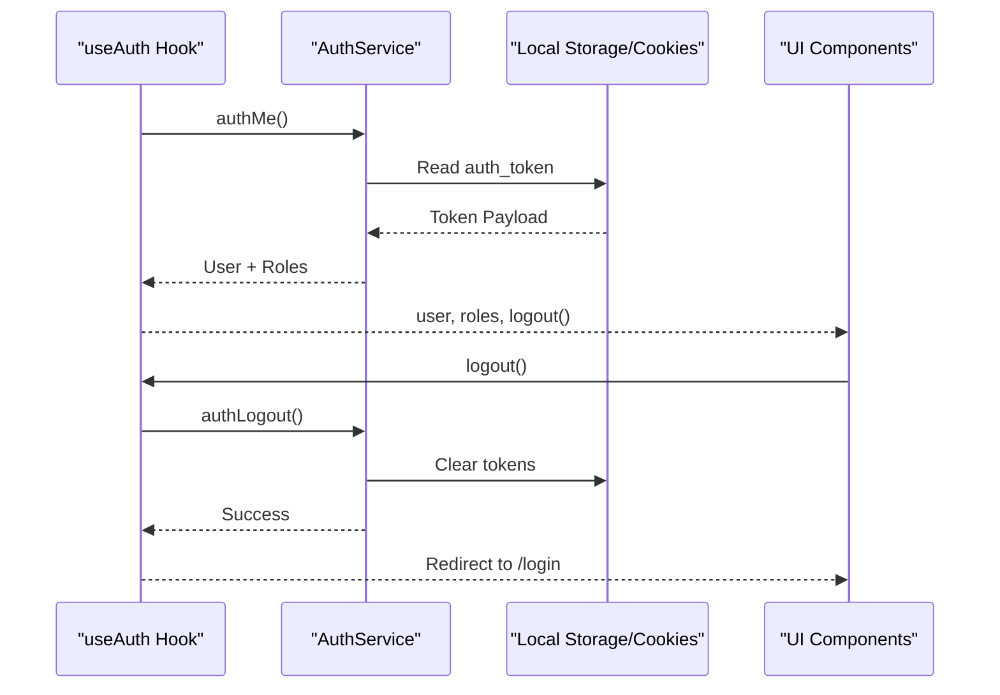
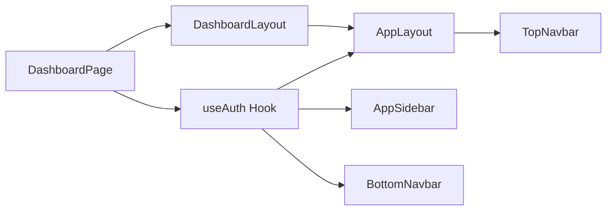

# Layout Architecture

<cite>
**Referenced Files in This Document**
- [root layout](file://src/app/layout.tsx)
- [dashboard layout](file://src/app/dashboard/layout.tsx)
- [dashboard page](file://src/app/dashboard/page.tsx)
- [app layout](file://src/components/app-layout.tsx)
- [top navbar](file://src/components/top-navbar.tsx)
- [app sidebar](file://src/components/app-sidebar.tsx)
- [bottom navbar](file://src/components/bottom-navbar.tsx)
- [notification panel](file://src/components/notification-panel.tsx)
- [use-auth hook](file://src/hooks/use-auth.ts)
- [use-mobile hook](file://src/hooks/use-mobile.ts)
- [auth service](file://src/lib/auth.ts)
</cite>

## Table of Contents
1. [Introduction](#introduction)
2. [Project Structure](#project-structure)
3. [Core Components](#core-components)
4. [Architecture Overview](#architecture-overview)
5. [Detailed Component Analysis](#detailed-component-analysis)
6. [Dependency Analysis](#dependency-analysis)
7. [Performance Considerations](#performance-considerations)
8. [Troubleshooting Guide](#troubleshooting-guide)
9. [Conclusion](#conclusion)

## Introduction
This document describes the POS application's layout architecture, focusing on the main app layout structure, navigation components, and responsive design implementation. It explains the top navbar functionality, sidebar navigation, bottom navbar for mobile, and hierarchical navigation systems. It also documents layout composition patterns, responsive breakpoints, and mobile-first design approach, along with guidelines for adding new navigation items, customizing layouts, and maintaining consistency across screen sizes. The relationship between layout components and page routing is addressed, alongside accessibility considerations for navigation and keyboard shortcuts. Examples of layout customization and integration with authentication state are included.

## Project Structure
The layout system is composed of:
- Root layout provider setup for global providers and metadata
- Dashboard layout wrapper that enforces role-based access and composes the main app layout
- App layout that orchestrates the sidebar, top navbar, main content area, and bottom navbar
- Navigation components: top navbar, sidebar, and bottom navbar
- Authentication integration via a dedicated hook and service utilities
- Responsive utilities and mobile detection

**Diagram sources**
- [root layout:1-42](file://src/app/layout.tsx#L1-L42)
- [dashboard layout:1-38](file://src/app/dashboard/layout.tsx#L1-L38)
- [app layout:1-128](file://src/components/app-layout.tsx#L1-L128)
- [top navbar:1-115](file://src/components/top-navbar.tsx#L1-L115)
- [app sidebar:1-238](file://src/components/app-sidebar.tsx#L1-L238)
- [bottom navbar:1-139](file://src/components/bottom-navbar.tsx#L1-L139)
- [notification panel:1-282](file://src/components/notification-panel.tsx#L1-L282)
- [use-auth hook:1-34](file://src/hooks/use-auth.ts#L1-L34)
- [dashboard page:1-633](file://src/app/dashboard/page.tsx#L1-L633)

**Section sources**
- [root layout:1-42](file://src/app/layout.tsx#L1-L42)
- [dashboard layout:1-38](file://src/app/dashboard/layout.tsx#L1-L38)

## Core Components
- Root Layout: Initializes providers (React Query, Theme, Progress Bar), metadata, and global styles.
- Dashboard Layout: Applies role-based access control and wraps pages in the main AppLayout.
- App Layout: Central layout orchestrator managing sidebar visibility, mobile detection, scroll effects, and child rendering.
- Top Navbar: Provides menu toggle, branding, theme toggle, notifications, and user account actions.
- App Sidebar: Hierarchical navigation grouped by functional areas, role-filtered, and responsive.
- Bottom Navbar: Mobile-focused navigation with auto-hide on scroll and role-based filtering.
- Notification Panel: Popover-based notification center with read/unread controls.
- Authentication Hook: Fetches and exposes user data, roles, and logout mutation.
- Mobile Detection Hook: Provides responsive breakpoint awareness.

**Section sources**
- [app layout:1-128](file://src/components/app-layout.tsx#L1-L128)
- [top navbar:1-115](file://src/components/top-navbar.tsx#L1-L115)
- [app sidebar:1-238](file://src/components/app-sidebar.tsx#L1-L238)
- [bottom navbar:1-139](file://src/components/bottom-navbar.tsx#L1-L139)
- [notification panel:1-282](file://src/components/notification-panel.tsx#L1-L282)
- [use-auth hook:1-34](file://src/hooks/use-auth.ts#L1-L34)
- [use-mobile hook:1-20](file://src/hooks/use-mobile.ts#L1-L20)

## Architecture Overview
The layout architecture follows a layered composition pattern:
- Providers at the root level enable global state and theming.
- Dashboard layout applies role guards and composes the main AppLayout.
- AppLayout coordinates three navigation layers: top, sidebar, and bottom.
- Navigation components are role-aware and responsive.
- Routing is handled by Next.js app directory with page components as children.

**Diagram sources**
- [root layout:1-42](file://src/app/layout.tsx#L1-L42)
- [dashboard layout:1-38](file://src/app/dashboard/layout.tsx#L1-L38)
- [app layout:1-128](file://src/components/app-layout.tsx#L1-L128)
- [top navbar:1-115](file://src/components/top-navbar.tsx#L1-L115)
- [app sidebar:1-238](file://src/components/app-sidebar.tsx#L1-L238)
- [bottom navbar:1-139](file://src/components/bottom-navbar.tsx#L1-L139)

## Detailed Component Analysis

### App Layout
AppLayout manages:
- Sidebar open/close state and mobile detection
- Scroll-aware top navbar styling
- Child rendering within a scrollable main area
- Conditional bottom navbar visibility

Responsive behavior:
- Uses a fixed breakpoint to determine mobile mode
- Adjusts sidebar and bottom navbar visibility accordingly
- Applies scroll handlers to update top navbar appearance

Accessibility:
- Uses semantic HTML and proper focus order
- Ensures keyboard navigable dropdown menus

**Diagram sources**
- [app layout:18-45](file://src/components/app-layout.tsx#L18-L45)

**Section sources**
- [app layout:1-128](file://src/components/app-layout.tsx#L1-L128)

### Top Navbar
Top Navbar provides:
- Menu toggle to control sidebar visibility
- Branding link that hides on narrow screens when sidebar is open
- Notification panel trigger with unread count
- Theme toggle
- User account dropdown with settings and logout

Integration:
- Receives user data and logout handler from AppLayout
- Uses NotificationPanel for centralized notification UX

Accessibility:
- Dropdown menus support keyboard navigation
- Icons accompanied by text for clarity

**Diagram sources**
- [top navbar:36-47](file://src/components/top-navbar.tsx#L36-L47)
- [app sidebar:157-164](file://src/components/app-sidebar.tsx#L157-L164)
- [notification panel:147-157](file://src/components/notification-panel.tsx#L147-L157)

**Section sources**
- [top navbar:1-115](file://src/components/top-navbar.tsx#L1-L115)
- [notification panel:1-282](file://src/components/notification-panel.tsx#L1-L282)

### App Sidebar
App Sidebar implements:
- Hierarchical navigation groups with role-based filtering
- Active state highlighting based on current path
- Scrollable navigation area with custom scrollbar styling
- Mobile overlay and close button
- Dynamic icon and label rendering

Navigation structure:
- Groups: Main, Inventory, Finance, System
- Items: Home, Cashier, Products & Stock, Purchases & Suppliers, Customers & Balances, Operational & Tax, Reports, Notifications, User & Access, Master Data, Settings
- Role permissions: "admin toko" and "admin sistem"

Responsive behavior:
- Translates off-screen on mobile and overlays content
- Auto-collapses on item selection on small screens

**Diagram sources**
- [app sidebar:25-122](file://src/components/app-sidebar.tsx#L25-L122)

**Section sources**
- [app sidebar:1-238](file://src/components/app-sidebar.tsx#L1-L238)

### Bottom Navbar
Bottom Navbar offers:
- Mobile-first navigation with five primary items
- Auto-hide/show behavior based on scroll direction and threshold
- Role-based visibility for specialized items
- Active state indication with pill-shaped icon highlight

Responsive behavior:
- Hidden on desktop (md breakpoint)
- Uses a dedicated scroll listener attached to the main content area

**Diagram sources**
- [bottom navbar:65-86](file://src/components/bottom-navbar.tsx#L65-L86)

**Section sources**
- [bottom navbar:1-139](file://src/components/bottom-navbar.tsx#L1-L139)

### Dashboard Layout and Page Routing
Dashboard layout:
- Wraps children with RoleGuard to enforce access by roles
- Composes AppLayout around page content
- Sets metadata for page titles

Dashboard page:
- Uses RoleGuard internally for fine-grained access
- Integrates with useAuth to conditionally render content based on roles
- Renders analytics, alerts, and action cards

**Diagram sources**
- [dashboard layout:16-37](file://src/app/dashboard/layout.tsx#L16-L37)
- [dashboard page:233-236](file://src/app/dashboard/page.tsx#L233-L236)

**Section sources**
- [dashboard layout:1-38](file://src/app/dashboard/layout.tsx#L1-L38)
- [dashboard page:1-633](file://src/app/dashboard/page.tsx#L1-L633)

### Authentication Integration
Authentication state is integrated via:
- useAuth hook: fetches user profile, roles, and exposes logout mutation
- RoleGuard components: restrict access based on user roles
- Sidebar and Bottom Navbar: filter navigation items based on roles
- Top Navbar: displays user avatar and role badges

**Diagram sources**
- [use-auth hook:9-22](file://src/hooks/use-auth.ts#L9-L22)
- [auth service:47-75](file://src/lib/auth.ts#L47-L75)

**Section sources**
- [use-auth hook:1-34](file://src/hooks/use-auth.ts#L1-L34)
- [auth service:1-125](file://src/lib/auth.ts#L1-L125)

## Dependency Analysis
Key dependencies and relationships:
- AppLayout depends on useAuth for user and role data
- AppSidebar and BottomNavbar depend on useAuth for role-based filtering
- TopNavbar depends on AppLayout for toggle callback and user data
- DashboardLayout depends on RoleGuard and AppLayout
- DashboardPage depends on RoleGuard and useAuth for conditional rendering

**Diagram sources**
- [use-auth hook:1-34](file://src/hooks/use-auth.ts#L1-L34)
- [app layout:10-16](file://src/components/app-layout.tsx#L10-L16)
- [app sidebar:131-136](file://src/components/app-sidebar.tsx#L131-L136)
- [bottom navbar:61-61](file://src/components/bottom-navbar.tsx#L61-L61)
- [top navbar:24-24](file://src/components/top-navbar.tsx#L24-L24)
- [dashboard layout:3-3](file://src/app/dashboard/layout.tsx#L3-L3)
- [dashboard page:131-131](file://src/app/dashboard/page.tsx#L131-L131)

**Section sources**
- [use-auth hook:1-34](file://src/hooks/use-auth.ts#L1-L34)
- [app layout:1-128](file://src/components/app-layout.tsx#L1-L128)
- [app sidebar:1-238](file://src/components/app-sidebar.tsx#L1-L238)
- [bottom navbar:1-139](file://src/components/bottom-navbar.tsx#L1-L139)
- [top navbar:1-115](file://src/components/top-navbar.tsx#L1-L115)
- [dashboard layout:1-38](file://src/app/dashboard/layout.tsx#L1-L38)
- [dashboard page:1-633](file://src/app/dashboard/page.tsx#L1-L633)

## Performance Considerations
- Efficient re-renders: AppLayout memoizes filtered navigation items and uses lightweight state updates for sidebar and scroll.
- Scroll listeners: BottomNavbar attaches a passive scroll listener to main content to minimize layout thrashing.
- Provider initialization: Root layout initializes providers once to avoid redundant work.
- Role filtering: Sidebar and Bottom Navbar compute filtered lists based on roles to reduce DOM nodes.
- Lazy loading: NotificationPanel defers heavy operations until popover opens.

## Troubleshooting Guide
Common issues and resolutions:
- Sidebar not toggling on mobile:
  - Verify AppLayout toggle handler is passed to AppSidebar and TopNavbar.
  - Ensure responsive breakpoint logic matches device width.
- Bottom navbar not hiding on scroll:
  - Confirm scroll listener targets the correct main element.
  - Check scroll thresholds and direction comparison logic.
- Navigation items missing for roles:
  - Validate role arrays in AppSidebar and Bottom Navbar match backend roles.
  - Confirm useAuth returns expected roles array.
- Logout not redirecting:
  - Ensure useAuth logout mutation completes and removes queries.
  - Verify router push target and protected routes.

**Section sources**
- [app layout:38-45](file://src/components/app-layout.tsx#L38-L45)
- [bottom navbar:65-86](file://src/components/bottom-navbar.tsx#L65-L86)
- [app sidebar:133-136](file://src/components/app-sidebar.tsx#L133-L136)
- [use-auth hook:16-22](file://src/hooks/use-auth.ts#L16-L22)

## Conclusion
The POS application employs a robust, mobile-first layout architecture centered on AppLayout. Three navigation layers—top, sidebar, and bottom—provide consistent access across devices while respecting user roles. RoleGuard ensures secure access, and the use-auth hook centralizes authentication state. The design emphasizes responsive breakpoints, accessibility, and maintainable composition patterns, enabling straightforward customization and extension.