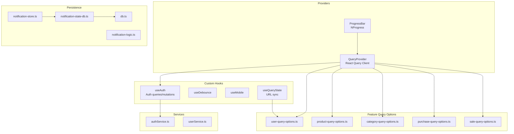
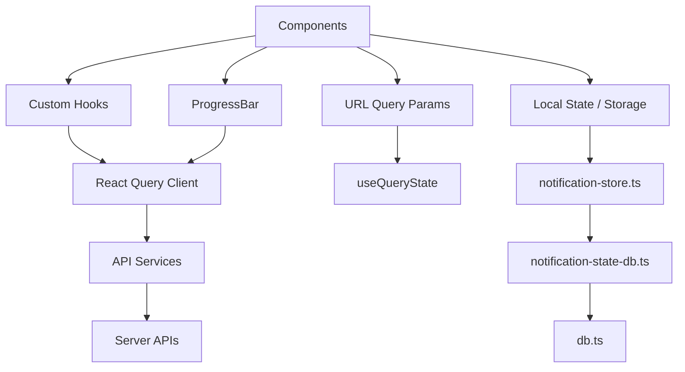
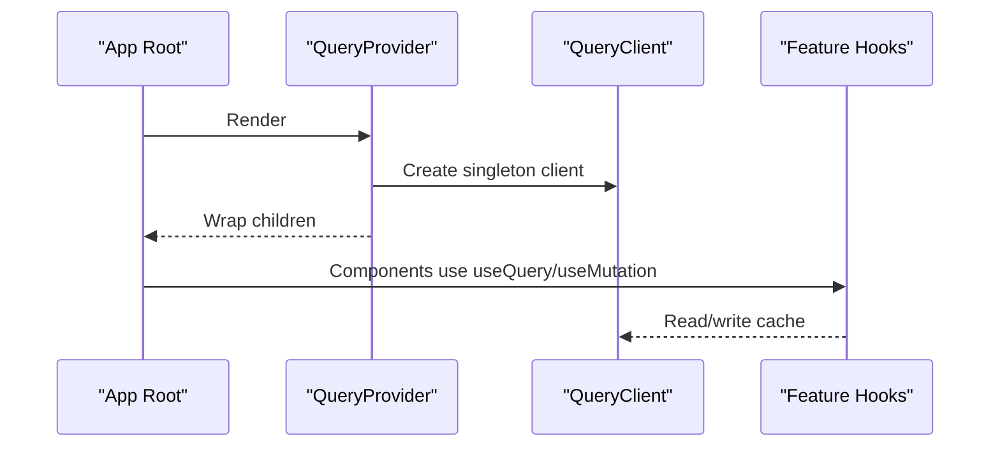
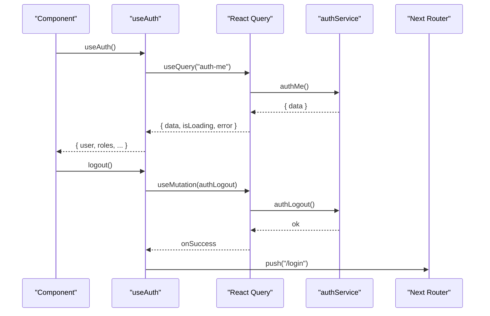
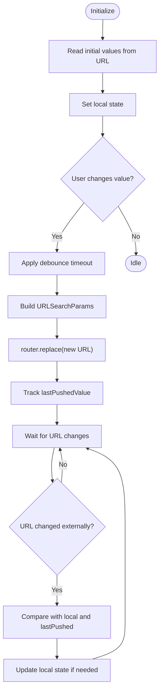
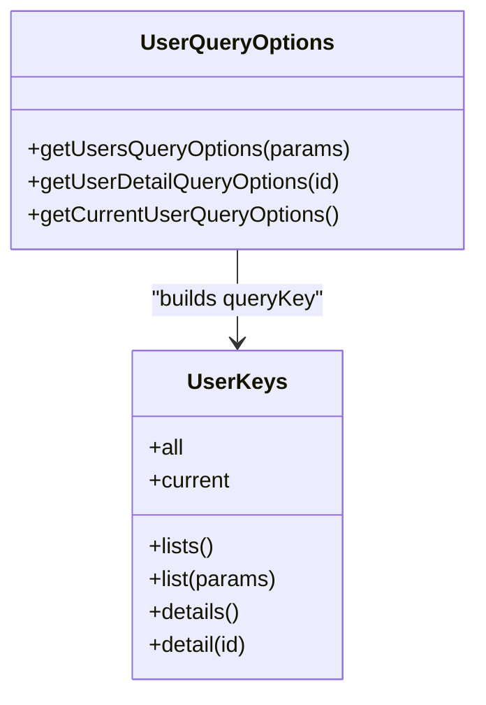
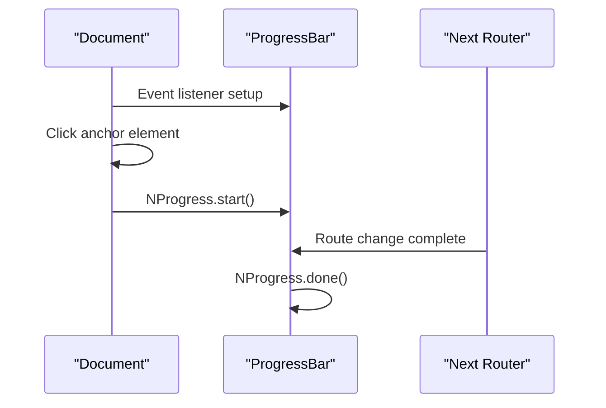
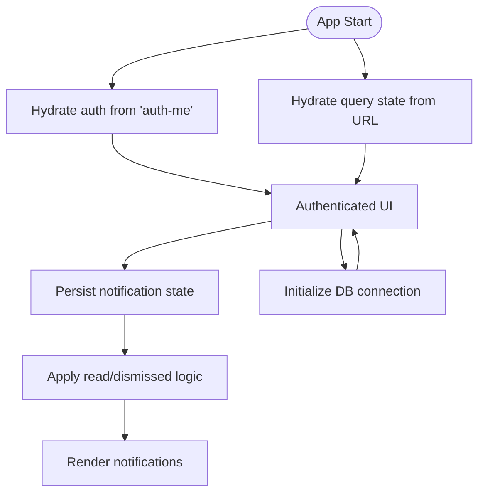
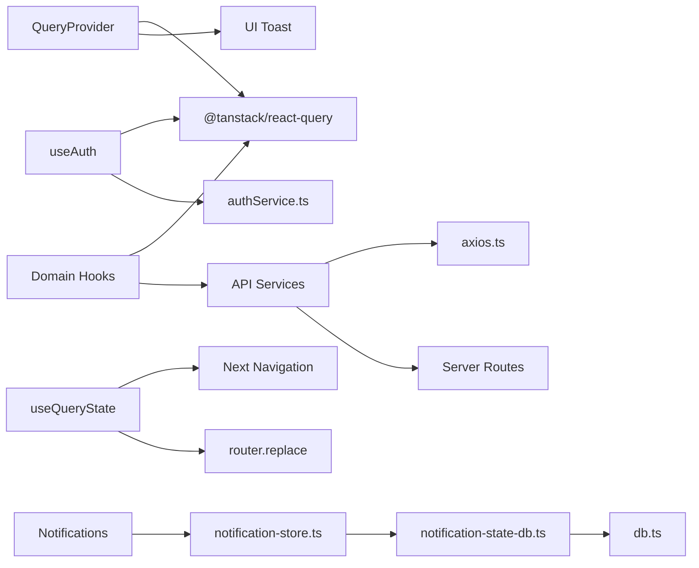

# State Management

<cite>
**Referenced Files in This Document**
- [QueryProvider.tsx](file://src/components/providers/QueryProvider.tsx)
- [ProgressBar.tsx](file://src/components/providers/ProgressBar.tsx)
- [use-auth.ts](file://src/hooks/use-auth.ts)
- [use-query-state.ts](file://src/hooks/use-query-state.ts)
- [use-debounce.ts](file://src/hooks/use-debounce.ts)
- [use-mobile.ts](file://src/hooks/use-mobile.ts)
- [user-query-options.ts](file://src/hooks/users/user-query-options.ts)
- [product-query-options.ts](file://src/hooks/products/product-query-options.ts)
- [category-query-options.ts](file://src/hooks/categories/category-query-options.ts)
- [purchase-query-options.ts](file://src/hooks/purchases/purchase-query-options.ts)
- [sale-query-options.ts](file://src/hooks/sales/sale-query-options.ts)
- [notification-store.ts](file://src/app/api/notifications/_lib/notification-store.ts)
- [notification-state-db.ts](file://src/app/api/notifications/_lib/notification-state-db.ts)
- [notification-logic.ts](file://src/app/api/notifications/_lib/notification-logic.ts)
- [db.ts](file://src/lib/db.ts)
- [axios.ts](file://src/lib/axios.ts)
- [authService.ts](file://src/services/authService.ts)
- [userService.ts](file://src/services/userService.ts)
- [layout.tsx](file://src/app/layout.tsx)
- [page.tsx](file://src/app/page.tsx)
</cite>

## Table of Contents
1. [Introduction](#introduction)
2. [Project Structure](#project-structure)
3. [Core Components](#core-components)
4. [Architecture Overview](#architecture-overview)
5. [Detailed Component Analysis](#detailed-component-analysis)
6. [Dependency Analysis](#dependency-analysis)
7. [Performance Considerations](#performance-considerations)
8. [Troubleshooting Guide](#troubleshooting-guide)
9. [Conclusion](#conclusion)
10. [Appendices](#appendices)

## Introduction
This document explains the POS application's state management patterns with a focus on:
- React Query integration for server state management, caching, and synchronization
- Custom hooks for authentication, query state, debounced inputs, and responsive detection
- Provider pattern for global state via QueryClientProvider and progress indicators
- State hydration, persistence strategies, and optimistic updates
- Data fetching patterns, error handling, and loading states
- Performance optimization, cache invalidation, and real-time update strategies
- Guidelines for building new custom hooks aligned with the existing architecture

## Project Structure
The state management architecture centers around:
- A single QueryClientProvider at the app root
- Per-feature query keys and query options factories
- Custom hooks that encapsulate React Query usage and local UI state
- URL-backed state synchronization for filters and pagination
- Progress indication during navigation
- Notification state management with local persistence

**Diagram sources**
- [QueryProvider.tsx:1-30](file://src/components/providers/QueryProvider.tsx#L1-L30)
- [ProgressBar.tsx:1-41](file://src/components/providers/ProgressBar.tsx#L1-L41)
- [use-auth.ts:1-33](file://src/hooks/use-auth.ts#L1-L33)
- [use-query-state.ts:1-118](file://src/hooks/use-query-state.ts#L1-L118)
- [use-debounce.ts:1-17](file://src/hooks/use-debounce.ts#L1-L17)
- [use-mobile.ts](file://src/hooks/use-mobile.ts)
- [user-query-options.ts:1-34](file://src/hooks/users/user-query-options.ts#L1-L34)
- [product-query-options.ts](file://src/hooks/products/product-query-options.ts)
- [category-query-options.ts](file://src/hooks/categories/category-query-options.ts)
- [purchase-query-options.ts](file://src/hooks/purchases/purchase-query-options.ts)
- [sale-query-options.ts](file://src/hooks/sales/sale-query-options.ts)
- [notification-store.ts](file://src/app/api/notifications/_lib/notification-store.ts)
- [notification-state-db.ts](file://src/app/api/notifications/_lib/notification-state-db.ts)
- [notification-logic.ts](file://src/app/api/notifications/_lib/notification-logic.ts)
- [db.ts:1-48](file://src/lib/db.ts#L1-L48)
- [axios.ts](file://src/lib/axios.ts)
- [authService.ts](file://src/services/authService.ts)
- [userService.ts](file://src/services/userService.ts)
- [layout.tsx](file://src/app/layout.tsx)
- [page.tsx](file://src/app/page.tsx)

**Section sources**
- [QueryProvider.tsx:1-30](file://src/components/providers/QueryProvider.tsx#L1-L30)
- [ProgressBar.tsx:1-41](file://src/components/providers/ProgressBar.tsx#L1-L41)
- [use-auth.ts:1-33](file://src/hooks/use-auth.ts#L1-L33)
- [use-query-state.ts:1-118](file://src/hooks/use-query-state.ts#L1-L118)
- [use-debounce.ts:1-17](file://src/hooks/use-debounce.ts#L1-L17)
- [use-mobile.ts](file://src/hooks/use-mobile.ts)
- [user-query-options.ts:1-34](file://src/hooks/users/user-query-options.ts#L1-L34)
- [product-query-options.ts](file://src/hooks/products/product-query-options.ts)
- [category-query-options.ts](file://src/hooks/categories/category-query-options.ts)
- [purchase-query-options.ts](file://src/hooks/purchases/purchase-query-options.ts)
- [sale-query-options.ts](file://src/hooks/sales/sale-query-options.ts)
- [notification-store.ts](file://src/app/api/notifications/_lib/notification-store.ts)
- [notification-state-db.ts](file://src/app/api/notifications/_lib/notification-state-db.ts)
- [notification-logic.ts](file://src/app/api/notifications/_lib/notification-logic.ts)
- [db.ts:1-48](file://src/lib/db.ts#L1-L48)
- [axios.ts](file://src/lib/axios.ts)
- [authService.ts](file://src/services/authService.ts)
- [userService.ts](file://src/services/userService.ts)
- [layout.tsx](file://src/app/layout.tsx)
- [page.tsx](file://src/app/page.tsx)

## Core Components
- QueryProvider: Creates a singleton QueryClient and wraps the app with QueryClientProvider. It also renders a toast container for notifications.
- useAuth: Encapsulates authentication state via a persisted "auth-me" query with controlled staleTime and a logout mutation that clears the cache and navigates to login.
- useQueryState: Two-way synchronization between local state and URL query parameters with optional debouncing, scroll control, and loop prevention.
- useDebounce: Simple debounced value hook used for search inputs and similar UI events.
- useMobile: Responsive detection hook returning a boolean for mobile breakpoints.
- Feature query options: Centralized queryKey factories and queryOptions builders per domain (users, products, categories, purchases, sales).
- ProgressBar: NProgress integration to indicate navigation progress on client-side routing.

**Section sources**
- [QueryProvider.tsx:1-30](file://src/components/providers/QueryProvider.tsx#L1-L30)
- [use-auth.ts:1-33](file://src/hooks/use-auth.ts#L1-L33)
- [use-query-state.ts:1-118](file://src/hooks/use-query-state.ts#L1-L118)
- [use-debounce.ts:1-17](file://src/hooks/use-debounce.ts#L1-L17)
- [use-mobile.ts](file://src/hooks/use-mobile.ts)
- [user-query-options.ts:1-34](file://src/hooks/users/user-query-options.ts#L1-L34)

## Architecture Overview
The state management architecture follows a layered approach:
- Providers: Global React Query client and progress indicator
- Domain hooks: Feature-specific query options and hooks
- Services: API clients used by React Query queryFns
- Persistence: Local notification state and IndexedDB-backed storage
- UI: Components consuming hooks and displaying loading/error states

**Diagram sources**
- [QueryProvider.tsx:1-30](file://src/components/providers/QueryProvider.tsx#L1-L30)
- [ProgressBar.tsx:1-41](file://src/components/providers/ProgressBar.tsx#L1-L41)
- [use-query-state.ts:1-118](file://src/hooks/use-query-state.ts#L1-L118)
- [notification-store.ts](file://src/app/api/notifications/_lib/notification-store.ts)
- [notification-state-db.ts](file://src/app/api/notifications/_lib/notification-state-db.ts)
- [db.ts:1-48](file://src/lib/db.ts#L1-L48)

## Detailed Component Analysis

### React Query Provider Pattern
- Purpose: Centralizes cache lifecycle and exposes a singleton QueryClient to the app.
- Behavior: Provides a global cache, toast integration, and a place to configure default query and mutation behaviors.
- Integration: Wrapped at the app root to ensure all components can access queryClient and useQuery/useMutation.

**Diagram sources**
- [QueryProvider.tsx:1-30](file://src/components/providers/QueryProvider.tsx#L1-L30)

**Section sources**
- [QueryProvider.tsx:1-30](file://src/components/providers/QueryProvider.tsx#L1-L30)

### Authentication State Management (useAuth)
- Query: "auth-me" with retry disabled and a 5-minute staleTime to balance freshness and performance.
- Mutation: Logout clears the "auth-me" query and redirects to login.
- Exposed values: user, roles, isLoading, isAuthenticated, isError, logout, isLoggingOut.

**Diagram sources**
- [use-auth.ts:1-33](file://src/hooks/use-auth.ts#L1-L33)
- [authService.ts](file://src/services/authService.ts)

**Section sources**
- [use-auth.ts:1-33](file://src/hooks/use-auth.ts#L1-L33)
- [authService.ts](file://src/services/authService.ts)

### URL-Backed Query State (useQueryState and useQueryStates)
- Purpose: Keep UI state synchronized with URL query parameters for filters, pagination, and selections.
- Features:
  - Two-way binding: URL changes update local state; local changes update URL after debounce.
  - Debounce support to reduce router pushes during rapid input.
  - Scroll behavior control to prevent unwanted scrolling on URL updates.
  - Loop prevention using a ref tracking the last pushed value(s).
- useQueryStates: Manages multiple parameters at once with local state for immediate UI feedback.

**Diagram sources**
- [use-query-state.ts:1-118](file://src/hooks/use-query-state.ts#L1-L118)

**Section sources**
- [use-query-state.ts:1-118](file://src/hooks/use-query-state.ts#L1-L118)

### Debounced Inputs (useDebounce)
- Purpose: Provide a debounced value to stabilize expensive operations like search queries.
- Typical usage: Feed search input value into a query key to avoid firing requests on every keystroke.

**Section sources**
- [use-debounce.ts:1-17](file://src/hooks/use-debounce.ts#L1-L17)

### Responsive Design Detection (useMobile)
- Purpose: Detect mobile viewport to adapt UI behavior and rendering.
- Typical usage: Conditionally render mobile-friendly components or adjust layouts.

**Section sources**
- [use-mobile.ts](file://src/hooks/use-mobile.ts)

### Feature Query Keys and Options
- Pattern: Each domain defines a typed keys factory and queryOptions builders.
- Benefits: Consistent cache keys, easy invalidation, and predictable queryFn wiring.
- Examples:
  - Users: lists, detail(id), current-user keys and corresponding queryOptions.
  - Products: list/detail keys and queryOptions.
  - Categories: list/detail keys and queryOptions.
  - Purchases/Sales: list/detail keys and queryOptions.

**Diagram sources**
- [user-query-options.ts:1-34](file://src/hooks/users/user-query-options.ts#L1-L34)

**Section sources**
- [user-query-options.ts:1-34](file://src/hooks/users/user-query-options.ts#L1-L34)
- [product-query-options.ts](file://src/hooks/products/product-query-options.ts)
- [category-query-options.ts](file://src/hooks/categories/category-query-options.ts)
- [purchase-query-options.ts](file://src/hooks/purchases/purchase-query-options.ts)
- [sale-query-options.ts](file://src/hooks/sales/sale-query-options.ts)

### Progress Bar During Navigation
- Purpose: Provide visual feedback during client-side navigation.
- Behavior: Starts on external link clicks, finishes on route changes.

**Diagram sources**
- [ProgressBar.tsx:1-41](file://src/components/providers/ProgressBar.tsx#L1-L41)

**Section sources**
- [ProgressBar.tsx:1-41](file://src/components/providers/ProgressBar.tsx#L1-L41)

### State Hydration, Persistence, and Optimistic Updates
- Hydration:
  - Authentication: Initial hydration from the "auth-me" query with a 5-minute staleTime.
  - URL-backed state: Hydration from URL on mount, with local overrides for immediate UI responsiveness.
- Persistence:
  - Notifications: Local state management with a store and IndexedDB-backed state database. Logic applies read/dismissed states to items.
  - Database: Drizzle ORM with a connection string resolver and instance caching to avoid recreation overhead.
- Optimistic Updates:
  - Recommended pattern: Use useMutation with optimistic updates by updating the cache immediately, then rolling back on error or syncing with a successful server response.

**Diagram sources**
- [use-auth.ts:1-33](file://src/hooks/use-auth.ts#L1-L33)
- [use-query-state.ts:1-118](file://src/hooks/use-query-state.ts#L1-L118)
- [notification-store.ts](file://src/app/api/notifications/_lib/notification-store.ts)
- [notification-state-db.ts](file://src/app/api/notifications/_lib/notification-state-db.ts)
- [notification-logic.ts](file://src/app/api/notifications/_lib/notification-logic.ts)
- [db.ts:1-48](file://src/lib/db.ts#L1-L48)

**Section sources**
- [use-auth.ts:1-33](file://src/hooks/use-auth.ts#L1-L33)
- [use-query-state.ts:1-118](file://src/hooks/use-query-state.ts#L1-L118)
- [notification-store.ts](file://src/app/api/notifications/_lib/notification-store.ts)
- [notification-state-db.ts](file://src/app/api/notifications/_lib/notification-state-db.ts)
- [notification-logic.ts](file://src/app/api/notifications/_lib/notification-logic.ts)
- [db.ts:1-48](file://src/lib/db.ts#L1-L48)

### Data Fetching Patterns, Error Handling, and Loading States
- Data fetching:
  - useQuery with domain-specific query keys and queryFns from services.
  - useQueryState for URL-backed filters; combine with useDebounce to throttle requests.
- Error handling:
  - useAuth exposes isError and error for authentication checks.
  - React Query handles network errors; use default error UI or toast integration via the provider.
- Loading states:
  - isLoading from useAuth indicates pending authentication checks.
  - Components should render skeletons or loading indicators while queries are fetching.

**Section sources**
- [use-auth.ts:1-33](file://src/hooks/use-auth.ts#L1-L33)
- [use-debounce.ts:1-17](file://src/hooks/use-debounce.ts#L1-L17)
- [QueryProvider.tsx:1-30](file://src/components/providers/QueryProvider.tsx#L1-L30)

### Real-Time Data Updates and Cache Invalidation
- Real-time:
  - Not implemented via websockets in the referenced files; rely on periodic refetch or manual invalidation.
- Cache invalidation:
  - Clear specific queries (e.g., logout clearing "auth-me").
  - Invalidate lists after mutations (e.g., create/update/delete) to force refetch.
  - Use queryKey factories to target caches precisely.

**Section sources**
- [use-auth.ts:1-33](file://src/hooks/use-auth.ts#L1-L33)
- [user-query-options.ts:1-34](file://src/hooks/users/user-query-options.ts#L1-L34)

## Dependency Analysis
- Providers depend on React Query and UI toast components.
- Custom hooks depend on services and React Query.
- Services depend on axios and backend endpoints.
- Persistence depends on IndexedDB and Drizzle ORM.

**Diagram sources**
- [QueryProvider.tsx:1-30](file://src/components/providers/QueryProvider.tsx#L1-L30)
- [use-auth.ts:1-33](file://src/hooks/use-auth.ts#L1-L33)
- [use-query-state.ts:1-118](file://src/hooks/use-query-state.ts#L1-L118)
- [axios.ts](file://src/lib/axios.ts)
- [notification-store.ts](file://src/app/api/notifications/_lib/notification-store.ts)
- [notification-state-db.ts](file://src/app/api/notifications/_lib/notification-state-db.ts)
- [db.ts:1-48](file://src/lib/db.ts#L1-L48)

**Section sources**
- [QueryProvider.tsx:1-30](file://src/components/providers/QueryProvider.tsx#L1-L30)
- [use-auth.ts:1-33](file://src/hooks/use-auth.ts#L1-L33)
- [use-query-state.ts:1-118](file://src/hooks/use-query-state.ts#L1-L118)
- [axios.ts](file://src/lib/axios.ts)
- [notification-store.ts](file://src/app/api/notifications/_lib/notification-store.ts)
- [notification-state-db.ts](file://src/app/api/notifications/_lib/notification-state-db.ts)
- [db.ts:1-48](file://src/lib/db.ts#L1-L48)

## Performance Considerations
- StaleTime and CacheTime: Tune staleTime to balance freshness and network usage (e.g., 5 minutes for auth).
- Query Key Granularity: Use parametrized keys to avoid over-invalidating caches.
- Debouncing: Apply useDebounce for search/filter inputs to reduce request frequency.
- Pagination: Prefer cursor-based pagination and keep pageSize reasonable.
- Background Refetch: Enable selective background refetch for frequently changing lists.
- Progressive Enhancement: Use skeleton loaders and virtualized lists for large datasets.

## Troubleshooting Guide
- Authentication not hydrating:
  - Verify "auth-me" queryKey and retry policy; ensure the endpoint returns expected shape.
- URL state not syncing:
  - Check debounce timing and ensure lastPushedValue prevents loops.
  - Confirm router.replace is called with correct pathname and query string.
- Toast styles not applied:
  - Ensure QueryProvider is wrapping the app and toast options are configured.
- Notifications not persisting:
  - Confirm IndexedDB availability and that notification-state-db initializes schemas.
- Database connection errors:
  - Validate DATABASE_URL/HYPERDRIVE connection string and pool configuration.

**Section sources**
- [use-auth.ts:1-33](file://src/hooks/use-auth.ts#L1-L33)
- [use-query-state.ts:1-118](file://src/hooks/use-query-state.ts#L1-L118)
- [QueryProvider.tsx:1-30](file://src/components/providers/QueryProvider.tsx#L1-L30)
- [notification-state-db.ts](file://src/app/api/notifications/_lib/notification-state-db.ts)
- [db.ts:1-48](file://src/lib/db.ts#L1-L48)

## Conclusion
The POS application employs a clean, scalable state management architecture:
- React Query centralizes server state with typed query keys and robust caching.
- Custom hooks encapsulate UI concerns (URL state, debouncing, responsive detection) and integrate tightly with React Query.
- Providers deliver global cache and progress feedback.
- Persistence and database layers support offline-ready features and reliable state management.
Adhering to the established patterns ensures consistent behavior, maintainability, and performance across the application.

## Appendices

### Creating New Custom Hooks: Guidelines
- Define a queryKey factory and queryOptions builder in a dedicated file under hooks/<domain>.
- Implement a hook that composes useQuery/useMutation/useQueryClient with domain queryOptions.
- If the hook manages UI state, keep it local and optionally synchronize with URL via useQueryState.
- Use useDebounce for inputs that trigger queries.
- Keep retry policies conservative for authentication; enable background refetch for lists.
- Invalidate appropriate query keys after mutations to keep caches consistent.

**Section sources**
- [user-query-options.ts:1-34](file://src/hooks/users/user-query-options.ts#L1-L34)
- [use-query-state.ts:1-118](file://src/hooks/use-query-state.ts#L1-L118)
- [use-debounce.ts:1-17](file://src/hooks/use-debounce.ts#L1-L17)