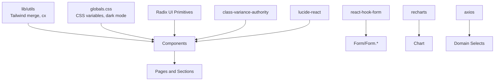
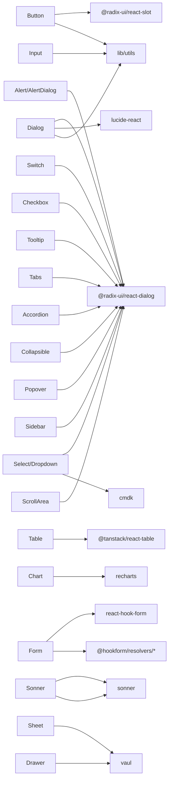

# UI Component Library

<cite>
**Referenced Files in This Document**
- [button.tsx](file://src/components/ui/button.tsx)
- [input.tsx](file://src/components/ui/input.tsx)
- [dialog.tsx](file://src/components/ui/dialog.tsx)
- [table.tsx](file://src/components/ui/table.tsx)
- [card.tsx](file://src/components/ui/card.tsx)
- [badge.tsx](file://src/components/ui/badge.tsx)
- [select.tsx](file://src/components/ui/select.tsx)
- [checkbox.tsx](file://src/components/ui/checkbox.tsx)
- [textarea.tsx](file://src/components/ui/textarea.tsx)
- [switch.tsx](file://src/components/ui/switch.tsx)
- [tooltip.tsx](file://src/components/ui/tooltip.tsx)
- [tabs.tsx](file://src/components/ui/tabs.tsx)
- [breadcrumb.tsx](file://src/components/ui/breadcrumb.tsx)
- [avatar.tsx](file://src/components/ui/avatar.tsx)
- [separator.tsx](file://src/components/ui/separator.tsx)
- [loading.tsx](file://src/components/ui/loading.tsx)
- [skeleton.tsx](file://src/components/ui/skeleton.tsx)
- [pagination.tsx](file://src/components/ui/pagination.tsx)
- [dropdown-menu.tsx](file://src/components/ui/dropdown-menu.tsx)
- [alert.tsx](file://src/components/ui/alert.tsx)
- [alert-dialog.tsx](file://src/components/ui/alert-dialog.tsx)
- [form.tsx](file://src/components/ui/form.tsx)
- [label.tsx](file://src/components/ui/label.tsx)
- [toggle.tsx](file://src/components/ui/toggle.tsx)
- [toggle-group.tsx](file://src/components/ui/toggle-group.tsx)
- [collapsible.tsx](file://src/components/ui/collapsible.tsx)
- [accordion.tsx](file://src/components/ui/accordion.tsx)
- [sheet.tsx](file://src/components/ui/sheet.tsx)
- [drawer.tsx](file://src/components/ui/drawer.tsx)
- [popover.tsx](file://src/components/ui/popover.tsx)
- [sidebar.tsx](file://src/components/ui/sidebar.tsx)
- [scroll-area.tsx](file://src/components/ui/scroll-area.tsx)
- [sonner.tsx](file://src/components/ui/sonner.tsx)
- [chart.tsx](file://src/components/ui/chart.tsx)
- [currency-input.tsx](file://src/components/ui/currency-input.tsx)
- [numeric-input.tsx](file://src/components/ui/numeric-input.tsx)
- [search-input.tsx](file://src/components/ui/search-input.tsx)
- [category-select.tsx](file://src/components/ui/category-select.tsx)
- [customer-select.tsx](file://src/components/ui/customer-select.tsx)
- [supplier-select.tsx](file://src/components/ui/supplier-select.tsx)
- [unit-select.tsx](file://src/components/ui/unit-select.tsx)
- [search-product-dropdown.tsx](file://src/components/ui/search-product-dropdown.tsx)
- [animated-number.tsx](file://src/components/ui/animated-number.tsx)
- [expandable-container.tsx](file://src/components/ui/expandable-container.tsx)
- [sticky-card-wrapper.tsx](file://src/components/ui/sticky-card-wrapper.tsx)
- [view-mode-switch.tsx](file://src/components/ui/view-mode-switch.tsx)
- [error-indicator.tsx](file://src/components/ui/error-indicator.tsx)
- [components.json](file://components.json)
- [globals.css](file://src/app/globals.css)
- [package.json](file://package.json)
</cite>

## Table of Contents
1. [Introduction](#introduction)
2. [Project Structure](#project-structure)
3. [Core Components](#core-components)
4. [Architecture Overview](#architecture-overview)
5. [Detailed Component Analysis](#detailed-component-analysis)
6. [Dependency Analysis](#dependency-analysis)
7. [Performance Considerations](#performance-considerations)
8. [Troubleshooting Guide](#troubleshooting-guide)
9. [Conclusion](#conclusion)
10. [Appendices](#appendices)

## Introduction
This document describes the POS application’s UI component library. It covers reusable components for buttons, forms, inputs, dialogs, tables, cards, charts, and specialized components used across the application. For each component, we explain visual appearance, behavior, user interaction patterns, props, composition patterns, styling customization, theming, accessibility, responsiveness, states/animations/transitions, and extension guidelines. Integration patterns with form libraries and state management are also included.

## Project Structure
The UI components are organized under a shared library and integrated via aliases configured in the project configuration. The library leverages Radix UI primitives, Tailwind CSS, and shadcn-inspired design tokens.

```mermaid
graph TB
subgraph "Project Aliases"
C["@/components"]
U["@/components/ui"]
L["@/lib/utils"]
G["@/src/app/globals.css"]
end
subgraph "UI Library"
BTN["button.tsx"]
INP["input.tsx"]
DLG["dialog.tsx"]
TAB["table.tsx"]
CAR["card.tsx"]
BAD["badge.tsx"]
SEL["select.tsx"]
CHB["checkbox.tsx"]
TXT["textarea.tsx"]
SW["switch.tsx"]
TIP["tooltip.tsx"]
TBAR["tabs.tsx"]
BREAD["breadcrumb.tsx"]
AV["avatar.tsx"]
SEP["separator.tsx"]
LOAD["loading.tsx"]
SKEL["skeleton.tsx"]
PAG["pagination.tsx"]
DDM["dropdown-menu.tsx"]
ALRT["alert.tsx"]
ADLG["alert-dialog.tsx"]
FRM["form.tsx"]
LBL["label.tsx"]
TG["toggle.tsx"]
TGG["toggle-group.tsx"]
CPL["collapsible.tsx"]
ACC["accordion.tsx"]
SH["sheet.tsx"]
DRW["drawer.tsx"]
POP["popover.tsx"]
SB["sidebar.tsx"]
SCRL["scroll-area.tsx"]
SND["sonner.tsx"]
CH["chart.tsx"]
CUR["currency-input.tsx"]
NUM["numeric-input.tsx"]
SRCH["search-input.tsx"]
CAT["category-select.tsx"]
CUST["customer-select.tsx"]
SUP["supplier-select.tsx"]
UNIT["unit-select.tsx"]
SPD["search-product-dropdown.tsx"]
ANIM["animated-number.tsx"]
EXP["expandable-container.tsx"]
STICK["sticky-card-wrapper.tsx"]
VIEW["view-mode-switch.tsx"]
ERR["error-indicator.tsx"]
end
U --> BTN
U --> INP
U --> DLG
U --> TAB
U --> CAR
U --> BAD
U --> SEL
U --> CHB
U --> TXT
U --> SW
U --> TIP
U --> TBAR
U --> BREAD
U --> AV
U --> SEP
U --> LOAD
U --> SKEL
U --> PAG
U --> DDM
U --> ALRT
U --> ADLG
U --> FRM
U --> LBL
U --> TG
U --> TGG
U --> CPL
U --> ACC
U --> SH
U --> DRW
U --> POP
U --> SB
U --> SCRL
U --> SND
U --> CH
U --> CUR
U --> NUM
U --> SRCH
U --> CAT
U --> CUST
U --> SUP
U --> UNIT
U --> SPD
U --> ANIM
U --> EXP
U --> STICK
U --> VIEW
U --> ERR
```

**Diagram sources**
- [components.json:13-19](file://components.json#L13-L19)
- [button.tsx:1-66](file://src/components/ui/button.tsx#L1-L66)
- [input.tsx:1-22](file://src/components/ui/input.tsx#L1-L22)
- [dialog.tsx:1-144](file://src/components/ui/dialog.tsx#L1-L144)
- [table.tsx](file://src/components/ui/table.tsx)
- [card.tsx](file://src/components/ui/card.tsx)
- [badge.tsx](file://src/components/ui/badge.tsx)
- [select.tsx](file://src/components/ui/select.tsx)
- [checkbox.tsx](file://src/components/ui/checkbox.tsx)
- [textarea.tsx](file://src/components/ui/textarea.tsx)
- [switch.tsx](file://src/components/ui/switch.tsx)
- [tooltip.tsx](file://src/components/ui/tooltip.tsx)
- [tabs.tsx](file://src/components/ui/tabs.tsx)
- [breadcrumb.tsx](file://src/components/ui/breadcrumb.tsx)
- [avatar.tsx](file://src/components/ui/avatar.tsx)
- [separator.tsx](file://src/components/ui/separator.tsx)
- [loading.tsx](file://src/components/ui/loading.tsx)
- [skeleton.tsx](file://src/components/ui/skeleton.tsx)
- [pagination.tsx](file://src/components/ui/pagination.tsx)
- [dropdown-menu.tsx](file://src/components/ui/dropdown-menu.tsx)
- [alert.tsx](file://src/components/ui/alert.tsx)
- [alert-dialog.tsx](file://src/components/ui/alert-dialog.tsx)
- [form.tsx](file://src/components/ui/form.tsx)
- [label.tsx](file://src/components/ui/label.tsx)
- [toggle.tsx](file://src/components/ui/toggle.tsx)
- [toggle-group.tsx](file://src/components/ui/toggle-group.tsx)
- [collapsible.tsx](file://src/components/ui/collapsible.tsx)
- [accordion.tsx](file://src/components/ui/accordion.tsx)
- [sheet.tsx](file://src/components/ui/sheet.tsx)
- [drawer.tsx](file://src/components/ui/drawer.tsx)
- [popover.tsx](file://src/components/ui/popover.tsx)
- [sidebar.tsx](file://src/components/ui/sidebar.tsx)
- [scroll-area.tsx](file://src/components/ui/scroll-area.tsx)
- [sonner.tsx](file://src/components/ui/sonner.tsx)
- [chart.tsx](file://src/components/ui/chart.tsx)
- [currency-input.tsx](file://src/components/ui/currency-input.tsx)
- [numeric-input.tsx](file://src/components/ui/numeric-input.tsx)
- [search-input.tsx](file://src/components/ui/search-input.tsx)
- [category-select.tsx](file://src/components/ui/category-select.tsx)
- [customer-select.tsx](file://src/components/ui/customer-select.tsx)
- [supplier-select.tsx](file://src/components/ui/supplier-select.tsx)
- [unit-select.tsx](file://src/components/ui/unit-select.tsx)
- [search-product-dropdown.tsx](file://src/components/ui/search-product-dropdown.tsx)
- [animated-number.tsx](file://src/components/ui/animated-number.tsx)
- [expandable-container.tsx](file://src/components/ui/expandable-container.tsx)
- [sticky-card-wrapper.tsx](file://src/components/ui/sticky-card-wrapper.tsx)
- [view-mode-switch.tsx](file://src/components/ui/view-mode-switch.tsx)
- [error-indicator.tsx](file://src/components/ui/error-indicator.tsx)

**Section sources**
- [components.json:1-21](file://components.json#L1-L21)

## Core Components
This section summarizes the primary component families and their roles in the UI library.

- Buttons and Controls
  - Button: Variants (default, destructive, outline, secondary, ghost, link), sizes (default, sm, lg, icon, icon-sm, icon-lg), and slot support for semantic wrappers.
  - Toggle/ToggleGroup: Single and group toggles for binary choices.
  - Switch: On/off control with accessible labeling.
  - Checkbox: Multi-state and indeterminate support.
  - Select/Dropdown: Single/multi-selection with searchable dropdowns.
  - Tooltip/Breadcrumb/Avatar/Separator: Auxiliary controls for context and navigation.

- Inputs and Forms
  - Input, Textarea, Label: Core text input primitives.
  - CurrencyInput, NumericInput, SearchInput: Specialized numeric and search inputs.
  - Form/Form.*: Wrapper and field components for form libraries (e.g., react-hook-form).
  - CategorySelect/CustomerSelect/SupplierSelect/UnitSelect/SearchProductDropdown: Domain-specific selects.

- Layout and Containers
  - Card: Content container with optional header/footer.
  - Badge: Status and metadata badges.
  - Pagination: Page navigation controls.
  - ScrollArea: Customizable scrolling regions.
  - Sidebar: Navigation sidebar layout.
  - ExpandableContainer/StickyCardWrapper: Advanced layout helpers.

- Feedback and Overlays
  - Alert/AlertDialog: Inline and modal alerts.
  - Sonner: Global toast notifications.
  - Loading/Skeleton: Loading states and placeholders.
  - ErrorIndicator: Visual error cues.

- Data Display
  - Table: Sortable, filterable, paginated data grid.
  - Chart: Recharts-based chart wrapper.

- Modals and Sheets
  - Dialog/Sheet/Drawer: Overlay containers with close triggers and animations.
  - Popover: Floating overlays anchored to triggers.

- Navigation and Tabs
  - Tabs: Tabbed interface with controlled state.
  - Accordion/Collapsible: Expandable sections.

**Section sources**
- [button.tsx:1-66](file://src/components/ui/button.tsx#L1-L66)
- [input.tsx:1-22](file://src/components/ui/input.tsx#L1-L22)
- [dialog.tsx:1-144](file://src/components/ui/dialog.tsx#L1-L144)
- [table.tsx](file://src/components/ui/table.tsx)
- [card.tsx](file://src/components/ui/card.tsx)
- [badge.tsx](file://src/components/ui/badge.tsx)
- [select.tsx](file://src/components/ui/select.tsx)
- [checkbox.tsx](file://src/components/ui/checkbox.tsx)
- [textarea.tsx](file://src/components/ui/textarea.tsx)
- [switch.tsx](file://src/components/ui/switch.tsx)
- [tooltip.tsx](file://src/components/ui/tooltip.tsx)
- [tabs.tsx](file://src/components/ui/tabs.tsx)
- [breadcrumb.tsx](file://src/components/ui/breadcrumb.tsx)
- [avatar.tsx](file://src/components/ui/avatar.tsx)
- [separator.tsx](file://src/components/ui/separator.tsx)
- [loading.tsx](file://src/components/ui/loading.tsx)
- [skeleton.tsx](file://src/components/ui/skeleton.tsx)
- [pagination.tsx](file://src/components/ui/pagination.tsx)
- [dropdown-menu.tsx](file://src/components/ui/dropdown-menu.tsx)
- [alert.tsx](file://src/components/ui/alert.tsx)
- [alert-dialog.tsx](file://src/components/ui/alert-dialog.tsx)
- [form.tsx](file://src/components/ui/form.tsx)
- [label.tsx](file://src/components/ui/label.tsx)
- [toggle.tsx](file://src/components/ui/toggle.tsx)
- [toggle-group.tsx](file://src/components/ui/toggle-group.tsx)
- [collapsible.tsx](file://src/components/ui/collapsible.tsx)
- [accordion.tsx](file://src/components/ui/accordion.tsx)
- [sheet.tsx](file://src/components/ui/sheet.tsx)
- [drawer.tsx](file://src/components/ui/drawer.tsx)
- [popover.tsx](file://src/components/ui/popover.tsx)
- [sidebar.tsx](file://src/components/ui/sidebar.tsx)
- [scroll-area.tsx](file://src/components/ui/scroll-area.tsx)
- [sonner.tsx](file://src/components/ui/sonner.tsx)
- [chart.tsx](file://src/components/ui/chart.tsx)
- [currency-input.tsx](file://src/components/ui/currency-input.tsx)
- [numeric-input.tsx](file://src/components/ui/numeric-input.tsx)
- [search-input.tsx](file://src/components/ui/search-input.tsx)
- [category-select.tsx](file://src/components/ui/category-select.tsx)
- [customer-select.tsx](file://src/components/ui/customer-select.tsx)
- [supplier-select.tsx](file://src/components/ui/supplier-select.tsx)
- [unit-select.tsx](file://src/components/ui/unit-select.tsx)
- [search-product-dropdown.tsx](file://src/components/ui/search-product-dropdown.tsx)
- [animated-number.tsx](file://src/components/ui/animated-number.tsx)
- [expandable-container.tsx](file://src/components/ui/expandable-container.tsx)
- [sticky-card-wrapper.tsx](file://src/components/ui/sticky-card-wrapper.tsx)
- [view-mode-switch.tsx](file://src/components/ui/view-mode-switch.tsx)
- [error-indicator.tsx](file://src/components/ui/error-indicator.tsx)

## Architecture Overview
The UI library follows a modular, composable architecture:
- Shared design tokens and utilities via Tailwind and class merging.
- Accessible base components built on Radix UI primitives.
- Variants and sizes standardized with class variance authority (CVA).
- Theming via CSS variables and dark mode support.
- Animation and transitions driven by Radix UI and Tailwind utilities.

**Diagram sources**
- [components.json:6-12](file://components.json#L6-L12)
- [button.tsx:3-7](file://src/components/ui/button.tsx#L3-L7)
- [globals.css](file://src/app/globals.css)
- [package.json:25-76](file://package.json#L25-L76)

## Detailed Component Analysis

### Button
- Purpose: Primary action element with consistent spacing, focus styles, and variants.
- Props:
  - variant: default, destructive, outline, secondary, ghost, link
  - size: default, sm, lg, icon, icon-sm, icon-lg
  - asChild: wrap children in a slot for semantics
  - className, rest props passed to button/div
- States and Interactions:
  - Hover/focus-visible ring with accessible focus styles
  - Disabled state with reduced opacity and pointer events
  - SVG sizing handled consistently
- Composition:
  - Use asChild to render links or custom anchors while preserving styles
- Accessibility:
  - Focus-visible ring and aria-invalid support for form integration
- Theming:
  - Uses primary/secondary/accent palette and ring color
- Responsive:
  - Flexible width with padding adjustments per size

**Section sources**
- [button.tsx:7-37](file://src/components/ui/button.tsx#L7-L37)
- [button.tsx:39-63](file://src/components/ui/button.tsx#L39-L63)

### Input
- Purpose: Text input with consistent focus states and invalid state styling.
- Props:
  - type: input type
  - className: additional classes
- States and Interactions:
  - Focus-visible ring and selection highlight
  - Invalid state via aria-invalid with destructive borders/rings
- Accessibility:
  - Proper focus management and selection styling
- Theming:
  - Background and border derived from theme tokens

**Section sources**
- [input.tsx:5-19](file://src/components/ui/input.tsx#L5-L19)

### Dialog
- Purpose: Modal overlay with portal rendering and optional close button.
- Props:
  - Root: standard Dialog root props
  - Trigger/Portal/Close: primitive wrappers
  - Overlay: backdrop with fade animation
  - Content: centered grid with optional close button
  - Header/Footer: layout helpers
  - Title/Description: semantic labeling
- States and Interactions:
  - Open/close via Radix state attributes
  - Close button visibility configurable
  - Animations: fade and zoom on open/close
- Accessibility:
  - Focus trapping and ARIA roles managed by Radix
  - Screen reader labels via title/description
- Composition:
  - Compose Header/Footer with Content
  - Use Trigger to bind to buttons or links

**Section sources**
- [dialog.tsx:9-143](file://src/components/ui/dialog.tsx#L9-L143)

### Table
- Purpose: Paginated, sortable, filterable data grid.
- Props: Implementation depends on @tanstack/react-table integration.
- Features:
  - Column sorting and custom cell renderers
  - Pagination controls
  - Selection and actions
- Accessibility:
  - Proper headers and ARIA attributes for screen readers

**Section sources**
- [table.tsx](file://src/components/ui/table.tsx)

### Card
- Purpose: Content grouping with optional header/footer.
- Props: className, children.
- Composition:
  - Use with Badge, Avatar, and lists inside

**Section sources**
- [card.tsx](file://src/components/ui/card.tsx)

### Badge
- Purpose: Short status or metadata labels.
- Props: variant and className.
- Theming:
  - Color variants mapped to semantic tokens

**Section sources**
- [badge.tsx](file://src/components/ui/badge.tsx)

### Select/Dropdown Menu
- Purpose: Single/multi-selection with searchable dropdowns.
- Props: Controlled/uncontrolled modes, value, onChange, options.
- Accessibility:
  - Keyboard navigation and ARIA roles
- Integration:
  - Often paired with Command for filtering

**Section sources**
- [select.tsx](file://src/components/ui/select.tsx)
- [dropdown-menu.tsx](file://src/components/ui/dropdown-menu.tsx)

### Checkbox
- Purpose: Binary choice with indeterminate support.
- Props: checked, onCheckedChange, disabled, required.
- Accessibility:
  - Proper labeling and keyboard support

**Section sources**
- [checkbox.tsx](file://src/components/ui/checkbox.tsx)

### Textarea
- Purpose: Multi-line text input with consistent focus states.
- Props: rows, cols, className.

**Section sources**
- [textarea.tsx](file://src/components/ui/textarea.tsx)

### Switch
- Purpose: On/off toggle with accessible labeling.
- Props: checked, onCheckedChange, disabled.

**Section sources**
- [switch.tsx](file://src/components/ui/switch.tsx)

### Tooltip
- Purpose: Contextual help text on hover.
- Props: content, side, align.

**Section sources**
- [tooltip.tsx](file://src/components/ui/tooltip.tsx)

### Tabs
- Purpose: Organize content into tabbed sections.
- Props: defaultValue, value, onValueChange.
- Accessibility:
  - Keyboard navigation and ARIA attributes

**Section sources**
- [tabs.tsx](file://src/components/ui/tabs.tsx)

### Breadcrumb
- Purpose: Navigation aid showing current location.
- Props: separator, className.

**Section sources**
- [breadcrumb.tsx](file://src/components/ui/breadcrumb.tsx)

### Avatar
- Purpose: User or entity representation.
- Props: src, alt, fallback.

**Section sources**
- [avatar.tsx](file://src/components/ui/avatar.tsx)

### Separator
- Purpose: Visual divider between sections.
- Props: orientation.

**Section sources**
- [separator.tsx](file://src/components/ui/separator.tsx)

### Loading/Skeleton
- Purpose: Indicate loading states.
- Skeleton: Animated shimmer effect.
- Loading: Spinner or progress indicator.

**Section sources**
- [loading.tsx](file://src/components/ui/loading.tsx)
- [skeleton.tsx](file://src/components/ui/skeleton.tsx)

### Pagination
- Purpose: Navigate large datasets.
- Props: currentPage, totalPages, onPageChange.

**Section sources**
- [pagination.tsx](file://src/components/ui/pagination.tsx)

### Alert/AlertDialog
- Purpose: Inline and modal alerts for feedback.
- Props: title, description, confirm/Cancel actions.

**Section sources**
- [alert.tsx](file://src/components/ui/alert.tsx)
- [alert-dialog.tsx](file://src/components/ui/alert-dialog.tsx)

### Form/Form.*
- Purpose: Form wrapper and field components for form libraries.
- Integration:
  - Works with react-hook-form resolvers
  - Field-level validation and error display
- Props: Control, Name, RenderField, errors, disabled.

**Section sources**
- [form.tsx](file://src/components/ui/form.tsx)

### Label
- Purpose: Associate text with controls.
- Props: htmlFor, className.

**Section sources**
- [label.tsx](file://src/components/ui/label.tsx)

### Toggle/ToggleGroup
- Purpose: Single and grouped toggle switches.
- Props: pressed, onPressedChange, disabled.

**Section sources**
- [toggle.tsx](file://src/components/ui/toggle.tsx)
- [toggle-group.tsx](file://src/components/ui/toggle-group.tsx)

### Collapsible/Accordion
- Purpose: Expandable content sections.
- Props: open, onOpenChange.

**Section sources**
- [collapsible.tsx](file://src/components/ui/collapsible.tsx)
- [accordion.tsx](file://src/components/ui/accordion.tsx)

### Sheet/Drawer
- Purpose: Slide-in panels for modals and navigation.
- Props: open, onOpenChange, side (top/right/bottom/left).

**Section sources**
- [sheet.tsx](file://src/components/ui/sheet.tsx)
- [drawer.tsx](file://src/components/ui/drawer.tsx)

### Popover
- Purpose: Floating overlay anchored to a trigger.
- Props: open, onOpenChange.

**Section sources**
- [popover.tsx](file://src/components/ui/popover.tsx)

### Sidebar
- Purpose: Persistent navigation sidebar.
- Props: children, className.

**Section sources**
- [sidebar.tsx](file://src/components/ui/sidebar.tsx)

### ScrollArea
- Purpose: Custom scrollbar and overflow handling.
- Props: type, offsetScrollbars.

**Section sources**
- [scroll-area.tsx](file://src/components/ui/scroll-area.tsx)

### Sonner
- Purpose: Global toast notifications.
- Props: toast options, position, theme.

**Section sources**
- [sonner.tsx](file://src/components/ui/sonner.tsx)

### Chart
- Purpose: Recharts-based chart wrapper.
- Props: data, series, index, classNames.

**Section sources**
- [chart.tsx](file://src/components/ui/chart.tsx)

### CurrencyInput/NumericInput/SearchInput
- Purpose: Specialized numeric and search inputs with formatting and validation.
- Props: value, onChange, precision, locale, className.

**Section sources**
- [currency-input.tsx](file://src/components/ui/currency-input.tsx)
- [numeric-input.tsx](file://src/components/ui/numeric-input.tsx)
- [search-input.tsx](file://src/components/ui/search-input.tsx)

### CategorySelect/CustomerSelect/SupplierSelect/UnitSelect/SearchProductDropdown
- Purpose: Domain-specific selectors with async loading and search.
- Props: value, onChange, placeholder, disabled.
- Integration:
  - Backed by service APIs and react-query

**Section sources**
- [category-select.tsx](file://src/components/ui/category-select.tsx)
- [customer-select.tsx](file://src/components/ui/customer-select.tsx)
- [supplier-select.tsx](file://src/components/ui/supplier-select.tsx)
- [unit-select.tsx](file://src/components/ui/unit-select.tsx)
- [search-product-dropdown.tsx](file://src/components/ui/search-product-dropdown.tsx)

### AnimatedNumber
- Purpose: Smooth number transitions for counters and metrics.
- Props: value, decimals, duration.

**Section sources**
- [animated-number.tsx](file://src/components/ui/animated-number.tsx)

### ExpandableContainer/StickyCardWrapper/ViewModeSwitch/ErrorIndicator
- Purpose: Advanced layout and UX helpers.
- ExpandableContainer: Collapsible content area.
- StickyCardWrapper: Sticky positioning for cards.
- ViewModeSwitch: Toggle between list/grid views.
- ErrorIndicator: Visual error cue with tooltip.

**Section sources**
- [expandable-container.tsx](file://src/components/ui/expandable-container.tsx)
- [sticky-card-wrapper.tsx](file://src/components/ui/sticky-card-wrapper.tsx)
- [view-mode-switch.tsx](file://src/components/ui/view-mode-switch.tsx)
- [error-indicator.tsx](file://src/components/ui/error-indicator.tsx)

## Dependency Analysis
The UI library relies on external packages for accessibility, animations, and charts. The following diagram shows key dependencies and their roles.

**Diagram sources**
- [button.tsx:2-5](file://src/components/ui/button.tsx#L2-L5)
- [dialog.tsx:3-7](file://src/components/ui/dialog.tsx#L3-L7)
- [table.tsx](file://src/components/ui/table.tsx)
- [chart.tsx](file://src/components/ui/chart.tsx)
- [form.tsx](file://src/components/ui/form.tsx)
- [input.tsx:3](file://src/components/ui/input.tsx#L3)
- [package.json:25-76](file://package.json#L25-L76)

**Section sources**
- [package.json:25-76](file://package.json#L25-L76)

## Performance Considerations
- Prefer virtualized lists for large datasets in Table and similar components.
- Defer heavy computations in tooltips/popovers; use lazy initialization.
- Minimize re-renders by memoizing form values and select options.
- Use CSS containment and contain: layout for heavy cards and modals.
- Avoid unnecessary animations during rapid user interactions.

## Troubleshooting Guide
- Focus ring not visible:
  - Ensure focus-visible styles are enabled and not overridden by global resets.
- Dialog not closing:
  - Verify Close button is present and not hidden via showCloseButton=false.
- Select not filtering:
  - Confirm Command integration and option keys match expected values.
- Form validation not updating:
  - Check resolver compatibility and field names in react-hook-form.
- Dark mode visuals incorrect:
  - Verify CSS variables in globals.css and next-themes provider.

**Section sources**
- [dialog.tsx:52-78](file://src/components/ui/dialog.tsx#L52-L78)
- [input.tsx:10-15](file://src/components/ui/input.tsx#L10-L15)
- [globals.css](file://src/app/globals.css)

## Conclusion
The UI component library provides a cohesive, accessible, and extensible foundation for the POS application. By leveraging Radix UI, CVA, and Tailwind, components are consistent, themeable, and easy to compose. Following the guidelines here ensures predictable behavior, strong accessibility, and maintainable extensions.

## Appendices

### Theming and Styling Customization
- Design Tokens:
  - Primary/accent/secondary/background/muted colors
  - Border radius and shadows
  - Typography scale and weights
- Customization Methods:
  - Override component classes via className
  - Extend variants in CVA-defined components
  - Adjust CSS variables in globals.css for global changes
- Dark Mode:
  - Use dark:* variants and next-themes provider

**Section sources**
- [globals.css](file://src/app/globals.css)
- [button.tsx:10-36](file://src/components/ui/button.tsx#L10-L36)

### Accessibility Guidelines
- Always pair labels with inputs.
- Use aria-invalid for form validation states.
- Ensure focus order is logical and visible.
- Provide keyboard navigation for interactive components.
- Announce dynamic content changes for assistive technologies.

**Section sources**
- [input.tsx:10-15](file://src/components/ui/input.tsx#L10-L15)
- [button.tsx:8](file://src/components/ui/button.tsx#L8)

### Responsive Behavior and Mobile Optimization
- Use responsive utilities (sm:, md:) for breakpoints.
- Prefer touch-friendly targets (min 40–44px).
- Limit overlay content height with ScrollArea.
- Test modals and drawers on small screens.

**Section sources**
- [dialog.tsx:62-67](file://src/components/ui/dialog.tsx#L62-L67)

### Component States, Animations, and Transitions
- States:
  - Open/closed (Dialog, Sheet, Drawer, Accordion)
  - Checked/unchecked (Checkbox, Switch, Toggle)
  - Focused/invalid (Inputs)
- Animations:
  - Fade and zoom transitions for overlays
  - Smooth number transitions for metrics
- Transitions:
  - Hover/focus transitions via Tailwind transition utilities

**Section sources**
- [dialog.tsx:38-47](file://src/components/ui/dialog.tsx#L38-L47)
- [animated-number.tsx](file://src/components/ui/animated-number.tsx)

### Extending Components and Creating New Variants
- Steps:
  - Define new variants in CVA where applicable
  - Add new sizes or states
  - Export updated variant function and component
  - Update className merging logic
- Example Reference:
  - Button variants and sizes pattern

**Section sources**
- [button.tsx:7-37](file://src/components/ui/button.tsx#L7-L37)

### Integration Examples
- Form Libraries:
  - Wrap fields with Form.Control and pass resolver
  - Use controller props for complex inputs (Select, Checkbox)
- State Management:
  - Manage open states with useState or react-query
  - Debounce search inputs for performance
- Charts:
  - Pass data arrays and series definitions to Chart component

**Section sources**
- [form.tsx](file://src/components/ui/form.tsx)
- [chart.tsx](file://src/components/ui/chart.tsx)