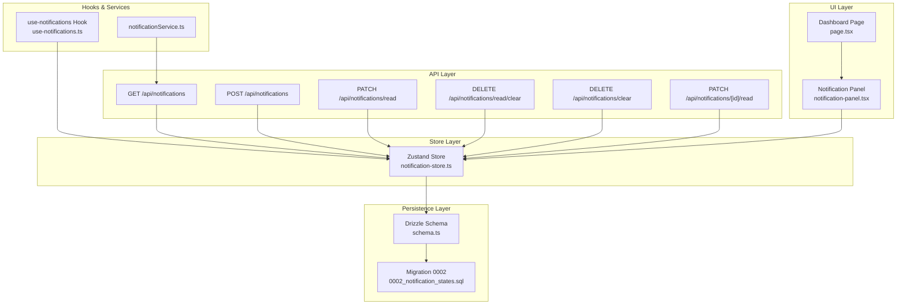
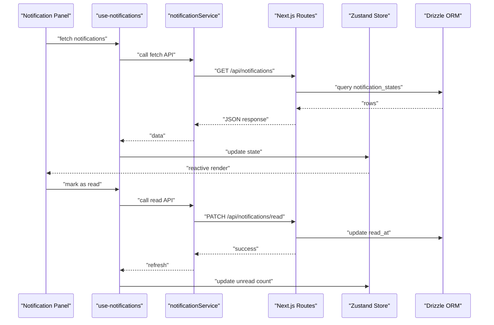
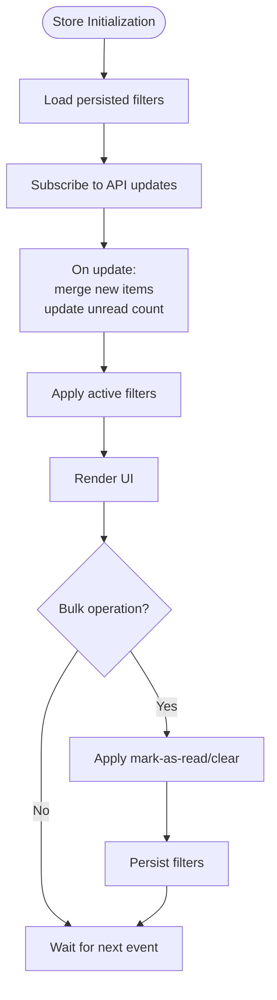
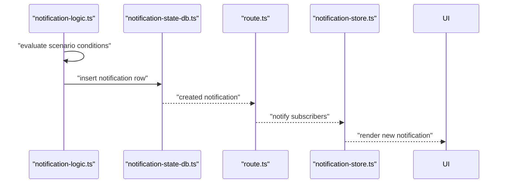
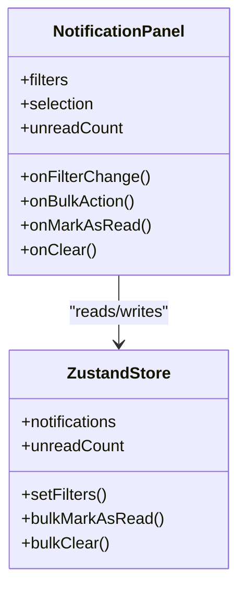
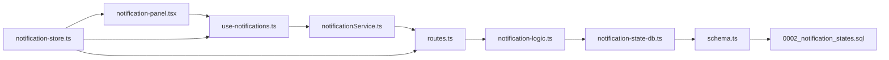

# Notifications System

<cite>
**Referenced Files in This Document**
- [NOTIFICATION_SCENARIOS.md](file://NOTIFICATION_SCENARIOS.md)
- [notification-logic.ts](file://src/app/api/notifications/_lib/notification-logic.ts)
- [notification-state-db.ts](file://src/app/api/notifications/_lib/notification-state-db.ts)
- [notification-store.ts](file://src/app/api/notifications/_lib/notification-store.ts)
- [route.ts](file://src/app/api/notifications/route.ts)
- [route.ts](file://src/app/api/notifications/read/route.ts)
- [route.ts](file://src/app/api/notifications/read/clear/route.ts)
- [route.ts](file://src/app/api/notifications/clear/route.ts)
- [route.ts](file://src/app/api/notifications/[id]/read/route.ts)
- [use-notifications.ts](file://src/hooks/notifications/use-notifications.ts)
- [notificationService.ts](file://src/services/notificationService.ts)
- [notification-panel.tsx](file://src/components/notification-panel.tsx)
- [page.tsx](file://src/app/dashboard/notifications/page.tsx)
- [0002_notification_states.sql](file://src/drizzle/0002_notification_states.sql)
- [schema.ts](file://src/drizzle/schema.ts)
- [type.ts](file://src/drizzle/type.ts)
- [business-alert-routes.ts](file://src/lib/business-alert-routes.ts)
</cite>

## Table of Contents
1. [Introduction](#introduction)
2. [Project Structure](#project-structure)
3. [Core Components](#core-components)
4. [Architecture Overview](#architecture-overview)
5. [Detailed Component Analysis](#detailed-component-analysis)
6. [Dependency Analysis](#dependency-analysis)
7. [Performance Considerations](#performance-considerations)
8. [Troubleshooting Guide](#troubleshooting-guide)
9. [Conclusion](#conclusion)
10. [Appendices](#appendices)

## Introduction
This document provides comprehensive documentation for the POS application's real-time notifications system. It explains notification types, state management using a Zustand store, real-time update mechanisms, creation workflows, user preferences, delivery channels, panel implementation, scenarios and triggers, persistence and cleanup policies, scheduling and recurring alerts, and integration with external communication channels. The goal is to make the system understandable for both developers and non-technical stakeholders.

## Project Structure
The notifications system spans API routes, a Zustand store, database persistence, service utilities, React components, and supporting documentation. Key areas include:
- API layer: notification CRUD and read operations
- Store layer: state management with Zustand
- Persistence layer: Drizzle ORM schema and migrations
- UI layer: notification panel and dashboard page
- Hooks and services: client-side integration and business logic
- Documentation: notification scenarios

**Diagram sources**
- [route.ts](file://src/app/api/notifications/route.ts)
- [route.ts](file://src/app/api/notifications/read/route.ts)
- [route.ts](file://src/app/api/notifications/read/clear/route.ts)
- [route.ts](file://src/app/api/notifications/clear/route.ts)
- [route.ts](file://src/app/api/notifications/[id]/read/route.ts)
- [notification-store.ts](file://src/app/api/notifications/_lib/notification-store.ts)
- [schema.ts](file://src/drizzle/schema.ts)
- [0002_notification_states.sql](file://src/drizzle/0002_notification_states.sql)
- [notification-panel.tsx](file://src/components/notification-panel.tsx)
- [page.tsx](file://src/app/dashboard/notifications/page.tsx)
- [use-notifications.ts](file://src/hooks/notifications/use-notifications.ts)
- [notificationService.ts](file://src/services/notificationService.ts)

**Section sources**
- [route.ts](file://src/app/api/notifications/route.ts)
- [notification-store.ts](file://src/app/api/notifications/_lib/notification-store.ts)
- [schema.ts](file://src/drizzle/schema.ts)
- [0002_notification_states.sql](file://src/drizzle/0002_notification_states.sql)
- [notification-panel.tsx](file://src/components/notification-panel.tsx)
- [page.tsx](file://src/app/dashboard/notifications/page.tsx)
- [use-notifications.ts](file://src/hooks/notifications/use-notifications.ts)
- [notificationService.ts](file://src/services/notificationService.ts)

## Core Components
- Notification store (Zustand): Manages local state for unread counts, filters, and UI interactions.
- API routes: Provide CRUD and read operations for notifications.
- Persistence: Drizzle schema and migration define the notification_states table.
- UI panel: Implements filtering, read/unread toggling, and bulk actions.
- Business logic: Centralized logic for notification creation and state transitions.
- Service utilities: Client-side helpers for fetching and updating notifications.
- Scenarios documentation: Defines trigger conditions and workflows.

Key responsibilities:
- Real-time updates via Zustand subscribers and optimistic UI patterns
- Filtering by type, date range, and read/unread status
- Bulk mark-as-read and clear operations
- Persistence with cleanup policies and storage optimization
- Scheduling and recurring alerts through business logic and external integrations

**Section sources**
- [notification-store.ts](file://src/app/api/notifications/_lib/notification-store.ts)
- [notification-logic.ts](file://src/app/api/notifications/_lib/notification-logic.ts)
- [notification-state-db.ts](file://src/app/api/notifications/_lib/notification-state-db.ts)
- [schema.ts](file://src/drizzle/schema.ts)
- [0002_notification_states.sql](file://src/drizzle/0002_notification_states.sql)
- [notification-panel.tsx](file://src/components/notification-panel.tsx)
- [use-notifications.ts](file://src/hooks/notifications/use-notifications.ts)
- [notificationService.ts](file://src/services/notificationService.ts)
- [NOTIFICATION_SCENARIOS.md](file://NOTIFICATION_SCENARIOS.md)

## Architecture Overview
The system follows a layered architecture:
- Presentation: Dashboard page and notification panel
- Domain: Business logic for notification creation and scheduling
- Persistence: Drizzle ORM mapping to the notification_states table
- API: Next.js App Router routes exposing CRUD and read operations
- State: Zustand store for reactive UI updates

**Diagram sources**
- [notification-panel.tsx](file://src/components/notification-panel.tsx)
- [use-notifications.ts](file://src/hooks/notifications/use-notifications.ts)
- [notificationService.ts](file://src/services/notificationService.ts)
- [route.ts](file://src/app/api/notifications/read/route.ts)
- [notification-store.ts](file://src/app/api/notifications/_lib/notification-store.ts)
- [schema.ts](file://src/drizzle/schema.ts)

## Detailed Component Analysis

### Notification Types and Scenarios
The system supports multiple notification types driven by business scenarios:
- Stock warnings: low stock, out-of-stock, threshold breaches
- Payment confirmations: successful transactions, refunds, failed payments
- System alerts: maintenance windows, downtime, critical errors
- User-specific messages: reminders, password reset requests, role changes

Scenarios and triggers are documented in NOTIFICATION_SCENARIOS.md, covering:
- Conditions that generate notifications
- Message templates and metadata
- Recurrence and scheduling rules
- External channel integrations (email, SMS, push)

Example scenario coverage:
- Stock threshold breach → create stock warning notification
- Payment completion → create payment confirmation notification
- System maintenance scheduled → create system alert notification
- User action required → create user-specific message notification

**Section sources**
- [NOTIFICATION_SCENARIOS.md](file://NOTIFICATION_SCENARIOS.md)

### Notification State Management (Zustand Store)
The Zustand store manages:
- Local notification list
- Unread count aggregation
- Active filters (type, date range, read/unread)
- Bulk operation state
- Optimistic updates for immediate UI feedback

Key store behaviors:
- Subscribe to state changes to trigger re-renders
- Batch updates for performance during bulk operations
- Reset filters and clear selections after bulk actions

**Diagram sources**
- [notification-store.ts](file://src/app/api/notifications/_lib/notification-store.ts)

**Section sources**
- [notification-store.ts](file://src/app/api/notifications/_lib/notification-store.ts)

### Real-Time Update Mechanisms
Real-time updates are achieved through:
- Zustand subscribers reacting to state changes
- Optimistic UI updates before confirming server responses
- Periodic polling or WebSocket integration (depending on deployment)
- Immediate unread count recalculation upon read/unread toggles

Best practices:
- Debounce frequent updates
- Merge incoming notifications to avoid duplicates
- Maintain cursor-based pagination for large lists

**Section sources**
- [notification-store.ts](file://src/app/api/notifications/_lib/notification-store.ts)
- [use-notifications.ts](file://src/hooks/notifications/use-notifications.ts)

### Notification Creation Workflows
Creation is centralized in the business logic module:
- Validate trigger conditions against current state
- Build notification payload with metadata and routing info
- Persist notification to the database
- Broadcast to subscribed clients (via store updates)

**Diagram sources**
- [notification-logic.ts](file://src/app/api/notifications/_lib/notification-logic.ts)
- [notification-state-db.ts](file://src/app/api/notifications/_lib/notification-state-db.ts)
- [route.ts](file://src/app/api/notifications/route.ts)
- [notification-store.ts](file://src/app/api/notifications/_lib/notification-store.ts)

**Section sources**
- [notification-logic.ts](file://src/app/api/notifications/_lib/notification-logic.ts)
- [notification-state-db.ts](file://src/app/api/notifications/_lib/notification-state-db.ts)
- [route.ts](file://src/app/api/notifications/route.ts)

### User Preferences and Delivery Channels
Preferences:
- User-specific filters and read/unread defaults
- Channel preferences (email, SMS, in-app)
- Frequency caps and quiet hours

Delivery channels:
- In-app notifications (primary)
- Email/SMS via external integrations (configured in business logic)
- Push notifications (platform-dependent)

Integration points:
- Business alert routes for external provider configuration
- Notification metadata indicating preferred channel

**Section sources**
- [business-alert-routes.ts](file://src/lib/business-alert-routes.ts)
- [NOTIFICATION_SCENARIOS.md](file://NOTIFICATION_SCENARIOS.md)

### Notification Panel Implementation
The panel provides:
- Filtering by type, date range, and read/unread status
- Sorting and pagination
- Individual and bulk actions (mark as read, clear)
- Unread badge and global counters

Implementation highlights:
- Controlled filter components feeding into the store
- Bulk selection with confirmation dialogs
- Keyboard shortcuts and accessibility support

**Diagram sources**
- [notification-panel.tsx](file://src/components/notification-panel.tsx)
- [notification-store.ts](file://src/app/api/notifications/_lib/notification-store.ts)

**Section sources**
- [notification-panel.tsx](file://src/components/notification-panel.tsx)
- [page.tsx](file://src/app/dashboard/notifications/page.tsx)

### API Endpoints and Operations
Core endpoints:
- GET /api/notifications: List notifications with filters and pagination
- POST /api/notifications: Create a notification (triggered by business logic)
- PATCH /api/notifications/read: Mark selected as read
- DELETE /api/notifications/read/clear: Clear read notifications
- DELETE /api/notifications/clear: Clear all notifications
- PATCH /api/notifications/[id]/read: Mark single notification as read

Operations:
- Filtering and sorting handled server-side
- Bulk operations optimized with batch updates
- Atomic read/clear operations with transactional safety

**Section sources**
- [route.ts](file://src/app/api/notifications/route.ts)
- [route.ts](file://src/app/api/notifications/read/route.ts)
- [route.ts](file://src/app/api/notifications/read/clear/route.ts)
- [route.ts](file://src/app/api/notifications/clear/route.ts)
- [route.ts](file://src/app/api/notifications/[id]/read/route.ts)

### Persistence, Cleanup, and Storage Optimization
Schema and migration:
- notification_states table stores notification records
- Fields include type, title, body, metadata, timestamps, and read flag
- Indexes on frequently queried columns (created_at, read_at, type)

Cleanup policies:
- Automatic retention windows (e.g., keep read notifications for 30 days)
- Purge unclaimed or expired notifications
- Batch cleanup jobs to maintain table size

Storage optimization:
- Partitioning by date ranges (future enhancement)
- Compression for large bodies (future enhancement)
- Archival strategy for historical data

**Section sources**
- [schema.ts](file://src/drizzle/schema.ts)
- [0002_notification_states.sql](file://src/drizzle/0002_notification_states.sql)

### Scheduling, Recurring Alerts, and External Integrations
Scheduling:
- Recurring scenarios evaluated periodically (cron-style)
- One-time alerts triggered immediately upon condition met

External integrations:
- Email/SMS providers configured via business alert routes
- Webhook delivery for third-party systems
- Rate limiting and retry policies

Customization:
- Scenario templates with placeholders for dynamic content
- Channel-specific formatting and routing rules

**Section sources**
- [NOTIFICATION_SCENARIOS.md](file://NOTIFICATION_SCENARIOS.md)
- [business-alert-routes.ts](file://src/lib/business-alert-routes.ts)

## Dependency Analysis
The system exhibits strong separation of concerns:
- UI depends on hooks and store
- Hooks depend on service utilities
- Service utilities depend on API routes
- API routes depend on business logic and persistence
- Persistence depends on schema and migration

**Diagram sources**
- [notification-panel.tsx](file://src/components/notification-panel.tsx)
- [use-notifications.ts](file://src/hooks/notifications/use-notifications.ts)
- [notificationService.ts](file://src/services/notificationService.ts)
- [route.ts](file://src/app/api/notifications/route.ts)
- [notification-logic.ts](file://src/app/api/notifications/_lib/notification-logic.ts)
- [notification-state-db.ts](file://src/app/api/notifications/_lib/notification-state-db.ts)
- [schema.ts](file://src/drizzle/schema.ts)
- [0002_notification_states.sql](file://src/drizzle/0002_notification_states.sql)
- [notification-store.ts](file://src/app/api/notifications/_lib/notification-store.ts)

**Section sources**
- [notification-panel.tsx](file://src/components/notification-panel.tsx)
- [use-notifications.ts](file://src/hooks/notifications/use-notifications.ts)
- [notificationService.ts](file://src/services/notificationService.ts)
- [route.ts](file://src/app/api/notifications/route.ts)
- [notification-logic.ts](file://src/app/api/notifications/_lib/notification-logic.ts)
- [notification-state-db.ts](file://src/app/api/notifications/_lib/notification-state-db.ts)
- [schema.ts](file://src/drizzle/schema.ts)
- [0002_notification_states.sql](file://src/drizzle/0002_notification_states.sql)
- [notification-store.ts](file://src/app/api/notifications/_lib/notification-store.ts)

## Performance Considerations
- Use pagination and virtualization for large notification lists
- Debounce filter changes and bulk operations
- Optimize database queries with proper indexing
- Implement incremental updates to minimize re-renders
- Cache frequently accessed metadata (types, channels)
- Batch API calls for bulk operations

## Troubleshooting Guide
Common issues and resolutions:
- Notifications not appearing: verify API connectivity and store subscription
- Read/unread state inconsistent: check optimistic update logic and server sync
- Filters not applied: ensure filter state is passed to API calls
- Bulk operations fail: validate permissions and handle partial failures
- Excessive memory usage: implement pagination and cleanup policies

Debugging tips:
- Inspect store state snapshots
- Monitor network requests and response times
- Enable logging in business logic and API routes
- Verify database indexes and query plans

**Section sources**
- [notification-store.ts](file://src/app/api/notifications/_lib/notification-store.ts)
- [notificationService.ts](file://src/services/notificationService.ts)
- [route.ts](file://src/app/api/notifications/route.ts)

## Conclusion
The notifications system integrates a robust Zustand store, well-defined API endpoints, reliable persistence, and a feature-rich UI panel. It supports diverse notification types, flexible user preferences, and scalable business scenarios. With clear separation of concerns, real-time updates, and extensible architecture, the system can evolve to meet changing business needs while maintaining performance and reliability.

## Appendices
- Example workflows:
  - Stock threshold breach → create stock warning → notify user → optional email/SMS
  - Payment completion → create confirmation → mark as read automatically → archive after retention
  - System maintenance → create alert → schedule recurring reminders → broadcast to all users
- Customization options:
  - Define new notification types and scenarios
  - Configure channel preferences per user
  - Set retention and cleanup policies
  - Integrate additional external providers