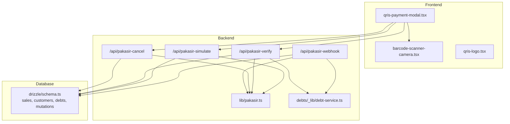
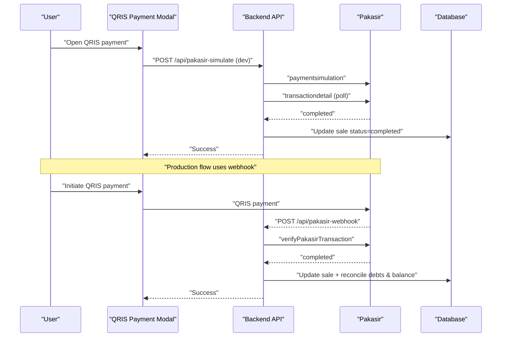
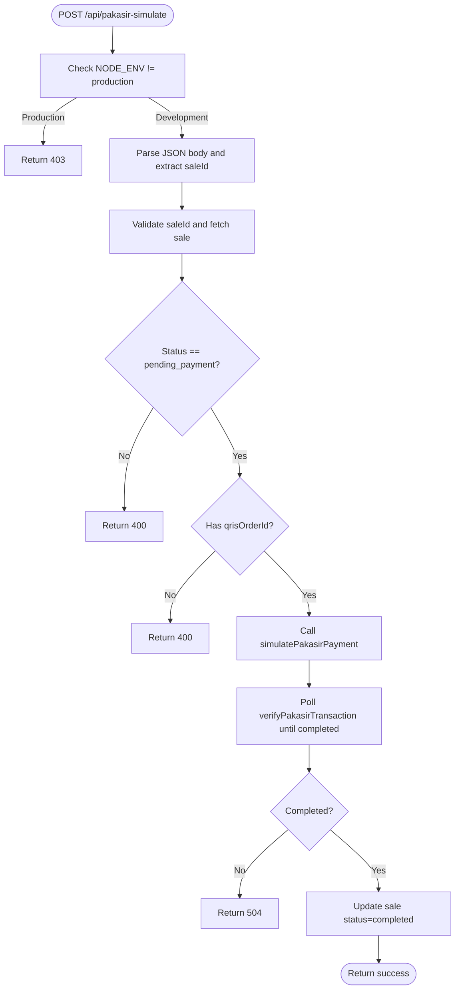
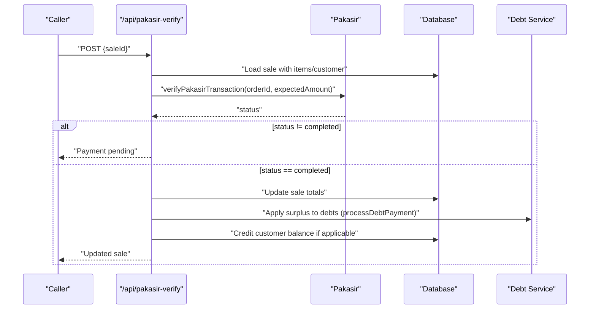
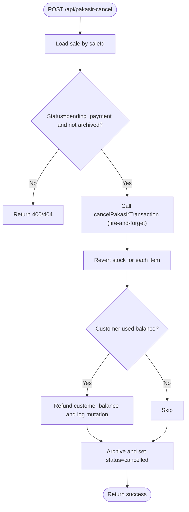
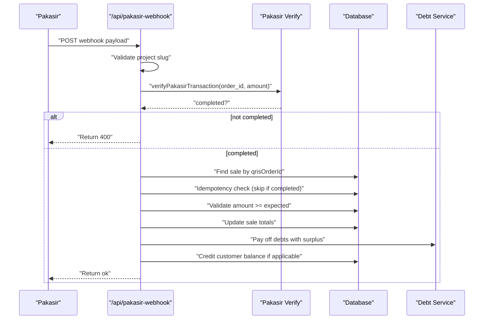
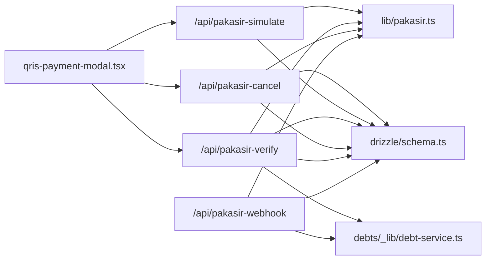

# Payment Integration

<cite>
**Referenced Files in This Document**
- [route.ts](file://src/app/api/pakasir-simulate/route.ts)
- [route.ts](file://src/app/api/pakasir-verify/route.ts)
- [route.ts](file://src/app/api/pakasir-cancel/route.ts)
- [route.ts](file://src/app/api/pakasir-webhook/route.ts)
- [pakasir.ts](file://src/lib/pakasir.ts)
- [qris-payment-modal.tsx](file://src/components/qris-payment-modal.tsx)
- [barcode-scanner-camera.tsx](file://src/components/barcode-scanner-camera.tsx)
- [qris-logo.tsx](file://src/components/icons/qris-logo.tsx)
- [schema.ts](file://src/drizzle/schema.ts)
- [debt-service.ts](file://src/app/api/debts/_lib/debt-service.ts)
</cite>

## Table of Contents
1. [Introduction](#introduction)
2. [Project Structure](#project-structure)
3. [Core Components](#core-components)
4. [Architecture Overview](#architecture-overview)
5. [Detailed Component Analysis](#detailed-component-analysis)
6. [Dependency Analysis](#dependency-analysis)
7. [Performance Considerations](#performance-considerations)
8. [Security and Compliance](#security-and-compliance)
9. [Troubleshooting Guide](#troubleshooting-guide)
10. [Conclusion](#conclusion)

## Introduction
This document explains the POS application’s QRIS payment integration with the Pakasir payment gateway. It covers the backend APIs for payment simulation, verification, cancellation, and webhook handling; the frontend QRIS payment modal and barcode scanner integration; real-time status updates; transaction reconciliation; error handling and retries; and security and compliance considerations.

## Project Structure
The QRIS integration spans backend API routes, shared library utilities, and frontend components:
- Backend API routes under src/app/api handle payment lifecycle events.
- Shared library src/lib/pakasir.ts encapsulates communication with the Pakasir service.
- Frontend components include the QRIS payment modal and a barcode scanner for QR code capture.
- Database schema in src/drizzle/schema.ts defines the sales and related entities used for transaction state and reconciliation.

**Diagram sources**
- [route.ts:1-164](file://src/app/api/pakasir-simulate/route.ts#L1-L164)
- [route.ts:1-162](file://src/app/api/pakasir-verify/route.ts#L1-L162)
- [route.ts:1-165](file://src/app/api/pakasir-cancel/route.ts#L1-L165)
- [route.ts:1-189](file://src/app/api/pakasir-webhook/route.ts#L1-L189)
- [pakasir.ts](file://src/lib/pakasir.ts)
- [qris-payment-modal.tsx](file://src/components/qris-payment-modal.tsx)
- [barcode-scanner-camera.tsx](file://src/components/barcode-scanner-camera.tsx)
- [qris-logo.tsx](file://src/components/icons/qris-logo.tsx)
- [schema.ts](file://src/drizzle/schema.ts)
- [debt-service.ts](file://src/app/api/debts/_lib/debt-service.ts)

**Section sources**
- [route.ts:1-164](file://src/app/api/pakasir-simulate/route.ts#L1-L164)
- [route.ts:1-162](file://src/app/api/pakasir-verify/route.ts#L1-L162)
- [route.ts:1-165](file://src/app/api/pakasir-cancel/route.ts#L1-L165)
- [route.ts:1-189](file://src/app/api/pakasir-webhook/route.ts#L1-L189)
- [schema.ts](file://src/drizzle/schema.ts)

## Core Components
- Payment Simulation API (/api/pakasir-simulate): Development-only endpoint that triggers a simulated payment and polls for completion, then marks the sale as completed locally without relying on webhooks.
- Payment Verification API (/api/pakasir-verify): On-demand verification against Pakasir to confirm payment status and reconcile transactions, including automatic debt payment and credit balance adjustments.
- Payment Cancellation API (/api/pakasir-cancel): Cancels pending QRIS transactions, reverts inventory, refunds customer balance, and archives the sale.
- Webhook Handler (/api/pakasir-webhook): Receives asynchronous notifications from Pakasir, validates payload authenticity, performs a second verification, and reconciles the sale and optional debt payments.
- Shared Library (lib/pakasir.ts): Encapsulates Pakasir API calls for simulation, verification, cancellation, and type definitions for webhook payloads.
- Frontend Modal (components/qris-payment-modal.tsx): Provides the payment UI for QRIS transactions, integrates with the barcode scanner, and orchestrates API calls.
- Barcode Scanner (components/barcode-scanner-camera.tsx): Captures QR codes for payment initiation.
- Schema (drizzle/schema.ts): Defines sales, customers, debts, and mutations used for reconciliation and audit trails.

**Section sources**
- [route.ts:1-164](file://src/app/api/pakasir-simulate/route.ts#L1-L164)
- [route.ts:1-162](file://src/app/api/pakasir-verify/route.ts#L1-L162)
- [route.ts:1-165](file://src/app/api/pakasir-cancel/route.ts#L1-L165)
- [route.ts:1-189](file://src/app/api/pakasir-webhook/route.ts#L1-L189)
- [pakasir.ts](file://src/lib/pakasir.ts)
- [qris-payment-modal.tsx](file://src/components/qris-payment-modal.tsx)
- [barcode-scanner-camera.tsx](file://src/components/barcode-scanner-camera.tsx)
- [schema.ts](file://src/drizzle/schema.ts)

## Architecture Overview
The QRIS payment flow integrates frontend UI with backend APIs and the external Pakasir service. The system supports:
- Real-time status polling during development.
- Asynchronous webhook notifications in production.
- Reconciliation of amounts, optional debt payment, and customer credit adjustments.
- Inventory and customer balance reversions upon cancellation.

**Diagram sources**
- [route.ts:23-162](file://src/app/api/pakasir-simulate/route.ts#L23-L162)
- [route.ts:24-189](file://src/app/api/pakasir-webhook/route.ts#L24-L189)
- [route.ts:16-161](file://src/app/api/pakasir-verify/route.ts#L16-L161)
- [route.ts:27-164](file://src/app/api/pakasir-cancel/route.ts#L27-L164)
- [schema.ts](file://src/drizzle/schema.ts)

## Detailed Component Analysis

### Payment Simulation API (/api/pakasir-simulate)
Purpose:
- Development-only endpoint to simulate a QRIS payment and immediately mark the sale as completed after verifying with Pakasir.

Key behaviors:
- Validates request body and sale record.
- Ensures sale is pending_payment and has a QRIS order identifier.
- Calls the simulation API and polls transaction details until completion.
- Updates the sale record locally upon successful verification.

Retry and error handling:
- Polls up to a fixed number of attempts with a short delay.
- Returns appropriate HTTP statuses for invalid input, missing records, or upstream errors.

**Diagram sources**
- [route.ts:23-162](file://src/app/api/pakasir-simulate/route.ts#L23-L162)

**Section sources**
- [route.ts:1-164](file://src/app/api/pakasir-simulate/route.ts#L1-L164)

### Payment Verification API (/api/pakasir-verify)
Purpose:
- On-demand verification against Pakasir to confirm payment status and reconcile the transaction, including debt payment and credit balance adjustments.

Key behaviors:
- Fetches sale and verifies it is a QRIS transaction.
- Computes expected amount and queries Pakasir for transaction details.
- If completed, updates sale totals and applies surplus to outstanding debts and customer credit balance.

**Diagram sources**
- [route.ts:16-161](file://src/app/api/pakasir-verify/route.ts#L16-L161)
- [debt-service.ts](file://src/app/api/debts/_lib/debt-service.ts)

**Section sources**
- [route.ts:1-162](file://src/app/api/pakasir-verify/route.ts#L1-L162)

### Payment Cancellation API (/api/pakasir-cancel)
Purpose:
- Cancels a pending QRIS transaction, reverts inventory, refunds customer balance, and archives the sale.

Key behaviors:
- Validates sale status and existence.
- Attempts to cancel the transaction via Pakasir (best-effort).
- Reverts stock for each sale item and records stock mutations.
- Refunds customer balance if credits were used.
- Archives and cancels the sale.

**Diagram sources**
- [route.ts:27-164](file://src/app/api/pakasir-cancel/route.ts#L27-L164)

**Section sources**
- [route.ts:1-165](file://src/app/api/pakasir-cancel/route.ts#L1-L165)

### Webhook Handler (/api/pakasir-webhook)
Purpose:
- Receives asynchronous notifications from Pakasir, validates authenticity, re-verifies with the Pakasir API, and reconciles the sale and optional debt payments.

Key behaviors:
- Validates project slug and status.
- Performs a second verification against Pakasir to prevent spoofing.
- Matches the sale by qrisOrderId, enforces idempotency, and validates amount.
- Updates sale totals, applies surplus to debts, and credits customer balance if applicable.

**Diagram sources**
- [route.ts:24-189](file://src/app/api/pakasir-webhook/route.ts#L24-L189)
- [debt-service.ts](file://src/app/api/debts/_lib/debt-service.ts)

**Section sources**
- [route.ts:1-189](file://src/app/api/pakasir-webhook/route.ts#L1-L189)

### QRIS Payment Modal and Barcode Scanner
- QRIS Payment Modal (components/qris-payment-modal.tsx): Presents the payment interface for QRIS transactions, integrates with the backend APIs, and coordinates user actions.
- Barcode Scanner (components/barcode-scanner-camera.tsx): Captures QR codes to initiate payment processing.
- QRIS Icon (components/icons/qris-logo.tsx): Visual branding for QRIS.

Implementation notes:
- The modal should trigger the simulation or verification endpoints depending on environment and use case.
- The scanner should feed captured data to the payment flow for initiating QRIS payments.

**Section sources**
- [qris-payment-modal.tsx](file://src/components/qris-payment-modal.tsx)
- [barcode-scanner-camera.tsx](file://src/components/barcode-scanner-camera.tsx)
- [qris-logo.tsx](file://src/components/icons/qris-logo.tsx)

### Shared Library (lib/pakasir.ts)
Responsibilities:
- Encapsulates Pakasir API interactions: simulation, verification, cancellation.
- Defines webhook payload types and exportable helpers used by API routes.

Integration:
- Used by all QRIS API routes to communicate with the external service and by the frontend modal indirectly through API calls.

**Section sources**
- [pakasir.ts](file://src/lib/pakasir.ts)

### Database Schema (drizzle/schema.ts)
Entities involved in QRIS reconciliation:
- Sales: transaction header with status, totals, and QRIS identifiers.
- Customers: customer balances and mutations.
- Debts: outstanding customer debts for automatic payment.
- Mutations: audit trail for customer balance changes.

**Section sources**
- [schema.ts](file://src/drizzle/schema.ts)

## Dependency Analysis
The QRIS integration exhibits clear separation of concerns:
- Frontend components depend on backend APIs.
- Backend APIs depend on the shared library for external service calls.
- Backend APIs depend on the database schema for state and reconciliation.
- Debt service is reused for automatic debt payment during verification and webhook processing.

**Diagram sources**
- [route.ts:1-164](file://src/app/api/pakasir-simulate/route.ts#L1-L164)
- [route.ts:1-162](file://src/app/api/pakasir-verify/route.ts#L1-L162)
- [route.ts:1-165](file://src/app/api/pakasir-cancel/route.ts#L1-L165)
- [route.ts:1-189](file://src/app/api/pakasir-webhook/route.ts#L1-L189)
- [pakasir.ts](file://src/lib/pakasir.ts)
- [schema.ts](file://src/drizzle/schema.ts)
- [debt-service.ts](file://src/app/api/debts/_lib/debt-service.ts)

**Section sources**
- [route.ts:1-164](file://src/app/api/pakasir-simulate/route.ts#L1-L164)
- [route.ts:1-162](file://src/app/api/pakasir-verify/route.ts#L1-L162)
- [route.ts:1-165](file://src/app/api/pakasir-cancel/route.ts#L1-L165)
- [route.ts:1-189](file://src/app/api/pakasir-webhook/route.ts#L1-L189)
- [schema.ts](file://src/drizzle/schema.ts)

## Performance Considerations
- Polling in development: The simulation endpoint polls the transaction detail API with a bounded number of attempts and short delays to avoid excessive load.
- Best-effort cancellation: The cancellation endpoint continues database updates even if the external cancellation fails, minimizing downtime.
- Idempotency: The webhook handler checks for completion and skips redundant updates, reducing unnecessary writes.
- Batched debt payments: Surplus is applied to oldest debts first, optimizing cash flow and reducing partial payments overhead.

[No sources needed since this section provides general guidance]

## Security and Compliance
- Webhook authenticity: The webhook handler validates the project slug against an environment variable to ensure requests originate from the configured project.
- Double verification: Both the verification and webhook handlers re-check transaction status with the external service to mitigate spoofing risks.
- Idempotency: The webhook handler checks for existing completion to avoid duplicate processing.
- Amount validation: The webhook handler ensures the received amount meets or exceeds the expected amount.
- Minimal data exposure: The QRIS modal and APIs operate with minimal sensitive data exposure; ensure HTTPS and secure storage of secrets.

[No sources needed since this section provides general guidance]

## Troubleshooting Guide
Common issues and resolutions:
- Webhook not received:
  - Verify the webhook URL is registered in the payment provider dashboard.
  - Use the verification endpoint to confirm status and reconcile manually.
- Amount mismatch:
  - Ensure the amount sent to the provider matches the expected total minus any customer balance used.
- Duplicate completion:
  - The webhook handler is idempotent; repeated notifications should be safely ignored.
- Simulation timeout:
  - Confirm sandbox mode and retry; the simulation endpoint polls briefly and may require manual verification in production.
- Cancellation failure:
  - The cancellation endpoint proceeds with database updates even if the external cancellation fails; verify inventory and customer balance adjustments.

**Section sources**
- [route.ts:24-189](file://src/app/api/pakasir-webhook/route.ts#L24-L189)
- [route.ts:16-161](file://src/app/api/pakasir-verify/route.ts#L16-L161)
- [route.ts:27-164](file://src/app/api/pakasir-cancel/route.ts#L27-L164)
- [route.ts:23-162](file://src/app/api/pakasir-simulate/route.ts#L23-L162)

## Conclusion
The QRIS integration leverages a robust combination of development-friendly simulation, reliable verification, resilient cancellation, and secure webhook handling. The frontend modal and barcode scanner provide a seamless user experience, while the backend APIs ensure accurate reconciliation, debt automation, and auditability. Adhering to the outlined security practices and troubleshooting steps will help maintain a dependable payment system.