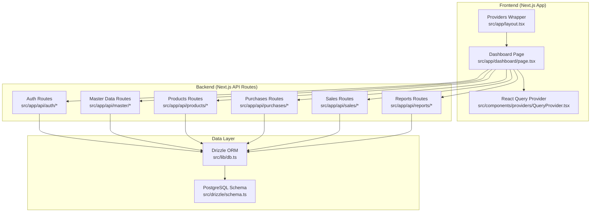
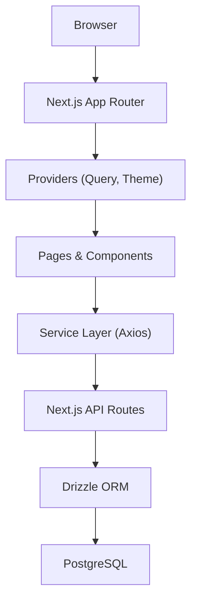
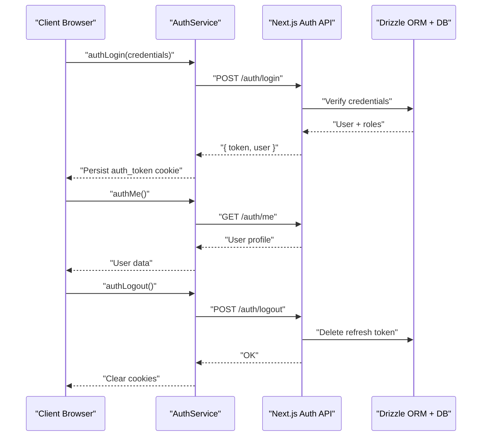
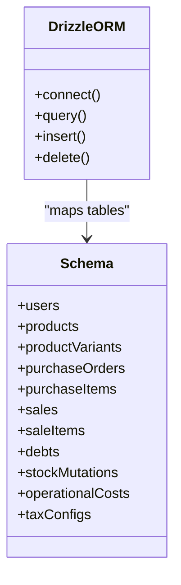
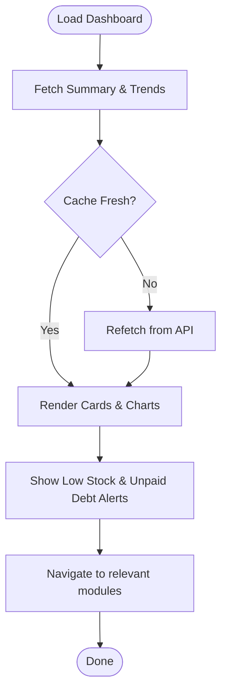
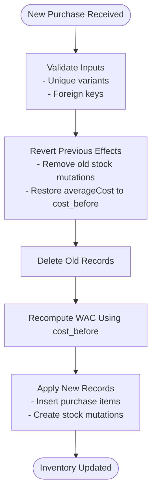
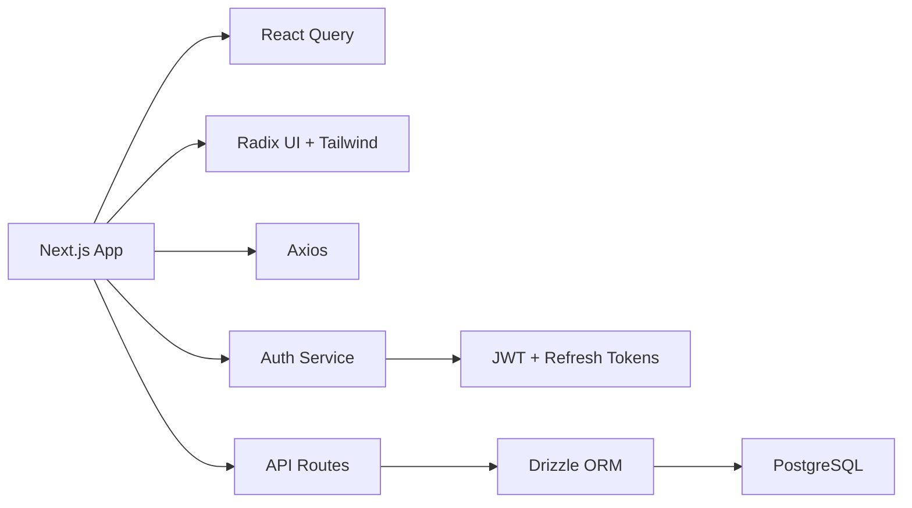

# Project Overview

<cite>
**Referenced Files in This Document**
- [README.md](file://README.md)
- [package.json](file://package.json)
- [src/lib/db.ts](file://src/lib/db.ts)
- [src/drizzle/schema.ts](file://src/drizzle/schema.ts)
- [src/app/layout.tsx](file://src/app/layout.tsx)
- [src/components/providers/QueryProvider.tsx](file://src/components/providers/QueryProvider.tsx)
- [src/lib/react-query.ts](file://src/lib/react-query.ts)
- [src/lib/auth.ts](file://src/lib/auth.ts)
- [src/services/authService.ts](file://src/services/authService.ts)
- [src/hooks/use-auth.ts](file://src/hooks/use-auth.ts)
- [src/app/dashboard/page.tsx](file://src/app/dashboard/page.tsx)
</cite>

## Table of Contents
1. [Introduction](#introduction)
2. [Project Structure](#project-structure)
3. [Core Components](#core-components)
4. [Architecture Overview](#architecture-overview)
5. [Detailed Component Analysis](#detailed-component-analysis)
6. [Dependency Analysis](#dependency-analysis)
7. [Performance Considerations](#performance-considerations)
8. [Troubleshooting Guide](#troubleshooting-guide)
9. [Conclusion](#conclusion)

## Introduction
This Point of Sale (POS) application is designed to streamline retail operations for small to medium-sized businesses. Its core value proposition centers on accurate inventory management and efficient sales processing, backed by a robust data model and real-time cost calculations. The system targets retailers and small business owners who need reliable tools to manage products, purchases, sales, returns, debts, and operational costs while maintaining precise financial reporting.

Key differentiators include:
- Real-time weighted average cost (WAC) updates aligned to base units for precise cost of goods sold (COGS) computation.
- Comprehensive audit logging and stock mutation tracking to support traceability and integrity.
- Built-in support for cash and QRIS (QR Payment) payment methods, with integrated debt management and customer credit balances.
- A modern, responsive frontend powered by Next.js 14 with TypeScript, React Query for caching and optimistic updates, and a PostgreSQL-backed data layer via Drizzle ORM.

## Project Structure
The project follows a modular, feature-driven structure under the Next.js App Router. The frontend (React/Next.js) integrates with server-side routes organized by domain (authentication, master data, purchases, sales, reports, etc.). Data access is centralized through Drizzle ORM connected to a PostgreSQL-compatible database, with a dedicated database initialization and migration system.

**Diagram sources**
- [src/app/dashboard/page.tsx:1-633](file://src/app/dashboard/page.tsx#L1-L633)
- [src/app/layout.tsx:1-42](file://src/app/layout.tsx#L1-L42)
- [src/components/providers/QueryProvider.tsx:1-31](file://src/components/providers/QueryProvider.tsx#L1-L31)
- [src/lib/db.ts:1-49](file://src/lib/db.ts#L1-L49)
- [src/drizzle/schema.ts:1-890](file://src/drizzle/schema.ts#L1-L890)

**Section sources**
- [src/app/dashboard/page.tsx:1-633](file://src/app/dashboard/page.tsx#L1-L633)
- [src/app/layout.tsx:1-42](file://src/app/layout.tsx#L1-L42)
- [src/lib/db.ts:1-49](file://src/lib/db.ts#L1-L49)
- [src/drizzle/schema.ts:1-890](file://src/drizzle/schema.ts#L1-L890)

## Core Components
- Frontend framework and runtime: Next.js 14 with App Router and React 19.
- State and caching: React Query for server state management, optimistic updates, and automatic cache invalidation.
- Database ORM: Drizzle ORM with PostgreSQL schema definitions and migrations.
- Authentication: JWT-based session management with refresh tokens persisted in the database.
- UI primitives and theming: Radix UI primitives, Tailwind CSS, and Next Themes for consistent UX.
- Utilities: Zod for validation, Axios for HTTP requests, and helper libraries for formatting and analytics.

Technology stack highlights:
- Next.js 14 (App Router)
- Drizzle ORM + PostgreSQL
- React Query
- TypeScript
- JWT authentication with refresh tokens
- Axios for service-layer HTTP calls

**Section sources**
- [package.json:17-77](file://package.json#L17-L77)
- [src/app/layout.tsx:1-42](file://src/app/layout.tsx#L1-L42)
- [src/components/providers/QueryProvider.tsx:1-31](file://src/components/providers/QueryProvider.tsx#L1-L31)
- [src/lib/db.ts:1-49](file://src/lib/db.ts#L1-L49)
- [src/lib/auth.ts:1-125](file://src/lib/auth.ts#L1-L125)

## Architecture Overview
The system separates frontend and backend concerns:
- Frontend: Next.js pages and components render dashboards, forms, and lists. Providers configure React Query and theming globally.
- Backend: Next.js API routes encapsulate business logic and orchestrate database operations via Drizzle ORM.
- Database: PostgreSQL schema defines entities (products, purchases, sales, customers, suppliers, taxes, operational costs) and relationships. Migrations and snapshots are managed by Drizzle Kit.

Real-time features:
- Inventory cost updates leverage real-time WAC recalculations during purchase processing.
- Stock mutations track all inventory movements (purchase, sale, return, waste, adjustment).
- Notifications module surfaces actionable alerts (low stock, unpaid debts) to guide operational decisions.

**Diagram sources**
- [src/app/layout.tsx:1-42](file://src/app/layout.tsx#L1-L42)
- [src/components/providers/QueryProvider.tsx:1-31](file://src/components/providers/QueryProvider.tsx#L1-L31)
- [src/lib/db.ts:1-49](file://src/lib/db.ts#L1-L49)
- [src/drizzle/schema.ts:1-890](file://src/drizzle/schema.ts#L1-L890)

## Detailed Component Analysis

### Authentication and Session Management
The authentication layer manages secure sessions using JWT and refresh tokens stored in the database. It supports login, registration, logout, and forgot-password flows, with middleware verification for protected routes.

**Diagram sources**
- [src/services/authService.ts:1-63](file://src/services/authService.ts#L1-L63)
- [src/lib/auth.ts:1-125](file://src/lib/auth.ts#L1-L125)
- [src/hooks/use-auth.ts:1-34](file://src/hooks/use-auth.ts#L1-L34)

**Section sources**
- [src/lib/auth.ts:1-125](file://src/lib/auth.ts#L1-L125)
- [src/services/authService.ts:1-63](file://src/services/authService.ts#L1-L63)
- [src/hooks/use-auth.ts:1-34](file://src/hooks/use-auth.ts#L1-L34)

### Data Access and Database Integration
Drizzle ORM connects to a PostgreSQL-compatible database using a pooled connection. A global proxy ensures the correct connection string is used across environments (local and Cloudflare Workers via Hyperdrive bindings). The schema defines core entities and enums for sales, purchases, stock mutations, taxes, operational costs, and user management.

**Diagram sources**
- [src/lib/db.ts:1-49](file://src/lib/db.ts#L1-L49)
- [src/drizzle/schema.ts:1-890](file://src/drizzle/schema.ts#L1-L890)

**Section sources**
- [src/lib/db.ts:1-49](file://src/lib/db.ts#L1-L49)
- [src/drizzle/schema.ts:1-890](file://src/drizzle/schema.ts#L1-L890)

### Dashboard and Business Intelligence
The dashboard aggregates business KPIs, presents sales trends, and surfaces actionable alerts (low stock and unpaid debts). It leverages React Query for data fetching and caching, and exposes role-based navigation to guide users toward relevant modules.

**Diagram sources**
- [src/app/dashboard/page.tsx:1-633](file://src/app/dashboard/page.tsx#L1-L633)

**Section sources**
- [src/app/dashboard/page.tsx:1-633](file://src/app/dashboard/page.tsx#L1-L633)

### Costing Methodology and Inventory Integrity
The system documents a real-time Weighted Average Cost (WAC) calculation aligned to base units, ensuring precise COGS across varying unit conversions. It enforces guard clauses (foreign keys, variant uniqueness, atomic transactions) and uses a “revert and re-apply” strategy to maintain data integrity during edits.

**Diagram sources**
- [README.md:1-60](file://README.md#L1-L60)
- [src/drizzle/schema.ts:463-493](file://src/drizzle/schema.ts#L463-L493)

**Section sources**
- [README.md:1-60](file://README.md#L1-L60)
- [src/drizzle/schema.ts:463-493](file://src/drizzle/schema.ts#L463-L493)

## Dependency Analysis
The frontend depends on Next.js, React Query, and UI primitives. The backend depends on Drizzle ORM and the database. Authentication services rely on JWT and refresh tokens stored in the database. The dashboard consumes multiple API endpoints and uses shared utilities for formatting and analytics.

**Diagram sources**
- [package.json:17-77](file://package.json#L17-L77)
- [src/lib/db.ts:1-49](file://src/lib/db.ts#L1-L49)
- [src/lib/auth.ts:1-125](file://src/lib/auth.ts#L1-L125)
- [src/services/authService.ts:1-63](file://src/services/authService.ts#L1-L63)

**Section sources**
- [package.json:17-77](file://package.json#L17-L77)
- [src/lib/db.ts:1-49](file://src/lib/db.ts#L1-L49)
- [src/lib/auth.ts:1-125](file://src/lib/auth.ts#L1-L125)
- [src/services/authService.ts:1-63](file://src/services/authService.ts#L1-L63)

## Performance Considerations
- Caching and stale-while-revalidate: React Query defaults minimize network load and improve responsiveness.
- Database pooling: Drizzle uses a connection pool to reduce overhead and improve throughput.
- Atomic operations: Guard clauses and transactions prevent partial writes and reduce retries.
- Indexing and full-text search: Product and supplier indices optimize search and filtering.
- Environment-specific connections: The DB proxy selects the correct connection string for local and Cloudflare Workers deployments.

[No sources needed since this section provides general guidance]

## Troubleshooting Guide
Common issues and resolutions:
- Authentication failures: Verify JWT secret environment variable and cookie policies. Ensure refresh tokens are stored and validated correctly.
- Database connectivity: Confirm DATABASE_URL/HYPERDRIVE binding availability and that the DB proxy resolves the correct connection string.
- Cache anomalies: Adjust React Query staleTime/gcTime or invalidate specific query keys after destructive operations.
- API errors: Inspect Axios error handling and ensure proper error propagation from API routes to the UI.

**Section sources**
- [src/lib/auth.ts:1-125](file://src/lib/auth.ts#L1-L125)
- [src/lib/db.ts:1-49](file://src/lib/db.ts#L1-L49)
- [src/lib/react-query.ts:1-47](file://src/lib/react-query.ts#L1-L47)

## Conclusion
This POS application delivers a modern, scalable solution for retail management with a strong emphasis on inventory accuracy and operational visibility. Its architecture combines a reactive frontend with a robust backend and a precise cost accounting model, enabling informed business decisions. The system’s modular design, clear separation of concerns, and reusable components facilitate maintenance and future enhancements.