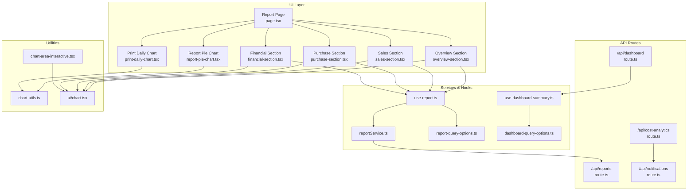
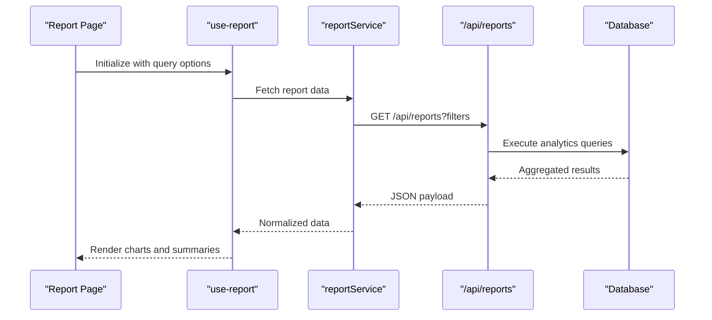
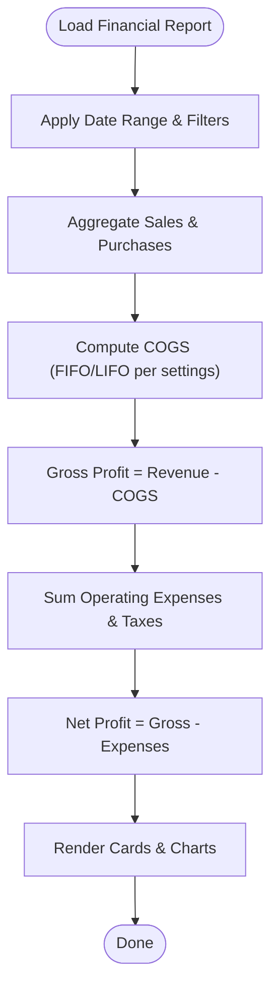
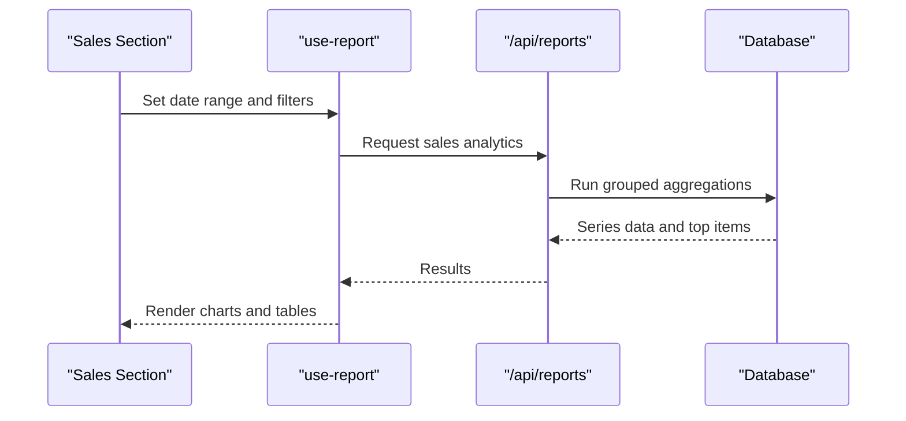
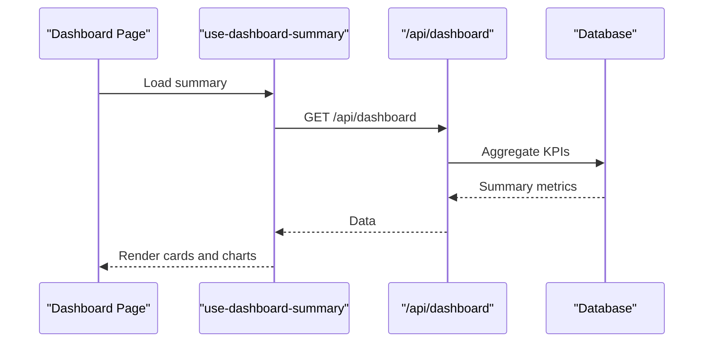
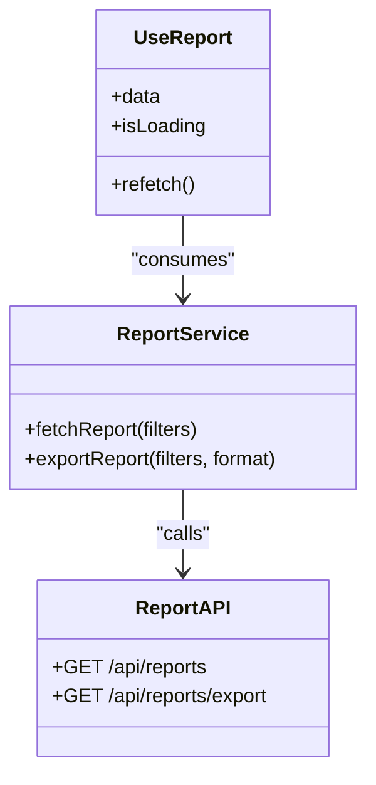
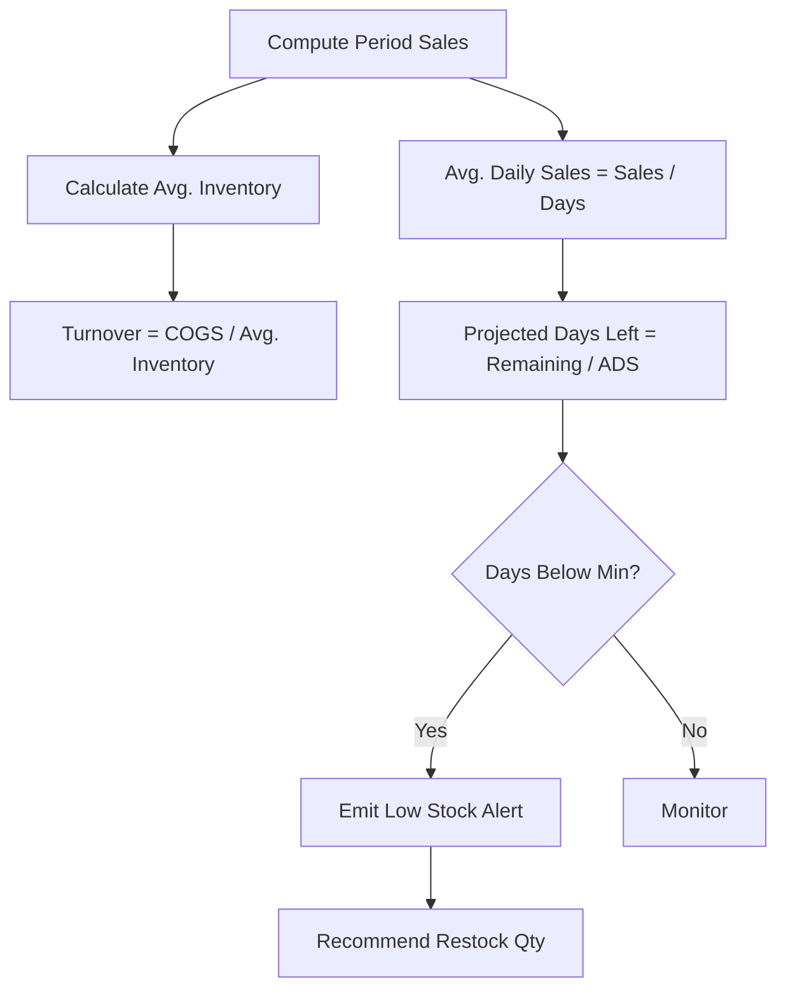
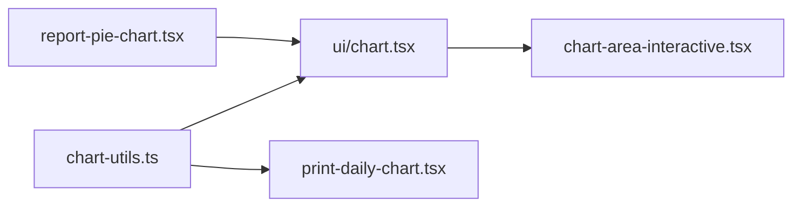
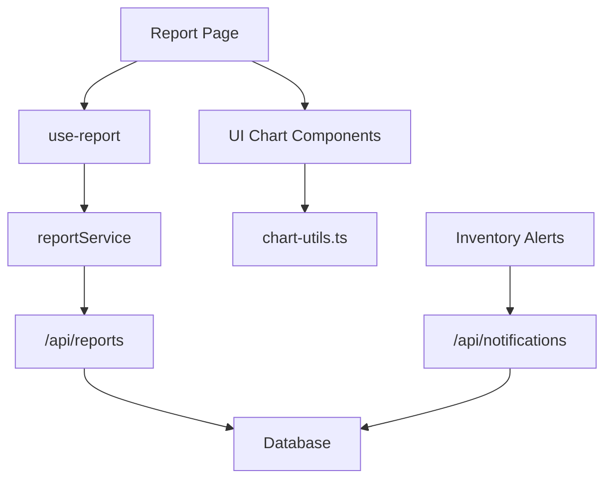

# Reporting & Analytics

<cite>
**Referenced Files in This Document**
- [page.tsx](file://src/app/dashboard/report/page.tsx)
- [report-pie-chart.tsx](file://src/app/dashboard/report/_components/report-pie-chart.tsx)
- [financial-section.tsx](file://src/app/dashboard/report/_components/financial-section.tsx)
- [overview-section.tsx](file://src/app/dashboard/report/_components/overview-section.tsx)
- [purchase-section.tsx](file://src/app/dashboard/report/_components/purchase-section.tsx)
- [sales-section.tsx](file://src/app/dashboard/report/_components/sales-section.tsx)
- [print-daily-chart.tsx](file://src/components/print-daily-chart.tsx)
- [reportService.ts](file://src/services/reportService.ts)
- [use-report.ts](file://src/hooks/report/use-report.ts)
- [report-query-options.ts](file://src/hooks/report/report-query-options.ts)
- [route.ts](file://src/app/api/reports/route.ts)
- [route.ts](file://src/app/api/cost-analytics/route.ts)
- [route.ts](file://src/app/api/dashboard/route.ts)
- [use-dashboard-summary.ts](file://src/hooks/dashboard/use-dashboard-summary.ts)
- [dashboard-query-options.ts](file://src/hooks/dashboard/dashboard-query-options.ts)
- [route.ts](file://src/app/api/notifications/route.ts)
- [notification-store.ts](file://src/app/api/notifications/_lib/notification-store.ts)
- [notification-state-db.ts](file://src/app/api/notifications/_lib/notification-state-db.ts)
- [notification-logic.ts](file://src/app/api/notifications/_lib/notification-logic.ts)
- [chart-utils.ts](file://src/lib/chart-utils.ts)
- [chart.tsx](file://src/components/ui/chart.tsx)
- [chart-area-interactive.tsx](file://src/components/chart-area-interactive.tsx)
- [CALCULATIONS.md](file://CALCULATIONS.md)
</cite>

## Table of Contents
1. [Introduction](#introduction)
2. [Project Structure](#project-structure)
3. [Core Components](#core-components)
4. [Architecture Overview](#architecture-overview)
5. [Detailed Component Analysis](#detailed-component-analysis)
6. [Dependency Analysis](#dependency-analysis)
7. [Performance Considerations](#performance-considerations)
8. [Troubleshooting Guide](#troubleshooting-guide)
9. [Conclusion](#conclusion)
10. [Appendices](#appendices)

## Introduction
This document explains the POS application’s reporting and analytics system. It covers financial reporting (profit and loss statements), sales analytics, inventory valuation, dashboard visualization, reporting engine architecture, inventory analytics (stock turnover, demand forecasting, low-stock alerts), custom report generation, export formats, visualization components, performance optimization, and practical reporting scenarios.

## Project Structure
The reporting and analytics system spans UI components, service layers, API routes, and shared utilities:
- Dashboard report page orchestrates sections for overview, sales, purchases, and financial summaries.
- Report-specific components render charts and summaries.
- Services and hooks encapsulate data fetching and caching via TanStack Query.
- API routes expose endpoints for reports, cost analytics, and dashboard summaries.
- Utilities support chart rendering and print-friendly visualizations.

**Diagram sources**
- [page.tsx:373-405](file://src/app/dashboard/report/page.tsx#L373-L405)
- [report-pie-chart.tsx](file://src/app/dashboard/report/_components/report-pie-chart.tsx)
- [financial-section.tsx](file://src/app/dashboard/report/_components/financial-section.tsx)
- [overview-section.tsx](file://src/app/dashboard/report/_components/overview-section.tsx)
- [purchase-section.tsx](file://src/app/dashboard/report/_components/purchase-section.tsx)
- [sales-section.tsx](file://src/app/dashboard/report/_components/sales-section.tsx)
- [print-daily-chart.tsx:1-89](file://src/components/print-daily-chart.tsx#L1-L89)
- [reportService.ts](file://src/services/reportService.ts)
- [use-report.ts:1-16](file://src/hooks/report/use-report.ts#L1-L16)
- [report-query-options.ts](file://src/hooks/report/report-query-options.ts)
- [route.ts](file://src/app/api/reports/route.ts)
- [route.ts](file://src/app/api/cost-analytics/route.ts)
- [route.ts](file://src/app/api/dashboard/route.ts)
- [use-dashboard-summary.ts:1-16](file://src/hooks/dashboard/use-dashboard-summary.ts#L1-L16)
- [dashboard-query-options.ts](file://src/hooks/dashboard/dashboard-query-options.ts)
- [route.ts](file://src/app/api/notifications/route.ts)
- [chart-utils.ts](file://src/lib/chart-utils.ts)
- [chart.tsx](file://src/components/ui/chart.tsx)
- [chart-area-interactive.tsx](file://src/components/chart-area-interactive.tsx)

**Section sources**
- [page.tsx:373-405](file://src/app/dashboard/report/page.tsx#L373-L405)
- [report-pie-chart.tsx](file://src/app/dashboard/report/_components/report-pie-chart.tsx)
- [reportService.ts](file://src/services/reportService.ts)
- [use-report.ts:1-16](file://src/hooks/report/use-report.ts#L1-L16)
- [report-query-options.ts](file://src/hooks/report/report-query-options.ts)
- [route.ts](file://src/app/api/reports/route.ts)
- [route.ts](file://src/app/api/cost-analytics/route.ts)
- [route.ts](file://src/app/api/dashboard/route.ts)
- [use-dashboard-summary.ts:1-16](file://src/hooks/dashboard/use-dashboard-summary.ts#L1-L16)
- [dashboard-query-options.ts](file://src/hooks/dashboard/dashboard-query-options.ts)
- [route.ts](file://src/app/api/notifications/route.ts)
- [chart-utils.ts](file://src/lib/chart-utils.ts)
- [chart.tsx](file://src/components/ui/chart.tsx)
- [chart-area-interactive.tsx](file://src/components/chart-area-interactive.tsx)
- [print-daily-chart.tsx:1-89](file://src/components/print-daily-chart.tsx#L1-L89)

## Core Components
- Report Page: Hosts overview, sales, purchase, and financial sections; manages tabbed navigation and error states.
- Financial Section: Renders profit and loss summaries and related KPIs.
- Sales/Purchase Sections: Provide analytics per category and time slices.
- Report Pie Chart: Visualizes distribution metrics for report segments.
- Print Daily Chart: Renders print-friendly area/line charts for daily totals.
- Services and Hooks: Encapsulate TanStack Query usage for caching, refetching, and invalidation.
- API Routes: Expose endpoints for report data, cost analytics, dashboard summaries, and notifications.

Key responsibilities:
- Aggregation: Summarize sales, purchases, and costs by day/week/month.
- Filtering: Apply date ranges, categories, and product filters.
- Export: Provide CSV/Excel exports for generated reports.
- Real-time updates: Polling and optimistic updates via reactive queries.

**Section sources**
- [page.tsx:373-405](file://src/app/dashboard/report/page.tsx#L373-L405)
- [financial-section.tsx](file://src/app/dashboard/report/_components/financial-section.tsx)
- [sales-section.tsx](file://src/app/dashboard/report/_components/sales-section.tsx)
- [purchase-section.tsx](file://src/app/dashboard/report/_components/purchase-section.tsx)
- [report-pie-chart.tsx](file://src/app/dashboard/report/_components/report-pie-chart.tsx)
- [print-daily-chart.tsx:1-89](file://src/components/print-daily-chart.tsx#L1-L89)
- [reportService.ts](file://src/services/reportService.ts)
- [use-report.ts:1-16](file://src/hooks/report/use-report.ts#L1-L16)
- [route.ts](file://src/app/api/reports/route.ts)
- [route.ts](file://src/app/api/cost-analytics/route.ts)
- [route.ts](file://src/app/api/dashboard/route.ts)

## Architecture Overview
The reporting engine follows a layered architecture:
- Presentation: Next.js pages and components render dashboards and reports.
- Domain: Services orchestrate data retrieval and transformations.
- Persistence: API routes query the database and return structured analytics.
- Caching: TanStack Query manages cache keys, stale times, and background refetching.
- Visualization: Shared chart utilities and components render static and interactive charts.

**Diagram sources**
- [page.tsx:373-405](file://src/app/dashboard/report/page.tsx#L373-L405)
- [use-report.ts:1-16](file://src/hooks/report/use-report.ts#L1-L16)
- [reportService.ts](file://src/services/reportService.ts)
- [route.ts](file://src/app/api/reports/route.ts)

## Detailed Component Analysis

### Financial Reporting (Profit & Loss)
- Purpose: Compute revenue, COGS, gross profit, operating expenses, taxes, and net profit over selected periods.
- Inputs: Date range, branch/location filters.
- Outputs: Totals, variance vs prior period, category breakdowns.
- UI: Financial section displays KPI cards and trend charts.

**Diagram sources**
- [financial-section.tsx](file://src/app/dashboard/report/_components/financial-section.tsx)
- [CALCULATIONS.md](file://CALCULATIONS.md)

**Section sources**
- [financial-section.tsx](file://src/app/dashboard/report/_components/financial-section.tsx)
- [CALCULATIONS.md](file://CALCULATIONS.md)

### Sales Analytics
- Purpose: Daily/weekly/monthly sales trends, top-selling categories/products, conversion rates, and average order value.
- Inputs: Date range, category/product filters.
- Outputs: Time-series data, top lists, ratios.
- UI: Sales section with interactive charts and filters.

**Diagram sources**
- [sales-section.tsx](file://src/app/dashboard/report/_components/sales-section.tsx)
- [use-report.ts:1-16](file://src/hooks/report/use-report.ts#L1-L16)
- [route.ts](file://src/app/api/reports/route.ts)

**Section sources**
- [sales-section.tsx](file://src/app/dashboard/report/_components/sales-section.tsx)
- [use-report.ts:1-16](file://src/hooks/report/use-report.ts#L1-L16)
- [route.ts](file://src/app/api/reports/route.ts)

### Purchase Analytics
- Purpose: Supplier spend, category spend, purchase frequency, and supplier performance.
- Inputs: Date range, supplier/category filters.
- Outputs: Spend series, supplier rankings.
- UI: Purchase section mirrors sales analytics with purchase-specific metrics.

**Section sources**
- [purchase-section.tsx](file://src/app/dashboard/report/_components/purchase-section.tsx)
- [use-report.ts:1-16](file://src/hooks/report/use-report.ts#L1-L16)
- [route.ts](file://src/app/api/reports/route.ts)

### Inventory Valuation Reports
- Purpose: Stock value by cost method (FIFO/LIFO), aging, obsolescence risk, and valuation by category.
- Inputs: Valuation date, location filters.
- Outputs: Total inventory value, aged stock, write-down suggestions.
- Integration: Connects with stock mutations and purchase prices.

**Section sources**
- [CALCULATIONS.md](file://CALCULATIONS.md)

### Dashboard Implementation
- Overview Section: Displays KPI cards (revenue, profit, transactions), daily trend chart, and recent activity.
- Interactive Charts: Built with shared chart utilities and UI components.
- Real-time Updates: Polling intervals and background refetching via TanStack Query.
- Customizable Metrics: Users can switch date ranges and apply filters; cached results update automatically.

**Diagram sources**
- [overview-section.tsx](file://src/app/dashboard/report/_components/overview-section.tsx)
- [use-dashboard-summary.ts:1-16](file://src/hooks/dashboard/use-dashboard-summary.ts#L1-L16)
- [route.ts](file://src/app/api/dashboard/route.ts)

**Section sources**
- [overview-section.tsx](file://src/app/dashboard/report/_components/overview-section.tsx)
- [use-dashboard-summary.ts:1-16](file://src/hooks/dashboard/use-dashboard-summary.ts#L1-L16)
- [route.ts](file://src/app/api/dashboard/route.ts)

### Reporting Engine Architecture
- Data Aggregation: SQL-level grouping by day/week/month; joins with sales, purchases, and cost tables.
- Filtering: Date range, category/product/supplier filters applied server-side.
- Export: CSV/Excel endpoints for current filters; includes raw series and summaries.
- Caching: TanStack Query keys include filters; stale times configured per report type.
- Error Handling: Centralized error alerts in the report page; partial failures handled gracefully.

**Diagram sources**
- [reportService.ts](file://src/services/reportService.ts)
- [use-report.ts:1-16](file://src/hooks/report/use-report.ts#L1-L16)
- [route.ts](file://src/app/api/reports/route.ts)

**Section sources**
- [reportService.ts](file://src/services/reportService.ts)
- [use-report.ts:1-16](file://src/hooks/report/use-report.ts#L1-L16)
- [report-query-options.ts](file://src/hooks/report/report-query-options.ts)
- [route.ts](file://src/app/api/reports/route.ts)

### Inventory Analytics
- Stock Turnover: COGS divided by average inventory value over period.
- Demand Forecasting: Uses moving averages and seasonal factors; generates recommended reorder quantities.
- Low-Stock Alerts: Triggers notifications when projected days of supply fall below threshold; supports restock prioritization.

**Diagram sources**
- [route.ts:63-199](file://src/app/api/notifications/route.ts#L63-L199)
- [notification-store.ts](file://src/app/api/notifications/_lib/notification-store.ts)
- [notification-state-db.ts](file://src/app/api/notifications/_lib/notification-state-db.ts)
- [notification-logic.ts](file://src/app/api/notifications/_lib/notification-logic.ts)

**Section sources**
- [route.ts:63-199](file://src/app/api/notifications/route.ts#L63-L199)
- [notification-store.ts](file://src/app/api/notifications/_lib/notification-store.ts)
- [notification-state-db.ts](file://src/app/api/notifications/_lib/notification-state-db.ts)
- [notification-logic.ts](file://src/app/api/notifications/_lib/notification-logic.ts)

### Visualization Libraries and Components
- Chart Utilities: Shared helpers for scaling, ticks, and formatting.
- UI Chart Component: Reusable wrapper around charting library for consistent styling.
- Interactive Area Chart: Custom component for dynamic hover and selection.
- Print Daily Chart: Pure SVG chart optimized for print layouts.

**Diagram sources**
- [chart-utils.ts](file://src/lib/chart-utils.ts)
- [chart.tsx](file://src/components/ui/chart.tsx)
- [chart-area-interactive.tsx](file://src/components/chart-area-interactive.tsx)
- [print-daily-chart.tsx:1-89](file://src/components/print-daily-chart.tsx#L1-L89)
- [report-pie-chart.tsx](file://src/app/dashboard/report/_components/report-pie-chart.tsx)

**Section sources**
- [chart-utils.ts](file://src/lib/chart-utils.ts)
- [chart.tsx](file://src/components/ui/chart.tsx)
- [chart-area-interactive.tsx](file://src/components/chart-area-interactive.tsx)
- [print-daily-chart.tsx:1-89](file://src/components/print-daily-chart.tsx#L1-L89)
- [report-pie-chart.tsx](file://src/app/dashboard/report/_components/report-pie-chart.tsx)

### Cost Analytics
- Purpose: Operational cost tracking, active vs one-time costs, tax configurations, and monthly estimates.
- Inputs: Date range, cost category filters.
- Outputs: Cost series, top categories, expiring tax alerts.
- UI: Dedicated cost dashboard with filter forms and summary cards.

**Section sources**
- [route.ts](file://src/app/api/cost-analytics/route.ts)
- [page.tsx:173-233](file://src/app/dashboard/cost/page.tsx#L173-L233)

## Dependency Analysis
- UI depends on hooks for data fetching; hooks depend on query options and services.
- Services depend on API routes; API routes depend on database queries.
- Visualization components depend on shared chart utilities.
- Notifications module integrates inventory analytics to trigger alerts.

**Diagram sources**
- [page.tsx:373-405](file://src/app/dashboard/report/page.tsx#L373-L405)
- [use-report.ts:1-16](file://src/hooks/report/use-report.ts#L1-L16)
- [reportService.ts](file://src/services/reportService.ts)
- [route.ts](file://src/app/api/reports/route.ts)
- [chart-utils.ts](file://src/lib/chart-utils.ts)
- [route.ts](file://src/app/api/notifications/route.ts)

**Section sources**
- [page.tsx:373-405](file://src/app/dashboard/report/page.tsx#L373-L405)
- [use-report.ts:1-16](file://src/hooks/report/use-report.ts#L1-L16)
- [reportService.ts](file://src/services/reportService.ts)
- [route.ts](file://src/app/api/reports/route.ts)
- [chart-utils.ts](file://src/lib/chart-utils.ts)
- [route.ts](file://src/app/api/notifications/route.ts)

## Performance Considerations
- Caching: Configure stale times and background refetch intervals per report type; invalidate cache on filter changes.
- Pagination: For large datasets, paginate series and top lists; lazy-load additional data on scroll.
- Indexing: Ensure database indexes on date, product, category, and supplier columns used in filters.
- Computation: Pre-aggregate daily totals; compute weekly/monthly rollups to reduce runtime.
- Real-time Updates: Use short polling intervals for live dashboards; debounce rapid filter changes.
- Export: Stream large CSV/Excel via server-side generators; chunk data to avoid memory spikes.

[No sources needed since this section provides general guidance]

## Troubleshooting Guide
- Partial Failures: The report page displays an alert when any section fails to load; refresh to retry.
- Cache Issues: Clear browser cache or adjust query keys if stale data persists.
- Large Exports: Increase server timeouts and stream responses to prevent client crashes.
- Chart Rendering: Verify data shapes and ensure consistent date formatting for time-series.

**Section sources**
- [page.tsx:386-397](file://src/app/dashboard/report/page.tsx#L386-L397)

## Conclusion
The reporting and analytics system provides comprehensive financial, sales, purchase, and inventory insights with interactive dashboards, real-time updates, and robust export capabilities. Its modular architecture leverages TanStack Query for efficient caching, a clean separation of concerns across services and UI, and reusable visualization components for consistent presentation.

[No sources needed since this section summarizes without analyzing specific files]

## Appendices

### Common Reporting Scenarios and Queries
- Monthly P&L: Filter by month, compute revenue, COGS, expenses, and taxes; compare to prior month.
- Top Categories: Group sales by category, sum amounts, rank descending; limit to N categories.
- Inventory Valuation: Sum stock quantities × cost price by valuation date; group by category.
- Stock Turnover: COGS / Average Inventory Value; compute for rolling 30/90 days.
- Low Stock Alerts: Days of supply < threshold; recommend restock quantity based on forecast.

[No sources needed since this section provides general guidance]