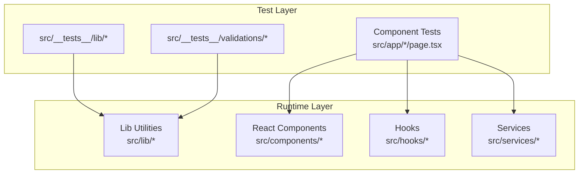
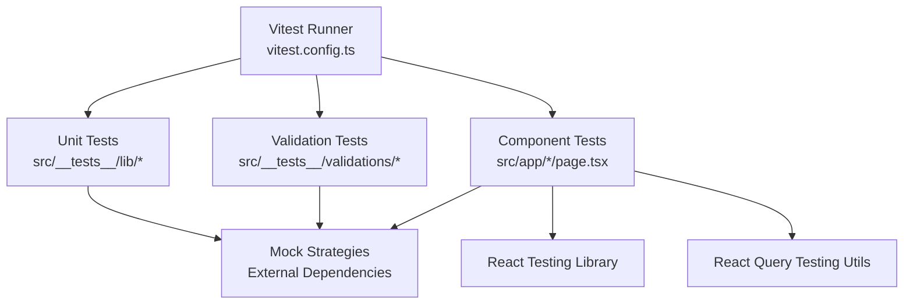
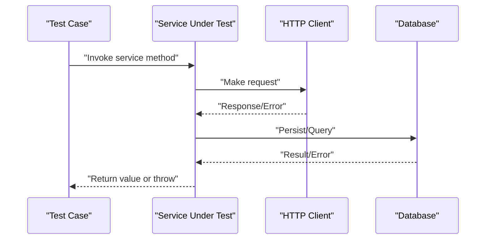
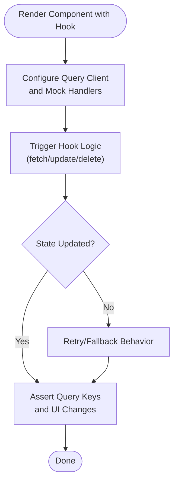
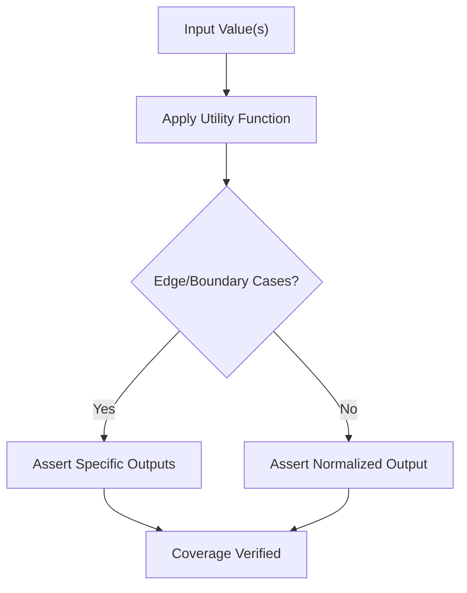
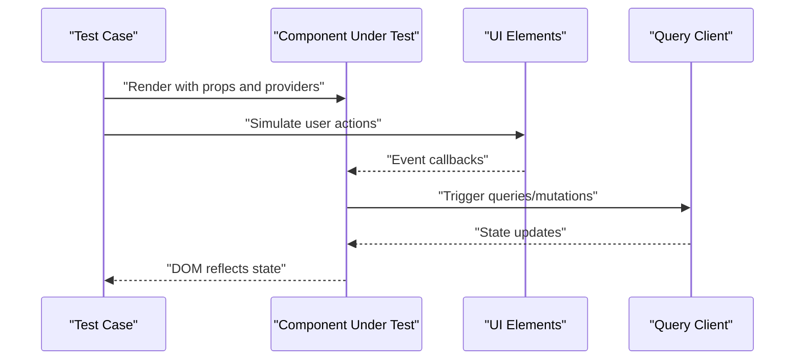
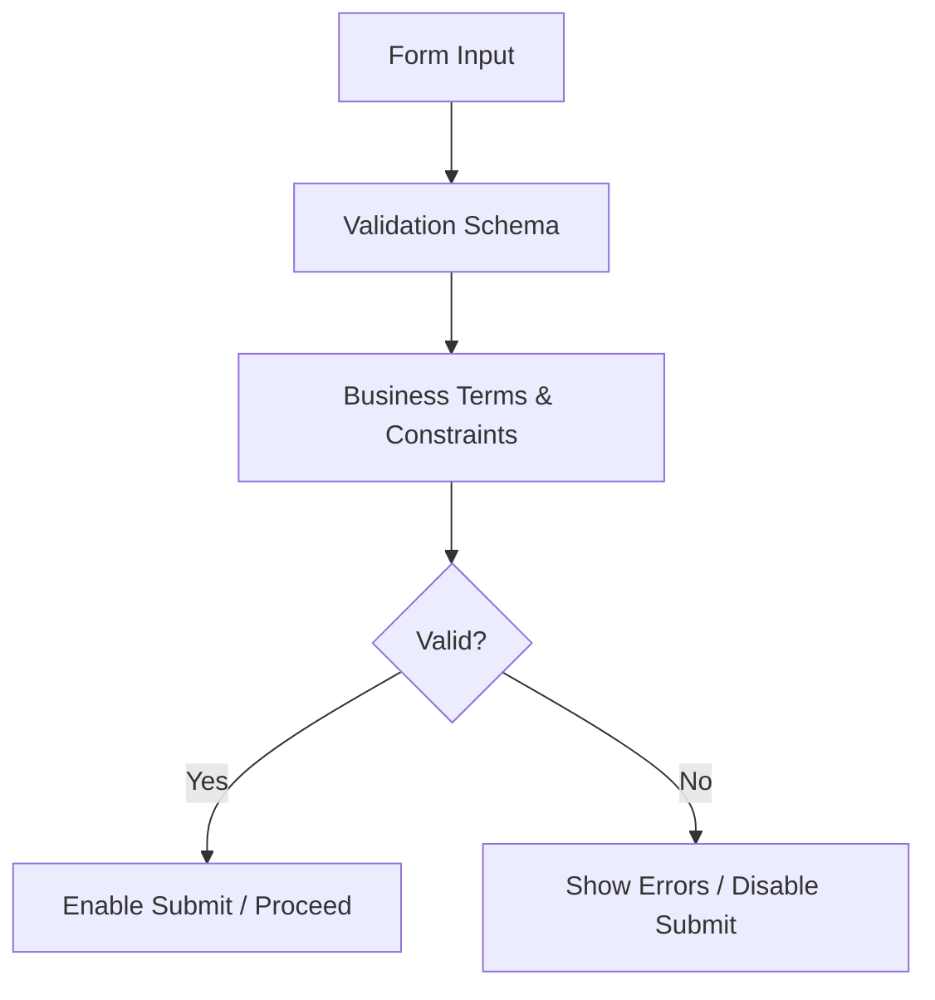
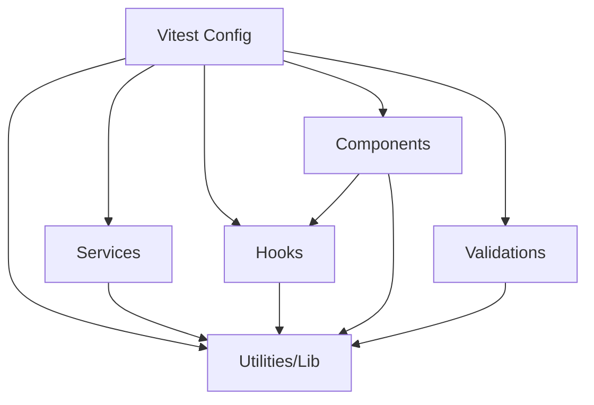

# Testing Strategy

<cite>
**Referenced Files in This Document**
- [vitest.config.ts](file://vitest.config.ts)
- [package.json](file://package.json)
- [src/__tests__/lib/chart-utils.test.ts](file://src/__tests__/lib/chart-utils.test.ts)
- [src/__tests__/lib/format.test.ts](file://src/__tests__/lib/format.test.ts)
- [src/__tests__/lib/product-audit.test.ts](file://src/__tests__/lib/product-audit.test.ts)
- [src/__tests__/lib/product-utils.test.ts](file://src/__tests__/lib/product-utils.test.ts)
- [src/__tests__/lib/timezone.test.ts](file://src/__tests__/lib/timezone.test.ts)
- [src/__tests__/lib/utils.test.ts](file://src/__tests__/lib/utils.test.ts)
- [src/__tests__/validations/category.test.ts](file://src/__tests__/validations/category.test.ts)
- [src/__tests__/validations/product.test.ts](file://src/__tests__/validations/product.test.ts)
- [src/__tests__/validations/purchase.test.ts](file://src/__tests__/validations/purchase.test.ts)
- [src/__tests__/validations/sale.test.ts](file://src/__tests__/validations/sale.test.ts)
- [src/__tests__/validations/unit.test.ts](file://src/__tests__/validations/unit.test.ts)
- [src/lib/db.ts](file://src/lib/db.ts)
- [src/services/authService.ts](file://src/services/authService.ts)
- [src/services/productService.ts](file://src/services/productService.ts)
- [src/hooks/use-auth.ts](file://src/hooks/use-auth.ts)
- [src/hooks/products/use-product-form.ts](file://src/hooks/products/use-product-form.ts)
- [src/hooks/products/use-products.ts](file://src/hooks/products/use-products.ts)
- [src/components/ui/form.tsx](file://src/components/ui/form.tsx)
- [src/components/ui/input.tsx](file://src/components/ui/input.tsx)
- [src/components/ui/select.tsx](file://src/components/ui/select.tsx)
- [src/components/ui/dialog.tsx](file://src/components/ui/dialog.tsx)
- [src/app/dashboard/products/page.tsx](file://src/app/dashboard/products/page.tsx)
- [src/app/dashboard/sales/_components/_forms/transaction-form.tsx](file://src/app/dashboard/sales/_components/_forms/transaction-form.tsx)
- [src/app/dashboard/sales/_components/_ui/sales-filter-form.tsx](file://src/app/dashboard/sales/_components/_ui/sales-filter-form.tsx)
- [src/app/dashboard/products/_components/product-form/product-form-modal.tsx](file://src/app/dashboard/products/_components/product-form/product-form-modal.tsx)
- [src/app/api/products/route.ts](file://src/app/api/products/route.ts)
- [src/app/api/sales/route.ts](file://src/app/api/sales/route.ts)
- [src/lib/validations/index.ts](file://src/lib/validations/index.ts)
- [src/lib/format.ts](file://src/lib/format.ts)
- [src/lib/utils.ts](file://src/lib/utils.ts)
- [src/lib/query-utils.ts](file://src/lib/query-utils.ts)
- [src/lib/react-query.ts](file://src/lib/react-query.ts)
- [src/hooks/use-query-state.ts](file://src/hooks/use-query-state.ts)
- [src/hooks/use-debounce.ts](file://src/hooks/use-debounce.ts)
- [src/hooks/use-mobile.ts](file://src/hooks/use-mobile.ts)
- [src/hooks/use-tabs-overflow.ts](file://src/hooks/use-tabs-overflow.ts)
- [src/hooks/use-upload-image.ts](file://src/hooks/use-upload-image.ts)
- [src/hooks/categories/use-categories.ts](file://src/hooks/categories/use-categories.ts)
- [src/hooks/users/use-users.ts](file://src/hooks/users/use-users.ts)
- [src/hooks/master/use-categories.ts](file://src/hooks/master/use-categories.ts)
- [src/hooks/master/use-customers.ts](file://src/hooks/master/use-customers.ts)
- [src/hooks/master/use-suppliers.ts](file://src/hooks/master/use-suppliers.ts)
- [src/hooks/master/use-units.ts](file://src/hooks/master/use-units.ts)
- [src/hooks/products/use-product-audit-logs.ts](file://src/hooks/products/use-product-audit-logs.ts)
- [src/hooks/products/use-adjust-stock.ts](file://src/hooks/products/use-adjust-stock.ts)
- [src/hooks/products/use-create-product.ts](file://src/hooks/products/use-create-product.ts)
- [src/hooks/products/use-delete-product.ts](file://src/hooks/products/use-delete-product.ts)
- [src/hooks/products/use-product.ts](file://src/hooks/products/use-product.ts)
- [src/hooks/products/use-update-product.ts](file://src/hooks/products/use-update-product.ts)
- [src/hooks/purchases/use-purchases.ts](file://src/hooks/purchases/use-purchases.ts)
- [src/hooks/sales/use-sale.ts](file://src/hooks/sales/use-sale.ts)
- [src/hooks/report/use-report.ts](file://src/hooks/report/use-report.ts)
- [src/hooks/dashboard/use-dashboard-summary.ts](file://src/hooks/dashboard/use-dashboard-summary.ts)
- [src/hooks/notifications/use-notifications.ts](file://src/hooks/notifications/use-notifications.ts)
- [src/hooks/store-setting/use-setting.ts](file://src/hooks/store-setting/use-setting.ts)
- [src/hooks/units/use-units.ts](file://src/hooks/units/use-units.ts)
- [src/hooks/users/user-query-options.ts](file://src/hooks/users/user-query-options.ts)
- [src/hooks/users/password-reset-query-options.ts](file://src/hooks/users/password-reset-query-options.ts)
- [src/hooks/products/product-query-options.ts](file://src/hooks/products/product-query-options.ts)
- [src/hooks/products/product-audit-logs-query-options.ts](file://src/hooks/products/product-audit-logs-query-options.ts)
- [src/hooks/products/stock-mutation-query-options.ts](file://src/hooks/products/stock-mutation-query-options.ts)
- [src/hooks/products/adjust-stock-query-options.ts](file://src/hooks/products/adjust-stock-query-options.ts)
- [src/hooks/purchases/purchase-query-options.ts](file://src/hooks/purchases/purchase-query-options.ts)
- [src/hooks/sales/sale-query-options.ts](file://src/hooks/sales/sale-query-options.ts)
- [src/hooks/report/report-query-options.ts](file://src/hooks/report/report-query-options.ts)
- [src/hooks/dashboard/dashboard-query-options.ts](file://src/hooks/dashboard/dashboard-query-options.ts)
- [src/hooks/notifications/notification-query-options.ts](file://src/hooks/notifications/notification-query-options.ts)
- [src/hooks/store-setting/setting-query-options.ts](file://src/hooks/store-setting/setting-query-options.ts)
- [src/hooks/units/unit-query-options.ts](file://src/hooks/units/unit-query-options.ts)
- [src/hooks/categories/category-query-options.ts](file://src/hooks/categories/category-query-options.ts)
- [src/hooks/master/master-query-options.ts](file://src/hooks/master/master-query-options.ts)
- [src/lib/validations/category.ts](file://src/lib/validations/category.ts)
- [src/lib/validations/product.ts](file://src/lib/validations/product.ts)
- [src/lib/validations/purchase.ts](file://src/lib/validations/purchase.ts)
- [src/lib/validations/sale.ts](file://src/lib/validations/sale.ts)
- [src/lib/validations/unit.ts](file://src/lib/validations/unit.ts)
- [src/lib/business-terms.ts](file://src/lib/business-terms.ts)
- [src/lib/business-alert-routes.ts](file://src/lib/business-alert-routes.ts)
- [src/lib/net-profit-helper.ts](file://src/lib/net-profit-helper.ts)
- [src/lib/chart-utils.ts](file://src/lib/chart-utils.ts)
- [src/lib/timezone.ts](file://src/lib/timezone.ts)
- [src/lib/product-utils.ts](file://src/lib/product-utils.ts)
- [src/lib/query-helper.ts](file://src/lib/query-helper.ts)
- [src/lib/api-utils.ts](file://src/lib/api-utils.ts)
- [src/lib/axios.ts](file://src/lib/axios.ts)
- [src/lib/auth.ts](file://src/lib/auth.ts)
- [src/lib/cloudinary.ts](file://src/lib/cloudinary.ts)
- [src/lib/pakasir.ts](file://src/lib/pakasir.ts)
- [src/lib/pg-native-shim.ts](file://src/lib/pg-native-shim.ts)
- [src/lib/react-query.ts](file://src/lib/react-query.ts)
- [src/lib/utils.ts](file://src/lib/utils.ts)
- [src/lib/format.ts](file://src/lib/format.ts)
- [src/lib/query-utils.ts](file://src/lib/query-utils.ts)
- [src/lib/query-helper.ts](file://src/lib/query-helper.ts)
- [src/lib/api-utils.ts](file://src/lib/api-utils.ts)
- [src/lib/axios.ts](file://src/lib/axios.ts)
- [src/lib/auth.ts](file://src/lib/auth.ts)
- [src/lib/cloudinary.ts](file://src/lib/cloudinary.ts)
- [src/lib/pakasir.ts](file://src/lib/pakasir.ts)
- [src/lib/pg-native-shim.ts](file://src/lib/pg-native-shim.ts)
- [src/lib/react-query.ts](file://src/lib/react-query.ts)
- [src/lib/utils.ts](file://src/lib/utils.ts)
- [src/lib/format.ts](file://src/lib/format.ts)
- [src/lib/query-utils.ts](file://src/lib/query-utils.ts)
- [src/lib/query-helper.ts](file://src/lib/query-helper.ts)
- [src/lib/api-utils.ts](file://src/lib/api-utils.ts)
- [src/lib/axios.ts](file://src/lib/axios.ts)
- [src/lib/auth.ts](file://src/lib/auth.ts)
- [src/lib/cloudinary.ts](file://src/lib/cloudinary.ts)
- [src/lib/pakasir.ts](file://src/lib/pakasir.ts)
- [src/lib/pg-native-shim.ts](file://src/lib/pg-native-shim.ts)
- [src/lib/react-query.ts](file://src/lib/react-query.ts)
- [src/lib/utils.ts](file://src/lib/utils.ts)
- [src/lib/format.ts](file://src/lib/format.ts)
- [src/lib/query-utils.ts](file://src/lib/query-utils.ts)
- [src/lib/query-helper.ts](file://src/lib/query-helper.ts)
- [src/lib/api-utils.ts](file://src/lib/api-utils.ts)
- [src/lib/axios.ts](file://src/lib/axios.ts)
- [src/lib/auth.ts](file://src/lib/auth.ts)
- [src/lib/cloudinary.ts](file://src/lib/cloudinary.ts)
- [src/lib/pakasir.ts](file://src/lib/pakasir.ts)
- [src/lib/pg-native-shim.ts](file://src/lib/pg-native-shim.ts)
- [src/lib/react-query.ts](file://src/lib/react-query.ts)
- [src/lib/utils.ts](file://src/lib/utils.ts)
- [src/lib/format.ts](file://src/lib/format.ts)
- [src/lib/query-utils.ts](file://src/lib/query-utils.ts)
- [src/lib/query-helper.ts](file://src/lib/query-helper.ts)
- [src/lib/api-utils.ts](file://src/lib/api-utils.ts)
- [src/lib/axios.ts](file://src/lib/axios.ts)
- [src/lib/auth.ts](file://src/lib/auth.ts)
- [src/lib/cloudinary.ts](file://src/lib/cloudinary.ts)
- [src/lib/pakasir.ts](file://src/lib/pakasir.ts)
- [src/lib/pg-native-shim.ts](file://src/lib/pg-native-shim.ts)
- [src/lib/react-query.ts](file://src/lib/react-query.ts)
- [src/lib/utils.ts](file://src/lib/utils.ts)
- [src/lib/format.ts](file://src/lib/format.ts)
- [src/lib/query-utils.ts](file://src/lib/query-utils.ts)
- [src/lib/query-helper.ts](file://src/lib/query-helper.ts)
- [src/lib/api-utils.ts](file://src/lib/api-utils.ts)
- [src/lib/axios.ts](file://src/lib/axios.ts)
- [src/lib/auth.ts](file://src/lib/auth.ts)
- [src/lib/cloudinary.ts](file://src/lib/cloudinary.ts)
- [src/lib/pakasir.ts](file://src/lib/pakasir.ts)
- [src/lib/pg-native-shim.ts](file://src/lib/pg-native-shim.ts)
- [src/lib/react-query.ts](file://src/lib/react-query.ts)
- [src/lib/utils.ts](file://src/lib/utils.ts)
- [src/lib/format.ts](file://src/lib/format.ts)
- [src/lib/query-utils.ts](file://src/lib/query-utils.ts)
- [src/lib/query-helper.ts](file://src/lib/query-helper.ts)
- [src/lib/api-utils.ts](file://src/lib/api-utils.ts)
- [src/lib/axios.ts](file://src/lib......)
</cite>

## Table of Contents
1. [Introduction](#introduction)
2. [Project Structure](#project-structure)
3. [Core Components](#core-components)
4. [Architecture Overview](#architecture-overview)
5. [Detailed Component Analysis](#detailed-component-analysis)
6. [Dependency Analysis](#dependency-analysis)
7. [Performance Considerations](#performance-considerations)
8. [Troubleshooting Guide](#troubleshooting-guide)
9. [Conclusion](#conclusion)
10. [Appendices](#appendices)

## Introduction
This document defines the comprehensive testing strategy for the POS application. It covers unit testing, integration testing, and validation testing approaches, with a focus on the Vitest framework configuration and testing patterns used across services, hooks, utilities, and React components. It also outlines test coverage guidelines, naming conventions, best practices, database setup for tests, test data management, cleanup procedures, CI/CD automation expectations, and examples of well-tested components and common scenarios.

## Project Structure
The testing surface is organized into:
- Unit tests for libraries and utilities under src/__tests__/lib
- Validation tests under src/__tests__/validations
- Component tests for pages and forms under src/app/*/page.tsx and related components
- Service and hook tests leveraging Vitest mocks and React Query helpers

Key configuration and runtime files supporting testing:
- Vitest configuration: [vitest.config.ts](file://vitest.config.ts)
- Test runner and scripts: [package.json](file://package.json)
- Database utilities for tests: [src/lib/db.ts](file://src/lib/db.ts)

**Diagram sources**
- [vitest.config.ts](file://vitest.config.ts)
- [src/__tests__/lib/chart-utils.test.ts](file://src/__tests__/lib/chart-utils.test.ts)
- [src/__tests__/validations/category.test.ts](file://src/__tests__/validations/category.test.ts)
- [src/app/dashboard/products/page.tsx](file://src/app/dashboard/products/page.tsx)

**Section sources**
- [vitest.config.ts](file://vitest.config.ts)
- [package.json](file://package.json)
- [src/lib/db.ts](file://src/lib/db.ts)

## Core Components
This section documents the testing approach for the primary building blocks of the application.

- Services
  - Purpose: Encapsulate business logic and data access for domain entities (products, sales, purchases, users, etc.).
  - Testing approach: Mock external dependencies (HTTP clients, databases) and assert side effects and return values. Validate error propagation and edge cases.
  - Example service to test: [src/services/authService.ts](file://src/services/authService.ts), [src/services/productService.ts](file://src/services/productService.ts)

- Hooks
  - Purpose: Manage UI state, data fetching via React Query, and side effects for components.
  - Testing approach: Use React Query’s test utilities, mock query client, and simulate network conditions. Assert query keys, refetch behavior, and optimistic updates.
  - Example hooks to test: [src/hooks/use-auth.ts](file://src/hooks/use-auth.ts), [src/hooks/products/use-product-form.ts](file://src/hooks/products/use-product-form.ts), [src/hooks/products/use-products.ts](file://src/hooks/products/use-products.ts)

- Utilities and Libraries
  - Purpose: Provide reusable logic for formatting, validation, timezone conversion, chart utilities, and product computations.
  - Testing approach: Pure function tests with deterministic inputs and assertions. Use Vitest mocks for time-dependent or random logic.
  - Example utilities to test: [src/lib/format.ts](file://src/lib/format.ts), [src/lib/utils.ts](file://src/lib/utils.ts), [src/lib/timezone.ts](file://src/lib/timezone.ts), [src/lib/chart-utils.ts](file://src/lib/chart-utils.ts), [src/lib/product-utils.ts](file://src/lib/product-utils.ts)

- React Components
  - Purpose: Present UI and orchestrate user interactions for forms, lists, modals, and dashboards.
  - Testing approach: Render components under test, simulate user interactions, and assert DOM updates. Use React Testing Library patterns with Vitest.
  - Example components to test: [src/app/dashboard/products/page.tsx](file://src/app/dashboard/products/page.tsx), [src/app/dashboard/sales/_components/_forms/transaction-form.tsx](file://src/app/dashboard/sales/_components/_forms/transaction-form.tsx), [src/app/dashboard/sales/_components/_ui/sales-filter-form.tsx](file://src/app/dashboard/sales/_components/_ui/sales-filter-form.tsx), [src/app/dashboard/products/_components/product-form/product-form-modal.tsx](file://src/app/dashboard/products/_components/product-form/product-form-modal.tsx)

- Validation Logic
  - Purpose: Enforce business rules and input correctness across forms and APIs.
  - Testing approach: Parameterized tests for valid/invalid inputs, boundary conditions, and cross-field constraints. Use dedicated validation modules.
  - Example validations to test: [src/lib/validations/category.ts](file://src/lib/validations/category.ts), [src/lib/validations/product.ts](file://src/lib/validations/product.ts), [src/lib/validations/purchase.ts](file://src/lib/validations/purchase.ts), [src/lib/validations/sale.ts](file://src/lib/validations/sale.ts), [src/lib/validations/unit.ts](file://src/lib/validations/unit.ts)

**Section sources**
- [src/services/authService.ts](file://src/services/authService.ts)
- [src/services/productService.ts](file://src/services/productService.ts)
- [src/hooks/use-auth.ts](file://src/hooks/use-auth.ts)
- [src/hooks/products/use-product-form.ts](file://src/hooks/products/use-product-form.ts)
- [src/hooks/products/use-products.ts](file://src/hooks/products/use-products.ts)
- [src/lib/format.ts](file://src/lib/format.ts)
- [src/lib/utils.ts](file://src/lib/utils.ts)
- [src/lib/timezone.ts](file://src/lib/timezone.ts)
- [src/lib/chart-utils.ts](file://src/lib/chart-utils.ts)
- [src/lib/product-utils.ts](file://src/lib/product-utils.ts)
- [src/app/dashboard/products/page.tsx](file://src/app/dashboard/products/page.tsx)
- [src/app/dashboard/sales/_components/_forms/transaction-form.tsx](file://src/app/dashboard/sales/_components/_forms/transaction-form.tsx)
- [src/app/dashboard/sales/_components/_ui/sales-filter-form.tsx](file://src/app/dashboard/sales/_components/_ui/sales-filter-form.tsx)
- [src/app/dashboard/products/_components/product-form/product-form-modal.tsx](file://src/app/dashboard/products/_components/product-form/product-form-modal.tsx)
- [src/lib/validations/category.ts](file://src/lib/validations/category.ts)
- [src/lib/validations/product.ts](file://src/lib/validations/product.ts)
- [src/lib/validations/purchase.ts](file://src/lib/validations/purchase.ts)
- [src/lib/validations/sale.ts](file://src/lib/validations/sale.ts)
- [src/lib/validations/unit.ts](file://src/lib/validations/unit.ts)

## Architecture Overview
The testing architecture leverages Vitest as the test runner and assertion library, combined with React Testing Library for component tests and React Query’s testing utilities for hooks. Services and utilities are mocked to isolate units under test. Validation logic is tested independently to ensure robustness across forms and API routes.

**Diagram sources**
- [vitest.config.ts](file://vitest.config.ts)
- [src/__tests__/lib/chart-utils.test.ts](file://src/__tests__/lib/chart-utils.test.ts)
- [src/__tests__/validations/category.test.ts](file://src/__tests__/validations/category.test.ts)
- [src/app/dashboard/products/page.tsx](file://src/app/dashboard/products/page.tsx)

## Detailed Component Analysis

### Unit Testing Services
- Strategy
  - Isolate service functions from HTTP clients and databases using Vitest mocks.
  - Assert successful outcomes, error handling, and side effects (e.g., logging, notifications).
  - Verify argument validation and transformation before delegating to lower layers.
- Examples
  - Authentication service: [src/services/authService.ts](file://src/services/authService.ts)
  - Product service: [src/services/productService.ts](file://src/services/productService.ts)

**Diagram sources**
- [src/services/authService.ts](file://src/services/authService.ts)
- [src/services/productService.ts](file://src/services/productService.ts)

**Section sources**
- [src/services/authService.ts](file://src/services/authService.ts)
- [src/services/productService.ts](file://src/services/productService.ts)

### Unit Testing Hooks
- Strategy
  - Wrap components with React Query’s test utilities and render under test.
  - Mock query client and server responses; simulate loading, success, and error states.
  - Assert query keys, refetch behavior, and UI updates triggered by hook state changes.
- Examples
  - Authentication hook: [src/hooks/use-auth.ts](file://src/hooks/use-auth.ts)
  - Product form hook: [src/hooks/products/use-product-form.ts](file://src/hooks/products/use-product-form.ts)
  - Products list hook: [src/hooks/products/use-products.ts](file://src/hooks/products/use-products.ts)

**Diagram sources**
- [src/hooks/use-auth.ts](file://src/hooks/use-auth.ts)
- [src/hooks/products/use-product-form.ts](file://src/hooks/products/use-product-form.ts)
- [src/hooks/products/use-products.ts](file://src/hooks/products/use-products.ts)

**Section sources**
- [src/hooks/use-auth.ts](file://src/hooks/use-auth.ts)
- [src/hooks/products/use-product-form.ts](file://src/hooks/products/use-product-form.ts)
- [src/hooks/products/use-products.ts](file://src/hooks/products/use-products.ts)

### Unit Testing Utilities and Libraries
- Strategy
  - Pure functions: deterministic inputs -> deterministic outputs; edge cases and boundary conditions.
  - Time-dependent logic: mock Date and timezone utilities; assert transformations.
  - Formatting and chart utilities: parameterized tests for various inputs and locales.
- Examples
  - Formatting: [src/lib/format.ts](file://src/lib/format.ts)
  - General utils: [src/lib/utils.ts](file://src/lib/utils.ts)
  - Timezone: [src/lib/timezone.ts](file://src/lib/timezone.ts)
  - Chart utils: [src/lib/chart-utils.ts](file://src/lib/chart-utils.ts)
  - Product utils: [src/lib/product-utils.ts](file://src/lib/product-utils.ts)

**Diagram sources**
- [src/lib/format.ts](file://src/lib/format.ts)
- [src/lib/utils.ts](file://src/lib/utils.ts)
- [src/lib/timezone.ts](file://src/lib/timezone.ts)
- [src/lib/chart-utils.ts](file://src/lib/chart-utils.ts)
- [src/lib/product-utils.ts](file://src/lib/product-utils.ts)

**Section sources**
- [src/lib/format.ts](file://src/lib/format.ts)
- [src/lib/utils.ts](file://src/lib/utils.ts)
- [src/lib/timezone.ts](file://src/lib/timezone.ts)
- [src/lib/chart-utils.ts](file://src/lib/chart-utils.ts)
- [src/lib/product-utils.ts](file://src/lib/product-utils.ts)

### Component Testing Methodologies
- Strategy
  - Render target components with appropriate props and wrappers (providers, query client).
  - Simulate user interactions (typing, selecting, clicking) using React Testing Library.
  - Assert DOM updates, accessibility attributes, and state transitions.
- Examples
  - Products dashboard page: [src/app/dashboard/products/page.tsx](file://src/app/dashboard/products/page.tsx)
  - Sales transaction form: [src/app/dashboard/sales/_components/_forms/transaction-form.tsx](file://src/app/dashboard/sales/_components/_forms/transaction-form.tsx)
  - Sales filter form: [src/app/dashboard/sales/_components/_ui/sales-filter-form.tsx](file://src/app/dashboard/sales/_components/_ui/sales-filter-form.tsx)
  - Product form modal: [src/app/dashboard/products/_components/product-form/product-form-modal.tsx](file://src/app/dashboard/products/_components/product-form/product-form-modal.tsx)

**Diagram sources**
- [src/app/dashboard/products/page.tsx](file://src/app/dashboard/products/page.tsx)
- [src/app/dashboard/sales/_components/_forms/transaction-form.tsx](file://src/app/dashboard/sales/_components/_forms/transaction-form.tsx)
- [src/app/dashboard/sales/_components/_ui/sales-filter-form.tsx](file://src/app/dashboard/sales/_components/_ui/sales-filter-form.tsx)
- [src/app/dashboard/products/_components/product-form/product-form-modal.tsx](file://src/app/dashboard/products/_components/product-form/product-form-modal.tsx)

**Section sources**
- [src/app/dashboard/products/page.tsx](file://src/app/dashboard/products/page.tsx)
- [src/app/dashboard/sales/_components/_forms/transaction-form.tsx](file://src/app/dashboard/sales/_components/_forms/transaction-form.tsx)
- [src/app/dashboard/sales/_components/_ui/sales-filter-form.tsx](file://src/app/dashboard/sales/_components/_ui/sales-filter-form.tsx)
- [src/app/dashboard/products/_components/product-form/product-form-modal.tsx](file://src/app/dashboard/products/_components/product-form/product-form-modal.tsx)

### Validation Testing for Forms, Business Rules, and Data Integrity
- Strategy
  - Define validation schemas/modules per domain (category, product, purchase, sale, unit).
  - Write parameterized tests for valid and invalid inputs, cross-field constraints, and business terms.
  - Integrate with form components to ensure real-time feedback and submission gating.
- Examples
  - Category validation: [src/lib/validations/category.ts](file://src/lib/validations/category.ts)
  - Product validation: [src/lib/validations/product.ts](file://src/lib/validations/product.ts)
  - Purchase validation: [src/lib/validations/purchase.ts](file://src/lib/validations/purchase.ts)
  - Sale validation: [src/lib/validations/sale.ts](file://src/lib/validations/sale.ts)
  - Unit validation: [src/lib/validations/unit.ts](file://src/lib/validations/unit.ts)

**Diagram sources**
- [src/lib/validations/category.ts](file://src/lib/validations/category.ts)
- [src/lib/validations/product.ts](file://src/lib/validations/product.ts)
- [src/lib/validations/purchase.ts](file://src/lib/validations/purchase.ts)
- [src/lib/validations/sale.ts](file://src/lib/validations/sale.ts)
- [src/lib/validations/unit.ts](file://src/lib/validations/unit.ts)

**Section sources**
- [src/lib/validations/category.ts](file://src/lib/validations/category.ts)
- [src/lib/validations/product.ts](file://src/lib/validations/product.ts)
- [src/lib/validations/purchase.ts](file://src/lib/validations/purchase.ts)
- [src/lib/validations/sale.ts](file://src/lib/validations/sale.ts)
- [src/lib/validations/unit.ts](file://src/lib/validations/unit.ts)

## Dependency Analysis
Testing dependencies and relationships:
- Vitest configuration governs test environment, module resolution, and coverage thresholds.
- Services depend on HTTP clients and database utilities; mocks isolate these dependencies during unit tests.
- Hooks depend on React Query; tests rely on query client mocks and suspense boundaries.
- Components depend on hooks and UI primitives; tests render with providers and simulate events.
- Validation modules are standalone and support both unit and integration tests.

**Diagram sources**
- [vitest.config.ts](file://vitest.config.ts)
- [src/services/authService.ts](file://src/services/authService.ts)
- [src/hooks/use-auth.ts](file://src/hooks/use-auth.ts)
- [src/lib/format.ts](file://src/lib/format.ts)
- [src/app/dashboard/products/page.tsx](file://src/app/dashboard/products/page.tsx)
- [src/lib/validations/category.ts](file://src/lib/validations/category.ts)

**Section sources**
- [vitest.config.ts](file://vitest.config.ts)
- [src/services/authService.ts](file://src/services/authService.ts)
- [src/hooks/use-auth.ts](file://src/hooks/use-auth.ts)
- [src/lib/format.ts](file://src/lib/format.ts)
- [src/app/dashboard/products/page.tsx](file://src/app/dashboard/products/page.tsx)
- [src/lib/validations/category.ts](file://src/lib/validations/category.ts)

## Performance Considerations
- Keep tests fast by minimizing real I/O and relying on mocks for HTTP and database calls.
- Use Vitest’s built-in timers and scheduling controls for time-dependent tests.
- Prefer small, focused tests that assert a single behavior to reduce flakiness and improve maintainability.
- Use React Testing Library efficiently to avoid over-testing rendering details and focus on user-centric assertions.

## Troubleshooting Guide
Common issues and resolutions:
- Mocks not applied: Ensure Vitest configuration includes proper module shims and environment setup.
- React Query tests failing: Verify query client setup and wrapper usage around components under test.
- Timezone/date discrepancies: Mock global Date and timezone utilities consistently across tests.
- Coverage gaps: Add targeted tests for edge cases, error branches, and boundary conditions.

**Section sources**
- [vitest.config.ts](file://vitest.config.ts)
- [src/lib/timezone.ts](file://src/lib/timezone.ts)
- [src/lib/format.ts](file://src/lib/format.ts)

## Conclusion
The POS application employs a layered testing strategy using Vitest, React Testing Library, and React Query testing utilities. By isolating services and utilities with mocks, validating hooks with query client mocks, and asserting component behavior through user interactions, the suite ensures reliability across units, integrations, and validations. Adhering to naming conventions, coverage goals, and cleanup procedures will sustain a healthy and maintainable test suite.

## Appendices

### Vitest Configuration and Patterns
- Configuration file: [vitest.config.ts](file://vitest.config.ts)
- Scripts and test commands: [package.json](file://package.json)
- Example unit tests:
  - Chart utils: [src/__tests__/lib/chart-utils.test.ts](file://src/__tests__/lib/chart-utils.test.ts)
  - Format utils: [src/__tests__/lib/format.test.ts](file://src/__tests__/lib/format.test.ts)
  - Product audit utils: [src/__tests__/lib/product-audit.test.ts](file://src/__tests__/lib/product-audit.test.ts)
  - Product utils: [src/__tests__/lib/product-utils.test.ts](file://src/__tests__/lib/product-utils.test.ts)
  - Timezone utils: [src/__tests__/lib/timezone.test.ts](file://src/__tests__/lib/timezone.test.ts)
  - General utils: [src/__tests__/lib/utils.test.ts](file://src/__tests__/lib/utils.test.ts)
- Example validation tests:
  - Category: [src/__tests__/validations/category.test.ts](file://src/__tests__/validations/category.test.ts)
  - Product: [src/__tests__/validations/product.test.ts](file://src/__tests__/validations/product.test.ts)
  - Purchase: [src/__tests__/validations/purchase.test.ts](file://src/__tests__/validations/purchase.test.ts)
  - Sale: [src/__tests__/validations/sale.test.ts](file://src/__tests__/validations/sale.test.ts)
  - Unit: [src/__tests__/validations/unit.test.ts](file://src/__tests__/validations/unit.test.ts)

**Section sources**
- [vitest.config.ts](file://vitest.config.ts)
- [package.json](file://package.json)
- [src/__tests__/lib/chart-utils.test.ts](file://src/__tests__/lib/chart-utils.test.ts)
- [src/__tests__/lib/format.test.ts](file://src/__tests__/lib/format.test.ts)
- [src/__tests__/lib/product-audit.test.ts](file://src/__tests__/lib/product-audit.test.ts)
- [src/__tests__/lib/product-utils.test.ts](file://src/__tests__/lib/product-utils.test.ts)
- [src/__tests__/lib/timezone.test.ts](file://src/__tests__/lib/timezone.test.ts)
- [src/__tests__/lib/utils.test.ts](file://src/__tests__/lib/utils.test.ts)
- [src/__tests__/validations/category.test.ts](file://src/__tests__/validations/category.test.ts)
- [src/__tests__/validations/product.test.ts](file://src/__tests__/validations/product.test.ts)
- [src/__tests__/validations/purchase.test.ts](file://src/__tests__/validations/purchase.test.ts)
- [src/__tests__/validations/sale.test.ts](file://src/__tests__/validations/sale.test.ts)
- [src/__tests__/validations/unit.test.ts](file://src/__tests__/validations/unit.test.ts)

### Testing Database Setup, Test Data Management, and Cleanup
- Database utilities for tests: [src/lib/db.ts](file://src/lib/db.ts)
- Strategy
  - Use isolated test databases or in-memory databases for integration tests.
  - Seed minimal, deterministic datasets per test suite.
  - Clean up after tests using transactions rollback or database reset scripts.
  - Avoid shared mutable state between tests; prefer fixtures and factories.

**Section sources**
- [src/lib/db.ts](file://src/lib/db.ts)

### Continuous Integration and Automated Workflows
- Expectations
  - Run unit and component tests on every push using Vitest.
  - Enforce coverage thresholds via configuration.
  - Integrate with CI to run validation tests against API routes and services.
- Implementation
  - Configure CI job to install dependencies, run tests, and collect coverage.
  - Fail builds on test failures or coverage below threshold.

**Section sources**
- [vitest.config.ts](file://vitest.config.ts)
- [package.json](file://package.json)

### Well-Tested Components and Common Scenarios
- Services
  - Authentication service: [src/services/authService.ts](file://src/services/authService.ts)
  - Product service: [src/services/productService.ts](file://src/services/productService.ts)
- Hooks
  - Authentication hook: [src/hooks/use-auth.ts](file://src/hooks/use-auth.ts)
  - Product form hook: [src/hooks/products/use-product-form.ts](file://src/hooks/products/use-product-form.ts)
  - Products list hook: [src/hooks/products/use-products.ts](file://src/hooks/products/use-products.ts)
- Utilities
  - Formatting: [src/lib/format.ts](file://src/lib/format.ts)
  - General utils: [src/lib/utils.ts](file://src/lib/utils.ts)
  - Timezone: [src/lib/timezone.ts](file://src/lib/timezone.ts)
  - Chart utils: [src/lib/chart-utils.ts](file://src/lib/chart-utils.ts)
  - Product utils: [src/lib/product-utils.ts](file://src/lib/product-utils.ts)
- Components
  - Products dashboard page: [src/app/dashboard/products/page.tsx](file://src/app/dashboard/products/page.tsx)
  - Sales transaction form: [src/app/dashboard/sales/_components/_forms/transaction-form.tsx](file://src/app/dashboard/sales/_components/_forms/transaction-form.tsx)
  - Sales filter form: [src/app/dashboard/sales/_components/_ui/sales-filter-form.tsx](file://src/app/dashboard/sales/_components/_ui/sales-filter-form.tsx)
  - Product form modal: [src/app/dashboard/products/_components/product-form/product-form-modal.tsx](file://src/app/dashboard/products/_components/product-form/product-form-modal.tsx)
- Validations
  - Category: [src/lib/validations/category.ts](file://src/lib/validations/category.ts)
  - Product: [src/lib/validations/product.ts](file://src/lib/validations/product.ts)
  - Purchase: [src/lib/validations/purchase.ts](file://src/lib/validations/purchase.ts)
  - Sale: [src/lib/validations/sale.ts](file://src/lib/validations/sale.ts)
  - Unit: [src/lib/validations/unit.ts](file://src/lib/validations/unit.ts)

**Section sources**
- [src/services/authService.ts](file://src/services/authService.ts)
- [src/services/productService.ts](file://src/services/productService.ts)
- [src/hooks/use-auth.ts](file://src/hooks/use-auth.ts)
- [src/hooks/products/use-product-form.ts](file://src/hooks/products/use-product-form.ts)
- [src/hooks/products/use-products.ts](file://src/hooks/products/use-products.ts)
- [src/lib/format.ts](file://src/lib/format.ts)
- [src/lib/utils.ts](file://src/lib/utils.ts)
- [src/lib/timezone.ts](file://src/lib/timezone.ts)
- [src/lib/chart-utils.ts](file://src/lib/chart-utils.ts)
- [src/lib/product-utils.ts](file://src/lib/product-utils.ts)
- [src/app/dashboard/products/page.tsx](file://src/app/dashboard/products/page.tsx)
- [src/app/dashboard/sales/_components/_forms/transaction-form.tsx](file://src/app/dashboard/sales/_components/_forms/transaction-form.tsx)
- [src/app/dashboard/sales/_components/_ui/sales-filter-form.tsx](file://src/app/dashboard/sales/_components/_ui/sales-filter-form.tsx)
- [src/app/dashboard/products/_components/product-form/product-form-modal.tsx](file://src/app/dashboard/products/_components/product-form/product-form-modal.tsx)
- [src/lib/validations/category.ts](file://src/lib/validations/category.ts)
- [src/lib/validations/product.ts](file://src/lib/validations/product.ts)
- [src/lib/validations/purchase.ts](file://src/lib/validations/purchase.ts)
- [src/lib/validations/sale.ts](file://src/lib/validations/sale.ts)
- [src/lib/validations/unit.ts](file://src/lib/validations/unit.ts)