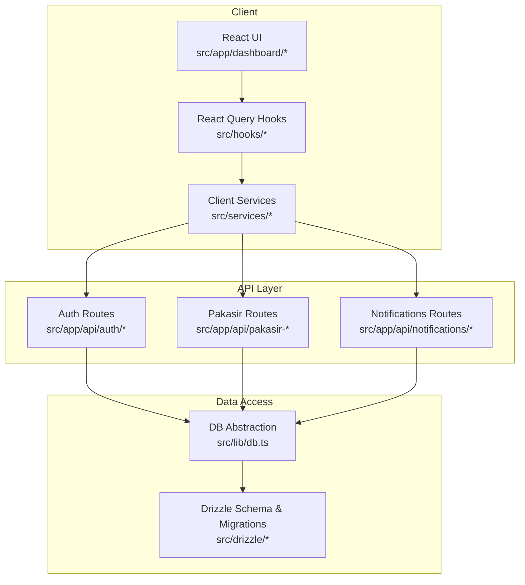
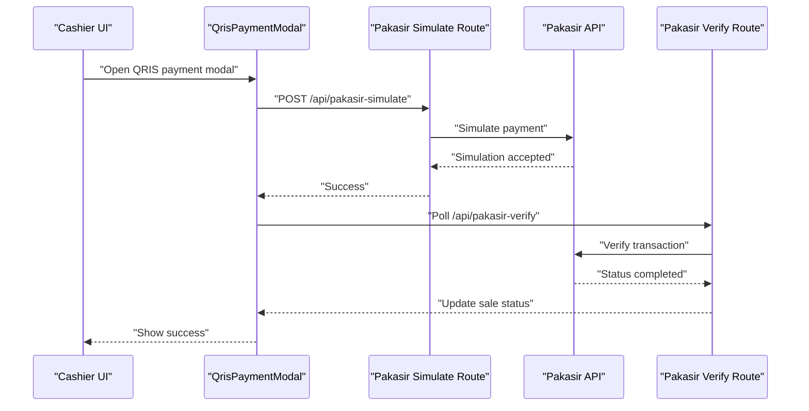
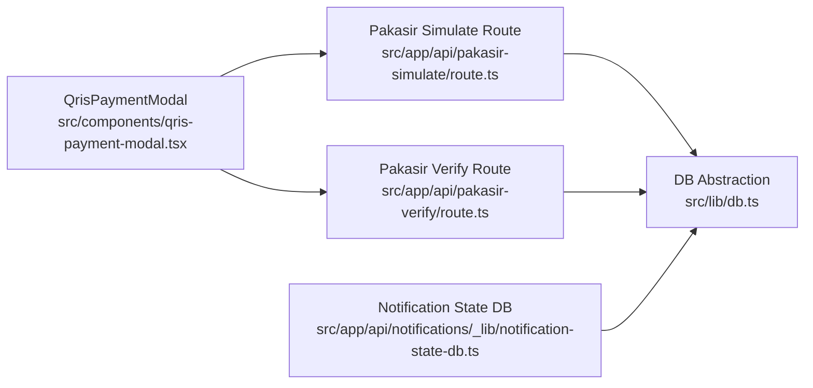
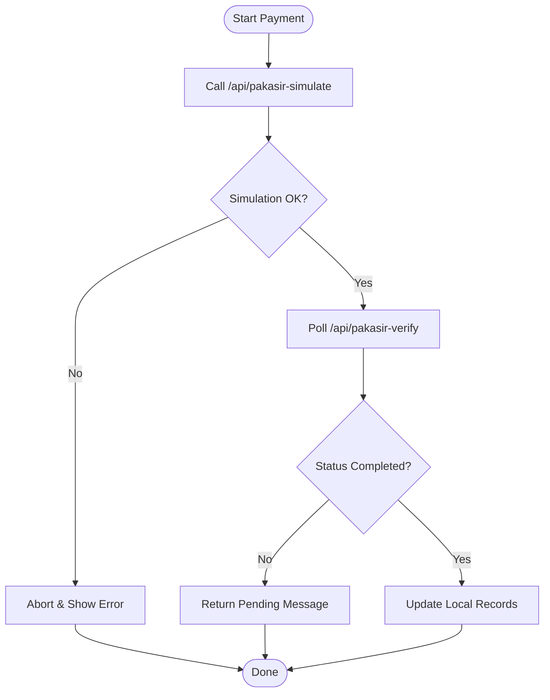
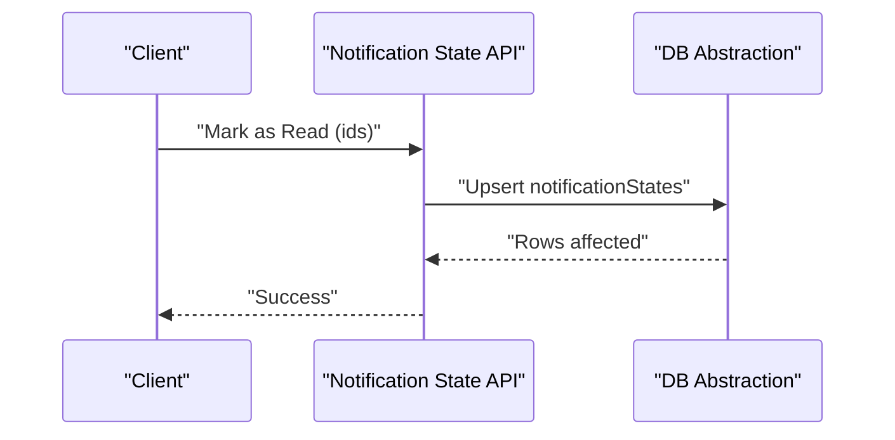

# Troubleshooting & FAQ

<cite>
**Referenced Files in This Document**
- [README.md](file://README.md)
- [CALCULATIONS.md](file://CALCULATIONS.md)
- [src/lib/db.ts](file://src/lib/db.ts)
- [src/app/api/auth/logout/route.ts](file://src/app/api/auth/logout/route.ts)
- [src/hooks/use-auth.ts](file://src/hooks/use-auth.ts)
- [src/services/authService.ts](file://src/services/authService.ts)
- [src/components/qris-payment-modal.tsx](file://src/components/qris-payment-modal.tsx)
- [src/app/api/pakasir-simulate/route.ts](file://src/app/api/pakasir-simulate/route.ts)
- [src/app/api/pakasir-verify/route.ts](file://src/app/api/pakasir-verify/route.ts)
- [src/app/api/notifications/_lib/notification-state-db.ts](file://src/app/api/notifications/_lib/notification-state-db.ts)
- [src/app/api/notifications/_lib/notification-logic.test.ts](file://src/app/api/notifications/_lib/notification-logic.test.ts)
- [src/drizzle/meta/0000_snapshot.json](file://src/drizzle/meta/0000_snapshot.json)
- [src/drizzle/meta/0001_snapshot.json](file://src/drizzle/meta/0001_snapshot.json)
- [src/drizzle/meta/_journal.json](file://src/drizzle/meta/_journal.json)
- [docs/blackbox_testing.md](file://docs/blackbox_testing.md)
- [docs/uml-activity-sales.puml](file://docs/uml-activity-sales.puml)
</cite>

## Table of Contents
1. [Introduction](#introduction)
2. [Project Structure](#project-structure)
3. [Core Components](#core-components)
4. [Architecture Overview](#architecture-overview)
5. [Detailed Component Analysis](#detailed-component-analysis)
6. [Dependency Analysis](#dependency-analysis)
7. [Performance Considerations](#performance-considerations)
8. [Troubleshooting Guide](#troubleshooting-guide)
9. [FAQ](#faq)
10. [Conclusion](#conclusion)
11. [Appendices](#appendices)

## Introduction
This document provides comprehensive troubleshooting and Frequently Asked Questions for the POS application. It focuses on diagnosing and resolving issues related to:
- Database connectivity and schema integrity
- Authentication failures and session handling
- Payment processing via QRIS/Pakasir integrations
- Calculation-related discrepancies (Weighted Average Cost and inventory valuation)
- Notification system anomalies
- Frontend debugging techniques for components and API flows
- Error codes, log analysis, and diagnostic tools
- Preventive measures, maintenance, and escalation procedures

## Project Structure
The POS application is a Next.js application with a modular API surface under src/app/api, a client-side React UI under src/app/dashboard, and backend services under src/services. Data access is centralized via Drizzle ORM with a Hyperdrive/PostgreSQL connection abstraction.

**Diagram sources**
- [src/lib/db.ts:1-48](file://src/lib/db.ts#L1-L48)
- [src/app/api/auth/logout/route.ts:1-18](file://src/app/api/auth/logout/route.ts#L1-L18)
- [src/app/api/pakasir-simulate/route.ts:82-118](file://src/app/api/pakasir-simulate/route.ts#L82-L118)
- [src/app/api/pakasir-verify/route.ts:42-79](file://src/app/api/pakasir-verify/route.ts#L42-L79)
- [src/app/api/notifications/_lib/notification-state-db.ts:1-96](file://src/app/api/notifications/_lib/notification-state-db.ts#L1-L96)

**Section sources**
- [src/lib/db.ts:1-48](file://src/lib/db.ts#L1-L48)
- [src/drizzle/meta/_journal.json:1-34](file://src/drizzle/meta/_journal.json#L1-L34)

## Core Components
- Database abstraction and connection pooling with Hyperdrive/PostgreSQL
- Authentication service with session deletion and error handling
- QRIS payment simulation and verification with external provider
- Notification state persistence and read/dismiss logic
- Calculation methodology for inventory valuation using Weighted Average Cost

**Section sources**
- [src/lib/db.ts:1-48](file://src/lib/db.ts#L1-L48)
- [src/app/api/auth/logout/route.ts:1-18](file://src/app/api/auth/logout/route.ts#L1-L18)
- [src/components/qris-payment-modal.tsx:36-196](file://src/components/qris-payment-modal.tsx#L36-L196)
- [src/app/api/pakasir-simulate/route.ts:82-118](file://src/app/api/pakasir-simulate/route.ts#L82-L118)
- [src/app/api/pakasir-verify/route.ts:42-79](file://src/app/api/pakasir-verify/route.ts#L42-L79)
- [src/app/api/notifications/_lib/notification-state-db.ts:1-96](file://src/app/api/notifications/_lib/notification-state-db.ts#L1-L96)
- [README.md:1-24](file://README.md#L1-L24)

## Architecture Overview
The system integrates frontend components with serverless API routes. Payment flows involve simulation and verification against an external provider, while notifications leverage a dedicated state table keyed by user and notification ID.

**Diagram sources**
- [src/components/qris-payment-modal.tsx:36-196](file://src/components/qris-payment-modal.tsx#L36-L196)
- [src/app/api/pakasir-simulate/route.ts:82-118](file://src/app/api/pakasir-simulate/route.ts#L82-L118)
- [src/app/api/pakasir-verify/route.ts:42-79](file://src/app/api/pakasir-verify/route.ts#L42-L79)

## Detailed Component Analysis

### Database Connectivity and Schema Integrity
- Connection string resolution supports both Hyperdrive bindings and DATABASE_URL environment variable.
- Drizzle schema is merged with relations and cached per connection string.
- Migration journal tracks applied migrations.

Common symptoms of connectivity issues:
- Application fails to load data or throws connection errors during queries.
- Schema mismatches cause runtime errors when accessing tables.

Resolution steps:
- Verify DATABASE_URL/HYPERDRIVE binding availability.
- Confirm migration journal entries align with deployed schema snapshots.
- Check pool configuration and network access to the database endpoint.

**Section sources**
- [src/lib/db.ts:13-38](file://src/lib/db.ts#L13-L38)
- [src/drizzle/meta/_journal.json:1-34](file://src/drizzle/meta/_journal.json#L1-L34)
- [src/drizzle/meta/0000_snapshot.json:1-55](file://src/drizzle/meta/0000_snapshot.json#L1-L55)
- [src/drizzle/meta/0001_snapshot.json:1-54](file://src/drizzle/meta/0001_snapshot.json#L1-L54)

### Authentication Failures
- Logout route attempts to delete the session and returns structured JSON responses.
- Client-side hook manages auth state and logout mutation with navigation on success.

Typical failure scenarios:
- Session deletion fails due to missing cookie/session store.
- Network errors prevent logout completion.
- Client cache not invalidated after logout.

Resolution steps:
- Inspect server logs for logout route error traces.
- Ensure cookies/session store is configured in hosting environment.
- Clear browser cache/local storage and re-login.

**Section sources**
- [src/app/api/auth/logout/route.ts:1-18](file://src/app/api/auth/logout/route.ts#L1-L18)
- [src/hooks/use-auth.ts:1-33](file://src/hooks/use-auth.ts#L1-L33)
- [src/services/authService.ts:47-62](file://src/services/authService.ts#L47-L62)

### Payment Processing Errors (QRIS/Pakasir)
- Simulation route sends a payment simulation to the external provider and retries verification with bounded polling.
- Verification route validates sale existence, checks QRIS status, and updates local records upon completion.
- Frontend modal coordinates simulation, polling, and cancellation.

Common symptoms:
- Simulation returns non-JSON response or HTTP error.
- Verification indicates pending status or external API failure.
- Cancellation does not revert stock or balance.

Resolution steps:
- Validate sandbox mode and credentials in the external provider dashboard.
- Confirm expected amount calculation matches sale totals minus used balance.
- Retry verification after short delay; escalate to external provider if persistent failures occur.

**Section sources**
- [src/components/qris-payment-modal.tsx:36-196](file://src/components/qris-payment-modal.tsx#L36-L196)
- [src/app/api/pakasir-simulate/route.ts:82-118](file://src/app/api/pakasir-simulate/route.ts#L82-L118)
- [src/app/api/pakasir-verify/route.ts:42-79](file://src/app/api/pakasir-verify/route.ts#L42-L79)

### Calculation-Related Issues (WAC and Inventory Valuation)
- The system uses Weighted Average Cost (WAC) with base unit consistency and decimal precision.
- Purchase items include a cost_before field to anchor recalculations during edits/undos.
- Black box testing documents expected behaviors for purchase creation, editing, and filtering.

Common symptoms:
- Average cost jumps or drops unexpectedly after purchases.
- Stock adjustments produce inconsistent valuations.
- Editing a purchase does not revert prior state before re-application.

Resolution steps:
- Ensure purchase quantities and prices are recorded in base units.
- Confirm cost_before is captured during purchase creation.
- Recalculate affected SKUs by re-applying purchase edits and verifying cumulative WAC.

**Section sources**
- [README.md:1-24](file://README.md#L1-L24)
- [CALCULATIONS.md](file://CALCULATIONS.md)
- [docs/blackbox_testing.md:20-31](file://docs/blackbox_testing.md#L20-L31)

### Notification System Problems
- Notification state is persisted per user and notification ID with read/dismiss timestamps.
- Sorting and deduplication logic ensure coherent display and state transitions.
- Tests validate priority ordering and reopening behavior for repeated occurrences.

Common symptoms:
- Notifications appear duplicated or not sorted by priority.
- Read state not preserved across sessions.
- Dismissed notifications reappear unexpectedly.

Resolution steps:
- Verify notification state table integrity and conflict resolution behavior.
- Confirm client-side state synchronization after read/dismiss actions.
- Review sorting and deduplication logic for repeated events.

**Section sources**
- [src/app/api/notifications/_lib/notification-state-db.ts:1-96](file://src/app/api/notifications/_lib/notification-state-db.ts#L1-L96)
- [src/app/api/notifications/_lib/notification-logic.test.ts:1-127](file://src/app/api/notifications/_lib/notification-logic.test.ts#L1-L127)

## Dependency Analysis
The following diagram highlights key dependencies among components involved in payment processing and notifications.

**Diagram sources**
- [src/components/qris-payment-modal.tsx:36-196](file://src/components/qris-payment-modal.tsx#L36-L196)
- [src/app/api/pakasir-simulate/route.ts:82-118](file://src/app/api/pakasir-simulate/route.ts#L82-L118)
- [src/app/api/pakasir-verify/route.ts:42-79](file://src/app/api/pakasir-verify/route.ts#L42-L79)
- [src/lib/db.ts:1-48](file://src/lib/db.ts#L1-L48)
- [src/app/api/notifications/_lib/notification-state-db.ts:1-96](file://src/app/api/notifications/_lib/notification-state-db.ts#L1-L96)

**Section sources**
- [src/lib/db.ts:1-48](file://src/lib/db.ts#L1-L48)
- [src/app/api/pakasir-simulate/route.ts:82-118](file://src/app/api/pakasir-simulate/route.ts#L82-L118)
- [src/app/api/pakasir-verify/route.ts:42-79](file://src/app/api/pakasir-verify/route.ts#L42-L79)
- [src/app/api/notifications/_lib/notification-state-db.ts:1-96](file://src/app/api/notifications/_lib/notification-state-db.ts#L1-L96)

## Performance Considerations
- Database connection caching reduces overhead; ensure proper cache invalidation on configuration changes.
- QRIS polling limits retries and delays to minimize external API pressure.
- Notification state updates use upsert semantics to reduce write contention.

Recommendations:
- Monitor external provider rate limits and adjust polling intervals accordingly.
- Optimize queries fetching notification states by filtering with explicit IDs.
- Use pagination and filters for large datasets (sales, purchases, audit logs).

[No sources needed since this section provides general guidance]

## Troubleshooting Guide

### Step-by-Step Workflows

#### Database Connection Problems
1. Verify environment variables:
   - Ensure DATABASE_URL is set and reachable.
   - Confirm HYPERDRIVE binding is present in serverless environments.
2. Check migration status:
   - Compare migration journal with applied snapshots.
3. Test connectivity:
   - Run a simple SELECT query via the DB abstraction.
4. Inspect logs:
   - Look for connection timeouts or authentication errors.

Resolution outcomes:
- Correct environment variables and retry.
- Apply missing migrations or reconcile schema differences.
- Investigate network/firewall restrictions.

**Section sources**
- [src/lib/db.ts:13-38](file://src/lib/db.ts#L13-L38)
- [src/drizzle/meta/_journal.json:1-34](file://src/drizzle/meta/_journal.json#L1-L34)

#### Authentication Failures
1. Attempt logout:
   - Call logout endpoint and confirm JSON response.
2. Inspect client state:
   - Ensure auth query cache is cleared and router navigates to login.
3. Retest login:
   - Re-attempt login and monitor for error messages.
4. Check session store:
   - Confirm cookies/session store availability in hosting environment.

Resolution outcomes:
- Fix session store configuration.
- Resolve network errors and retry.
- Clear client cache and retry.

**Section sources**
- [src/app/api/auth/logout/route.ts:1-18](file://src/app/api/auth/logout/route.ts#L1-L18)
- [src/hooks/use-auth.ts:1-33](file://src/hooks/use-auth.ts#L1-L33)

#### Payment Processing Errors (QRIS/Pakasir)
1. Trigger simulation:
   - Open QRIS modal and initiate simulation.
2. Validate response:
   - Confirm JSON success; inspect error message on failure.
3. Poll verification:
   - Wait for completion or check pending status.
4. Cancel if needed:
   - Use cancel endpoint and verify rollback.

Resolution outcomes:
- Adjust sandbox settings and credentials.
- Retry after delay; escalate to provider if unresolved.

**Section sources**
- [src/components/qris-payment-modal.tsx:36-196](file://src/components/qris-payment-modal.tsx#L36-L196)
- [src/app/api/pakasir-simulate/route.ts:82-118](file://src/app/api/pakasir-simulate/route.ts#L82-L118)
- [src/app/api/pakasir-verify/route.ts:42-79](file://src/app/api/pakasir-verify/route.ts#L42-L79)

#### Calculation-Related Issues (WAC/Inventory)
1. Validate purchase data:
   - Confirm quantities and prices are in base units.
   - Ensure cost_before is captured.
2. Recalculate:
   - Re-apply purchase edits and verify average cost updates.
3. Audit logs:
   - Cross-check purchase and stock mutation records.

Resolution outcomes:
- Correct base unit conversions.
- Reconcile purchase edits using cost_before.

**Section sources**
- [README.md:1-24](file://README.md#L1-L24)
- [docs/blackbox_testing.md:20-31](file://docs/blackbox_testing.md#L20-L31)

#### Notification System Problems
1. Check read/dismiss state:
   - Confirm upsert behavior for notification states.
2. Sort and deduplicate:
   - Validate priority ordering and reopening logic.
3. Reproduce and log:
   - Capture notification IDs and timestamps.

Resolution outcomes:
- Fix state conflicts and synchronize client/server state.
- Adjust deduplication thresholds if needed.

**Section sources**
- [src/app/api/notifications/_lib/notification-state-db.ts:1-96](file://src/app/api/notifications/_lib/notification-state-db.ts#L1-L96)
- [src/app/api/notifications/_lib/notification-logic.test.ts:1-127](file://src/app/api/notifications/_lib/notification-logic.test.ts#L1-L127)

### Debugging Techniques

- Frontend components:
  - Enable React DevTools and monitor query keys and mutations.
  - Inspect toast/error messages emitted by payment modal.
- API endpoints:
  - Use curl or Postman to hit routes directly and capture JSON responses.
  - Observe server logs for error stacks and external provider errors.
- Database operations:
  - Run targeted SELECT statements for notification states and recent transactions.
  - Validate migration journal alignment with schema snapshots.

**Section sources**
- [src/components/qris-payment-modal.tsx:36-196](file://src/components/qris-payment-modal.tsx#L36-L196)
- [src/app/api/pakasir-simulate/route.ts:82-118](file://src/app/api/pakasir-simulate/route.ts#L82-L118)
- [src/app/api/pakasir-verify/route.ts:42-79](file://src/app/api/pakasir-verify/route.ts#L42-L79)
- [src/app/api/notifications/_lib/notification-state-db.ts:1-96](file://src/app/api/notifications/_lib/notification-state-db.ts#L1-L96)

### Error Codes and Log Analysis
- Logout route returns structured JSON with success flag and message; HTTP 500 indicates internal failure.
- QRIS simulate route returns HTTP 502 on external provider errors; includes guidance to check sandbox mode.
- QRIS verify route returns HTTP 404 for missing sale, HTTP 400 for non-QRIS transactions, and HTTP 502 for external verification failures.

Log analysis tips:
- Search for "[Pakasir Verify]" and "[pakasir-simulate]" prefixes in server logs.
- Correlate frontend toast messages with API response bodies.
- Inspect database upsert logs for notification state updates.

**Section sources**
- [src/app/api/auth/logout/route.ts:1-18](file://src/app/api/auth/logout/route.ts#L1-L18)
- [src/app/api/pakasir-simulate/route.ts:82-118](file://src/app/api/pakasir-simulate/route.ts#L82-L118)
- [src/app/api/pakasir-verify/route.ts:42-79](file://src/app/api/pakasir-verify/route.ts#L42-L79)

### Escalation Procedures and Support Resources
- For QRIS/Pakasir issues:
  - Verify sandbox mode and credentials in the provider dashboard.
  - Contact provider support with correlation IDs and error logs.
- For database schema issues:
  - Reconcile migration journal with snapshots and re-run migrations if needed.
- Internal escalation:
  - Collect logs, reproduction steps, and environment details.
  - Engage backend/frontend leads for cross-layer diagnostics.

[No sources needed since this section provides general guidance]

## FAQ

- What is the inventory valuation method?
  - The system uses Weighted Average Cost (WAC) with base unit consistency and decimal precision. See [README.md:1-24](file://README.md#L1-L24) and [CALCULATIONS.md](file://CALCULATIONS.md).

- How does the QRIS payment flow work?
  - The flow simulates payment, polls for completion, and updates the sale record. See [src/components/qris-payment-modal.tsx:36-196](file://src/components/qris-payment-modal.tsx#L36-L196) and [docs/uml-activity-sales.puml:44-62](file://docs/uml-activity-sales.puml#L44-L62).

- Where are notification states stored?
  - Notification states are persisted per user and notification ID with read/dismiss timestamps. See [src/app/api/notifications/_lib/notification-state-db.ts:1-96](file://src/app/api/notifications/_lib/notification-state-db.ts#L1-L96).

- How do I fix authentication logout failures?
  - Ensure session deletion succeeds and client cache is cleared. See [src/app/api/auth/logout/route.ts:1-18](file://src/app/api/auth/logout/route.ts#L1-L18) and [src/hooks/use-auth.ts:1-33](file://src/hooks/use-auth.ts#L1-L33).

- What should I check if WAC calculations seem wrong?
  - Confirm base unit usage, cost_before capture, and re-apply edits to recalculate. See [README.md:1-24](file://README.md#L1-L24) and [docs/blackbox_testing.md:20-31](file://docs/blackbox_testing.md#L20-L31).

- Are there known limitations with the notification system?
  - The current implementation focuses on low stock and restock signals; tests validate priority and reopening behavior. See [src/app/api/notifications/_lib/notification-logic.test.ts:1-127](file://src/app/api/notifications/_lib/notification-logic.test.ts#L1-L127).

[No sources needed since this section aggregates previously cited information]

## Conclusion
This guide consolidates actionable troubleshooting steps, diagnostic techniques, and FAQs for the POS application. By following the workflows and leveraging the referenced components and logs, most issues—database connectivity, authentication, payment processing, calculation discrepancies, and notifications—can be identified and resolved efficiently. For persistent or complex issues, escalate with collected logs and environment details.

[No sources needed since this section summarizes without analyzing specific files]

## Appendices

### Appendix A: Payment Flow Decision Tree

**Diagram sources**
- [src/app/api/pakasir-simulate/route.ts:82-118](file://src/app/api/pakasir-simulate/route.ts#L82-L118)
- [src/app/api/pakasir-verify/route.ts:42-79](file://src/app/api/pakasir-verify/route.ts#L42-L79)

### Appendix B: Notification State Update Flow

**Diagram sources**
- [src/app/api/notifications/_lib/notification-state-db.ts:45-71](file://src/app/api/notifications/_lib/notification-state-db.ts#L45-L71)