# Activity Diagrams

<cite>
**Referenced Files in This Document**
- [uml-activity-product.puml](file://docs/uml-activity-product.puml)
- [uml-activity-purchase.puml](file://docs/uml-activity-purchase.puml)
- [uml-activity-sales.puml](file://docs/uml-activity-sales.puml)
- [uml-activity-debt.puml](file://docs/uml-activity-debt.puml)
- [uml-activity-debt-payment.puml](file://docs/uml-activity-debt-payment.puml)
- [uml-activity-return.puml](file://docs/uml-activity-return.puml)
- [uml-activity-stock.puml](file://docs/uml-activity-stock.puml)
- [uml-activity-users.puml](file://docs/uml-activity-users.puml)
- [uml-activity-operations.puml](file://docs/uml-activity-operations.puml)
- [product-service.ts](file://src/services/productService.ts)
- [purchaseService.ts](file://src/services/purchaseService.ts)
- [saleService.ts](file://src/services/saleService.ts)
- [debtService.ts](file://src/services/debtService.ts)
- [customerReturnService.ts](file://src/services/customerReturnService.ts)
- [stockMutationService.ts](file://src/services/stockMutationService.ts)
- [userService.ts](file://src/services/userService.ts)
- [operationalCostService.ts](file://src/services/costService.ts)
- [product-api-route.ts](file://src/app/api/products/route.ts)
- [purchase-api-route.ts](file://src/app/api/purchases/route.ts)
- [sales-api-route.ts](file://src/app/api/sales/route.ts)
- [debts-api-route.ts](file://src/app/api/debts/route.ts)
- [return-api-route.ts](file://src/app/api/customer-returns/route.ts)
- [stock-api-route.ts](file://src/app/api/stock-mutations/route.ts)
- [users-api-route.ts](file://src/app/api/users/route.ts)
- [operations-api-route.ts](file://src/app/api/operational-costs/route.ts)
- [product-form.tsx](file://src/app/dashboard/products/_components/product-form.tsx)
- [purchase-form.tsx](file://src/app/dashboard/purchases/_components/purchase-form.tsx)
- [transaction-form.tsx](file://src/app/dashboard/sales/_components/_forms/transaction-form.tsx)
- [debt-payment-dialog.tsx](file://src/app/dashboard/sales/_components/debt-payment-dialog.tsx)
- [return-form.tsx](file://src/app/dashboard/sales/_components/_forms/return-form.tsx)
- [stock-adjustment-modal.tsx](file://src/app/dashboard/products/_components/stock-adjustment-modal.tsx)
- [user-form-modal.tsx](file://src/app/dashboard/users/_components/user-form-modal.tsx)
- [operational-cost-form.tsx](file://src/app/dashboard/cost/_components/_forms/operational-cost-form.tsx)
- [notification-logic.ts](file://src/app/api/notifications/_lib/notification-logic.ts)
- [notification-store.ts](file://src/app/api/notifications/_lib/notification-store.ts)
- [notification-state-db.ts](file://src/app/api/notifications/_lib/notification-state-db.ts)
- [notification-read-route.ts](file://src/app/api/notifications/[id]/read/route.ts)
- [notification-clear-route.ts](file://src/app/api/notifications/clear/route.ts)
- [notification-route.ts](file://src/app/api/notifications/route.ts)
- [system-flow-uml.md](file://docs/system-flow-uml.md)
- [uml-presentation-guide.md](file://docs/uml-presentation-guide.md)
</cite>

## Table of Contents
1. [Introduction](#introduction)
2. [Project Structure](#project-structure)
3. [Core Components](#core-components)
4. [Architecture Overview](#architecture-overview)
5. [Detailed Component Analysis](#detailed-component-analysis)
6. [Dependency Analysis](#dependency-analysis)
7. [Performance Considerations](#performance-considerations)
8. [Troubleshooting Guide](#troubleshooting-guide)
9. [Conclusion](#conclusion)
10. [Appendices](#appendices)

## Introduction
This document provides comprehensive activity diagram documentation for key business workflows in the Point-of-Sale (POS) application. It focuses on process modeling using swimlanes, decision points, concurrency, and synchronization. The diagrams capture end-to-end workflows for product management, purchase processing, sales transactions, debt payment, return processing, stock management, user management, and operational costs. Guidance is included for creating and interpreting activity diagrams aligned with the application’s module boundaries and service-layer design.

## Project Structure
The POS application follows a modular structure with dedicated API routes, services, and UI components per domain. Activity diagrams map to these modules and their interactions:
- Product Management: product creation, updates, variants, audit logs, and stock mutations
- Purchase Processing: supplier orders, receipts, and purchase records
- Sales Transactions: cash/credit transactions, receipts, and debt tracking
- Debt Payment Procedures: partial/full payments against outstanding balances
- Return Processing: customer returns, item selection, and refund/replacement flows
- Stock Management: adjustments, opname, and mutation logging
- User Management: user CRUD, roles, and password reset requests
- Operational Costs: daily operational expenses and tax configurations

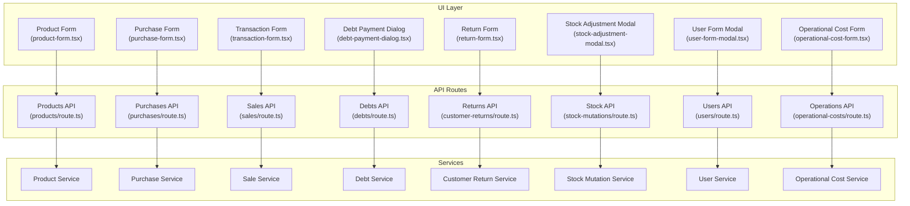

**Diagram sources**
- [product-form.tsx](file://src/app/dashboard/products/_components/product-form.tsx)
- [purchase-form.tsx](file://src/app/dashboard/purchases/_components/purchase-form.tsx)
- [transaction-form.tsx](file://src/app/dashboard/sales/_components/_forms/transaction-form.tsx)
- [debt-payment-dialog.tsx](file://src/app/dashboard/sales/_components/debt-payment-dialog.tsx)
- [return-form.tsx](file://src/app/dashboard/sales/_components/_forms/return-form.tsx)
- [stock-adjustment-modal.tsx](file://src/app/dashboard/products/_components/stock-adjustment-modal.tsx)
- [user-form-modal.tsx](file://src/app/dashboard/users/_components/user-form-modal.tsx)
- [operational-cost-form.tsx](file://src/app/dashboard/cost/_components/_forms/operational-cost-form.tsx)
- [product-api-route.ts](file://src/app/api/products/route.ts)
- [purchase-api-route.ts](file://src/app/api/purchases/route.ts)
- [sales-api-route.ts](file://src/app/api/sales/route.ts)
- [debts-api-route.ts](file://src/app/api/debts/route.ts)
- [return-api-route.ts](file://src/app/api/customer-returns/route.ts)
- [stock-api-route.ts](file://src/app/api/stock-mutations/route.ts)
- [users-api-route.ts](file://src/app/api/users/route.ts)
- [operations-api-route.ts](file://src/app/api/operational-costs/route.ts)

**Section sources**
- [system-flow-uml.md](file://docs/system-flow-uml.md)

## Core Components
This section outlines the primary workflows and their swimlane organization. Each workflow spans UI, API, and service layers, with decision points, concurrency (parallel tasks), and synchronization barriers.

- Product Management Workflow
  - Swimlanes: UI > API > Services > Persistence
  - Activities: create/update product, manage variants, adjust stock, log audit events
  - Decisions: variant existence, stock threshold checks
  - Concurrency: variant creation in parallel; audit logging asynchronous
  - Synchronization: stock update after variant creation; audit logged after persistence

- Purchase Processing Workflow
  - Swimlanes: UI > API > Services > Supplier Records
  - Activities: submit purchase order, persist purchase, update supplier records
  - Decisions: payment method, invoice completeness
  - Concurrency: supplier lookup and product validation in parallel
  - Synchronization: purchase persisted before supplier record update

- Sales Transaction Workflow
  - Swimlanes: UI > API > Services > Inventory > Debts
  - Activities: scan items, compute totals, apply discounts/taxes, finalize sale
  - Decisions: payment type (cash/credit), stock sufficiency, debt creation
  - Concurrency: inventory deduction and receipt generation in parallel
  - Synchronization: inventory updated before receipt finalized; debt recorded if applicable

- Debt Payment Procedure
  - Swimlanes: UI > API > Services > Debts
  - Activities: select debt, enter payment amount, validate balance
  - Decisions: full vs partial payment, remaining balance
  - Concurrency: none significant
  - Synchronization: payment recorded before balance update

- Return Processing Workflow
  - Swimlanes: UI > API > Services > Inventory
  - Activities: select items, compute refund, update inventory
  - Decisions: return eligibility, refund method
  - Concurrency: inventory adjustment and return record creation in parallel
  - Synchronization: inventory adjusted before return finalized

- Stock Management Workflow
  - Swimlanes: UI > API > Services > Inventory
  - Activities: perform stock adjustment/opname, log mutation
  - Decisions: adjustment type, threshold alerts
  - Concurrency: mutation logging asynchronous
  - Synchronization: mutation persisted before alert triggers

- User Management Workflow
  - Swimlanes: UI > API > Services > Users
  - Activities: create/update/delete user, manage roles, password reset requests
  - Decisions: role validity, reset request resolution
  - Concurrency: none significant
  - Synchronization: user persisted before role assignment

- Operational Costs Workflow
  - Swimlanes: UI > API > Services > Costs
  - Activities: record operational cost, configure taxes
  - Decisions: cost type, tax applicability
  - Concurrency: none significant
  - Synchronization: cost recorded before reporting

**Section sources**
- [uml-activity-product.puml](file://docs/uml-activity-product.puml)
- [uml-activity-purchase.puml](file://docs/uml-activity-purchase.puml)
- [uml-activity-sales.puml](file://docs/uml-activity-sales.puml)
- [uml-activity-debt.puml](file://docs/uml-activity-debt.puml)
- [uml-activity-debt-payment.puml](file://docs/uml-activity-debt-payment.puml)
- [uml-activity-return.puml](file://docs/uml-activity-return.puml)
- [uml-activity-stock.puml](file://docs/uml-activity-stock.puml)
- [uml-activity-users.puml](file://docs/uml-activity-users.puml)
- [uml-activity-operations.puml](file://docs/uml-activity-operations.puml)

## Architecture Overview
The activity diagrams reflect the layered architecture:
- UI layer: forms and dialogs orchestrate user actions
- API layer: route handlers validate and delegate to services
- Service layer: business logic, validations, and external integrations
- Persistence layer: database operations and audit trails

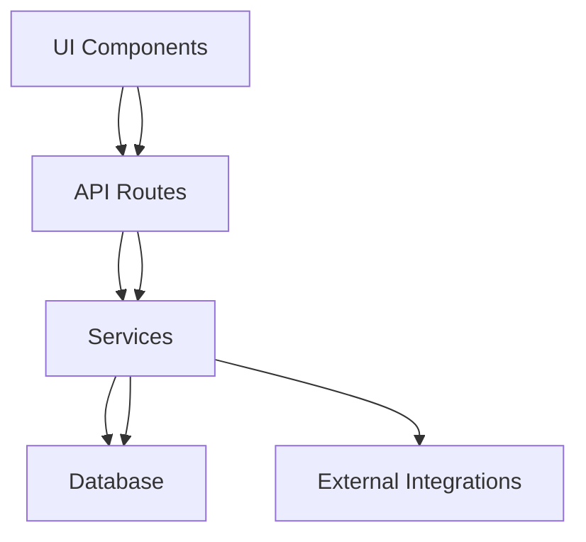

**Diagram sources**
- [product-api-route.ts](file://src/app/api/products/route.ts)
- [purchase-api-route.ts](file://src/app/api/purchases/route.ts)
- [sales-api-route.ts](file://src/app/api/sales/route.ts)
- [debts-api-route.ts](file://src/app/api/debts/route.ts)
- [return-api-route.ts](file://src/app/api/customer-returns/route.ts)
- [stock-api-route.ts](file://src/app/api/stock-mutations/route.ts)
- [users-api-route.ts](file://src/app/api/users/route.ts)
- [operations-api-route.ts](file://src/app/api/operational-costs/route.ts)

## Detailed Component Analysis

### Product Management Workflow
- Swimlanes: UI > API > Services > Persistence
- Key Activities: product creation, variant management, stock adjustment, audit logging
- Decision Points: variant exists?, stock below threshold?
- Concurrency: variant creation parallelized; audit logging asynchronous
- Synchronization: stock update after variant creation; audit logged after persistence

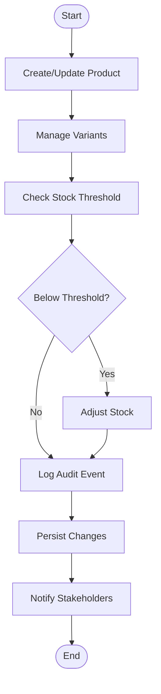

**Diagram sources**
- [product-form.tsx](file://src/app/dashboard/products/_components/product-form.tsx)
- [product-api-route.ts](file://src/app/api/products/route.ts)
- [product-service.ts](file://src/services/productService.ts)

**Section sources**
- [uml-activity-product.puml](file://docs/uml-activity-product.puml)
- [product-form.tsx](file://src/app/dashboard/products/_components/product-form.tsx)
- [product-api-route.ts](file://src/app/api/products/route.ts)
- [product-service.ts](file://src/services/productService.ts)

### Purchase Processing Workflow
- Swimlanes: UI > API > Services > Supplier Records
- Key Activities: submit purchase order, persist purchase, update supplier records
- Decision Points: payment method, invoice completeness
- Concurrency: supplier lookup and product validation in parallel
- Synchronization: purchase persisted before supplier record update

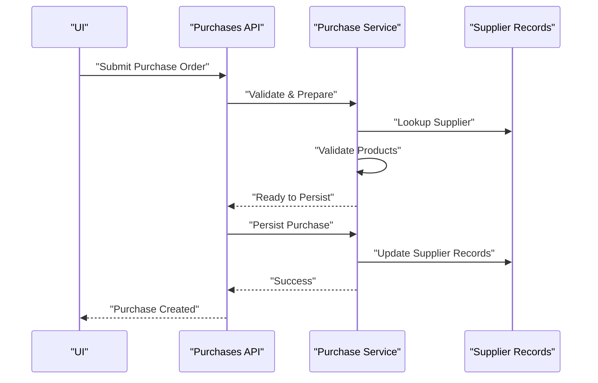

**Diagram sources**
- [purchase-form.tsx](file://src/app/dashboard/purchases/_components/purchase-form.tsx)
- [purchase-api-route.ts](file://src/app/api/purchases/route.ts)
- [purchaseService.ts](file://src/services/purchaseService.ts)

**Section sources**
- [uml-activity-purchase.puml](file://docs/uml-activity-purchase.puml)
- [purchase-form.tsx](file://src/app/dashboard/purchases/_components/purchase-form.tsx)
- [purchase-api-route.ts](file://src/app/api/purchases/route.ts)
- [purchaseService.ts](file://src/services/purchaseService.ts)

### Sales Transaction Workflow
- Swimlanes: UI > API > Services > Inventory > Debts
- Key Activities: scan items, compute totals, apply discounts/taxes, finalize sale
- Decision Points: payment type (cash/credit), stock sufficiency, debt creation
- Concurrency: inventory deduction and receipt generation in parallel
- Synchronization: inventory updated before receipt finalized; debt recorded if applicable

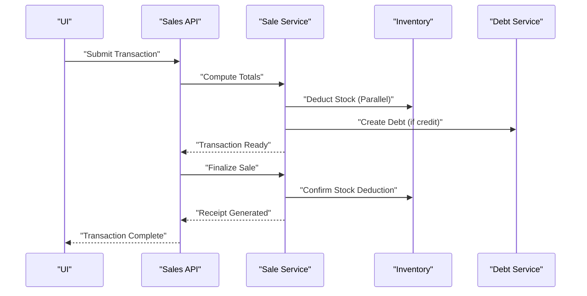

**Diagram sources**
- [transaction-form.tsx](file://src/app/dashboard/sales/_components/_forms/transaction-form.tsx)
- [sales-api-route.ts](file://src/app/api/sales/route.ts)
- [saleService.ts](file://src/services/saleService.ts)
- [debtService.ts](file://src/services/debtService.ts)

**Section sources**
- [uml-activity-sales.puml](file://docs/uml-activity-sales.puml)
- [transaction-form.tsx](file://src/app/dashboard/sales/_components/_forms/transaction-form.tsx)
- [sales-api-route.ts](file://src/app/api/sales/route.ts)
- [saleService.ts](file://src/services/saleService.ts)
- [debtService.ts](file://src/services/debtService.ts)

### Debt Payment Procedure
- Swimlanes: UI > API > Services > Debts
- Key Activities: select debt, enter payment amount, validate balance
- Decision Points: full vs partial payment, remaining balance
- Concurrency: none significant
- Synchronization: payment recorded before balance update

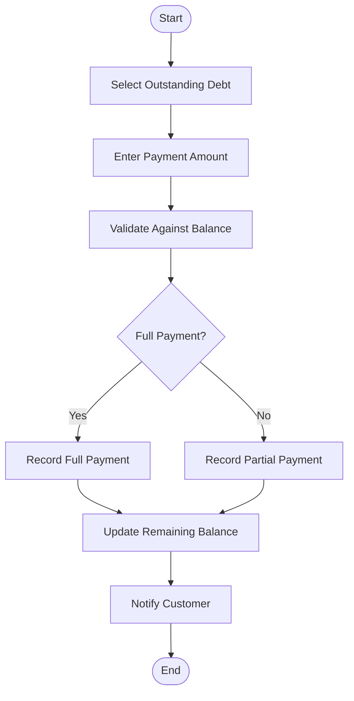

**Diagram sources**
- [debt-payment-dialog.tsx](file://src/app/dashboard/sales/_components/debt-payment-dialog.tsx)
- [debts-api-route.ts](file://src/app/api/debts/[id]/payment/route.ts)
- [debtService.ts](file://src/services/debtService.ts)

**Section sources**
- [uml-activity-debt-payment.puml](file://docs/uml-activity-debt-payment.puml)
- [debt-payment-dialog.tsx](file://src/app/dashboard/sales/_components/debt-payment-dialog.tsx)
- [debts-api-route.ts](file://src/app/api/debts/[id]/payment/route.ts)
- [debtService.ts](file://src/services/debtService.ts)

### Return Processing Workflow
- Swimlanes: UI > API > Services > Inventory
- Key Activities: select items, compute refund, update inventory
- Decision Points: return eligibility, refund method
- Concurrency: inventory adjustment and return record creation in parallel
- Synchronization: inventory adjusted before return finalized

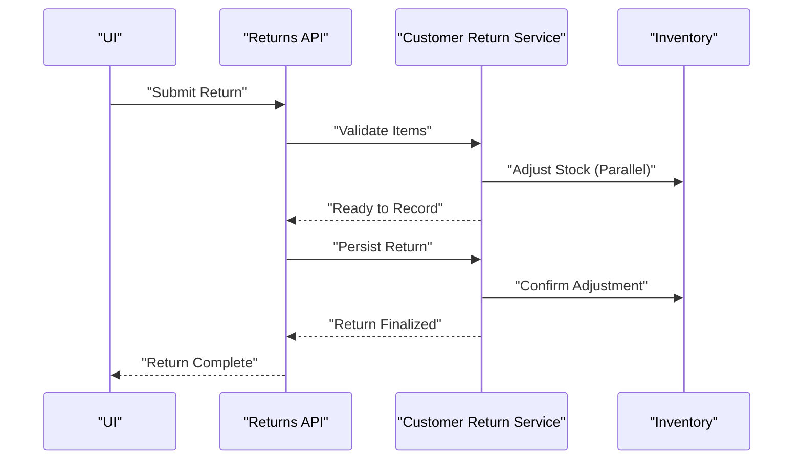

**Diagram sources**
- [return-form.tsx](file://src/app/dashboard/sales/_components/_forms/return-form.tsx)
- [return-api-route.ts](file://src/app/api/customer-returns/route.ts)
- [customerReturnService.ts](file://src/services/customerReturnService.ts)

**Section sources**
- [uml-activity-return.puml](file://docs/uml-activity-return.puml)
- [return-form.tsx](file://src/app/dashboard/sales/_components/_forms/return-form.tsx)
- [return-api-route.ts](file://src/app/api/customer-returns/route.ts)
- [customerReturnService.ts](file://src/services/customerReturnService.ts)

### Stock Management Workflow
- Swimlanes: UI > API > Services > Inventory
- Key Activities: perform stock adjustment/opname, log mutation
- Decision Points: adjustment type, threshold alerts
- Concurrency: mutation logging asynchronous
- Synchronization: mutation persisted before alert triggers

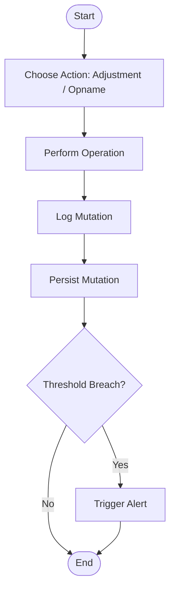

**Diagram sources**
- [stock-adjustment-modal.tsx](file://src/app/dashboard/products/_components/stock-adjustment-modal.tsx)
- [stock-api-route.ts](file://src/app/api/stock-mutations/route.ts)
- [stockMutationService.ts](file://src/services/stockMutationService.ts)

**Section sources**
- [uml-activity-stock.puml](file://docs/uml-activity-stock.puml)
- [stock-adjustment-modal.tsx](file://src/app/dashboard/products/_components/stock-adjustment-modal.tsx)
- [stock-api-route.ts](file://src/app/api/stock-mutations/route.ts)
- [stockMutationService.ts](file://src/services/stockMutationService.ts)

### User Management Workflow
- Swimlanes: UI > API > Services > Users
- Key Activities: create/update/delete user, manage roles, password reset requests
- Decision Points: role validity, reset request resolution
- Concurrency: none significant
- Synchronization: user persisted before role assignment

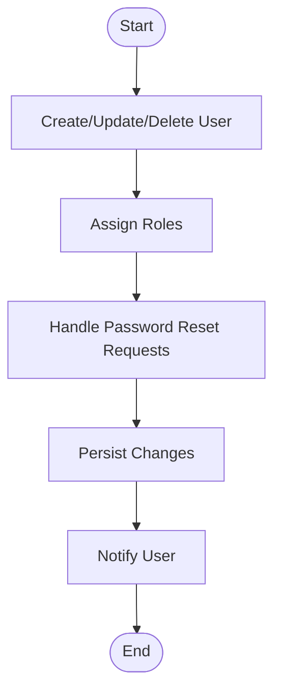

**Diagram sources**
- [user-form-modal.tsx](file://src/app/dashboard/users/_components/user-form-modal.tsx)
- [users-api-route.ts](file://src/app/api/users/route.ts)
- [userService.ts](file://src/services/userService.ts)

**Section sources**
- [uml-activity-users.puml](file://docs/uml-activity-users.puml)
- [user-form-modal.tsx](file://src/app/dashboard/users/_components/user-form-modal.tsx)
- [users-api-route.ts](file://src/app/api/users/route.ts)
- [userService.ts](file://src/services/userService.ts)

### Operational Costs Workflow
- Swimlanes: UI > API > Services > Costs
- Key Activities: record operational cost, configure taxes
- Decision Points: cost type, tax applicability
- Concurrency: none significant
- Synchronization: cost recorded before reporting

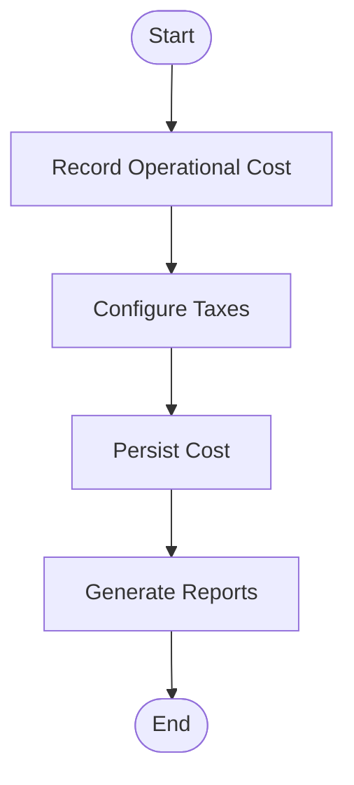

**Diagram sources**
- [operational-cost-form.tsx](file://src/app/dashboard/cost/_components/_forms/operational-cost-form.tsx)
- [operations-api-route.ts](file://src/app/api/operational-costs/route.ts)
- [operationalCostService.ts](file://src/services/costService.ts)

**Section sources**
- [uml-activity-operations.puml](file://docs/uml-activity-operations.puml)
- [operational-cost-form.tsx](file://src/app/dashboard/cost/_components/_forms/operational-cost-form.tsx)
- [operations-api-route.ts](file://src/app/api/operational-costs/route.ts)
- [operationalCostService.ts](file://src/services/costService.ts)

### Notifications Workflow (Supporting Process)
- Swimlanes: API > Services > Store > State > DB
- Key Activities: create/read/clear notifications, maintain state
- Decision Points: read/unread state, clear all
- Concurrency: none significant
- Synchronization: state updated before DB write

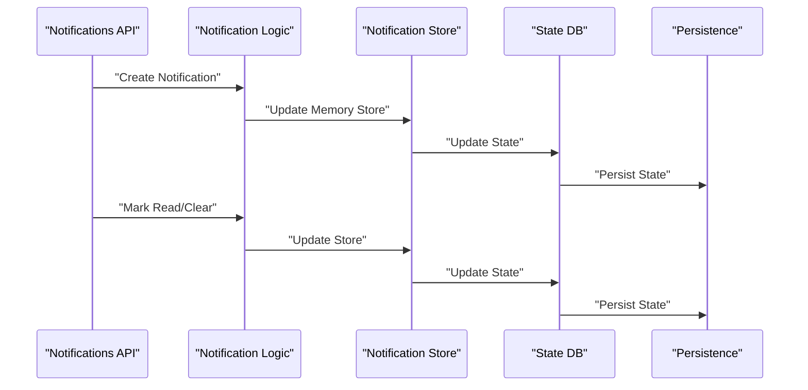

**Diagram sources**
- [notification-logic.ts](file://src/app/api/notifications/_lib/notification-logic.ts)
- [notification-store.ts](file://src/app/api/notifications/_lib/notification-store.ts)
- [notification-state-db.ts](file://src/app/api/notifications/_lib/notification-state-db.ts)
- [notification-read-route.ts](file://src/app/api/notifications/[id]/read/route.ts)
- [notification-clear-route.ts](file://src/app/api/notifications/clear/route.ts)
- [notification-route.ts](file://src/app/api/notifications/route.ts)

**Section sources**
- [notification-logic.ts](file://src/app/api/notifications/_lib/notification-logic.ts)
- [notification-store.ts](file://src/app/api/notifications/_lib/notification-store.ts)
- [notification-state-db.ts](file://src/app/api/notifications/_lib/notification-state-db.ts)
- [notification-read-route.ts](file://src/app/api/notifications/[id]/read/route.ts)
- [notification-clear-route.ts](file://src/app/api/notifications/clear/route.ts)
- [notification-route.ts](file://src/app/api/notifications/route.ts)

## Dependency Analysis
The activity diagrams reveal dependencies across UI, API, and service layers. Key observations:
- UI components trigger API routes; API routes delegate to services
- Services encapsulate business logic and coordinate with persistence
- Decision points often branch based on validation outcomes
- Parallel activities improve throughput while maintaining correctness via synchronization

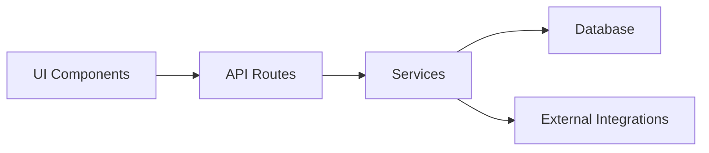

**Diagram sources**
- [product-api-route.ts](file://src/app/api/products/route.ts)
- [purchase-api-route.ts](file://src/app/api/purchases/route.ts)
- [sales-api-route.ts](file://src/app/api/sales/route.ts)
- [debts-api-route.ts](file://src/app/api/debts/route.ts)
- [return-api-route.ts](file://src/app/api/customer-returns/route.ts)
- [stock-api-route.ts](file://src/app/api/stock-mutations/route.ts)
- [users-api-route.ts](file://src/app/api/users/route.ts)
- [operations-api-route.ts](file://src/app/api/operational-costs/route.ts)

**Section sources**
- [system-flow-uml.md](file://docs/system-flow-uml.md)

## Performance Considerations
- Minimize blocking operations in UI by offloading heavy computations to services
- Use parallelizable steps (e.g., inventory deduction and receipt generation) to reduce latency
- Asynchronous logging and notifications prevent UI stalls
- Batch operations for bulk stock adjustments or user imports to reduce repeated API calls

## Troubleshooting Guide
Common issues and resolutions:
- Validation Failures: Ensure UI pre-validates inputs; API routes should return explicit errors; services should centralize validation logic
- Concurrency Conflicts: Use atomic operations for inventory and debt updates; synchronize parallel branches
- Persistence Errors: Wrap critical sections in transactions; log failures with context
- Notification Delays: Verify state updates occur before DB writes; monitor store consistency

**Section sources**
- [notification-logic.ts](file://src/app/api/notifications/_lib/notification-logic.ts)
- [notification-store.ts](file://src/app/api/notifications/_lib/notification-store.ts)
- [notification-state-db.ts](file://src/app/api/notifications/_lib/notification-state-db.ts)

## Conclusion
Activity diagrams provide a powerful way to model complex business processes in the POS application. By organizing workflows into swimlanes, capturing decision points, enabling concurrency where safe, and enforcing synchronization, teams can align development with business intent. The diagrams documented here serve as templates for consistent modeling across modules.

## Appendices

### Guidelines for Creating Activity Diagrams
- Define swimlanes representing UI, API, Services, and Persistence
- Model start and end nodes clearly
- Use decision forks for branching logic (yes/no, pass/fail)
- Indicate parallel activities with fork/join semantics
- Synchronize after parallel branches to ensure consistency
- Keep labels concise but descriptive
- Validate against actual route and service implementations

### Interpreting Workflow Logic
- Trace the swimlane sequence to understand cross-layer interactions
- Identify synchronization points where later steps depend on earlier outcomes
- Look for parallelism opportunities to improve throughput
- Confirm decision coverage with positive and negative paths

### Templates for Common Workflow Patterns
- CRUD Pattern: Create -> Validate -> Persist -> Notify
- Approval Pattern: Submit -> Approve/Reject -> Update Status -> Notify
- Parallel Processing Pattern: Split -> Work in Parallel -> Merge -> Continue
- Conditional Branching Pattern: Evaluate Condition -> Route to Path -> Rejoin

**Section sources**
- [uml-presentation-guide.md](file://docs/uml-presentation-guide.md)