# Class Diagrams

<cite>
**Referenced Files in This Document**
- [uml-class-functional.puml](file://docs/uml-class-functional.puml)
- [uml-class-overview.puml](file://docs/uml-class-overview.puml)
- [uml-class-module-a-product.puml](file://docs/uml-class-module-a-product.puml)
- [uml-class-module-b-purchase.puml](file://docs/uml-class-module-b-purchase.puml)
- [uml-class-module-c-stock.puml](file://docs/uml-class-module-c-stock.puml)
- [uml-class-module-d-cashier.puml](file://docs/uml-class-module-d-cashier.puml)
- [uml-class-module-e-return.puml](file://docs/uml-class-module-e-return.puml)
- [uml-class-module-f-debt-payment.puml](file://docs/uml-class-module-f-debt-payment.puml)
- [uml-class-module-g-report.puml](file://docs/uml-class-module-g-report.puml)
- [uml-class-module-h-trash.puml](file://docs/uml-class-module-h-trash.puml)
- [uml-class-module-i-user.puml](file://docs/uml-class-module-i-user.puml)
- [schema.ts](file://src/drizzle/schema.ts)
- [relations.ts](file://src/drizzle/relations.ts)
- [productService.ts](file://src/services/productService.ts)
- [purchaseService.ts](file://src/services/purchaseService.ts)
- [saleService.ts](file://src/services/saleService.ts)
- [customerReturnService.ts](file://src/services/customerReturnService.ts)
- [debtService.ts](file://src/services/debtService.ts)
- [reportService.ts](file://src/services/reportService.ts)
- [userService.ts](file://src/services/userService.ts)
- [notificationService.ts](file://src/services/notificationService.ts)
- [costService.ts](file://src/services/costService.ts)
- [stockMutationService.ts](file://src/services/stockMutationService.ts)
- [storeSettingService.ts](file://src/services/storeSettingService.ts)
- [uploadService.ts](file://src/services/uploadService.ts)
- [authService.ts](file://src/services/authService.ts)
- [product-query-options.ts](file://src/hooks/products/product-query-options.ts)
- [use-products.ts](file://src/hooks/products/use-products.ts)
- [use-create-product.ts](file://src/hooks/products/use-create-product.ts)
- [use-update-product.ts](file://src/hooks/products/use-update-product.ts)
- [use-delete-product.ts](file://src/hooks/products/use-delete-product.ts)
- [use-adjust-stock.ts](file://src/hooks/products/use-adjust-stock.ts)
- [use-create-stock-adjustment.ts](file://src/hooks/products/use-create-stock-adjustment.ts)
- [purchase-query-options.ts](file://src/hooks/purchases/purchase-query-options.ts)
- [use-purchases.ts](file://src/hooks/purchases/use-purchases.ts)
- [use-supplier-form.ts](file://src/hooks/purchases/use-supplier-form.ts)
- [use-supplier-list.ts](file://src/hooks/purchases/use-supplier-list.ts)
- [use-purchase-form.ts](file://src/hooks/purchases/use-purchase-form.ts)
- [sale-query-options.ts](file://src/hooks/sales/sale-query-options.ts)
- [use-sale.ts](file://src/hooks/sales/use-sale.ts)
- [use-return-form.ts](file://src/hooks/sales/use-return-form.ts)
- [use-sale-form.ts](file://src/hooks/sales/use-sale-form.ts)
- [use-print-receipt.ts](file://src/hooks/sales/use-print-receipt.ts)
- [customer-return-query-options.ts](file://src/hooks/customer-returns/customer-return-query-options.ts)
- [use-customer-return.ts](file://src/hooks/customer-returns/use-customer-return.ts)
- [debt-query-options.ts](file://src/hooks/debt/debt-query-options.ts)
- [use-debts.ts](file://src/hooks/debt/use-debts.ts)
- [users-query-options.ts](file://src/hooks/users/users-query-options.ts)
- [use-users.ts](file://src/hooks/users/use-users.ts)
- [use-create-user.ts](file://src/hooks/users/use-create-user.ts)
- [use-update-user.ts](file://src/hooks/users/use-update-user.ts)
- [use-delete-user.ts](file://src/hooks/users/use-delete-user.ts)
- [password-reset-query-options.ts](file://src/hooks/users/password-reset-query-options.ts)
- [use-password-reset-requests.ts](file://src/hooks/users/use-password-reset-requests.ts)
- [use-resolve-password-reset.ts](file://src/hooks/users/use-resolve-password-reset.ts)
- [use-change-password.ts](file://src/hooks/users/use-change-password.ts)
- [categories-query-options.ts](file://src/hooks/categories/category-query-options.ts)
- [use-categories.ts](file://src/hooks/categories/use-categories.ts)
- [use-create-category.ts](file://src/hooks/categories/use-create-category.ts)
- [use-update-category.ts](file://src/hooks/categories/use-update-category.ts)
- [use-delete-category.ts](file://src/hooks/categories/use-delete-category.ts)
- [units-query-options.ts](file://src/hooks/units/unit-query-options.ts)
- [use-units.ts](file://src/hooks/units/use-units.ts)
- [use-create-unit.ts](file://src/hooks/units/use-create-unit.ts)
- [use-update-unit.ts](file://src/hooks/units/use-update-unit.ts)
- [use-delete-unit.ts](file://src/hooks/units/use-delete-unit.ts)
- [cost-query-options.ts](file://src/hooks/cost/cost-query-options.ts)
- [use-cost.ts](file://src/hooks/cost/use-cost.ts)
- [stock-mutation-query-options.ts](file://src/hooks/stock-mutations/stock-mutation-query-options.ts)
- [use-stock-mutations.ts](file://src/hooks/stock-mutations/use-stock-mutations.ts)
- [setting-query-options.ts](file://src/hooks/store-setting/setting-query-options.ts)
- [use-setting.ts](file://src/hooks/store-setting/use-setting.ts)
- [dashboard-query-options.ts](file://src/hooks/dashboard/dashboard-query-options.ts)
- [use-dashboard-summary.ts](file://src/hooks/dashboard/use-dashboard-summary.ts)
- [report-query-options.ts](file://src/hooks/report/report-query-options.ts)
- [use-report.ts](file://src/hooks/report/use-report.ts)
- [master-query-options.ts](file://src/hooks/master/master-query-options.ts)
- [use-notifications.ts](file://src/hooks/notifications/use-notifications.ts)
- [use-auth.ts](file://src/hooks/use-auth.ts)
- [login-page.tsx](file://src/app/login/_components/login-page.tsx)
- [app-layout.tsx](file://src/components/app-layout.tsx)
- [app-sidebar.tsx](file://src/components/app-sidebar.tsx)
- [top-navbar.tsx](file://src/components/top-navbar.tsx)
- [notification-panel.tsx](file://src/components/notification-panel.tsx)
- [data-table.tsx](file://src/components/ui/data-table.tsx)
- [form.tsx](file://src/components/ui/form.tsx)
- [button.tsx](file://src/components/ui/button.tsx)
- [input.tsx](file://src/components/ui/input.tsx)
- [dialog.tsx](file://src/components/ui/dialog.tsx)
- [toast.tsx](file://src/components/ui/sonner.tsx)
</cite>

## Table of Contents
1. [Introduction](#introduction)
2. [Project Structure](#project-structure)
3. [Core Components](#core-components)
4. [Architecture Overview](#architecture-overview)
5. [Detailed Component Analysis](#detailed-component-analysis)
6. [Dependency Analysis](#dependency-analysis)
7. [Performance Considerations](#performance-considerations)
8. [Troubleshooting Guide](#troubleshooting-guide)
9. [Conclusion](#conclusion)
10. [Appendices](#appendices)

## Introduction
This document presents comprehensive class diagram documentation for the POS application. It consolidates the existing UML class diagrams from the repository and maps them to the actual TypeScript/React codebase to explain object-oriented structure, relationships, and module boundaries. The goal is to help developers and stakeholders understand how business entities relate to each other, how services and hooks orchestrate domain logic, and how UI components integrate with backend APIs.

## Project Structure
The POS application follows a modular React/Next.js architecture with a Drizzle ORM layer for database modeling. The system is organized into:
- Services: Backend-facing service modules encapsulating business logic per domain (products, purchases, sales, returns, debts, reports, users, notifications, costs, stock mutations, store settings, uploads, authentication).
- Hooks: React Query-based data fetching and state management for UI components.
- UI Components: Shared UI primitives and page-level components.
- Database Schema: Drizzle schema and relations defining entity models and relationships.

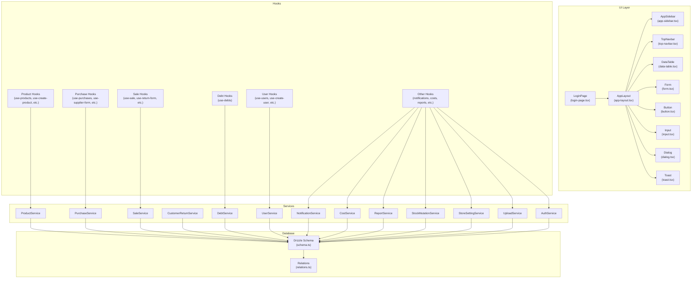

**Diagram sources**
- [login-page.tsx:1-200](file://src/app/login/_components/login-page.tsx#L1-L200)
- [app-layout.tsx:1-200](file://src/components/app-layout.tsx#L1-L200)
- [app-sidebar.tsx:1-200](file://src/components/app-sidebar.tsx#L1-L200)
- [top-navbar.tsx:1-200](file://src/components/top-navbar.tsx#L1-L200)
- [data-table.tsx:1-200](file://src/components/ui/data-table.tsx#L1-L200)
- [form.tsx:1-200](file://src/components/ui/form.tsx#L1-L200)
- [button.tsx:1-200](file://src/components/ui/button.tsx#L1-L200)
- [input.tsx:1-200](file://src/components/ui/input.tsx#L1-L200)
- [dialog.tsx:1-200](file://src/components/ui/dialog.tsx#L1-L200)
- [toast.tsx:1-200](file://src/components/ui/sonner.tsx#L1-L200)
- [productService.ts:1-200](file://src/services/productService.ts#L1-L200)
- [purchaseService.ts:1-200](file://src/services/purchaseService.ts#L1-L200)
- [saleService.ts:1-200](file://src/services/saleService.ts#L1-L200)
- [customerReturnService.ts:1-200](file://src/services/customerReturnService.ts#L1-L200)
- [debtService.ts:1-200](file://src/services/debtService.ts#L1-L200)
- [reportService.ts:1-200](file://src/services/reportService.ts#L1-L200)
- [userService.ts:1-200](file://src/services/userService.ts#L1-L200)
- [notificationService.ts:1-200](file://src/services/notificationService.ts#L1-L200)
- [costService.ts:1-200](file://src/services/costService.ts#L1-L200)
- [stockMutationService.ts:1-200](file://src/services/stockMutationService.ts#L1-L200)
- [storeSettingService.ts:1-200](file://src/services/storeSettingService.ts#L1-L200)
- [uploadService.ts:1-200](file://src/services/uploadService.ts#L1-L200)
- [authService.ts:1-200](file://src/services/authService.ts#L1-L200)
- [schema.ts:1-200](file://src/drizzle/schema.ts#L1-L200)
- [relations.ts:1-200](file://src/drizzle/relations.ts#L1-L200)

**Section sources**
- [schema.ts:1-200](file://src/drizzle/schema.ts#L1-L200)
- [relations.ts:1-200](file://src/drizzle/relations.ts#L1-L200)

## Core Components
This section maps the functional and overview class diagrams to the actual codebase, focusing on core business entities and their relationships.

- Functional Class Diagram: The functional diagram defines primary business entities and their associations. It aligns with the Drizzle schema entities and service boundaries.
- Overview Class Diagram: The overview diagram shows the high-level architecture, including UI components, services, hooks, and database schema.

Key entities and their roles:
- Product: Core inventory item with variants and audit logs.
- Purchase: Procurement record linked to suppliers and items.
- Sale: Transaction record linked to customers, items, and returns.
- CustomerReturn: Return records associated with sales and items.
- Debt: Outstanding receivable linked to sales and payments.
- User: Application user with roles and permissions.
- Notification: System notification state.
- OperationalCost/TaxConfig: Cost and tax configurations.
- StockMutation: Inventory adjustments and opnames.
- StoreSetting: Application-wide settings.
- Upload: Image/media management.

These entities are reflected in the Drizzle schema and accessed via dedicated services and React Query hooks.

**Section sources**
- [uml-class-functional.puml:1-200](file://docs/uml-class-functional.puml#L1-L200)
- [uml-class-overview.puml:1-200](file://docs/uml-class-overview.puml#L1-L200)
- [schema.ts:1-200](file://src/drizzle/schema.ts#L1-L200)
- [relations.ts:1-200](file://src/drizzle/relations.ts#L1-L200)

## Architecture Overview
The architecture integrates UI components with service modules, which in turn interact with the database via Drizzle ORM. Services encapsulate business logic and expose typed methods consumed by React Query hooks. Hooks manage caching, optimistic updates, and UI state synchronization.

```mermaid
classDiagram
class Product {
+uuid id
+string name
+uuid categoryId
+uuid unitId
+number reorderPoint
+boolean isActive
}
class Category {
+uuid id
+string name
}
class Unit {
+uuid id
+string name
}
class Supplier {
+uuid id
+string name
+string phone
+string address
}
class Purchase {
+uuid id
+uuid supplierId
+date purchaseDate
+number totalAmount
+enum status
}
class PurchaseItem {
+uuid id
+uuid purchaseId
+uuid productId
+number quantity
+number price
}
class Sale {
+uuid id
+uuid customerId
+date saleDate
+number totalAmount
+enum status
}
class SaleItem {
+uuid id
+uuid saleId
+uuid productId
+number quantity
+number price
}
class CustomerReturn {
+uuid id
+uuid saleId
+date returnDate
+number refundAmount
}
class ReturnItem {
+uuid id
+uuid customerReturnId
+uuid productId
+number quantity
}
class Debt {
+uuid id
+uuid customerId
+date issueDate
+number amount
+number paid
+boolean isSettled
}
class DebtPayment {
+uuid id
+uuid debtId
+date paymentDate
+number amount
}
class User {
+uuid id
+string email
+string name
+string role
}
class Notification {
+uuid id
+string message
+boolean read
}
class OperationalCost {
+uuid id
+string name
+number amount
+date date
}
class TaxConfig {
+uuid id
+string name
+number rate
}
class StockMutation {
+uuid id
+uuid productId
+number quantity
+enum type
+string reason
}
class StoreSetting {
+uuid id
+string key
+string value
}
class Upload {
+uuid id
+string url
+string alt
}
class AuthService {
+login(credentials) AuthResult
+logout() void
+register(userData) User
}
class ProductService {
+create(productData) Product
+update(id, productData) Product
+delete(id) void
+list(filters) Product[]
+adjustStock(id, adjustment) StockMutation
}
class PurchaseService {
+create(purchaseData) Purchase
+update(id, purchaseData) Purchase
+delete(id) void
+list(filters) Purchase[]
}
class SaleService {
+create(saleData) Sale
+update(id, saleData) Sale
+delete(id) void
+list(filters) Sale[]
}
class CustomerReturnService {
+create(returnData) CustomerReturn
+list(filters) CustomerReturn[]
}
class DebtService {
+create(debtData) Debt
+makePayment(paymentData) DebtPayment
+list(filters) Debt[]
}
class ReportService {
+financial() FinancialReport
+sales(filters) SalesReport
+purchases(filters) PurchaseReport
}
class UserService {
+create(userData) User
+update(id, userData) User
+delete(id) void
+list(filters) User[]
}
class NotificationService {
+list(filters) Notification[]
+markRead(id) void
+clearAll() void
}
class CostService {
+create(costData) OperationalCost
+list(filters) OperationalCost[]
}
class StockMutationService {
+create(mutationData) StockMutation
+list(filters) StockMutation[]
}
class StoreSettingService {
+get(key) StoreSetting
+set(key, value) StoreSetting
}
class UploadService {
+upload(file) Upload
+delete(id) void
}
ProductService --> Product : "manages"
ProductService --> StockMutation : "creates"
PurchaseService --> Purchase : "manages"
PurchaseService --> PurchaseItem : "creates"
SaleService --> Sale : "manages"
SaleService --> SaleItem : "creates"
CustomerReturnService --> CustomerReturn : "manages"
CustomerReturnService --> ReturnItem : "creates"
DebtService --> Debt : "manages"
DebtService --> DebtPayment : "records"
ReportService --> Product : "aggregates"
ReportService --> Sale : "aggregates"
ReportService --> Purchase : "aggregates"
UserService --> User : "manages"
NotificationService --> Notification : "manages"
CostService --> OperationalCost : "manages"
StockMutationService --> StockMutation : "manages"
StoreSettingService --> StoreSetting : "manages"
UploadService --> Upload : "manages"
AuthService --> User : "authenticates"
```

**Diagram sources**
- [uml-class-functional.puml:1-200](file://docs/uml-class-functional.puml#L1-L200)
- [uml-class-overview.puml:1-200](file://docs/uml-class-overview.puml#L1-L200)
- [schema.ts:1-200](file://src/drizzle/schema.ts#L1-L200)
- [relations.ts:1-200](file://src/drizzle/relations.ts#L1-L200)
- [productService.ts:1-200](file://src/services/productService.ts#L1-L200)
- [purchaseService.ts:1-200](file://src/services/purchaseService.ts#L1-L200)
- [saleService.ts:1-200](file://src/services/saleService.ts#L1-L200)
- [customerReturnService.ts:1-200](file://src/services/customerReturnService.ts#L1-L200)
- [debtService.ts:1-200](file://src/services/debtService.ts#L1-L200)
- [reportService.ts:1-200](file://src/services/reportService.ts#L1-L200)
- [userService.ts:1-200](file://src/services/userService.ts#L1-L200)
- [notificationService.ts:1-200](file://src/services/notificationService.ts#L1-L200)
- [costService.ts:1-200](file://src/services/costService.ts#L1-L200)
- [stockMutationService.ts:1-200](file://src/services/stockMutationService.ts#L1-L200)
- [storeSettingService.ts:1-200](file://src/services/storeSettingService.ts#L1-L200)
- [uploadService.ts:1-200](file://src/services/uploadService.ts#L1-L200)
- [authService.ts:1-200](file://src/services/authService.ts#L1-L200)

## Detailed Component Analysis

### Functional Class Diagram
The functional diagram defines core business entities and their relationships. It serves as a blueprint for the Drizzle schema and guides service implementations.

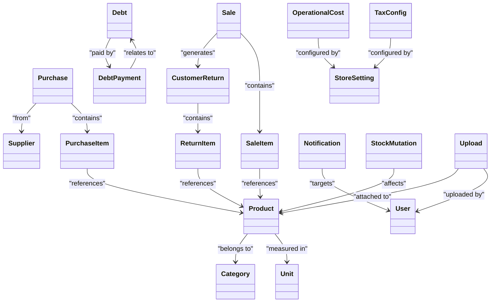

**Diagram sources**
- [uml-class-functional.puml:1-200](file://docs/uml-class-functional.puml#L1-L200)
- [schema.ts:1-200](file://src/drizzle/schema.ts#L1-L200)
- [relations.ts:1-200](file://src/drizzle/relations.ts#L1-L200)

**Section sources**
- [uml-class-functional.puml:1-200](file://docs/uml-class-functional.puml#L1-L200)
- [schema.ts:1-200](file://src/drizzle/schema.ts#L1-L200)
- [relations.ts:1-200](file://src/drizzle/relations.ts#L1-L200)

### Overview Class Diagram
The overview diagram shows how UI components, services, hooks, and the database fit together.

```mermaid
classDiagram
class LoginPage
class AppLayout
class AppSidebar
class TopNavbar
class DataTable
class Form
class Button
class Input
class Dialog
class Toast
class ProductHooks
class PurchaseHooks
class SaleHooks
class DebtHooks
class UserHooks
class OtherHooks
class ProductService
class PurchaseService
class SaleService
class CustomerReturnService
class DebtService
class ReportService
class UserService
class NotificationService
class CostService
class StockMutationService
class StoreSettingService
class UploadService
class AuthService
class Schema
class Relations
LoginPage --> AppLayout
AppLayout --> AppSidebar
AppLayout --> TopNavbar
AppLayout --> DataTable
AppLayout --> Form
AppLayout --> Button
AppLayout --> Input
AppLayout --> Dialog
AppLayout --> Toast
ProductHooks --> ProductService
PurchaseHooks --> PurchaseService
SaleHooks --> SaleService
DebtHooks --> DebtService
UserHooks --> UserService
OtherHooks --> NotificationService
OtherHooks --> CostService
OtherHooks --> ReportService
OtherHooks --> StockMutationService
OtherHooks --> StoreSettingService
OtherHooks --> UploadService
OtherHooks --> AuthService
ProductService --> Schema
PurchaseService --> Schema
SaleService --> Schema
CustomerReturnService --> Schema
DebtService --> Schema
ReportService --> Schema
UserService --> Schema
NotificationService --> Schema
CostService --> Schema
StockMutationService --> Schema
StoreSettingService --> Schema
UploadService --> Schema
AuthService --> Schema
Schema --> Relations
```

**Diagram sources**
- [uml-class-overview.puml:1-200](file://docs/uml-class-overview.puml#L1-L200)
- [login-page.tsx:1-200](file://src/app/login/_components/login-page.tsx#L1-L200)
- [app-layout.tsx:1-200](file://src/components/app-layout.tsx#L1-L200)
- [app-sidebar.tsx:1-200](file://src/components/app-sidebar.tsx#L1-L200)
- [top-navbar.tsx:1-200](file://src/components/top-navbar.tsx#L1-L200)
- [data-table.tsx:1-200](file://src/components/ui/data-table.tsx#L1-L200)
- [form.tsx:1-200](file://src/components/ui/form.tsx#L1-L200)
- [button.tsx:1-200](file://src/components/ui/button.tsx#L1-L200)
- [input.tsx:1-200](file://src/components/ui/input.tsx#L1-L200)
- [dialog.tsx:1-200](file://src/components/ui/dialog.tsx#L1-L200)
- [toast.tsx:1-200](file://src/components/ui/sonner.tsx#L1-L200)
- [productService.ts:1-200](file://src/services/productService.ts#L1-L200)
- [purchaseService.ts:1-200](file://src/services/purchaseService.ts#L1-L200)
- [saleService.ts:1-200](file://src/services/saleService.ts#L1-L200)
- [customerReturnService.ts:1-200](file://src/services/customerReturnService.ts#L1-L200)
- [debtService.ts:1-200](file://src/services/debtService.ts#L1-L200)
- [reportService.ts:1-200](file://src/services/reportService.ts#L1-L200)
- [userService.ts:1-200](file://src/services/userService.ts#L1-L200)
- [notificationService.ts:1-200](file://src/services/notificationService.ts#L1-L200)
- [costService.ts:1-200](file://src/services/costService.ts#L1-L200)
- [stockMutationService.ts:1-200](file://src/services/stockMutationService.ts#L1-L200)
- [storeSettingService.ts:1-200](file://src/services/storeSettingService.ts#L1-L200)
- [uploadService.ts:1-200](file://src/services/uploadService.ts#L1-L200)
- [authService.ts:1-200](file://src/services/authService.ts#L1-L200)
- [schema.ts:1-200](file://src/drizzle/schema.ts#L1-L200)
- [relations.ts:1-200](file://src/drizzle/relations.ts#L1-L200)

**Section sources**
- [uml-class-overview.puml:1-200](file://docs/uml-class-overview.puml#L1-L200)
- [login-page.tsx:1-200](file://src/app/login/_components/login-page.tsx#L1-L200)
- [app-layout.tsx:1-200](file://src/components/app-layout.tsx#L1-L200)
- [app-sidebar.tsx:1-200](file://src/components/app-sidebar.tsx#L1-L200)
- [top-navbar.tsx:1-200](file://src/components/top-navbar.tsx#L1-L200)
- [data-table.tsx:1-200](file://src/components/ui/data-table.tsx#L1-L200)
- [form.tsx:1-200](file://src/components/ui/form.tsx#L1-L200)
- [button.tsx:1-200](file://src/components/ui/button.tsx#L1-L200)
- [input.tsx:1-200](file://src/components/ui/input.tsx#L1-L200)
- [dialog.tsx:1-200](file://src/components/ui/dialog.tsx#L1-L200)
- [toast.tsx:1-200](file://src/components/ui/sonner.tsx#L1-L200)
- [productService.ts:1-200](file://src/services/productService.ts#L1-L200)
- [purchaseService.ts:1-200](file://src/services/purchaseService.ts#L1-L200)
- [saleService.ts:1-200](file://src/services/saleService.ts#L1-L200)
- [customerReturnService.ts:1-200](file://src/services/customerReturnService.ts#L1-L200)
- [debtService.ts:1-200](file://src/services/debtService.ts#L1-L200)
- [reportService.ts:1-200](file://src/services/reportService.ts#L1-L200)
- [userService.ts:1-200](file://src/services/userService.ts#L1-L200)
- [notificationService.ts:1-200](file://src/services/notificationService.ts#L1-L200)
- [costService.ts:1-200](file://src/services/costService.ts#L1-L200)
- [stockMutationService.ts:1-200](file://src/services/stockMutationService.ts#L1-L200)
- [storeSettingService.ts:1-200](file://src/services/storeSettingService.ts#L1-L200)
- [uploadService.ts:1-200](file://src/services/uploadService.ts#L1-L200)
- [authService.ts:1-200](file://src/services/authService.ts#L1-L200)
- [schema.ts:1-200](file://src/drizzle/schema.ts#L1-L200)
- [relations.ts:1-200](file://src/drizzle/relations.ts#L1-L200)

### Module-Specific Class Diagrams

#### Product Management Module
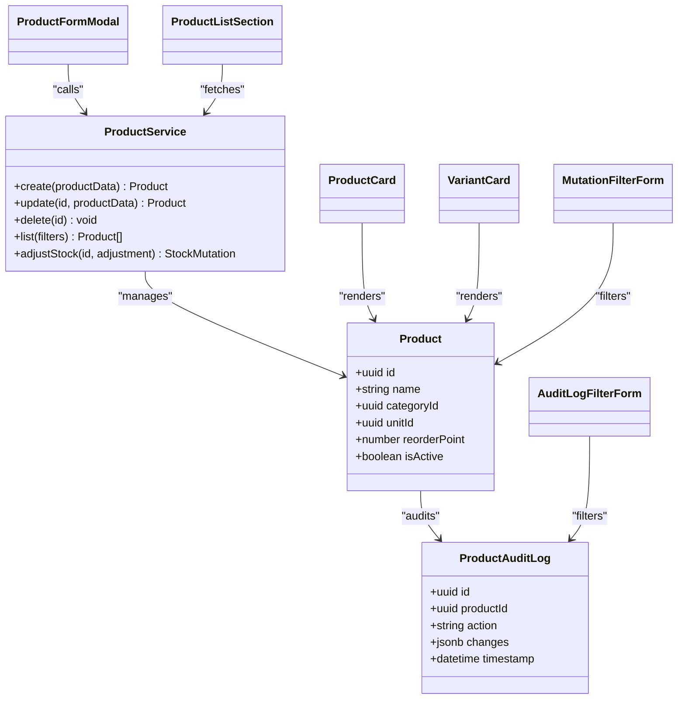

**Diagram sources**
- [uml-class-module-a-product.puml:1-200](file://docs/uml-class-module-a-product.puml#L1-L200)
- [productService.ts:1-200](file://src/services/productService.ts#L1-L200)
- [schema.ts:1-200](file://src/drizzle/schema.ts#L1-L200)
- [use-products.ts:1-200](file://src/hooks/products/use-products.ts#L1-L200)
- [use-create-product.ts:1-200](file://src/hooks/products/use-create-product.ts#L1-L200)
- [use-update-product.ts:1-200](file://src/hooks/products/use-update-product.ts#L1-L200)
- [use-delete-product.ts:1-200](file://src/hooks/products/use-delete-product.ts#L1-L200)
- [use-adjust-stock.ts:1-200](file://src/hooks/products/use-adjust-stock.ts#L1-L200)
- [use-create-stock-adjustment.ts:1-200](file://src/hooks/products/use-create-stock-adjustment.ts#L1-L200)

**Section sources**
- [uml-class-module-a-product.puml:1-200](file://docs/uml-class-module-a-product.puml#L1-L200)
- [productService.ts:1-200](file://src/services/productService.ts#L1-L200)
- [use-products.ts:1-200](file://src/hooks/products/use-products.ts#L1-L200)
- [use-create-product.ts:1-200](file://src/hooks/products/use-create-product.ts#L1-L200)
- [use-update-product.ts:1-200](file://src/hooks/products/use-update-product.ts#L1-L200)
- [use-delete-product.ts:1-200](file://src/hooks/products/use-delete-product.ts#L1-L200)
- [use-adjust-stock.ts:1-200](file://src/hooks/products/use-adjust-stock.ts#L1-L200)
- [use-create-stock-adjustment.ts:1-200](file://src/hooks/products/use-create-stock-adjustment.ts#L1-L200)

#### Purchase Processing Module
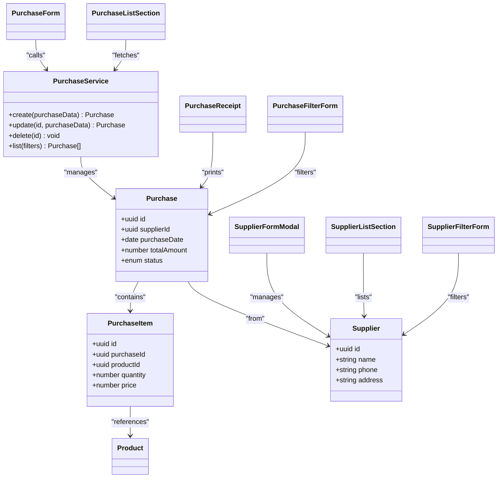

**Diagram sources**
- [uml-class-module-b-purchase.puml:1-200](file://docs/uml-class-module-b-purchase.puml#L1-L200)
- [purchaseService.ts:1-200](file://src/services/purchaseService.ts#L1-L200)
- [schema.ts:1-200](file://src/drizzle/schema.ts#L1-L200)
- [use-purchases.ts:1-200](file://src/hooks/purchases/use-purchases.ts#L1-L200)
- [use-purchase-form.ts:1-200](file://src/hooks/purchases/use-purchase-form.ts#L1-L200)
- [use-supplier-form.ts:1-200](file://src/hooks/purchases/use-supplier-form.ts#L1-L200)
- [use-supplier-list.ts:1-200](file://src/hooks/purchases/use-supplier-list.ts#L1-L200)

**Section sources**
- [uml-class-module-b-purchase.puml:1-200](file://docs/uml-class-module-b-purchase.puml#L1-L200)
- [purchaseService.ts:1-200](file://src/services/purchaseService.ts#L1-L200)
- [use-purchases.ts:1-200](file://src/hooks/purchases/use-purchases.ts#L1-L200)
- [use-purchase-form.ts:1-200](file://src/hooks/purchases/use-purchase-form.ts#L1-L200)
- [use-supplier-form.ts:1-200](file://src/hooks/purchases/use-supplier-form.ts#L1-L200)
- [use-supplier-list.ts:1-200](file://src/hooks/purchases/use-supplier-list.ts#L1-L200)

#### Stock Operations Module
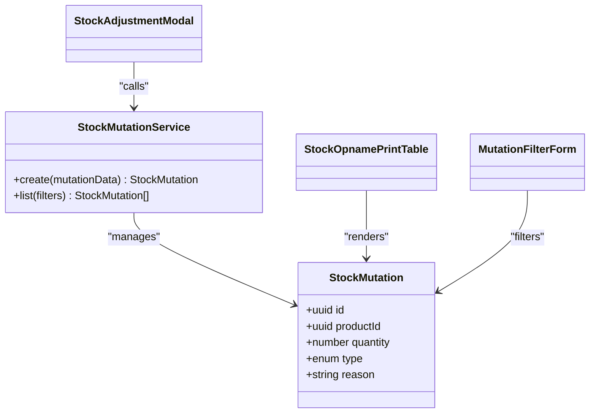

**Diagram sources**
- [uml-class-module-c-stock.puml:1-200](file://docs/uml-class-module-c-stock.puml#L1-L200)
- [stockMutationService.ts:1-200](file://src/services/stockMutationService.ts#L1-L200)
- [schema.ts:1-200](file://src/drizzle/schema.ts#L1-L200)
- [use-stock-mutations.ts:1-200](file://src/hooks/stock-mutations/use-stock-mutations.ts#L1-L200)

**Section sources**
- [uml-class-module-c-stock.puml:1-200](file://docs/uml-class-module-c-stock.puml#L1-L200)
- [stockMutationService.ts:1-200](file://src/services/stockMutationService.ts#L1-L200)
- [use-stock-mutations.ts:1-200](file://src/hooks/stock-mutations/use-stock-mutations.ts#L1-L200)

#### Cashier Operations Module
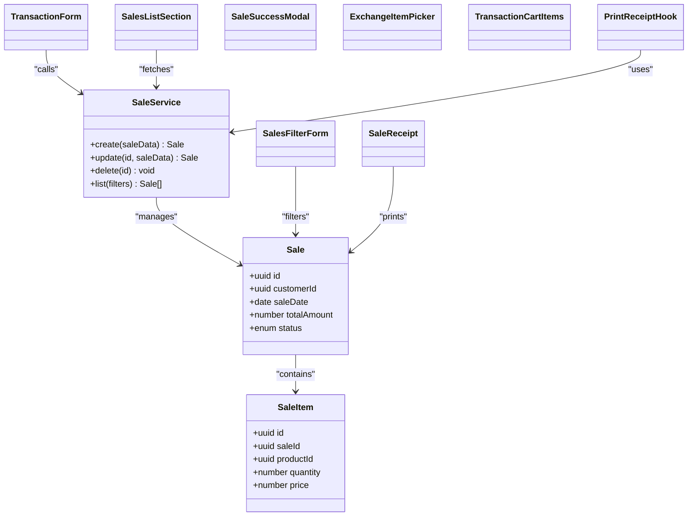

**Diagram sources**
- [uml-class-module-d-cashier.puml:1-200](file://docs/uml-class-module-d-cashier.puml#L1-L200)
- [saleService.ts:1-200](file://src/services/saleService.ts#L1-L200)
- [schema.ts:1-200](file://src/drizzle/schema.ts#L1-L200)
- [use-sale.ts:1-200](file://src/hooks/sales/use-sale.ts#L1-L200)
- [use-sale-form.ts:1-200](file://src/hooks/sales/use-sale-form.ts#L1-L200)
- [use-print-receipt.ts:1-200](file://src/hooks/sales/use-print-receipt.ts#L1-L200)

**Section sources**
- [uml-class-module-d-cashier.puml:1-200](file://docs/uml-class-module-d-cashier.puml#L1-L200)
- [saleService.ts:1-200](file://src/services/saleService.ts#L1-L200)
- [use-sale.ts:1-200](file://src/hooks/sales/use-sale.ts#L1-L200)
- [use-sale-form.ts:1-200](file://src/hooks/sales/use-sale-form.ts#L1-L200)
- [use-print-receipt.ts:1-200](file://src/hooks/sales/use-print-receipt.ts#L1-L200)

#### Return Handling Module
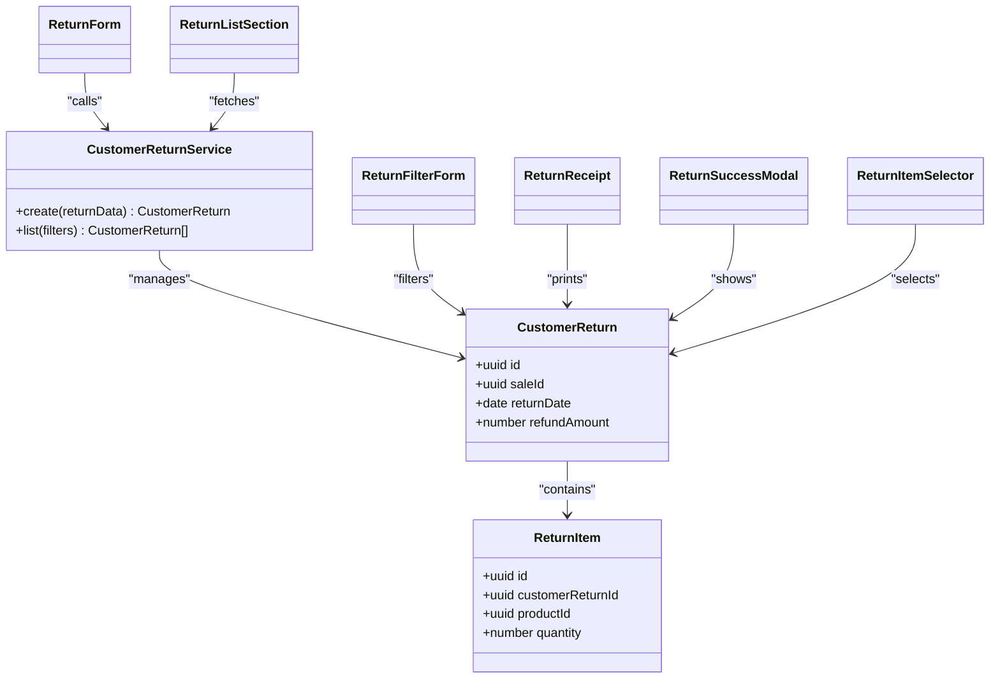

**Diagram sources**
- [uml-class-module-e-return.puml:1-200](file://docs/uml-class-module-e-return.puml#L1-L200)
- [customerReturnService.ts:1-200](file://src/services/customerReturnService.ts#L1-L200)
- [schema.ts:1-200](file://src/drizzle/schema.ts#L1-L200)
- [use-customer-return.ts:1-200](file://src/hooks/customer-returns/use-customer-return.ts#L1-L200)
- [use-return-form.ts:1-200](file://src/hooks/sales/use-return-form.ts#L1-L200)

**Section sources**
- [uml-class-module-e-return.puml:1-200](file://docs/uml-class-module-e-return.puml#L1-L200)
- [customerReturnService.ts:1-200](file://src/services/customerReturnService.ts#L1-L200)
- [use-customer-return.ts:1-200](file://src/hooks/customer-returns/use-customer-return.ts#L1-L200)
- [use-return-form.ts:1-200](file://src/hooks/sales/use-return-form.ts#L1-L200)

#### Debt Payment Module
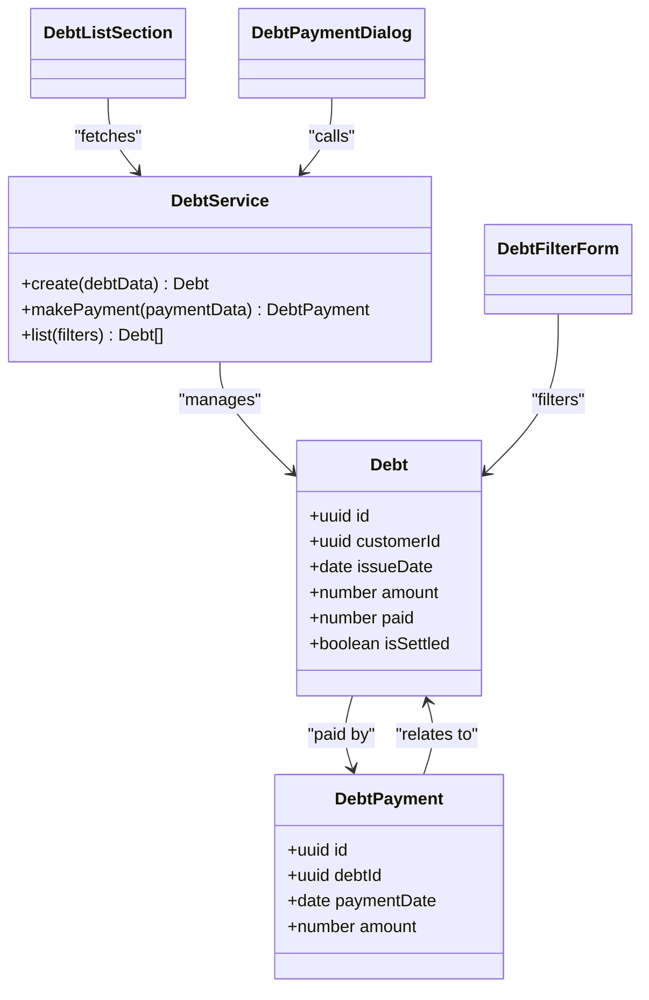

**Diagram sources**
- [uml-class-module-f-debt-payment.puml:1-200](file://docs/uml-class-module-f-debt-payment.puml#L1-L200)
- [debtService.ts:1-200](file://src/services/debtService.ts#L1-L200)
- [schema.ts:1-200](file://src/drizzle/schema.ts#L1-L200)
- [use-debts.ts:1-200](file://src/hooks/debt/use-debts.ts#L1-L200)

**Section sources**
- [uml-class-module-f-debt-payment.puml:1-200](file://docs/uml-class-module-f-debt-payment.puml#L1-L200)
- [debtService.ts:1-200](file://src/services/debtService.ts#L1-L200)
- [use-debts.ts:1-200](file://src/hooks/debt/use-debts.ts#L1-L200)

#### Reporting Module
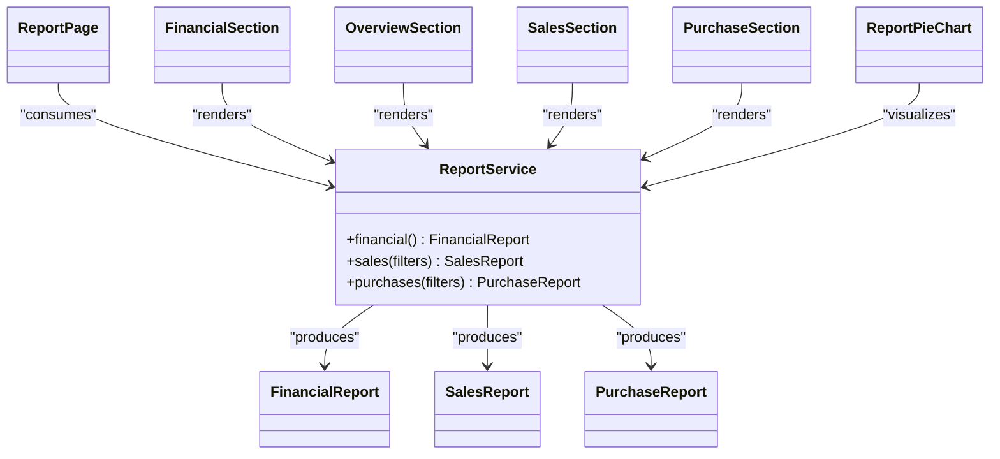

**Diagram sources**
- [uml-class-module-g-report.puml:1-200](file://docs/uml-class-module-g-report.puml#L1-L200)
- [reportService.ts:1-200](file://src/services/reportService.ts#L1-L200)
- [use-report.ts:1-200](file://src/hooks/report/use-report.ts#L1-L200)

**Section sources**
- [uml-class-module-g-report.puml:1-200](file://docs/uml-class-module-g-report.puml#L1-L200)
- [reportService.ts:1-200](file://src/services/reportService.ts#L1-L200)
- [use-report.ts:1-200](file://src/hooks/report/use-report.ts#L1-L200)

#### Trash Management Module
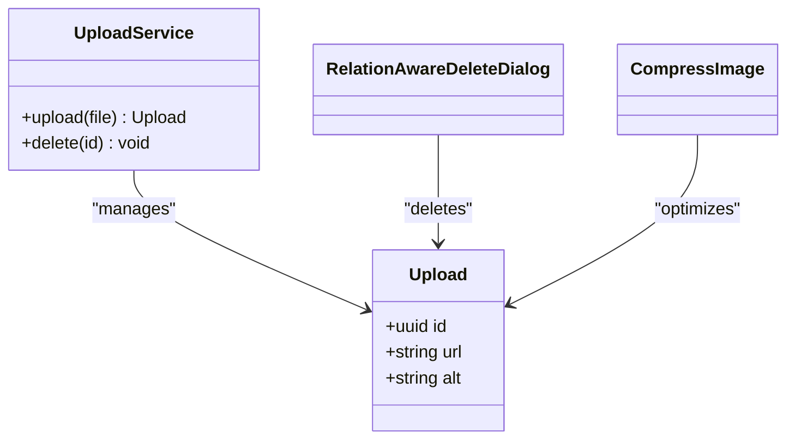

**Diagram sources**
- [uml-class-module-h-trash.puml:1-200](file://docs/uml-class-module-h-trash.puml#L1-L200)
- [uploadService.ts:1-200](file://src/services/uploadService.ts#L1-L200)
- [schema.ts:1-200](file://src/drizzle/schema.ts#L1-L200)
- [relation-aware-delete-dialog.tsx:1-200](file://src/components/relation-aware-delete-dialog.tsx#L1-L200)
- [compress-image.tsx:1-200](file://src/components/compress-image.tsx#L1-L200)

**Section sources**
- [uml-class-module-h-trash.puml:1-200](file://docs/uml-class-module-h-trash.puml#L1-L200)
- [uploadService.ts:1-200](file://src/services/uploadService.ts#L1-L200)
- [relation-aware-delete-dialog.tsx:1-200](file://src/components/relation-aware-delete-dialog.tsx#L1-L200)
- [compress-image.tsx:1-200](file://src/components/compress-image.tsx#L1-L200)

#### User Management Module
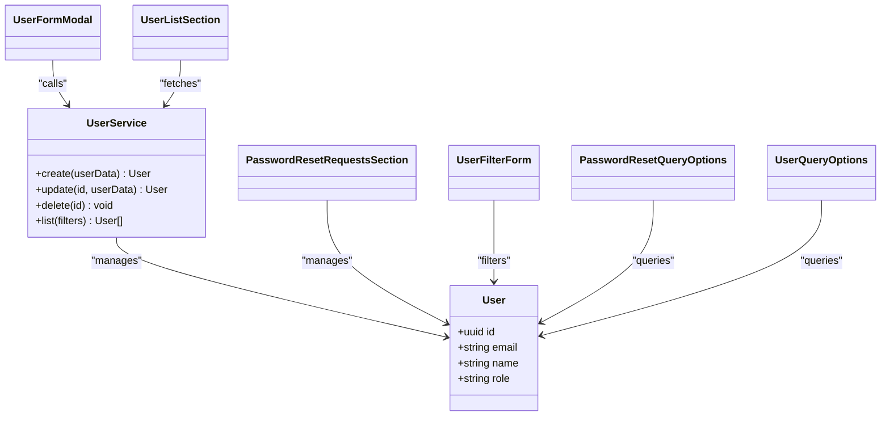

**Diagram sources**
- [uml-class-module-i-user.puml:1-200](file://docs/uml-class-module-i-user.puml#L1-L200)
- [userService.ts:1-200](file://src/services/userService.ts#L1-L200)
- [schema.ts:1-200](file://src/drizzle/schema.ts#L1-L200)
- [use-users.ts:1-200](file://src/hooks/users/use-users.ts#L1-L200)
- [use-create-user.ts:1-200](file://src/hooks/users/use-create-user.ts#L1-L200)
- [use-update-user.ts:1-200](file://src/hooks/users/use-update-user.ts#L1-L200)
- [use-delete-user.ts:1-200](file://src/hooks/users/use-delete-user.ts#L1-L200)
- [password-reset-query-options.ts:1-200](file://src/hooks/users/password-reset-query-options.ts#L1-L200)
- [use-password-reset-requests.ts:1-200](file://src/hooks/users/use-password-reset-requests.ts#L1-L200)
- [use-resolve-password-reset.ts:1-200](file://src/hooks/users/use-resolve-password-reset.ts#L1-L200)
- [use-change-password.ts:1-200](file://src/hooks/users/use-change-password.ts#L1-L200)

**Section sources**
- [uml-class-module-i-user.puml:1-200](file://docs/uml-class-module-i-user.puml#L1-L200)
- [userService.ts:1-200](file://src/services/userService.ts#L1-L200)
- [use-users.ts:1-200](file://src/hooks/users/use-users.ts#L1-L200)
- [use-create-user.ts:1-200](file://src/hooks/users/use-create-user.ts#L1-L200)
- [use-update-user.ts:1-200](file://src/hooks/users/use-update-user.ts#L1-L200)
- [use-delete-user.ts:1-200](file://src/hooks/users/use-delete-user.ts#L1-L200)
- [password-reset-query-options.ts:1-200](file://src/hooks/users/password-reset-query-options.ts#L1-L200)
- [use-password-reset-requests.ts:1-200](file://src/hooks/users/use-password-reset-requests.ts#L1-L200)
- [use-resolve-password-reset.ts:1-200](file://src/hooks/users/use-resolve-password-reset.ts#L1-L200)
- [use-change-password.ts:1-200](file://src/hooks/users/use-change-password.ts#L1-L200)

### Conceptual Overview
The following conceptual diagram illustrates how modules interact conceptually without mapping to specific source files.

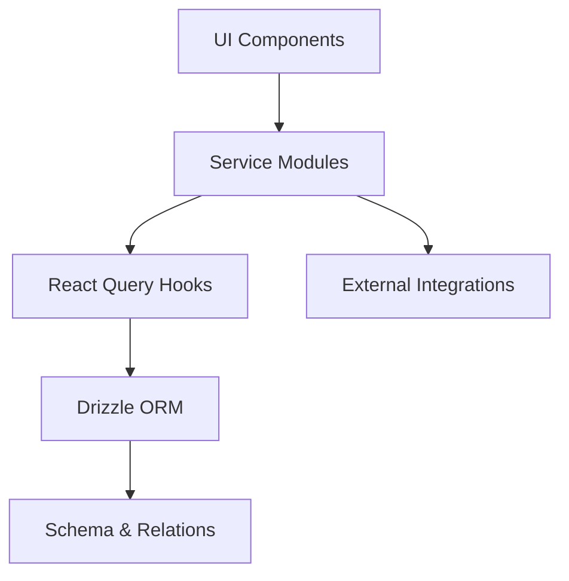

[No sources needed since this diagram shows conceptual workflow, not actual code structure]

## Dependency Analysis
This section analyzes dependencies among services, hooks, and database schema to ensure maintainability and clarity.

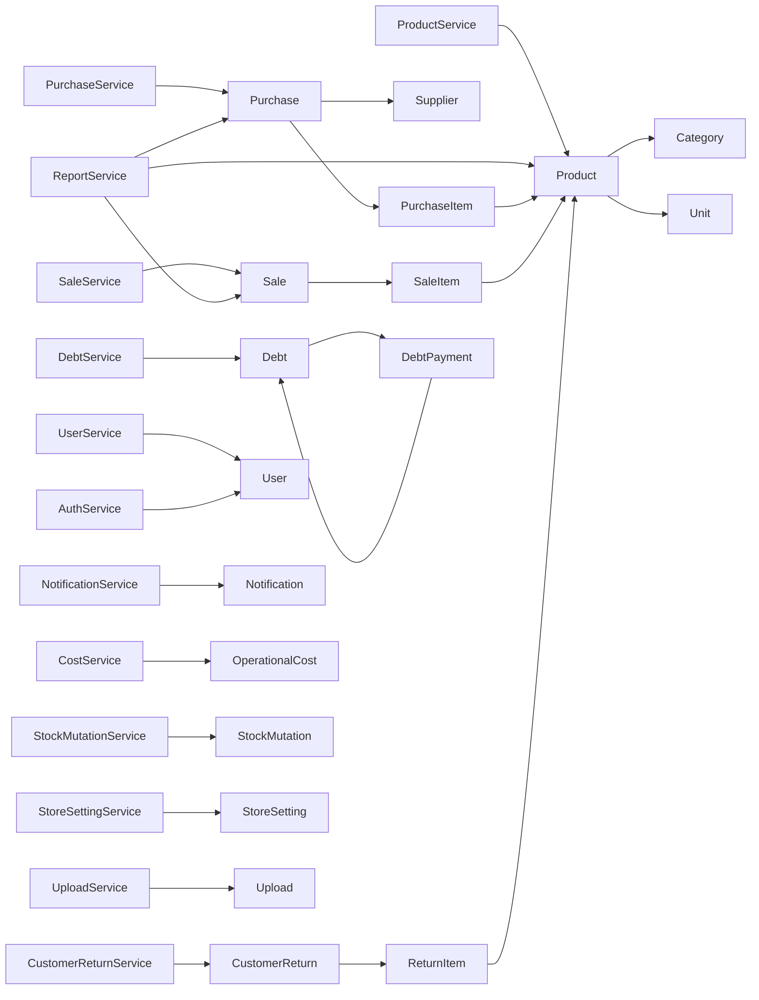

**Diagram sources**
- [productService.ts:1-200](file://src/services/productService.ts#L1-L200)
- [purchaseService.ts:1-200](file://src/services/purchaseService.ts#L1-L200)
- [saleService.ts:1-200](file://src/services/saleService.ts#L1-L200)
- [customerReturnService.ts:1-200](file://src/services/customerReturnService.ts#L1-L200)
- [debtService.ts:1-200](file://src/services/debtService.ts#L1-L200)
- [reportService.ts:1-200](file://src/services/reportService.ts#L1-L200)
- [userService.ts:1-200](file://src/services/userService.ts#L1-L200)
- [notificationService.ts:1-200](file://src/services/notificationService.ts#L1-L200)
- [costService.ts:1-200](file://src/services/costService.ts#L1-L200)
- [stockMutationService.ts:1-200](file://src/services/stockMutationService.ts#L1-L200)
- [storeSettingService.ts:1-200](file://src/services/storeSettingService.ts#L1-L200)
- [uploadService.ts:1-200](file://src/services/uploadService.ts#L1-L200)
- [authService.ts:1-200](file://src/services/authService.ts#L1-L200)
- [schema.ts:1-200](file://src/drizzle/schema.ts#L1-L200)
- [relations.ts:1-200](file://src/drizzle/relations.ts#L1-L200)

**Section sources**
- [schema.ts:1-200](file://src/drizzle/schema.ts#L1-L200)
- [relations.ts:1-200](file://src/drizzle/relations.ts#L1-L200)

## Performance Considerations
- Prefer paginated queries and filters in hooks to reduce payload sizes.
- Use optimistic updates in UI components paired with server reconciliation to minimize perceived latency.
- Cache frequently accessed entities (e.g., categories, units, suppliers) to reduce redundant network calls.
- Batch operations for stock adjustments and bulk uploads to minimize round trips.
- Monitor query counts and avoid N+1 queries by leveraging relations and joins in services.

[No sources needed since this section provides general guidance]

## Troubleshooting Guide
Common issues and resolutions:
- Authentication failures: Verify credentials and session tokens via the auth service hook and ensure proper redirect after login.
- Data inconsistencies: Check service method signatures and ensure hooks invalidate queries after mutations.
- UI state desynchronization: Confirm that dialogs and modals properly close and reset forms after successful operations.
- Upload errors: Validate file types and sizes before invoking upload service; handle compression and cleanup appropriately.

**Section sources**
- [use-auth.ts:1-200](file://src/hooks/use-auth.ts#L1-L200)
- [login-page.tsx:1-200](file://src/app/login/_components/login-page.tsx#L1-L200)
- [dialog.tsx:1-200](file://src/components/ui/dialog.tsx#L1-L200)
- [toast.tsx:1-200](file://src/components/ui/sonner.tsx#L1-L200)

## Conclusion
The class diagrams consolidate the POS application’s object-oriented structure, mapping functional entities, module boundaries, and UI-service integration. By adhering to the established relationships and following the guidelines below, teams can maintain consistency between diagrams and implementation while ensuring scalability and reliability.

## Appendices

### Guidelines for Reading Class Diagrams
- Visibility: Public attributes and methods are prefixed with a plus sign; private/internal ones with a minus sign.
- Multiplicity: Indicators such as “1”, “*”, or “0..1” show cardinalities between related classes.
- Relationships:
  - Inheritance: Solid lines with filled arrows from child to parent.
  - Association: Simple solid lines connecting related classes.
  - Aggregation: Diamonded hollow-line indicating ownership-like semantics.
  - Composition: Diamonded solid-line indicating strong ownership.
  - Dependency: Dashed arrow indicating usage or import relationships.
- Interfaces: Represented as classes with “<<interface>>” stereotype; implementations shown with dashed arrows ending at the implementing class.

[No sources needed since this section provides general guidance]

### Maintaining Class Diagram Consistency
- Align diagrams with the Drizzle schema and service method signatures.
- Keep UI components’ dependencies explicit in diagrams to reflect actual imports and prop drilling.
- Update diagrams after introducing new entities, relations, or service methods.
- Review diagrams during refactor sessions to prevent divergence from code.

[No sources needed since this section provides general guidance]