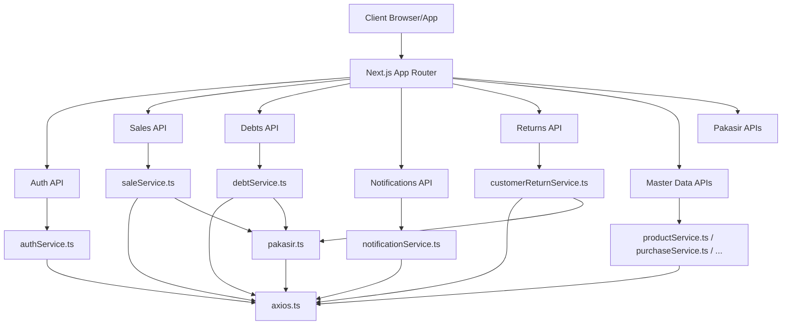
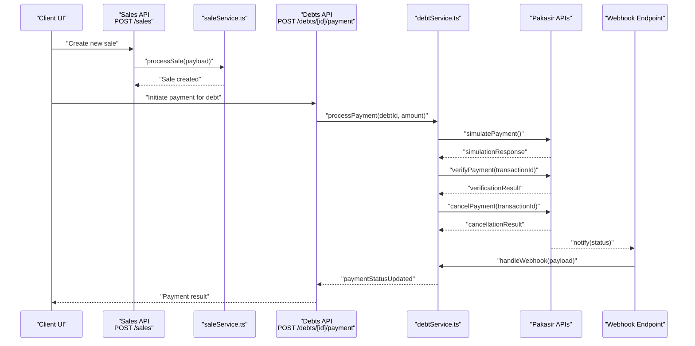
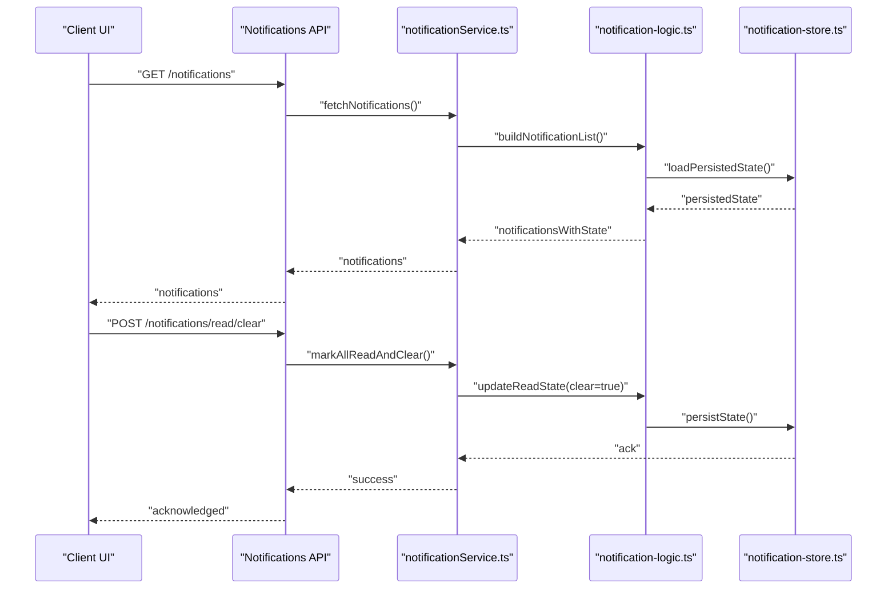
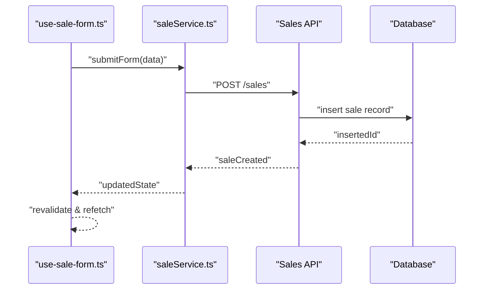
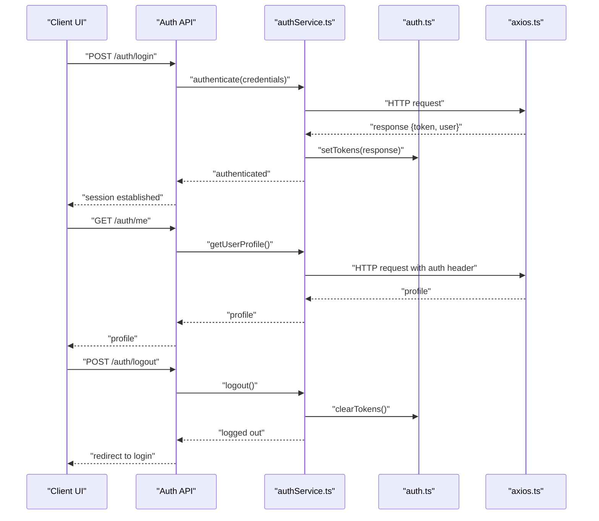
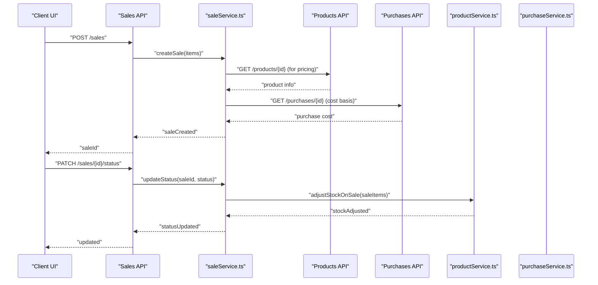
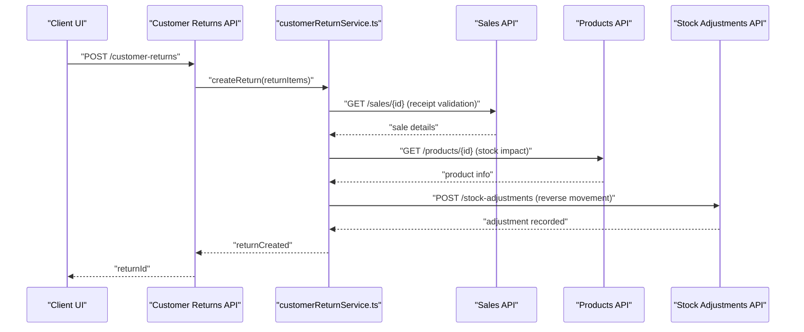
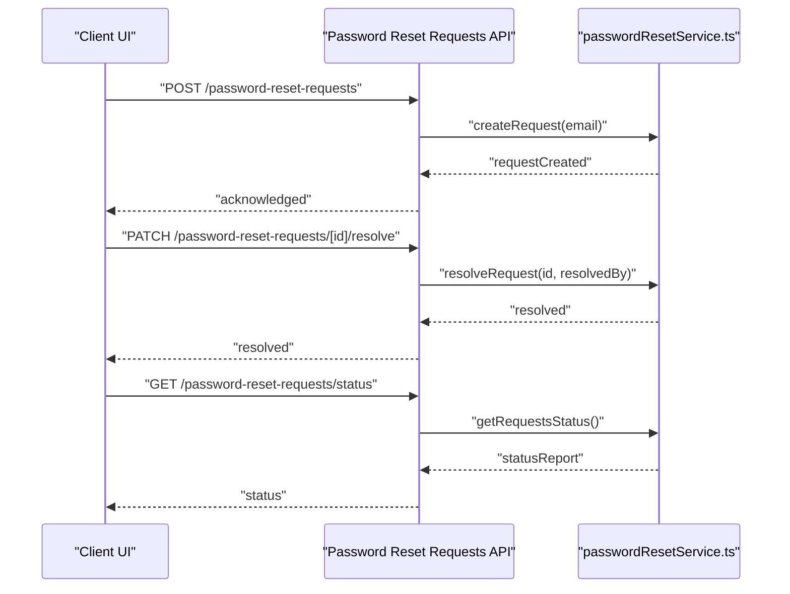

# Sequence Diagrams

<cite>
**Referenced Files in This Document**
- [route.ts](file://src/app/api/auth/login/route.ts)
- [route.ts](file://src/app/api/auth/logout/route.ts)
- [route.ts](file://src/app/api/auth/me/route.ts)
- [route.ts](file://src/app/api/auth/change-password/route.ts)
- [route.ts](file://src/app/api/auth/forgot-password/route.ts)
- [route.ts](file://src/app/api/auth/register/route.ts)
- [route.ts](file://src/app/api/auth/refresh/route.ts)
- [notification-logic.ts](file://src/app/api/notifications/_lib/notification-logic.ts)
- [notification-store.ts](file://src/app/api/notifications/_lib/notification-store.ts)
- [route.ts](file://src/app/api/notifications/route.ts)
- [route.ts](file://src/app/api/notifications/read/clear/route.ts)
- [route.ts](file://src/app/api/notifications/read/clear/route.ts)
- [route.ts](file://src/app/api/notifications/read/route.ts)
- [route.ts](file://src/app/api/notifications/[id]/read/route.ts)
- [route.ts](file://src/app/api/notifications/clear/route.ts)
- [route.ts](file://src/app/api/sales/[salesId]/status/route.ts)
- [route.ts](file://src/app/api/debts/[id]/payment/route.ts)
- [route.ts](file://src/app/api/pakasir-simulate/route.ts)
- [route.ts](file://src/app/api/pakasir-verify/route.ts)
- [route.ts](file://src/app/api/pakasir-cancel/route.ts)
- [route.ts](file://src/app/api/pakasir-webhook/route.ts)
- [route.ts](file://src/app/api/customer-returns/[customerReturnId]/route.ts)
- [route.ts](file://src/app/api/password-reset-requests/[id]/resolve/route.ts)
- [route.ts](file://src/app/api/password-reset-requests/status/route.ts)
- [route.ts](file://src/app/api/password-reset-requests/route.ts)
- [route.ts](file://src/app/api/dashboard/route.ts)
- [route.ts](file://src/app/api/reports/route.ts)
- [route.ts](file://src/app/api/settings/route.ts)
- [route.ts](file://src/app/api/tax-configs/[id]/route.ts)
- [route.ts](file://src/app/api/operational-costs/[id]/route.ts)
- [route.ts](file://src/app/api/stock-adjustments/route.ts)
- [route.ts](file://src/app/api/stock-mutations/route.ts)
- [route.ts](file://src/app/api/upload/images/route.ts)
- [route.ts](file://src/app/api/users/[id]/route.ts)
- [route.ts](file://src/app/api/categories/[categoryId]/route.ts)
- [route.ts](file://src/app/api/products/[productId]/audit-logs/route.ts)
- [route.ts](file://src/app/api/products/[productId]/relations/route.ts)
- [route.ts](file://src/app/api/products/variants/[variantId]/route.ts)
- [route.ts](file://src/app/api/purchases/[purchaseId]/route.ts)
- [route.ts](file://src/app/api/master/categories/[categoryId]/route.ts)
- [route.ts](file://src/app/api/master/customers/[customerId]/route.ts)
- [route.ts](file://src/app/api/master/suppliers/[supplierId]/route.ts)
- [route.ts](file://src/app/api/master/units/[unitId]/route.ts)
- [route.ts](file://src/app/api/units/[unitId]/relations/route.ts)
- [route.ts](file://src/app/api/cost-analytics/route.ts)
- [route.ts](file://src/app/api/sales/[salesId]/route.ts)
- [route.ts](file://src/app/api/sales/route.ts)
- [route.ts](file://src/app/api/products/[productId]/route.ts)
- [route.ts](file://src/app/api/products/route.ts)
- [route.ts](file://src/app/api/categories/route.ts)
- [route.ts](file://src/app/api/users/route.ts)
- [route.ts](file://src/app/api/purchases/route.ts)
- [route.ts](file://src/app/api/units/route.ts)
- [route.ts](file://src/app/api/master/categories/route.ts)
- [route.ts](file://src/app/api/master/customers/route.ts)
- [route.ts](file://src/app/api/master/suppliers/route.ts)
- [route.ts](file://src/app/api/master/units/route.ts)
- [route.ts](file://src/app/api/products/variants/route.ts)
- [route.ts](file://src/app/api/products/audit-logs/route.ts)
- [route.ts](file://src/app/api/products/[productId]/audit-logs/route.ts)
- [route.ts](file://src/app/api/products/[productId]/relations/route.ts)
- [route.ts](file://src/app/api/products/variants/[variantId]/route.ts)
- [route.ts](file://src/app/api/purchases/[purchaseId]/route.ts)
- [route.ts](file://src/app/api/sales/[salesId]/status/route.ts)
- [route.ts](file://src/app/api/debts/[id]/payment/route.ts)
- [route.ts](file://src/app/api/customer-returns/[customerReturnId]/route.ts)
- [route.ts](file://src/app/api/password-reset-requests/[id]/resolve/route.ts)
- [route.ts](file://src/app/api/password-reset-requests/status/route.ts)
- [route.ts](file://src/app/api/password-reset-requests/route.ts)
- [route.ts](file://src/app/api/notifications/route.ts)
- [route.ts](file://src/app/api/notifications/read/clear/route.ts)
- [route.ts](file://src/app/api/notifications/read/clear/route.ts)
- [route.ts](file://src/app/api/notifications/read/route.ts)
- [route.ts](file://src/app/api/notifications/[id]/read/route.ts)
- [route.ts](file://src/app/api/notifications/clear/route.ts)
- [route.ts](file://src/app/api/auth/login/route.ts)
- [route.ts](file://src/app/api/auth/logout/route.ts)
- [route.ts](file://src/app/api/auth/me/route.ts)
- [route.ts](file://src/app/api/auth/change-password/route.ts)
- [route.ts](file://src/app/api/auth/forgot-password/route.ts)
- [route.ts](file://src/app/api/auth/register/route.ts)
- [route.ts](file://src/app/api/auth/refresh/route.ts)
- [notification-logic.ts](file://src/app/api/notifications/_lib/notification-logic.ts)
- [notification-store.ts](file://src/app/api/notifications/_lib/notification-store.ts)
- [notification-logic.test.ts](file://src/app/api/notifications/_lib/notification-logic.test.ts)
- [notification-store.test.ts](file://src/app/api/notifications/_lib/notification-store.test.ts)
- [debt-service.ts](file://src/app/api/debts/_lib/debt-service.ts)
- [return-service.ts](file://src/app/api/customer-returns/_lib/return-service.ts)
- [authService.ts](file://src/services/authService.ts)
- [notificationService.ts](file://src/services/notificationService.ts)
- [debtService.ts](file://src/services/debtService.ts)
- [saleService.ts](file://src/services/saleService.ts)
- [customerReturnService.ts](file://src/services/customerReturnService.ts)
- [productService.ts](file://src/services/productService.ts)
- [purchaseService.ts](file://src/services/purchaseService.ts)
- [userService.ts](file://src/services/userService.ts)
- [categoryService.ts](file://src/services/categoryService.ts)
- [supplierService.ts](file://src/services/supplierService.ts)
- [unitService.ts](file://src/services/unitService.ts)
- [dashboardService.ts](file://src/services/dashboardService.ts)
- [reportService.ts](file://src/services/reportService.ts)
- [storeSettingService.ts](file://src/services/storeSettingService.ts)
- [costService.ts](file://src/services/costService.ts)
- [stockMutationService.ts](file://src/services/stockMutationService.ts)
- [uploadService.ts](file://src/services/uploadService.ts)
- [passwordResetService.ts](file://src/services/passwordResetService.ts)
- [axios.ts](file://src/lib/axios.ts)
- [pakasir.ts](file://src/lib/pakasir.ts)
- [auth.ts](file://src/lib/auth.ts)
- [api-utils.ts](file://src/lib/api-utils.ts)
- [use-auth.ts](file://src/hooks/use-auth.ts)
- [use-notifications.ts](file://src/hooks/use-notifications.ts)
- [use-sale-form.ts](file://src/hooks/sales/use-sale-form.ts)
- [use-return-form.ts](file://src/hooks/sales/use-return-form.ts)
- [use-product-search.ts](file://src/hooks/use-product-search.ts)
- [use-print-receipt.ts](file://src/hooks/sales/use-print-receipt.ts)
- [qris-payment-modal.tsx](file://src/components/qris-payment-modal.tsx)
- [logo-qris.tsx](file://src/components/icons/qris-logo.tsx)
- [README.md](file://README.md)
</cite>

## Table of Contents
1. [Introduction](#introduction)
2. [Project Structure](#project-structure)
3. [Core Components](#core-components)
4. [Architecture Overview](#architecture-overview)
5. [Detailed Component Analysis](#detailed-component-analysis)
6. [Dependency Analysis](#dependency-analysis)
7. [Performance Considerations](#performance-considerations)
8. [Troubleshooting Guide](#troubleshooting-guide)
9. [Conclusion](#conclusion)
10. [Appendices](#appendices)

## Introduction
This document provides comprehensive sequence diagram documentation for critical system interactions in the POS application. It focuses on payment processing workflows (including QRIS/Pakasir integration), notification system interactions, data synchronization processes, user authentication flows, and business transaction sequences. The diagrams explain lifelines, message sequencing, activation boxes, return messages, collaboration between internal components, external integrations (Pakasir API), and asynchronous communication patterns. Guidelines are included for modeling complex interactions, handling error scenarios, and documenting system-to-system communication.

## Project Structure
The POS application follows a Next.js pages router structure with API routes under src/app/api. Authentication, notifications, sales, purchases, products, users, and master data modules expose REST endpoints. Services in src/services encapsulate business logic and integrate with external systems (e.g., Pakasir). Hooks in src/hooks coordinate UI state and data fetching. The library layer in src/lib provides shared utilities and HTTP client configuration.

```mermaid
graph TB
subgraph "Client UI"
UI_Login["Login Page"]
UI_Sales["Sales Dashboard"]
UI_Notifications["Notifications Panel"]
end
subgraph "API Routes"
Auth_Routes["Auth Routes<br/>login, logout, me, refresh,<br/>change-password, forgot-password, register"]
Sales_Routes["Sales Routes<br/>sales, sales/[id], sales/[id]/status"]
Debts_Routes["Debts Routes<br/>debts, debts/[id]/payment"]
Notifications_Routes["Notifications Routes<br/>notifications, notifications/read/*,<br/>notifications/[id]/read, notifications/clear"]
Returns_Routes["Returns Routes<br/>customer-returns, customer-returns/[id]"]
Master_Routes["Master Data Routes<br/>categories, customers, suppliers, units,<br/>products, purchases, users"]
Pakasir_Routes["Pakasir Routes<br/>pakasir-simulate, pakasir-verify,<br/>pakasir-cancel, pakasir-webhook"]
end
subgraph "Services Layer"
AuthSvc["authService.ts"]
NotifSvc["notificationService.ts"]
DebtSvc["debtService.ts"]
SaleSvc["saleService.ts"]
ReturnSvc["customerReturnService.ts"]
ProductSvc["productService.ts"]
PurchaseSvc["purchaseService.ts"]
UserSvc["userService.ts"]
CategorySvc["categoryService.ts"]
SupplierSvc["supplierService.ts"]
UnitSvc["unitService.ts"]
DashboardSvc["dashboardService.ts"]
ReportSvc["reportService.ts"]
StoreSettingSvc["storeSettingService.ts"]
CostSvc["costService.ts"]
StockMutSvc["stockMutationService.ts"]
UploadSvc["uploadService.ts"]
PasswordResetSvc["passwordResetService.ts"]
end
subgraph "Libraries"
Axios["axios.ts"]
PakasirLib["pakasir.ts"]
AuthLib["auth.ts"]
ApiUtils["api-utils.ts"]
end
UI_Login --> Auth_Routes
UI_Sales --> Sales_Routes
UI_Sales --> Debts_Routes
UI_Notifications --> Notifications_Routes
UI_Sales --> Returns_Routes
Auth_Routes --> AuthSvc
Sales_Routes --> SaleSvc
Debts_Routes --> DebtSvc
Notifications_Routes --> NotifSvc
Returns_Routes --> ReturnSvc
Master_Routes --> ProductSvc
Master_Routes --> PurchaseSvc
Master_Routes --> UserSvc
Master_Routes --> CategorySvc
Master_Routes --> SupplierSvc
Master_Routes --> UnitSvc
Master_Routes --> DashboardSvc
Master_Routes --> ReportSvc
Master_Routes --> StoreSettingSvc
Master_Routes --> CostSvc
Master_Routes --> StockMutSvc
Master_Routes --> UploadSvc
Master_Routes --> PasswordResetSvc
AuthSvc --> Axios
NotifSvc --> Axios
DebtSvc --> Axios
SaleSvc --> Axios
ReturnSvc --> Axios
ProductSvc --> Axios
PurchaseSvc --> Axios
UserSvc --> Axios
CategorySvc --> Axios
SupplierSvc --> Axios
UnitSvc --> Axios
DashboardSvc --> Axios
ReportSvc --> Axios
StoreSettingSvc --> Axios
CostSvc --> Axios
StockMutSvc --> Axios
UploadSvc --> Axios
PasswordResetSvc --> Axios
AuthSvc --> AuthLib
NotifSvc --> ApiUtils
DebtSvc --> ApiUtils
SaleSvc --> ApiUtils
ReturnSvc --> ApiUtils
ProductSvc --> ApiUtils
PurchaseSvc --> ApiUtils
UserSvc --> ApiUtils
CategorySvc --> ApiUtils
SupplierSvc --> ApiUtils
UnitSvc --> ApiUtils
DashboardSvc --> ApiUtils
ReportSvc --> ApiUtils
StoreSettingSvc --> ApiUtils
CostSvc --> ApiUtils
StockMutSvc --> ApiUtils
UploadSvc --> ApiUtils
PasswordResetSvc --> ApiUtils
DebtSvc --> PakasirLib
SaleSvc --> PakasirLib
ReturnSvc --> PakasirLib
PakasirLib --> Axios
```

**Diagram sources**
- [route.ts](file://src/app/api/auth/login/route.ts)
- [route.ts](file://src/app/api/sales/[salesId]/status/route.ts)
- [route.ts](file://src/app/api/debts/[id]/payment/route.ts)
- [route.ts](file://src/app/api/notifications/route.ts)
- [route.ts](file://src/app/api/customer-returns/[customerReturnId]/route.ts)
- [route.ts](file://src/app/api/pakasir-simulate/route.ts)
- [route.ts](file://src/app/api/pakasir-verify/route.ts)
- [route.ts](file://src/app/api/pakasir-cancel/route.ts)
- [route.ts](file://src/app/api/pakasir-webhook/route.ts)
- [authService.ts](file://src/services/authService.ts)
- [notificationService.ts](file://src/services/notificationService.ts)
- [debtService.ts](file://src/services/debtService.ts)
- [saleService.ts](file://src/services/saleService.ts)
- [customerReturnService.ts](file://src/services/customerReturnService.ts)
- [productService.ts](file://src/services/productService.ts)
- [purchaseService.ts](file://src/services/purchaseService.ts)
- [userService.ts](file://src/services/userService.ts)
- [categoryService.ts](file://src/services/categoryService.ts)
- [supplierService.ts](file://src/services/supplierService.ts)
- [unitService.ts](file://src/services/unitService.ts)
- [dashboardService.ts](file://src/services/dashboardService.ts)
- [reportService.ts](file://src/services/reportService.ts)
- [storeSettingService.ts](file://src/services/storeSettingService.ts)
- [costService.ts](file://src/services/costService.ts)
- [stockMutationService.ts](file://src/services/stockMutationService.ts)
- [uploadService.ts](file://src/services/uploadService.ts)
- [passwordResetService.ts](file://src/services/passwordResetService.ts)
- [axios.ts](file://src/lib/axios.ts)
- [pakasir.ts](file://src/lib/pakasir.ts)
- [auth.ts](file://src/lib/auth.ts)
- [api-utils.ts](file://src/lib/api-utils.ts)

**Section sources**
- [README.md](file://README.md)

## Core Components
- Authentication module: Provides login, logout, registration, password reset, refresh token, and profile retrieval endpoints. Services handle JWT lifecycle, session management, and protected routes.
- Payment processing: Integrates with Pakasir for QRIS payment simulation, verification, cancellation, and webhook handling. Debts and sales modules support payment reconciliation and status updates.
- Notifications: Centralized notification service with CRUD operations, read/unread states, clearing, and persistence logic.
- Business transactions: Sales, purchases, products, users, and master data APIs with supporting services for audit logs, variants, relations, and analytics.
- Data synchronization: Hooks and services coordinate UI state, caching, and server synchronization for real-time updates.

**Section sources**
- [route.ts](file://src/app/api/auth/login/route.ts)
- [route.ts](file://src/app/api/auth/logout/route.ts)
- [route.ts](file://src/app/api/auth/me/route.ts)
- [route.ts](file://src/app/api/auth/change-password/route.ts)
- [route.ts](file://src/app/api/auth/forgot-password/route.ts)
- [route.ts](file://src/app/api/auth/register/route.ts)
- [route.ts](file://src/app/api/auth/refresh/route.ts)
- [route.ts](file://src/app/api/sales/[salesId]/status/route.ts)
- [route.ts](file://src/app/api/debts/[id]/payment/route.ts)
- [route.ts](file://src/app/api/pakasir-simulate/route.ts)
- [route.ts](file://src/app/api/pakasir-verify/route.ts)
- [route.ts](file://src/app/api/pakasir-cancel/route.ts)
- [route.ts](file://src/app/api/pakasir-webhook/route.ts)
- [route.ts](file://src/app/api/notifications/route.ts)
- [notification-logic.ts](file://src/app/api/notifications/_lib/notification-logic.ts)
- [notification-store.ts](file://src/app/api/notifications/_lib/notification-store.ts)

## Architecture Overview
The system employs a layered architecture:
- Presentation: React components and pages.
- API Layer: Next.js App Router API routes implementing REST endpoints.
- Services Layer: Business logic and orchestration, interacting with external systems.
- Libraries: Shared utilities, HTTP client, and third-party integrations.
- Persistence: Database via Drizzle ORM and migrations.

**Diagram sources**
- [route.ts](file://src/app/api/auth/login/route.ts)
- [route.ts](file://src/app/api/sales/[salesId]/status/route.ts)
- [route.ts](file://src/app/api/debts/[id]/payment/route.ts)
- [route.ts](file://src/app/api/notifications/route.ts)
- [route.ts](file://src/app/api/customer-returns/[customerReturnId]/route.ts)
- [route.ts](file://src/app/api/pakasir-simulate/route.ts)
- [route.ts](file://src/app/api/pakasir-verify/route.ts)
- [route.ts](file://src/app/api/pakasir-cancel/route.ts)
- [route.ts](file://src/app/api/pakasir-webhook/route.ts)
- [authService.ts](file://src/services/authService.ts)
- [saleService.ts](file://src/services/saleService.ts)
- [debtService.ts](file://src/services/debtService.ts)
- [notificationService.ts](file://src/services/notificationService.ts)
- [customerReturnService.ts](file://src/services/customerReturnService.ts)
- [productService.ts](file://src/services/productService.ts)
- [purchaseService.ts](file://src/services/purchaseService.ts)
- [axios.ts](file://src/lib/axios.ts)
- [pakasir.ts](file://src/lib/pakasir.ts)

## Detailed Component Analysis

### Payment Processing Workflows (QRIS/Pakasir Integration)
This section documents the end-to-end payment processing sequence involving QRIS/Pakasir, including simulation, verification, cancellation, and webhook handling.

**Diagram sources**
- [route.ts](file://src/app/api/sales/[salesId]/status/route.ts)
- [route.ts](file://src/app/api/debts/[id]/payment/route.ts)
- [route.ts](file://src/app/api/pakasir-simulate/route.ts)
- [route.ts](file://src/app/api/pakasir-verify/route.ts)
- [route.ts](file://src/app/api/pakasir-cancel/route.ts)
- [route.ts](file://src/app/api/pakasir-webhook/route.ts)
- [saleService.ts](file://src/services/saleService.ts)
- [debtService.ts](file://src/services/debtService.ts)
- [pakasir.ts](file://src/lib/pakasir.ts)

**Section sources**
- [route.ts](file://src/app/api/sales/[salesId]/status/route.ts)
- [route.ts](file://src/app/api/debts/[id]/payment/route.ts)
- [route.ts](file://src/app/api/pakasir-simulate/route.ts)
- [route.ts](file://src/app/api/pakasir-verify/route.ts)
- [route.ts](file://src/app/api/pakasir-cancel/route.ts)
- [route.ts](file://src/app/api/pakasir-webhook/route.ts)
- [saleService.ts](file://src/services/saleService.ts)
- [debtService.ts](file://src/services/debtService.ts)
- [pakasir.ts](file://src/lib/pakasir.ts)

### Notification System Interactions
This sequence covers creating, reading, clearing, and managing notifications with persistence and state logic.

**Diagram sources**
- [route.ts](file://src/app/api/notifications/route.ts)
- [route.ts](file://src/app/api/notifications/read/clear/route.ts)
- [route.ts](file://src/app/api/notifications/read/route.ts)
- [route.ts](file://src/app/api/notifications/[id]/read/route.ts)
- [route.ts](file://src/app/api/notifications/clear/route.ts)
- [notificationService.ts](file://src/services/notificationService.ts)
- [notification-logic.ts](file://src/app/api/notifications/_lib/notification-logic.ts)
- [notification-store.ts](file://src/app/api/notifications/_lib/notification-store.ts)

**Section sources**
- [route.ts](file://src/app/api/notifications/route.ts)
- [route.ts](file://src/app/api/notifications/read/clear/route.ts)
- [route.ts](file://src/app/api/notifications/read/route.ts)
- [route.ts](file://src/app/api/notifications/[id]/read/route.ts)
- [route.ts](file://src/app/api/notifications/clear/route.ts)
- [notificationService.ts](file://src/services/notificationService.ts)
- [notification-logic.ts](file://src/app/api/notifications/_lib/notification-logic.ts)
- [notification-store.ts](file://src/app/api/notifications/_lib/notification-store.ts)

### Data Synchronization Processes
This sequence illustrates synchronization between UI hooks, services, and API routes for real-time updates and state consistency.

**Diagram sources**
- [use-sale-form.ts](file://src/hooks/sales/use-sale-form.ts)
- [saleService.ts](file://src/services/saleService.ts)
- [route.ts](file://src/app/api/sales/[salesId]/status/route.ts)

**Section sources**
- [use-sale-form.ts](file://src/hooks/sales/use-sale-form.ts)
- [saleService.ts](file://src/services/saleService.ts)
- [route.ts](file://src/app/api/sales/[salesId]/status/route.ts)

### User Authentication Flows
This sequence covers login, logout, refresh token, and protected resource access.

**Diagram sources**
- [route.ts](file://src/app/api/auth/login/route.ts)
- [route.ts](file://src/app/api/auth/logout/route.ts)
- [route.ts](file://src/app/api/auth/me/route.ts)
- [route.ts](file://src/app/api/auth/change-password/route.ts)
- [route.ts](file://src/app/api/auth/forgot-password/route.ts)
- [route.ts](file://src/app/api/auth/register/route.ts)
- [route.ts](file://src/app/api/auth/refresh/route.ts)
- [authService.ts](file://src/services/authService.ts)
- [auth.ts](file://src/lib/auth.ts)
- [axios.ts](file://src/lib/axios.ts)

**Section sources**
- [route.ts](file://src/app/api/auth/login/route.ts)
- [route.ts](file://src/app/api/auth/logout/route.ts)
- [route.ts](file://src/app/api/auth/me/route.ts)
- [route.ts](file://src/app/api/auth/change-password/route.ts)
- [route.ts](file://src/app/api/auth/forgot-password/route.ts)
- [route.ts](file://src/app/api/auth/register/route.ts)
- [route.ts](file://src/app/api/auth/refresh/route.ts)
- [authService.ts](file://src/services/authService.ts)
- [auth.ts](file://src/lib/auth.ts)
- [axios.ts](file://src/lib/axios.ts)

### Business Transaction Sequences (Sales, Purchases, Products)
This sequence demonstrates a typical sale creation and status update flow.

**Diagram sources**
- [route.ts](file://src/app/api/sales/[salesId]/status/route.ts)
- [route.ts](file://src/app/api/sales/[salesId]/route.ts)
- [route.ts](file://src/app/api/sales/route.ts)
- [route.ts](file://src/app/api/products/[productId]/route.ts)
- [route.ts](file://src/app/api/purchases/[purchaseId]/route.ts)
- [saleService.ts](file://src/services/saleService.ts)
- [productService.ts](file://src/services/productService.ts)
- [purchaseService.ts](file://src/services/purchaseService.ts)

**Section sources**
- [route.ts](file://src/app/api/sales/[salesId]/status/route.ts)
- [route.ts](file://src/app/api/sales/[salesId]/route.ts)
- [route.ts](file://src/app/api/sales/route.ts)
- [route.ts](file://src/app/api/products/[productId]/route.ts)
- [route.ts](file://src/app/api/purchases/[purchaseId]/route.ts)
- [saleService.ts](file://src/services/saleService.ts)
- [productService.ts](file://src/services/productService.ts)
- [purchaseService.ts](file://src/services/purchaseService.ts)

### Customer Returns Workflow
This sequence covers initiating a return, validating items, and updating inventory and financial records.

**Diagram sources**
- [route.ts](file://src/app/api/customer-returns/[customerReturnId]/route.ts)
- [customerReturnService.ts](file://src/services/customerReturnService.ts)
- [route.ts](file://src/app/api/sales/[salesId]/route.ts)
- [route.ts](file://src/app/api/products/[productId]/route.ts)
- [route.ts](file://src/app/api/stock-adjustments/route.ts)

**Section sources**
- [route.ts](file://src/app/api/customer-returns/[customerReturnId]/route.ts)
- [customerReturnService.ts](file://src/services/customerReturnService.ts)
- [route.ts](file://src/app/api/sales/[salesId]/route.ts)
- [route.ts](file://src/app/api/products/[productId]/route.ts)
- [route.ts](file://src/app/api/stock-adjustments/route.ts)

### Password Reset Requests
This sequence handles password reset request creation, resolution, and status updates.

**Diagram sources**
- [route.ts](file://src/app/api/password-reset-requests/[id]/resolve/route.ts)
- [route.ts](file://src/app/api/password-reset-requests/status/route.ts)
- [route.ts](file://src/app/api/password-reset-requests/route.ts)
- [passwordResetService.ts](file://src/services/passwordResetService.ts)

**Section sources**
- [route.ts](file://src/app/api/password-reset-requests/[id]/resolve/route.ts)
- [route.ts](file://src/app/api/password-reset-requests/status/route.ts)
- [route.ts](file://src/app/api/password-reset-requests/route.ts)
- [passwordResetService.ts](file://src/services/passwordResetService.ts)

## Dependency Analysis
The following diagram highlights key dependencies among services and libraries involved in payment processing and notifications.

```mermaid
graph TB
AuthSvc["authService.ts"] --> Axios["axios.ts"]
AuthSvc --> AuthLib["auth.ts"]
NotifSvc["notificationService.ts"] --> Axios
NotifSvc --> NotifLogic["notification-logic.ts"]
NotifSvc --> NotifStore["notification-store.ts"]
DebtSvc["debtService.ts"] --> Axios
DebtSvc --> ApiUtils["api-utils.ts"]
DebtSvc --> PakasirLib["pakasir.ts"]
SaleSvc["saleService.ts"] --> Axios
SaleSvc --> ApiUtils
ReturnSvc["customerReturnService.ts"] --> Axios
ReturnSvc --> ApiUtils
ProductSvc["productService.ts"] --> Axios
PurchaseSvc["purchaseService.ts"] --> Axios
UserSvc["userService.ts"] --> Axios
CategorySvc["categoryService.ts"] --> Axios
SupplierSvc["supplierService.ts"] --> Axios
UnitSvc["unitService.ts"] --> Axios
DashboardSvc["dashboardService.ts"] --> Axios
ReportSvc["reportService.ts"] --> Axios
StoreSettingSvc["storeSettingService.ts"] --> Axios
CostSvc["costService.ts"] --> Axios
StockMutSvc["stockMutationService.ts"] --> Axios
UploadSvc["uploadService.ts"] --> Axios
PasswordResetSvc["passwordResetService.ts"] --> Axios
PakasirLib["pakasir.ts"] --> Axios
```

**Diagram sources**
- [authService.ts](file://src/services/authService.ts)
- [notificationService.ts](file://src/services/notificationService.ts)
- [debtService.ts](file://src/services/debtService.ts)
- [saleService.ts](file://src/services/saleService.ts)
- [customerReturnService.ts](file://src/services/customerReturnService.ts)
- [productService.ts](file://src/services/productService.ts)
- [purchaseService.ts](file://src/services/purchaseService.ts)
- [userService.ts](file://src/services/userService.ts)
- [categoryService.ts](file://src/services/categoryService.ts)
- [supplierService.ts](file://src/services/supplierService.ts)
- [unitService.ts](file://src/services/unitService.ts)
- [dashboardService.ts](file://src/services/dashboardService.ts)
- [reportService.ts](file://src/services/reportService.ts)
- [storeSettingService.ts](file://src/services/storeSettingService.ts)
- [costService.ts](file://src/services/costService.ts)
- [stockMutationService.ts](file://src/services/stockMutationService.ts)
- [uploadService.ts](file://src/services/uploadService.ts)
- [passwordResetService.ts](file://src/services/passwordResetService.ts)
- [axios.ts](file://src/lib/axios.ts)
- [pakasir.ts](file://src/lib/pakasir.ts)
- [auth.ts](file://src/lib/auth.ts)
- [api-utils.ts](file://src/lib/api-utils.ts)
- [notification-logic.ts](file://src/app/api/notifications/_lib/notification-logic.ts)
- [notification-store.ts](file://src/app/api/notifications/_lib/notification-store.ts)

**Section sources**
- [authService.ts](file://src/services/authService.ts)
- [notificationService.ts](file://src/services/notificationService.ts)
- [debtService.ts](file://src/services/debtService.ts)
- [saleService.ts](file://src/services/saleService.ts)
- [customerReturnService.ts](file://src/services/customerReturnService.ts)
- [productService.ts](file://src/services/productService.ts)
- [purchaseService.ts](file://src/services/purchaseService.ts)
- [userService.ts](file://src/services/userService.ts)
- [categoryService.ts](file://src/services/categoryService.ts)
- [supplierService.ts](file://src/services/supplierService.ts)
- [unitService.ts](file://src/services/unitService.ts)
- [dashboardService.ts](file://src/services/dashboardService.ts)
- [reportService.ts](file://src/services/reportService.ts)
- [storeSettingService.ts](file://src/services/storeSettingService.ts)
- [costService.ts](file://src/services/costService.ts)
- [stockMutationService.ts](file://src/services/stockMutationService.ts)
- [uploadService.ts](file://src/services/uploadService.ts)
- [passwordResetService.ts](file://src/services/passwordResetService.ts)
- [axios.ts](file://src/lib/axios.ts)
- [pakasir.ts](file://src/lib/pakasir.ts)
- [auth.ts](file://src/lib/auth.ts)
- [api-utils.ts](file://src/lib/api-utils.ts)
- [notification-logic.ts](file://src/app/api/notifications/_lib/notification-logic.ts)
- [notification-store.ts](file://src/app/api/notifications/_lib/notification-store.ts)

## Performance Considerations
- Minimize round-trips by batching related operations (e.g., fetch product info and purchase costs in a single workflow).
- Use optimistic updates in UI hooks to improve perceived performance; reconcile with server responses asynchronously.
- Implement caching strategies for frequently accessed resources (products, categories, units).
- Apply pagination and filtering for large datasets (sales, purchases, notifications).
- Optimize database queries with appropriate indexes and limit projections to required fields.

## Troubleshooting Guide
Common issues and resolutions:
- Authentication failures: Verify token presence and validity; check refresh token flow and secure cookie settings.
- Payment errors: Inspect Pakasir API responses; confirm transaction ID propagation and webhook delivery.
- Notification inconsistencies: Validate persisted state and ensure atomic updates to read/unread flags.
- Data sync conflicts: Implement conflict resolution strategies (last-write-wins or merge) and handle optimistic concurrency.

**Section sources**
- [route.ts](file://src/app/api/auth/login/route.ts)
- [route.ts](file://src/app/api/auth/logout/route.ts)
- [route.ts](file://src/app/api/auth/me/route.ts)
- [route.ts](file://src/app/api/auth/refresh/route.ts)
- [route.ts](file://src/app/api/pakasir-webhook/route.ts)
- [notification-store.ts](file://src/app/api/notifications/_lib/notification-store.ts)
- [notification-logic.ts](file://src/app/api/notifications/_lib/notification-logic.ts)

## Conclusion
The sequence diagrams illustrate how the POS application orchestrates critical workflows across authentication, payment processing (QRIS/Pakasir), notifications, and business transactions. By modeling lifelines, messages, activation boxes, and return messages, teams can reason about system behavior, external integrations, and asynchronous events. The provided guidelines help maintain consistency when documenting complex interactions and handling error scenarios.

## Appendices
- Modeling guidelines:
  - Use clear lifelines for each collaborator (UI, API, Service, Library, External).
  - Indicate synchronous messages with solid arrows and asynchronous callbacks with dashed arrows.
  - Add activation boxes to show active periods of method execution.
  - Document error branches and fallbacks explicitly.
  - Reference concrete source files for traceability.