# UML Documentation

<cite>
**Referenced Files in This Document**
- [uml-use-case.puml](file://docs/uml-use-case.puml)
- [uml-class-functional.puml](file://docs/uml-class-functional.puml)
- [uml-class-overview.puml](file://docs/uml-class-overview.puml)
- [uml-class-product-management.puml](file://docs/uml-class-product-management.puml)
- [uml-class-module-a-product.puml](file://docs/uml-class-module-a-product.puml)
- [uml-class-module-b-purchase.puml](file://docs/uml-class-module-b-purchase.puml)
- [uml-class-module-c-stock.puml](file://docs/uml-class-module-c-stock.puml)
- [uml-class-module-d-cashier.puml](file://docs/uml-class-module-d-cashier.puml)
- [uml-class-module-e-return.puml](file://docs/uml-class-module-e-return.puml)
- [uml-class-module-f-debt-payment.puml](file://docs/uml-class-module-f-debt-payment.puml)
- [uml-class-module-g-report.puml](file://docs/uml-class-module-g-report.puml)
- [uml-class-module-h-trash.puml](file://docs/uml-class-module-h-trash.puml)
- [uml-class-module-i-user.puml](file://docs/uml-class-module-i-user.puml)
- [uml-activity-product.puml](file://docs/uml-activity-product.puml)
- [uml-activity-purchase.puml](file://docs/uml-activity-purchase.puml)
- [uml-activity-sales.puml](file://docs/uml-activity-sales.puml)
- [uml-activity-stock.puml](file://docs/uml-activity-stock.puml)
- [uml-activity-return.puml](file://docs/uml-activity-return.puml)
- [uml-activity-debt.puml](file://docs/uml-activity-debt.puml)
- [uml-activity-debt-payment.puml](file://docs/uml-activity-debt-payment.puml)
- [uml-activity-notifications.puml](file://docs/uml-activity-notifications.puml)
- [uml-activity-operations.puml](file://docs/uml-activity-operations.puml)
- [uml-activity-users.puml](file://docs/uml-activity-users.puml)
- [uml-activity-trash.puml](file://docs/uml-activity-trash.puml)
- [uml-sequence-product.puml](file://docs/uml-sequence-product.puml)
- [uml-sequence-purchase.puml](file://docs/uml-sequence-purchase.puml)
- [uml-sequence-sales.puml](file://docs/uml-sequence-sales.puml)
- [uml-sequence-stock.puml](file://docs/uml-sequence-stock.puml)
- [uml-sequence-return.puml](file://docs/uml-sequence-return.puml)
- [uml-sequence-debt.puml](file://docs/uml-sequence-debt.puml)
- [uml-sequence-debt-payment.puml](file://docs/uml-sequence-debt-payment.puml)
- [uml-sequence-notifications.puml](file://docs/uml-sequence-notifications.puml)
- [uml-sequence-operations.puml](file://docs/uml-sequence-operations.puml)
- [uml-sequence-users.puml](file://docs/uml-sequence-users.puml)
- [uml-sequence-trash.puml](file://docs/uml-sequence-trash.puml)
- [system-flow-uml.md](file://docs/system-flow-uml.md)
- [uml-presentation-guide.md](file://docs/uml-presentation-guide.md)
- [deskripsi-sistem.md](file://docs/deskripsi-sistem.md)
- [kebutuhan-fungsional.md](file://docs/kebutuhan-fungsional.md)
- [blackbox_testing.md](file://docs/blackbox_testing.md)
- [notification-logic.ts](file://src/app/api/notifications/_lib/notification-logic.ts)
- [notification-store.ts](file://src/app/api/notifications/_lib/notification-store.ts)
- [debt-service.ts](file://src/app/api/debts/_lib/debt-service.ts)
- [return-service.ts](file://src/app/api/customer-returns/_lib/return-service.ts)
- [product-service.ts](file://src/services/productService.ts)
- [purchase-service.ts](file://src/services/purchaseService.ts)
- [sale-service.ts](file://src/services/saleService.ts)
- [report-service.ts](file://src/services/reportService.ts)
- [notification-service.ts](file://src/services/notificationService.ts)
- [debt-service.ts](file://src/services/debtService.ts)
- [return-service.ts](file://src/services/customerReturnService.ts)
- [schema.ts](file://src/drizzle/schema.ts)
- [type.ts](file://src/drizzle/type.ts)
- [relations.ts](file://src/drizzle/relations.ts)
- [auth-service.ts](file://src/services/authService.ts)
- [user-service.ts](file://src/services/userService.ts)
- [category-service.ts](file://src/services/categoryService.ts)
- [unit-service.ts](file://src/services/unitService.ts)
- [supplier-service.ts](file://src/services/supplierService.ts)
- [customer-service.ts](file://src/services/customerService.ts)
- [cost-service.ts](file://src/services/costService.ts)
- [store-setting-service.ts](file://src/services/storeSettingService.ts)
- [upload-service.ts](file://src/services/uploadService.ts)
- [dashboard-service.ts](file://src/services/dashboardService.ts)
- [report-service.ts](file://src/services/reportService.ts)
- [notification-service.ts](file://src/services/notificationService.ts)
- [password-reset-service.ts](file://src/services/passwordResetService.ts)
- [stock-mutation-service.ts](file://src/services/stockMutationsService.ts)
- [operational-cost-service.ts](file://src/services/operationalCostService.ts)
- [tax-config-service.ts](file://src/services/taxConfigService.ts)
- [pakasir.ts](file://src/lib/pakasir.ts)
- [axios.ts](file://src/lib/axios.ts)
- [db.ts](file://src/lib/db.ts)
- [auth.ts](file://src/lib/auth.ts)
- [format.ts](file://src/lib/format.ts)
- [product-utils.ts](file://src/lib/product-utils.ts)
- [query-helper.ts](file://src/lib/query-helper.ts)
- [query-utils.ts](file://src/lib/query-utils.ts)
- [react-query.ts](file://src/lib/react-query.ts)
- [timezone.ts](file://src/lib/timezone.ts)
- [utils.ts](file://src/lib/utils.ts)
- [net-profit-helper.ts](file://src/lib/net-profit-helper.ts)
- [cloudinary.ts](file://src/lib/cloudinary.ts)
- [api-utils.ts](file://src/lib/api-utils.ts)
- [business-terms.ts](file://src/lib/business-terms.ts)
- [business-alert-routes.ts](file://src/lib/business-alert-routes.ts)
- [layout.tsx](file://src/app/layout.tsx)
- [page.tsx](file://src/app/page.tsx)
- [login-page.tsx](file://src/app/login/_components/login-page.tsx)
- [app-layout.tsx](file://src/components/app-layout.tsx)
- [top-navbar.tsx](file://src/components/top-navbar.tsx)
- [app-sidebar.tsx](file://src/components/app-sidebar.tsx)
- [notification-panel.tsx](file://src/components/notification-panel.tsx)
- [theme-toggle.tsx](file://src/components/theme-toggle.tsx)
- [qris-payment-modal.tsx](file://src/components/qris-payment-modal.tsx)
- [print-table.tsx](file://src/components/print-table.tsx)
- [data-table.tsx](file://src/components/data-table.tsx)
- [form.tsx](file://src/components/ui/form.tsx)
- [input.tsx](file://src/components/ui/input.tsx)
- [button.tsx](file://src/components/ui/button.tsx)
- [dialog.tsx](file://src/components/ui/dialog.tsx)
- [select.tsx](file://src/components/ui/select.tsx)
- [table.tsx](file://src/components/ui/table.tsx)
- [chart.tsx](file://src/components/ui/chart.tsx)
- [badge.tsx](file://src/components/ui/badge.tsx)
- [card.tsx](file://src/components/ui/card.tsx)
- [sidebar.tsx](file://src/components/ui/sidebar.tsx)
- [loading.tsx](file://src/components/loading.tsx)
- [error-indicator.tsx](file://src/components/error-indicator.tsx)
- [alert.tsx](file://src/components/alert.tsx)
- [alert-dialog.tsx](file://src/components/alert-dialog.tsx)
- [tooltip.tsx](file://src/components/tooltip.tsx)
- [breadcrumb.tsx](file://src/components/breadcrumb.tsx)
- [pagination.tsx](file://src/components/ui/pagination.tsx)
- [search-product-dropdown.tsx](file://src/components/search-product-dropdown.tsx)
- [customer-select.tsx](file://src/components/customer-select.tsx)
- [supplier-select.tsx](file://src/components/supplier-select.tsx)
- [category-select.tsx](file://src/components/category-select.tsx)
- [unit-select.tsx](file://src/components/unit-select.tsx)
- [currency-input.tsx](file://src/components/currency-input.tsx)
- [numeric-input.tsx](file://src/components/numeric-input.tsx)
- [avatar.tsx](file://src/components/avatar.tsx)
- [sonner.tsx](file://src/components/sonner.tsx)
- [progress-bar.tsx](file://src/components/providers/ProgressBar.tsx)
- [query-provider.tsx](file://src/components/providers/QueryProvider.tsx)
- [theme-initializer.tsx](file://src/components/providers/ThemeInitializer.tsx)
- [route.ts](file://src/app/api/auth/login/route.ts)
- [route.ts](file://src/app/api/auth/logout/route.ts)
- [route.ts](file://src/app/api/auth/register/route.ts)
- [route.ts](file://src/app/api/auth/me/route.ts)
- [route.ts](file://src/app/api/auth/change-password/route.ts)
- [route.ts](file://src/app/api/auth/forgot-password/route.ts)
- [route.ts](file://src/app/api/auth/refresh/route.ts)
- [route.ts](file://src/app/api/products/[productId]/audit-logs/route.ts)
- [route.ts](file://src/app/api/products/[productId]/relations/route.ts)
- [route.ts](file://src/app/api/products/[productId]/variants/[variantId]/route.ts)
- [route.ts](file://src/app/api/products/[productId]/route.ts)
- [route.ts](file://src/app/api/products/route.ts)
- [route.ts](file://src/app/api/purchases/[purchaseId]/route.ts)
- [route.ts](file://src/app/api/purchases/route.ts)
- [route.ts](file://src/app/api/sales/[salesId]/status/route.ts)
- [route.ts](file://src/app/api/sales/[salesId]/route.ts)
- [route.ts](file://src/app/api/sales/route.ts)
- [route.ts](file://src/app/api/debts/[id]/payment/route.ts)
- [route.ts](file://src/app/api/debts/route.ts)
- [route.ts](file://src/app/api/customer-returns/[customerReturnId]/route.ts)
- [route.ts](file://src/app/api/customer-returns/route.ts)
- [route.ts](file://src/app/api/notifications/route.ts)
- [route.ts](file://src/app/api/notifications/read/route.ts)
- [route.ts](file://src/app/api/notifications/read/clear/route.ts)
- [route.ts](file://src/app/api/notifications/clear/route.ts)
- [route.ts](file://src/app/api/notifications/[id]/read/route.ts)
- [route.ts](file://src/app/api/operational-costs/[id]/route.ts)
- [route.ts](file://src/app/api/operational-costs/route.ts)
- [route.ts](file://src/app/api/tax-configs/[id]/route.ts)
- [route.ts](file://src/app/api/tax-configs/route.ts)
- [route.ts](file://src/app/api/users/[id]/route.ts)
- [route.ts](file://src/app/api/users/route.ts)
- [route.ts](file://src/app/api/master/categories/[categoryId]/route.ts)
- [route.ts](file://src/app/api/master/categories/route.ts)
- [route.ts](file://src/app/api/master/customers/[customerId]/relations/route.ts)
- [route.ts](file://src/app/api/master/customers/route.ts)
- [route.ts](file://src/app/api/master/suppliers/[supplierId]/relations/route.ts)
- [route.ts](file://src/app/api/master/suppliers/route.ts)
- [route.ts](file://src/app/api/master/units/[unitId]/route.ts)
- [route.ts](file://src/app/api/master/units/route.ts)
- [route.ts](file://src/app/api/settings/route.ts)
- [route.ts](file://src/app/api/stock-adjustments/route.ts)
- [route.ts](file://src/app/api/stock-mutations/route.ts)
- [route.ts](file://src/app/api/upload/images/route.ts)
- [route.ts](file://src/app/api/reports/route.ts)
- [route.ts](file://src/app/api/dashboard/route.ts)
- [route.ts](file://src/app/api/password-reset-requests/[id]/resolve/route.ts)
- [route.ts](file://src/app/api/password-reset-requests/status/route.ts)
- [route.ts](file://src/app/api/password-reset-requests/route.ts)
- [route.ts](file://src/app/api/pakasir-webhook/route.ts)
- [route.ts](file://src/app/api/pakasir-simulate/route.ts)
- [route.ts](file://src/app/api/pakasir-cancel/route.ts)
- [route.ts](file://src/app/api/pakasir-verify/route.ts)
- [route.ts](file://src/app/api/cost-analytics/route.ts)
- [route.ts](file://src/app/api/master/categories/[categoryId]/relations/route.ts)
- [route.ts](file://src/app/api/master/customers/[customerId]/route.ts)
- [route.ts](file://src/app/api/master/suppliers/[supplierId]/route.ts)
- [route.ts](file://src/app/api/master/units/[unitId]/route.ts)
- [route.ts](file://src/app/api/products/[productId]/audit-logs/route.ts)
- [route.ts](file://src/app/api/products/[productId]/relations/route.ts)
- [route.ts](file://src/app/api/products/[productId]/variants/[variantId]/route.ts)
- [route.ts](file://src/app/api/products/[productId]/route.ts)
- [route.ts](file://src/app/api/products/route.ts)
- [route.ts](file://src/app/api/purchases/[purchaseId]/route.ts)
- [route.ts](file://src/app/api/purchases/route.ts)
- [route.ts](file://src/app/api/sales/[salesId]/status/route.ts)
- [route.ts](file://src/app/api/sales/[salesId]/route.ts)
- [route.ts](file://src/app/api/sales/route.ts)
- [route.ts](file://src/app/api/debts/[id]/payment/route.ts)
- [route.ts](file://src/app/api/debts/route.ts)
- [route.ts](file://src/app/api/customer-returns/[customerReturnId]/route.ts)
- [route.ts](file://src/app/api/customer-returns/route.ts)
- [route.ts](file://src/app/api/notifications/route.ts)
- [route.ts](file://src/app/api/notifications/read/route.ts)
- [route.ts](file://src/app/api/notifications/read/clear/route.ts)
- [route.ts](file://src/app/api/notifications/clear/route.ts)
- [route.ts](file://src/app/api/notifications/[id]/read/route.ts)
- [route.ts](file://src/app/api/operational-costs/[id]/route.ts)
- [route.ts](file://src/app/api/operational-costs/route.ts)
- [route.ts](file://src/app/api/tax-configs/[id]/route.ts)
- [route.ts](file://src/app/api/tax-configs/route.ts)
- [route.ts](file://src/app/api/users/[id]/route.ts)
- [route.ts](file://src/app/api/users/route.ts)
- [route.ts](file://src/app/api/master/categories/[categoryId]/route.ts)
- [route.ts](file://src/app/api/master/categories/route.ts)
- [route.ts](file://src/app/api/master/customers/[customerId]/relations/route.ts)
- [route.ts](file://src/app/api/master/customers/route.ts)
- [route.ts](file://src/app/api/master/suppliers/[supplierId]/relations/route.ts)
- [route.ts](file://src/app/api/master/suppliers/route.ts)
- [route.ts](file://src/app/api/master/units/[unitId]/route.ts)
- [route.ts](file://src/app/api/master/units/route.ts)
- [route.ts](file://src/app/api/settings/route.ts)
- [route.ts](file://src/app/api/stock-adjustments/route.ts)
- [route.ts](file://src/app/api/stock-mutations/route.ts)
- [route.ts](file://src/app/api/upload/images/route.ts)
- [route.ts](file://src/app/api/reports/route.ts)
- [route.ts](file://src/app/api/dashboard/route.ts)
- [route.ts](file://src/app/api/password-reset-requests/[id]/resolve/route.ts)
- [route.ts](file://src/app/api/password-reset-requests/status/route.ts)
- [route.ts](file://src/app/api/password-reset-requests/route.ts)
- [route.ts](file://src/app/api/pakasir-webhook/route.ts)
- [route.ts](file://src/app/api/pakasir-simulate/route.ts)
- [route.ts](file://src/app/api/pakasir-cancel/route.ts)
- [route.ts](file://src/app/api/pakasir-verify/route.ts)
- [route.ts](file://src/app/api/cost-analytics/route.ts)
</cite>

## Table of Contents
1. [Introduction](#introduction)
2. [Project Structure](#project-structure)
3. [Core Components](#core-components)
4. [Architecture Overview](#architecture-overview)
5. [Detailed Component Analysis](#detailed-component-analysis)
6. [Dependency Analysis](#dependency-analysis)
7. [Performance Considerations](#performance-considerations)
8. [Troubleshooting Guide](#troubleshooting-guide)
9. [Conclusion](#conclusion)
10. [Appendices](#appendices)

## Introduction
This document presents comprehensive UML documentation for the Point-of-Sale (POS) application. It synthesizes existing UML artifacts in the repository (use cases, class diagrams, activity diagrams, sequence diagrams, and system flow documentation) with the current codebase structure to produce a unified model of the system’s architecture, interactions, and workflows. The goal is to enable stakeholders to understand how users interact with the system, how business processes are modeled, and how the frontend and backend collaborate to deliver POS functionality.

## Project Structure
The POS application follows a modular Next.js architecture with:
- A frontend built with React and TypeScript, organized by pages, components, hooks, and services.
- A backend implemented as Next.js API routes grouped by domain (authentication, products, purchases, sales, reports, notifications, master data, etc.).
- A data access layer using Drizzle ORM with explicit schema and relations.
- A set of reusable UI components and shared libraries for utilities, formatting, and service abstractions.

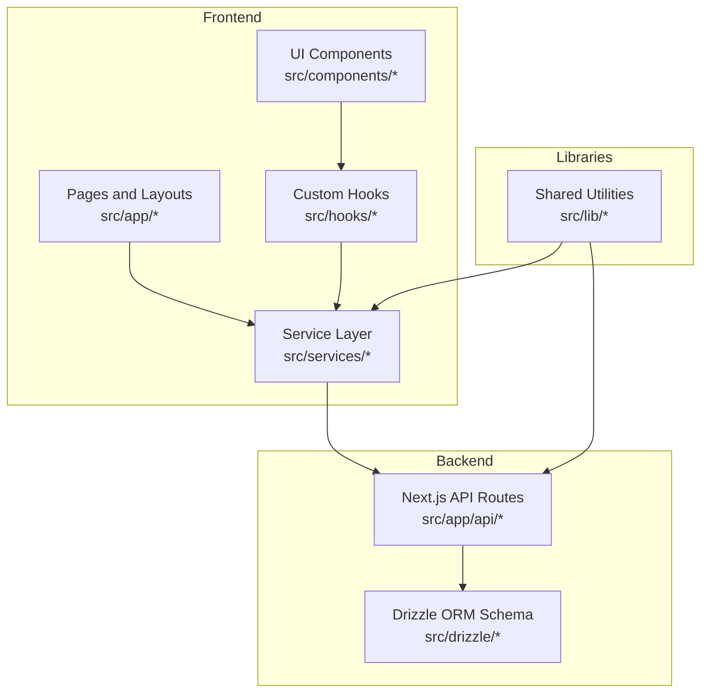

**Diagram sources**
- [layout.tsx](file://src/app/layout.tsx)
- [page.tsx](file://src/app/page.tsx)
- [app-layout.tsx](file://src/components/app-layout.tsx)
- [schema.ts](file://src/drizzle/schema.ts)
- [relations.ts](file://src/drizzle/relations.ts)

**Section sources**
- [layout.tsx](file://src/app/layout.tsx)
- [page.tsx](file://src/app/page.tsx)
- [app-layout.tsx](file://src/components/app-layout.tsx)
- [schema.ts](file://src/drizzle/schema.ts)
- [relations.ts](file://src/drizzle/relations.ts)

## Core Components
This section consolidates the primary UML artifacts and maps them to the current codebase to explain roles, classes, and interactions.

- Use Case Model
  - The use case diagram defines actors (Cashier, Manager, Admin) and their interactions with system features such as product management, purchase processing, sales operations, inventory adjustments, returns, debt management, reporting, and notifications.
  - Actors and boundaries align with the frontend dashboards and backend APIs documented in the UML use case file.

- Functional and Module Class Diagrams
  - Functional overview and module-specific class diagrams illustrate core entities (Product, Purchase, Sale, Stock, User, Notification, Debt, Return, Report, Trash, Settings) and their relationships.
  - These diagrams reflect the Drizzle schema entities and service-layer abstractions present in the codebase.

- Activity Diagrams
  - Activity diagrams model end-to-end workflows for product creation, purchase processing, sales transactions, stock adjustments, returns, debt settlement, notifications, operational costs, user management, and trash handling.

- Sequence Diagrams
  - Sequence diagrams capture critical interactions such as payment processing via external services, notification workflows, data synchronization, and debt settlement flows.

- System Flow Documentation
  - The system flow document complements the UML diagrams by describing high-level flows and integration points.

**Section sources**
- [uml-use-case.puml](file://docs/uml-use-case.puml)
- [uml-class-functional.puml](file://docs/uml-class-functional.puml)
- [uml-class-overview.puml](file://docs/uml-class-overview.puml)
- [uml-class-product-management.puml](file://docs/uml-class-product-management.puml)
- [uml-class-module-a-product.puml](file://docs/uml-class-module-a-product.puml)
- [uml-class-module-b-purchase.puml](file://docs/uml-class-module-b-purchase.puml)
- [uml-class-module-c-stock.puml](file://docs/uml-class-module-c-stock.puml)
- [uml-class-module-d-cashier.puml](file://docs/uml-class-module-d-cashier.puml)
- [uml-class-module-e-return.puml](file://docs/uml-class-module-e-return.puml)
- [uml-class-module-f-debt-payment.puml](file://docs/uml-class-module-f-debt-payment.puml)
- [uml-class-module-g-report.puml](file://docs/uml-class-module-g-report.puml)
- [uml-class-module-h-trash.puml](file://docs/uml-class-module-h-trash.puml)
- [uml-class-module-i-user.puml](file://docs/uml-class-module-i-user.puml)
- [system-flow-uml.md](file://docs/system-flow-uml.md)

## Architecture Overview
The system architecture integrates a React-based frontend with a Next.js backend composed of API routes. The service layer abstracts business logic and data access, while Drizzle ORM manages database schema and relations. Shared libraries provide utilities for formatting, validation, networking, and state management.

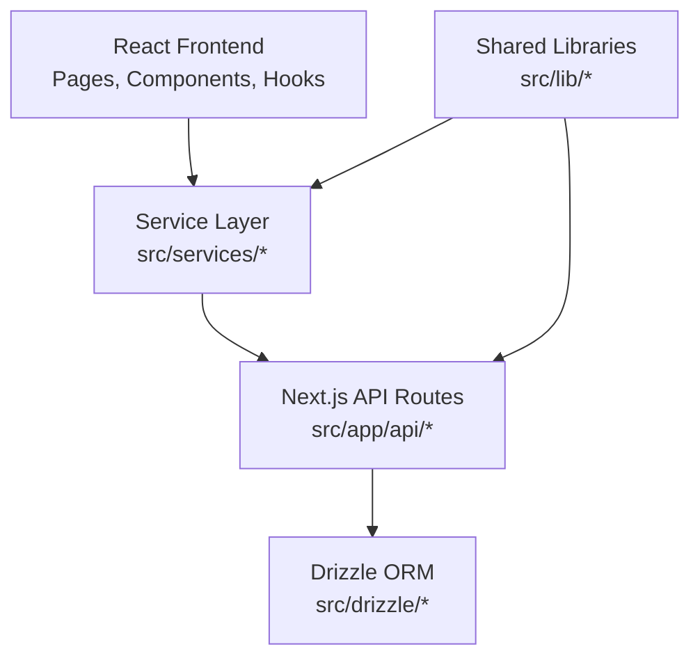

**Diagram sources**
- [layout.tsx](file://src/app/layout.tsx)
- [services/authService.ts](file://src/services/authService.ts)
- [services/productService.ts](file://src/services/productService.ts)
- [services/purchaseService.ts](file://src/services/purchaseService.ts)
- [services/saleService.ts](file://src/services/saleService.ts)
- [services/reportService.ts](file://src/services/reportService.ts)
- [services/notificationService.ts](file://src/services/notificationService.ts)
- [services/debtService.ts](file://src/services/debtService.ts)
- [services/customerReturnService.ts](file://src/services/customerReturnService.ts)
- [schema.ts](file://src/drizzle/schema.ts)
- [type.ts](file://src/drizzle/type.ts)
- [relations.ts](file://src/drizzle/relations.ts)
- [axios.ts](file://src/lib/axios.ts)
- [format.ts](file://src/lib/format.ts)
- [utils.ts](file://src/lib/utils.ts)

## Detailed Component Analysis

### Use Case Model
The use case diagram defines three primary actors and their capabilities:
- Cashier: performs sales, processes returns, handles debt settlements, and prints receipts.
- Manager: manages products, purchases, stock, users, and views reports.
- Admin: manages system settings, master data (categories, units, suppliers, customers), and operational costs.

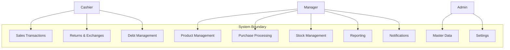

**Diagram sources**
- [uml-use-case.puml](file://docs/uml-use-case.puml)

**Section sources**
- [uml-use-case.puml](file://docs/uml-use-case.puml)

### Functional and Module Class Diagrams
The functional and module class diagrams represent core entities and their relationships. Entities include Product, Purchase, Sale, Stock, User, Notification, Debt, Return, Report, Trash, and Settings. Relationships reflect ownership, composition, and associations as per the Drizzle schema.

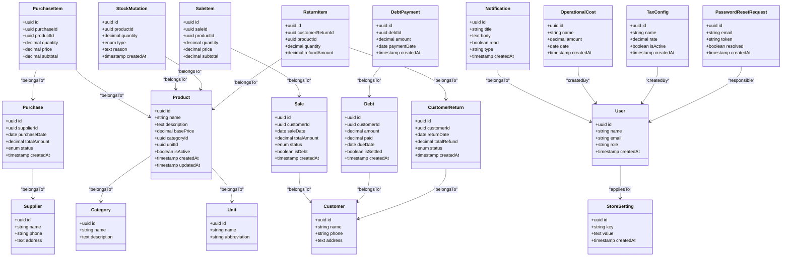

**Diagram sources**
- [uml-class-functional.puml](file://docs/uml-class-functional.puml)
- [uml-class-module-a-product.puml](file://docs/uml-class-module-a-product.puml)
- [uml-class-module-b-purchase.puml](file://docs/uml-class-module-b-purchase.puml)
- [uml-class-module-c-stock.puml](file://docs/uml-class-module-c-stock.puml)
- [uml-class-module-d-cashier.puml](file://docs/uml-class-module-d-cashier.puml)
- [uml-class-module-e-return.puml](file://docs/uml-class-module-e-return.puml)
- [uml-class-module-f-debt-payment.puml](file://docs/uml-class-module-f-debt-payment.puml)
- [uml-class-module-g-report.puml](file://docs/uml-class-module-g-report.puml)
- [uml-class-module-h-trash.puml](file://docs/uml-class-module-h-trash.puml)
- [uml-class-module-i-user.puml](file://docs/uml-class-module-i-user.puml)
- [schema.ts](file://src/drizzle/schema.ts)
- [type.ts](file://src/drizzle/type.ts)
- [relations.ts](file://src/drizzle/relations.ts)

**Section sources**
- [uml-class-functional.puml](file://docs/uml-class-functional.puml)
- [uml-class-module-a-product.puml](file://docs/uml-class-module-a-product.puml)
- [uml-class-module-b-purchase.puml](file://docs/uml-class-module-b-purchase.puml)
- [uml-class-module-c-stock.puml](file://docs/uml-class-module-c-stock.puml)
- [uml-class-module-d-cashier.puml](file://docs/uml-class-module-d-cashier.puml)
- [uml-class-module-e-return.puml](file://docs/uml-class-module-e-return.puml)
- [uml-class-module-f-debt-payment.puml](file://docs/uml-class-module-f-debt-payment.puml)
- [uml-class-module-g-report.puml](file://docs/uml-class-module-g-report.puml)
- [uml-class-module-h-trash.puml](file://docs/uml-class-module-h-trash.puml)
- [uml-class-module-i-user.puml](file://docs/uml-class-module-i-user.puml)
- [schema.ts](file://src/drizzle/schema.ts)
- [type.ts](file://src/drizzle/type.ts)
- [relations.ts](file://src/drizzle/relations.ts)

### Activity Diagrams for Business Workflows
Activity diagrams model end-to-end business processes. Below are representative diagrams mapped to the UML activity files.

- Product Creation Workflow
  - Actor: Manager
  - Steps: Define product attributes, select category and unit, upload images, save and publish.
  - Outcomes: Product created, variants configured, audit logs recorded.

- Purchase Processing Workflow
  - Actor: Manager
  - Steps: Select supplier, add items with quantities/prices, calculate totals, confirm and finalize.
  - Outcomes: Purchase record created, stock mutations updated, supplier balance tracked.

- Sales Transaction Workflow
  - Actor: Cashier
  - Steps: Search/add products, apply discounts/taxes, process payment (cash/card/QRIS), print receipt.
  - Outcomes: Sale record created, stock reduced, debt optionally recorded.

- Inventory Management Workflow
  - Actor: Manager
  - Steps: Adjust stock for opname, add reasons and quantities, update stock levels.
  - Outcomes: Stock mutations recorded, inventory reconciled.

- Returns and Exchanges Workflow
  - Actor: Cashier
  - Steps: Scan receipt, select items to return/exchange, compute refunds, issue credit or replacement.
  - Outcomes: Return records created, stock adjusted, customer notified.

- Debt Management Workflow
  - Actor: Cashier/Manager
  - Steps: Record debt sale, schedule payments, receive partial/full payments, settle debt.
  - Outcomes: Debt and payments tracked, notifications sent.

- Notifications Workflow
  - Actor: System
  - Steps: Trigger events, create notifications, mark read/unread, clear notifications.
  - Outcomes: Users informed of system events.

- Operational Costs and Taxes Workflow
  - Actor: Admin
  - Steps: Add operational costs, configure tax rates, apply to sales.
  - Outcomes: Cost analytics updated, tax configurations enforced.

- User and Master Data Management Workflow
  - Actor: Admin
  - Steps: Manage categories, units, suppliers, customers, users, settings.
  - Outcomes: Master data synchronized across system.

- Trash and Audit Logs Workflow
  - Actor: Admin
  - Steps: Archive deleted records, view audit logs, manage retention.
  - Outcomes: Compliance and traceability maintained.

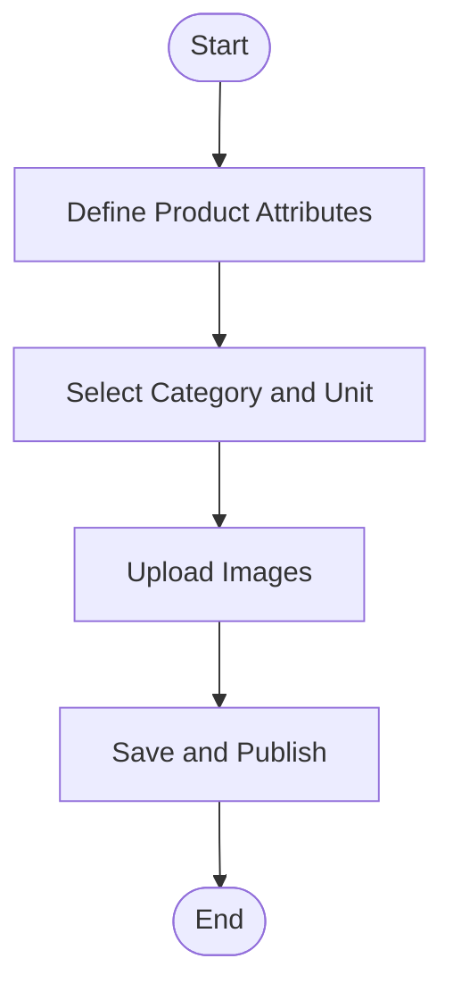

**Diagram sources**
- [uml-activity-product.puml](file://docs/uml-activity-product.puml)

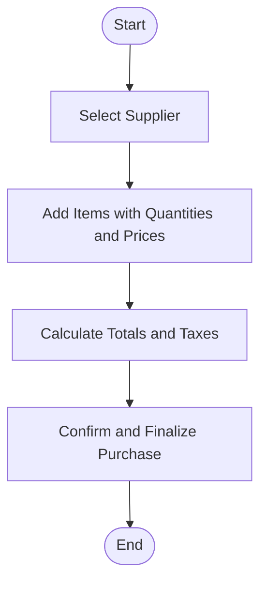

**Diagram sources**
- [uml-activity-purchase.puml](file://docs/uml-activity-purchase.puml)

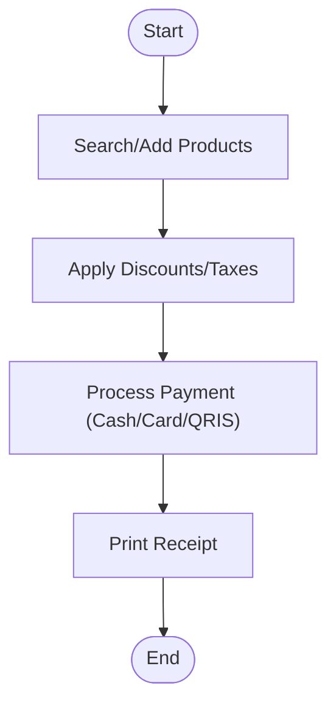

**Diagram sources**
- [uml-activity-sales.puml](file://docs/uml-activity-sales.puml)

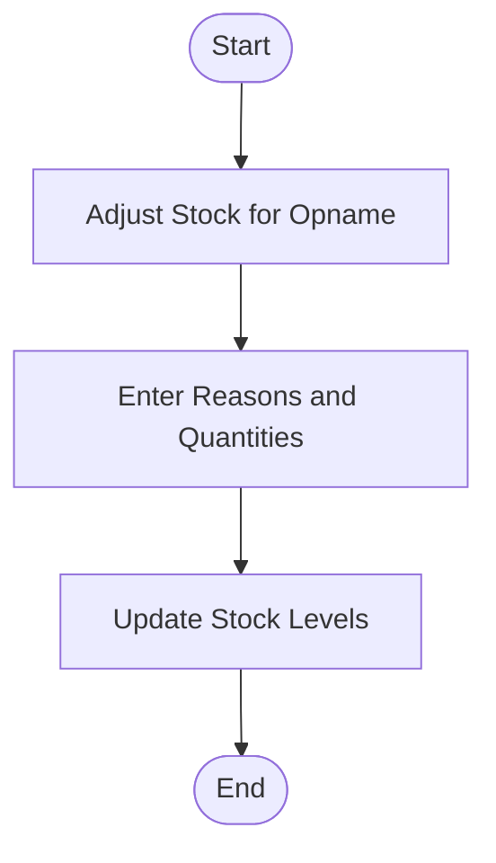

**Diagram sources**
- [uml-activity-stock.puml](file://docs/uml-activity-stock.puml)

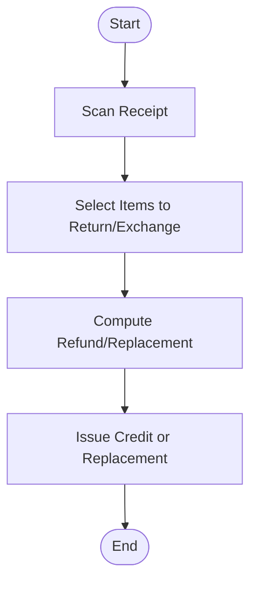

**Diagram sources**
- [uml-activity-return.puml](file://docs/uml-activity-return.puml)

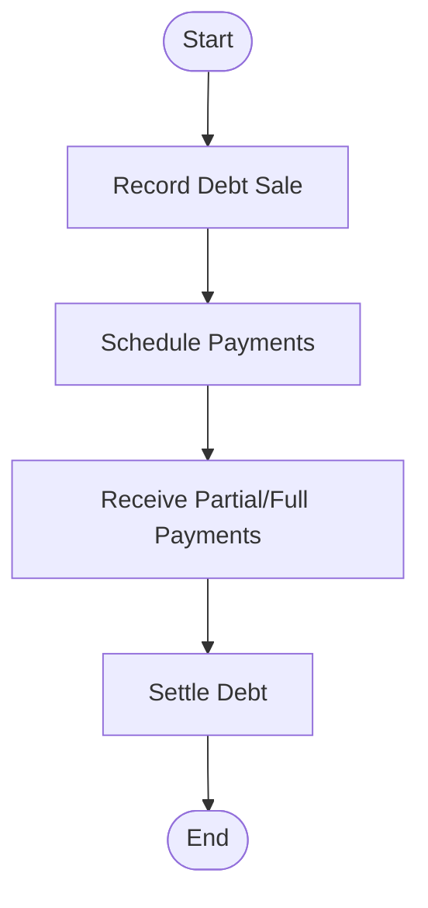

**Diagram sources**
- [uml-activity-debt.puml](file://docs/uml-activity-debt.puml)
- [uml-activity-debt-payment.puml](file://docs/uml-activity-debt-payment.puml)

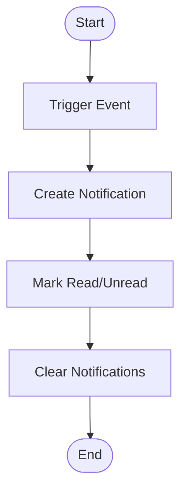

**Diagram sources**
- [uml-activity-notifications.puml](file://docs/uml-activity-notifications.puml)

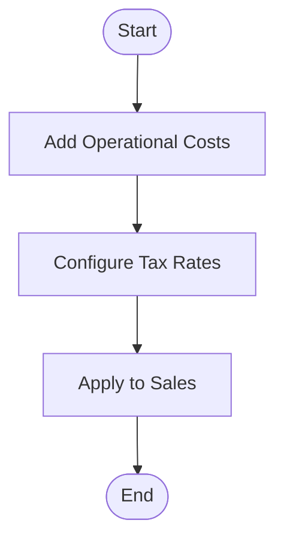

**Diagram sources**
- [uml-activity-operations.puml](file://docs/uml-activity-operations.puml)
- [uml-activity-users.puml](file://docs/uml-activity-users.puml)
- [uml-activity-trash.puml](file://docs/uml-activity-trash.puml)

**Section sources**
- [uml-activity-product.puml](file://docs/uml-activity-product.puml)
- [uml-activity-purchase.puml](file://docs/uml-activity-purchase.puml)
- [uml-activity-sales.puml](file://docs/uml-activity-sales.puml)
- [uml-activity-stock.puml](file://docs/uml-activity-stock.puml)
- [uml-activity-return.puml](file://docs/uml-activity-return.puml)
- [uml-activity-debt.puml](file://docs/uml-activity-debt.puml)
- [uml-activity-debt-payment.puml](file://docs/uml-activity-debt-payment.puml)
- [uml-activity-notifications.puml](file://docs/uml-activity-notifications.puml)
- [uml-activity-operations.puml](file://docs/uml-activity-operations.puml)
- [uml-activity-users.puml](file://docs/uml-activity-users.puml)
- [uml-activity-trash.puml](file://docs/uml-activity-trash.puml)

### Sequence Diagrams for Critical Interactions
Sequence diagrams capture key interactions between frontend, services, API routes, and external systems.

- Payment Processing via QRIS/Pakasir
  - Flow: Cashier initiates payment, system validates cart, calls external payment provider, receives webhook, updates sale status, notifies user.
  - Integration points: Payment provider APIs, webhook endpoint, sale status update.

- Notification Workflow
  - Flow: System triggers event, creates notification record, stores state, displays in panel, allows marking read/clearing.
  - Integration points: Notification service, store, and API routes.

- Data Synchronization
  - Flow: Frontend requests data via services, services call API routes, API routes query Drizzle ORM, response returned to UI.
  - Integration points: React Query, API routes, ORM.

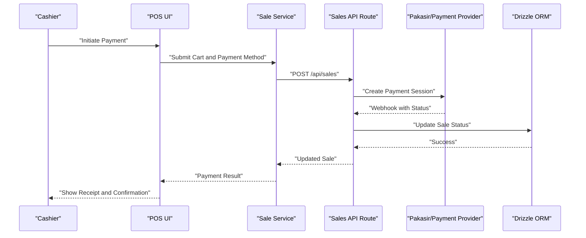

**Diagram sources**
- [uml-sequence-sales.puml](file://docs/uml-sequence-sales.puml)
- [sale-service.ts](file://src/services/saleService.ts)
- [route.ts](file://src/app/api/sales/route.ts)
- [route.ts](file://src/app/api/pakasir-webhook/route.ts)
- [schema.ts](file://src/drizzle/schema.ts)

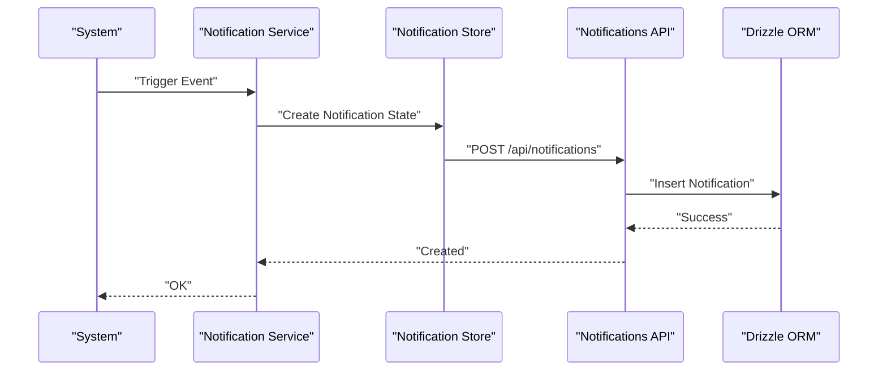

**Diagram sources**
- [uml-sequence-notifications.puml](file://docs/uml-sequence-notifications.puml)
- [notification-service.ts](file://src/services/notificationService.ts)
- [notification-store.ts](file://src/app/api/notifications/_lib/notification-store.ts)
- [route.ts](file://src/app/api/notifications/route.ts)
- [schema.ts](file://src/drizzle/schema.ts)

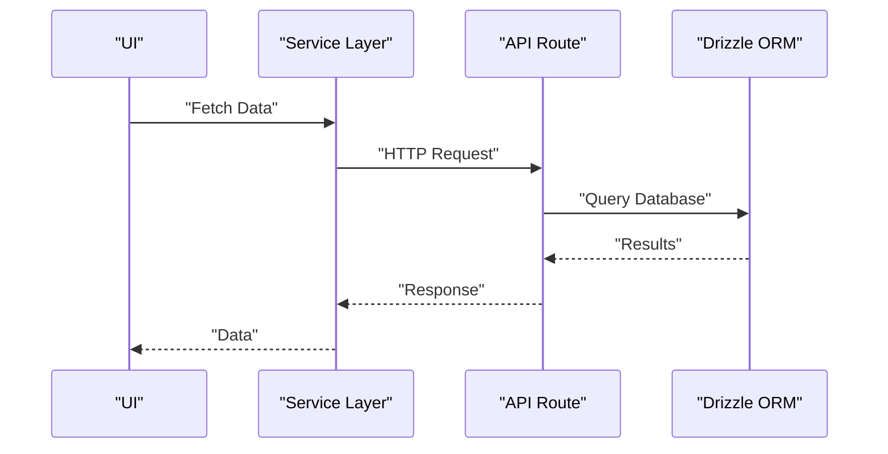

**Diagram sources**
- [uml-sequence-product.puml](file://docs/uml-sequence-product.puml)
- [product-service.ts](file://src/services/productService.ts)
- [route.ts](file://src/app/api/products/route.ts)
- [schema.ts](file://src/drizzle/schema.ts)

**Section sources**
- [uml-sequence-sales.puml](file://docs/uml-sequence-sales.puml)
- [uml-sequence-notifications.puml](file://docs/uml-sequence-notifications.puml)
- [uml-sequence-product.puml](file://docs/uml-sequence-product.puml)
- [sale-service.ts](file://src/services/saleService.ts)
- [notification-service.ts](file://src/services/notificationService.ts)
- [notification-store.ts](file://src/app/api/notifications/_lib/notification-store.ts)
- [route.ts](file://src/app/api/sales/route.ts)
- [route.ts](file://src/app/api/pakasir-webhook/route.ts)
- [route.ts](file://src/app/api/notifications/route.ts)
- [route.ts](file://src/app/api/products/route.ts)
- [schema.ts](file://src/drizzle/schema.ts)

### Conceptual Overview
This section provides conceptual diagrams that illustrate high-level flows without mapping to specific source files.

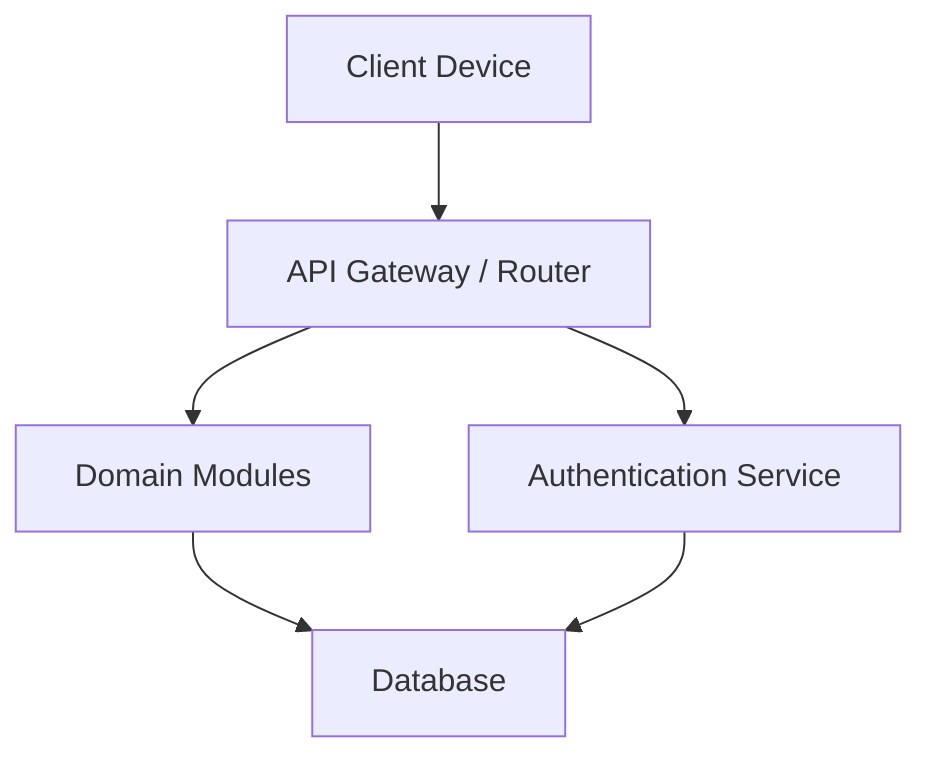

[No sources needed since this diagram shows conceptual workflow, not actual code structure]

## Dependency Analysis
The system exhibits clear separation of concerns:
- UI depends on services for data operations.
- Services encapsulate business logic and coordinate with API routes.
- API routes handle HTTP concerns and delegate to ORM for persistence.
- Shared libraries provide cross-cutting utilities.

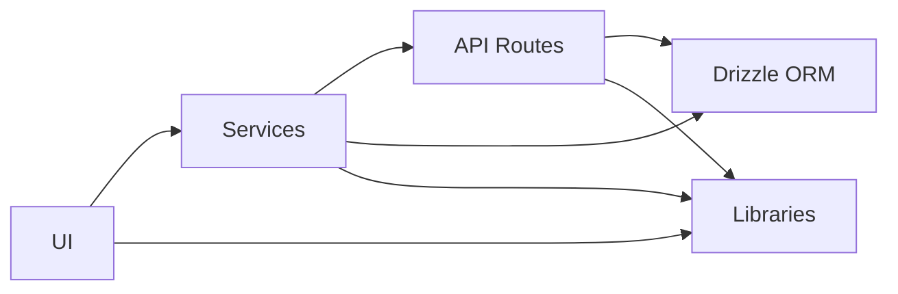

**Diagram sources**
- [layout.tsx](file://src/app/layout.tsx)
- [services/authService.ts](file://src/services/authService.ts)
- [services/productService.ts](file://src/services/productService.ts)
- [services/purchaseService.ts](file://src/services/purchaseService.ts)
- [services/saleService.ts](file://src/services/saleService.ts)
- [services/reportService.ts](file://src/services/reportService.ts)
- [services/notificationService.ts](file://src/services/notificationService.ts)
- [services/debtService.ts](file://src/services/debtService.ts)
- [services/customerReturnService.ts](file://src/services/customerReturnService.ts)
- [schema.ts](file://src/drizzle/schema.ts)
- [axios.ts](file://src/lib/axios.ts)
- [utils.ts](file://src/lib/utils.ts)

**Section sources**
- [layout.tsx](file://src/app/layout.tsx)
- [services/authService.ts](file://src/services/authService.ts)
- [services/productService.ts](file://src/services/productService.ts)
- [services/purchaseService.ts](file://src/services/purchaseService.ts)
- [services/saleService.ts](file://src/services/saleService.ts)
- [services/reportService.ts](file://src/services/reportService.ts)
- [services/notificationService.ts](file://src/services/notificationService.ts)
- [services/debtService.ts](file://src/services/debtService.ts)
- [services/customerReturnService.ts](file://src/services/customerReturnService.ts)
- [schema.ts](file://src/drizzle/schema.ts)
- [axios.ts](file://src/lib/axios.ts)
- [utils.ts](file://src/lib/utils.ts)

## Performance Considerations
- Minimize unnecessary re-renders by leveraging React Query caching and optimistic updates in UI components.
- Batch API calls for bulk operations (e.g., stock adjustments, purchase entries) to reduce network overhead.
- Use server-side filtering and pagination for large datasets (products, sales, purchases).
- Offload heavy computations to services or background jobs where appropriate.
- Cache frequently accessed master data (categories, units, suppliers) in memory or local storage.

[No sources needed since this section provides general guidance]

## Troubleshooting Guide
Common issues and resolutions grounded in the codebase:
- Authentication failures: Verify login API route and auth service implementation; check token handling and refresh mechanisms.
- Notification delivery: Ensure notification store and API routes are invoked; confirm read/unread/clear endpoints are reachable.
- Debt settlement errors: Validate debt service logic and payment webhook handling; confirm ORM updates for debt and payments.
- Return processing: Confirm return service logic and stock mutation updates; verify return item calculations.
- Data inconsistencies: Review Drizzle schema and relations; ensure proper foreign key constraints and cascading rules.

**Section sources**
- [route.ts](file://src/app/api/auth/login/route.ts)
- [auth-service.ts](file://src/services/authService.ts)
- [notification-store.ts](file://src/app/api/notifications/_lib/notification-store.ts)
- [route.ts](file://src/app/api/notifications/route.ts)
- [debt-service.ts](file://src/services/debtService.ts)
- [route.ts](file://src/app/api/debts/route.ts)
- [return-service.ts](file://src/services/customerReturnService.ts)
- [route.ts](file://src/app/api/customer-returns/route.ts)
- [schema.ts](file://src/drizzle/schema.ts)
- [relations.ts](file://src/drizzle/relations.ts)

## Conclusion
The UML documentation consolidates the existing diagrams with the current codebase to provide a coherent understanding of the POS system’s architecture, roles, workflows, and interactions. By aligning the frontend, backend, services, and ORM with the UML models, stakeholders can effectively communicate and evolve the system design.

[No sources needed since this section summarizes without analyzing specific files]

## Appendices

### UML Notation Standards and Interpretation
- Use cases: Represented as ovals inside a system boundary; actors as stick figures outside.
- Classes: Enclosed rectangles with attributes and methods; relationships shown with lines and arrows.
- Activities: Rounded rectangles for steps, diamonds for decisions; arrows indicate flow direction.
- Sequences: Vertical lifelines with activation boxes; messages show interactions; dashed lines for return values.
- System flows: Rectangles for components, arrows for data/control flow.

[No sources needed since this section provides general guidance]

### Presentation Guide for Stakeholders
- Start with the use case diagram to establish user roles and scope.
- Present class diagrams to explain core entities and relationships.
- Walk through activity diagrams to demonstrate end-to-end workflows.
- Use sequence diagrams to highlight critical integrations (payments, notifications).
- Conclude with system flow documentation to tie everything together.

**Section sources**
- [uml-presentation-guide.md](file://docs/uml-presentation-guide.md)

### System Flow Documentation
The system flow document complements UML diagrams by detailing high-level flows and integration points across modules.

**Section sources**
- [system-flow-uml.md](file://docs/system-flow-uml.md)

### Additional UML Documentation Examples
Examples of completed diagrams are available in the docs directory and can serve as templates for new diagrams:
- Use case diagram
- Functional and module class diagrams
- Activity diagrams for product, purchase, sales, stock, return, debt, notifications, operations, users, and trash
- Sequence diagrams for product, purchase, sales, stock, return, debt, debt payment, notifications, operations, users, and trash

**Section sources**
- [uml-use-case.puml](file://docs/uml-use-case.puml)
- [uml-class-functional.puml](file://docs/uml-class-functional.puml)
- [uml-class-module-a-product.puml](file://docs/uml-class-module-a-product.puml)
- [uml-class-module-b-purchase.puml](file://docs/uml-class-module-b-purchase.puml)
- [uml-class-module-c-stock.puml](file://docs/uml-class-module-c-stock.puml)
- [uml-class-module-d-cashier.puml](file://docs/uml-class-module-d-cashier.puml)
- [uml-class-module-e-return.puml](file://docs/uml-class-module-e-return.puml)
- [uml-class-module-f-debt-payment.puml](file://docs/uml-class-module-f-debt-payment.puml)
- [uml-class-module-g-report.puml](file://docs/uml-class-module-g-report.puml)
- [uml-class-module-h-trash.puml](file://docs/uml-class-module-h-trash.puml)
- [uml-class-module-i-user.puml](file://docs/uml-class-module-i-user.puml)
- [uml-activity-product.puml](file://docs/uml-activity-product.puml)
- [uml-activity-purchase.puml](file://docs/uml-activity-purchase.puml)
- [uml-activity-sales.puml](file://docs/uml-activity-sales.puml)
- [uml-activity-stock.puml](file://docs/uml-activity-stock.puml)
- [uml-activity-return.puml](file://docs/uml-activity-return.puml)
- [uml-activity-debt.puml](file://docs/uml-activity-debt.puml)
- [uml-activity-debt-payment.puml](file://docs/uml-activity-debt-payment.puml)
- [uml-activity-notifications.puml](file://docs/uml-activity-notifications.puml)
- [uml-activity-operations.puml](file://docs/uml-activity-operations.puml)
- [uml-activity-users.puml](file://docs/uml-activity-users.puml)
- [uml-activity-trash.puml](file://docs/uml-activity-trash.puml)
- [uml-sequence-product.puml](file://docs/uml-sequence-product.puml)
- [uml-sequence-purchase.puml](file://docs/uml-sequence-purchase.puml)
- [uml-sequence-sales.puml](file://docs/uml-sequence-sales.puml)
- [uml-sequence-stock.puml](file://docs/uml-sequence-stock.puml)
- [uml-sequence-return.puml](file://docs/uml-sequence-return.puml)
- [uml-sequence-debt.puml](file://docs/uml-sequence-debt.puml)
- [uml-sequence-debt-payment.puml](file://docs/uml-sequence-debt-payment.puml)
- [uml-sequence-notifications.puml](file://docs/uml-sequence-notifications.puml)
- [uml-sequence-operations.puml](file://docs/uml-sequence-operations.puml)
- [uml-sequence-users.puml](file://docs/uml-sequence-users.puml)
- [uml-sequence-trash.puml](file://docs/uml-sequence-trash.puml)