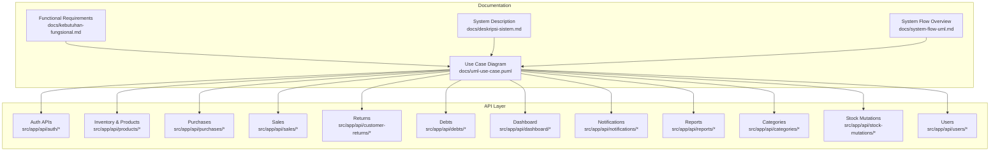
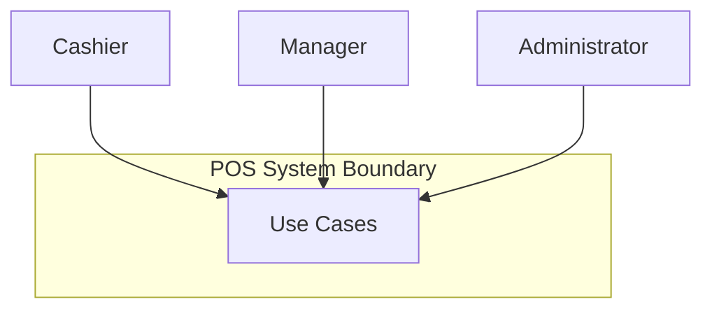
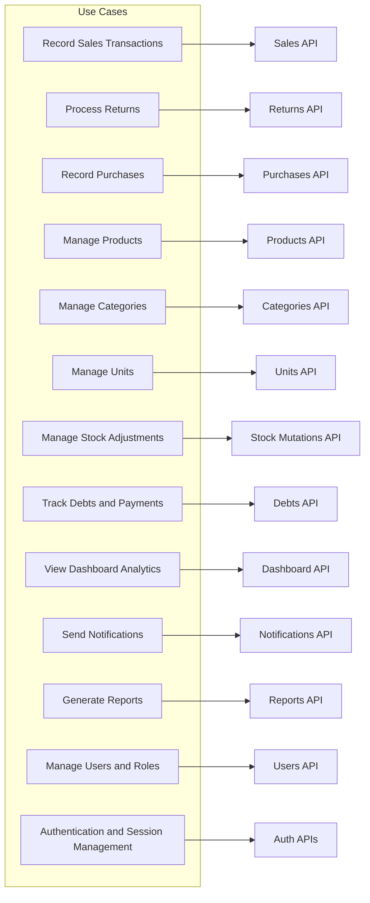
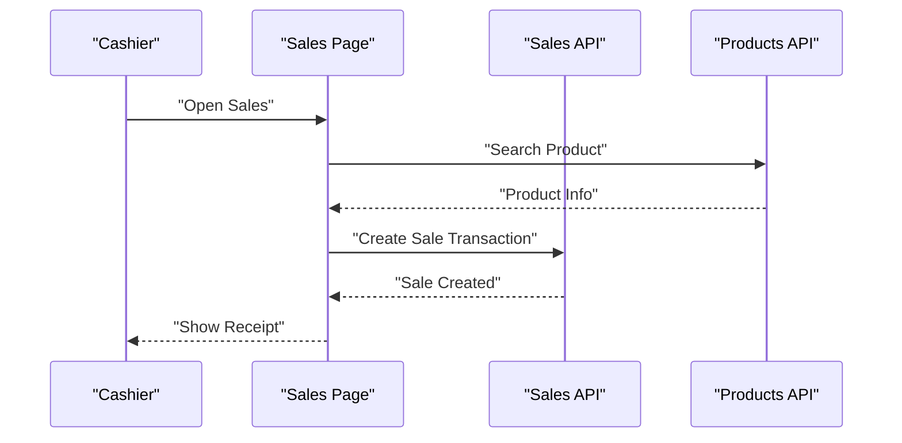
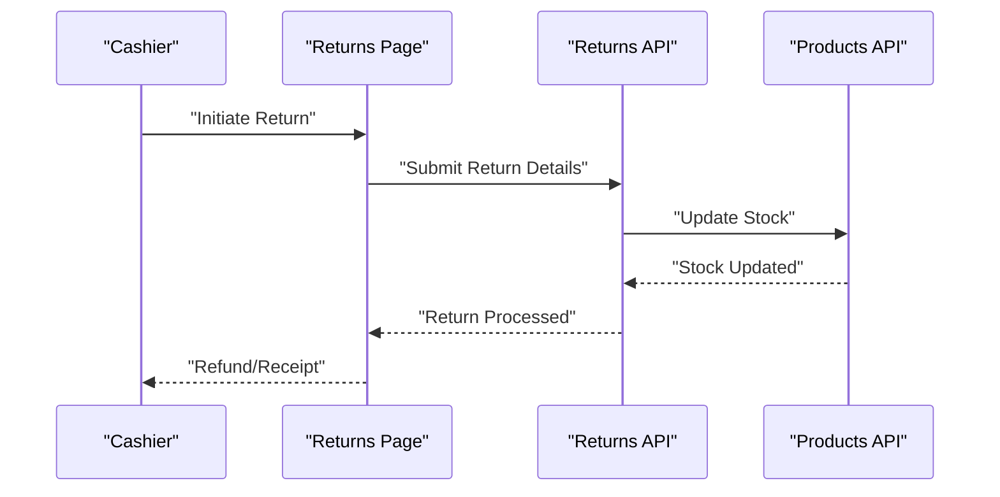
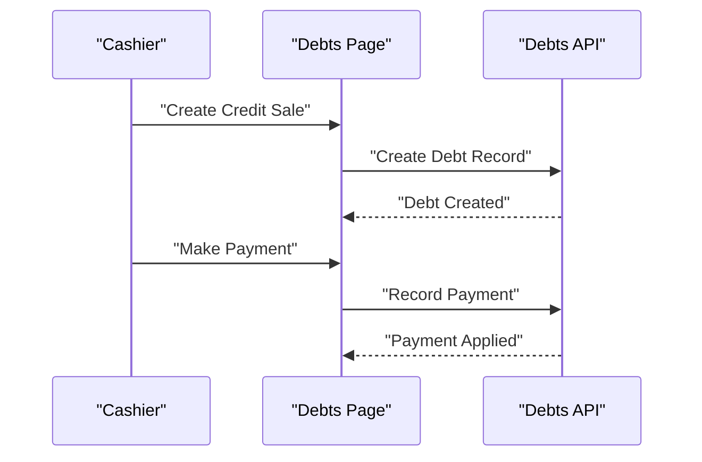
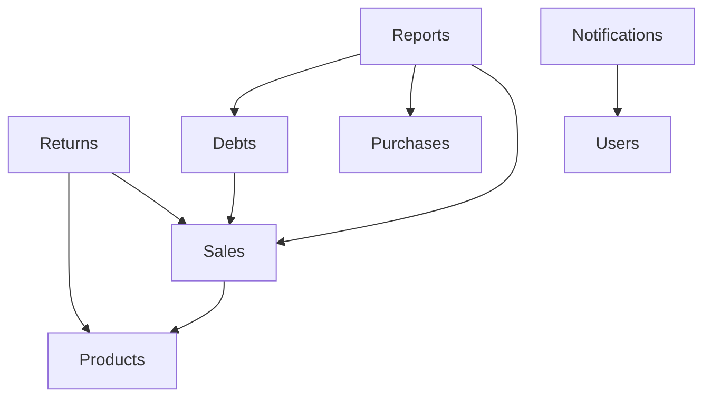

# Use Case Diagrams

<cite>
**Referenced Files in This Document**
- [uml-use-case.puml](file://docs/uml-use-case.puml)
- [deskripsi-sistem.md](file://docs/deskripsi-sistem.md)
- [kebutuhan-fungsional.md](file://docs/kebutuhan-fungsional.md)
- [system-flow-uml.md](file://docs/system-flow-uml.md)
- [uml-class-functional.puml](file://docs/uml-class-functional.puml)
- [product-service-api](file://src/app/api/products/route.ts)
- [purchase-service-api](file://src/app/api/purchases/route.ts)
- [sale-service-api](file://src/app/api/sales/route.ts)
- [customer-return-service-api](file://src/app/api/customer-returns/route.ts)
- [debt-service-api](file://src/app/api/debts/route.ts)
- [dashboard-service-api](file://src/app/api/dashboard/route.ts)
- [notification-service-api](file://src/app/api/notifications/route.ts)
- [user-service-api](file://src/app/api/users/route.ts)
- [category-service-api](file://src/app/api/categories/route.ts)
- [stock-service-api](file://src/app/api/stock-mutations/route.ts)
- [report-service-api](file://src/app/api/reports/route.ts)
- [auth-login-api](file://src/app/api/auth/login/route.ts)
- [auth-register-api](file://src/app/api/auth/register/route.ts)
- [auth-logout-api](file://src/app/api/auth/logout/route.ts)
- [auth-me-api](file://src/app/api/auth/me/route.ts)
</cite>

## Table of Contents
1. [Introduction](#introduction)
2. [Project Structure](#project-structure)
3. [Core Components](#core-components)
4. [Architecture Overview](#architecture-overview)
5. [Detailed Component Analysis](#detailed-component-analysis)
6. [Dependency Analysis](#dependency-analysis)
7. [Performance Considerations](#performance-considerations)
8. [Troubleshooting Guide](#troubleshooting-guide)
9. [Conclusion](#conclusion)
10. [Appendices](#appendices)

## Introduction
This document provides comprehensive use case diagram documentation for the Point of Sale (POS) application. It explains how to interpret use case diagrams, define system boundaries, map functional requirements to use cases, and apply best practices for creating and maintaining use case documentation. The POS system supports cashier transactions, inventory management, purchasing, returns, debt handling, reporting, notifications, and user administration. The diagrams and guidelines here help stakeholders visualize user workflows, actor roles, and system capabilities.

## Project Structure
The POS application is a Next.js-based web application with a modular frontend and a set of REST-like API routes grouped by domain capabilities. The use case documentation references:
- Functional requirement and system description documents
- UML use case diagram source
- Domain-specific API route files that implement use case functionality

**Diagram sources**
- [uml-use-case.puml](file://docs/uml-use-case.puml)
- [kebutuhan-fungsional.md](file://docs/kebutuhan-fungsional.md)
- [deskripsi-sistem.md](file://docs/deskripsi-sistem.md)
- [system-flow-uml.md](file://docs/system-flow-uml.md)

**Section sources**
- [uml-use-case.puml](file://docs/uml-use-case.puml)
- [kebutuhan-fungsional.md](file://docs/kebutuhan-fungsional.md)
- [deskripsi-sistem.md](file://docs/deskripsi-sistem.md)
- [system-flow-uml.md](file://docs/system-flow-uml.md)

## Core Components
This section defines the primary actors and major use cases that structure the POS application’s functional scope. Use cases represent tasks performed by actors to achieve specific goals within the system.

- Actors
  - Cashier: Performs sales transactions, handles returns, and manages daily operations.
  - Manager: Oversees inventory, purchases, reports, and user administration.
  - Administrator: Manages system users, roles, and global configurations.

- Major Use Cases
  - Manage Products (inventory CRUD, variants, audit logs)
  - Manage Categories
  - Manage Units
  - Record Sales Transactions
  - Process Returns
  - Record Purchases
  - Manage Stock Adjustments
  - Track Debts and Payments
  - View Dashboard Analytics
  - Send Notifications
  - Generate Reports
  - Manage Users and Roles
  - Authentication and Session Management

These use cases correspond to domain areas implemented by the API routes and UI pages in the application.

**Section sources**
- [uml-use-case.puml](file://docs/uml-use-case.puml)
- [kebutuhan-fungsional.md](file://docs/kebutuhan-fungsional.md)
- [deskripsi-sistem.md](file://docs/deskripsi-sistem.md)

## Architecture Overview
The POS system follows a layered architecture:
- Presentation layer: Next.js pages and components
- API layer: Route handlers implementing use case logic
- Data layer: Drizzle ORM schema and database tables

Use case diagrams capture the system boundary and show how actors interact with use cases. The API routes implement the behavior behind each use case.

[No sources needed since this diagram shows conceptual architecture, not a direct code mapping]

## Detailed Component Analysis

### Use Case Diagram Interpretation
- System boundary: Defined by the scope of supported use cases (transactions, inventory, purchases, returns, debts, reports, notifications, users).
- Actor roles:
  - Cashier: Initiates sales, returns, and daily operations.
  - Manager: Maintains inventory, reviews reports, and administers users.
  - Administrator: Controls user accounts and system settings.
- Use case relationships:
  - Include: Some use cases rely on others (e.g., Sales may include Inventory Updates).
  - Extend: Optional behavior (e.g., Debt Payment extends Sales).
  - Generalization: Roles may share common capabilities.

Best practices for reading use case diagrams:
- Identify the actor’s goal and the resulting value delivered by the use case.
- Look for included or extended use cases to understand optional or prerequisite steps.
- Verify system boundaries by ensuring all covered functionality maps to implemented API routes.

**Section sources**
- [uml-use-case.puml](file://docs/uml-use-case.puml)

### Use Case-to-API Mapping
Each use case corresponds to one or more API routes that implement the required functionality. The following mapping demonstrates how use cases connect to backend endpoints:

**Diagram sources**
- [sale-service-api](file://src/app/api/sales/route.ts)
- [customer-return-service-api](file://src/app/api/customer-returns/route.ts)
- [purchase-service-api](file://src/app/api/purchases/route.ts)
- [product-service-api](file://src/app/api/products/route.ts)
- [category-service-api](file://src/app/api/categories/route.ts)
- [stock-service-api](file://src/app/api/stock-mutations/route.ts)
- [debt-service-api](file://src/app/api/debts/route.ts)
- [dashboard-service-api](file://src/app/api/dashboard/route.ts)
- [notification-service-api](file://src/app/api/notifications/route.ts)
- [report-service-api](file://src/app/api/reports/route.ts)
- [user-service-api](file://src/app/api/users/route.ts)
- [auth-login-api](file://src/app/api/auth/login/route.ts)
- [auth-register-api](file://src/app/api/auth/register/route.ts)
- [auth-logout-api](file://src/app/api/auth/logout/route.ts)
- [auth-me-api](file://src/app/api/auth/me/route.ts)

**Section sources**
- [sale-service-api](file://src/app/api/sales/route.ts)
- [customer-return-service-api](file://src/app/api/customer-returns/route.ts)
- [purchase-service-api](file://src/app/api/purchases/route.ts)
- [product-service-api](file://src/app/api/products/route.ts)
- [category-service-api](file://src/app/api/categories/route.ts)
- [stock-service-api](file://src/app/api/stock-mutations/route.ts)
- [debt-service-api](file://src/app/api/debts/route.ts)
- [dashboard-service-api](file://src/app/api/dashboard/route.ts)
- [notification-service-api](file://src/app/api/notifications/route.ts)
- [report-service-api](file://src/app/api/reports/route.ts)
- [user-service-api](file://src/app/api/users/route.ts)
- [auth-login-api](file://src/app/api/auth/login/route.ts)
- [auth-register-api](file://src/app/api/auth/register/route.ts)
- [auth-logout-api](file://src/app/api/auth/logout/route.ts)
- [auth-me-api](file://src/app/api/auth/me/route.ts)

### Use Case Workflow Examples

#### Example: Record Sales Transactions
This use case involves the cashier capturing items, calculating totals, applying discounts or taxes, and finalizing the sale. The process typically includes:
- Search and select products
- Add items to cart
- Apply customer and payment details
- Generate receipt and update inventory

**Diagram sources**
- [sale-service-api](file://src/app/api/sales/route.ts)
- [product-service-api](file://src/app/api/products/route.ts)

**Section sources**
- [sale-service-api](file://src/app/api/sales/route.ts)
- [product-service-api](file://src/app/api/products/route.ts)

#### Example: Process Returns
Returns involve validating return eligibility, restocking items, issuing refunds, and updating records.

**Diagram sources**
- [customer-return-service-api](file://src/app/api/customer-returns/route.ts)
- [product-service-api](file://src/app/api/products/route.ts)

**Section sources**
- [customer-return-service-api](file://src/app/api/customer-returns/route.ts)
- [product-service-api](file://src/app/api/products/route.ts)

#### Example: Track Debts and Payments
Debt tracking allows recording sales on credit and processing partial/full payments over time.

**Diagram sources**
- [debt-service-api](file://src/app/api/debts/route.ts)

**Section sources**
- [debt-service-api](file://src/app/api/debts/route.ts)

### Best Practices for Creating Use Case Documentation
- Define clear system boundaries based on functional requirements.
- Model actors by their roles and goals; avoid conflating roles with implementation details.
- Use Include/Extend relationships to express mandatory and optional behaviors.
- Keep use case names concise and goal-oriented; write brief descriptions linking to detailed activity diagrams.
- Map each use case to concrete API routes and UI pages to ensure traceability.
- Validate use cases against the system description and functional requirements documents.

**Section sources**
- [kebutuhan-fungsional.md](file://docs/kebutuhan-fungsional.md)
- [deskripsi-sistem.md](file://docs/deskripsi-sistem.md)
- [uml-use-case.puml](file://docs/uml-use-case.puml)

## Dependency Analysis
Use case dependencies reflect how functionality builds upon shared capabilities:
- Sales depends on Products and Payments
- Returns depends on Sales and Products
- Debts depend on Sales and Payments
- Reports depend on Sales, Purchases, and Debts
- Notifications depend on Users and system events

[No sources needed since this diagram shows conceptual dependencies, not a direct code mapping]

## Performance Considerations
- Minimize cross-domain API calls within a single use case to reduce latency.
- Batch related operations (e.g., multiple item additions) to reduce network overhead.
- Cache frequently accessed reference data (categories, units) to improve responsiveness.
- Ensure database queries for inventory updates are efficient and transactional.

[No sources needed since this section provides general guidance]

## Troubleshooting Guide
Common issues when working with use case documentation:
- Misaligned use cases: If a use case lacks supporting API routes, revisit requirements and refine scope.
- Unclear boundaries: Consult the system description and functional requirements to clarify inclusion criteria.
- Missing relationships: Review Include/Extend links to ensure optional and prerequisite behaviors are captured.

Recommended actions:
- Cross-reference use case diagrams with API route implementations.
- Validate use cases against activity diagrams and sequence diagrams.
- Maintain traceability matrices linking requirements to use cases and test scenarios.

**Section sources**
- [deskripsi-sistem.md](file://docs/deskripsi-sistem.md)
- [kebutuhan-fungsional.md](file://docs/kebutuhan-fungsional.md)
- [uml-use-case.puml](file://docs/uml-use-case.puml)

## Conclusion
Use case diagrams provide a high-level view of the POS application’s functional landscape, aligning actors’ goals with system capabilities. By clearly defining system boundaries, modeling actor interactions, and mapping use cases to API implementations, teams can maintain coherent documentation that supports development, testing, and stakeholder communication. Applying the best practices outlined here ensures accurate, actionable use case documentation.

[No sources needed since this section summarizes without analyzing specific files]

## Appendices

### Appendix A: System Scope and Boundaries
- Included domains: Sales, Returns, Purchases, Inventory (Products/Categories/Units), Debts, Dashboard, Notifications, Reports, Users.
- Excluded domains: Third-party integrations not yet implemented (e.g., external payment gateways beyond built-in mechanisms).

**Section sources**
- [deskripsi-sistem.md](file://docs/deskripsi-sistem.md)
- [system-flow-uml.md](file://docs/system-flow-uml.md)

### Appendix B: Functional Requirements Reference
- Use the functional requirements document to validate whether a use case is within scope and to derive detailed descriptions and acceptance criteria.

**Section sources**
- [kebutuhan-fungsional.md](file://docs/kebutuhan-fungsional.md)

### Appendix C: Completed Use Case Diagram
- The official use case diagram is available in the documentation folder and serves as the canonical reference for current system coverage.

**Section sources**
- [uml-use-case.puml](file://docs/uml-use-case.puml)